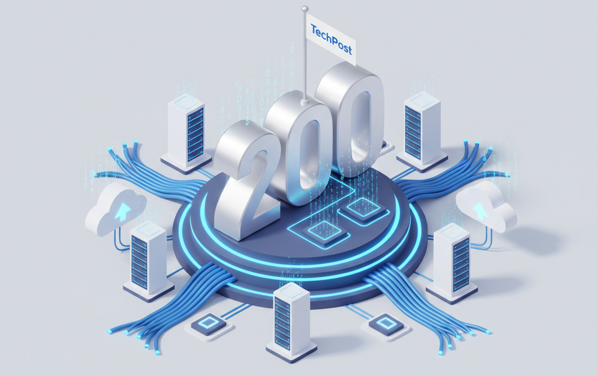

# 200 Articles on TechPost

**Nicolas Fevrier - 11/20/2025**

## Introduction

## Platforms / Line Cards Deepdive

### ACX7000 Series

- **ACX7100 Deepdive** (By Pankaj Kumar and Nicolas Fevrier)

[https://juniper.github.io/techposts/acx7100-deepdive/article](https://juniper.github.io/techposts/acx7100-deepdive/article)

*Learn everything about the first two Juniper Cloud-Metro devices: ACX7100-32C and ACX7100-48L.*
*Maximum number of ports, naming convention, blog diagrams, port numbering, configurations, blocks and limitations.*
- **ACX7024 Deepdive** (By Pankaj Kumar)

[https://juniper.github.io/techposts/acx7024-deepdive/article](https://juniper.github.io/techposts/acx7024-deepdive/article)

*Maximum number of ports, naming convention, blog diagrams, port numbering, configurations, blocks and limitations.*
- **Introducing the ACX7024X** (By Nicolas Fevrier)

[https://juniper.github.io/techposts/introducing-the-acx7024x/article](https://juniper.github.io/techposts/introducing-the-acx7024x/article)

*What does differentiate the ACX7024X from the ACX7024 devices? In this short article, we will explain the differences and the motivation behind the creation of this new router.*
- **ACX7509 Deepdive** (By Nicolas Fevrier)

[https://juniper.github.io/techposts/acx7509-deepdive/article](https://juniper.github.io/techposts/acx7509-deepdive/article)

*The first centralized platform of the ACX7000 family. Based on a modular design, it offers control plane and forwarding plane redundancy with port density spanning from 1GE to 400GE, in just 5RU.*
- **ACX7000 Hardware Profiles** (By Nicolas Fevrier)

[https://juniper.github.io/techposts/acx7000-hardware-profiles/article](https://juniper.github.io/techposts/acx7000-hardware-profiles/article)

*An overview of the different hardware profiles available on the ACX7000 Series, and what is changing in the latest Junos releases. *
- **Everything You Always Wanted to Know about ACX7000** (By Nicolas Fevrier)

[https://juniper.github.io/techposts/everything-about-acx7000/article](https://juniper.github.io/techposts/everything-about-acx7000/article)

### MX Series

- **MX10000 LC9600 Deepdive** (By Deepak Tripathi)

[https://juniper.github.io/techposts/mx10000-lc9600-deepdive/article](https://juniper.github.io/techposts/mx10000-lc9600-deepdive/article)

*Covers the Trio6 description and Life of a packet, then the LC9600 "Alpha Romeo" in details*
- **MX10000 LC480 Deepdive** (By Deepak Tripathi)

[https://juniper.github.io/techposts/mx10000-lc480-deepdive/article](https://juniper.github.io/techposts/mx10000-lc480-deepdive/article)

*Covers the Trio4 description and Life of a packet, then the LC480 "Daniel" in details*
- **MPC10E Deepdive** (By Deepak Tripathi)

[https://juniper.github.io/techposts/mpc10e-deepdive/article](https://juniper.github.io/techposts/mpc10e-deepdive/article)

*A detailed view of the MPC10E line cards used in MX240, MX480 and MX480. With detailed coverage of the Trio5 and the life of a packet.  *
- **MX304 Deepdive**(By Reema Ray and Nicolas Fevrier)

[https://juniper.github.io/techposts/mx304-deepdive/article](https://juniper.github.io/techposts/mx304-deepdive/article)

*A detailed review of the latest router of the MX Series. Powered by Trio6 PFE, it offers unique form-factor and modularity, with interface spanning from 1GE to 400GE and control-plane redundancy.*
- **MX10000 LC4800 Deepdive** (By Eswaran Srinivasan and Nicolas Fevrier)

[https://juniper.github.io/techposts/mx10000-lc4800-deepdive/article](https://juniper.github.io/techposts/mx10000-lc4800-deepdive/article)

*A detailed description of the latest MX10000 Series new line card, offering a mix of QSFP-DD and SFP-DD ports, and powered by three Trio 6 Forwarding ASICs*
- **MX10000 LC4802 Deepdive** (By Eswaran Srinivasan and Nicolas Fevrier)

[https://juniper.github.io/techposts/mx10000-lc4802-deepdive/article](https://juniper.github.io/techposts/mx10000-lc4802-deepdive/article)

*A detailed description of the latest MX10000 Series line card LC4802, completing the existing LC4800 but with only QSFP ports. This new card is powered by three Trio 6 Forwarding ASICs.*

### PTX Series

- **PTX10001-36MR Introduction** (By Dmitry Shokarev)

[https://juniper.github.io/techposts/ptx10001-36mr-introduction/article](https://juniper.github.io/techposts/ptx10001-36mr-introduction/article)

*Express 4 deepdive, platform architecture (forwarding and control plane), port distribution, timing, port and cooling details.*
- **Introducing PTX10002-36QDD** (By Nicolas Fevrier)

[https://juniper.github.io/techposts/introducing-ptx10002-36qdd/article](https://juniper.github.io/techposts/introducing-ptx10002-36qdd/article)

*The new Juniper PTX10002-36QDD is here. It's our first 800GigabitEthernet, deep-buffer, high-scale, router in the market, powered by Express 5. And we are very excited to share some details about this unique platform.*
- **LC1301: Introducing Express5 in PTX10K Chassis** (By Nicolas Fevrier)

[https://juniper.github.io/techposts/introducing-express5-in-ptx10k-chassis/article](https://juniper.github.io/techposts/introducing-express5-in-ptx10k-chassis/article)

*A detailed description of the latest line cards, fabric cards, power supply modules and fan trays introduced in the PTX10000 chassis, enabling the power of the Express5 chipset and 800GbE interfaces in modular form-factor routers.*

### QFX Series

- **From QFX5100 to QFX5120** (By Nicole Henry)

[https://juniper.github.io/techposts/from-qfx5100-to-qfx5120/article](https://juniper.github.io/techposts/from-qfx5100-to-qfx5120/article)

*Explore the software and hardware differences you will encounter regarding switch connectivity when transitioning from the end-of-life QFX5100-48S and QFX5100-48T switches to the replacement QFX5120-48T and QFX5120-48Y switches. *

## Routing

### SRv6

- **SRv6 Basics: Locator and End SIDs** (By Krzysztof Szarkowicz)

[https://juniper.github.io/techposts/srv6-basics-locator-and-end-sids/article](https://juniper.github.io/techposts/srv6-basics-locator-and-end-sids/article)

*Part1 of Krzysztof's series on SRv6 introduction*
- **L3VPN over SRv6** (By Krzysztof Szarkowicz)

[https://juniper.github.io/techposts/l3vpn-over-srv6/article](https://juniper.github.io/techposts/l3vpn-over-srv6/article)

*Part2 of Krzysztof's series on SRv6 introduction *
- **SRv6 Summarization** (By Krzysztof Szarkowicz)

[https://juniper.github.io/techposts/srv6-summarization/article](https://juniper.github.io/techposts/srv6-summarization/article)

*Part3 of Krzysztof's series on SRv6 introduction*
- **SRv6 SID Encoding and Transposition** (By Krzysztof Szarkowicz)

[https://juniper.github.io/techposts/srv6-sid-encoding-and-transposition/article](https://juniper.github.io/techposts/srv6-sid-encoding-and-transposition/article)

*Part4 of Krzysztof's series on SRv6 introduction*
- **SRv6 L3VPN Inter-AS Option-C** (By Krzysztof Szarkowicz)

[https://juniper.github.io/techposts/srv6-l3vpn-inter-as-option-c/article](https://juniper.github.io/techposts/srv6-l3vpn-inter-as-option-c/article)

*Part5 of Krzysztof's series on SRv6 introduction*
- **Link Slicing with MPLS and SRv6 Underlays** (By Krzysztof Szarkowicz)

[https://juniper.github.io/techposts/link-slicing-with-mpls-and-srv6-underlays/article](https://juniper.github.io/techposts/link-slicing-with-mpls-and-srv6-underlays/article)

*Part6 of Krzysztof's series on SRv6 introduction*
- **Link Slicing with MPLS and SRv6 Underlays Part 2** (By Krzysztof Szarkowicz)

[https://juniper.github.io/techposts/link-slicing-with-mpls-and-srv6-underlays-part-2/article](https://juniper.github.io/techposts/link-slicing-with-mpls-and-srv6-underlays-part-2/article)

*Finale part of Krzysztof's series on SRv6 introduction*
- **SRv6 Micro-SID (uSID) Basics** (By Krzysztof Szarkowicz)

[https://juniper.github.io/techposts/srv6-micro-sid-basics/article](https://juniper.github.io/techposts/srv6-micro-sid-basics/article)

*Learn all about SRv6 micro-SIDs (uSIDs), a compressed alternative to full-length SIDs in IPv6-based segment routing and how to configure it on Juniper MX Series.*
- **SRv6 in PTX Express 5** (By Nancy Shaw)

[https://juniper.github.io/techposts/srv6-in-ptx-express-5/article](https://juniper.github.io/techposts/srv6-in-ptx-express-5/article)

*PTX Express 5 ASIC has full support for SRv6 with up to 8 carrier segment identifiers (SIDs) in a packet. That translates to 48 micro-SIDs (uSIDs), enough to pass a packet around the world! Following is a description of how SRv6 was implemented in the ASIC.*

### SR MPLS

- **Service Mapping to Colored MPLS Paths**(By Anton Elita)

[https://juniper.github.io/techposts/service-mapping-to-colored-mpls-paths/article](https://juniper.github.io/techposts/service-mapping-to-colored-mpls-paths/article)

*Mapping modern and legacy services to colored MPLS paths, achieving business differentiation.*
- **Migrating from OSPF/LDP to OSPF/SR-MPLS** (By Ricardo Dominguez)

[https://juniper.github.io/techposts/migrating-from-ospf-ldp-to-ospf-sr-mpls/article](https://juniper.github.io/techposts/migrating-from-ospf-ldp-to-ospf-sr-mpls/article)

*Migrating from a multi-area OSPF with LDP to SR-MPLS is a transition that can be achieved with ease, provided you have a clear understanding of the process and the options available. There are various ways to execute this migration, each with its own set of benefits and considerations. The approach you choose will largely depend on customer requirements, network size, and the specific services you plan to deliver.*

Traffic-Engineering (RSVP, SRTE)

- **Inter-domain On-demand SR-TE LSPs with BGP-LS**(By Anton Elita)

[https://juniper.github.io/techposts/inter-domain-on-demand-sr-te-lsps-with-bgp-ls/article](https://juniper.github.io/techposts/inter-domain-on-demand-sr-te-lsps-with-bgp-ls/article)

*A standard-based approach to placing MPLS-based services with path constraints across multiple networks.*
- **SR Tactical Traffic Engineering in Junos** (By Moshiko Nayman)

[https://juniper.github.io/techposts/sr-tactical-traffic-engineering-in-junos/article](https://juniper.github.io/techposts/sr-tactical-traffic-engineering-in-junos/article)

*Junos OS 23.4R1 introduces Segment Routing Tactical Traffic Engineering (SR-TTE), a unique and innovative solution designed to address temporary network congestion by dynamically adjusting traffic flows in real-time, directly within the router. SR-TTE leverages existing mechanisms to alleviate congestion without requiring interoperability between different router vendors or with external controllers. *
- **SR-TE LSPs Through a Multi-Domain Network**(By Ricardo Dominguez)

[https://juniper.github.io/techposts/sr-te-lsps-through-a-multi-domain-network/article](https://juniper.github.io/techposts/sr-te-lsps-through-a-multi-domain-network/article)

*Establishing SR-TE (CSPF) LSPs through inter OSPF areas is a challenge, as these LSPs rely on TED, and this TED is per OSPF area or IS-IS level. In this post, we will explore how to create four types of SR-TE LSPs across an inter-OSPF areas network. Specifically, we will focus on the process of establishing SR-TE LSPs across multiple OSPF areas, with particular emphasis on the reliance of these LSPs on the TED.*
- **Wholistic Design Approach for MPLS Backbone Class of Service** (By Kashif Nawaz)

[https://juniper.github.io/techposts/wholistic-design-approach-for-mpls-backbone-cos/article](https://juniper.github.io/techposts/wholistic-design-approach-for-mpls-backbone-cos/article)

*Class of Service (CoS) on an MPLS backbone is essential to ensure differentiated traffic handling and maintain QoS across complex, high-throughput networks. It is challenging due to the need for consistent traffic classification, IP-to-MPLS header bit marking, and assigning transmission resources to maintain various service level agreements (SLA). *
- **Class Based Forwarding over RSVP LSPs Design Consideration** (By Kashif Nawaz)

[https://juniper.github.io/techposts/class-based-forwarding-over-rsvp-lsps-design/article](https://juniper.github.io/techposts/class-based-forwarding-over-rsvp-lsps-design/article)

*While Class of Service (CoS) ensures that priority traffic receives preferential treatment on congested interfaces, it does not inherently provide a mechanism to reduce transit latency for delay-sensitive traffic flows. Class-Based Forwarding (CBF) addresses this gap by enabling network operators to steer high-priority traffic over the shortest or most optimal paths, while directing low-priority traffic over longer or less optimal routes.*
- **Adaptive Resource Control in TE Networks** (By Kashif Nawaz)

[https://juniper.github.io/techposts/adaptive-resource-control-in-te-networks/article](https://juniper.github.io/techposts/adaptive-resource-control-in-te-networks/article)

*In modern MPLS networks, managing traffic flows with precision is essential for maintaining performance and reliability. RSVP-TE provides a robust framework for establishing traffic-engineered paths that align with specific resource requirements. As network conditions fluctuate, static bandwidth reservations often fall short. To address this, dynamic mechanisms like auto-bandwidth allow the network to adapt in real time, ensuring efficient use of available capacity.*
- **Adaptive Resource Control with Container LSPs** (By Kashif Nawaz)

[https://juniper.github.io/techposts/adaptive-resource-control-with-container-lsps/article](https://juniper.github.io/techposts/adaptive-resource-control-with-container-lsps/article)

*Modern MPLS networks must support highly dynamic traffic patterns, especially in cloud and service provider environments. While RSVP-TE provides engineered path control, traditional single-LSP scaling is often insufficient. Auto-bandwidth helps, but as demand grows, deploying parallel LSPs across ECMP-eligible paths becomes essential. These parallel LSPs improve load distribution, enabling more scalable and resilient transport.*

### EVPN

- **VPLS to EVPN-VPLS Seamless Migration on MX****Routers** (By Ramdas Machat)

[https://juniper.github.io/techposts/vpls-to-evpn-vpls-seamless-migration-on-mx-routers/article](https://juniper.github.io/techposts/vpls-to-evpn-vpls-seamless-migration-on-mx-routers/article)

*Techniques, configurations and best practices for migrating from legacy business services to EVPN on MX Routers.*
- **EVPN E-Line on PTX10k platforms**(By Ramdas Machat)

[https://juniper.github.io/techposts/evpn-eline-on-ptx10k-platforms/article](https://juniper.github.io/techposts/evpn-eline-on-ptx10k-platforms/article)

*Let's test EVPN ELINE/VPWS on Express4-based platforms playing the role of PE. In this article, we will describe the various approaches, the configurations and the instance scaling.*
- **EVPN E-LAN on PTX10k Platforms** (By Ramdas Machat)

[https://juniper.github.io/techposts/evpn-e-lan-on-ptx10k-platforms/article](https://juniper.github.io/techposts/evpn-e-lan-on-ptx10k-platforms/article)

*We validate EVPN E-LAN on Express4-based platforms playing the role of PE. In this article, we will describe the various approaches, the configurations and the instance scaling.*
- **L2 Metro Ring-Access With EVPN-ELAN** (By Aris Georgakas)

[https://juniper.github.io/techposts/l2-metro-ring-access-with-evpn-elan/article](https://juniper.github.io/techposts/l2-metro-ring-access-with-evpn-elan/article)

*EVPN technology provides native CE direct L2 multi-homing capabilities, in either Active-Active or Active-Standby scheme. However, there might be a need for certain L2 access domains to form a ring topology around the EVPN PE endpoints. In our ACX7K JUNOS-EVO platforms, we leverage ERPS open-ring architecture (aka "non-vc-mode" G.8032v2 with subrings) to cover this use case and provide fast convergence under various failure conditions.*

Around BGP

- **Mastering Local AS** (By Juhie Mohan Motiani)

*A detailed breakdown of the different options for the local-AS setting in BGP on Juniper devices, showing how this mode influences AS-path prepending in both eBGP and iBGP peering. It covers configuration examples, route propagation scenarios, and illustrates how the local AS and global AS values are prepended differently depending on peer type.*

**Mastering Local AS - Default mode**:

[https://juniper.github.io/techposts/mastering-local-as-default-mode/article](https://juniper.github.io/techposts/mastering-local-as-default-mode/article)

** Mastering Local AS - Alias Mode**:

[https://juniper.github.io/techposts/mastering-local-as-alias-mode/article](https://juniper.github.io/techposts/mastering-local-as-alias-mode/article)

**Mastering Local AS - Private Mode**:

[https://juniper.github.io/techposts/mastering-local-as-private-mode/article](https://juniper.github.io/techposts/mastering-local-as-private-mode/article)

 **Mastering Local AS - No-Prepend-Global-AS**:

[https://juniper.github.io/techposts/mastering-local-as-no-prepend-global-as/article](https://juniper.github.io/techposts/mastering-local-as-no-prepend-global-as/article)

 **Mastering Local AS - Private No-Prepend-Global-AS**:

[https://juniper.github.io/techposts/mastering-local-as-private-no-prepend-global-as/article](https://juniper.github.io/techposts/mastering-local-as-private-no-prepend-global-as/article)
- **BGP CT Interop Demo EANTC2023** (By Kaliraj Vairavakkalai)

[https://juniper.github.io/techposts/bgp-ct-interop-demo-eantc2023/article](https://juniper.github.io/techposts/bgp-ct-interop-demo-eantc2023/article)

*BGP CT interoperability tests between Junos, Junos Evo and FreeRTR routers conducted in Berlin during the EANTC2023 event in March 2023.       *
- **BGP CT Use-Cases** (By Julian Lucek)

[https://juniper.github.io/techposts/bgp-ct-use-cases/article](https://juniper.github.io/techposts/bgp-ct-use-cases/article)

*Key applications of BGP Classful Transport (BGP-CT), including path-diversity across multiple ASes, multi-AS paths that take into account sovereignty constraints, and paths that achieve the minimum end-to-end latency across ASes. *
- **BGP Link-Bandwidth with JunOS** (By Moshiko Nayman)

[https://juniper.github.io/techposts/bgp-link-bandwidth-with-junos/article](https://juniper.github.io/techposts/bgp-link-bandwidth-with-junos/article)

*The BGP Link-Bandwidth extension introduces an improvement to the BGP multipath, providing the ability to convey port speeds and propagate this information across network devices.*

### Various Routing Topics

- **L3VPN to Global RIB Leaking** (By Moshiko Nayman)

[https://juniper.github.io/techposts/l3vpn-to-global-rib-leaking/article](https://juniper.github.io/techposts/l3vpn-to-global-rib-leaking/article)

*Leak remote L3VPN routes to the global internet table or other VRFs is now possible with the introduction of the vpn-global-import feature coming in Junos 24.2.*
- **Layer 3 Solution for CDN Gateway** (By Ramdas Machat)

[https://juniper.github.io/techposts/layer-3-solution-for-the-cdn-gateway/article](https://juniper.github.io/techposts/layer-3-solution-for-the-cdn-gateway/article)

*The world of CDN gateways is usually built around L2 domains and IRB, where a switch interconnects CDN servers, hosts and the L3 gateway. We propose a solution directly associating hosts and CDN servers at L3. A solution based on IRB and unnumbered interfaces running on PTX.*
- **Large Enterprises WAN Landscape in AI Era**(By Kashif Nawaz)

[https://juniper.github.io/techposts/large-enterprises-wan-landscape-in-ai-era/article](https://juniper.github.io/techposts/large-enterprises-wan-landscape-in-ai-era/article)

*Holistic design considerations for Large-Scale Enterprise WAN backbone networks, especially in the context of the evolving landscape shaped by connecting AI Clusters over the WAN Backbone.  *

## Multicast Routing

- **EVPN-VXLAN OISM on PTX Routers** (By Ramdas Machat)

[https://juniper.github.io/techposts/evpn-vxlan-oism-on-ptx-routers/article](https://juniper.github.io/techposts/evpn-vxlan-oism-on-ptx-routers/article)

*Guide to the EVPN VXLAN based Optimised Inter-subnet Multicast (OISM) on Express4 based PTX10k platforms.*
- **BIER For SR Multicast -- Cheers!**(By Jeffrey Zhang)

[https://juniper.github.io/techposts/bier-for-sr-multicast-cheers/article](https://juniper.github.io/techposts/bier-for-sr-multicast-cheers/article)

*As a revolutionary multicast technology that allows efficient replication without requiring per-tree states in the network, Bit Index Explicit Replication (BIER) is the perfect solution for multicast in SR networks. This article explains BIER technology and its implementation/deployment prospects.*
- **BIER + MVPN in PTX Express 5** (By Jeffrey Zhang)

[https://juniper.github.io/techposts/bier-mvpn-in-ptx-express-5/article](https://juniper.github.io/techposts/bier-mvpn-in-ptx-express-5/article)

*High-level functionality description of BIER as MVPN provider tunnels in the upcoming release of PTX Express 5.*
- **EANTC BIER InterOp Testing on PTX10002-36QDD** (By Suneesh Babu)

[https://juniper.github.io/techposts/eantc-bier-interop-testing-on-ptx10002-36qdd/article](https://juniper.github.io/techposts/eantc-bier-interop-testing-on-ptx10002-36qdd/article)

*BIER Interoperability testing verified between PTX10002-36QDD and other vendors during the EANTC 2024.*
- **BIER Introduction and Underlay**(By Suneesh Babu)

[https://juniper.github.io/techposts/bier-introduction-and-underlay/article](https://juniper.github.io/techposts/bier-introduction-and-underlay/article)

*First part of the 3-article series on BIER, discussing fundamental concepts and BIER underlay.*
- **BIER Table Lookup**(By Suneesh Babu)

[https://juniper.github.io/techposts/bier-table-lookup/article](https://juniper.github.io/techposts/bier-table-lookup/article)

*Second part of the 3-article series on BIER, detailing how is performed the lookup in the different BIER Tables.*
- **BIER Overlay**(By Suneesh Babu)

[https://juniper.github.io/techposts/bier-overlay/article](https://juniper.github.io/techposts/bier-overlay/article)

*Third and last part of the 3-article series on BIER, detailing BIER Overlay.*
- **TreeDN - The Fix for Catastrophically Successful Live Streaming Events**(By Lenny Giuliano)

[https://juniper.github.io/techposts/introduction-to-treedn/article](https://juniper.github.io/techposts/introduction-to-treedn/article)

*Live streaming audiences are now routinely reaching tens of millions of concurrent viewers.  Combined with increasing bitrates for 4K/8K/360deg video, is it time for a new approach to delivering this content?*

## Scale and Convergence Tests

- **PTX10001-36MR L2 Circuit Scale**(By Dmitry Shokarev)

[https://juniper.github.io/techposts/ptx10001-36mr-l2-circuit-scale/article](https://juniper.github.io/techposts/ptx10001-36mr-l2-circuit-scale/article)

*The PTX10001-36MR is well-known for its core, peering and DCI capabilities, but it's also a very performant L2 aggregation device. In this article, we will test and demonstrate L2 virtual circuits scale on Express4-based PTX routers. Each Express 4 ASIC (Codename: "BT") supports up to 16384 logical interfaces. *
- **EVPN MAC-VRF Validation on ACX7000**(By Suneesh Babu)

[https://juniper.github.io/techposts/evpn-mac-vrf-validation-on-acx7000/article](https://juniper.github.io/techposts/evpn-mac-vrf-validation-on-acx7000/article)

*JUNOS unified way of bringing up EVPN E-LAN using mac-vrf instance type supporting 6,000 instances on ACX7000 with 642,000 MAC scale.*
- **EVPN VPWS Validation on ACX7000**(By Suneesh Babu)

[https://juniper.github.io/techposts/evpn-vpws-validation-on-acx7000/article](https://juniper.github.io/techposts/evpn-vpws-validation-on-acx7000/article)

*Junos EVPN-VPWS feature supports 8,000 instances with 4,000 VLAN-UnAware and 4,000 VLAN-Aware Service Types on ACX7000 Platforms.*
- **L3VPN Validation on ACX7000**(By Suneesh Babu)

[https://juniper.github.io/techposts/l3vpn-validation-on-acx7000/article](https://juniper.github.io/techposts/l3vpn-validation-on-acx7000/article)

*ACX7000 platform has been tested successfully with 4,000 Layer3 VPN Routing-instances with BGPv4, BGPv6, OSPF, OSPFv3, ISISv4, ISISv6, Static-v4, Static-v6 as CE-PE protocols and with a total of 1.35M routes.*
- **L2VPN Validation on ACX7000**(By Suneesh Babu)

[https://juniper.github.io/techposts/l2vpn-validation-on-acx7000/article](https://juniper.github.io/techposts/l2vpn-validation-on-acx7000/article)

*ACX7000 platform is tested with 8,000 Layer2 VPN Routing-instances for 99.9% line rate traffic.*
- **ACX7000 L2 MAC Scale and Learning Rate**(By Suneesh Babu)

[https://juniper.github.io/techposts/acx7000-l2-mac-scale-and-learning-rate/article](https://juniper.github.io/techposts/acx7000-l2-mac-scale-and-learning-rate/article)

*We verify ACX7000 platforms support 700,000 MAC addresses with a learning rate of 14,000 entries per second. *
- **VPLS Validation on ACX7000**(By Suneesh Babu)

[https://juniper.github.io/techposts/acx7000-vpls-validation/article](https://juniper.github.io/techposts/acx7000-vpls-validation/article)

*Let's verify we can support 8,000 VPLS instances in the ACX7000 products with 640,000 MAC addresses.*
- **PTX10001-36MR FIB Install Rate**(By Suneesh Babu)

[https://juniper.github.io/techposts/ptx10001-36mr-fib-install-rate/article](https://juniper.github.io/techposts/ptx10001-36mr-fib-install-rate/article)

*PTX10001-36MR installs the Internet routes at more than 27,000 routes per second, and we will show you how we are testing it.*
- **MX304 FIB Install Rate**(By Suneesh Babu)

[https://juniper.github.io/techposts/mx304-fib-install-rate/article](https://juniper.github.io/techposts/mx304-fib-install-rate/article)

*MX304 installs the full Internet tables at 47,000 routes per second, and we will show you how we are testing it.*
- **Boosting Route Scale and Performance with JunOS**(By Moshiko Nayman)

[https://juniper.github.io/techposts/boosting-route-scale-and-performance-with-junos/article](https://juniper.github.io/techposts/boosting-route-scale-and-performance-with-junos/article)

*Strategies to enhance the scale and performance of routing, aiming for faster convergence, improved stability, and optimized hardware utilization.*
- **FIB Scale in Express5**(By Chandrasekaran Venkatraman)

[https://juniper.github.io/techposts/fib-scale-in-express5/article](https://juniper.github.io/techposts/fib-scale-in-express5/article)

*Express5 has leap frogged in terms of Route scale, thanks to a novel approach in implementing the route table memory*
- **FIB Install Rate in PTX Express5**(By Vivek Singh Sikarwar)

[https://juniper.github.io/techposts/fib-install-rate-in-ptx-express5/article](https://juniper.github.io/techposts/fib-install-rate-in-ptx-express5/article)

*PTX10002-36QDD is the first router equipped with the new Juniper Express5 packet forwarding engine, a new deep-buffer 28.8Tbps package introducing a lot of innovations and improvements compared to its predecessor.*
- **VPLS Validation on PTX10002-36QDD**(By Manikanta Pavan C)

[https://juniper.github.io/techposts/vpls-validation-on-ptx10002-36qdd/article](https://juniper.github.io/techposts/vpls-validation-on-ptx10002-36qdd/article)

*Validating VPLS on the PTX10002-36QDD with Junos Evolved 24.2R2 for Metro Aggregation or Cloud Enterprise use cases.*

## Silicon / PFE / Memories

- **Building the ACX7000 Series: the PFE**  (By Nicolas Fevrier)

[https://juniper.github.io/techposts/building-the-acx7000-series-the-pfe/article](https://juniper.github.io/techposts/building-the-acx7000-series-the-pfe/article)

*The ACX7000 Series routers are presented from the Packet Forwarding Engine (PFE) angle. We describe the various Broadcom options at hand; the Port Groups and PHYs  types and the consequence they have on the port density and options.*
- **Let's Talk About VOQ and DNX Pipeline**(By Nicolas Fevrier)

[https://juniper.github.io/techposts/voq-and-dnx-pipeline/article](https://juniper.github.io/techposts/voq-and-dnx-pipeline/article)

*To understand the life of a packet in an ACX7000 Series router, you first need to understand the idea behind Virtual Output Queues.*
- **Networking Chips vs GPUs/CPUs** (By Sharada Yeluri)

[https://juniper.github.io/techposts/networking-chips-vs-gpuscpus/article](https://juniper.github.io/techposts/networking-chips-vs-gpuscpus/article)

*This post highlights the evolution, functionality, and challenges of the networking chips (PFEs/NPUs), comparing them to CPUs and GPUs, and underscores the significant innovations and opportunities in the field of networking silicon.*
- **Tearing Down the Memory Wall**(By Sharada Yeluri)

[https://juniper.github.io/techposts/tearing-down-memory-wall/article](https://juniper.github.io/techposts/tearing-down-memory-wall/article)

*The article discusses the Von Neumann architecture's memory wall challenge, where the gap between CPU and memory performance has widened significantly, leading to bottlenecks in modern computing tasks. It explores various techniques used in CPUs and networking chips to mitigate this issue, such as caching, multi-threading, and high-bandwidth memory, as well as recent trends like in-memory computing and processing-in-memory (PIM) to enhance performance and reduce data movement.*
- **Silicon Photonics and Integrated Optics**(By Sharada Yeluri)

[https://juniper.github.io/techposts/silicon-photonics-and-integrated-optics/article](https://juniper.github.io/techposts/silicon-photonics-and-integrated-optics/article)

*The article explores the transition from copper to fiber optic cables in optical communication, driven by the need for higher data rates and reliability. It discusses the evolution and advantages of Silicon Photonics, the shift towards co-packaged optics with ASICs to improve power efficiency and reduce costs, and the potential future applications and industry adaptations of these technologies.*
- **Sizing Router Buffers - Small is the New Big**  (By Sharada Yeluri)

[https://juniper.github.io/techposts/sizing-router-buffers/article](https://juniper.github.io/techposts/sizing-router-buffers/article)

*Current practices and future trends on buffers in networking chips.                                                                               *
- **Chiplets - The Inevitable Transition**(By Sharada Yeluri)

[https://juniper.github.io/techposts/chiplets-the-inevitable-transition/article](https://juniper.github.io/techposts/chiplets-the-inevitable-transition/article)

*A look at the semiconductor industry evolution, the inflection points, and how packaging and interconnect technologies evolved to make chiplets a viable alternative to monolithic dies to keep Moore's law alive, CPU/GPU and networking industry's chiplet adaption and the future trends... *
- **Express 5 Overview**(By Dmitry Shokarev)

[https://juniper.github.io/techposts/express-5-overview/article](https://juniper.github.io/techposts/express-5-overview/article)

*Express 5 is Juniper's new ASIC for service providers and cloud networks, delivering 2x power efficiency, enhanced traffic insights, hardware-based sampling, value-added services, and supporting high-speed, high-scale routing applications including AI/ML training clusters with up to 16M IPv4/IPv6 routes and 8M counters using a sustainable chiplet-based architecture.*
- **Flexible Packet Processing Pipelines**(By Sharada Yeluri)

[https://juniper.github.io/techposts/flexible-packet-processing-pipelines/article](https://juniper.github.io/techposts/flexible-packet-processing-pipelines/article)

*High-level overview of packet processing, exploring the evolution of throughput demands for these processing units, and discussing various methods employed to execute these functions within networking chips.*
- **Flexible Memory in Express5**(By Swamy SRK)

[https://juniper.github.io/techposts/flexible-memory-in-express5/article](https://juniper.github.io/techposts/flexible-memory-in-express5/article)

*Express5 fungible shared memory architecture provides the foundation for a flexible memory scheme which increases scale and efficiency of memory utilization. *
- **Trio 6 Packet Walkthrough**(By David Roy and Nicolas Fevrier)

[https://juniper.github.io/techposts/trio-6-packet-walkthrough/article](https://juniper.github.io/techposts/trio-6-packet-walkthrough/article)

*A transit packet walkthrough inside an MX Series Trio 6 ASIC, with all the internal details on the different memory and components involved in the process.*
- **QFX5K-Series Switches Packet Buffer Architecture**(By Parthipan TS)

[https://juniper.github.io/techposts/qfx5k-series-switches-packet-buffer-architecture/article](https://juniper.github.io/techposts/qfx5k-series-switches-packet-buffer-architecture/article)

*Packet Buffer Architecture on QFX5K-Series switches and various buffer tuning options available on these platforms to maximize the traffic burst absorption.*
- **Microburst Detection and Avoidance on QFX5k**(By Parthipan TS)

[https://juniper.github.io/techposts/microburst-detection-and-avoidance-on-qfx5k/article](https://juniper.github.io/techposts/microburst-detection-and-avoidance-on-qfx5k/article)

*A comprehensive overview of microbursts and their impact on network performance, with a focus on Juniper's QFX5K EVO platforms (QFX5220, QFX5130, QFX5230, and QFX5240).*

## JVD Juniper Validated Designs

- **JVD Mobile Backhaul Overview**(By Kevin Brown)

[https://juniper.github.io/techposts/jvd-mobile-backhaul-overview/article](https://juniper.github.io/techposts/jvd-mobile-backhaul-overview/article)

*Summary of the Juniper Validated Design series dedicated to 5G xHaul reference architecture (Fronthaul, Midhaul, and Backhaul network segments).*
- **Seamless MPLS LDP-Signaled with OSPF IGP Underlay**(By Kevin Brown)

[https://juniper.github.io/techposts/seamless-mpls-ldp-with-ospf/article](https://juniper.github.io/techposts/seamless-mpls-ldp-with-ospf/article)

*Second profile of the Juniper Validated Design series on basic Mobile Backhauling, with a focus on LDP-signalled MPLS and OSPF IGP.*
- **Building Border Agnostic Architectures with Seamless MPLS**(By Kevin Brown)

[https://juniper.github.io/techposts/border-agnostic-architectures-with-seamless-mpls/article](https://juniper.github.io/techposts/border-agnostic-architectures-with-seamless-mpls/article)

*Third part of the Juniper Validated Design series on basic Mobile Backhauling, with a focus on Seamless MPLS and BGP-LU.*
- **Mobile Backhaul Services Overlay**(By Kevin Brown)

[https://juniper.github.io/techposts/mobile-backhaul-services-overlay/article](https://juniper.github.io/techposts/mobile-backhaul-services-overlay/article)

*Even if we were to argue that adding another protocol (BGP-LU) amplifies control plane complexity, it becomes totally nullified by the simplicity of service provisioning compared to traditional models. Let's look at how Layer 2 / Layer 3 VPNs for delivering Mobile Backhaul services are layered on top of the established architecture.*
- **Introduction to Metro Ethernet Business Services Validated Design**(By Kevin Brown)

[https://juniper.github.io/techposts/intro-to-metro-ethernet-business-services-jvd/article](https://juniper.github.io/techposts/intro-to-metro-ethernet-business-services-jvd/article)

*Introducing our latest Juniper Validated Design (JVD), addressing Metro Ethernet Business Services (EBS) with Juniper MX Series, ACX Series, and PTX Series platforms. In this profile, we'll deliver over 20 use cases across metro fabric and multi-ring architectures, blending traditional and modern technologies driving the Cloud Metro.*

## Forwarding, Load Balancing, Filtering

- **Longest Prefix Matching in Networking Chips**(By Sharada Yeluri)

[https://juniper.github.io/techposts/longest-prefix-matching-in-networking-chips/article](https://juniper.github.io/techposts/longest-prefix-matching-in-networking-chips/article)

*Basic concepts of Forwarding Information Base (FIB), the longest prefix match (LPM) for IP forwarding, and how its implementation has evolved over time. The emphasis is on various hardware implementation choices and how they compare with each other in die area/power and performance. This is intended as a high-level primer. *
- **Express 4 Filters - Foundation**(By Dmitry Bugrimenko)

[https://juniper.github.io/techposts/express-4-filters-foundation/article](https://juniper.github.io/techposts/express-4-filters-foundation/article)

*A guide to understanding the capabilities and operating principles behind the Filter block in the Express silicon architecture. We will examine challenges of implementing high speed feature-rich packet filters in modern hardware, then explore filter architecture in Express 4 silicon used in Juniper's PTX10001-36MR fixed form factor router as well as PTX10K-LC1201-36CD and PTX10K-LC1202-36MR line cards in PTX10004/8/16 chassis routers. The foundation and principles also apply to previous generations of PTX family routers.*
- **Flex Offset Filters in Express5**(By Chandrasekaran Venkatraman)

[https://juniper.github.io/techposts/flex-offset-filters-in-express5/article](https://juniper.github.io/techposts/flex-offset-filters-in-express5/article)

*Filter in Express5 supports Flex Key match on any field in the first 128 bytes of the packet. Using software defined templates, firewall term matches are done using flex-key construction. This can be used to specify matches on user-defined packet byte locations via CLI.*
- **Fast Lookup Tuple: an Innovative Filtering Feature**(By David Roy)

[https://juniper.github.io/techposts/fast-lookup-tuple-an-innovative-filtering-feature/article](https://juniper.github.io/techposts/fast-lookup-tuple-an-innovative-filtering-feature/article)

*This article will introduce an innovative filtering solution for IPv4 traffic on MX. This feature was introduced in Junos 24.2R1 and is called fast-lookup-tuple (FLT). An innovative filtering solution for IPv4 traffic on MX Series, developed to handle five tuples matching criteria at scale.*
- **Packet Filtering on Juniper Silicon - A True Differentiator**(By Nicolas Fevrier and David Roy)

[https://juniper.github.io/techposts/packet-filtering-on-juniper-silicon/article](https://juniper.github.io/techposts/packet-filtering-on-juniper-silicon/article)

*Learn why the Trio and Express "Firewall Filters" (ACL) are truly unique in this industry.*
- **Junos Symmetrical Load Balancing**(By Moshiko Nayman)

[https://juniper.github.io/techposts/junos-symmetrical-load-balancing/article](https://juniper.github.io/techposts/junos-symmetrical-load-balancing/article)

*Efficient stateless load-balancing on Trio-based routers, offering optimal performance and reliability.*
- **Selective Dynamic Load Balancing**(By Sanoop Rajan)

[https://juniper.github.io/techposts/selective-dynamic-load-balancing/article](https://juniper.github.io/techposts/selective-dynamic-load-balancing/article)

*A new innovative feature called Selective DLB (Dynamic Load Balancing), improving RDMA traffic ECMP.*
- **BGP Minimum ECMP**(By Himanshu Tambakuwala)

[https://juniper.github.io/techposts/bgp-minimum-ecmp/article](https://juniper.github.io/techposts/bgp-minimum-ecmp/article)

*BGP Minimum ECMP is a new feature aiming at improving resiliency within DC networks.*
- **To Spray or Not to Spray**(By Dmitry Shokarev)

[https://juniper.github.io/techposts/to-spray-or-not-to-spray/article](https://juniper.github.io/techposts/to-spray-or-not-to-spray/article)

*Solving the low entropy problem of the AI/ML training workloads in the Ethernet Fabrics.*
- **Filter-Based Forwarding on MX**(By David Roy)

[https://juniper.github.io/techposts/filter-based-forwarding-on-mx/article](https://juniper.github.io/techposts/filter-based-forwarding-on-mx/article)

*A detailed overview of Filter-Based Forwarding (FBF), also known as Policy-Based Routing (PBR), on MX Series routers (AFT), using common deployment scenarios to illustrate configuration methods.*
- **FBF/CBF: Traffic-Engineering for Outstanding Services**(By Anton Elita)

[https://juniper.github.io/techposts/fbf-cbf-te-for-outstanding-services/article](https://juniper.github.io/techposts/fbf-cbf-te-for-outstanding-services/article)

*While destination-based forwarding works well for most traffic, certain services require more tailored handling -- such as routing based on source's IP or DSCP values. Leveraging alternative traffic-engineered (TE) paths for such flows enhances network flexibility and creates a compelling business case.*

## Technology and Features

- **PTX and ACX7000 FIB Compression**(By Nicolas Fevrier)

[https://juniper.github.io/techposts/ptx-fib-compression/article](https://juniper.github.io/techposts/ptx-fib-compression/article)

*How the PTX and ACX7000 routers running Junos EVO are currently implementing FIB compression. Principles and concrete real-life examples.*
- **BGP RIB Sharding**(By Ravindran Thangarajah)

[https://juniper.github.io/techposts/bgp-rib-sharding/article](https://juniper.github.io/techposts/bgp-rib-sharding/article)

*Principles of sharding for Multithreaded BGP (update threads, shards, ...) and real-life examples, customer deployments.*
- **Mastering BGP PIC on JUNOS**(By Moshiko Nayman)

[https://juniper.github.io/techposts/mastering-bgp-pic-on-junos/article](https://juniper.github.io/techposts/mastering-bgp-pic-on-junos/article)

*Optimizing Failover Convergence for Enhanced Network Resilience with BGP PIC implementation in JUNOS.*
- **BGP FlowSpec "Exclude Interfaces" on Express2 Platforms**(By Jordan Head)

[https://juniper.github.io/techposts/bgp-flowspec-exclude-interfaces-express2-platforms/article](https://juniper.github.io/techposts/bgp-flowspec-exclude-interfaces-express2-platforms/article)

*BGP FlowSpec is one of the mechanisms that allows a network to protect itself against DDoS attacks. A common mitigation tactic is to redirect malicious traffic to a scrubbing center for further analysis. If any of the analyzed traffic is found to be legitimate, it can be re-injected into the network. However, we must make a few considerations to ensure the re-injected traffic is properly forwarded to its original destination.*
- **Time Synchronization and Class D Clocks Support**(By Rafik P)

[https://juniper.github.io/techposts/time-synchronization-and-class-d-clocks-support/article](https://juniper.github.io/techposts/time-synchronization-and-class-d-clocks-support/article)

*Timing and synchronization requirements and capabilities are continually evolved to drive the ultra-low latency, mission critical and advanced radio applications for 5G and beyond. Satisfying the new enhanced ITU-T and other standards for time accuracy in network equipment requires careful planning of the timing architecture.*
- **G.8275.1.enh: Juniper's Advancements in Timing and Synchronization**(By Vladimir Moki)

[https://juniper.github.io/techposts/g82751enh-advancements-in-timing-and-sync/article](https://juniper.github.io/techposts/g82751enh-advancements-in-timing-and-sync/article)

*The benefits and versatility that Juniper brings with the PTP G.8275.1.ENH profile and the reasons behind its enhancements.                                              *
- **Enhancing Network Synchronization with Passive Port Monitoring**(By Kamatchi Gopalakrishnan and Bjørnar Forthun)

[https://juniper.github.io/techposts/enhancing-network-synchronization-with-ppm/article](https://juniper.github.io/techposts/enhancing-network-synchronization-with-ppm/article)

*Juniper Networks introduces a powerful tool---Passive Port Monitoring (PPM)---to elevate the visibility, accuracy, and security of synchronization networks.*
- **Centralized Deterministic CGNAT**(By Ricardo Dominguez)

[https://juniper.github.io/techposts/centralized-deterministic-cgnat/article](https://juniper.github.io/techposts/centralized-deterministic-cgnat/article)

*All you need to know on Centralized Deterministic NAT configuration, scale and performance on MX routers (with SPC3 service cards).*
- **SRX4600 CGN Configuration Breakdown**(By Karel Hendrych)

[https://juniper.github.io/techposts/srx4600-cgn-configuration-breakdown/article](https://juniper.github.io/techposts/srx4600-cgn-configuration-breakdown/article)

*Junos configuration details and KPIs of a real-life SRX4600 CGN deployment for an operator serving fixed customers.*
- **MAP-T with Junos**(By Moshiko Nayman)

[https://juniper.github.io/techposts/map-t-with-junos/article](https://juniper.github.io/techposts/map-t-with-junos/article)

*Junos OS 23.4R1 introduces Mapping of Address and Port using Translation (MAP-T) as an adaptive service on Juniper MX Series routers equipped with Trio Silicon. MAP-T is a stateless NAT64-based solution designed to facilitate seamless IPv4 to IPv6 transition within IPv6 domains. This technology optimizes address utilization by allowing multiple customer edge (CE) devices to share a single public IPv4 address through unique port ranges. *
- **MAP-E with Junos**(By Moshiko Nayman)

[https://juniper.github.io/techposts/map-e-with-junos-os/article](https://juniper.github.io/techposts/map-e-with-junos-os/article)

*This document provides an overview of MAP-E (Mapping of Address and Port using Encapsulation), a stateless IPv4-over-IPv6 transition technology supported by Junos OS. It explains key terminology, operational components, configuration guidelines, and deployment benefits for service providers.*
- **ESI-LAG Made Easier with EZ-LAG**(By Ridha Hamidi)

[https://juniper.github.io/techposts/esi-lag-made-easier-with-ez-lag/article](https://juniper.github.io/techposts/esi-lag-made-easier-with-ez-lag/article)

*A detailed configuration example that shows how to dual-home data center servers to Juniper leaf switches by using EZ-LAG, a simplified version on ESI-LAG made for customers looking for a smooth transition from Multi-Chassis LAG without having to immediately learn all the features and complexities of EVPN-VXLAN technology.*

## BNG

- **New Subscriber QOS for Next Generation Broadband**(By Horia Miclea)

[https://juniper.github.io/techposts/new-subscriber-qos-for-next-generation-broadband/article](https://juniper.github.io/techposts/new-subscriber-qos-for-next-generation-broadband/article)

*Broadband services are evolving with cloud streaming and advanced video, a new BNG QOS model for subscribers is required to optimise latency, throughput and scale. This techpost introduces a new subscriber QOS model based on Hierarchical Policers.*
- **BNG on MPC10E**(By Ricardo Dominguez)

[https://juniper.github.io/techposts/bng-on-mpc10e/article](https://juniper.github.io/techposts/bng-on-mpc10e/article)

*Starting in the 22.4R1 JUNOS release, MPC10E supports BNG subscriber access connections.*
- **Juniper BNG CUPS Architecture**(By Horia Miclea)

[https://juniper.github.io/techposts/juniper-bng-cups-architecture/article](https://juniper.github.io/techposts/juniper-bng-cups-architecture/article)

*Juniper BNG CUPS (Control and User Plane Separation) is an emerging broadband architecture for control plane and user plane separation compliant with Broadband Forum TR-459 Issue 2. It dramatically improves the Service Provider's Total Cost of Ownership and introduces new architecture use cases that were not possible or were based on vendor proprietary solutions. *
- **Juniper BNG CUPS Hitless User Plane Maintenance**(By Horia Miclea)

[https://juniper.github.io/techposts/juniper-bng-cups-hitless-user-plane-maintenance/article](https://juniper.github.io/techposts/juniper-bng-cups-hitless-user-plane-maintenance/article)

*A Juniper BNG CUPS use-case that enables hitless maintenance for the user planes based on Broadband Forum TR-459 Issue 2. It improves the subscriber experience and optimizes the service provide operations by removing maintenance downtimes. *
- **Juniper BNG CUPS Smart Load Balancing with High Availability**(By Horia Miclea)

[https://juniper.github.io/techposts/juniper-bng-cups-smart-load-balancing-with-ha/article](https://juniper.github.io/techposts/juniper-bng-cups-smart-load-balancing-with-ha/article)

*A Juniper BNG CUPS use-case that combines Smart Subscriber Load Balancing and High Availability Hot or Warm Standby across a group of User Planes based on Broadband Forum TR-459 Issue 2. With this innovation, you reduce costs and complexity by treating multiple user planes as a shared resource pool that are smartly load balanced while having a backup user plane fully programmed to take over in case of user plane or network failures.*
- **Juniper BNG CUPS Address Pool Management**(By Horia Miclea)

[https://juniper.github.io/techposts/juniper-bng-cups-address-pool-management/article](https://juniper.github.io/techposts/juniper-bng-cups-address-pool-management/article)

*Another innovation for CUPS that enables unified Address Pool Management across CUPS controller(s) and Integrated BNGs. This use case simplifies the service provider operations and cost optimizes the public IPv4 address space usage.*
- **BNG CUPS Controller and Geographical Redundancy**(By Horia Miclea)

[https://juniper.github.io/techposts/bng-cups-controller-and-geographical-redundancy/article](https://juniper.github.io/techposts/bng-cups-controller-and-geographical-redundancy/article)

*Juniper BNG CUPS (Control and User Plane Separation) Architecture supports the Broadband Forum TR-459 Issue 2 and 3 use cases. This blog announces the CUPS Controller deployment options, specifically the new development for geographical redundancy. This use case improves the CUPS solution's availability in case of data-center failures.*
- **Multi-Geo Overlay Procedure**(By Steve Onishi)

[https://juniper.github.io/techposts/multi-geo-overlay-procedure/article](https://juniper.github.io/techposts/multi-geo-overlay-procedure/article)

*The procedure for building a multi-geography multi-cluster from three Red Hat OpenShift Container Platform (RHOCP) clusters. The constructed multi-cluster will be capable of supporting Broadband Edge (BBE) cloud-native applications such as BNG CUPS Controller and Address Pool Manager (APM) in a geo-redundant capacity.*

## Security

- **The Evolution of Network Security**(By Sharada Yeluri)

[https://juniper.github.io/techposts/the-evolution-of-network-security/article](https://juniper.github.io/techposts/the-evolution-of-network-security/article)

*A primer/survey for networking and cyber security enthusiasts interested in the evolution of this field.*
- **MPLS Label Anti-Spoofing**(By Moshiko Nayman)

[https://juniper.github.io/techposts/mpls-label-anti-spoofing/article](https://juniper.github.io/techposts/mpls-label-anti-spoofing/article)

*Solution to secure BGP Option B against MPLS label spoofing on MX Series routers.*
- **Off Box Security Services Solution**(By Horia Miclea)

[https://juniper.github.io/techposts/off-box-security-services-solution/article](https://juniper.github.io/techposts/off-box-security-services-solution/article)

*The Juniper Off Box Security Services Solution defines a common security services complex to be used in conjunction with MX Provider Edge (PE) deployments for Service Providers and Enterprises which leverage the vSRX or SRX4600 security products to provide scale-out IPsec, CGNAT and Firewall (Universal Threat Management) services. This solution is developed in collaboration by the Juniper Automated WAN Solutions and Juniper Connected Security groups. *
- **Scale-Out Security Services with Auto-FBF**(By Karel Hendrych)

[https://juniper.github.io/techposts/scale-out-security-services-with-auto-fbf/article](https://juniper.github.io/techposts/scale-out-security-services-with-auto-fbf/article)

*An alternative approach to scale-out of security services, specifically for CGN and Gi Firewall deployments called auto-fbf. Technologies in scope are MX, on-box automation and SRX/vSRX as scaled-out elements delivering services.*
- **Suspicious Control Flow Detection**(By Moshiko Nayman)

[https://juniper.github.io/techposts/suspicious-control-flow-detection/article](https://juniper.github.io/techposts/suspicious-control-flow-detection/article)

*Juniper enhanced the initial DDoS protection feature with Suspicious Control Flow Detection (SCFD). It provides deeper analysis within a given protocol or packet-type: a solution that addresses the need for more granular flow policing, supported from Junos OS 17.1R1 *
- **Operating 1Tbps MX304/SRX4600 Firewall Scale-Out System**(By Karel Hendrych)

[https://juniper.github.io/techposts/operating-1tbps-firewall-scale-out-system/article](https://juniper.github.io/techposts/operating-1tbps-firewall-scale-out-system/article)

*Focusing on SRX firewall -- the scaled out device - operational aspects in terms of removing device from service and bringing it back.*
- **Using Junos SNMP utility MIB on Juniper SRX**(By Karel Hendrych)

[https://juniper.github.io/techposts/using-junos-snmp-utility-mib-on-juniper-srx/article](https://juniper.github.io/techposts/using-junos-snmp-utility-mib-on-juniper-srx/article)

*Although good old Junos SNMP MIB is very rich on every platform, occasionally some specific stats could have been handy. For example, number of sessions per IP protocol on SRX. No problem! Blast from the past Junos utility MIB tooling allows expansion of MIB by anything retrievable using RPCs. This short Tech Post aims to give a good starting point for daily use of this simple yet powerful approach.*
- **Operating MX/SRX Scale-Out System - Bulk Junos Config Changes**(By Karel Hendrych)

[https://juniper.github.io/techposts/mx-srx-scale-out-system-bulk-junos-config-changes/article](https://juniper.github.io/techposts/mx-srx-scale-out-system-bulk-junos-config-changes/article)

*A minimalistic tool for bulk config changes in the scale-out system beyond options available in Auto-FBF CLI*
- **vSRX on mini-PC with Linux/KVM**(By Karel Hendrych)

[https://juniper.github.io/techposts/vsrx-on-mini-pc-with-linux-kvm/article](https://juniper.github.io/techposts/vsrx-on-mini-pc-with-linux-kvm/article)

*Using Juniper vSRX on hardware with constrained resources, typically a mini-PC serving as flexible Internet gateway. Those are lately very popular due to low footprint yet with capabilities making them suitable for running virtual machines.*
- **SRX EVPN/VXLAN T5 oIPSEC**(By Karel Hendrych)

[https://juniper.github.io/techposts/srx-evpnvxlan-t5-oipsec/article](https://juniper.github.io/techposts/srx-evpnvxlan-t5-oipsec/article)

*A practical yet simple demonstration of the SRX EVPN/VXLAN Type 5 ip-prefix-routes feature and related firewall policy processing across multiple tenants, including an example of communication between overlapping IP prefixes. By utilizing an IPSEC underlay in an otherwise data center-centric feature set, this TechPost article effectively demonstrates the potential expansion into WAN scenarios.*
- **SRX4700 100Gbps Full Duplex IPSEC tunnel**(By Karel Hendrych)

[https://juniper.github.io/techposts/srx4700-100gbps-full-duplex-ipsec-tunnel/article](https://juniper.github.io/techposts/srx4700-100gbps-full-duplex-ipsec-tunnel/article)

*The SRX4700 100Gbps Full Duplex IPSEC tunnel TechPost demonstrates the ability of the HPE Juniper Networking flagship 1RU firewall device to encrypt 100Gbps traffic patterns from a single system, such as a server or storage device, communicating within site-to-site tunnels. These single-tunnel, single-elephant flow use cases have never had practical solutions in the past -- but this has now changed. Whilst this paper only concentrates on that use case (which was done for a customer performance Proof of Concept), it does not necessarily demonstrate the overall performance of the hardware-accelerated encryption enabled in Junos 25.2R1. The SRX4700 has significantly more headroom than what a single 100GE-connected system can practically produce. Typical use cases include backups, storage replication, and the transfer of large amounts of data between research organizations, whether supercomputer or AI-related workloads.*
- **SRX AutoVPN / PSK with Linux strongSwan**(By Karel Hendrych)

[https://juniper.github.io/techposts/srx-autovpn-psk-with-linux-strongswan/article](https://juniper.github.io/techposts/srx-autovpn-psk-with-linux-strongswan/article)

*An example of SRX AutoVPN functionality with Pre-Shared Keys in 3rd party mode; specifically with Linux/strongSwan spokes. *
- **SRX4600 CGN Configuration Breakdown**(By Karel Hendrych)

[https://juniper.github.io/techposts/srx4600-cgn-configuration-breakdown/article](https://juniper.github.io/techposts/srx4600-cgn-configuration-breakdown/article)

*Junos configuration details and KPIs of a real-life SRX4600 CGN deployment for an operator serving fixed customers.*
- **Multi-Node High Availability Basics**(By Steve Jacques)

[https://juniper.github.io/techposts/multi-node-high-availability-basics/article](https://juniper.github.io/techposts/multi-node-high-availability-basics/article)

*In this post, we'll take a technical dive into Multi-Node High Availability (MNHA) on Juniper's SRX platforms -- a flexible approach to providing redundancy on stateful network security devices.*
- **SRX/CloudATP Multi-Tenant DNS Filtering**(By Karel Hendrych)

[https://juniper.github.io/techposts/srxcloudatp-multi-tenant-dns-filtering/article](https://juniper.github.io/techposts/srxcloudatp-multi-tenant-dns-filtering/article)

*Describes the ability of the Juniper SRX, in conjunction with the CloudATP service, to enforce DNS query blocking through an API-driven, multi-tenant approach. Each tenant has its own virtual router, ingress zone, dedicated API token, and independent visibility for granular control and operational separation.*
- **DNS64 and NAT64 on SRX Series**(By Steve Jacques)

[https://juniper.github.io/techposts/dns64-and-nat64-on-srx-series/article](https://juniper.github.io/techposts/dns64-and-nat64-on-srx-series/article)

*In this short post, we'll look at configuring the SRX for 6-to-4 NAT (NAT64) when using IPv6-only clients with an external DNS64 server. We'll also quickly examine how the mechanism to dynamically perform this translation works.*
- **MACsec and L2PT over Non-Point-to-Point Networks in Junos**(By Moshiko Nayman)

[https://juniper.github.io/techposts/macsec-and-l2pt-over-non-point-to-point-networks/article](https://juniper.github.io/techposts/macsec-and-l2pt-over-non-point-to-point-networks/article)

*Junos 25.2R1 enhances Layer 2 Protocol Tunneling in VXLAN tunnels and traditional VLANs by introducing support for more protocols, allowing MACsec to traverse Layer 2 networks. *
- **Industrial SRX mk1 (Project Taco)**(By Karel Hendrych)

[https://juniper.github.io/techposts/industrial-srx-mk1-project-taco/article](https://juniper.github.io/techposts/industrial-srx-mk1-project-taco/article)

*Let's expand on the article on vSRX on mini-PC with details on another platform and use case. This time, the Juniper vSRX is deployed on a specific fanless, rugged, DIN-mountable, and DC-powered PC for industrial applications, featuring plenty of Ethernet interfaces and 4G/5G connectivity, effectively making it an "Industrial SRX."*
- **Hybrid MNHA with eBGP**(By James Rathbun)

[https://juniper.github.io/techposts/hybrid-mnha-with-ebgp/article](https://juniper.github.io/techposts/hybrid-mnha-with-ebgp/article)

*Let's highlight the flexibility of Multi-Node High Availability (MNHA) and JUNOS while providing design considerations when implementing MNHA in a hybrid deployment model.*
- **Mist, Cradle Point and Site-to-Site IPSec Tunnels -- an SRX Perspective**(By James Rathbun)

[https://juniper.github.io/techposts/mist-cradle-point-and-site-to-site-ipsec-tunnels/article](https://juniper.github.io/techposts/mist-cradle-point-and-site-to-site-ipsec-tunnels/article)

*Configuring site-to-site IPSec tunnels for devices that fall outside of the seamless integration capabilities Mist provides may seem daunting at first.  This article highlights the methods of configuring IPSec tunnels and failover scenarios in Mist with applicable configurations pushed to the SRX.*
- **com.android.ipsec IKEv2 vs SRX**(By Karel Hendrych)

[https://juniper.github.io/techposts/com-android-ipsec-ikev2-vs-srx/article](https://juniper.github.io/techposts/com-android-ipsec-ikev2-vs-srx/article)

*Example settings for connecting a VPN from the native IKEv2 client on Android 13+ to a Juniper SRX firewall. Due to the client's nature, use cases may include basic remote access and embedded/IoT scenarios where additional software is undesirable.*
- **SRX MPLS in Flow**(By Karel Hendrych)

[https://juniper.github.io/techposts/srx-mpls-in-flow/article](https://juniper.github.io/techposts/srx-mpls-in-flow/article)

*Junos 24.2R1 brings improvement for selected Juniper SRX series devices, particularly on MPLS and packet-mode/flow-mode processing. This post includes a simple example of an MPLS-enabled SRX device processing 'family inet' in flow mode without relying on selective packet services, as was common previously. Yes, MPLS in SRX flow mode!*

## Power Topics

- **Optimizing Power Consumption in High-End Routers** (By Sharada Yeluri)

[https://juniper.github.io/techposts/optimizing-power-consumption-in-high-end-routers/article](https://juniper.github.io/techposts/optimizing-power-consumption-in-high-end-routers/article)

*A detailed review of the various components inside a high-end router and how they contribute to overall power consumption.*
- **Saving Energy on PTX with PFE Power Off**(By Ramdas Machat)

[https://juniper.github.io/techposts/saving-energy-on-ptx-with-pfe-power-off/article](https://juniper.github.io/techposts/saving-energy-on-ptx-with-pfe-power-off/article)

*Let's test the real power saving on PTX platforms achieved when shutting down used and unused Packet Forwarding Engine (PFE).*
- **PTX10000 Power Optimization**(By Nicolas Fevrier)

[https://juniper.github.io/techposts/ptx10000-power-optimization/article](https://juniper.github.io/techposts/ptx10000-power-optimization/article)

*Did you know: numerous built-in functionalities with Junos-EVO are enabled by default and help reducing the power usage and carbon foot-print of your PTX routers?*
- **Saving Power on ACX7000 Series**(By Nicolas Fevrier)

[https://juniper.github.io/techposts/saving-power-on-acx7000-series/article](https://juniper.github.io/techposts/saving-power-on-acx7000-series/article)

*How we can significantly reduce the power usage of the ACX7000 routers with basic configuration and simple best-practices.*

## Observability: Sampling, Telemetry, SNMP

- **Telemetry Collector and Graphical Front End on Junos Evolved**(By Anton Elita)

[https://juniper.github.io/techposts/telemetry-collector-and-dataviz-on-junos-evo/article](https://juniper.github.io/techposts/telemetry-collector-and-dataviz-on-junos-evo/article)

*A detailed guide to install a TIG (Telegraf, InfluxDB, Grafana) stack directly in your lab router.*
- **Detection of Blackholes Using Juniper Resiliency Interface**(By Julian Lucek)

[https://juniper.github.io/techposts/detection-of-blackholes-in-networks-using-jri/article](https://juniper.github.io/techposts/detection-of-blackholes-in-networks-using-jri/article)

*Unfortunately, black-holes sometimes occur in networks -- packets disappear without trace for no apparent reason. Often the first symptom is when customers of the network complain about poor performance. Working out which router is responsible can be like looking for a needle in a haystack, and even once the suspect router is identified, it can take some time to ascertain which particular packets are being dropped and why. One needs to look at multiple log-files and the output of various show commands to piece together what is happening.  *
- **Packets Lost in Transit?**(By Anton Elita)

[https://juniper.github.io/techposts/packets-lost-in-transit/article](https://juniper.github.io/techposts/packets-lost-in-transit/article)

*Troubleshooting transit packet drops is not the easiest task for a network engineer. Sometimes, packets can be dropped in the forwarding ASIC at a very early stage, for example because of the wrong destination MAC address, VLAN ID or MPLS label. **Inline Monitoring allows to get forwarding status codes for transit packets, as well as a sample of the packet itself -- even if the packet was dropped for whatever reason. By having the packet header exposed to a remote collector, this feature enables other nice applications like peering traffic visibility on a shared port, traffic anomaly detection and network performance observation.*
- **From sFlow to IMON Flow Sampling on MX10K Platforms**(By David Roy)

[https://juniper.github.io/techposts/from-sflow-to-imon-sampling-on-mx10k-platforms/article](https://juniper.github.io/techposts/from-sflow-to-imon-sampling-on-mx10k-platforms/article)

*A Deepdive on sFlow and IMON/IPFIX315 on MX Routers*
- **ACX7000 ERSPAN and Port Mirroring**(By Pankaj Kumar)

[https://juniper.github.io/techposts/acx7000-erspan-and-port-mirroring/article](https://juniper.github.io/techposts/acx7000-erspan-and-port-mirroring/article)

*Traffic mirroring is a useful method for debugging traffic patterns. The ACX7000 family of products supports both local port mirroring and ERSPAN. This article describes how to utilize these functionalities.*
- **Sampling Evolution**(By Dmitry Shokarev)

[https://juniper.github.io/techposts/sampling-evolution/article](https://juniper.github.io/techposts/sampling-evolution/article)

*Are the flow caches effective to support IPFIX implementations today? What happens if we stop using them? Learn about the new IPFIX implementation in Juniper PTX and ACX7000 routers.*
- **Monitoring PTX Power and Environment's KPI through Telemetry**(By David Roy)

[https://juniper.github.io/techposts/monitoring-ptx-power-environments-with-telemetry/article](https://juniper.github.io/techposts/monitoring-ptx-power-environments-with-telemetry/article)

*How Junos EVO implements the OpenConfig "platform" data model to expose many indicators/counters related to environmental data.*
- **Using Junos SNMP utility MIB on Juniper SRX**(By Karel Hendrych)

[https://juniper.github.io/techposts/using-junos-snmp-utility-mib-on-juniper-srx/article](https://juniper.github.io/techposts/using-junos-snmp-utility-mib-on-juniper-srx/article)

*Although good old Junos SNMP MIB is very rich on every platform, occasionally some specific stats could have been handy. For example, number of sessions per IP protocol on SRX. No problem! Blast from the past Junos utility MIB tooling allows expansion of MIB by anything retrievable using RPCs. This short Tech Post aims to give a good starting point for daily use of this simple yet powerful approach.*
- **OpenJTS -- Network Observability with Streaming Telemetry**(By David Roy)

[https://juniper.github.io/techposts/introducing-openjts-telemetry-stack/article](https://juniper.github.io/techposts/introducing-openjts-telemetry-stack/article)

*A new open-source tool called OpenJTS (Juniper Telemetry Stack). Designed for effortless adoption, this all-in-one tool demystifies gRPC/gNMI Telemetry on Juniper routing products. We currently support PTX10K, MX (vMX, Neo, and 10K platforms) and ACX7K platforms. Junos/EVO 20.1 and onwards are supported.*
- **SRv6 Observability**(By David Roy)

[https://juniper.github.io/techposts/srv6-observability/article](https://juniper.github.io/techposts/srv6-observability/article)

*How can we monitor the SRv6 data plane, and collect statistics on the SRv6 SRH and tunnels with IPFIX option 315 / IMON?       *
- **Monitoring PFE Resources on EVO Routers**(By David Roy)

[https://juniper.github.io/techposts/monitoring-pfe-resources-on-evo-routers/article](https://juniper.github.io/techposts/monitoring-pfe-resources-on-evo-routers/article)

*Explore another use case of the Utility MIB feature [1] in Junos and EVO. We previously discussed this feature in a separate Techpost [2] in the context of the SRX platform. Today, we'll focus on its application on the ACX7000 platform.*
- **Open-Source Monitoring of Network Forwarding Exceptions: A Practical Approach**(By Pablo Sagrera Garcia)

[https://juniper.github.io/techposts/open-source-monitoring-of-forwarding-exceptions/article](https://juniper.github.io/techposts/open-source-monitoring-of-forwarding-exceptions/article)

*Introducing an Open-Source Solution for Exception Monitoring*
- **TAP Aggregation for Network Observability**(By Ridha Hamidi)

[https://juniper.github.io/techposts/tap-aggregation-for-network-observability/article](https://juniper.github.io/techposts/tap-aggregation-for-network-observability/article)

*Network observability is a crucial component of an AI data center network, and TAP aggregation is a primary building block of its ecosystem.*
- **Traffic Accounting with MX Features**(By David Roy)

[https://juniper.github.io/techposts/traffic-accounting-with-mx-features/article](https://juniper.github.io/techposts/traffic-accounting-with-mx-features/article)

*How much traffic coming from Internet reach my different POPs? Can I monitor in real time the traffic coming from the "TOP Internet Talkers"? Is there an easy way to count traffic entering and leaving my VRFs?"... If you are part of a support or capacity planning team, you frequently got these questions.*

## Apstra

- **Juniper Apstra Introducing a True IBNS**(By Aninda Chatterjee)

[https://juniper.github.io/techposts/juniper-apstra-introducing-a-true-ibns/article](https://juniper.github.io/techposts/juniper-apstra-introducing-a-true-ibns/article)

*What a true IBN system is? How relational and graph databases are different? And why graph databases are ideal for network infrastructure?*
- **Apstra IP Fabric Reference Design**(By Bill Wester)

[https://juniper.github.io/techposts/apstra-ip-fabric-reference-design/article](https://juniper.github.io/techposts/apstra-ip-fabric-reference-design/article)

*Juniper Apstra's fundamental purpose is to minimize operational costs and maximize the speed of network operations by furnishing predefined, rigorously validated reference designs. The reference design enables users to specify what they expect to happen with a minimal number of steps; the Apstra software takes care of the complexities of fulfilling the expressed expectations. That's the foundation of Intent-Based Networking.*
- **Adding Device Profiles Using the Apstra UI**(By Andy Ford)

[https://juniper.github.io/techposts/adding-device-profiles-using-the-apstra-ui/article](https://juniper.github.io/techposts/adding-device-profiles-using-the-apstra-ui/article)
The capabilities of a specific switch hardware model are defined in the Device Profile and linked to the logical representation of the switch. Linking these together allows Apstra to build out the topology efficiently, provide efficient day-2 changes, and accurately build the configuration for a given switch to be used in your topology.
- **Apstra Configlets**(By Wataru Nakamae)

[https://juniper.github.io/techposts/apstra-configlets/article](https://juniper.github.io/techposts/apstra-configlets/article)

*Configlets allow the administrator to create custom configuration templates and automatically deploy them to devices based on intent.                                 *
- **Introduction to Apstra Freeform**(By Bill Wester)

[https://juniper.github.io/techposts/introduction-to-apstra-freeform/article](https://juniper.github.io/techposts/introduction-to-apstra-freeform/article)

*From the basic constructs Freeform uses -- Tags, Device Contexts, Property Sets, and Config Templates -- to creating a simple Freeform blueprint, to a number of advanced case studies.*
- **IP VPN Network Apstra Freeform**(By Elisabeth Rodrigues)

[https://juniper.github.io/techposts/ip-vpn-network-apstra-freeform/article](https://juniper.github.io/techposts/ip-vpn-network-apstra-freeform/article)

*Illustration of an IP/VPN MPLS network provisioned and operated with Apstra Freeform.                                               *
- **Apstra Device Replacement**(By Bill Wester)

[https://juniper.github.io/techposts/apstra-device-replacement/article](https://juniper.github.io/techposts/apstra-device-replacement/article)

*An essential operation in a working data center network would be the need to replace a device that has either failed or just needs to be re-allocated/reused for other purposes. This document describes the steps needed to accomplish this task via the Apstra UI and the Apstra Terraform Provider. *
- **Using Apstra Policy Assurance**(By DJ Spry)

[https://juniper.github.io/techposts/using-apstra-policy-assurance/article](https://juniper.github.io/techposts/using-apstra-policy-assurance/article)

*Apstra manages network security and workload isolation via the Policy Assurance feature.  This feature allows you to create policies that are decoupled from enforcement mechanisms and will enable the specification of the intent in an implementation-independent way.*
- **Apstra Freeform Day-2 Configuration**(By Andy Ford)

[https://juniper.github.io/techposts/apstra-freeform-day-2-configuration/article](https://juniper.github.io/techposts/apstra-freeform-day-2-configuration/article)

*Using Tags, Property Sets, and Jinja to simplify Apstra Freeform Day-2 Configuration.                                                                                *
- **Config Rendering in Juniper Apstra**(By Adam Jarvis)

[https://juniper.github.io/techposts/config-rendering-in-juniper-apstra/article](https://juniper.github.io/techposts/config-rendering-in-juniper-apstra/article)

*A description of the different configurations that can be rendered based on the state of the devices in Apstra.                              *
- **Using Apstra Drain Mode**(By Jeff Doyle)

[https://juniper.github.io/techposts/using-apstra-drain-mode/article](https://juniper.github.io/techposts/using-apstra-drain-mode/article)

*Apstra supports Drain Mode for managed switches, allowing the operator to gracefully drain traffic from devices without simply shutting down the BGP neighbor relationships.*
- **Automating 3-stage Clos fabric with Terraform and Apstra**(By Vivek V)

[https://juniper.github.io/techposts/automating-clos-fabric-with-terraform-and-apstra/article](https://juniper.github.io/techposts/automating-clos-fabric-with-terraform-and-apstra/article)

*The Juniper Apstra SDK, written in Golang, integrates Apstra into the Terraform ecosystem, enabling an Apstra specific provider.*
- **Apstra Server Clustering**(By Mehdi Abdelouahab)

[https://juniper.github.io/techposts/apstra-server-clustering/article](https://juniper.github.io/techposts/apstra-server-clustering/article)

*How Apstra clustering works with respect to Off-box agents and Probe processing units*
- **Upgrading Device Operating Systems with Apstra**(By Adam Grochowski)

[https://juniper.github.io/techposts/upgrading-device-operating-systems-with-apstra/article](https://juniper.github.io/techposts/upgrading-device-operating-systems-with-apstra/article)

*Juniper Apstra supports Network Operating System (NOS) Upgrades for managed switches, allowing you to upgrade devices directly from the Apstra Server within a consistent workflow process.    *
- **Apstra Day 2: Generic Systems**(By Robert Lancaster)

[https://juniper.github.io/techposts/day-2-generic-systems/article](https://juniper.github.io/techposts/day-2-generic-systems/article)

*It is often stated that most network outages occur as a result of changes having been made to the system. There have been many notable examples of this, and they have all affected us. Precise management of network changes is, in fact, one of the key benefits of network automation solutions. Data centers require frequent changes to meet the daily needs of customers.  All such activity exposes operators to potential mistakes that could lead to costly outages.    *
- **Introduction to Apstra Flow Data**(By Adam Grochowski)

[https://juniper.github.io/techposts/apstra-flow-data/article](https://juniper.github.io/techposts/apstra-flow-data/article)

*With network flow monitoring, you can troubleshoot application issues in a DC fabric with distributed, cloud-native, virtualized, and containerized workloads.*
- **SP-style Config in Apstra Freeform for VLAN Overlap Use-Cases**(By Elisabeth Rodrigues)

[https://juniper.github.io/techposts/sp-style-config-apstra-freeform-for-vlan-overlap/article](https://juniper.github.io/techposts/sp-style-config-apstra-freeform-for-vlan-overlap/article)

*In high multi-tenant environments such as Service Providers, Hosting Providers, or just large enterprises, having to deal with multiple internal customers, efficient utilization of infrastructure is top of mind for network operations teams. While ensuring isolation and security among different users or departments, you also want to leverage network virtualization techniques to support full overlap of resources between those users. This not only speeds up the onboarding process for new customers, and companies you acquire, but it also preserves your infrastructure investment allowing you to deliver more with the same network infrastructure. *
- **Micro-Segmentation in DC with Apstra and Junos**(By Adam Jarvis)

[https://juniper.github.io/techposts/micro-segmentation-in-dc-with-apstra-and-junos/article](https://juniper.github.io/techposts/micro-segmentation-in-dc-with-apstra-and-junos/article)

*Discover how to implement micro-segmentation in your data center using Juniper Apstra and VXLAN Group-Based Policy. This comprehensive guide walks you through the process of deploying fine-grained security controls at the fabric level, offering a powerful solution for modern network security challenges.*
- **Automate Juniper Apstra with PowerShell (**By Shabbir Ahmed)

[https://juniper.github.io/techposts/automate-juniper-apstra-with-powershell/article](https://juniper.github.io/techposts/automate-juniper-apstra-with-powershell/article)

*Leverage Windows PowerShell to automate Juniper Apstra without installing PowerShell as a language or any libraries (like the HTTP client library). *

## Virtual Routers

- **vJunos Deployment on KVM**(By Ridha Hamidi)

[https://juniper.github.io/techposts/vjunos-deployment-on-kvm/article](https://juniper.github.io/techposts/vjunos-deployment-on-kvm/article)

*A comprehensive user guide on how to successfully deploy and use vJunos-switch and vJunosEvolved on KVM (one of the most popular virtualized environments in the community, alongside EVE-NG and GNS3).*
- **Deploying and Using vJunos in a Bare Metal EVE-NG server**(By Shalini Mukherjee)

[https://juniper.github.io/techposts/deploying-vjunos-in-a-bare-metal-eve-ng-server/article](https://juniper.github.io/techposts/deploying-vjunos-in-a-bare-metal-eve-ng-server/article)

*vJunos-switch and vJunosEvolved deployed on EVE-NG and integrated with Juniper Apstra to build a complete Data Center fabric.                    *
- **Building Virtual Fabrics with vJunos-switch and Containerlab**(By Aninda Chatterjee)

[https://juniper.github.io/techposts/deploying-vjunos-in-a-bare-metal-eve-ng-server/article](https://juniper.github.io/techposts/deploying-vjunos-in-a-bare-metal-eve-ng-server/article)

*vJunos-switch and vJunosEvolved deployed on EVE-NG and integrated with Juniper Apstra to build a complete Data Center fabric.                    *
- **JCNR for Equinix Metal**(By Vivek Shenoy)

[https://juniper.github.io/techposts/jcnr-for-equinix-metal/article](https://juniper.github.io/techposts/jcnr-for-equinix-metal/article)

*JCNR brings a lot of value by providing seamless connectivity between workloads across locations, public cloud boundaries, and workload form-factor, by providing full router functionality.*
- **JCNR and Topology-Independent Loop-Free Alternates (TI-LFA)**(By Lavanya Kumar Ambatipudi)

[https://juniper.github.io/techposts/jcnr-and-topology-independent-loop-free-alternates/article](https://juniper.github.io/techposts/jcnr-and-topology-independent-loop-free-alternates/article)

*The Juniper Cloud-Native Router (JCNR) integrates modern forwarding and resilience mechanisms, specifically Segment Routing with MPLS (SR-MPLS) and Topology-Independent Loop-Free Alternate (TI-LFA), to deliver sub-50 ms failover and full coverage in cloud-scale IP/MPLS networks. It presents two deployment use-cases (transit node and edge node) demonstrating how JCNR implements TI-LFA within SR-MPLS environments to achieve high availability and operational efficiency.*
- **Scalable BGP Route-Reflector**(By Anton Elita)

[https://juniper.github.io/techposts/scalable-bgp-route-reflector/article](https://juniper.github.io/techposts/scalable-bgp-route-reflector/article)

*BGP Route-Reflector is part of many networks, serving PE routers with reachability information. For this critical role, it's important to have a robust and feature-rich software, able to serve route updates quickly and reliably, for both upstream and downstream directions. Let's see how to achieve this goal with cRPD.*
- **Secure Virtual Cell Site Router Solution with JCNR and cSRX**(By Vivek Shenoy)

[https://juniper.github.io/techposts/secure-virtual-csr-solution-with-jcnr-and-csrx/article](https://juniper.github.io/techposts/secure-virtual-csr-solution-with-jcnr-and-csrx/article)

*A secure virtual cell site router (CSR + SecGW) functionality using Juniper Cloud Native Router or JCNR and Containerized SRX or cSRX so that customers and readers can easily replicate this in their lab environment and get a feel of this solution.*

## Routing Director (ex-Paragon)

- **Service Orchestration with Paragon Automation**(By Masagung Nugroho)

[https://juniper.github.io/techposts/service-orchestration-with-paragon-automation/article](https://juniper.github.io/techposts/service-orchestration-with-paragon-automation/article)

*How Paragon Automation (PA) automates workflow steps in provisioning L3VPN/EVPN/L2Circuit service based on declarative intent.*
- **LLM Connector: a Conversational AI Assistant for Your Network**(By Julian Lucek)

[https://juniper.github.io/techposts/llm-connector-a-conversational-ai-assistant/article](https://juniper.github.io/techposts/llm-connector-a-conversational-ai-assistant/article)

*There has been a lot of interest recently in Large Language Models (LLMs). One of the major applications of LLMs is conversational AI that enables natural language interactions between people and chatbots. In this article we'll talk about LLM Connector, which is a chatbot within Routing Director that leverages LLMs. *
- **Experience-First Networking By Routing Active Testing**(By Henry Cheung)

[https://juniper.github.io/techposts/experience-first-networking-by-routing-active-test/article](https://juniper.github.io/techposts/experience-first-networking-by-routing-active-test/article)

*Learn how APAC service providers are using Routing Active Testing to drive customer experience. We explore customers' motivations, Juniper's solution approach and key use cases. *
- **Optimize your Network with Routing Director**(By Masagung Nugroho)

[https://juniper.github.io/techposts/optimize-your-network-with-routing-director/article](https://juniper.github.io/techposts/optimize-your-network-with-routing-director/article)

*Automating the MPLS and SR network with Juniper Routing Director network optimization use case. *

## AI for Networking for AI

- **Large Language Models - The Hardware Connection**(By Sharada Yeluri)

[https://juniper.github.io/techposts/large-language-models-the-hardware-connection/article](https://juniper.github.io/techposts/large-language-models-the-hardware-connection/article)

*A brief introduction to the LLMs, the hardware challenges in training these models, and how the GPU and networking industry is evolving to optimize the hardware for the training workloads.*
- **GPU Fabrics for GenAI Workloads**(By Sharada Yeluri)

[https://juniper.github.io/techposts/gpu-fabrics-for-genai-workloads/article](https://juniper.github.io/techposts/gpu-fabrics-for-genai-workloads/article)

*GPU cluster scale, model partitioning, and traffic patterns between the GPUs for training workloads.                   *
- **LLM Inference - Hw-Sw Optimizations**(By Sharada Yeluri)

[https://juniper.github.io/techposts/llm-inference-hw-sw-optimizations/article](https://juniper.github.io/techposts/llm-inference-hw-sw-optimizations/article)

*Details of LLM inference workflow, how it differs from training, the many hardware/software optimizations that go into making inference efficient, and the Inference hardware landscape.*
- **To Spray or Not to Spray**(By Dmitry Shokarev)

[https://juniper.github.io/techposts/to-spray-or-not-to-spray/article](https://juniper.github.io/techposts/to-spray-or-not-to-spray/article)

*Solving the low entropy problem of the AI/ML training workloads in the Ethernet Fabrics.*
- **The Hidden Cost of Jitter in AI/ML Training Fabrics**(By Mohan Kumar M V)

[https://juniper.github.io/techposts/the-hidden-cost-of-jitter-in-aiml-training-fabrics/article](https://juniper.github.io/techposts/the-hidden-cost-of-jitter-in-aiml-training-fabrics/article)

*In AI/ML training environments, speed isn't just a competitive advantage---it's survival. Companies invest millions into GPU clusters, expecting models to converge faster and deliver smarter results. Yet a silent villain often sabotages these ambitions: jitter.*
- **LLM Connector: a Conversational AI Assistant for Your Network**(By Julian Lucek)

[https://juniper.github.io/techposts/llm-connector-a-conversational-ai-assistant/article](https://juniper.github.io/techposts/llm-connector-a-conversational-ai-assistant/article)

*There has been a lot of interest recently in Large Language Models (LLMs). One of the major applications of LLMs is conversational AI that enables natural language interactions between people and chatbots. In this article we'll talk about LLM Connector, which is a chatbot within Routing Director that leverages LLMs. *
- **YAMS: Managing JCNR with Model Context Protocol**(By Lavanya Kumar Ambatipudi)

[https://juniper.github.io/techposts/yams-managing-jcnr-with-model-context-protocol/article](https://juniper.github.io/techposts/yams-managing-jcnr-with-model-context-protocol/article)

*YAMS (Yet Another MCP Server) is a specialized Model Context Protocol server designed to address the operational complexities of managing JCNR deployments at scale. Built specifically for network engineers, testing engineers and DevOps teams, YAMS provides a unified management interface that abstracts the complexity of multi-cluster JCNR operations.*
- **Reimagining Network Operations with AI**(By Jose Miguel Izquierdo)

[https://juniper.github.io/techposts/reimagining-network-operations-with-ai/article](https://juniper.github.io/techposts/reimagining-network-operations-with-ai/article)

*What if you had an AI partner that could help you manage your network and troubleshoot any issues, learn from them, and continuously get smarter about preventing future incidents?*
- **Debugging PFE exceptions with MCP**(By Pablo Sagrera Garcia and Jose Miguel Izquierdo)

[https://juniper.github.io/techposts/debugging-pfe-exceptions-with-mcp/article](https://juniper.github.io/techposts/debugging-pfe-exceptions-with-mcp/article)

*The arrival of AI in networking is transforming the way we think about operations, automation, and troubleshooting. For years, the skill set of a network engineer has been defined by the ability to configure devices, interpret logs, and script repetitive tasks. But with AI-powered systems entering the workflow, a new layer of responsibility is emerging---one that shifts the focus from just writing commands to providing contextual guidance. In this new landscape, the network engineer is no longer just an operator or a troubleshooter. Instead, we are becoming context providers: professionals who know how to guide AI systems so they can interpret requests, interact with devices, and deliver meaningful insights.*
- **Network Automation with AI and Junos MCP Server**(By Victor Ganjian)

[https://juniper.github.io/techposts/network-automation-with-ai-and-junos-mcp-server/article](https://juniper.github.io/techposts/network-automation-with-ai-and-junos-mcp-server/article)

*How AI agents, connected via the open-source Model Context Protocol (MCP) server, can simplify and standardize network automation tasks on Junos OS devices (e.g., retrieving configurations, checking device health, provisioning) with natural-language prompts.  It further presents a lab-proof-of-concept showing the set-up of the Junos MCP Server (e.g., Docker deployment) and demonstrates actual use-cases such as BGP status checks, log analysis, and configuration commits.*
- **Training over 50km 800GE Links with PTX Routers**(By Dmitry Shokarev)

[https://juniper.github.io/techposts/training-over-50km-800ge-links-with-ptx-routers/article](https://juniper.github.io/techposts/training-over-50km-800ge-links-with-ptx-routers/article)

*Can we run distributed training between clusters located 50 km apart? How do we interconnect these sites? Do we need to tweak the collectives library and the NIC settings to run training jobs? And provision anything special on the router side? This article shows how PTX routers make it happen: secure, cost-efficient interconnects with 800 GE ZR optics and perfectly uniform load balancing across all links. We wrap it up with NCCL all reduce validation results - proof that it works in the real world.*

## Various Other Topics

- **Liquid Cooling - The Inflection Point**(By Sharada Yeluri)

[https://juniper.github.io/techposts/liquid-cooling-the-inflection-point/article](https://juniper.github.io/techposts/liquid-cooling-the-inflection-point/article)

*The different thermal management solutions for cooling the high-power components in electronic systems (HPCs/Servers and network equipment), trends, and the future.*
- **Navigating the Shadows of Dark Fiber Connectivity**(By Jad Dimabuyu)

[https://juniper.github.io/techposts/navigating-the-shadows-of-dark-fiber-connectivity/article](https://juniper.github.io/techposts/navigating-the-shadows-of-dark-fiber-connectivity/article)

*Juniper's Converged Optical Routing Architecture -- Unamplified Links. Explore the solution for High-Capacity Transport using 400G OpenZR+ Optics.*
- **Single Stage IBA with GaN Converters**(By Sunil Mekad)

[https://juniper.github.io/techposts/single-stage-iba-with-gan-converters/article](https://juniper.github.io/techposts/single-stage-iba-with-gan-converters/article)

*A brief overview of the challenges faced in next-generation networking and data communication equipment using older Intermediate Bus Architecture (IBA) and a description of a forward-looking Power Delivery Architecture and its benefits related to overall sustainability goals that could set the stage for research and development into similar commercial implementation.*
- **Red Hat and Juniper Merge Ansible Collections**(By Jessica Garrison)

[https://juniper.github.io/techposts/red-hat-and-juniper-merge-ansible-collections/article](https://juniper.github.io/techposts/red-hat-and-juniper-merge-ansible-collections/article)

*Red Hat Ansible Automation Platform and Juniper Networks each have collections of Ansible modules for managing Junos devices. We are merging Ansible's collection into the Juniper Collection to provide a single collection of modules for our customers. *

## Acknowledgments

Thanks to Jodi Meier who helped building this platform and to Jamie Easly for the constant support.

Thanks to our fantastic authors:

- Adam Jarvis
- Adam Grochowski
- Andy Ford
- Aninda Chatterjee
- Anton Elita
- Aris Georgakas
- Bill Wester
- Bjørnar Forthun
- Chandrasekaran Venkatraman
- David Roy
- Deepak Tripathi
- DJ Spry
- Dmitry Bugrimenko
- Dmitry Shokarev
- Elisabeth Rodrigues
- Eswaran Srinivasan
- Henry Cheung
- Himanshu Tambakuwala
- Horia Miclea
- Jad Dimabuyu
- James Rathbun
- Jeff Doyle
- Jeffrey Zhang
- Jessica Garrison
- Juhie Mohan Motiani
- Julian Lucek
- Jordan Head
- Jose Miguel Izquierdo
- Kaliraj Vairavakkalai
- Kamatchi Gopalakrishnan
- Karel Hendrych
- Kashif Nawaz
- Kevin Brown
- Krzysztof Szarkowicz
- Lavanya Kumar Ambatipudi
- Lenny Giuliano
- Manikanta Pavan C
- Mehdi Abdelouahab
- Mohan Kumar M V
- Moshiko Nayman
- Nancy Shaw
- Nicolas Fevrier
- Nicole Henry
- Pablo Sagrera Garcia
- Parthipan TS
- Pankaj Kumar
- Rafik P
- Ramdas Machat
- Ravindran Thangarajah
- Reema Ray
- Ricardo Dominguez
- Ridha Hamidi
- Robert Lancaster
- Sanoop Rajan
- Shabbir Ahmed
- Shalini Mukherjee
- Sharada Yeluri
- Steve Jacques
- Steve Onishi
- Suneesh Babu
- Sunil Mekad
- Swamy SRK
- Victor Ganjian
- Vivek Shenoy
- Vivek Singh Sikarwar
- Vivek V
- Vladimir Moki
- Wataru Nakamae
