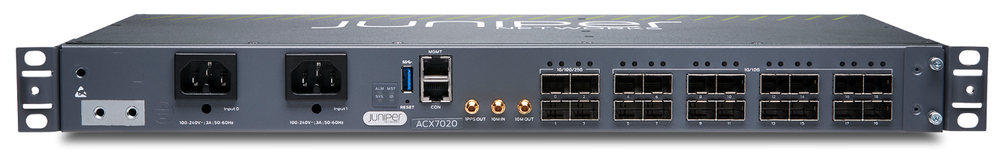
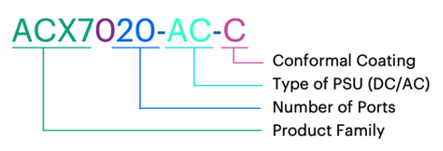
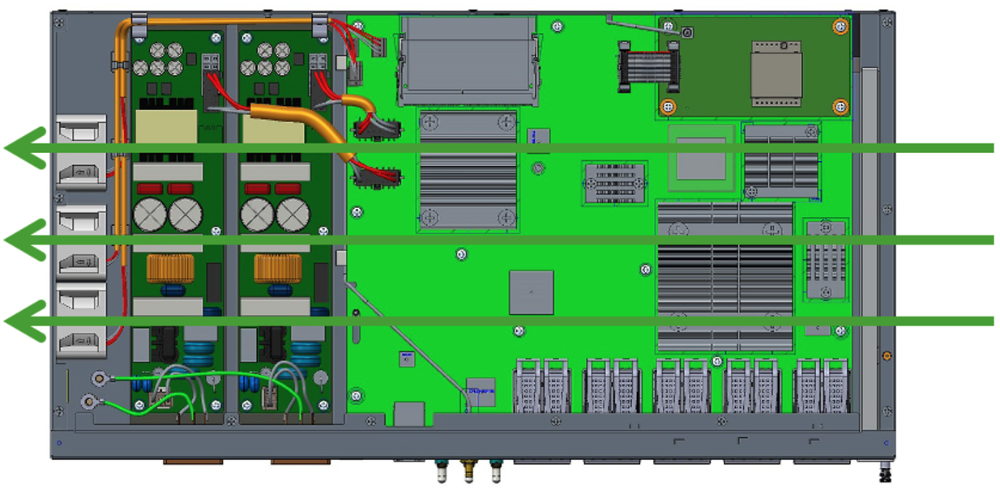
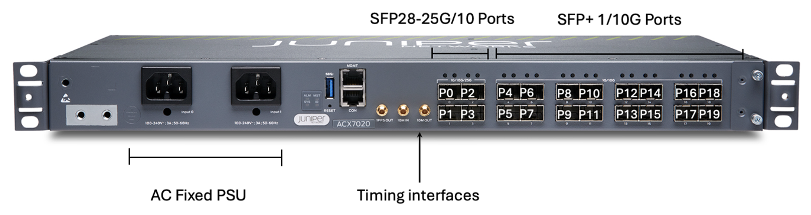
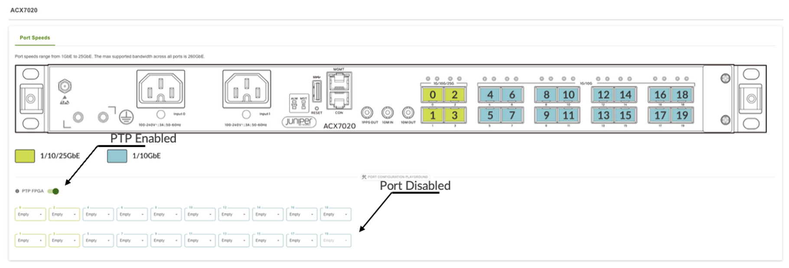
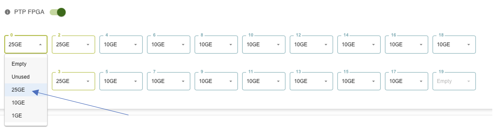
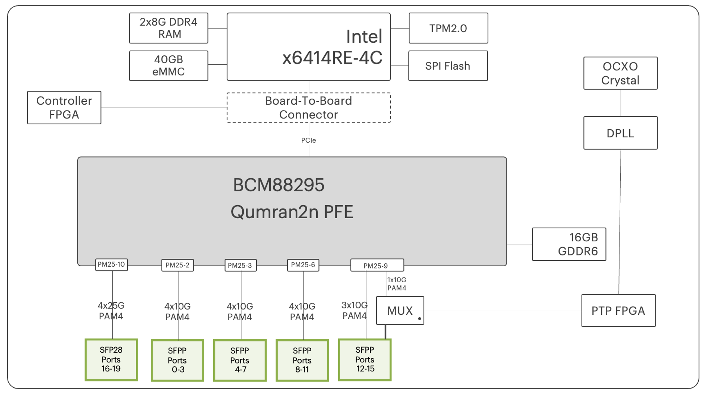
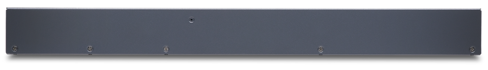

# ACX 7020 Routers Deepdive

**Dominique Blanchard - 03/16/2026**

## High-Level Introduction

The ACX7020 is a HPE Juniper Networking product powered by Broadcom Qumran Q2N [BCM88295] and running Junos EVO modular software architecture. It offers a mix of 16 ports 1/10GbE and 4 ports 1/10/25GbE.



This 1RU Ethernet-only router offers 100Gbps bidirectional forwarding capacity and with Class-C Timing support.

It addresses primarily the Cable DAA/UAA use cases, Mobile xHaul Transport market, Converged Metro but can be used in multiple roles as soon as features and scales are meeting the requirements.

ACX7020 is a temperature hardened box supporting (operating) temperature from -40C to +65C and from 5 to 90% non-condensing (at an altitude of 6000 Feet)

| Port Speed | Maximum Number of Ports on ACX7020(Details / Total) |
|:--|:--|
| 25GbE | 4 |
| 10GbE | 16+4 |
| 1GbE | 16+4 |

*Maximum number of ports supported on ACX7**020** Routers*

## Naming convention

We have a total of 4 SKUs (Stock Keeping Units) with the following characteristics:

- Ports density:  4x 1/10/25GbE and 16x 1/10GbE.


Port Number 0 to 3 [SFP28 1/10/25GbE]

Port Number 4 to 19 [SFP+ 1/10GbE]
- Power: 1+1 AC or DC (PSU) -24VDC to -60V VDC, Typical power 60W
- Airflow: S2S (Air Flow Side to Side)

Based on these parameters, the naming logic for the product itself and the SKU is the following.



The ACX7020 is only available in Side-to-Side version as illustrated in the figure 3 below.



## SKUs

ACX7020 is available with two fixed PSU, AC or DC and with, or without conformal coating. The combinations give us a total of 4 SKUs:

| SKU | Description |
|:--|:--|
| ACX7020-AC | ACX7020 with PTP (SyncE+Transperent Clock+Boundary Clock),16GB DRAM, redundant AC PSU |
| ACX7020-DC | ACX7020 with PTP (SyncE+Transperent Clock+Boundary Clock),16GB DRAM, redundant DC PSU feed |
| ACX7020-AC-C | ACX7020 with PTP (SyncE+Transperent Clock+Boundary Clock),16GB DRAM, redundant AC PSU, Conformal coating |
| ACX7020-DC-C | ACX7020 with PTP (SyncE+Transperent Clock+Boundary Clock),16GB DRAM, redundant DC PSU feed, Conformal coating |

A few additional/optional SKUs:

| Optional SKU | Description |
|:--|:--|
| ACX7020-FLTR | ACX7020 Air Filter, Spare |
| ACX702X-RMK-21 | ACX7020 / ACX7024 ETSI 21inch Rack Mount Kit, Spare |
| ACX702X-RMK-23 | ACX7020 / ACX7024  23inch Rack Mount Kit, Spare |

## Environment Standards

ACX7020 is the temperature hardened router (-40C to 70C at 1,000 ft) and is compliant to the following environmental standards

- IEEE1613:2013 Smart Grid -- Power Substations
- IEC 61850-3:2013 Telecom equipment in Power station and substation environments
- GR 63 issue 5
- GR 3108- Class 2 Edition 3 (65C at 6,000 ft)
- GR 3108- Class 2 Edition 3 (70C at 1,000 ft)

We invite you to take a look at the TechLibrary hardware guide for more details:
[https://www.juniper.net/documentation/us/en/hardware/acx7020/index.html](https://www.juniper.net/documentation/us/en/hardware/acx7020/index.html)

## ACX7020 Hardware Overview

```
regress@rtme-acx7020-01> show chassis hardware 
Hardware inventory:
Item             Version  Part number  Serial number     Description
Chassis                                HU3525AX0057      JNP7020_AC [ACX7020_AC]
PSM 0                     BUILTIN      BUILTIN           JPSU-220W-AC
PSM 1                     BUILTIN      BUILTIN           JPSU-220W-AC
Routing Engine 0 REV 11   650-179212   HU3525AX0057      RE-ACX-7020
CB 0                      BUILTIN      BUILTIN           ACX7020 Control Board
FPC 0                     BUILTIN      BUILTIN           ACX7020-FPC
  PIC 0                   BUILTIN      BUILTIN           MRATE- 4xSFP28 + 16xSFP+
Fan Tray 0                BUILTIN      BUILTIN           ACX7020 Fan, Right to Left Airflow - AFO
```

## Software

The minimum Junos release required to operate ACX7020 is 24.4R2-EVO.

Image is named as: junos-evo-install-acx-f-x86-64-<release-ver>-EVO

```
regress@rtme-acx7020-01> show version 
Hostname: rtme-acx7020-01
Model: ACX7020_AC
Junos: 25.2R1.8-EVO
Yocto: 4.0.22
Linux Kernel: 5.15.164-10.22.33.18-yocto-standard-juniper-16986-g445edc512bb4
JUNOS-EVO OS 64-bit [junos-evo-install-acx-f-x86-64-25.2R1.8-EVO]
```

Both ACX7020 using "acx-f" images (f for fixed). "acx-m" will be used for modular systems.

## Oversubscription

ACX7020 is an oversubscribed router. Total revenue port speed available ports is 260Gbps (250 is PTP in use). Broadcom Q2N chip interface bandwidth  limit is 100Gbps.

## ACX7020 Ethernet Ports

ACX7020 Front Panel view and Port Numbering



| Port Number | Optic Type | Supported Port Speed | Default Port Speed |
|:--|:--|:--|:--|
| 0 to 3 | SFP28 | 4x25,4x10G,4x1Gbbps | 25Gbps |
| 4 to 19 | SFP/SFP+ | 16x10G,4x1Gbps | 10Gbps |

Check the port capabilities with CLI "show chassis pic fpc-slot 0 pic-slot 0"

```
regress@rtme-acx7020-01> show chassis pic fpc-slot 0 pic-slot 0 
FPC slot 0, PIC slot 0 information:
  Type                             MRATE- 4xSFP28 + 16xSFP+
  State                            Online    
  PIC version                    00.00
  Uptime    3 hours, 33 seconds

Port speed information:

  Port  PFE      Capable Port Speeds
  0      0       1x25G 1x10G 1x1G 
  1      0       1x25G 1x10G 1x1G 
  2      0       1x25G 1x10G 1x1G 
  3      0       1x25G 1x10G 1x1G 
  4      0       1x10G 1x1G 
  5      0       1x10G 1x1G 
  6      0       1x10G 1x1G 
  7      0       1x10G 1x1G 
  8      0       1x10G 1x1G 
  9      0       1x10G 1x1G 
  10     0       1x10G 1x1G 
  11     0       1x10G 1x1G 
  12     0       1x10G 1x1G 
  13     0       1x10G 1x1G 
  14     0       1x10G 1x1G 
  15     0       1x10G 1x1G 
  16     0       1x10G 1x1G 
  17     0       1x10G 1x1G 
  18     0       1x10G 1x1G 
  19     0       1x10G 1x1G 
  20     NA      1x10G
```

## Impact of Timing Activation

Once PTP is enabled with below command, port 19 will not be available to use.

```
regress@rtme-acx7020-01# set chassis fpc 0 pic 0 ptp-mode ## PTP mode enabled

[edit]
regress@rtme-acx7020-01# commit 
commit complete

[edit]
regress@rtme-acx7020-01# run show interfaces terse et-0/0/19  
error: device et-0/0/19 not found
```

Once PTP config is committed, HW FPGA on port et-0/0/19 will be used in PTP circuitry.



## Port Checker Tool

The port checker ([https://apps.juniper.net/port-checker/acx7020/](https://apps.juniper.net/port-checker/acx7020/)) is a very handy tool allowing you to test the different port speed combination and identify the potential restrictions like PTP/Oversubscription.



## Supported Port FEC

| Port Speed | Supported FEC |
|:--|:--|
| 25GE | FEC74, FEC91, none |
| 10GE | FEC74, FEC91, none |

## Serdes Rate

SerDes or serializer/deserializer is an integrated circuit (IC or chip) transceiver that converts parallel data to serial data and vice-versa. In the chart below, we display the SerDes rate for respective port speed.

Keep in mind that port speed and SerDes rates are different, the second category is Broadcom internal rates: 10.3125Gbps, 25.7825Gbps, 1.25Gbps...

| SFP Ports 0 to 19 | Q2 SerDes (Gbps) |
|:--|:--|
| 25GbE | 25.78125 (x1) |
| 10GbE | 10.3125 (x1) |
| 1GbE | 1.25 (x1) |

```
[vrf:none] regress@rtme-acx7020-01:~# cli-pfe
regress@rtme-acx7020-01:pfe> show picd config 

pic_info_table          :
              default   config     config       config   computed
pic_or_port   speed     pic_mode   port_speed   valid    speed      supported_speeds       hidden_speeds
-----------   -------   --------   ----------   ------   --------   --------------------   -------------
pic-0/0       -         -          -            yes      -
port-0/0/0    1x10G     -          -            -        1x10G      [ 1x25G 1x10G 1x1G ]   [ ]
port-0/0/1    1x10G     -          -            -        1x10G      [ 1x25G 1x10G 1x1G ]   [ ]
port-0/0/2    1x10G     -          -            -        1x10G      [ 1x25G 1x10G 1x1G ]   [ ]
port-0/0/3    1x10G     -          -            -        1x10G      [ 1x25G 1x10G 1x1G ]   [ ]
port-0/0/4    1x10G     -          -            -        1x10G      [ 1x10G 1x1G ]         [ ]
port-0/0/5    1x10G     -          -            -        1x10G      [ 1x10G 1x1G ]         [ ]
port-0/0/6    1x10G     -          -            -        1x10G      [ 1x10G 1x1G ]         [ ]
port-0/0/7    1x10G     -          -            -        1x10G      [ 1x10G 1x1G ]         [ ]
port-0/0/8    1x10G     -          -            -        1x10G      [ 1x10G 1x1G ]         [ ]
port-0/0/9    1x10G     -          -            -        1x10G      [ 1x10G 1x1G ]         [ ]
port-0/0/10   1x10G     -          -            -        1x10G      [ 1x10G 1x1G ]         [ ]
port-0/0/11   1x10G     -          -            -        1x10G      [ 1x10G 1x1G ]         [ ]
port-0/0/12   1x10G     -          -            -        1x10G      [ 1x10G 1x1G ]         [ ]
port-0/0/13   1x10G     -          -            -        1x10G      [ 1x10G 1x1G ]         [ ]
port-0/0/14   1x10G     -          -            -        1x10G      [ 1x10G 1x1G ]         [ ]
port-0/0/15   1x10G     -          -            -        1x10G      [ 1x10G 1x1G ]         [ ]
port-0/0/16   1x10G     -          -            -        1x10G      [ 1x10G 1x1G ]         [ ]
port-0/0/17   1x10G     -          -            -        1x10G      [ 1x10G 1x1G ]         [ ]
port-0/0/18   1x10G     -          -            -        1x10G      [ 1x10G 1x1G ]         [ ]
port-0/0/19   1x10G     -          -            -        0x0        [ 1x10G 1x1G ]         [ ]
port-0/0/20   0x0       -          -            -        1x10G      [ 1x10G ]              [ ]
usr_config              :
    pic_usr_config      :
        pic_name        : pic-0/0
        pic_mode_valid  : false
        pic_mode        :
        num_ports_valid : false
        num_ports       : 0
        config_invalid  : false
        ptp_mode        : true

regress@rtme-acx7020-01:pfe>
```

## Supported Optics

A list of all supported optical modules is available in the following site.

[https://apps.juniper.net/hct/product/ACX7020/hwspecs](https://apps.juniper.net/hct/product/ACX7020/hwspecs)

## Internal Description: Block Diagrams

ACX7020 is internally composed of multiple parts. We can summarize them as:

- A Broadcom Qumran 2n PFE (BCM88295) with 16GB of GDDR6
- An Intel x6414 CPU (4 cores) with 16GB DDR4 memory and SSD storage
- An internal controllers for I2C (inter-integrated circuit), fan control, ...
- A PTP FPGA
- A TPM 2.0 module (Trusted Platform Module)

The ACX7020 is a "System on the Chip" (SoC). That means it is based on a single PFE where all parts involved in the forwarding tasks are directly connected. This Qumran PFE is a deep-buffer ASIC with hybrid packet memory (internal and external). The external buffer is present on the side of the package: 16GB of GDDR6 memory.



In this diagram, we are presenting the SerDes at 25G (instead of 25.7875Gbps) and 10G (instead of 10.3125Gbps) for sake of simplicity.

We notice the hardware shared for port 19 and PTP FPGA via mux section. At a single point in time, only one can be used.

We invite you to check the articles to learn more about the ASIC selection process and many more details on the packet forwarding ASIC.

- Building the ACX7000 Series: the PFE: [https://juniper.github.io/techposts/building-the-acx7000-series-the-pfe/article](https://juniper.github.io/techposts/building-the-acx7000-series-the-pfe/article)
- Let's Talk About VOQ and DNX Pipeline: [https://juniper.github.io/techposts/voq-and-dnx-pipeline/article](https://juniper.github.io/techposts/voq-and-dnx-pipeline/article)

The different components can be monitored via CLI.

```
regress@rtme-acx7020-01:pfe> show system info 
  
                                                DATE + TIME
  
    Date                  :    Thu Mar 05 08:54:34 2026
    System uptime         :    05:33:01
    PFE uptime            :    05:32:10
  
  
                                                    CPU
  
    Model name            :   Intel Atom(R) x6414RE Processor @ 1.50GHz
    Nodes                 :    1
    Cores                 :    4
    Hyper threads         :    4
    Pairs                 :      0    1    2    3
  
  
                                                   MEMORY
  
    Total                 :    14.76GB
    Free                  :    6.97GB
    Shared                :    209.35MB
  
  
                                                 PROCESSES
  
  _______________________________________________________________________________________________________________
      PID             NAME           MEMORY    %CPU      UPTIME                  THREADS                 PG-FLT
                                                                     ________________________________
                                                                      TOTAL   80-100   60-80   40-60
  _______________________________________________________________________________________________________________
       7128           aft-sysinfo   82.89MB     2.4      05:32:08         6        0       0       0      34032
       7856       evoaft-jvisiond  115.75MB     0.0      05:32:01         7        0       0       0      37186
       6979                  imgd    5.20MB     0.0      05:32:10         2        0       0       0      20412
       7435                   mgd   79.41MB     0.0      05:32:06         1        0       0       0      28159
       9234                   mgd   17.13MB     0.0      05:31:42         1        0       0       0       8755
      10818                   mgd   83.00MB     0.0      05:31:18         1        0       0       0       7079
      19842                   mgd   14.39MB     0.0      02:12:39         1        0       0       0        523
       9222               mgd-api   73.82MB     0.0      05:31:42         4        0       0       0      33580
       7932              packetio  259.77MB     0.0      05:32:01        39        0       0       0      23783
       9886       packetio-dds-ag   73.27MB     0.0      05:31:35         6        0       0       0      33458
```

## No-FRU System and Redundancy



In ACX7020 systems, aside from optics, there is no field replaceable Units, and the redundant parts are the power supply modules and the fans.

## Routing Engine

ACX7020 have a single routing engine. That means we don't support any kind of High-Availability (HA) option at the RE level. Also, In-Service System Upgrade (ISSU) is not supported, nor planned.

## Fans

The chassis is equipped with 3 fixed side-to-side fans. They can NOT be replaced, however the cooling redundancy is 2+1. So, the system will stay operational with one fan failure case. A part failing eventually implies a router replacement to restore the 2+1 redundancy.

We verify the fan operation with:

```
regress@rtme-acx7020-01> show chassis fan 
      Item                      Status   % RPM     Measurement
      Fan Tray 0 Fan 1          OK       33%       8000 RPM                 
      Fan Tray 0 Fan 2          OK       32%       7900 RPM                 
      Fan Tray 0 Fan 3          OK       32%       7900 RPM                 

regress@rtme-acx7020-01>
```

Also, we can check the temperature of various components and also the fan operating speeds with:

```
regress@rtme-acx7020-01> show chassis environment 
Class Item                           Status     Measurement
Temp  FPC 0 Sensor Q2N Max Reading   OK         42 degrees C / 107 degrees F
      Routing Engine 0 CPU Temperature OK       44 degrees C / 111 degrees F
      Routing Engine 0 RE temperature OK        36 degrees C / 96 degrees F
      Routing Engine 0 FPC temperature OK       36 degrees C / 96 degrees F
      Routing Engine 0 Outlet temperature OK    36 degrees C / 96 degrees F
      Routing Engine 0 Inlet temperature OK     27 degrees C / 80 degrees F
      Routing Engine 0 Q2N thermal Diode OK     31 degrees C / 87 degrees F
      Routing Engine 0 DIMM0 Temperature OK     33 degrees C / 91 degrees F
      Routing Engine 0 DIMM1 Temperature OK     34 degrees C / 93 degrees F
      Routing Engine 0 Temp Hotswap Controller OK 34 degrees C / 93 degrees F
      Routing Engine 0 MP2940c Temperature OK   38 degrees C / 100 degrees F
Fan   Fan Tray 0 Fan 1               OK         8000 RPM
      Fan Tray 0 Fan 2               OK         7900 RPM
      Fan Tray 0 Fan 3               OK         7900 RPM

regress@rtme-acx7020-01>
```

## AC and DC Power

You notice two PSM on both ends of the router, they can be AC or DC with single PSU or dual. With a 1+1 PSM configuration, we have power redundancy: if one fails, the system will raise an alarm but will stay fully operational.

```
regress@rtme-acx7020-01> show chassis power detail 
Chassis Power        Voltage(V)    Power(W)

Total Input Power                     49
  PSM 0
    State: Online
    Capacity            220 W (maximum 220 W)
  PSM 1
    State: Online
    Capacity            220 W (maximum 220 W)

System:
  Zone 0:
      Capacity:          440 W (maximum 440 W)
      Actual usage:      50 W
  Total system capacity: 440 W (maximum 440 W)
```

Note: it is possible to deactivate half of the ports and shut down the associated PFE core. This power-saving mode can reduce the consumption for low port density deployments:

[https://www.juniper.net/documentation/us/en/software/junos/chassis/topics/task/configuring-power-saving-mode.html](https://www.juniper.net/documentation/us/en/software/junos/chassis/topics/task/configuring-power-saving-mode.html)

Typically configured ports "unused" (turning down SerDes) can save up to 5W on 50W.

## Timing Support

The ACX7020 supports:

- Synchronous Ethernet with enhanced ESMC
- PTP G.8275.1 / G.8275.1enh / G.8275.2 Profile
- Meets G.8273.2 T-BC Class C Performance
- IEEE 1588 transparent clock along with G.8273.3 T-TC

Note:

- Sync-E and PTP Hybrid not supported on 1G ports
- Port 19 is disabled when you activate PTP

## MDB Profile support

If you are not familiar with the concept of MDB / Hardware profiles, please check this link first:

[https://juniper.github.io/techposts/acx7000-hardware-profiles/article](https://juniper.github.io/techposts/acx7000-hardware-profiles/article)

Two MDB Profiles are supported: lean-edge (default) and cloud-metro. A reload is required to change the profile configuration.

Default mode: Lean edge profile.

```
[vrf:none] regress@rtme-acx7020-01:~# cli-pfe
regress@rtme-acx7020-01:pfe> show evo-pfemand mdb-info
User Config     : Profile:lean-edge                 Kaps:1
Max possible mac limit for this profile:85000

TableName         Type       Capacity   EntrySize
=================================================
TCAM                       0         0
KAPS1     KAPS (LPM)       1572864   0
KAPS2     KAPS (LPM)       65536     0
ISEM1     Exact Match      65536     30
ISEM2     Exact Match      81920     30
ISEM3     Exact Match      65536     30
INLIF1    Direct Access    65536     60
INLIF2    Direct Access    32768     60
INLIF3    Direct Access    32768     60
IVSI      Direct Access    21846     90
LEM       Exact Match      393216    30
IOEM1     Exact Match      49152     30
IOEM2     Exact Match      65536     30
MAP       Direct Access    0         0
FEC1      Direct Access    32768     150
FEC2      Direct Access    26215     150
FEC3      Direct Access    32768     150
PPMC      Exact Match      98304     30
GLEM1     Exact Match      65536     30
GLEM2     Exact Match      65536     30
EEDB1     EEDB             32768     0
EEDB2     EEDB             32768     0
EEDB3     EEDB             32768     0
EEDB4     EEDB             32768     0
EEDB5     EEDB             16384     0
EEDB6     EEDB             16384     0
EEDB7     EEDB             16384     0
EEDB8     EEDB             16384     0
EOEM1     Exact Match      32768     30
EOEM2     Exact Match      49152     30
ESEM      Exact Match      65536     30
EVSI      Direct Access    32768     30
SEXEM1    Exact Match      65536     30
SEXEM2    Exact Match      0         0
SEXEM3    Exact Match      0         0
LEXEM     Exact Match      131072    30
RMEP_EM   Exact Match      65536     30
```

Alterative option: cloud-metro profile

```
[vrf:none] regress@rtme-acx7020-01:~# cli-pfe
regress@rtme-acx7020-01:pfe> show evo-pfemand mdb-info 
User Config     : Profile:cloud-metro               Kaps:1
Max possible mac limit for this profile:270000

TableName         Type       Capacity   EntrySize
=================================================
TCAM                       0         0
KAPS1     KAPS (LPM)       917504    0
KAPS2     KAPS (LPM)       65536     0
ISEM1     Exact Match      65536     30
ISEM2     Exact Match      49152     30
ISEM3     Exact Match      49152     30
INLIF1    Direct Access    65536     60
INLIF2    Direct Access    65536     60
INLIF3    Direct Access    65536     60
IVSI      Direct Access    21846     90
LEM       Exact Match      1245184   30
IOEM1     Exact Match      49152     30
IOEM2     Exact Match      49152     30
MAP       Direct Access    0         0
FEC1      Direct Access    26215     150
FEC2      Direct Access    13108     150
FEC3      Direct Access    26215     150
PPMC      Exact Match      65536     30
GLEM1     Exact Match      65536     30
GLEM2     Exact Match      65536     30
EEDB1     EEDB             32768     0
EEDB2     EEDB             32768     0
EEDB3     EEDB             32768     0
EEDB4     EEDB             32768     0
EEDB5     EEDB             16384     0
EEDB6     EEDB             16384     0
EEDB7     EEDB             0         0
EEDB8     EEDB             0         0
EOEM1     Exact Match      32768     30
EOEM2     Exact Match      32768     30
ESEM      Exact Match      49152     30
EVSI      Direct Access    16384     30
SEXEM1    Exact Match      65536     30
SEXEM2    Exact Match      0         0
SEXEM3    Exact Match      0         0
LEXEM     Exact Match      131072    30
RMEP_EM   Exact Match      65536     30
```

## Conclusion

The ACX7020 router is 1-RU, 100Gbps platform, ideally positioned for small cell site and it can be with 1G/10G/25aggregation. In the next articles, we will continue the description of the ACX7000 portfolio and will dig deeper into the specific features of these products.

## Useful links

- ACX7020 Data sheet:
[https://www.juniper.net/us/en/products/routers/acx-series/acx7000-family-cloud-metro-routers/acx7000-line/acx7020-cloud-metro-routers-datasheet.html](https://www.juniper.net/us/en/products/routers/acx-series/acx7000-family-cloud-metro-routers/acx7000-line/acx7020-cloud-metro-routers-datasheet.html)
- Building the ACX7100 Series: the PFE:
[https://juniper.github.io/techposts/building-the-acx7000-series-the-pfe/article](https://juniper.github.io/techposts/building-the-acx7000-series-the-pfe/article)
- Let's talk about VOQ and DNX Pipeline:
[https://juniper.github.io/techposts/voq-and-dnx-pipeline/article](https://juniper.github.io/techposts/voq-and-dnx-pipeline/article)
- Hardware Guide:
[https://www.juniper.net/documentation/us/en/hardware/acx7020/index.html](https://www.juniper.net/documentation/us/en/hardware/acx7020/index.html)
- Hardware Compatibility Tool:
[https://apps.juniper.net/hct/product/ACX7020/hwspecs](https://apps.juniper.net/hct/product/ACX7020/hwspecs)

## Glossary

- FRS: First Revenue Ship
- I2C: Inter-Integrated Circuit
- MDB: Modular DataBase
- PFE: Packet Forwarding Engine
- PSM : Power Supply Module
- PTP: Precision Time Protocol
- S2S: Side to Side
- SKU: Stock Keeping Unit
- TPM : Trusted Platform Module
- PSU: Power Supply Unit

## Acknowledgments

Thanks a lot to Nicolas for the document review.
