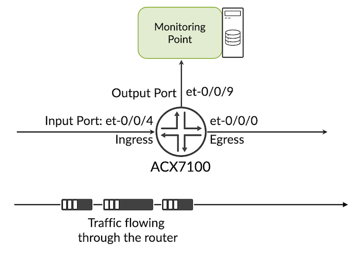
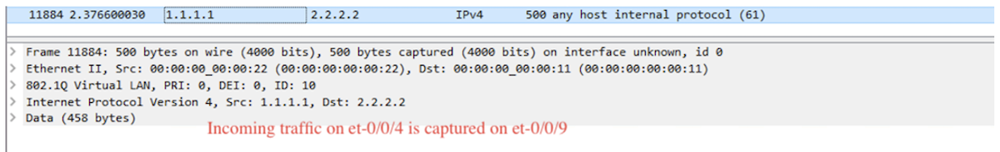
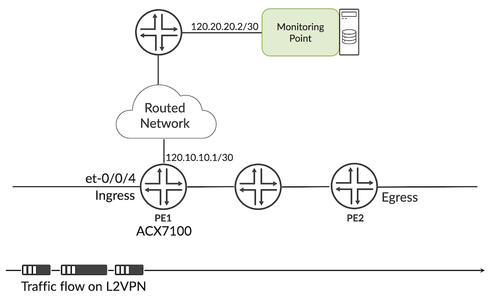
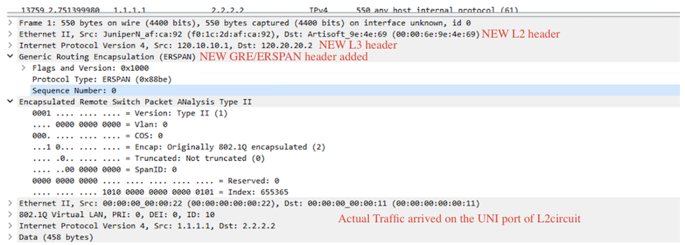

# ACX7000 ERSPAN and Port Mirroring

**Pankaj Kumar - 05/30/2023**

Traffic mirroring is a useful method for debugging traffic patterns. The ACX7000 family of products supports both local port mirroring and ERSPAN. This article describes how to utilize these functionalities.

## Analyzer

Local Port or remote mirroring are implemented via a software component we call "analyzer". Under this forwarding-options analyzer configuration statement, we will define certain parameters like:

- Input: the traffic collection point
- Output: where the captured traffic will be redirected
- Ingress/Egress: the direction of the traffic we want to capture

### Sample Analyzer Configuration

```
root@rtme-acx-48l-08# show forwarding-options
analyzer {
    A0 {
        input {   ### Analyzer Input
            ingress {   ### Traffic Direction [ingress or egress]
                interface et-0/0/4.0;   ### Traffic collection point
            }
        }
        output {   ### Analyzer Output
            ip-address 120.20.20.2;   ### or interface, send the monitor traffic various options
        }
    }
}
```

## Local Port Mirroring

Port mirroring is supported on ACX7K family products. It allows for the complete ingress/egress traffic of an interface to be mirrored to another local port on the device.

### Topology



### Configuration example:

```
root@rtme-acx-48l-08# show forwarding-options
analyzer {
    A0 {
        input {
            ingress {
                interface et-0/0/4.0;
            }
        }
        output {
            interface et-0/0/9.0;
        }
    }
}

root@rtme-acx-48l-08# show interfaces et-0/0/9
unit 0;

root@rtme-acx-48l-08# show vlans
v-10 {
    vlan-id 10;
    interface et-0/0/4.0;
    interface et-0/0/0.0;

root@rtme-acx-48l-08# show interfaces et-0/0/0
flexible-vlan-tagging;
encapsulation flexible-ethernet-services;
unit 0 {
    encapsulation vlan-bridge;
    vlan-id 10;
}

root@rtme-acx-48l-08# show interfaces et-0/0/4
flexible-vlan-tagging;
encapsulation flexible-ethernet-services;
unit 0 {
    encapsulation vlan-bridge;
    vlan-id 10;
}
```



## ERSPAN Remote mirroring

ERSPAN (Encapsulated Remote Port ANalyzer) is basically remote mirroring. This feature allows the capture of packets anywhere across a routed network. It mirrors traffic on one or more "source" ports and delivers the packets to a "destination" port on remote end, via an ERSPAN tunnel.

ERSPAN encapsulates mirrored packets using tunnelling with IP delivery. After a captured packet has been encapsulated, it is forwarded throughout the network across a special Layer 3 tunnel. The data section contains the original mirrored packet.

In the following example, ERSPAN is demonstrated with L2Circuit. However, users can choose to utilize alternative options like EVPN-MPLS, EVPN-VPWS, VPLS, or L2VPN.

### Remote Mirroring Topology

Here, we present a straightforward example of the L2Circuit operating between PE1 and PE2, with traffic flowing through it. Our goal is to capture the incoming traffic to the L2Circuit on the ACX7100 device and direct this captured traffic to a Tester connected over the Layer 3 routed network.



### Analyser Configuration

```
root@rtme-acx-48l-08# show forwarding-options
analyzer {
    A0 {
        input {   ### Analyzer Input
            ingress {   ### Traffic Direction [ingress or egress]
                interface et-0/0/4.0;   ### Traffic collection point
            }
        }
        output {   ### Analyzer Output
            ip-address 120.20.20.2;   ### send the monitored traffic to this IP destination
        }
    }
}
```

### Basic L2 circuit configuration

```
root@rtme-acx-48l-08# show interfaces et-0/0/4
encapsulation ethernet-ccc;
unit 0 {
    family ccc;
}

root@rtme-acx-48l-08# show protocols l2circuit
neighbor 33.33.33.33 {
    interface et-0/0/4.0 {
        virtual-circuit-id 1;
    }
}
```

L2Circuit connections:

```
root@rtme-acx-48l-08# run show l2circuit connections

<SNIP>

Neighbor: 33.33.33.33
    Interface                 Type  St     Time last up          # Up trans
    et-0/0/4.0(vc 1)          rmt   Up     Feb 27 20:07:19 2023           1
      Remote PE: 33.33.33.33, Negotiated control-word: Yes (Null)
      Incoming label: 604, Outgoing label: 16
      Negotiated PW status TLV: No
      Local interface: et-0/0/4.0, Status: Up, Encapsulation: ETHERNET
      Flow Label Transmit: No, Flow Label Receive: No
```

Remote traffic Collection on L3 interface should be reachable from the device.

```
root@rtme-acx-48l-08# run show route 120.20.20.2

inet.0: 15 destinations, 15 routes (15 active, 0 holddown, 0 hidden)
+ = Active Route, - = Last Active, * = Both

120.20.20.0/30     *[OSPF/10] 13:59:18, metric 2
                    >  to 120.10.10.2 via et-0/0/45.0
```

### Traffic capture analysis

Here below is the traffic captured on the monitoring point, we can see clearly how actual traffic get cooked up with new  L2/L3 headers and actual traffic is encapsulated inside GRE and ERSPAN header. Traffic is destined to 120.20.20.2 which is configured as "output" under the analyzer and source IP is the next-hop IP, in this case: 120.10.10.2.



**Considerations**

Couple of things to know when configuring mirroring on ACX7000 platforms:

- Port Mirror and ERSPAN functionality are available on ACX7K products from 22.4R1 onwards.
- The analyser is configured on IFL (sub-interface), but actual mirroring will happen at IFD (main interface). The user can add et-0/0/0.0 or et-0/0/0.10 in analyzer config, but all packets on this interface et-0/0/0 will be be mirrored.
- Mirrored traffic can be redirect to IPv4 destination only. i.e "output" as IPv4 address.
- Cant apply Analyzer on IRB interface / mirroring on IRB interface not supported.
- Any change in the output configuration (input interface or output host), should be first removed and then re-configured/re-applied.
- If the route to reach mirror destination changes and points to any interface other than the one mentioned in ERSPAN Analyzer config, the configuration must be modified and re-applied accordingly.
- Maximum of 16 ingress and 8 egress mirror instances are supported. If you configure more than what is supported, commit error will be thrown.
- On a single output port, we can configure max 8 ingress/egress instances combined. If you exceed it, a commit error will be thrown.
- Mirrored traffic will not be load balancing if the next hop have multiple paths (ECMP).
- Filter based mirroring is considered as part of our roadmap.

## Useful links

- Documentation: [https://www.juniper.net/documentation/us/en/software/junos/network-mgmt/topics/topic-map/port-mirroring-and-analyzers.html#id-understanding-port-mirroring-on-ex2200-ex3200-ex3300-ex4200-ex4500-ex4550-ex6200-and-ex8200__d134607e2156](https://www.juniper.net/documentation/us/en/software/junos/network-mgmt/topics/topic-map/port-mirroring-and-analyzers.html#id-understanding-port-mirroring-on-ex2200-ex3200-ex3300-ex4200-ex4500-ex4550-ex6200-and-ex8200__d134607e2156)

## Glossary

- ERSPAN: Encapsulated Remote SPAN
- EVPN: Ethernet Virtual Private Network
- GRE: Generic Routing Encapsulation
- IFD: Interface Device (physical interface)
- IFL: Interface Logical (logical interface)
- IRB: Integrated Routing and Bridging
- L2VPN: Layer2 Virtual Private Network

## Acknowledgments

Many thanks to Nicolas Fevrier for reviewing the article and providing feedback
