# ACX7000 Hardware Profiles

**Nicolas Fevrier - 01/24/2024**

## Introduction

The ACX7000 routers are powered by Broadcom Jericho2 Series chipsets. These Packet Forwarding Engines (PFEs) are equipped with a substantial internal memory pool known as Modular DataBase (MDB). During the system boot-up, the MDB is segmented into various specialized databases, each designated to store specific information types and accessible from distinct pipeline blocks.

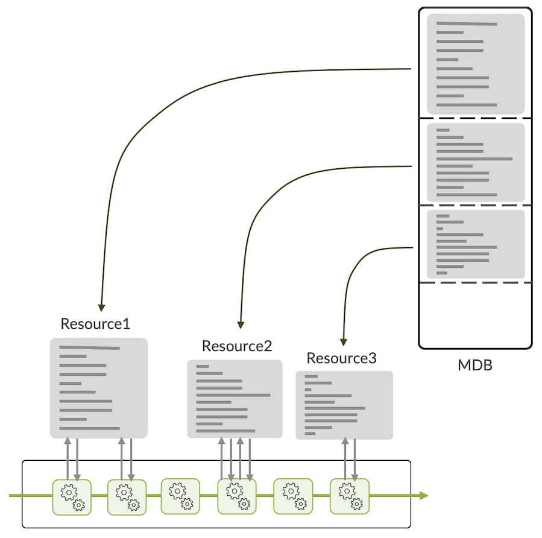

Depending on the way we allocate memory space for each database, the operator can decide to privilege one role over another. For example, it could be more L2-centric, or more L3-capable, or even more specialized in subscriber-related functions. This allocation is pre-defined in what we call "hardware database profiles" (or simply "profiles").

With the release of Junos 23.2 and then 23.4, several important improvements have been brought to the MDB management and the way routes are stored in the different memories. This article will elaborate on these enhancements and furnish the reader with the essential knowledge needed to determine the most suitable MDB profile for their requirements.

## The Modular DataBase

The MDB is a memory present inside the Jericho2 forwarding ASIC. It's meant to store operational information and not packets (it's not a buffer).

Depending on the type of chipset, we will have two different sizes:

- 1.5M entries
- 3M entries

The following chart in diagram2 illustrates the MDB size present in each PFE and each ACX7000 router type.

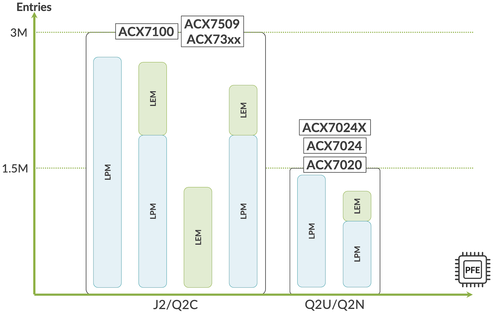

Operational information used by the different blocks in the pipeline is stored in these multiple databases. To name a few and not exhaustively:

- Interfaces (IFD/IFL)
- Routing Information
- Next-Hop
- Load-balancing information
- Encapsulation
- Tunnels
- Translation information
- VLAN manipulation information

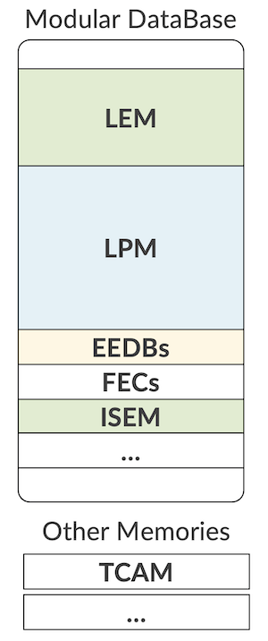

First, let's try to clear a common misconception. Frequently, we receive questions about "the TCAM size" in this chipset. But what they actually meant is not TCAM but MDB resources and size. The MDB is an SRAM and not a TCAM.

It can create a confusion because we do have internal and potentially external TCAMs in ACX7000 routers. They are just different memory types serving different purposes:

- iTCAM (internal) is used to store firewall filters, BGP FlowSpec rules, and QoS/CoS information.
- eTCAM (external, OP2) can be used to store routes and filters but is only available on the ACX7332.

Other memories are used in the system that are not part of the MDB. For example, the Statistics (counters and meters).

Note: Diagram 1 illustrates that different ACX7000 routers come with different MBD sizes. It's important to keep in mind it'ss not the only parameter influencing the supported scale. For example, the ACX7024 (non-X) may hit memory (CPU DRAM) bottlenecks before reaching the MDB resource limits.

## Where Do We Store the Routes?

In the most common scenarios, prefixes will be stored in two databases inside the MDB:

- The LPM: Longest Prefix Match
- The LEM: Large Exact Match

Like any other resources, the size of LEM and LPM will be directly influenced by the hardware profile enabled and how it carved the MDB at boot-up time.

Depending on the release running on the system, the behavior may be slightly different and the Junos release 23.2R1 marks a clear change.

### Before Junos 23.2R1

The release 23.2R1 is the moment we changed the behavior. Before its introduction, we had host routes IPv4 and IPv6, MPLS labels, and MAC address stored in LEM, while all other prefixes, IPv4 and IPv6, were pushed in LPM.

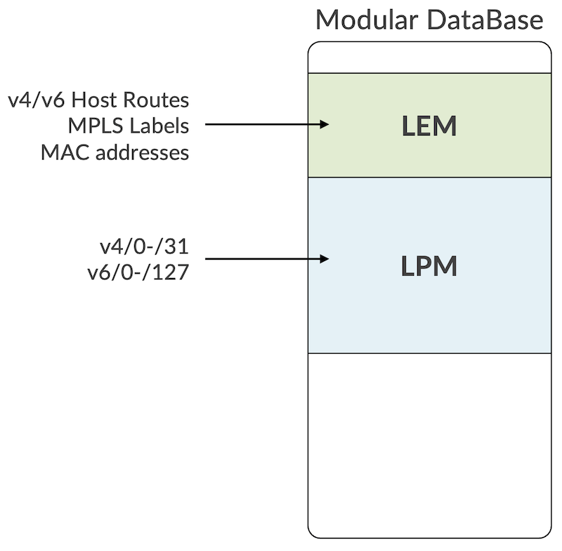

### From Junos 23.2R1 Onwards

Starting from 23.2R1, we simplified the logic by moving all prefixes, host or not to LPM.

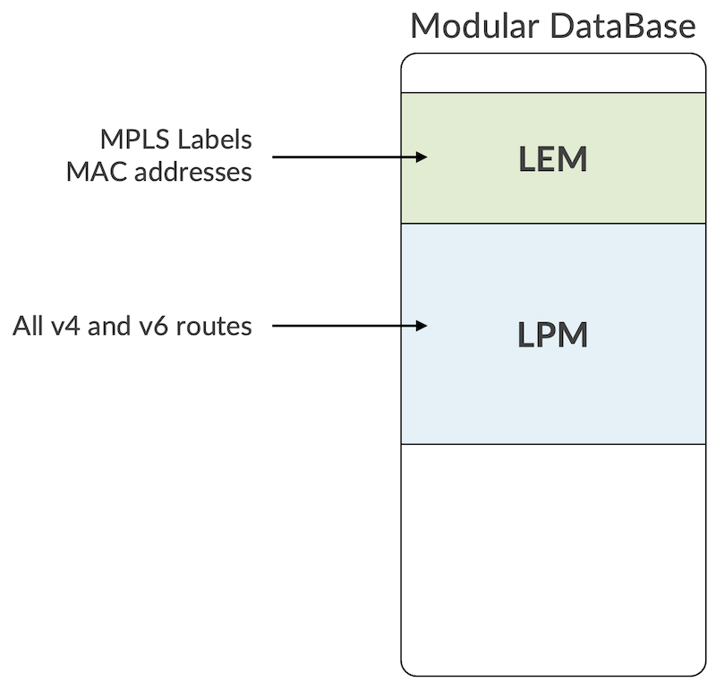

The main goal is: make things simpler. But also, it will eliminate the need to move prefixes from LEM to LPM when subsequent host routes are "aggregated" by the FIB compression algorithm. This cFIB feature is also introduced in Junos 23.2R1. You can read more on this topic here: [https://juniper.github.io/techposts/ptx-fib-compression/article](https://juniper.github.io/techposts/ptx-fib-compression/article)

One important exception to this new behavior is when the carrier-ethernet profile is activated. We will detail these profiles below in the same article. But when carrier-ethernet is configured, the prefixes are stored with host v4/32 and v6/128 in LEM and the rest in LPM, like it was before 23.2R1.

## MDB Profiles

Now that we explained where the routes are being stored, let's study in detail this concept of MDB profiles and what recently changed.

### Before Junos 23.3R1

Since we introduced the ACX7000 Series and just before the release of Junos 23.3R1, we used the following four profiles:

- balanced
- balanced-exem
- l2-xl
- l3-xl

With "balanced" being the default profile enable (if you don't configure anything).

Also, a mechanism of "lpm-distribution" was needed to allocate specific space for routes in VRF (private) and routes in Global Routing Table (public).

So, prior to Junos 23.3R1, we had the following configuration options:

```
nfevrier@rtme-acx-48l-03# set system packet-forwarding-options hw-db-profile ?
Possible completions:
+ apply-groups         Groups from which to inherit configuration data
+ apply-groups-except  Don't inherit configuration data from these groups
  balanced             Selects Balanced DB profile, restarts PFE
  balanced-exem        Selects Balanced-Exem DB profile, restarts PFE
  l2-xl                Selects L2-XL DB profile, restarts PFE
  l3-xl                Selects L3-XL DB profile, restarts PFE
  lpm-distribution     Specify route distribution between public and private(vrf/vpn) routes in lpm.Default is 1
[edit]

nfevrier@rtme-acx-48l-03# set system packet-forwarding-options hw-db-profile lpm-distribution ?                      
Possible completions:
  1                    Set the lpm-distribution to 1
  2                    Set the lpm-distribution to 2. Not valid for Balanced profile
  200                  Set the lpm-distribution to 200. Valid only for Balanced profile
  3                    Set the lpm-distribution to 3. Not valid for Balanced profile
  4                    Set the lpm-distribution to 4. Valid only for l2-xl profile
[edit]

nfevrier@rtme-acx-48l-03# 
```

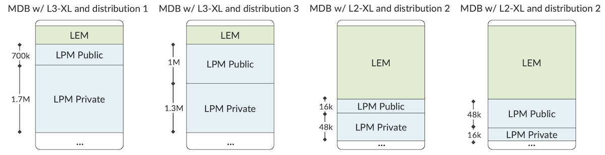

We can summarise the pre-23.3R1 with the following chart:

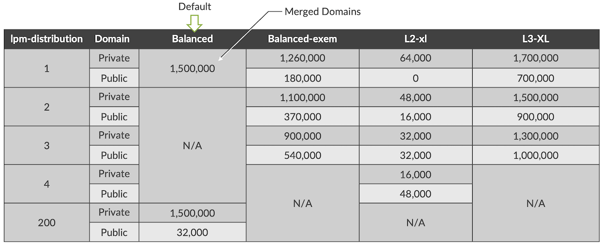

While the balanced profile was merging the Private and Public domains from the get-go, things were a little bit more complicated for the other profiles, with these rpm-distributions. It led to weird situations where an L3-XL profile will offer less routing scale in the global routing table than the default Balanced profile.

It required simplification. And that's exactly what we did with Junos 23.3R1

### From Junos 23.3R1 Onwards: New Profiles and New Default

The first modification comes with the renaming of the profiles to match "use-cases" and a new default profile.

Now, we have:

- **cloud-metro**
- **lean-edge** (the new default)
- **carrier-ethernet**
- **bng**

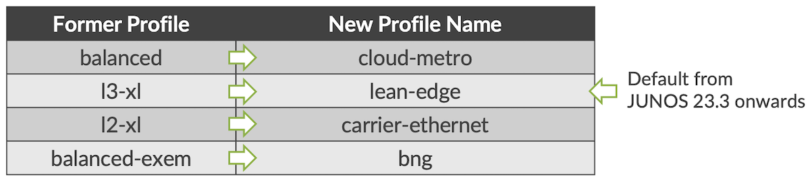

Today, most of the customers are using ACX7000 series with L3 scale preference. That's what motivates the change of default to lean-edge.

When you upgrade your router to the 23.3 release (or a later version), we have two situations.

- **1.** A profile was specifically configured before the upgrade. When the system reboots, it will enable the equivalent in the chart in diagram 7 above.
- **2.** If you don't have any profile configured before, the balanced profile is running on the router. After upgrading, the new default will be changed to lean-edge.

```
evo-pfemand[11984]: EVO_PFEMAND_MDB_PROFILE: Default MDB profile configured to "lean-edge"
```

Now you have these profile options in the config CLI for ACX7100, ACX7509, ACX7348, and ACX7024X:

```
nfevrier@rtme-acx-48l-03# set system packet-forwarding-options hw-db-profile ?
Possible completions:
+ apply-groups         Groups from which to inherit configuration data
+ apply-groups-except  Don't inherit configuration data from these groups
  bng                  Selects BNG DB profile, restarts PFE
  carrier-ethernet     Selects Carrier Ethernet high scale MAC DB profile, restarts PFE
  cloud-metro          Selects Cloud-Metro DB profile, restarts PFE
  lean-edge            Selects Lean Edge max IPv4/IPv6 FIB DB profile, restarts PFE
[edit]
```

And for ACX7024, only cloud-metro and lean-edge

```
nfevrier@rtme-acx7024-08# set system packet-forwarding-options hw-db-profile ?
Possible completions:
+ apply-groups         Groups from which to inherit configuration data
+ apply-groups-except  Don't inherit configuration data from these groups
  cloud-metro          Selects Cloud-Metro DB profile, restarts PFE
  lean-edge            Selects Lean Edge max IPv4/IPv6 FIB DB profile, restarts PFE
[edit]
```

You'll note that lpm-distribution option is not present in the CLI and that's what we are going to explain in the next section.

### From Junos 23.3R1 Onwards: Merge of Public and Private KAPS Domains

The lpm-distribution present in past versions for l2-xl, l3-xl, and balanced-exem required to know, in advance, exactly how many routes will be received in VRFs or in the inet.0/inet.6 tables. It was equivalent to sub-profiles, as illustrated in the diagram 6.

This approach was confusing for many operators since it was not present for the default balanced mode, and it lacked flexibility.
In 23.3R1, we are simplifying this process by eliminating the entire concept of lpm-distribution: we are merging the public and private domains.

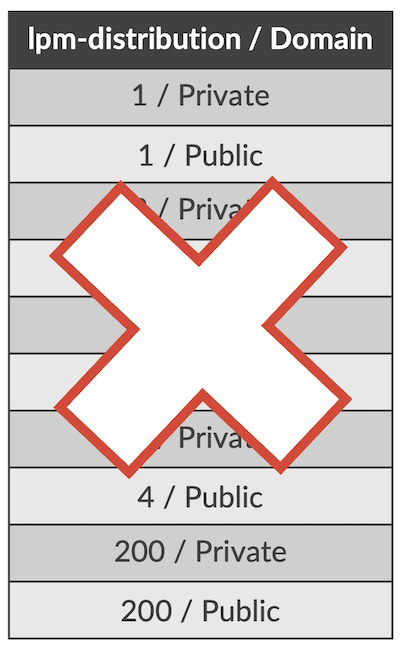

That means, with 23.3R1, you don't have to worry about the prefix length (host or not) or the domain, all the routes will go in LPM.
If an lpm-distribution was configured in the previous version, it will be ignored when rebooting in 23.3R1 after the upgrade.

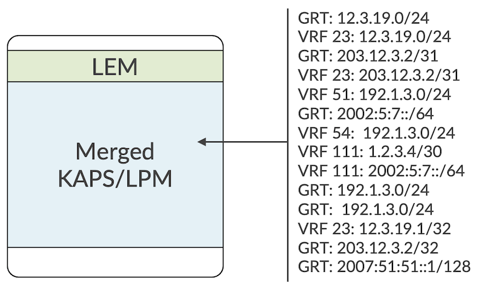

To go a little bit deeper into the details, what I referred to as LPM above is the "KAPS1" size allocated from the system perspective.
Another space, KAPS2, is allocated for (S,G) IPv6 multicast sources specifically: 32k sources occupying 96k entries for default and 1k source / 4k entries for carrier-ethernet profile.

It removes the limitation with IPv6 SSM that existed with some profiles in previous releases.

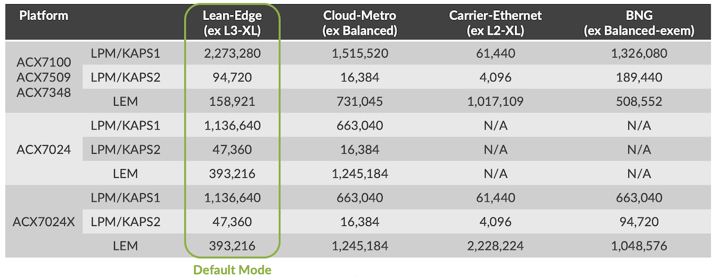

For the most part, these improvements are not changing the features support and the performance of the ACX7000 Series. One exception to this statement: VRF fallback/route leaking. This feature was executed in one pass and now will require a second lookup now that we merged KAPS domains. The traffic will be recirculated (meaning, it will use the RCY interface).

A follow-up article will go deeper into the recycling interfaces, the bandwidth available for each platform and the features existing to monitor and manage them.

## Resource Utilization

Let's focus with the utilization of LPM (KAPS1 and KAPS2) and LEM for each L2 and L3 information category.

Entries presented here are "IPv4 unicast route" equivalent  and "-" means: "not used".

|  | LEM | LPM (KAPS1) | LPM (KAPS2) |
|:--|:--|:--|:--|
| IPv4 /0-/31 | - | 1 | - |
| IPv4 /32 | 1 (with carrier-ethernet profile) | 1 (with all other profiles) | - |
| IPv6 /0-/64 | - | 2 | - |
| IPv6 /65-/127 | - | 2 | - |
| IPv6/128 | 2 (with carrier-ethernet profile) | 2 (with all other profiles) | - |
| MC (S,G)v4 | - | 2 | - |
| MC (S,G)v6 | - | 3 | 3 |
| MPLS | half entry (60b) | - | - |
| MAC Address | 1 | - | - |

Notes:

- LEM can be store entries of 30bits, 60bits, 120bits and 240bits
- LPM physical DB is an algorithmic, compression-based database. As such, the number of entries KAPS can store (in a given MDB profile) is not deterministic but rather depends on the distribution of the key values.
- It's fair to consider that an IPv6 entry is using twice the size of an IPv4 entry in LPM.
- Also, FIB compression is another important factor that will come into play to reduce the occupied space. It's enabled by default on all ACX7000 products except the ACX7024.

## Monitoring

To check the details of the active hardware profile, at the cli-pfe level we can use the following:

```
nfevrier@rtme-acx-48l-03:pfe> show evo-pfemand mdb-info    
User Config     : Profile:lean-edge                 Kaps:1
Converted Config: Profile:custom_lean_edge_jnpr     Kaps:1
Max possible mac limit for this profile:155000
TableName         Type       Capacity   EntrySize
=================================================
NONE                       0         0
TCAM                       0         0
KAPS1     KAPS (LPM)       2273280   0
KAPS2     KAPS (LPM)       94720     0
ISEM1     Exact Match      98304     30
ISEM2     Exact Match      131072    30
ISEM3     Exact Match      131072    30
INLIF1    Direct Access    65536     60
INLIF2    Direct Access    65536     60
INLIF3    Direct Access    65536     60
IVSI      Direct Access    43691     90
LEM       Exact Match      655360    30
IOEM1     Exact Match      65536     30
IOEM2     Exact Match      98304     30
MAP       Direct Access    0         0
FEC1      Direct Access    78644     150
FEC2      Direct Access    78644     150
FEC3      Direct Access    104858    150
PPMC      Exact Match      131072    30
GLEM1     Exact Match      163840    30
GLEM2     Exact Match      196608    30
EEDB1     EEDB             49152     0
EEDB2     EEDB             49152     0
EEDB3     EEDB             65536     0
EEDB4     EEDB             65536     0
EEDB5     EEDB             32768     0
EEDB6     EEDB             32768     0
EEDB7     EEDB             32768     0
EEDB8     EEDB             32768     0
EOEM1     Exact Match      98304     30
EOEM2     Exact Match      65536     30
ESEM      Exact Match      131072    30
EVSI      Direct Access    65536     30
SEXEM1    Exact Match      131072    30
SEXEM2    Exact Match      0         0
SEXEM3    Exact Match      0         0
LEXEM     Exact Match      262144    30
RMEP_EM   Exact Match      98304     30
KBP                        0         0

nfevrier@rtme-acx-48l-03:pfe>
```

And to check the resource utilization:

```
nfevrier@rtme-acx-48l-03:pfe> show evo-pfemand resource terse-usage 
UNIT 0 MDB Profile: custom_cloud_metro_jnpr
Resource        Usage           Capacity        size
COS_HR_ELEM     105             512             1
COS_VOQ         840             65536           1
COS_VOQ_CNCTR   840             98304           1
ECMP            32              32000           30
EEDB_1          156             49152           0
EEDB_2          36              49152           0
EEDB_3          5               65536           0
EEDB_6          30              32768           0
EEDB_7          163             0               0
EEDB_8          114             0               0
EGR_VSI         36              65536           30
FAILOVER        278             6000            30
FEC_1           68              52429           150
FEC_2           3               26215           150
FEC_3           111             52429           150
GLEM            21              64000           1
IFL_STATS       15              16000           1
ING_MC_GRP      9               262144          1
ING_VSI         36              43691           90
INLIF_1         95              65536           60
INLIF_2         15              65536           60
ISEM_1          40              98304           30
ISEM_2          15              98304           30
KAPS            704             1531904         0
LEM             18              3014656         30
OAM_MEP_DB      2               24576           1
TCAM_IPMF1_80   1404            0               1
TCAM_IPMF3_80   12              0               1
TCAM_PMF_ALL_INTRN_801416            102400          1
TCAM_TNL_TERM   48              16000           178

nfevrier@rtme-acx-48l-03:pfe>
```

For your reference, the following chart describes the difference resources:

| Resource | Description |
|:--|:--|
| COS_HR_ELEM | COS High Resolution Scheduling Elements |
| COS_VOQ | Virtual Output Queues |
| COS_VOQ_CNCTR | Counter Pairs associated with each VOQ |
| ECMP | Load Balancing Index |
| EEDB_1 | Encapsulation DB for RIF |
| EEDB_2 | Encapsulation DB for Native ARP, SRH base |
| EEDB_3 | Encapsulation DB for Native AC, MPLS Port,  SRv6 SID, BFD IPv4 OAM Endpoint |
| EEDB_4 | Encapsulation DB for MPLS tunnel, SIP-tunnel,  SRv6 SID |
| EEDB_5 | Encapsulation DB for MPLS tunnel, SRV6 SID |
| EEDB_6 | Encapsulation DB for MPLS tunnel, SRV6 SID |
| EEDB_7 | Encapsulation DB for ARP,  Recycle |
| EEDB_8 | Encapsulation DB for AC |
| EGR_MC_GRP | Multicast group table across all services |
| EGR_VSI | Bridge Domain / L3 interfaces |
| ENCAP_EXT | Encapsulation extension associated with encapsulation of outlif(IFL)  multicast members |
| ESEM | VLAN Translation |
| FAILOVER | Failover ID table associated with protection scenarios |
| FEC_1 | Next-Hop Hierarchy |
| FEC_2 | Next-Hop Hierarchy |
| FEC_3 | Next-Hop Hierarchy |
| GLEM | Associated with global Outlif (IFL)  management |
| IFL_STATS | IFL statistics, proportional to number of IFL |
| ING_MC_GRP | Ingress Mcast Groups |
| ING_VSI | Family IFF and OR Bridge domain table |
| INLIF_1 | Input Logical Interfaces |
| INLIF_2 | Input Logical Interfaces |
| ISEM_1 | In-AC Classification |
| ISEM_2 | Tunnel Termination (MPLS, IP) |
| KAPS | LPM: v4/v6 routes (ucast/mcast) |
| LEM | MAC addresses, MPLS labels |
| LEXEM_PMF | Large Exact match tables used by IRB Bridge |
| MYMAC_TCAM | Self Mac entries |
| OAM_MEP_DB | Maintenance end point database |
| OAM_NON_ACC_DB | OAM filter is installed to trap OAM packets to inline or control plane |
| TCAM_EPMF_80 | 80-bit Egress TCAM entries  consumed by egress firewall and junos internal implicit control filter installation (like EVPN MH, MC-LAG, RFC2544 etc.) |
| TCAM_EXTRN_80 | 80-bit External TCAM  (OP2 based platforms ) entries consumed by Ingress firewall configuration |
| TCAM_IPMF1_80 | 80-bit ingress firewall entries (stage-1), and implicit control filters |
| TCAM_IPMF2_80 | 80-bit ingress firewall entries (stage-2), and implicit control filters |
| TCAM_IPMF3_80 | 80-bit ingress implicit control filters (used in stage-3). Examples uRFP counters, sflow, VXLAN MH etc |
| TCAM_PMF_ALL_EXTRN_80 | Aggregate of all External 80-bit tcam entries |
| TCAM_PMF_ALL_INTRN_80 | Aggregate of all internal 80-bit tcam entries |
| TCAM_TNL_TERM | VTT1 TCAM entries, used for tunnel terminations (proportional to the number of tunnels, IPv6, FTI, etc) |
| TRUNK_ID | Aggregation group id table |
| VRRP_SEXEM_1 | Small exact match table for VRRP group ID configuration |

## In Conclusion

The Junos 23.2 and 23.3 releases introduced important modification in the hardware profiles and the route management. It's now more flexible and simple from an operation perspective. Hope it helps selecting the best profile for your use-case.

## Useful links

- [https://juniper.github.io/techposts/ptx-fib-compression/article](https://juniper.github.io/techposts/ptx-fib-compression/article)
- [https://www.juniper.net/documentation/us/en/software/junos/routing-policy/topics/ref/statement/system-packet-forwarding-options-hw-db-profile.html](https://www.juniper.net/documentation/us/en/software/junos/routing-policy/topics/ref/statement/system-packet-forwarding-options-hw-db-profile.html)

## Glossary

- BGP: Border Gateway Protocol
- DRAM: Dynamic Random Access Memory
- cFIB: FIB Compression
- FIB: Forwarding Information Base
- GRT: Global Routing Table
- IFD: Physical Interface
- IFL: Logical Interface
- PFE: Packet Forwarding Engine
- KAPS: KBP Assisted Prefix Search
- KBP: Knowledge Based Processor
- LEM: Large Exact Match
- LPM: Longest Prefix Match
- MDB: Modula DataBase
- QoS: Quality of Service
- RCY: Recycling (interface)
- SRAM: Static Random Access Memory
- TCAM: Ternary Content Addressable Memory
- VLAN: Virtual Local Area Network
- VRF: Virtual Routing and Forwarding instance

## Acknowledgments

Many thanks to Vyasraj Satyanarayana, Srinivasan Venkatakrishnan and Tiken Heirangkhongjam for their help and guidance.
