# ACX7000 L2 MAC Scale and Learning Rate

**Suneesh Babu - 11/29/2022**

We verify ACX7000 platforms support 700,000 MAC addresses with a learning rate of 14,000 entries per second.

## Introduction

This is the sixth and last article in the ACX7k Metro Validation Series:

- [1. EVPN MAC-VRF (E-LAN)](https://juniper.github.io/techposts/evpn-mac-vrf-validation-on-acx7000/article)
- [2. EVPN VPWS](https://juniper.github.io/techposts/evpn-vpws-validation-on-acx7000/article)
- [3. L3VPN, 6VPE](https://juniper.github.io/techposts/l3vpn-validation-on-acx7000/article)
- [4. L2VPN](https://juniper.github.io/techposts/l2vpn-validation-on-acx7000/article)
- [5. VPLS](https://juniper.github.io/techposts/acx7000-vpls-validation/article)
- [6. L2 MAC Scale and Learning Rate](https://juniper.github.io/techposts/acx7000-l2-mac-scale-and-learning-rate/article)

In this article, we validate the MAC address scale and its learning rate on the [ACX7100-32C](https://juniper.github.io/techposts/acx7100-deepdive/article) platform with 22.2R1 Junos-EVO build.

ACX7100-32C is tested for 700,000 MAC addresses with a learning rate of 14,000 MACs per second. The same is tested on ACX7100-48L as well as on [ACX7509](https://juniper.github.io/techposts/acx7024-deepdive/article) scale is not covered in this article, and is expected to be lower than the numbers presented here.

Please note that despite sharing the same ACX moniker, the ACX7000 products are different products than ACX500/710/1000/1100/2100/2200/4000/5000/5400/6000. They are powered by different Packet Forwarding Engines (PFE), and support different feature sets and scales.

## Test Methodology

The DUT is having three Traffic Generator Ports, the first port will be acting as a source of the traffic stream, the second port will be having maximum hosts simulated i.e. on that port mac-learning will happen and the third port will be used as a flood port.

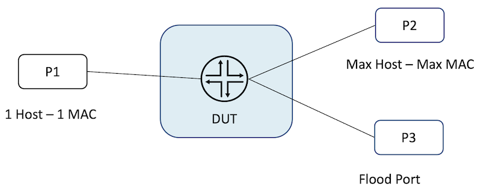

The test configures ports P1, P2  P3 in the same broadcast domain.

- A single host resides in P1
- Maximum hosts are present in P2
- P3 is used as a flood port

The test starts with sending traffic from the P1 having a single source to the MAX destinations (P2), such that the traffic will be flooded to the P2 and P3 ports. Once the hosts behind P2 start sending the traffic to the single destination at P1, mac-learning starts and flooding gradually reduces, the third port stop receiving traffic once the mac-learning is completed.

The time taken to reduce the flooding from max rate to zero is measured in seconds. The total MAC learned by the system is divided by the time taken to get zero flood traffic gives the number of MAC installed per second.

### Step 1:

Traffic is sent from a single source to max destination, such that the traffic is flooded to both P2 and P3 ports.

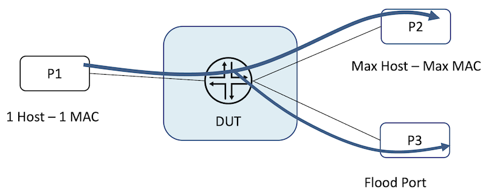

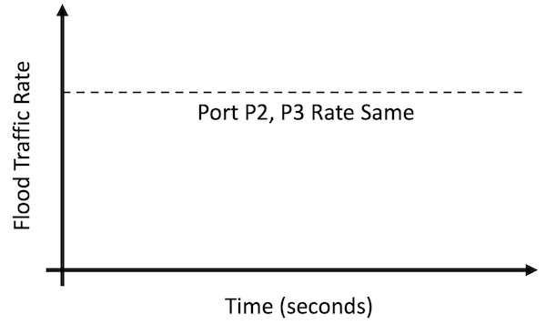

### Step 2:

Traffic is sent from P2, i.e. from maximum MAC as the source to the single destination at P1. MAC-learning starts at P2. As the MAC starts learning, flooding reduces and traffic at P3 touches ZERO.

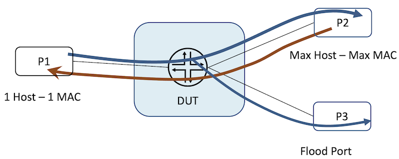

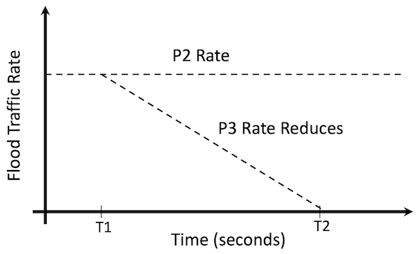

### Step 3:

The difference (T2-T1) gives the time taken to completely stop the flooding. The total MAC supported by the system is divided by (T2-T1) to get the number of MAC installed per second.

## ACX7100-32C Test Configurations

The test uses 5 Traffic Generator Port as we have limitations on the maximum number of hosts that can be simulated per port on the Traffic Generator. Out of the 5 Traffic Ports, the first port(P1) is the source of the traffic stream, and three ports(P2, P3, P4) each having 233333 hosts give a total MAC scale of 699999. The fifth port(P5) is the flooded port.

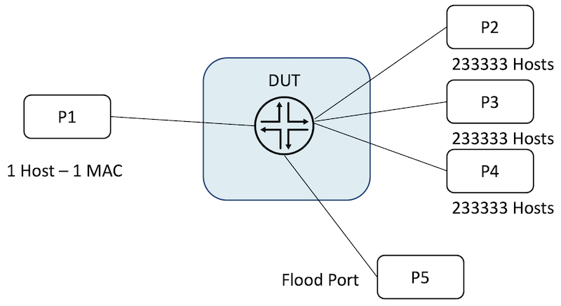

The host simulation at the traffic generator is as follows:

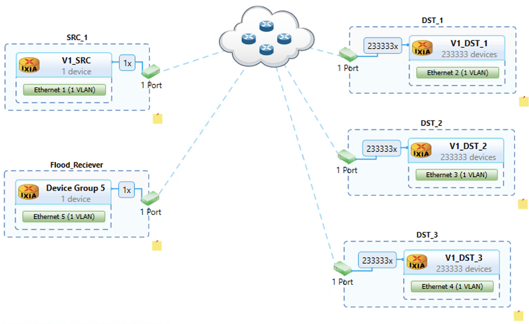

### Interface Configurations on the DUT

```
regress@PE1> show configuration interfaces |display inheritance no-comments

et-0/0/0 {
    flexible-vlan-tagging;
    mtu 9022;
    unit 0 {
        vlan-id 1;
        family ethernet-switching;
    }
}
et-0/0/1 {
    flexible-vlan-tagging;
    mtu 9022;
    unit 0 {
        vlan-id 1;
        family ethernet-switching;
    }
}
et-0/0/2 {
    flexible-vlan-tagging;
    mtu 9022;
    unit 0 {
        vlan-id 1;
        family ethernet-switching;
    }        
}
et-0/0/3 {
    flexible-vlan-tagging;
    mtu 9022;
    unit 0 {
        vlan-id 1;
        family ethernet-switching;
    }
}
et-0/0/4 {
    flexible-vlan-tagging;
    mtu 9022;
    unit 0 {
        vlan-id 1;
        family ethernet-switching;
    }
}

regress@PE1>
```

### VLAN configurations on the DUT

```
regress@PE1> show configuration vlans |display inheritance no-comments

V1 {
    vlan-id 1;
    interface et-0/0/0.0;
    interface et-0/0/1.0;
    interface et-0/0/2.0;
    interface et-0/0/3.0;
    interface et-0/0/4.0;
}

regress@PE1>
```

## ACX7100-32C Test Verifications

The VLAN Membership info for the ports is as follows:

```
regress@PE1> show vlans

Routing instance        VLAN name             Tag          Interfaces
default-switch          V1                    1
                                                           et-0/0/0.0*
                                                           et-0/0/1.0*
                                                           et-0/0/2.0*
                                                           et-0/0/3.0*
                                                           et-0/0/4.0*

regress@PE1>
```

### Flood State in the Traffic Generator

Once the traffic is sent from P1 to maximum destinations, it got flooded in P2, P3, P4 and P5 as follows:

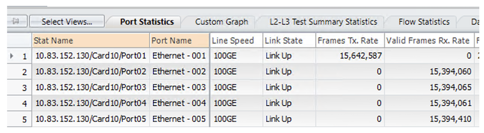

The rate on Tx(P1) and Flood Port(P5) as follows:

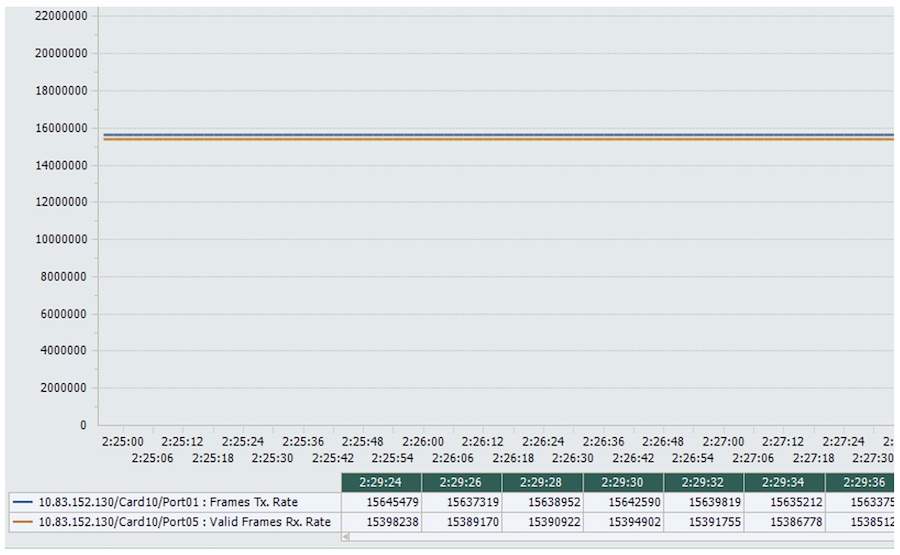

### The MAC Table from the Router

The MAC learned in the DUT shows only the single source behind P1

```
regress@PE1> show ethernet-switching table summary

Total dynamic and static MAC addresses learned globally : 1
Configured static MAC addresses learned globally       : 0

regress@PE1> show ethernet-switching table

MAC flags (S - static MAC, D - dynamic MAC, L - locally learned, P - Persistent static, C - Control MAC
           SE - statistics enabled, NM - non configured MAC, R - remote PE MAC, O - ovsdb MAC)

Ethernet switching table : 1 entries, 1 learned
Routing instance : default-switch
    Vlan                MAC                 MAC         Age    Logical                NH        RTR
    name                address             flags              interface              Index     ID
    V1                  00:11:01:00:00:01   D             -   et-0/0/0.0             0         0

regress@PE1>
```

### MAC Learning State in the Traffic Generator

Once the hosts behind P2, P3 and P4 starts sending the traffic, the flooding reduces to zero.

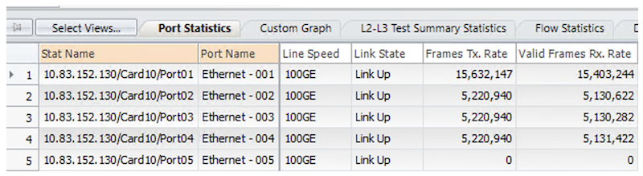

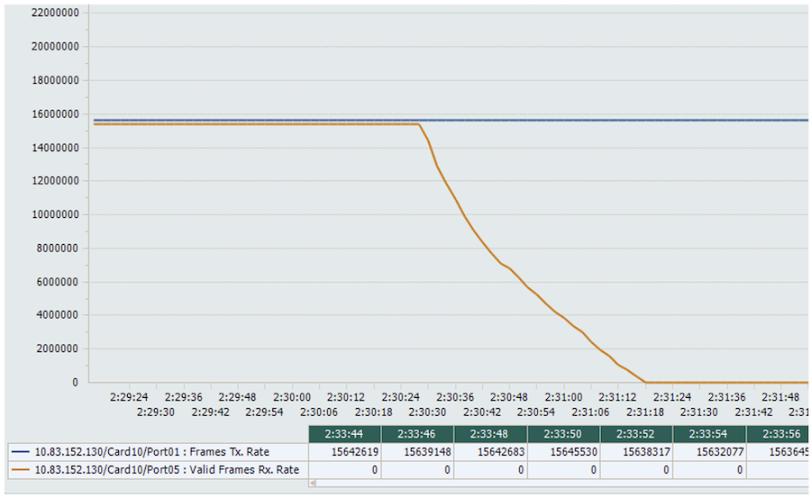

### MAC Learning State in the Router after Traffic is sent

```
regress@PE1> show ethernet-switching table summary
Total dynamic and static MAC addresses learned globally : 700000
Configured static MAC addresses learned globally       : 0

regress@PE1>
```

### MAC Learning Rate

The following snapshot captures the T1 and T2 time for the flood:

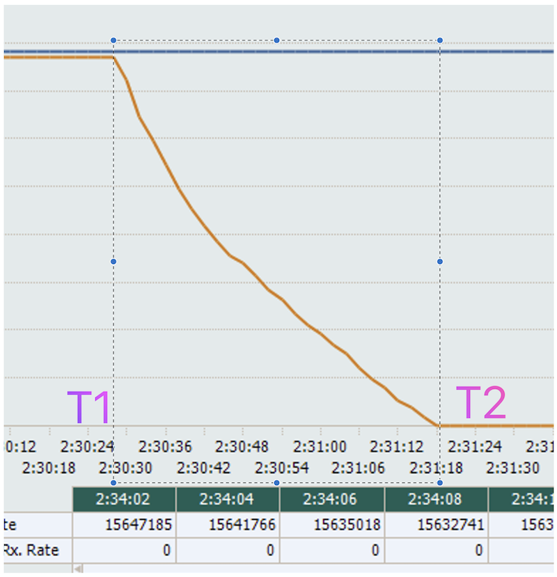

The MAC Learning Rate is calculated as follows:

- T1 = 2:30:28
- T2 = 2:31:18
- T2-T1 = 2:31:18 -- 2:30:28 = 50 seconds
- Total Number of MACs: 699999
- MAC Installed Per Second = 699999/50 = 13999.98 MACs per second

The 12 Core CPU is at 96% idle state during the traffic flow.

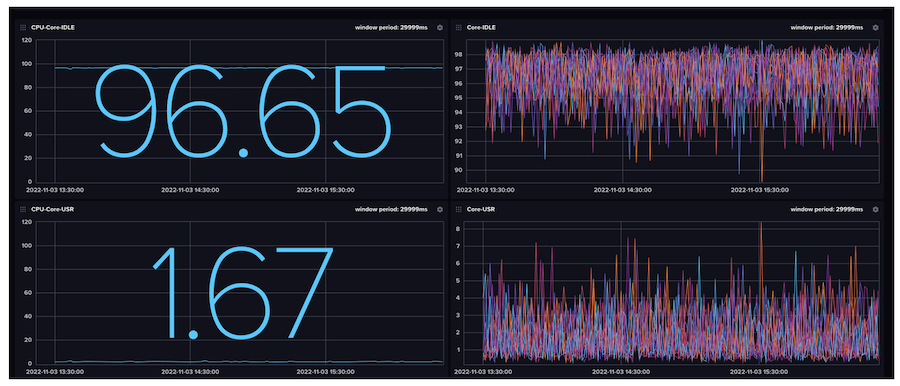

There are zero traffic drops for 700,000 MACs for a duration of 24+ hours.

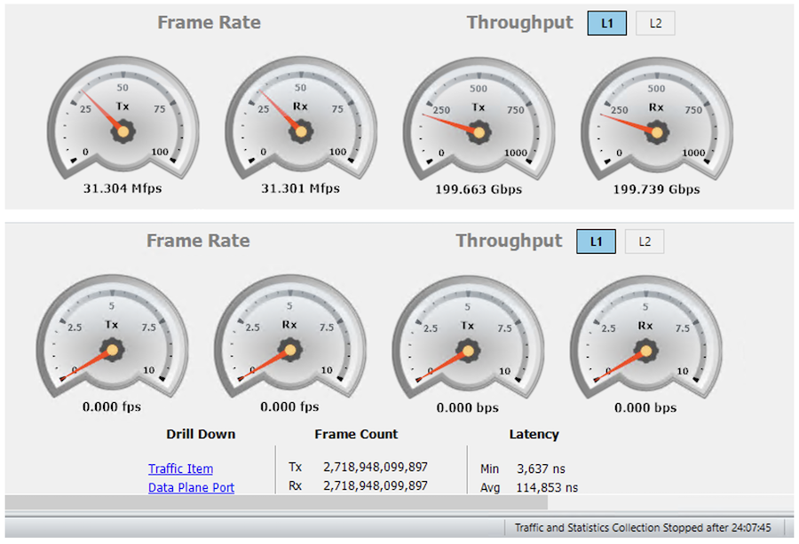

## Conclusion

In this last article of the series, we demonstrated the ACX7100-32C with 22.2R1 JUNOS-EVO image supports 700,000 MAC addresses with a mac-learning rate of ~14000 MACs per second. That completes this series aiming at proving the ACX7000 routers can be used in multiple Metro aggregation scenarios at high scale.

## References

- MAC Learning - [https://www.juniper.net/documentation/us/en/software/junos/multicast-l2/topics/topic-map/mac-learning.html](https://www.juniper.net/documentation/us/en/software/junos/multicast-l2/topics/topic-map/mac-learning.html)

## Glossary

- DUT -- Device Under Test
- KPI -- Key Performance Indicators
- LAN -- Local Area Network
- VLAN -- Virtual LAN

## Acknowledgement

Many thanks to Ramdas Machat, Deepak Kumar Tripathi, Vasily Mukhin and Nicolas Fevrier for reviewing the article and providing the feedback.
