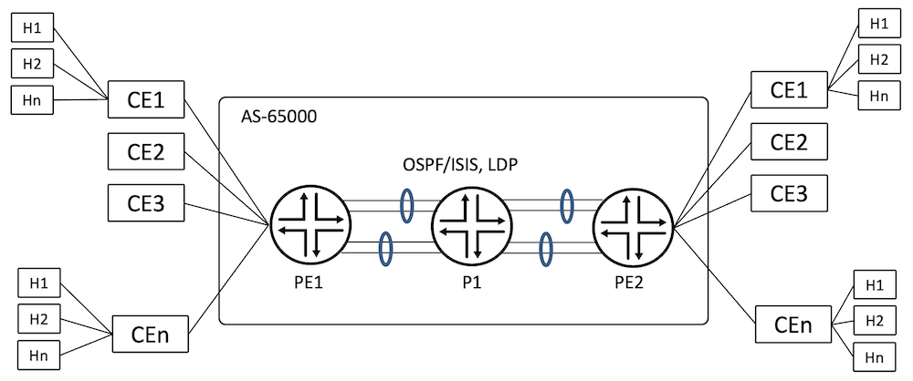
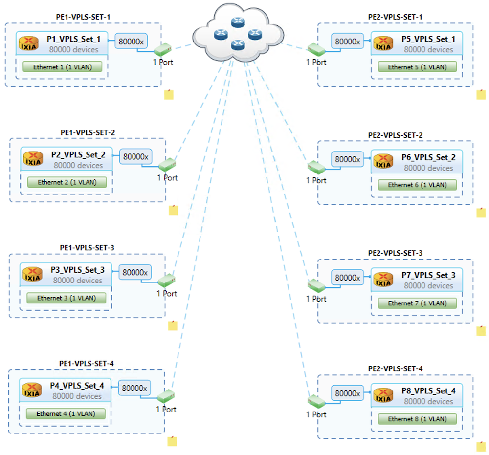
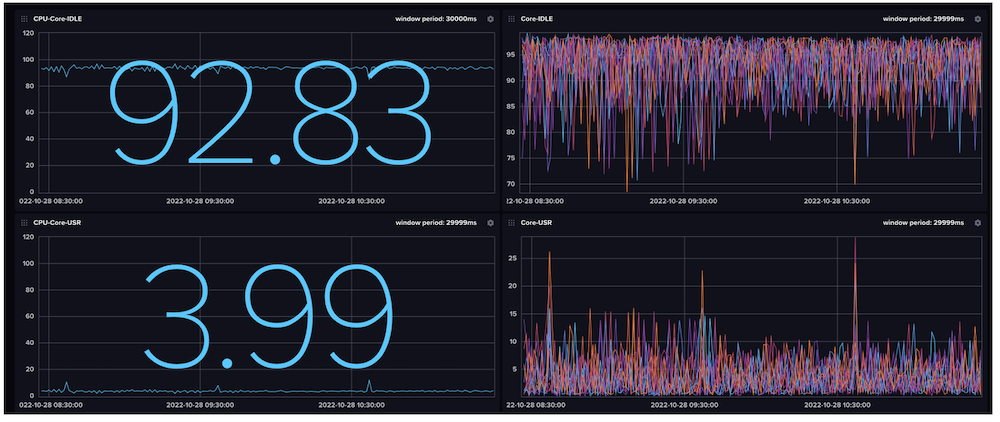
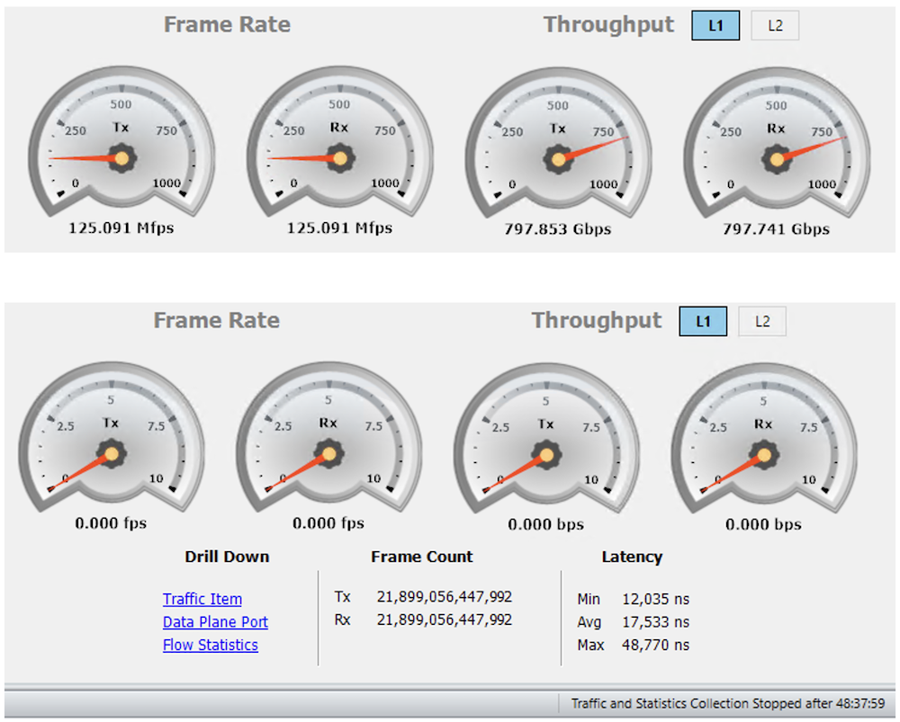

# VPLS Validation on ACX7000

**Suneesh Babu - 11/29/2022**

Let's verify we can support 8,000 VPLS instances in the ACX7000 products with 640,000 MAC addresses.

## Introduction

This is the fifth article in the ACX7k Metro Validation Series:

- [1. EVPN MAC-VRF (E-LAN)](https://juniper.github.io/techposts/evpn-mac-vrf-validation-on-acx7000/article)
- [2. EVPN VPWS](https://juniper.github.io/techposts/evpn-vpws-validation-on-acx7000/article)
- [3. L3VPN, 6VPE](https://juniper.github.io/techposts/l3vpn-validation-on-acx7000/article)
- [4. L2VPN](https://juniper.github.io/techposts/l2vpn-validation-on-acx7000/article)
- [5. VPLS](https://juniper.github.io/techposts/acx7000-vpls-validation/article)
- [6. L2 MAC Scale and Learning Rate](https://juniper.github.io/techposts/acx7000-l2-mac-scale-and-learning-rate/article)

In this article, we validate the VPLS feature scale support on the [ACX7100-32C](https://juniper.github.io/techposts/acx7100-deepdive/article) platform with 22.2R1 Junos-EVO build.

[VPLS](https://www.juniper.net/documentation/us/en/software/junos/vpn-l2/topics/concept/vpn-vpls-introduction.html) is a BGP or LDP MPLS Enabled Solution to connect Customer Edge Devices (CEs) across a Provider Edge Network. [RFC4761](https://www.rfc-editor.org/rfc/rfc4761) describes VPLS using BGP for Auto-Discovery and Signalling and [RFC4762](https://www.rfc-editor.org/rfc/rfc4762.html) presents VPLS using LDP Signalling. The PEs provide Layer 2 bridged connectivity between CEs. The PEs of the network are connected via MPLS technology with the help of [LDP](https://www.juniper.net/documentation/us/en/software/junos/mpls/topics/topic-map/ldp-overview.html), [RSVP](https://www.juniper.net/documentation/us/en/software/junos/mpls/topics/topic-map/rsvp-overview.html), [SR-MPLS](https://blogs.juniper.net/en-us/industry-solutions-and-trends/segment-routing-sr-with-multiprotocol-label-switching-mpls), etc. In VPLS, the MAC address associated with the hosts is learned via the data plane.

JUNOS-EVO supports VPLS functionality with the instance type "virtual-switch" on ACX7000 platforms. In this article, we define the support and scale of the VPLS on the ACX7100-32C platform with LDP Signalling.

[ACX7100-32C](https://www.juniper.net/us/en/products/routers/acx-series/acx7000-family-cloud-metro-routers/acx7100-line/acx7100-cloud-metro-routers-datasheet.html) with 22.2R1 Junos Version supports 8,000 VPLS instances. The Key Performance Indicator (KPI) tested are captured in the below table. The same scale is tested on ACX7100-48L as well as on [ACX7509](https://juniper.github.io/techposts/acx7024-deepdive/article) Scale is not covered in this article and supports a different scale.

 > Please note that despite sharing the same ACX moniker, the ACX7000 products are different products than ACX500/710/1000/1100/2100/2200/4000/5000/5400/6000. They are powered by different Packet Forwarding Engines (PFE), and support different feature sets and scales.

The Key Performance Indicator (KPI) tested are:

| KPI | Scale |
|:--|:--|
| VPLS Instance | 8,000 |
| Number of VLANs | 8,000 |
| Number of interfaces | 8,000 |
| Number of MAC addresses | 640,000 |

## Metro VPLS Topology

Test topology consists of three routers: PE1, P1 and PE2, where :

- ACX7100-32C is PE1
- ACX7100-48L is PE2
- P1 is a [PTX10008](https://www.juniper.net/documentation/us/en/hardware/ptx10008/topics/topic-map/ptx10008-line-card-components.html#line-Card-ptx10k-lc201)

PEs are connected to CEs using 4x 100GE links. CEs are simulated using a traffic generator. PEs are connected to the core using 8x 100GE links, which are bundled in 2x LAGs each having four links.

The ACX7100-32C is the Device Under Test (DUT). The underlay transport used for testing is LDP with both [OSPF](https://www.juniper.net/documentation/us/en/software/junos/ospf/topics/topic-map/ospf-overview.html) and [ISIS](https://www.juniper.net/documentation/us/en/software/junos/is-is/topics/concept/is-is-routing-overview.html) protocols individually. The CE-bound interface configurations are of SP-Style (see glossary).



Test configures 8,000 virtual-switch instances, 80 MACs are learned per instance, 40 from local and 40 from remote peers. Bidirectional traffic in iMIX mode at 99.9% offer-load flows for all the VPLS services. A total of ~800Gbps traffic transits through the DUT.

## VPLS Configurations

This section covers the configurations required to bring up VPLS using LDP signalling. In the PE Network, we can have OSPF or ISIS as the IGP protocol for the node connectivity and LDP or RSVP helps to bring up the transport protocol. BGP Auto-Discovery and ldp-signalling is enabled across the PE devices to enable VPLS services.

### Configurations at PE1

```
regress@PE1> show configuration protocols |display inheritance no-comments 

bgp {
    group IBGP {
        type internal;
        local-address 12.1.1.1;
        family inet {
            unicast;
        }
        family l2vpn {
            signaling;
        }
        neighbor 12.1.1.3 {
            export nhself;
        }
    }
}                                       
isis {
    interface lo0.0 {
        passive;
    }
    interface ae0.0 {
        level 1 disable;
        point-to-point;
    }
    interface ae1.0 {
        level 1 disable;
        point-to-point;
    }
    level 1 disable;
    level 2 wide-metrics-only;
}
ldp {
    interface ae0.0;
    interface ae1.0;
    interface lo0.0;
}
mpls {
    icmp-tunneling;
    ipv6-tunneling;
    interface ae0.0;
    interface ae1.0;
}                                       

regress@PE1>
```

Routing-Instance configuration required to bringup the LDP signalling based VPLS instances:

```
interfaces {
    et-0/0/0 {
        flexible-vlan-tagging;
        encapsulation flexible-ethernet-services;
        unit 1 {
            encapsulation vlan-vpls;
            vlan-id 1;
        }
    }
}
routing-instances {
    METRO_VPLS_VRF_1 {
        instance-type virtual-switch;
        protocols {
            vpls {
                neighbor 12.1.1.3;
                site-range 65534;
                label-block-size 8;
                no-tunnel-services;
                vpls-id 1;
            }
        }
        switch-options {
            mac-table-size {
                5120;
            }
        }
        route-distinguisher 12.1.1.1:1;
        vrf-target target:65000:1;
        vlans {
            VLAN_1 {
                vlan-id 1;
                interface et-0/0/0.1;
            }
        }
    }
}
```

### CE Bound Interface Schema

The PE devices are connected to the traffic generator using 4x 100GE interfaces, each interface is logically split into sub-interfaces using VLANs, one interface bound to one VPLS instance.

| PE1 | PE2 | Port | Service Type | VRF | VLAN Association | Number of MAC | Traffic Load |
|:--|:--|:--|:--|:--|:--|:--|:--|
| et-0/0/0 | et-0/0/48:0 | P1 | virtual-switch | 1-2000 | 1-2000 | 160000 | 99.9% |
| et-0/0/1 | et-0/0/48:1 | P2 | virtual-switch | 2001-4000 | 1-2000 | 160000 | 99.9% |
| et-0/0/2 | et-0/0/48:2 | P3 | virtual-switch | 4001-6000 | 1-2000 | 160000 | 99.9% |
| et-0/0/3 | et-0/0/48:3 | P4 | virtual-switch | 6001-8000 | 1-2000 | 160000 | 99.9% |

## VPLS Verification

The first step to verify the VPLS service is to make sure that PE devices are having BGP established with l2vpn-signalling. As shown below from PE1, BGP is in established state for the Peer PE2 (12.1.1.3):

```
regress@PE1> show bgp summary
Threading mode: BGP I/O
Default eBGP mode: advertise - accept, receive - accept
Groups: 1 Peers: 1 Down peers: 0
Table          Tot Paths  Act Paths Suppressed    History Damp State    Pending
inet.0               
                       9          1          0          0          0          0
inet6.0              
                       0          0          0          0          0          0
bgp.l2vpn.0         
                       0          0          0          0          0          0
inet6.3              
                       0          0          0          0          0          0
Peer                     AS      InPkt     OutPkt    OutQ   Flaps Last Up/Dwn State|#Active/Received/Accepted/Damped...
12.1.1.3              65000          7          6       0       0          10 Establ
  inet.0: 1/9/9/0
  bgp.l2vpn.0: 0/0/0/0
  METRO_VPLS_VRF_1.l2vpn.0: 0/0/0/0
  METRO_VPLS_VRF_2.l2vpn.0: 0/0/0/0
  METRO_VPLS_VRF_3.l2vpn.0: 0/0/0/0
...
  METRO_VPLS_VRF_7998.l2vpn.0: 0/0/0/0
  METRO_VPLS_VRF_7999.l2vpn.0: 0/0/0/0
  METRO_VPLS_VRF_8000.l2vpn.0: 0/0/0/0

regress@PE1>
```

The MAC-Table Summary captures 640,000 MACs of the host.

```
regress@PE1> show ethernet-switching table summary 
Total dynamic and static MAC addresses learned globally : 640000
Configured static MAC addresses learned globally : 0 
```

The VPLS connections is UP towards the 12.1.1.3 Peer for the routing-instance METRO_VPLS_VRF_1

```
regress@PE1> show vpls connections instance METRO_VPLS_VRF_1
Layer-2 VPN connections:

Legend for connection status (St)
EI -- encapsulation invalid      NC -- interface encapsulation not CCC/TCC/VPLS
EM -- encapsulation mismatch     WE -- interface and instance encaps not same
VC-Dn -- Virtual circuit down    NP -- interface hardware not present
CM -- control-word mismatch      -> -- only outbound connection is up
CN -- circuit not provisioned    <- -- only inbound connection is up
OR -- out of range               Up -- operational
OL -- no outgoing label          Dn -- down                  
LD -- local site signaled down   CF -- call admission control failure
RD -- remote site signaled down  SC -- local and remote site ID collision
LN -- local site not designated  LM -- local site ID not minimum designated
RN -- remote site not designated RM -- remote site ID not minimum designated
XX -- unknown connection status  IL -- no incoming label
MM -- MTU mismatch               MI -- Mesh-Group ID not available
BK -- Backup connection          ST -- Standby connection
PF -- Profile parse failure      PB -- Profile busy
RS -- remote site standby    SN -- Static Neighbor
LB -- Local site not best-site   RB -- Remote site not best-site
VM -- VLAN ID mismatch           HS -- Hot-standby Connection

Legend for interface status 
Up -- operational
Dn -- down
                              
Instance: METRO_VPLS_VRF_1
Edge protection: Not-Primary
  LDP-VPLS State
  VPLS-id: 1
  Mesh-group connections: __ves__
    Neighbor                  Type  St     Time last up          # Up trans
    12.1.1.3(vpls-id 1)       rmt   Up     Oct 27 09:49:15 2022           1
      Remote PE: 12.1.1.3, Negotiated control-word: No
      Incoming label: 16, Outgoing label: 16
      Negotiated PW status TLV: No
      Local interface: lsi.1048576, Status: Up, Encapsulation: ETHERNET
        Description: Intf - vpls METRO_VPLS_VRF_1 neighbor 12.1.1.3 vpls-id 1
      Flow Label Transmit: No, Flow Label Receive: No

regress@PE1>
```

The VLAN Association of the METRO_MAC_VRF_1 instance is shown below.

```
regress@PE1> show vlans VLAN_1

Routing instance        VLAN name             Tag          Interfaces
METRO_VPLS_VRF_1        VLAN_1                1        
                                                           et-0/0/0.1*
                                                           lsi.1048576*

regress@PE1>
```

The VPLS Forwarding Table of METRO_VPLS_VRF_1 instance captures the MAC addresses from both local and remote interfaces.

```
regress@PE1> show ethernet-switching table instance METRO_VPLS_VRF_1

MAC flags (S - static MAC, D - dynamic MAC, L - locally learned, P - Persistent static, C - Control MAC
           SE - statistics enabled, NM - non configured MAC, R - remote PE MAC, O - ovsdb MAC)

Ethernet switching table : 80 entries, 80 learned
Routing instance : METRO_VPLS_VRF_1
    Vlan                MAC                 MAC         Age    Logical                NH        RTR
    name                address             flags              interface              Index     ID
    VLAN_1              00:11:01:00:00:01   D             -   et-0/0/0.1             0         0
    VLAN_1              00:11:01:00:00:02   D             -   et-0/0/0.1             0         0
...
    VLAN_1              00:11:01:00:00:27   D             -   et-0/0/0.1             0         0
    VLAN_1              00:11:01:00:00:28   D             -   et-0/0/0.1             0         0
    VLAN_1              00:15:01:00:00:01   D             -   lsi.1048576            0         0      
    VLAN_1              00:15:01:00:00:02   D             -   lsi.1048576            0         0
....
    VLAN_1              00:15:01:00:00:27   D             -   lsi.1048576            0         0
    VLAN_1              00:15:01:00:00:28   D             -   lsi.1048576            0         0    

regress@PE1>
```

The following output captures the total number of instances and total MAC learned in the DUT.

```
regress@PE1> show vpls connections |match "rmt   Up" | count
Count: 8000 lines

regress@PE1> show ethernet-switching table summary
Total dynamic and static MAC addresses learned globally : 640000
Configured static MAC addresses learned globally       : 0

regress@PE1> show route summary
Autonomous system number: 65000
Router ID: 12.1.1.1

Highwater Mark (All time / Time averaged watermark)
    RIB unique destination routes: 32046 at 2022-10-27 09:49:42 / 0
    RIB routes                   : 32054 at 2022-10-27 09:49:42 / 0
    FIB routes                   : 16032 at 2022-10-27 09:49:42 / 0
    VRF type routing instances   : 0 at 2022-10-27 09:43:24

inet.0: 28 destinations, 36 routes (28 active, 0 holddown, 0 hidden)
              Direct:      4 routes,      4 active
               Local:      3 routes,      3 active
                 BGP:      9 routes,      1 active
              Static:     14 routes,     14 active
               IS-IS:      5 routes,      5 active
                 LDP:      1 routes,      1 active

inet.3: 2 destinations, 2 routes (2 active, 0 holddown, 0 hidden)
                 LDP:      2 routes,      2 active

iso.0: 1 destinations, 1 routes (1 active, 0 holddown, 0 hidden)
              Direct:      1 routes,      1 active

mpls.0: 16009 destinations, 16009 routes (16009 active, 0 holddown, 0 hidden)
                MPLS:      6 routes,      6 active
                 LDP:      3 routes,      3 active
                VPLS:  16000 routes,  16000 active

inet6.0: 4 destinations, 4 routes (4 active, 0 holddown, 0 hidden)
              Direct:      2 routes,      2 active
                 BGP:      1 routes,      1 active
               INET6:      1 routes,      1 active

inet6.3: 2 destinations, 2 routes (2 active, 0 holddown, 0 hidden)
                 LDP:      2 routes,      2 active

l2circuit.0: 16000 destinations, 16000 routes (16000 active, 0 holddown, 0 hidden)
                 LDP:   8000 routes,   8000 active
                VPLS:   8000 routes,   8000 active

regress@PE1>
```

### Traffic Verification at Router at PE1

Traffic load-balanced across the LAG bundles ae0 and ae1 towards the core and among the member links of the LAG's.

```
PE1                               Seconds: 8                   Time: 20:19:40

Interface    Link  Input packets        (pps)     Output packets        (pps)

 ae0           Up  3868838703698   (31186310)    3880085080678   (31271792)
 ae1           Up  3890226133290   (31360142)    3879121784169   (31272766)
 esi           Up              0          (0)                0          (0)
 et-0/0/0      Up  1939850875296   (15635490)    1939627063135   (15635223)
 et-0/0/1      Up  1939850824172   (15635475)    1939625876351   (15635416)
 et-0/0/2      Up  1939850765486   (15635220)    1939626354193   (15635382)
 et-0/0/3      Up  1939850784451   (15635227)    1939627926794   (15635176)
 et-0/0/4      Up              0          (0)             4478          (0)
 et-0/0/5    Down              0          (0)                0          (0)
 et-0/0/6      Up   964863965085    (7776937)     970021565092    (7817826)
 et-0/0/7      Up   963482838231    (7766530)     970046108276    (7818076)
 et-0/0/8      Up   973253565004    (7845764)     969996802574    (7817824)
 et-0/0/9      Up   967238335378    (7797079)     970020604736    (7818066)
 et-0/0/10     Up   965735799928    (7784996)     969828700176    (7818528)
 et-0/0/11     Up   980547733423    (7904378)     969732569828    (7817790)
 et-0/0/12     Up   970951694823    (7827028)     969804548668    (7818413)
 et-0/0/13     Up   972990905116    (7843740)     969755965497    (7818035)
```

## Generating Scale Configuration

The Python Script is having three components, a Jinja File capturing the various configuration templates, a Params File capturing the various user variables and the script uses both these input files and generates the required configurations and commit that in the router.

Note: The configs are generated as per the CE-bound interface schema.

### Jinja Configuration Template

The template contains configurations for both interfaces which are part of the routing instances and routing instance configurations.

```
# Routing Instnace Configuration
# File Name: vpls_jinja.j2
# Version: 1.0
groups {{group_name}} {
    interfaces {
        {{ifd_name}} {
            flexible-vlan-tagging;
            encapsulation flexible-ethernet-services;
            
            unit {{unit_id}} {
                vlan-id {{vlan_id}};
                encapsulation vlan-vpls;
            }
            
        }
    }
    routing-instances {
        
        METRO_VPLS_VRF_{{vrf_id}} {
            instance-type virtual-switch;
            switch-options {
                
                mac-table-size {
                    {{mac_table_size}};
                }
                
            }
            vlans {
                VLAN_{{vrf_id}} {
                    vlan-id {{vlan_id}};
                    interface {{ifl_name}};
                }
            }
            route-distinguisher {{router_id}}:{{vrf_id}};
            vrf-target target:{{local_as_no}}:{{vrf_id}};
            protocols {
                vpls {
                    neighbor {{neighbor_id}};
                    site-range {{site_range}};
                    label-block-size {{label_block_size}};
                    
                    no-tunnel-services;
                    
                    vpls-id {{vpls_id}};
                }
            }
        }
        
    }
}
```

### Configuration Parameters

```
---
# This file contains the parameters for vpls configuration building
# File Name: vpls_params.yaml
# Version: 1.0

#Host Name
# host: 'rtme-acx7100-32c-a.englab.juniper.net'
host: 'rtme-acx-48l-10.englab.juniper.net'

#UserName
username: 'regress'
password: 'MaRtInI'

#Config Group Name
group_name: 'METRO_VPLS'

#vrfname creation
vrf_id: 1

#maximum vpls instances 
vrf_max: 100

#interface name
ifd_name: 'et-0/0/0'

#ifl_start unit
ifl_start_unit: 1

#vlan_id start
vlan_id_start: 1

#vpls_id start
vpls_id_start: 2001

#My AS no
local_as_no: 65000

#My Router ID
router_id: '12.1.1.1'

#VPLS Neighbor ID
neighbor_id: '12.1.1.3'

#Mac Table size
mac_table_size: 5120

#Site Range
site_range: 65534

#Tunnel Service:
tunnel_disable: True

#Mac Table Size Defined
mac_table_size_defined: True

#Label Block Size:
label_block_size: 8
```

### Configuration Script

```
#! /usr/bin/python
"""
    FileName: create_vpls_vrf.py
    Version: 1.0
    Description: This script will create vpls vrf instances and configure it on the router
    Author: Suneesh Babu
"""
import yaml
from glob import glob
from jinja2 import Template
import ipaddress
from jnpr.junos.utils.config import Config
from jnpr.junos import Device
from jnpr.junos.factory import loadyaml
from jnpr.junos.op import *

def iflrange(ifd_name, start_unit, max):
    """
    This subroutine yields the specified number of l3 ifls for the ifd
    """
    while(max):
        iflname = ifd_name + '.' + str(start_unit)
        yield iflname
        start_unit += 1
        max -= 1

def router_operation(config_filename, data, mode):
    """
        This sub-routine connectes to the router and do the necessary commit operations
    """
    router = Device(host=data['host'], user=data['username'], password=data['password'], port=22)
    router.open()

    cfg = Config(router)
    if mode == 'jinja':
        cfg.load(template_path=config_filename, template_vars=data, format='text', merge=True)
    elif mode == 'setfile':
        cfg.load(path=config_filename, format='set')
    cfg.pdiff()
    cfg.commit()
    router.close()

def jinja_template_input(data):
    """
        This sub-routine yields the variables required for the jinja template
    """
    ifl_unit_list = range(int(data['ifl_start_unit']), int(data['ifl_start_unit']) + int(data['vrf_max']))
    vlan_list = range(int(data['vlan_id_start']), int(data['vlan_id_start']) + int(data['vrf_max']))

    vrf_id_list = range(int(data['vrf_id']), int(data['vrf_id']) + int(data['vrf_max']))
    ifl_name_list = iflrange(data['ifd_name'], data['ifl_start_unit'], int(data['vrf_max']))

    vpls_id_list = range(int(data['vpls_id_start']), int(data['vpls_id_start']) + int(data['vrf_max']))

    return zip(ifl_unit_list, vlan_list), zip(vrf_id_list, list(ifl_name_list), vlan_list, vpls_id_list)

def main():
    """
       To Build the desired number of vpls instances
    """
    print("Step-1: Read the Variables from the Params File")
    with open(glob('vpls_params.yaml')[0]) as fh:
        data = yaml.safe_load(fh.read())

    print("Step-2: Build the Data Feed for the Jinja Template Input")
    ifl_attributes, vpls_attributes = jinja_template_input(data)
    data['ifl_variables'] = ifl_attributes
    data['vpls_variables'] = vpls_attributes

    print("Step-3: Build the configuration file from Jinja Template")
    with open(glob('vpls_jinja.j2')[0]) as t_fh:
        t_format = t_fh.read()
    vpls_snippet = Template(t_format)
    # print (vpls_snippet.render(data))

    print("Step-4: Load the config into router and commit it")
    router_operation('vpls_jinja.j2', data, 'jinja')

if __name__ == '__main__':
    main()
```

## Traffic Generator Configuration

CE devices and hosts are simulated as follows:



### CPU Usage during traffic flow

The 12 Core ACX7100-32C remains idle at 93% during the traffic flow:



### Data Plane Traffic Verification

As shown below traffic flows at 99.9% of 100G links over 4 CE bound interfaces and no packet drops are seen for a duration of 48 hours.



## Conclusion

ACX7000 (ACX7100-32C, ACX7100-48L, ACX7509) can scale to 8,000 VPLS instances and 640,000 MAC addresses, it caters for Metro aggregation requirements. Next and finale article of the series will be dedicated to L2 MAC scale and learning rate validation, stay tuned :)

## References

- RFC 4761: [https://www.rfc-editor.org/rfc/rfc4761](https://www.rfc-editor.org/rfc/rfc4761)
- RFC 4782: [https://www.rfc-editor.org/rfc/rfc4762](https://www.rfc-editor.org/rfc/rfc4762)
- ACX7100 Deepdive: [https://juniper.github.io/techposts/acx7100-deepdive/article](https://juniper.github.io/techposts/acx7100-deepdive/article)
- ACX7509 Deepdive: [https://juniper.github.io/techposts/acx7509-deepdive/article](https://juniper.github.io/techposts/acx7509-deepdive/article)

## Glossary

- BGP -- Border Gateway Protocol
- CE -- Customer Edge Node
- DUT -- Device Under Test
- KPI -- Key Performance Indicators
- LAN -- Local Area Network
- MAC -- Media Access Control
- MPLS -- Multi Protocol Label Switching
- OSPF -- Open Shortest Path First
- P/PE -- Provider/Provider Edge Node
- SP Style -- Service Provider Style
- VLAN -- Virtual LAN
- VPLS -- Virtual Private LAN Service
- VRF -- Virtual Routing and Forwarding

## Acknowledgement

Many thanks to Ramdas Machat, Deepak Kumar Tripathi, Vasily Mukhin and Nicolas Fevrier for reviewing the article and providing the feedback
