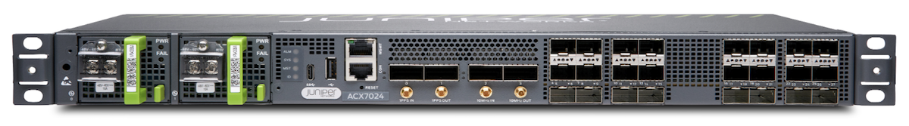
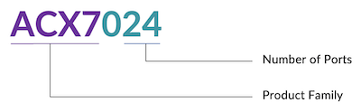
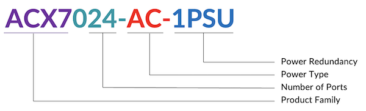
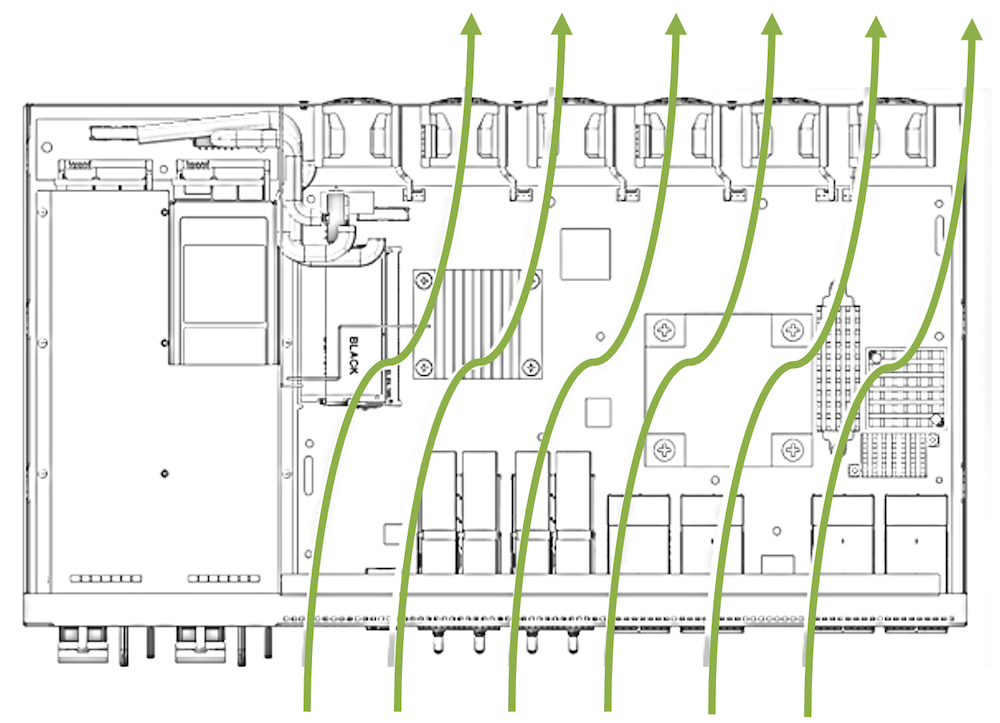
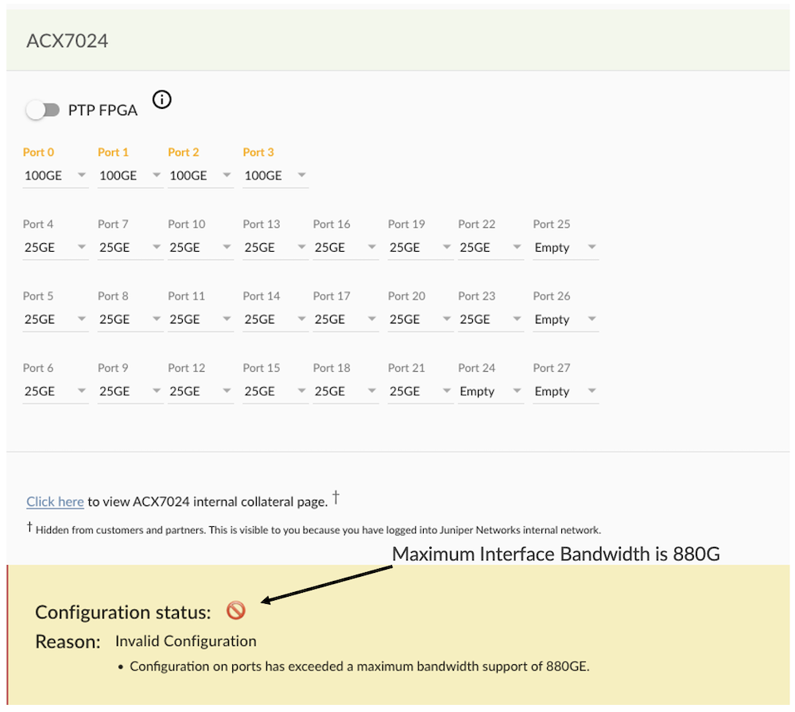
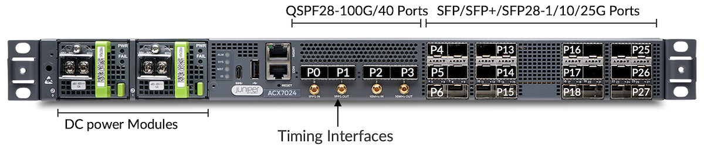
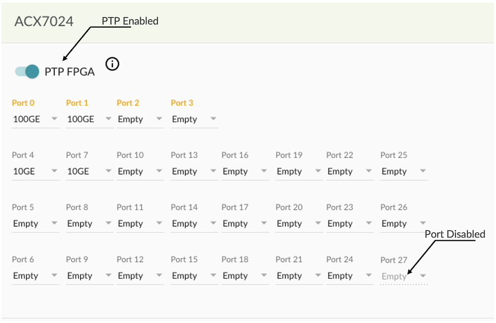
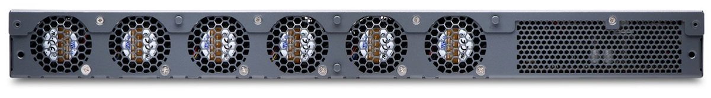
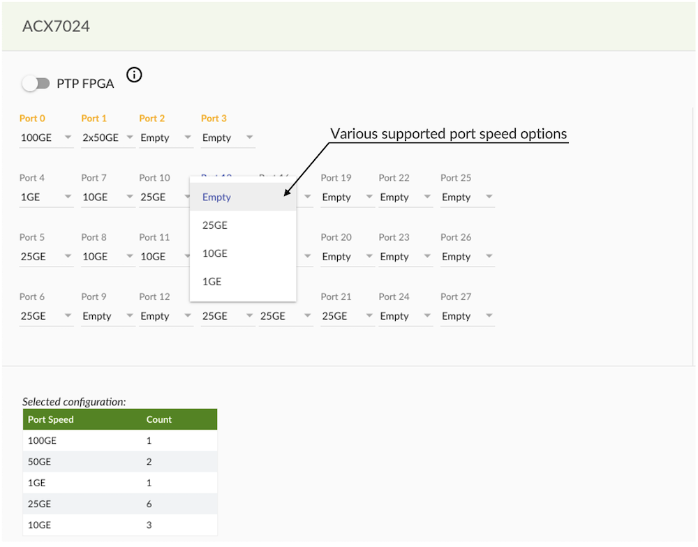
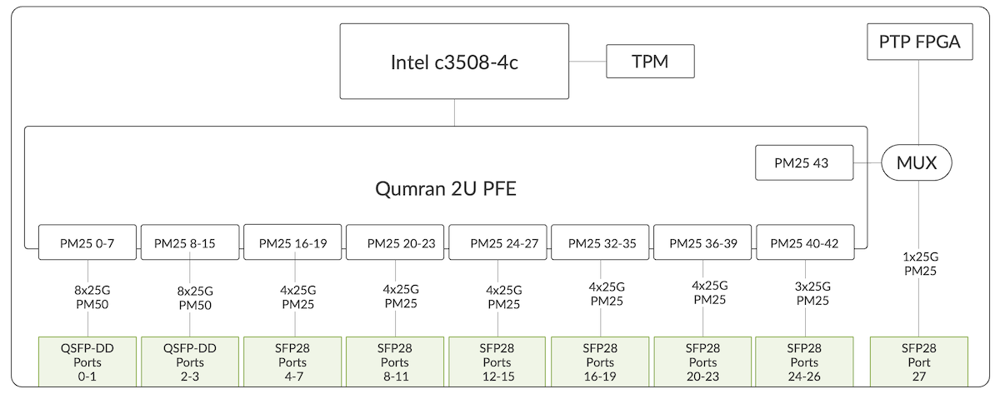

# ACX7024 Deepdive

**Pankaj Kumar - 09/13/2022**

Everything about the new addition to the Cloud-Metro family, the ACX7024. A 1-RU router, with 360Gbps forwarding capacity.

## Introduction



ACX7024 is 1RU Ethernet-only router with 360Gbps bidirectional forwarding capacity and with Class-C Timing. It is the temperature hardened and support from -40C to +65C.

This router is primarily targeted at the Cell site /Access market but can be used in multiple roles as soon as features and scales are meeting the requirements. It supports Ethernet ports from 1GE to 100GE.

Maximum number of ports supported on ACX7024:

| Port Speed | ACX7024 Ports Details | Total |
|:--|:--|:--|
| 100GE | 4x1 | 4 |
| 50GE | 4x (2x1) | 8 |
| 40GE | 4x1 | 4 |
| 25GE | 24 + 4x (4x1) | 40 |
| 10GE | 24 + 4x (4x1) | 40 |
| 1GE | 24x1 | 24 |

### Naming Convention

We have a total of 4 SKUs (Stock Keeping Units) available based on Power supply module type and number.

- ACX7024-DC-1PSU: ACX7024 with single DC PSU
- ACX7024-DC-2PSU: ACX7024 with two DC PSUs Redundant PSU]
- ACX7024-AC-1PSU: ACX7024 with single AC PSU
- ACX7024-AC-2PSU: ACX7024 with two AC PSUs [Redundant PSU]

Ports density: 4x 100GE and 24 x 1/10/25GE:

- Port Number 0 to 3 [QSFP+ 40/100G]
- Port Number 4 to 27 [SFP+ 1/10/25/G]

System cooling is AFO (Air Flow Out / Front-to-Back) or Side to side with Baffle. And we have 4 options for power supply:  AC or DC, and 1 or 1+1 PSU. The typical power consumption is below 200W.

Based on these parameters, the naming logic for the product itself and the SKU are the following.







```
root@acx7024-01# set chassis pem minimum 1 <<< If using only one PSU unit
```

### Environment standards

ACX7024 is the temperature hardened box [-40C to 65C]and is compliant to below Environment standards

- IEEE1613:2013 Smart Grid -- Power Substations
- IEC 61850-3:2013 Telecom equipment in Power station and substation environments
- GR 63 issue 5
- GR 3108- Class 2 Edition 3

```
root@rtme-acx7024-01> show chassis hardware
Hardware inventory:
Item             Version  Part number  Serial number     Description
Chassis                                FL1822Axxxxx      JNP7024 [ACX7024]
PSM 0            REV 02   740-134839   1F34C0xxxxx       JPSU-400W-DC-AFI
PSM 1            REV 02   740-134839   1F34C0xxxxx       JPSU-400W-DC-AFI
Routing Engine 0 REV 06   650-136135   FL1822Axxxxx      RE-ACX-7024
CB 0                      BUILTIN      BUILTIN           Control Board
FPC 0                     BUILTIN      BUILTIN           ACX7024-FPC
  PIC 0                   BUILTIN      BUILTIN           MRATE- 24xSFP28 + 4xQSFP
    Xcvr 4       REV 01   740-031980   A44Bxxx           SFP+-10G-SR
    Xcvr 5       REV 01   740-031980   A41Bxxx           SFP+-10G-SR
    Xcvr 7       REV 01   740-031981   K5V20xxxxx        SFP+-10G-LR
    Xcvr 8       REV 01   740-031981   K6R20xxxxx        SFP+-10G-LR
Fan Tray 0                BUILTIN      BUILTIN           ACX7024 Fan, Front to Back Airflow - AFO
```

### Software

```
root@rtme-acx7024-01> show version
Hostname: rtme-acx7024-01
Model: ACX7024
Junos: 22.3R1.1-EVO
Yocto: 3.0.2
Linux Kernel: 5.2.60-yocto-standard-g3614f3c
JUNOS-EVO OS 64-bit [junos-evo-install-acx-f-x86-64-22.3R1.1-EVO]
 
root@rtme-acx7024-01>
```

### Oversubscription



## ACX7024 Ethernet Ports

### ACX7024 Front Panel view and Port Numbering



| Port Number | Optic Type | Supported Port Speed | Default Port Speed |
|:--|:--|:--|:--|
| 0 - 3 | QSFP28/QSFP+ | 100G,40G,2x50G,4x25,4x10G | 100G |
| 4 - 27 | SFP/SFP+/SFP28 | 1G,10G,25G | 10G |

```
acx7024> show chassis pic fpc-slot 0 pic-slot 0
Port speed information:
 
  Port  PFE      Capable Port Speeds
  0      0       1x100G 1x40G 2x50G 4x25G 4x10G
  1      0       1x100G 1x40G 2x50G 4x25G 4x10G
  2      0       1x100G 1x40G 2x50G 4x25G 4x10G
  3      0       1x100G 1x40G 2x50G 4x25G 4x10G
  4      0       1x10G 1x1G 1x25G
  5      0       1x10G 1x1G 1x25G
  6      0       1x10G 1x1G 1x25G
  7      0       1x10G 1x1G 1x25G
  8      0       1x10G 1x1G 1x25G
  9      0       1x10G 1x1G 1x25G
  10     0       1x10G 1x1G 1x25G
  11     0       1x10G 1x1G 1x25G
  12     0       1x10G 1x1G 1x25G
  13     0       1x10G 1x1G 1x25G
  14     0       1x10G 1x1G 1x25G
  15     0       1x10G 1x1G 1x25G
  16     0       1x10G 1x1G 1x25G
  17     0       1x10G 1x1G 1x25G
  18     0       1x10G 1x1G 1x25G
  19     0       1x10G 1x1G 1x25G
  20     0       1x10G 1x1G 1x25G
  21     0       1x10G 1x1G 1x25G
  22     0       1x10G 1x1G 1x25G
  23     0       1x10G 1x1G 1x25G
  24     0       1x10G 1x1G 1x25G
  25     0       1x10G 1x1G 1x25G
  26     0       1x10G 1x1G 1x25G
  27     0       1x10G 1x1G 1x25G
  28     NA      1x10G
```

### ACX7024 Port

```
root@rtme-acx7024-01# set chassis fpc 0 pic 0 ptp-mode. <<< PTP mode enabled
 
root@rtme-acx7024-01# commit
commit complete
 
[edit]
root@rtme-acx7024-01# run show interfaces terse et-0/0/27
error: device et-0/0/27 not found       <<< Once PTP is committed HW FPGA of port et-0/0/27 will be used in PTP circuitry.
```



### ACX7024 Rear View



```
root@rtme-acx7024-02> show chassis environment
Class Item                           Status     Measurement
Power PSM 0                          OK         39 degrees C / 102 degrees F
      PSM 1                          OK         37 degrees C / 98 degrees F
Temp  FPC 0 Sensor Q2U Max Reading   OK         51 degrees C / 123 degrees F
      Routing Engine 0 CPU Temperature OK       40 degrees C / 104 degrees F
      Routing Engine 0 RE temperature OK        40 degrees C / 104 degrees F
      Routing Engine 0 FPC temperature OK       40 degrees C / 104 degrees F
      Routing Engine 0 Outlet temperature OK    46 degrees C / 114 degrees F
      Routing Engine 0 Inlet temperature OK     32 degrees C / 89 degrees F
      Routing Engine 0 Q2U thermal Diode OK     38 degrees C / 100 degrees F
      Routing Engine 0 DIMM0 Temperature OK     34 degrees C / 93 degrees F
      Routing Engine 0 DIMM1 Temperature OK     35 degrees C / 95 degrees F
Fan   Fan Tray 0 Fan 1               OK         10200 RPM
      Fan Tray 0 Fan 2               OK         10200 RPM
      Fan Tray 0 Fan 3               OK         10200 RPM
      Fan Tray 0 Fan 4               OK         10200 RPM
      Fan Tray 0 Fan 5               OK         10100 RPM
      Fan Tray 0 Fan 6               OK         10200 RPM
```

### Port Configuration and Port Checker Tool



Port speed and supported FEC:

| Port Speed | Supported FEC |
|:--|:--|
| 100GE | FEC91,None |
| 50GE | FEC91,None |
| 40GE | FEC74,None |
| 25GE | FEC91,FEC74,None |
| 10GE | FEC74,None |

Channelized interface configuration: by default et-0/0/2 is with 100G speed, if you want to use this port as 4x25 mode set below command.

```
root@rtme-acx7024-02# set interfaces et-0/0/0 number-of-sub-ports 4 speed 25g
 
root@rtme-acx7024-02# run show interfaces terse et*
Interface               Admin Link Proto    Local                 Remote
et-0/0/0:0              up    up
et-0/0/0:1              up    up
et-0/0/0:2              up    up
et-0/0/0:3              up    up
 
Note :- Default FEC can be changed like below :-
root@rtme-acx7024-02# set interfaces et-0/0/1 ether-options fec fec91
```

### Serdes Rate

SerDes or serializer/deserializer is an integrated circuit (IC or chip) transceiver that converts parallel data to serial data and vice-versa. With Broadcom Qumran2u, below are the serdes rate for respective port speed. Keep in mind that port speed and Serdes rates are different, the second category is Broadcom internal rates: 10.3125Gbps, 25.7825Gbps, 1.25Gbps...

| SFP Ports 4 - 27 | Q2u SerDes (Gbps) |
|:--|:--|
| 25GE | 25.78125 |
| 10GE | 10.3125 |
| 1GE | 1.25 |
| QSFP28 Ports 0 - 3 |  |
| 100GE | 4x 25.78125 |
| 40GE | 4x10.3125 |
| 2x50GE | 4x25.78125 |
| 4x10GE | 4x10.3125 |
| 4x25GE | 4x25.78125 |

```
[vrf:none] root@rtme-acx7024-02:~# cli-pfe
root@rtme-acx7024-:pfe> show picd config
pic_info_table :
              default   config     config       config   computed
pic_or_port   speed     pic_mode   port_speed   valid    speed      supported_speeds                     hidden_speeds
-----------   -------   --------   ----------   ------   --------   ----------------------------------   -------------
pic-0/0       -         -          -            -        -
port-0/0/0    1x100G    -          -            -        1x100G     [ 1x100G 1x40G 2x50G 4x25G 4x10G ]   [ ]
port-0/0/1    1x100G    -          -            -        1x100G     [ 1x100G 1x40G 2x50G 4x25G 4x10G ]   [ ]
port-0/0/2    1x100G    -          -            -        1x100G     [ 1x100G 1x40G 2x50G 4x25G 4x10G ]   [ ]
port-0/0/3    1x100G    -          -            -        1x100G     [ 1x100G 1x40G 2x50G 4x25G 4x10G ]   [ ]
port-0/0/4    1x10G     -          -            -        1x10G      [ 1x10G 1x1G 1x25G ]                 [ ]
port-0/0/5    1x10G     -          -            -        1x10G      [ 1x10G 1x1G 1x25G ]                 [ ]
port-0/0/6    1x10G     -          -            -        1x10G      [ 1x10G 1x1G 1x25G ]                 [ ]
port-0/0/7    1x10G     -          -            -        1x10G      [ 1x10G 1x1G 1x25G ]                 [ ]
port-0/0/8    1x10G     -          -            -        1x10G      [ 1x10G 1x1G 1x25G ]                 [ ]
port-0/0/9    1x10G     -          -            -        1x10G      [ 1x10G 1x1G 1x25G ]                 [ ]
port-0/0/10   1x10G     -          -            -        1x10G      [ 1x10G 1x1G 1x25G ]                 [ ]
port-0/0/11   1x10G     -          -            -        1x10G      [ 1x10G 1x1G 1x25G ]                 [ ]
port-0/0/12   1x10G     -          -            -        1x10G      [ 1x10G 1x1G 1x25G ]                 [ ]
port-0/0/13   1x10G     -          -            -        1x10G      [ 1x10G 1x1G 1x25G ]                 [ ]
port-0/0/14   1x10G     -          -            -        1x10G      [ 1x10G 1x1G 1x25G ]                 [ ]
port-0/0/15   1x10G     -          -            -        1x10G      [ 1x10G 1x1G 1x25G ]                 [ ]
port-0/0/16   1x10G     -          -            -        1x10G      [ 1x10G 1x1G 1x25G ]                 [ ]
port-0/0/17   1x10G     -          -            -        1x10G      [ 1x10G 1x1G 1x25G ]                 [ ]
port-0/0/18   1x10G     -          -            -        1x10G      [ 1x10G 1x1G 1x25G ]                 [ ]
port-0/0/19   1x10G     -          -            -        1x10G      [ 1x10G 1x1G 1x25G ]                 [ ]
port-0/0/20   1x10G     -          -            -        1x10G      [ 1x10G 1x1G 1x25G ]                 [ ]
port-0/0/21   1x10G     -          -            -        1x10G      [ 1x10G 1x1G 1x25G ]                 [ ]
port-0/0/22   1x10G     -          -            -        1x10G      [ 1x10G 1x1G 1x25G ]                 [ ]
port-0/0/23   1x10G     -          -            -        1x10G      [ 1x10G 1x1G 1x25G ]                 [ ]
port-0/0/24   1x10G     -          -            -        1x10G      [ 1x10G 1x1G 1x25G ]                 [ ]
port-0/0/25   1x10G     -          -            -        1x10G      [ 1x10G 1x1G 1x25G ]                 [ ]
port-0/0/26   1x10G     -          -            -        1x10G      [ 1x10G 1x1G 1x25G ]                 [ ]
port-0/0/27   1x10G     -          -            -        1x10G      [ 1x10G 1x1G 1x25G ]                 [ ]
```

### Supported Optics

[https://apps.juniper.net/hct/product/?prd=ACX7024](https://apps.juniper.net/hct/product/?prd=ACX7024)

## Internal Description: Block Diagrams

ACX7024 is internally composed of multiple parts. We can summarize them as:

- A Broadcom Qumran2u PFE (BCM88284) with 2GB of GDDR6
- Intel xC3508 CPU (4 cores) with DDR4 memory and SSD storage
- Internal controllers for I2C (inter-integrated circuit), fan control, ...
- PTP FPGA
- TPM 2.0 module (Trusted Platform Module)



In this diagram, we are presenting the SerDes at 50G (instead of 53.125G) and 25G (instead of 25.7875G) for sake of simplicity. The block diagram clearly explains the hardware shared for port 27 and PTP FPGA via mux section.

The different components can be monitored via CLI.

```
root@rtme-acx7024-01:pfe> show system info
 
 System Date   : Fri Aug 26 06:19:38 PDT 2022
 System Uptime : Up for 11-04:04:42
 Pfe Uptime    : Up for 11-04:02:33
 
 CPU INFO:
 ========
 Model name              : Intel(R) Atom(TM) CPU C3508 @ 1.60GHz
 Configured CPU Speed    : 1600.012 1600.019 1600.005 1600.049 MHz
 Physical cores          : 4
 Hyperthreaded cores     : 4
 L1 Cache size           : 224 kB
 L2 Cache size           : 8192 kB
 L23Cache size           :
 
 CPU PAIRS:
 =========
 Core 0 :
 Core 1 :  3
 Core 2 :  0
 Core 3 :
 
 SYSTEM MEMORY USAGE (MB):
 ========================
 MemTotal:       15995356 kB
 MemFree:         1574808 kB
 MemAvailable:   10628760 kB
 Buffers:          694952 kB
 Cached:          8513080 kB
 SwapCached:            0 kB
 SwapTotal:       1048572 kB
 SwapFree:        1048572 kB
```

## Fan Tray and Power Module Redundancy

ACX7024 have a single routing engine. That means we don't support any kind of High-Availability (HA) option at the RE level. Also, In-Service System Upgrade (ISSU) is not supported, nor planned.

The only field replaceable parts on these routers are:

- the Power Supply Modules (2x AC or 2x DC)

AC and DC systems

You notice two PSM on both ends of the router, they can be AC or DC with single PSU or dual. But we can't mix the two categories. With a 1+1 PSM configuration, we have power redundancy: if one fails, the system will raise an alarm but will stay fully operational.

```
root@rtme-acx7024-01> show chassis power detail
Chassis Power        Voltage(V)    Power(W)
 
Total Input Power                     96
  PSM 0
    State: Online
    Input                53           46
    Output            12.18         33.8
    Capacity            400 W (maximum 400 W)
  PSM 1
    State: Online
    Input                53           50
    Output            12.17        35.84
    Capacity            400 W (maximum 400 W)
 
System:
  Zone 0:
      Capacity:          800 W (maximum 800 W)
      Actual usage:      96 W
  Total system capacity: 800 W (maximum 800 W)
```

ACX7024 relies on six fixed fans for cooling purposes:

- ACX7024 is designed for front-to-back airflow and side to side with baffle airflow

The system supports single rotor failure and FAN 5+1 redundancy.

```
root@rtme-acx7024-01> show chassis fan
      Item                      Status   % RPM     Measurement
      Fan Tray 0 Fan 1          OK       34%       8300 RPM
      Fan Tray 0 Fan 2          OK       34%       8200 RPM
      Fan Tray 0 Fan 3          OK       34%       8300 RPM
      Fan Tray 0 Fan 4          OK       34%       8300 RPM
      Fan Tray 0 Fan 5          OK       34%       8200 RPM
      Fan Tray 0 Fan 6          OK       34%       8300 RPM
```

## PFE Description

We invite you to check the articles to learn more about the ASIC selection process and many more details on the packet forwarding ASIC.

- Building the ACX7000 Series: the PFE: [https://juniper.github.io/techposts/building-the-acx7000-series-the-pfe/article](https://juniper.github.io/techposts/building-the-acx7000-series-the-pfe/article)

- Let's Talk About VOQ and DNX Pipeline: [https://juniper.github.io/techposts/voq-and-dnx-pipeline/article](https://juniper.github.io/techposts/voq-and-dnx-pipeline/article)

The ACX7024 is "Systems on the Chip" (SoC). That means it is based on a single PFE where all parts involved in the forwarding tasks are directly connected. This Qumran (BCM88284) PFE is a deep-buffer ASIC with hybrid packet memory (internal and external). The external buffer is 2x 8Gb (2GB) of GDDR6 memory.

Follow-up articles will come in near future describing some internal key aspects of the PFE like the oversubscription handling etc.

## Timing Support

- Supports Synchronous Ethernet with enhanced ESMC
- Supports PTP G.8275.1/G.8275.1enh/G.8275.2 Profile
- Meets G.8273.2 T-BC Class C Performance
- Supports 1588 transparent clock along with G.8273.3 T-TC

Note:- Sync-E and PTP Hybrid not supported on 1G ports.

## In Conclusion

The ACX7024 router is 1-RU, 360Gbps platform, ideally positioned for small cell site and it can be with 1G/10G/25/50GE/40G aggregation. In the next articles, we will continue the description of the ACX7000 portfolio and will dig deeper into the specific features of these products.

## Useful links

- ACX7024 Data sheet: [https://www.juniper.net/us/en/products/routers/acx-series/acx7024-cloud-metro-router-datasheet.html ](https://www.juniper.net/us/en/products/routers/acx-series/acx7024-cloud-metro-router-datasheet.html)
- Product introduction on YouTube: [https://www.youtube.com/watch?v=tzEeTW5JODk](https://www.youtube.com/watch?v=tzEeTW5JODk)
- Building the ACX7100 Series: the PFE: [https://juniper.github.io/techposts/building-the-acx7000-series-the-pfe/article](https://juniper.github.io/techposts/building-the-acx7000-series-the-pfe/article)
- Let's talk about VOQ and DNX Pipeline: [https://juniper.github.io/techposts/voq-and-dnx-pipeline/article](https://juniper.github.io/techposts/voq-and-dnx-pipeline/article)
- Hardware guides: [https://www.juniper.net/documentation/us/en/hardware/acx7024/index.html](https://www.juniper.net/documentation/us/en/hardware/acx7024/index.html)
- HCT Link: [https://apps.juniper.net/hct/product/?prd=ACX7024](https://apps.juniper.net/hct/product/?prd=ACX7024)

## Glossary

- AFO: AirFlow Out
- FRS: First Revenue Ship
- I2C: Inter-Integrated Circuit
- PFE: Packet Forwarding Engine
- PSM : Power Supply Module
- PTP: Precision Time Protocol
- SKU: Stock Keeping Unit
- TPM : Trusted Platform Module
- PSU: Power Supply Unit

## Acknowledgments

Thanks a lot to Ravi Modgekar and Nicolas for document review.
