# ACX7100 Deepdive

**Pankaj Kumar - 08/16/2022**

In this post, you'll learn everything about the first two Juniper Cloud-Metro devices: ACX7100-32C and ACX7100-48L.

Article co-written by Nicolas Fevrier and Pankaj Kumar.

## High-Level Introduction

ACX7100 is the first Juniper product powered by Broadcom Jericho2 [BCM88690] and running Junos EVO modular software architecture.

The products exists in two flavors:

- ACX7100-48L: 48 ports 10/25/50GE and 6 ports 100/200/400GE
- ACX7100-32C: 32 ports 40/100GE and 4 ports 100/200/400GE

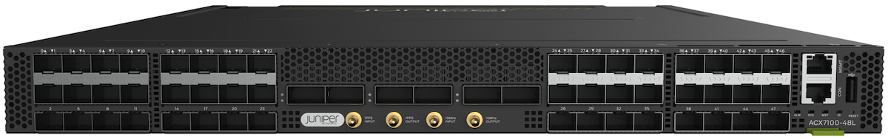

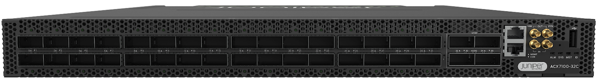

Both devices are 1RU Ethernet-only routers with 4.8 Tbps forwarding capacity and Class-C Timing. MACsec is supported on all the ports of the ACX7100-32C only.

They are primarily targeted at the aggregation market but can be used in multiple roles once features and scales meet the requirements.

Maximum number of ports supported on ACX7100 Routers:

| Port Speed | ACX7100-32CTotal Supported Ports | ACX7100-32CDetails | ACX7100-48LTotal Supported Ports | ACX7100-48LDetails |
|:--|:--|:--|:--|:--|
| 400GE | 4 | 4x 1 | 6 | 6x 1 |
| 100GE | 48 | 32x 1 + 4x (4x1) | 24 | 6x (4x1) |
| 50GE | 96 | 32x (2x1) + 4x (8x1) | 95 | 47 + 6x (8x1) |
| 40GE | 36 | 32x 1 + 4x 1 | 6 | 6x 1 |
| 25GE | 80 | 16x (4x1) + 4x (4x1) | 72 | 48 + 6x (4x1) |
| 10GE | 80 | 16x (4x1) + 4x (4x1) | 72 | 48 + 6x (4x1) |
| 1GE | 0* | 0* | 0* | 0* |

> At the moment of this publication, solutions are under investigation to offer 1GE connectivity.

### Naming convention

In ACX7100 systems, aside from optics, the only field replaceable parts are the power supply modules, the fan trays and the SATA SSD.

We have a total of 6 SKUs available based on three parameters:

- Port density and port type: 32C for 32x 100GE and 48L for 48x (10/25/50GE)
- Power supply: AC or DC PSM
- Airflow: AFO (Air Flow Out / front-to-back) or AFI (Air Flow In / back-to-front)

Based on these parameters, the naming logic for the product itself and the SKU is the following.

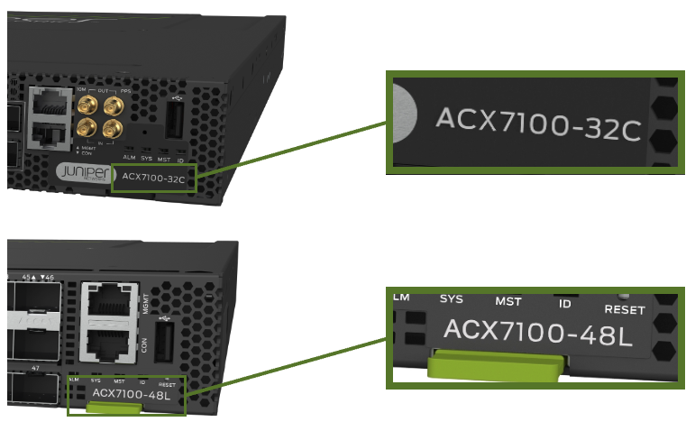

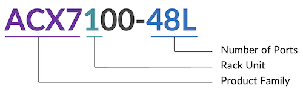

SKUs:

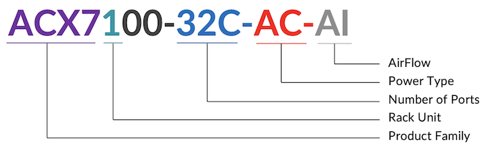

The ACX7100-48L exists in both AFO (front to back) and AFI (back to front) versions:

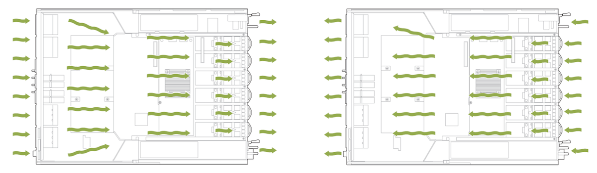

The ACX7100-32C is only available in AFO version:

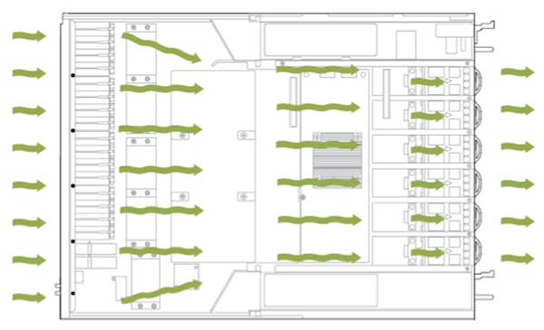**

It gives us a total of 6 SKUs:

| SKU | Description |
|:--|:--|
| ACX7100-48L-AC-AO | 48x 50GE + 6x 400GE / AC PSM / Front-to-Back cooling |
| ACX7100-48L-AC-AI | 48x 50GE + 6x 400GE / AC PSM / Back-to-Front cooling |
| ACX7100-48L-DC-AO | 48x 50GE + 6x 400GE / DC PSM / Front-to-Back cooling |
| ACX7100-48L-DC-AI | 48x 50GE + 6x 400GE / DC PSM / Back-to-Front cooling |
| ACX7100-32C-AC-AO | 32x 100GE + 4x 400GE / AC PSM / Front-to-Back cooling |
| ACX7100-32C-DC-AO | 32x 100GE + 4x 400GE / DC PSM / Front-to-Back cooling |

Note: we can **not** mix Fan Tray types (AFI+AFO) or PSM units (AC+DC).

We invite you to take a look at the TechLibrary hardware guide for more details: 
- [https://www.juniper.net/documentation/us/en/hardware/acx7100-48L/topics/topic-map/acx7100-48L-system-overview.html](https://www.juniper.net/documentation/us/en/hardware/acx7100-48L/topics/topic-map/acx7100-48L-system-overview.html)
- [https://www.juniper.net/documentation/us/en/hardware/acx7100-32C/topics/topic-map/acx7100-32C-system-overview.html](https://www.juniper.net/documentation/us/en/hardware/acx7100-32C/topics/topic-map/acx7100-32C-system-overview.html)

### ACX7100-48L

```
regress@rtme-acx-48L> show chassis hardware

Hardware inventory:
Item             Version  Part number  Serial number     Description
Chassis                                YW02210xxxxx      JNP7100-48L [ACX7100-48L]
PSM 0            REV 04   740-085431   1ED7A1xxxxx       PSU 1600W AC, Front to Back Airflow
PSM 1            REV 04   740-085431   1ED7A1xxxxx       PSU 1600W AC, Front to Back Airflow
Routing Engine 0 REV 08   611-112446   YY02210xxxxx      RE-JNP-7100
CB 0             REV 10   650-113149   YW02210xxxxx      Control Board
FPC 0                     BUILTIN      BUILTIN           ACX7100-48L
  PIC 0                   BUILTIN      BUILTIN           MRATE- 48xSFP56 + 6xQSFP56-DD
    Xcvr 0       REV 01   740-021308   97D625Axxxxx      SFP+-10G-SR
    Xcvr 1       REV 01   740-021308   AJQxxxx           SFP+-10G-SR
    Xcvr 3       0        NON-JNPR     ONT154xxxxx       SFP+-10G-LR
    Xcvr 4       REV 01   740-031981   AP4xxxx           SFP+-10G-LR
    Xcvr 6       REV 01   740-031981   45T0124xxxxx      SFP+-10G-LR
    Xcvr 7       REV 01   740-031981   38T0124xxxxx      SFP+-10G-LR
    Xcvr 42      REV 01   740-031981   45T0124xxxxx      SFP+-10G-LR
    Xcvr 43      0        NON-JNPR     ONT154xxxxx       SFP+-10G-LR
    Xcvr 45      REV 01   740-021308   ALDxxxx           SFP+-10G-SR
    Xcvr 48      REV 01   740-058734   1F1CQ1Axxxxxx     QSFP-100GBASE-SR4
    Xcvr 50      XXXX     NON-JNPR     L2128xxxxx        QSFP56-DD-400G-ZR
    Xcvr 51      XXXX     NON-JNPR     L2131xxxxx        QSFP56-DD-400G-ZR
Fan Tray 0                                               JNP7100 Fan Tray, Front to Back Airflow - AFO
Fan Tray 1                                               JNP7100 Fan Tray, Front to Back Airflow - AFO
Fan Tray 2                                               JNP7100 Fan Tray, Front to Back Airflow - AFO
Fan Tray 3                                               JNP7100 Fan Tray, Front to Back Airflow - AFO
Fan Tray 4                                               JNP7100 Fan Tray, Front to Back Airflow - AFO
Fan Tray 5                                               JNP7100 Fan Tray, Front to Back Airflow - AFO 

regress@rtme-acx-48L>
```

### ACX7100-32C

```
regress@rtme-acx7100-32C> show chassis hardware

Hardware inventory:
Item             Version  Part number  Serial number     Description
Chassis                                YX02211xxxxx      JNP7100-32C [ACX7100-32C]
PSM 0            REV 04   740-085431   1ED7A1xxxxx       PSU 1600W AC, Front to Back Airflow
PSM 1            REV 04   740-085431   1ED7A1xxxxx       PSU 1600W AC, Front to Back Airflow
Routing Engine 0 REV 09   611-112446   YY02211xxxxx      RE-JNP-7100
CB 0             REV 13   650-113148   YX02211xxxxx      Control Board
FPC 0                     BUILTIN      BUILTIN           ACX7100-32C
  PIC 0                   BUILTIN      BUILTIN           MRATE- 32xQSFP-DD + 4xQSFP56-DD
    Xcvr 0       REV 01   740-058734   1A3CQ1A5xxxxx     QSFP-100GBASE-SR4
    Xcvr 1       REV 01   740-058734   1F1CQ1A6xxxxx     QSFP-100GBASE-SR4
    Xcvr 2       REV 01   740-058734   1F1CQ1A6xxxxx     QSFP-100GBASE-SR4
    Xcvr 3       REV 01   740-058734   1F1CQ1A6xxxxx     QSFP-100GBASE-SR4
    Xcvr 4       REV 01   740-058734   1F1CQ1A6xxxxx     QSFP-100GBASE-SR4
    Xcvr 5       REV 01   740-058734   1F1CQ1A6xxxxx     QSFP-100GBASE-SR4
Fan Tray 0                                               JNP7100 Fan Tray, Front to Back Airflow - AFO
Fan Tray 1                                               JNP7100 Fan Tray, Front to Back Airflow - AFO
Fan Tray 2                                               JNP7100 Fan Tray, Front to Back Airflow - AFO
Fan Tray 3                                               JNP7100 Fan Tray, Front to Back Airflow - AFO
Fan Tray 4                                               JNP7100 Fan Tray, Front to Back Airflow - AFO
Fan Tray 5                                               JNP7100 Fan Tray, Front to Back Airflow - AFO
 
regress@rtme-acx7100-32C>
```

### Software

The minimum Junos release required to operate ACX7100 is 21.1R1.

The image is named: junos-evo-install-acx-f-x86-64-<release-ver>-EVO

```
regress@rtme-acx7100-32> show version
      
Hostname: rtme-acx7100-32C
Model: ACX7100-32C
Junos: 22.2R1.12-EVO
Yocto: 3.0.2
Linux Kernel: 5.2.60-yocto-standard-g34a7a87
JUNOS-EVO OS 64-bit [junos-evo-install-acx-f-x86-64-22.2R1.12-EVO]
 
regress@rtme-acx7100-32C>

```

```
regress@rtme-acx-48L> show version

Hostname: rtme-acx-48L
Model: ACX7100-48L
Junos: 22.2R1.12-EVO
Yocto: 3.0.2
Linux Kernel: 5.2.60-yocto-standard-g34a7a87
JUNOS-EVO OS 64-bit junos-evo-install-acx-f-x86-64-22.2R1.12-EVO]
 
regress@rtme-acx-48L>
```

Both ACX7100-32C and ACX7100-48L are using the same "acx-f" images (f for fixed). "acx-m" is used for modular systems.

## ACX7100 Ethernet Ports

To verify the latest support of optics, always use the Hardware Compatibility Tool: [https://apps.juniper.net/hct/product/?prd=ACX7100-48L](https://apps.juniper.net/hct/product/?prd=ACX7100-48L) and [https://apps.juniper.net/hct/product/?prd=ACX7100-32C](https://apps.juniper.net/hct/product/?prd=ACX7100-32C)

In ACX7k Series, all physical interfaces are named "et-*" regardless of the optics/speed. It simplifies significantly the port migration tasks. In this example below, you can verify that port 10GE, 100GE or 400GE are all "et-x/y/z":

```
regress@rtme-acx-48L> show interfaces et-0/0/0 

Physical interface: et-0/0/0, Enabled, Physical link is Up
  Interface index: 1008, SNMP ifIndex: 505
  Link-level type: Ethernet, MTU: 1514, LAN-PHY mode, Speed: 10Gbps, BPDU Error: None, Loop Detect PDU Error: None, Ethernet-Switching Error: None, MAC-REWRITE Error: None, Loopback: Disabled,
  Source filtering: Disabled, Flow control: Enabled, Auto-negotiation: Disabled, Media type: Fiber
  Device flags   : Present Running
  Interface flags: SNMP-Traps
  CoS queues     : 8 supported, 8 maximum usable queues
  Current address: ac:78:d1:23:a3:a8, Hardware address: ac:78:d1:23:a3:a8
  Last flapped   : 2022-08-12 20:27:57 PDT (4d 14:14 ago)
  Input rate     : 0 bps (0 pps)
  Output rate    : 0 bps (0 pps)
  Active alarms  : None
  Active defects : None
  PCS statistics                      Seconds
    Bit errors                             0
    Errored blocks                         0
  Ethernet FEC Mode  :                   NONE
  Ethernet FEC statistics              Errors
    FEC Corrected Errors                    0
    FEC Uncorrected Errors                  0
    FEC Corrected Errors Rate               0
    FEC Uncorrected Errors Rate             0
  Interface transmit statistics: Disabled
  Link Degrade :                      
    Link Monitoring                   :  Disable

  Logical interface et-0/0/0.16386 (Index 1008) (SNMP ifIndex 613)
    Flags: Up SNMP-Traps Encapsulation: ENET2
    Input packets : 0
    Output packets: 0
    Protocol multiservice, MTU: Unlimited
      Flags: None

regress@rtme-acx-48L> show interfaces et-0/0/48

   Physical interface: et-0/0/48, Enabled, Physical link is Down
  Interface index: 1056, SNMP ifIndex: 601
  Link-level type: Ethernet, MTU: 1514, LAN-PHY mode, Speed: 100Gbps, BPDU Error: None, Loop Detect PDU Error: None, Ethernet-Switching Error: None, MAC-REWRITE Error: None, Loopback: Disabled,
  Source filtering: Disabled, Flow control: Enabled, Auto-negotiation: Disabled, Media type: Fiber
  Device flags   : Present Running Down
  Interface flags: Hardware-Down SNMP-Traps
  CoS queues     : 8 supported, 8 maximum usable queues
  Current address: ac:78:d1:23:a5:28, Hardware address: ac:78:d1:23:a5:28
  Last flapped   : Never
  Input rate     : 0 bps (0 pps)
  Output rate    : 0 bps (0 pps)
  Active alarms  : LINK
  Active defects : LINK, LOCAL-FAULT
  PCS statistics                      Seconds
    Bit errors                             0
    Errored blocks                         0
  Ethernet FEC Mode  :                  FEC91
  Ethernet FEC statistics              Errors
    FEC Corrected Errors                    0
    FEC Uncorrected Errors                  0
    FEC Corrected Errors Rate               0
    FEC Uncorrected Errors Rate             0
  Interface transmit statistics: Disabled
  Link Degrade :                      
    Link Monitoring                   :  Disable

  Logical interface et-0/0/48.0 (Index 1015) (SNMP ifIndex 512)
    Flags: Up SNMP-Traps Encapsulation: ENET2
    Input packets : 0
    Output packets: 0
    Protocol inet
    Max nh cache: 100000, New hold nh limit: 100000, Curr nh cnt: 0, Curr new hold cnt: 0, NH drop cnt: 0
    MTU: 1500
      Flags: Sendbcast-pkt-to-re
      Addresses, Flags: Is-Preferred Is-Primary
        Destination: 23.23.23.0/30.0, Local: 23.23.23.1, Broadcast: 23.23.23.3
    Protocol multiservice, MTU: Unlimited
      Flags: None

regress@rtme-acx-48L> show interfaces et-0/0/49

Physical interface: et-0/0/49, Enabled, Physical link is Down
  Interface index: 1057, SNMP ifIndex: 603
  Link-level type: Ethernet, MTU: 1514, LAN-PHY mode, Speed: 400Gbps, BPDU Error: None, Loop Detect PDU Error: None, Ethernet-Switching Error: None, MAC-REWRITE Error: None, Loopback: Disabled,
  Source filtering: Disabled, Flow control: Enabled, Auto-negotiation: Disabled, Media type: Fiber
  Device flags   : Present Running Down
  Interface flags: Hardware-Down SNMP-Traps
  CoS queues     : 8 supported, 8 maximum usable queues
  Current address: ac:78:d1:23:a5:30, Hardware address: ac:78:d1:23:a5:30
  Last flapped   : Never
  Input rate     : 0 bps (0 pps)
  Output rate    : 0 bps (0 pps)
  Active alarms  : LINK
  Active defects : LINK, LOCAL-FAULT
  PCS statistics                      Seconds
    Bit errors                             0
    Errored blocks                         0
  Ethernet FEC Mode  :                 FEC119
  Ethernet FEC statistics              Errors
    FEC Corrected Errors                    0
    FEC Uncorrected Errors                  0
    FEC Corrected Errors Rate               0
    FEC Uncorrected Errors Rate             0
  Interface transmit statistics: Disabled
  Link Degrade :                      
    Link Monitoring                   :  Disable

  Logical interface et-0/0/49.16386 (Index 1055) (SNMP ifIndex 657)
    Flags: Up SNMP-Traps Encapsulation: ENET2
    Input packets : 0
    Output packets: 0
    Protocol multiservice, MTU: Unlimited
      Flags: None

regress@rtme-acx-48L>
```

### ACX7100-48L Front Panel view and Port Numbering

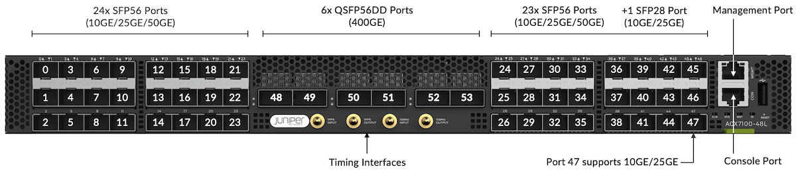

| Port Number(s) | Optic Type | Supported Ports | Default Port Type |
|:--|:--|:--|:--|
| 0 - 46 | SFP+, SFP28, SFP56 | 10GE, 25GE, 50GE | 1x10GE |
| 47 | SFP+ or SFP28 | 10GE, 25GE | 1x10GE |
| 48 - 53 | QSFP56-DD | 100GE, 200GE, 400GE | 1x400GE |

We have various breakout options available like 4x10GE, 4x25GE, 2x50GE, 8x50GE along with native 10GE, 25GE, 50GE, 100GE and 400GE support.

Check the port capabilities with the CLI command `show chassis pic fpc-slot 0 pic-slot 0`.

```
regress@rtme-acx-L> show chassis pic fpc-slot 0 pic-slot 0

FPC slot 0, PIC slot 0 information:
  Type                             MRATE- 48xSFP56 + 6xQSFP56-DD
 
<SNIP>
 
Port speed information:
 
  Port  PFE      Capable Port Speeds
  0      0       1x10G 1x25G 1x50G
  1      0       1x10G 1x25G 1x50G
  2      0       1x10G 1x25G 1x50G
  3      0       1x10G 1x25G 1x50G
  4      0       1x10G 1x25G 1x50G
  5      0       1x10G 1x25G 1x50G      
  6      0       1x10G 1x25G 1x50G
  7      0       1x10G 1x25G 1x50G
  8      0       1x10G 1x25G 1x50G
  9      0       1x10G 1x25G 1x50G
  10     0       1x10G 1x25G 1x50G
  11     0       1x10G 1x25G 1x50G
  12     0       1x10G 1x25G 1x50G
  13     0       1x10G 1x25G 1x50G
  14     0       1x10G 1x25G 1x50G
  15     0       1x10G 1x25G 1x50G
  16     0       1x10G 1x25G 1x50G
  17     0       1x10G 1x25G 1x50G
  18     0       1x10G 1x25G 1x50G
  19     0       1x10G 1x25G 1x50G
  20     0       1x10G 1x25G 1x50G
  21     0       1x10G 1x25G 1x50G
  22     0       1x10G 1x25G 1x50G
  23     0       1x10G 1x25G 1x50G
  24     0       1x10G 1x25G 1x50G
  25     0       1x10G 1x25G 1x50G
  26     0       1x10G 1x25G 1x50G
  27     0       1x10G 1x25G 1x50G
  28     0       1x10G 1x25G 1x50G
  29     0       1x10G 1x25G 1x50G
  30     0       1x10G 1x25G 1x50G
  31     0       1x10G 1x25G 1x50G
  32     0       1x10G 1x25G 1x50G
  33     0       1x10G 1x25G 1x50G
  34     0       1x10G 1x25G 1x50G
  35     0       1x10G 1x25G 1x50G
  36     0       1x10G 1x25G 1x50G
  37     0       1x10G 1x25G 1x50G
  38     0       1x10G 1x25G 1x50G
  39     0       1x10G 1x25G 1x50G
  40     0       1x10G 1x25G 1x50G
  41     0       1x10G 1x25G 1x50G
  42     0       1x10G 1x25G 1x50G
  43     0       1x10G 1x25G 1x50G
  44     0       1x10G 1x25G 1x50G
  45     0       1x10G 1x25G 1x50G
  46     0       1x10G 1x25G 1x50G
  47     0       1x10G 1x25G            
  48     0       1x400G 1x100G 1x40G 4x100G 2x100G 8x50G 2x50G 4x25G 4x10G
  49     0       1x400G 1x100G 1x40G 4x100G 2x100G 8x50G 2x50G 4x25G 4x10G
  50     0       1x400G 1x100G 1x40G 4x100G 2x100G 8x50G 2x50G 4x25G 4x10G
  51     0       1x400G 1x100G 1x40G 4x100G 2x100G 8x50G 2x50G 4x25G 4x10G
  52     0       1x400G 1x100G 1x40G 4x100G 2x100G 8x50G 2x50G 4x25G 4x10G
  53     0       1x400G 1x100G 1x40G 4x100G 2x100G 8x50G 2x50G 4x25G 4x10G
  54     NA      1x10G  
 
regress@rtme-acx-48L>
```

Port 54 is internal-only and used to connect to the PTP (Precision Time Protocol) FPGA via a mux. You'll also note that ACX7100-48L doesn't support 1GE ports at FRS (launch date). A solution to provide 1GE capability is under consideration, but it's not a mode natively supported by Jericho2.

### ACX7100-48L Port Groups

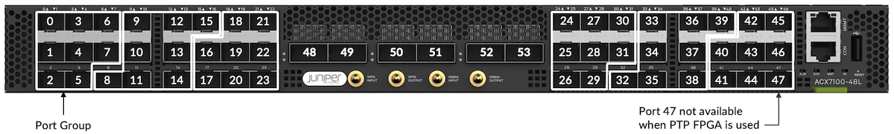

To understand the configuration capabilities, we need to introduce the concept of "Port Group" (PG). As the name implies, a PG gathers several adjacent ports.

Internally, the ports of a given PG are mapped to the same Port Macro (PM). A PM is block of SerDes (Serializer/Deserializer) connecting the PFE to other elements inside the router, including Network Interfaces and Fabric Ports. For more details on this concept, we invite you to read the "Port Macros" section of this article: [https://juniper.github.io/techposts/building-the-acx7000-series-the-pfe/article](https://juniper.github.io/techposts/building-the-acx7000-series-the-pfe/article)

We can abstract it to this diagram:

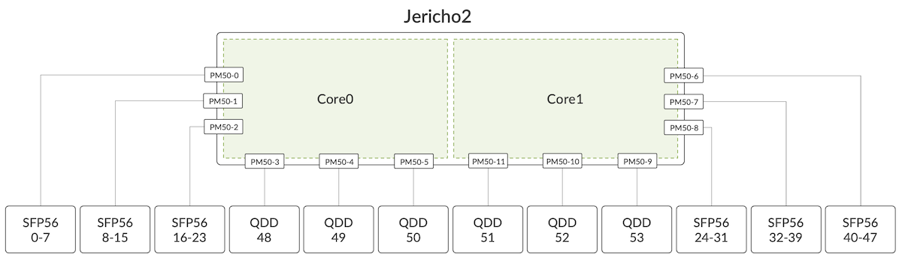

For the SFP ports, from 0 to 47, 8 ports constitute a group.

| PG 0 | Ports 0 - 7 |
|:--|:--|
| PG 1 | Ports 8 - 15 |
| PG 2 | Ports 16 - 23 |
| PG 3 | Ports 24 - 31 |
| PG 4 | Ports 32 - 39 |
| PG 5 | Ports 40 - 47 |

Depending on their electrical specifications, optic modules require appropriate clock sources. A given Port Group can only be configured with two clock speeds. It impacts the combination of port types we support within this PG. For example, it will accept 10 Gbps + 25 Gbps, or 10 Gbps + 50 Gbps, or 25 Gbps + 50 Gbps, but it won't be possible to add a third clock speed in the mix.

The QSFP ports from 48 to 53 are individually considered as a Port Group, there are no specific limitations for them.

### ACX7100-48L: Port Configuration and Port Checker Tool

Always use the port checker tool to verify the support and understand the potential restrictions: [https://apps.juniper.net/home/port-checker/index.html](https://apps.juniper.net/home/port-checker/index.html)

These limitations in port usage and port combination are the following:

Once PTP is enabled, Port 47 is not usable

This port 47 can be used with 10GE or 25GE, but not 50GE optics, that's why you'll find in the public documentation that router forwarding capability is 4.775 Tbps (and not 4.8T).
Once the PTP FPGA is enabled, the port is disabled. Indeed, we use an internal mux to connect to the PTP chipset.

To activate the PTP FPGA, use the following CLI configuration:

```
set chassis fpc 0 pic 0 ptp-mode
```

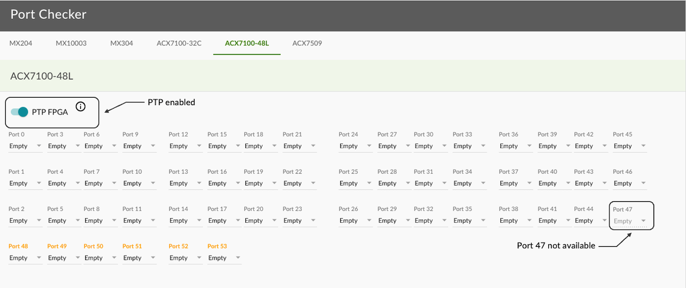

```
[edit]
root@rtme-acx7100# run show interfaces terse et-0/0/6*
Interface               Admin Link Proto    Local                 Remote
et-0/0/6                up    down
et-0/0/6.16386          up    down multiservice

[edit]
root@rtme-acx7100# run show interfaces terse et-0/0/7*
Interface               Admin Link Proto    Local                 Remote
et-0/0/7                up    down
et-0/0/7.16386          up    down multiservice

[edit]
root@rtme-acx7100# show interfaces et-0/0/6

[edit]
root@rtme-acx7100# show interfaces et-0/0/7

[edit]
root@rtme-acx7100# set interfaces et-0/0/6 number-of-sub-ports 4 speed 10g

[edit]
root@rtme-acx7100# show interfaces et-0/0/6
number-of-sub-ports 4;
speed 10g;

[edit]
root@rtme-acx7100# commit
commit complete

[edit]
root@rtme-acx7100# run show interfaces terse et-0/0/6*
Interface               Admin Link Proto    Local                 Remote
et-0/0/6                up    down
et-0/0/6.16386          up    down multiservice
 
[edit]
root@rtme-acx7100# run show interfaces terse et-0/0/7*
Interface               Admin Link Proto    Local                 Remote
et-0/0/7                up    down
et-0/0/7.16386          up    down multiservice
 
[edit]
root@rtme-acx7100# set interfaces et-0/0/7 unused

[edit]
root@rtme-acx7100# commit
commit complete
 
[edit]
root@rtme-acx7100# run show interfaces terse et-0/0/6*
Interface               Admin Link Proto    Local                 Remote
et-0/0/6:0              up    down
et-0/0/6:1              up    down
et-0/0/6:2              up    down
et-0/0/6:3              up    down
 
[edit]
root@rtme-acx7100# run show interfaces terse et-0/0/7*
error: device et-0/0/7* not found
 
[edit]
root@rtme-acx7100#
```

Only two SerDes speeds can be configured in a given Port Group

Keep in mind that port speed and SerDes rates are different, the second category is Broadcom internal rates: 10.3125Gbps, 20.725Gbps, 25.7825Gbps, 53.125Gbps...

| SFP56Ports 0 to 47 | J2 SerDes(Gbps) |
|:--|:--|
| 50GE (not supported in port 47) | 53.125 |
| 25GE | 25.7825 |
| 10GE | 10.3125 |
| QSFP56-DDPorts 32 to 35 | J2 SerDes(Gbps) |
| 400GE | 8x 53.125 |
| 4x 100GE BreakOut | 8x 53.125 |
| 2x 100GE BreakOut | 8x 25.7825 |
| 100GE (SR4/LR4/ER4/...) | 4x 25.7825 |

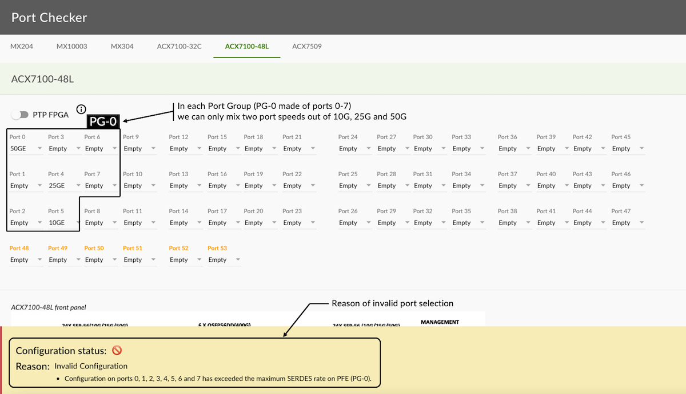

### ACX7100-32C Front Panel View and Port Numbering

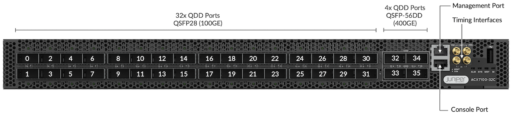

| Port Number(s) | Optic Type | Default Port Speed |
|:--|:--|:--|
| 0 - 31 | QSFP-DD | 1x100GE |
| 32 - 35 | QSFP56-DD | 1x400GE |

The first 32 ports are QSFP-DD cages mounted in a belly-to-belly fashion. With this design, they support high-power QSFP28 modules. A follow-up article will be published soon, demonstrating the use of ZR ports on all ports.

We also have various breakout options available like 4x10GE, 4x25GE, 2x50GE, 8x50GE along with native 10GE, 25GE, 50GE, 100GE and 400GE support.

Check the various port capabilities with the CLI command "show chassis pic fpc-slot 0 pic-slot 0".

```
regress@rtme-acx7100-32C> show chassis pic fpc-slot 0 pic-slot 0

FPC slot 0, PIC slot 0 information:
  Type                             MRATE- 32xQSFP-DD + 4xQSFP56-DD
  State                            Online    
  PIC version                01.13
  Uptime                20 days, 18 hours, 49 minutes, 7 seconds
 
<SNIP>
 
Port speed information:
 
  Port  PFE      Capable Port Speeds
  0      0       1x100G 4x25G 1x40G 4x10G 2x50G 1x25G 1x10G
  1      0       1x100G 1x40G 2x50G 1x25G 1x10G
  2      0       1x100G 4x25G 1x40G 4x10G 2x50G 1x25G 1x10G
  3      0       1x100G 1x40G 2x50G 1x25G 1x10G
  4      0       1x100G 4x25G 1x40G 4x10G 2x50G 1x25G 1x10G
  5      0       1x100G 1x40G 2x50G 1x25G 1x10G
  6      0       1x100G 4x25G 1x40G 4x10G 2x50G 1x25G 1x10G
  7      0       1x100G 1x40G 2x50G 1x25G 1x10G
  8      0       1x100G 4x25G 1x40G 4x10G 2x50G 1x25G 1x10G
  9      0       1x100G 1x40G 2x50G 1x25G 1x10G
  10     0       1x100G 4x25G 1x40G 4x10G 2x50G 1x25G 1x10G
  11     0       1x100G 1x40G 2x50G 1x25G 1x10G
  12     0       1x100G 4x25G 1x40G 4x10G 2x50G 1x25G 1x10G
  13     0       1x100G 1x40G 2x50G 1x25G 1x10G
  14     0       1x100G 4x25G 1x40G 4x10G 2x50G 1x25G 1x10G
  15     0       1x100G 1x40G 2x50G 1x25G 1x10G
  16     0       1x100G 4x25G 1x40G 4x10G 2x50G 1x25G 1x10G
  17     0       1x100G 1x40G 2x50G 1x25G 1x10G
  18     0       1x100G 4x25G 1x40G 4x10G 2x50G 1x25G 1x10G
  19     0       1x100G 1x40G 2x50G 1x25G 1x10G
  20     0       1x100G 4x25G 1x40G 4x10G 2x50G 1x25G 1x10G
  21     0       1x100G 1x40G 2x50G 1x25G 1x10G
  22     0       1x100G 4x25G 1x40G 4x10G 2x50G 1x25G 1x10G
  23     0       1x100G 1x40G 2x50G 1x25G 1x10G
  24     0       1x100G 4x25G 1x40G 4x10G 2x50G 1x25G 1x10G
  25     0       1x100G 1x40G 2x50G 1x25G 1x10G
  26     0       1x100G 4x25G 1x40G 4x10G 2x50G 1x25G 1x10G
  27     0       1x100G 1x40G 2x50G 1x25G 1x10G
  28     0       1x100G 4x25G 1x40G 4x10G 2x50G 1x25G 1x10G
  29     0       1x100G 1x40G 2x50G 1x25G 1x10G
  30     0       1x100G 4x25G 1x40G 4x10G 2x50G 1x25G 1x10G
  31     0       1x100G 1x40G 2x50G 1x25G 1x10G
  32     0       1x400G 1x100G 1x40G 4x100G 2x100G 8x50G 2x50G 4x25G 4x10G
  33     0       1x400G 1x100G 1x40G 4x100G 2x100G 8x50G 2x50G 4x25G 4x10G
  34     0       1x400G 1x100G 1x40G 4x100G 2x100G 8x50G 2x50G 4x25G 4x10G
  35     0       1x400G 1x100G 1x40G 4x100G 2x100G 8x50G 2x50G 4x25G 4x10G
  36     NA      1x10G  

regress@rtme-acx7100-32C>
```

> Note: port 36 is internal-only and used to connect to the PTP FPGA.

You can get similar info from the CLI-PFE by using the "show picd config" command (note that cli-pfe commands are not official supported and can change in their form or output without any notification).

```
[vrf:none] regress@rtme-acx7100-32C:~# cli-pfe

regress@rtme-acx7100-32C:pfe> show picd config


pic_info_table :
              default

   config     config       config   computed
pic_or_port   speed

     pic_mode   port_speed   valid    speed      supported_speeds

                                                hidden_speeds
-----------   -------   --------   ----------   ------   --------   -------------------------------------------------------------   -------------
pic-0/0       -         -          -            -        -
port-0/0/0    1x100G    -          -            -        1x100G     [ 1x100G 4x25G 1x40G 4x10G 2x50G 1x25G 1x10G ]                  [ ]
port-0/0/1    1x100G    -          -            -        1x100G     [ 1x100G 1x40G 2x50G 1x25G 1x10G ]                              [ ]
port-0/0/2    1x100G    -          -            -        1x100G     [ 1x100G 4x25G 1x40G 4x10G 2x50G 1x25G 1x10G ]                  [ ]
port-0/0/3    1x100G    -          -            -        1x100G     [ 1x100G 1x40G 2x50G 1x25G 1x10G ]                              [ ]
port-0/0/4    1x100G    -          -            -        1x100G     [ 1x100G 4x25G 1x40G 4x10G 2x50G 1x25G 1x10G ]                  [ ]
port-0/0/5    1x100G    -          -            -        1x100G     [ 1x100G 1x40G 2x50G 1x25G 1x10G ]                              [ ]
port-0/0/6    1x100G    -          -            -        1x100G     [ 1x100G 4x25G 1x40G 4x10G 2x50G 1x25G 1x10G ]                  [ ]
port-0/0/7    1x100G    -          -            -        1x100G     [ 1x100G 1x40G 2x50G 1x25G 1x10G ]                              [ ]
port-0/0/8    1x100G    -          -            -        1x100G     [ 1x100G 4x25G 1x40G 4x10G 2x50G 1x25G 1x10G ]                  [ ]
port-0/0/9    1x100G    -          -            -        1x100G     [ 1x100G 1x40G 2x50G 1x25G 1x10G ]                              [ ]
port-0/0/10   1x100G    -          -            -        1x100G     [ 1x100G 4x25G 1x40G 4x10G 2x50G 1x25G 1x10G ]                  [ ]
port-0/0/11   1x100G    -          -            -        1x100G     [ 1x100G 1x40G 2x50G 1x25G 1x10G ]                              [ ]
port-0/0/12   1x100G    -          -            -        1x100G     [ 1x100G 4x25G 1x40G 4x10G 2x50G 1x25G 1x10G ]                  [ ]
port-0/0/13   1x100G    -          -            -        1x100G     [ 1x100G 1x40G 2x50G 1x25G 1x10G ]                              [ ]
port-0/0/14   1x100G    -          -            -        1x100G     [ 1x100G 4x25G 1x40G 4x10G 2x50G 1x25G 1x10G ]                  [ ]
port-0/0/15   1x100G    -          -            -        1x100G     [ 1x100G 1x40G 2x50G 1x25G 1x10G ]                              [ ]
port-0/0/16   1x100G    -          -            -        1x100G     [ 1x100G 4x25G 1x40G 4x10G 2x50G 1x25G 1x10G ]                  [ ]
port-0/0/17   1x100G    -          -            -        1x100G     [ 1x100G 1x40G 2x50G 1x25G 1x10G ]                              [ ]
port-0/0/18   1x100G    -          -            -        1x100G     [ 1x100G 4x25G 1x40G 4x10G 2x50G 1x25G 1x10G ]                  [ ]
port-0/0/19   1x100G    -          -            -        1x100G     [ 1x100G 1x40G 2x50G 1x25G 1x10G ]                              [ ]
port-0/0/20   1x100G    -          -            -        1x100G     [ 1x100G 4x25G 1x40G 4x10G 2x50G 1x25G 1x10G ]                  [ ]
port-0/0/21   1x100G    -          -            -        1x100G     [ 1x100G 1x40G 2x50G 1x25G 1x10G ]                              [ ]
port-0/0/22   1x100G    -          -            -        1x100G     [ 1x100G 4x25G 1x40G 4x10G 2x50G 1x25G 1x10G ]                  [ ]
port-0/0/23   1x100G    -          -            -        1x100G     [ 1x100G 1x40G 2x50G 1x25G 1x10G ]                              [ ]
port-0/0/24   1x100G    -          -            -        1x100G     [ 1x100G 4x25G 1x40G 4x10G 2x50G 1x25G 1x10G ]                  [ ]
port-0/0/25   1x100G    -          -            -        1x100G     [ 1x100G 1x40G 2x50G 1x25G 1x10G ]                              [ ]
port-0/0/26   1x100G    -          -            -        1x100G     [ 1x100G 4x25G 1x40G 4x10G 2x50G 1x25G 1x10G ]                  [ ]
port-0/0/27   1x100G    -          -            -        1x100G     [ 1x100G 1x40G 2x50G 1x25G 1x10G ]                              [ ]
port-0/0/28   1x100G    -          -            -        1x100G     [ 1x100G 4x25G 1x40G 4x10G 2x50G 1x25G 1x10G ]                  [ ]
port-0/0/29   1x100G    -          -            -        1x100G     [ 1x100G 1x40G 2x50G 1x25G 1x10G ]                              [ ]
port-0/0/30   1x100G    -          -            -        1x100G     [ 1x100G 4x25G 1x40G 4x10G 2x50G 1x25G 1x10G ]                  [ ]
port-0/0/31   1x100G    -          -            -        1x100G     [ 1x100G 1x40G 2x50G 1x25G 1x10G ]                              [ ]
port-0/0/32   1x400G    -          -            -        1x400G     [ 1x400G 1x100G 1x40G 4x100G 2x100G 8x50G 2x50G 4x25G 4x10G ]   [ ]
port-0/0/33   1x400G    -          -            -        1x400G     [ 1x400G 1x100G 1x40G 4x100G 2x100G 8x50G 2x50G 4x25G 4x10G ]   [ ]
port-0/0/34   1x400G    -          -            -        1x400G     [ 1x400G 1x100G 1x40G 4x100G 2x100G 8x50G 2x50G 4x25G 4x10G ]   [ ]
port-0/0/35   1x400G    -          -            -        1x400G     [ 1x400G 1x100G 1x40G 4x100G 2x100G 8x50G 2x50G 4x25G 4x10G ]   [ ]
port-0/0/36   0x0       -          -            -        0x0        [ 1x10G ]                                                       [ ]
usr_config     :
 
regress@rtme-acx7100-32C:pfe>
```

### ACX7100-32C Port Groups

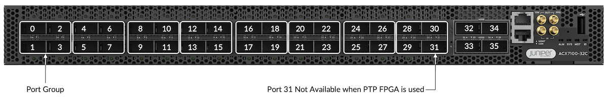

The same concept of Port Group described for ACX7100-48L exists in the ACX7100-32C. It influences the port configuration capabilities.

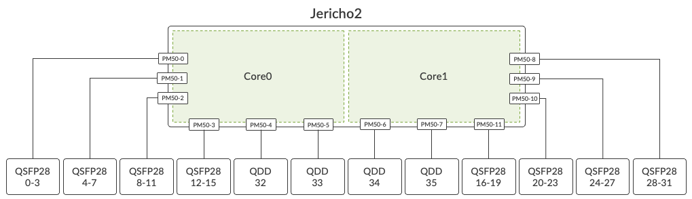

For the QSFP ports from 0 to 31, 4 subsequent ports constitute a group.

| PG 0 | Ports 0 - 3 |
|:--|:--|
| PG 1 | Ports 4 - 7 |
| PG 2 | Ports 8 - 11 |
| PG 3 | Ports 12 - 15 |
| PG 4 | Ports 16 - 19 |
| PG 5 | Ports 20 - 23 |
| PG 6 | Ports 24 - 27 |
| PG 7 | Ports 28 - 31 |

The QSFP56-DD ports from 32 to 35 are individually considered as a port group, so there are no specific limitations for them.

### ACX7100-32C Port Configuration and Port Checker Tool

We invite you to use the port checker tool to verify the support and understand the potential restrictions: [https://apps.juniper.net/home/port-checker/index.html ](https://apps.juniper.net/home/port-checker/index.html)

These limitations in port usage and port combination are the following:

Once PTP is enabled, Port 31 is not available (the same reason as port 47 on ACX7100-48L described in the previous section).

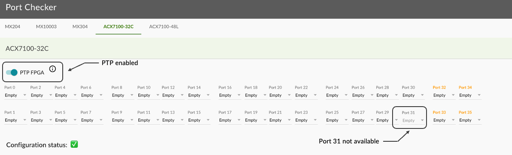

Only even ports can be channelized (configured with breakout). For odd ports, we don't allow the configuration of 4x10GE and 4x25GE as shown below.

Once an even port (N) is configured as channelized, the N+1 port must be configured as unused. This restriction is coming from the maximum number of internal MAC addresses we can use (logically, a break-out port consumes 4 MAC addresses).

Note: The ACX7100-48L supports 2x50GE on both odd and even ports, the limitation only applies to 4x10GE and 4x25GE.

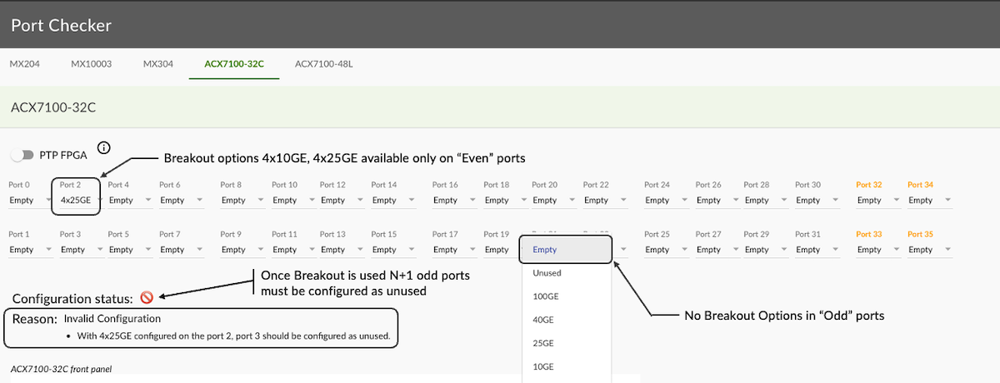

| QSFP-DD Ports 0 to 31 | J2 SerDes (Gbps) | Converted by GearBoxinto Line SerDes (Gbps) |
|:--|:--|:--|
| 100GE | 2x 53.125 | 4x 25.7825 |
| 4x 25GE BreakOut | 4x 25.7825 | 4x 25.7825 |
| 40GE | 2x 20.725 | 4x 10.3125 |
| 4x 10GE BreakOut | 4x 10.3125 | 4x 10.3125 |

| QSFP56-DDPorts 32 to 35 | J2 SerDes (Gbps) |
|:--|:--|
| 400GE | 8x 53.125 |
| 4x 100GE BreakOut | 8x 53.125 |
| 2x 100GE BreakOut | 8x 25.7825 |
| 100GE (SR4/LR4/ER4/...) | 4x 25.7825 |

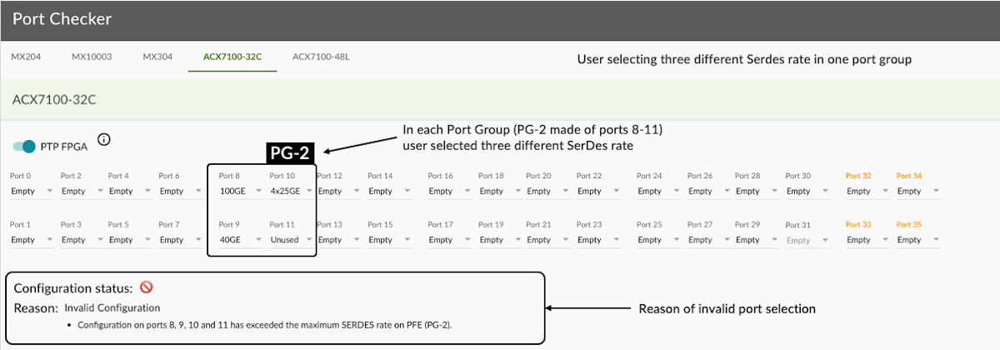

Note it's possible to use QSFP-to-SFP-Adaptors (QSA) in the 100GE slots. This use case could make sense if you need a small quantity of 10GE (particularly in long distances cases requiring ER reach, something not available with breakout options).

## Internal Description: Block Diagrams

The ACX7100-32C is internally composed of multiple parts. We can summarize them as:

- A Broadcom Jericho2 PFE (BCM88690) with 8GB of HBM
- Multiple Gearboxes (GBs) to adapt 50 Gbps PAM4 into 25Gbps NRZ
- Multiple 400 Gbps PHY modules
- Intel x86 CPU (6 cores) with DDR4 memory and SSD storage
- Internal controllers for I2C (inter-integrated circuit), fan control, ...
- PTP FPGA
- TPM 2.0 module (Trusted Platform Module)

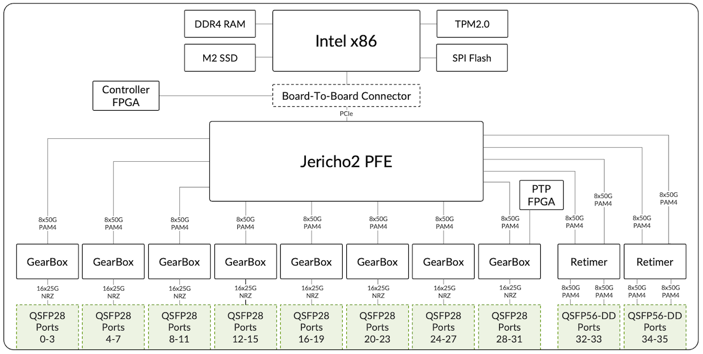

In this diagram, we are presenting the SerDes at 50 Gbps (instead of 53.125 Gbps) and 25 Gbps (instead of 25.7875 Gbps) for sake of simplicity.

It is worth mentioning also that "NRZ" and "PAM4" mentioned below "GearBoxes" and "Retimers" in this diagram are dependent on the type of the optic modules inserted. Also, you could legitimately ask why we are using GB for the ports 32 to 35 since they could be directly connected to the Port Macros / PFE. This part is actually required for MACsec encryption, a technology not natively available in Jericho2 ASIC.

The different components can be monitored via CLI.

```
regress@rtme-acx7100-32C:pfe> show gearbox list fpc 0 pic 0  
  
INDEX    NAME          MDIO       INIT
----------------------------------------
  0    88X7121M_B0    0x0000     SUCCESS
  1    88X7121M_B0    0x0008     SUCCESS
  2    88X7121M_B0    0x0020     SUCCESS
  3    88X7121M_B0    0x0028     SUCCESS
  4    88X7121M_B0    0x0040     SUCCESS
  5    88X7121M_B0    0x0048     SUCCESS
  6    88X7121M_B0    0x0060     SUCCESS
  7    88X7121M_B0    0x0068     SUCCESS
  8    88X7121M_B0    0x0100     SUCCESS
  9    88X7121M_B0    0x0108     SUCCESS
----------------------------------------
  API Version:   2.3.0
  Serdes FW Rev: 0.10.11.89
  Chip FW Rev:   0.2.16.1
 
 
regress@rtme-acx7100-32C:pfe> show gearbox port-status fpc 0 pic 0  
  
  PORT  LINK(L:H)  SPEED  MODE(L:H)  LANE_MAP(L:H)  SD(L:H)  LOCK(L:H)   MDIO      AN(L)
------------------------------------------------------------------------------------------
  0:0   --:UP      100G    62:69     0x000f:0x0003   0:1      0:1      0x0000(0)   OFF
  1:0   --:UP      100G    63:69     0x00f0:0x0030   0:1      0:1      0x0001(0)   OFF
  2:0   --:UP      100G    63:69     0x0f00:0x0300   0:1      0:1      0x0002(0)   OFF
  3:0   --:UP      100G    63:69     0xf000:0x3000   0:1      0:1      0x0003(0)   OFF
  4:0   --:UP      100G    63:69     0x000f:0x0003   0:1      0:1      0x0008(1)   OFF
  5:0   --:UP      100G    63:69     0x00f0:0x0030   0:1      0:1      0x0009(1)   OFF
  6:0   --:UP      100G    63:69     0x0f00:0x0300   0:1      0:1      0x000a(1)   OFF
  7:0   --:UP      100G    63:69     0xf000:0x3000   0:1      0:1      0x000b(1)   OFF
  8:0   --:UP      100G    63:69     0x000f:0x0003   0:1      0:1      0x0020(2)   OFF
  9:0   --:UP      100G    63:69     0x00f0:0x0030   0:1      0:1      0x0021(2)   OFF
 10:0   --:UP      100G    63:69     0x0f00:0x0300   0:1      0:1      0x0022(2)   OFF
 11:0   --:UP      100G    63:69     0xf000:0x3000   0:1      0:1      0x0023(2)   OFF
 12:0   --:UP      100G    63:69     0x000f:0x0003   0:1      0:1      0x0028(3)   OFF
 13:0   --:UP      100G    63:69     0x00f0:0x0030   0:1      0:1      0x0029(3)   OFF
 14:0   --:UP      100G    63:69     0x0f00:0x0300   0:1      0:1      0x002a(3)   OFF
 15:0   --:UP      100G    63:69     0xf000:0x3000   0:1      0:1      0x002b(3)   OFF
 16:0   --:UP      100G    63:69     0x000f:0x0003   0:1      0:1      0x0040(4)   OFF
 17:0   --:UP      100G    62:69     0x00f0:0x0030   0:1      0:1      0x0041(4)   OFF
 18:0   --:UP      100G    63:69     0x0f00:0x0300   0:1      0:1      0x0042(4)   OFF
 19:0   --:UP      100G    63:69     0xf000:0x3000   0:1      0:1      0x0043(4)   OFF
 20:0   --:UP      100G    63:69     0x000f:0x0003   0:1      0:1      0x0048(5)   OFF
 21:0   --:UP      100G    63:69     0x00f0:0x0030   0:1      0:1      0x0049(5)   OFF
 22:0   --:UP      100G    63:69     0x0f00:0x0300   0:1      0:1      0x004a(5)   OFF
 23:0   --:UP      100G    63:69     0xf000:0x3000   0:1      0:1      0x004b(5)   OFF
 24:0   --:UP      100G    63:69     0x000f:0x0003   0:1      0:1      0x0060(6)   OFF
 25:0   --:UP      100G    63:69     0x00f0:0x0030   0:1      0:1      0x0061(6)   OFF
 26:0   --:UP      100G    63:69     0x0f00:0x0300   0:1      0:1      0x0062(6)   OFF
 27:0   --:UP      100G    63:69     0xf000:0x3000   0:1      0:1      0x0063(6)   OFF
 28:0   --:UP      100G    63:69     0x000f:0x0003   0:1      0:1      0x0068(7)   OFF
 29:0   --:UP      100G    63:69     0x00f0:0x0030   0:1      0:1      0x0069(7)   OFF
 30:0   --:UP      100G    63:69     0x0f00:0x0300   0:1      0:1      0x006a(7)   OFF
 31:0   --:UP      100G    63:69     0xf000:0x3000   0:1      0:1      0x006b(7)   OFF
 32:0   --:UP      400G    79:79     0x00ff:0x00ff   0:1      0:1      0x0100(8)   OFF
 33:0   --:UP      400G    79:79     0xff00:0xff00   0:1      0:1      0x0102(8)   OFF
 34:0   --:UP      400G    79:79     0x00ff:0x00ff   0:1      0:1      0x0108(9)   OFF
 35:0   --:UP      400G    79:79     0xff00:0xff00   0:1      0:1      0x010a(9)   OFF
------------------------------------------------------------------------------------------
 L:Line  H:Host SD:Signal detect  LOCK:Dsp lock   !e: disable
 
regress@rtme-acx7100-32C:pfe> show system info
    
 System Date   : Mon Jul 11 07:56:30 PDT 2022
 System Uptime : Up for 38-15:21:05
 Pfe Uptime    : Up for 38-15:19:39
  
 CPU INFO:
 ========
 Model name              : Intel(R) Xeon(R) CPU D-1637 @ 2.90GHz
 Configured CPU Speed    : 1956.403 2730.638 1738.774 2876.145 2279.032 1903.599 2392.586 2759.427 2710.492 2428.014 1909.381 2113.616 MHz
 Physical cores          : 6
 Hyperthreaded cores     : 12
 L1 Cache size           : 0 kB
 L2 Cache size           : 0 kB
 L23Cache size           : 0 kB
  
 CPU PAIRS:
 =========
 Core 0 :  0 6
 Core 1 :  1 7
 Core 2 :  2 8
 Core 3 :  3 9
 Core 4 :  4 10
 Core 5 :  5 11
  
 SYSTEM MEMORY USAGE (MB):
 ========================
 MemTotal:       65281228 kB
 MemFree:        46410328 kB
 MemAvailable:   59100436 kB
 Buffers:          647040 kB
 Cached:         12470188 kB
 SwapCached:            0 kB
 SwapTotal:       4194300 kB
 SwapFree:        4194300 kB
  
<SNIP>
```

The ACX7100-48L differs by the absence of gearboxes, the ports being directly connected to the PFE Port Macros (hence the lack of MACsec support on this platform).

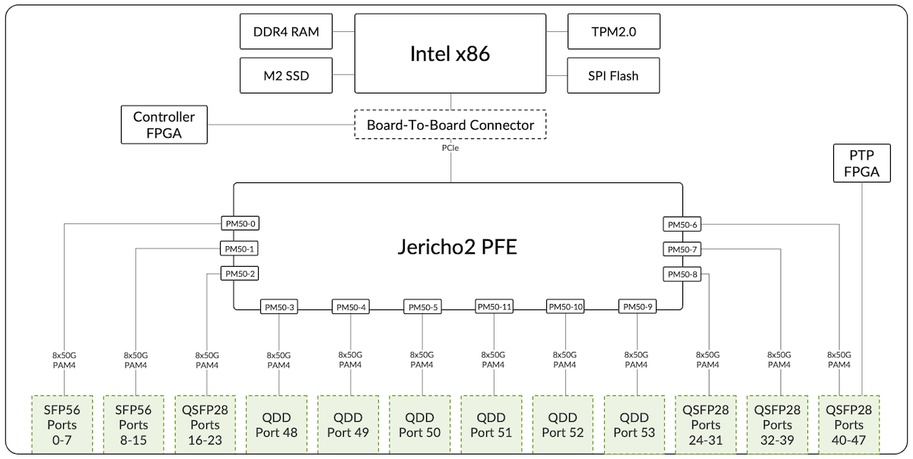

## Fan Tray and Power Module Redundancy

Both ACX7100-48L and ACX7100-32C have a single routing engine. That means we don't support any kind of High-Availability (HA) option at the RE level. Also, In-Service System Upgrade (ISSU) is not supported, nor planned.

The only field replaceable parts on these routers are:

- the Power Supply Modules (2x AC or 2x DC)
- the Fan Trays (6 blocks)
- the SATA SDD

The SSD maintenance is well documented in the TechLibrary articles:

- [https://www.juniper.net/documentation/us/en/hardware/acx7100-48L/topics/topic-map/ssd-acx7100-48L-remove-install.html](https://www.juniper.net/documentation/us/en/hardware/acx7100-48L/topics/topic-map/ssd-acx7100-48L-remove-install.html)
- [https://www.juniper.net/documentation/us/en/hardware/acx7100-32C/topics/topic-map/ssd-acx7100-32C-remove-install.html ](https://www.juniper.net/documentation/us/en/hardware/acx7100-32C/topics/topic-map/ssd-acx7100-32C-remove-install.html)

Regarding the cooling system and power supply, they are all accessible from the back of the router:

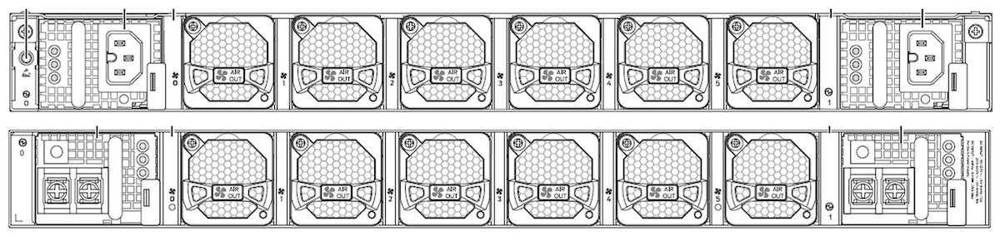

You notice two PSMs, one on each side of the router. They can be AC or DC but we can't mix the two categories. With a 1+1 PSM configuration, we have power redundancy: if one fails, the system raises an alarm but stays fully operational.

```
regress@rtme-acx7100-32C> show chassis power detail
    
Chassis Power        Voltage(V)    Power(W)
 
Total Input Power                    468
  PSM 0
    State: Online
    Input               202          223
    Output            11.97        201.25
    Capacity           1600 W (maximum 1600 W)
  PSM 1
    State: Online
    Input               202          245
    Output            11.95        221.57
    Capacity           1600 W (maximum 1600 W)
 
System:
  Zone 0:
      Capacity:          3200 W (maximum 3200 W)
      Actual usage:      468 W
  Total system capacity: 3200 W (maximum 3200 W)
 
regress@rtme-acx7100-32C>
```

ACX7100 relies on six Fan Trays for cooling purposes:

- ACX7100-48L is designed for both front-to-back airflow and back-to-front airflow
- ACX7100-32C is designed only for front-to-back airflow

Each Fan Tray is a pluggable module hosting two 40x40 mm counter-rotating rotors (Fan 1 and Fan 2 below). The system supports single rotor failure (N+1 redundancy).

```
regress@rtme-acx7100-32C> show chassis fan
    
      Item                      Status   % RPM     Measurement
      Fan Tray 0 Fan 1          OK       43%       12800 RPM                
      Fan Tray 0 Fan 2          OK       43%       10800 RPM                
      Fan Tray 1 Fan 1          OK       43%       13000 RPM                
      Fan Tray 1 Fan 2          OK       44%       11000 RPM                
      Fan Tray 2 Fan 1          OK       43%       12800 RPM                
      Fan Tray 2 Fan 2          OK       43%       10800 RPM                
      Fan Tray 3 Fan 1          OK       43%       12800 RPM                
      Fan Tray 3 Fan 2          OK       43%       10800 RPM                
      Fan Tray 4 Fan 1          OK       43%       13000 RPM                
      Fan Tray 4 Fan 2          OK       43%       10800 RPM                
      Fan Tray 5 Fan 1          OK       43%       12800 RPM                
      Fan Tray 5 Fan 2          OK       44%       11000 RPM                
 
regress@rtme-acx7100-32C>
```

Note: it is possible to deactivate half of the ports and shut down the associated PFE core. This power-saving mode can reduce the consumption for low port density deployments: [https://www.juniper.net/documentation/us/en/software/junos/chassis/topics/task/configuring-power-saving-mode.html ](https://www.juniper.net/documentation/us/en/software/junos/chassis/topics/task/configuring-power-saving-mode.html)

## PFE Description

We invite you to check the articles to learn more about the ASIC selection process and many more details on the packet forwarding ASIC.

- Building the ACX7000 Series: the PFE: [https://juniper.github.io/techposts/building-the-acx7000-series-the-pfe/article](https://juniper.github.io/techposts/building-the-acx7000-series-the-pfe/article)
- Let's Talk About VOQ and DNX Pipeline: [https://juniper.github.io/techposts/voq-and-dnx-pipeline/article](https://juniper.github.io/techposts/voq-and-dnx-pipeline/article)

The ACX7100-48L and ACX7100-32C are "Systems on the Chip" (SoC). That means they are based on a single PFE where all parts involved in the forwarding tasks are directly connected. This Jericho2 (BCM88690) PFE is a deep-buffer ASIC with hybrid packet memory (internal and external). The external buffer is actually present in the package itself: 8GB of HBM2 memory.

Follow-up articles in the near future will describe some internal key aspects of the PFE like the MDB profiles and the resource allocation/monitoring.

## MACsec and Timing

MACsec is only supported on the ACX7100-32C ports (all of them) and not on the ACX7100-48L. The feature is fully handled by the gearbox.

Follow-up articles will be dedicated to security functions (including MACsec) and timing.

## In Conclusion

The ACX7100-48L and ACX7100-32C routers are 1-RU, 4.8Tbps platforms, ideally positioned for multiple roles including 10G/25/50GE and 100GE to 400GE aggregation. In the next articles, we will continue the description of the ACX7000 portfolio and dig deeper into the specific features of these products.

## Useful links

- Building the ACX7100 Series: the PFE: [https://juniper.github.io/techposts/building-the-acx7000-series-the-pfe/article](https://juniper.github.io/techposts/building-the-acx7000-series-the-pfe/article)
- Let's talk about VOQ and DNX Pipeline: [https://juniper.github.io/techposts/voq-and-dnx-pipeline/article](https://juniper.github.io/techposts/voq-and-dnx-pipeline/article)
- Datasheet: [https://www.juniper.net/content/dam/www/assets/datasheets/us/en/routers/acx7100-cloud-metro-routers-datasheet.pdf ](https://www.juniper.net/content/dam/www/assets/datasheets/us/en/routers/acx7100-cloud-metro-routers-datasheet.pdf)

- Hardware Compatibility Tool:

[https://apps.juniper.net/hct/product/?prd=ACX7100-48L ](https://apps.juniper.net/hct/product/?prd=ACX7100-48L)
[https://apps.juniper.net/hct/product/?prd=ACX7100-32C ](https://apps.juniper.net/hct/product/?prd=ACX7100-32C)

- Hardware guides:

[https://www.juniper.net/documentation/us/en/hardware/acx7100-48L/topics/topic-map/acx7100-48L-system-overview.html ](https://www.juniper.net/documentation/us/en/hardware/acx7100-48L/topics/topic-map/acx7100-48L-system-overview.html)
[https://www.juniper.net/documentation/us/en/hardware/acx7100-32C/topics/topic-map/acx7100-32C-system-overview.html](https://www.juniper.net/documentation/us/en/hardware/acx7100-32C/topics/topic-map/acx7100-32C-system-overview.html)
- SSD Maintenance

[https://www.juniper.net/documentation/us/en/hardware/acx7100-48L/topics/topic-map/ssd-acx7100-48L-remove-install.html](https://www.juniper.net/documentation/us/en/hardware/acx7100-48L/topics/topic-map/ssd-acx7100-48L-remove-install.html)
[https://www.juniper.net/documentation/us/en/hardware/acx7100-32C/topics/topic-map/ssd-acx7100-32C-remove-install.html ](https://www.juniper.net/documentation/us/en/hardware/acx7100-32C/topics/topic-map/ssd-acx7100-32C-remove-install.html)

## Glossary

- AFI: AirFlow In
- AFO: AirFlow Out
- FRS: First Revenue Ship
- GB: GearBox
- HBM: High Bandwidth Memory
- I2C: Inter-Integrated Circuit
- NRZ: Non-Return to Zero
- PAM4: Pulse Amplification Modulation 4
- PFE: Packet Forwarding Engine
- PG: Port Group
- PM: Port Macro
- PSM : Power Supply Module
- PTP: Precision Time Protocol
- QSA : QSFP to SFP Adaptor
- SerDes: Serializer Deserializer
- SKU: Stock Keeping Unit
- SSD / SATA: Solid State Drive / Serial Advanced Technology Attachment
- TPM : Trusted Platform Module

## Acknowledgments

Thanks a lot to Kapil Jain, Frank Reade and Vasily Mukhin  for the hardware details and document review.

Thanks to Shun Hiyama for typo correction.
