# ACX7509 Deepdive

**Nicolas Fevrier - 11/14/2022**

The first centralized platform of the ACX7000 family. Based on a modular design, it offers control plane and forwarding plane redundancy with port density spanning from 1GE to 400GE, in just 5RU.

## Introduction

The ACX7509 is a centralized platform part of the ACX7000 family. This router is powered by two Broadcom Jericho2c [BCM8882x] and runs Junos EVO modular software.

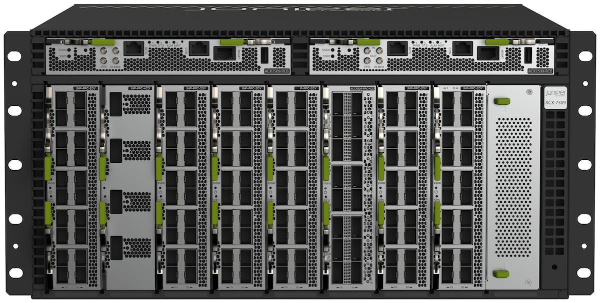

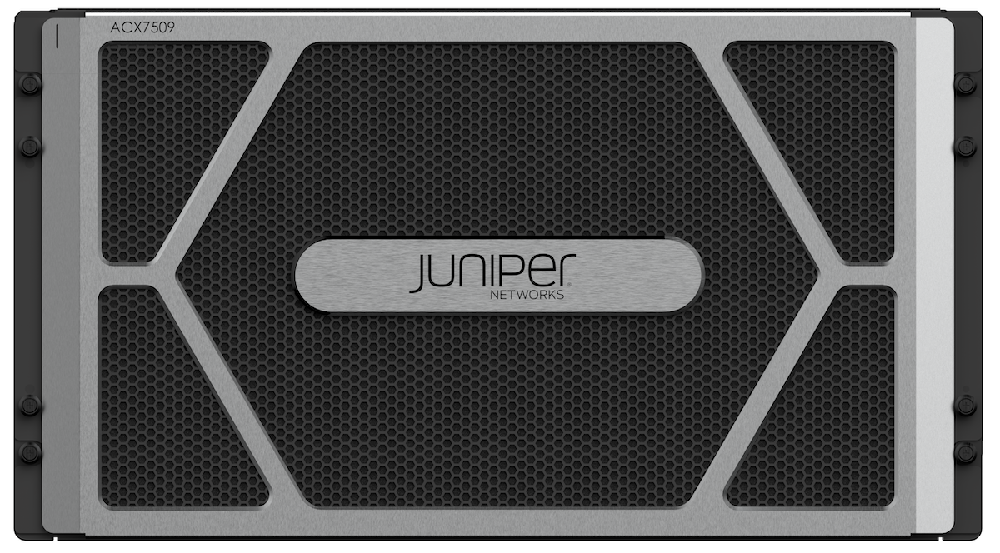

With 5RU height and 600mm depth, it's a very small form-factor modular system proposing 9 slots (8 available with current hardware generation) for three types of line cards called Flexible PIC Concentrators (FPC).

The ACX7509 is the only of its kind to offer in just 5 rack units:

- Deep buffer capability and high routing scale
- Line card modularity for ports spanning from 1GE to 400GE
- Control plane redundancy with two Routing / Control Boards (RCB)
- Forwarding plane redundancy with two Forwarding Engine Boards (FEB), offering a total of 4.8Tbps full duplex and 1+1 redundancy
- Fan trays and power supply redundancy

This modularity also provides investment protection: it will be possible to introduce faster interface types (800GE and following generation) by simply upgrading the FEB.

Depending on the port density requirement, the operator can decide to populate the ACX7509 chassis with three different FPC:

- ACX7509-FPC20Y: 20 ports SFP for 1GE, 10GE, 25GE or 50GE (total forwarding capability of 1Tbps)
- ACX7509-FPC-16C: 16 ports QSFP-DD for 40GE or 100GE (total forwarding: 1.6Tbps)
- ACX7509-FPC-4CD: 4 ports QSFP-DD for 200GE or 400GE (total forwarding: 1.6Tbps)

Certain rules need to be followed regarding the position of these FPC in the chassis, we will detail them in this document.

### Parts and naming convention / SKUs

The chassis structure is the same QFX5700, hence the multiple SKUs with "JNP5K-*".

The naming logic is illustrated here:

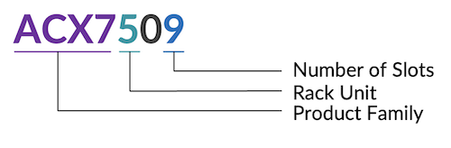

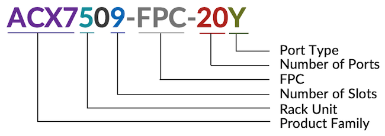

The following SKUs are available today:

- ACX7509-BASE-AC: ACX7509 5RU 8-slot chassis with 1 RCB, 1 FEB, 2 AC Power supplies, 2 Fan trays
- ACX7509-BASE-DC: ACX7509 5RU 8-slot chassis with 1 RCB, 1 FEB, 2 DC Power supplies, 2 Fan trays
- ACX7509-PREMIUM-AC: ACX7509 5RU 8-slot chassis with 2 RCB, 2 FEB, 4 AC Power supplies, 2 Fan trays
- ACX7509-PREMIUM-DC: ACX7509 5RU 8-slot chassis with 2 RCB, 2 FEB, 4 DC Power Supplies, 2 Fan Trays
- ACX7509-FPC-16C: 16 port, 100G line card for ACX7509
- ACX7509-FPC-4CD: 4 port, 400G line card for ACX7509
- ACX7509-FPC-20Y: 20 port, 50G line card for ACX7509

And spare parts:

- ACX7509-RCB: ACX7509 Routing Control Board, spare
- ACX7509-RCB-LT: ACX7509 Routing Control Board, with limited encryption, spare
- ACX7509-FEB: ACX7509 Packet Forwarding Engine, spare
- JNP5700-CHAS: Chassis for ACX7509, spare
- ACX7509-EMI: ACX7509 EMI Door, spare
- ACX7509-FLTR: ACX7509 Air Filter, spare
- JNP5700-FAN: Fan Tray, spare
- JNP-3000W-DC-AFO: DC 3000W front-to-back airflow, spare
- JNP-3000W-AC-AFO: AC 3000W front-to-back airflow, spare
- JNP5K-FPC-BLNK: FPC Blank for unused slots in chassis
- JNP5K-RCB-BLNK: RCB Blank for unused slot in chassis
- JNP5K-FEB-BLNK: FEB Blank for unused slot in chassis
- JNP5K-RMK-4POST: QFX5700 4-post Rack mount kit

## Hardware Description

### Chassis

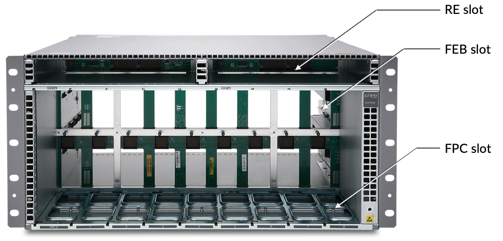

The Figure above presents a view of a chassis with no common or line cards:

- FPCs are inserted vertically in the front
- RCBs are inserted horizontally in the top part of the front
- FEBs are inserted horizontally first from the back. They will connect to the FPCs via Orthogonal Direct (OD) connectors and will be covered by Fan Trays.
- The chassis also contains a partial mid-plane to distribute the power to the different elements and where will be transmitted the control signals

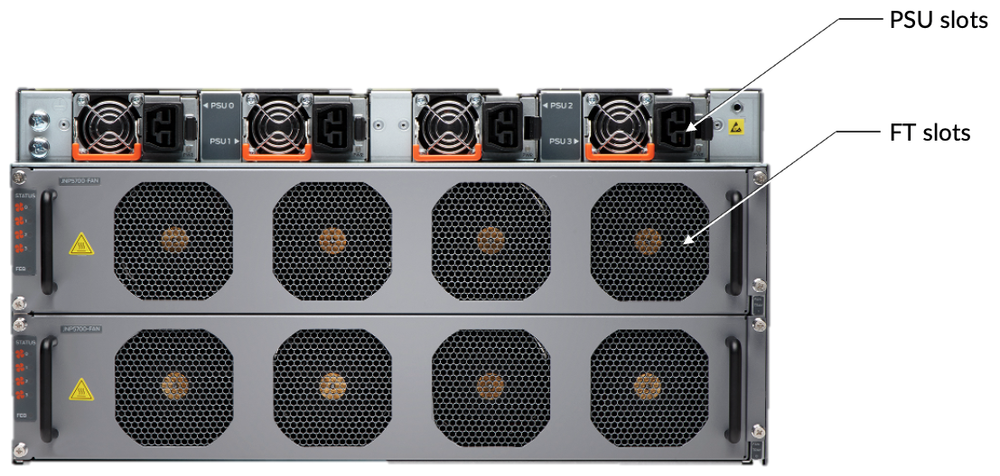

In the Figure, we can see the 2 Fan Trays covering the FEBs and on the top part, the 4 Power Supply Units.

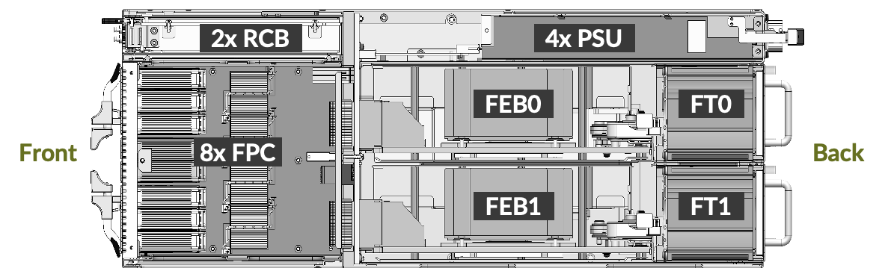

Finally, this side view clearly shows the relative position of FEBs and Fan Trays in the chassis. It explains why you need to extract first the FTs to get access to the Forwarding Boards. The chassis itself is 600mm deep (what we call "Metal to Metal"). With cable bend radius, air filters and EMI door, it takes 800mm space.

### Flexible PIC Concentrators

Despite the lack of PIC and flexibility, the line cards in an ACX7509 are named FPC for historical reasons.

Today, we have three different types of FPCs to insert in slots 0 to 7 (slot 8 is not available in current FEBs but could be with future hardware version). An FPC inserted in slot 8 will not be connected to the Packet Forwarding Engine (PFE) but only through the control plane links offered by the midplane. In a nutshell, nothing can be done with a FPC in this slot.

We will come back on these concepts later in the document, but at this moment it's important to understand that slots 0, 2, 3, 4, 6 and 7 are connected to the PFE through 25Gbps links while slots 1 and 5 are connected via 50Gbps SERDES. It will have a direct impact on the support of the different FPCs and their port density.

The first one is the ACX7509-FPC-20Y. It offers 20 SFP ports:

- 1GE with SFP optic modules
- 10GE with SFP+
- 25GE with SFP28
- 50GE with SFP56

The 20Y FPC can be used in any slot of the chassis, but the position will have a direct impact on the port types and density. Please check the "Ethernet Ports" section for more details.

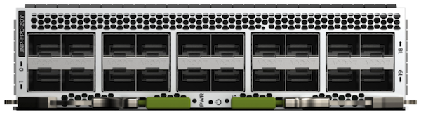

The second card ACX7509-FPC-16C offers 16 QSFP ports: 40GE (QSFP+) and 100GE (QSFP28) for a maximum total bandwidth of 1.6Tbps. Depending on the slot where the FPC is inserted, it will support 8x 100GE or 16x 100GE. More details on the "Ethernet Ports" section below.

Note: no restriction in term of power or cooling for high power optics (ZR/ZR+).

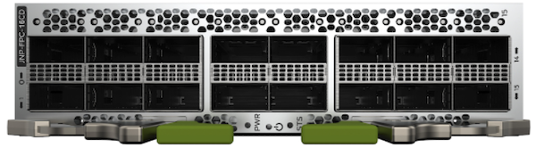

The third card available today is the ACX7509-FPC-4CD. This FPC offers connectivity for 4 ports 200GE or 400GE and can only be positioned in slots 1 and 5 of the chassis.

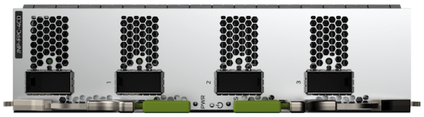

Since the router is a centralized platform with forwarding ASICs located only in the FEBs, the FPCs are not as complex in design than traditional modular chassis. These cards are not hosting PFEs or complex CPU/RAM/storage architecture.

When you insert a new FPC in an empty slot, it will not become active until you issue "request chassis fpc slot #number online". It can also be achieved with a manual press of the front button. With the same logic, before ejecting an FPC, turn it offline via CLI or use the button.

More details here: [https://www.juniper.net/documentation/us/en/hardware/acx7509/topics/topic-map/acx7509-maintain-fpcs.html](https://www.juniper.net/documentation/us/en/hardware/acx7509/topics/topic-map/acx7509-maintain-fpcs.html)

### RCB and FEB

The ACX7509 chassis can be ordered in 4 flavors mixing AC or DC power supplies and "Base" or "Premium". Base or Premium are different in terms of control plane and forwarding plane redundancy capabilities:

- Base: 1x RCB and 1x FEB
- Premium: 2x RCBs and 2x FEBs

Only these two combinations are supported. We will NOT support 1x RCB + 2x FEBs or 2x RCBs + 1x FEB operation. A shared-fate mechanism makes sure that matching RE and FEB are active simultaneously.

In redundant configuration, if one "Active" element fails, it triggers a switchover of both RCB and FEB. Simply put, if RCB0 and FEB0 are Active and RCB0 fails, then both RCB1 and FEB1 will take the ownership and will become Active.

The Routing and Control Board (RCB), as the name implies, is responsible for the control plane and the management of the different elements of the chassis.

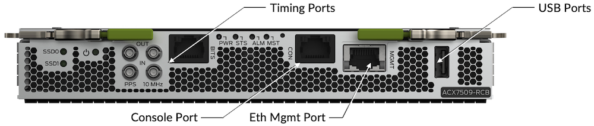

RCB are inserted horizontally in the top front of the chassis. The extractors / levers must be positioned on the top, it's an "inverted" FRU (field replaceable unit).

A single RCB is required to operate the chassis, and obviously, two are needed for control plane redundancy.

On the front plate, it offers the connectivity:

- DIN and RJ45 for timing protocols
- RJ45 for console port
- RJ45 for ethernet management port
- USB2.0

Internally, it contains an Intel x86 CPU (6C @ 2.9GHz), 64GB of DDR4 RAM and 2x100G M.2 SSD volumes. These RCBs are connected to the midplane and communicate with the other chassis parts via PCIE, Ethernet and I2C interfaces.

Check the TechLibrary page for details on the maintenance and operation: [https://www.juniper.net/documentation/us/en/hardware/acx7509/topics/topic-map/acx7509-maintain-rcb.html ](https://www.juniper.net/documentation/us/en/hardware/acx7509/topics/topic-map/acx7509-maintain-rcb.html)

The FEBs are field replaceable boards (but internal to the system) handling all the forwarding tasks of the centralized chassis.

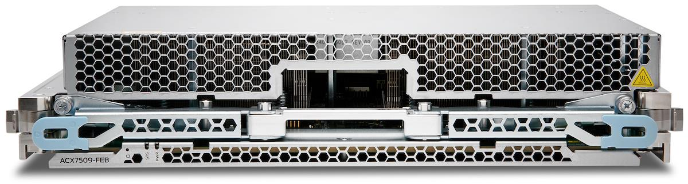

The router can operate with one single FEB and of course, redundancy can only be proposed with two FEB inserted.

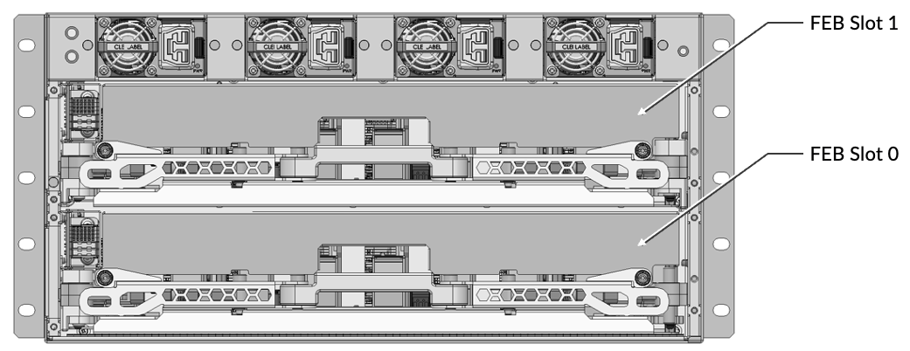

The FEB are inserted horizontally from the back of the chassis and only after the Fan Trays have been extracted. They connect to the midplane and offer direct connectivity to the FPC inserted from the front vertically.

Each FEB contains two Jericho2c PFE connected back-to-back and offers different SERDES speeds with a mix of Port Macro PM25 and PM50. The boards have Optical Direct (OD) connectors to attach directly to the FPCs. Internally, they communicate to the RCB via PCIE, Ethernet and I2C interfaces.

The "Internal Details" section will elaborate on the port connectivity and the TechLibrary page provides details on FEB maintenance and operation: [https://www.juniper.net/documentation/us/en/hardware/acx7509/topics/topic-map/acx7509-maintain-febs.html](https://www.juniper.net/documentation/us/en/hardware/acx7509/topics/topic-map/acx7509-maintain-febs.html)

### Power Supply Modules and Fan Trays

We will call the power supply block "Power Supply Unit" (PSU) or "Power Supply Module" (PSM), it all means the same thing.

Two options are available on ACX7509: AC/HDVC (JNP-3000W-AC-AFO) or DC (JNP-3000W-DC-AFO). When ordering a "Base" bundle, it contains 1+1 Power Supply Units (PSU) while the "Premium" bundle is coming with 2+2 PSUs.

Note: we don't support mix of AC and DC Power Modules in the chassis.

These 3000W power blocks are inserted on the top, from the back of the chassis.

The calculator lets you configure the traffic load, the number and type of optics, the FPCs and provide site requirement information: [https://apps.juniper.net/power-calculator/](https://apps.juniper.net/power-calculator/) or the direct link to the ACX7509:  [https://apps.juniper.net/power-calculator/?view=calculate&pdt=10107509&type=2](https://apps.juniper.net/power-calculator/?view=calculate&pdt=10107509&type=2)

The ACX7509 chassis cooling is guaranteed by two Fan Trays blocks inserted in the back, below the power supply modules.

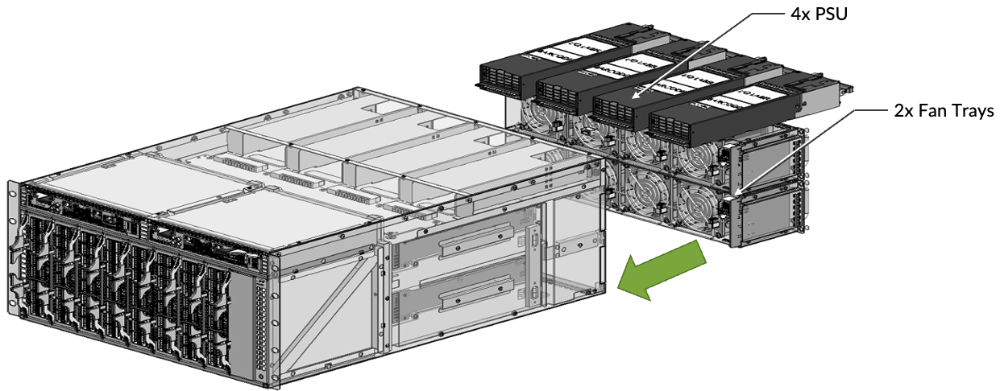

The cooling of the chassis is done only in "Air Flow Out" (AFO) mode, that means from Front to Back. The system can be operated with one Fan Tray ejected for 3 minutes for a short maintenance window. Check recommendation on the TechLibrary page: [https://www.juniper.net/documentation/us/en/hardware/acx7509/topics/topic-map/acx7509-maintain-cooling-system.html ](https://www.juniper.net/documentation/us/en/hardware/acx7509/topics/topic-map/acx7509-maintain-cooling-system.html)

```
regress@rtme-acx7509-re0> show chassis hardware
Hardware inventory:
Item             Version  Part number  Serial number     Description
Chassis                                JN12706xxxxx      ACX7509
Midplane 0       REV 13   750-111095   CARZxxxx          ACX7509 Midplane
PSM 0            REV 08   740-073765   1GE2Bxxxxxx       AC AFO 3000W PSU
PSM 1            REV 08   740-073765   1GE2Bxxxxxx       AC AFO 3000W PSU
Routing Engine 0          BUILTIN      BUILTIN           ACX7509-RE
CB 0             REV 14   750-123768   CASExxxx          Control Board
FPC 1            REV 13   750-120787   CASBxxxx          JNP-FPC-20Y
  PIC 0                   BUILTIN      BUILTIN           20x1/10/25/50-SFP56
    Xcvr 0       0        NON-JNPR     ECL140xxxxx       SFP+-10G-LR
    Xcvr 1       REV 01   740-031981   UJ1xxxx           SFP+-10G-LR
    Xcvr 2       REV 01   740-031981   45T012xxxxxx      SFP+-10G-LR
    Xcvr 3       0        NON-JNPR     AU5xxxx           SFP+-10G-SR
    Xcvr 4       REV 01   740-031980   193363xxxxxx      SFP+-10G-SR
    Xcvr 5       REV 01   740-021308   AN1xxxx           SFP+-10G-SR
    Xcvr 6       0        NON-JNPR     ONT154xxxxx       SFP+-10G-LR
    Xcvr 7       REV 01   740-030658   AA1206xxxxx       SFP+-10G-USR
FPC 2            REV 18   750-110070   CASExxxx          JNP-FPC-16C
  PIC 0                   BUILTIN      BUILTIN           16x100G-QSFP
    Xcvr 0       REV 01   740-061405   1ECQ15xxxxx       QSFP-100GBASE-SR4-T2
    Xcvr 1       REV 01   740-058734   1F1CQ1xxxxxxx     QSFP-100GBASE-SR4
    Xcvr 4       REV 01   740-061405   1ECQ13xxxxx       QSFP-100GBASE-SR4-T2
    Xcvr 5       REV 01   740-061405   1ECQ15xxxxx       QSFP-100GBASE-SR4-T2
    Xcvr 8       REV 01   740-032986   QB30xxxx          QSFP+-40G-SR4
FPC 5            REV 13   750-110072   CASAxxxx          JNP-FPC-4CD
  PIC 0                   BUILTIN      BUILTIN           4x400G QSFP56-DD
Fan Tray 0       REV 12   750-111810   CARZxxxx          Fan Tray/Controller AFO
Fan Tray 1       REV 12   750-111810   CARZxxxx          Fan Tray/Controller AFO
FEB 0            REV 15   750-110560   CASFxxxx          Q2C Forwarding Engine Board

{master}
regress@rtme-acx7509-re0> 
```

On this router, we only have 1+1 PSU.

```
regress@rtme-acx7509-re0> show chassis power detail
Chassis Power        Voltage(V)    Power(W)

Total Input Power                    409
  PSM 0
    State: Online
    Input 1             201          177
    Output            12.02        129.23
    Capacity           3000 W (maximum 3000 W)
  PSM 1
    State: Online
    Input 1             203          232
    Output            11.99        115.4
    Capacity           3000 W (maximum 3000 W)
  PSM 2
    State: Offline
    Input 1               0            0
    Output              0.0          0.0
    Capacity              0 W (maximum 0 W)
  PSM 3
    State: Offline
    Input 1               0            0
    Output              0.0          0.0
    Capacity              0 W (maximum 0 W)

Item                 Used(W)
  CB 0                   72
  FPC 2                  57
  Fan Tray 0             14
  Fan Tray 1             14
  FEB 0                 158

System:
  Zone 0:
      Capacity:          6000 W (maximum 6000 W)
      Allocated power:   1310 W (4690 W remaining)
      Actual usage:      409 W
  Total system capacity: 6000 W (maximum 6000 W)
  Total remaining power: 4690 W

{master}
regress@rtme-acx7509-re0> show chassis fan
      Item                      Status   % RPM     Measurement
      Fan Tray 0 Fan 0          OK       25%       3150 RPM
      Fan Tray 0 Fan 1          OK       26%       3750 RPM
      Fan Tray 0 Fan 2          OK       25%       3150 RPM
      Fan Tray 0 Fan 3          OK       26%       3750 RPM
      Fan Tray 0 Fan 4          OK       25%       3150 RPM
      Fan Tray 0 Fan 5          OK       26%       3750 RPM
      Fan Tray 0 Fan 6          OK       24%       3000 RPM   
      Fan Tray 0 Fan 7          OK       26%       3750 RPM
      Fan Tray 1 Fan 0          OK       25%       3150 RPM
      Fan Tray 1 Fan 1          OK       26%       3750 RPM
      Fan Tray 1 Fan 2          OK       27%       3300 RPM
      Fan Tray 1 Fan 3          OK       26%       3750 RPM
      Fan Tray 1 Fan 4          OK       24%       3000 RPM
      Fan Tray 1 Fan 5          OK       25%       3600 RPM
      Fan Tray 1 Fan 6          OK       25%       3150 RPM
      Fan Tray 1 Fan 7          OK       25%       3600 RPM 

{master}
regress@rtme-acx7509-re0>
```

### Field Replaceable?

Let's review the replaceable parts (FRU) in the chassis and how we can operate them in production:

| Field Replaceable Units |  |
|:--|:--|
| Power Supply Modules | Hot-insertable and Hot-removable |
| Fan Trays | Hot-insertable and Hot-removable |
| Routing and Control Board | Routing and Control Board Backup RCB is Hot-insertable and Hot-removable |
| Forwarding Engine Board Backup | FEB is Hot-insertable and Hot-removable |
| Flexible PIC Concentrator | FPCs are Hot-insertable and Hot-removable |

## Software

The minimum Junos EVO release required to operate ACX7509 is 21.4R1 and High Availability (HA) support has been introduced in 22.1R1.

The image is named: junos-evo-install-acx-x86-64-<release-ver>-EVO

```
regress@rtme-acx7509-re0> show version 
Hostname: rtme-acx7509-03-re0
Model: acx7509
Junos: 22.3R1.7-EVO
Yocto: 3.0.2
Linux Kernel: 5.2.60-yocto-standard-g9a086a2b7
JUNOS-EVO OS 64-bit [junos-evo-install-acx-x86-64-22.3R1.7-EVO]

{master}
regress@rtme-acx7509-re0>
```

## ACX7509 Ethernet Ports

### Port Numbering

In ACX7000 family, all physical interfaces are named "et-*" regardless of the optics/speed. It simplifies significantly the port migration tasks. In this example below, you can verify that port 1GE, 10GE, 25GE, 100GE or 400GE are all "et-x/y/z".

For example, the ports 0 in FPC2 are 100GE QSFP28 SR4 and the port 8 is a breakout of 4x10GE from a QSFP+ SR4. They will appear as et-2/0/0 and et-2/0/8:[0-3] respectively.

```
regress@rtme-acx7509-03-re0> show chassis hardware
Hardware inventory:
Item             Version  Part number  Serial number     Description
<SNIP>
FPC 2            REV 18   750-110070   CASE7493          JNP-FPC-16C
  PIC 0                   BUILTIN      BUILTIN           16x100G-QSFP
    Xcvr 0       REV 01   740-061405   1ECQ15251T7       QSFP-100GBASE-SR4-T2
    Xcvr 1       REV 01   740-058734   1F1CQ1A6140D5     QSFP-100GBASE-SR4
    Xcvr 4       REV 01   740-061405   1ECQ13240BL       QSFP-100GBASE-SR4-T2
    Xcvr 5       REV 01   740-061405   1ECQ15253XN       QSFP-100GBASE-SR4-T2
    Xcvr 8       REV 01   740-032986   QB300621          QSFP+-40G-SR4
    Xcvr 12      REV 01   740-058734   1F1CQ1A6140BG     QSFP-100GBASE-SR4
<SNIP>

{master}
regress@rtme-acx7509-03-re0> show interfaces et-2/0/0 terse
Interface               Admin Link Proto    Local                 Remote
et-2/0/0                up    up
et-2/0/0.0              up    up   inet     192.168.23.2/24
                                   mpls
                                   multiservice

{master}
regress@rtme-acx7509-03-re0> show interfaces et-2/0/8:0 terse
Interface               Admin Link Proto    Local                 Remote
et-2/0/8:0              up    up
et-2/0/8:0.4001         up    up   inet     135.135.0.2/24
                                   multiservice
et-2/0/8:0.4002         up    up   inet     135.135.0.4/24
                                   multiservice
et-2/0/8:0.4003         up    up   inet     135.135.0.6/24
                                   multiservice
et-2/0/8:0.4004         up    up   inet     135.135.0.8/24
                                   multiservice
et-2/0/8:0.4005         up    up   inet     135.135.0.10/24
                                   multiservice
```

You can understand the port numbering logic here: et-[FPC]/[PIC]/[Port] with PIC=0.

Physically speaking, the slots and ports are numbered like this:

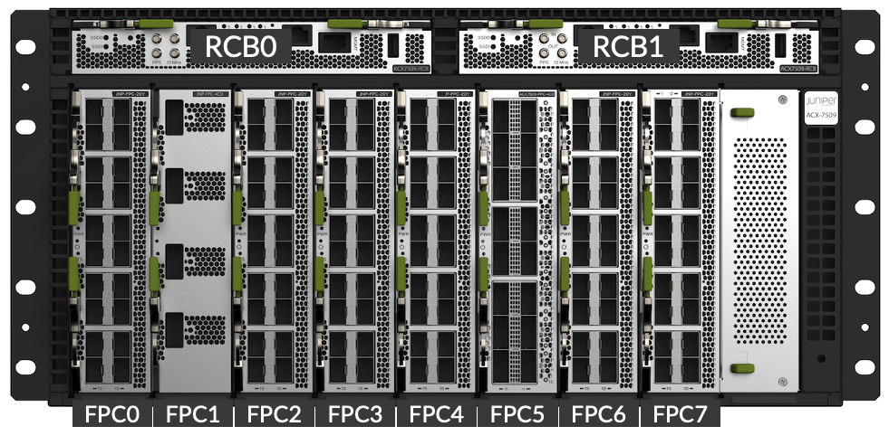

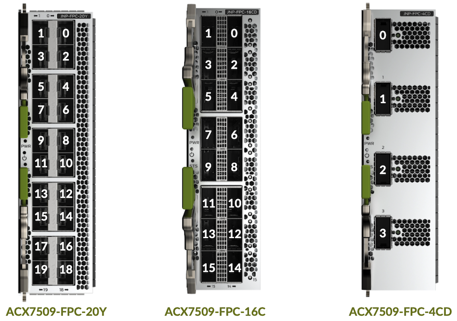

### Slot Position Impact

The FPCs support different port combinations, depending on their position in the chassis. To understand why the position influences the FPC capabilities, let's represent at high-level the Packet Forward Engine (PFE) used in the two FEBs:

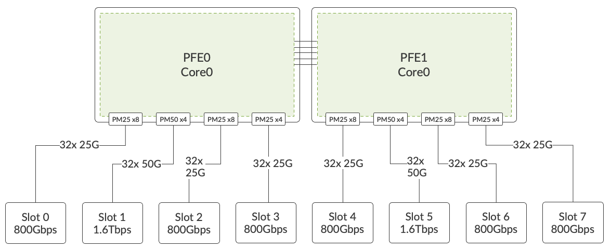

We have two Jericho2c (or Qumran2c, it's not relevant in this discussion) in each Forwarding Engine Board.

More details will be provided in the PFE section below. What's important at this point are the Port Macros available on each Jericho2c:

- 4x PM50, offering 8 SERDES each, for a total of 32x 50Gbps
- 24x PM25, offering 4 SERDES each, for a total of 96x 25Gbps
- Total of 128 SERDES

The PFE0 is connected to slots 0 to 3, while PFE1 is connected to slots 4 to 7.

Slots 1 and 5 are connected via PM50, also other slots are linked with PM25.

We invite you to read more on the Port Macros in this TechPost: [https://juniper.github.io/techposts/building-the-acx7000-series-the-pfe/article](https://juniper.github.io/techposts/building-the-acx7000-series-the-pfe/article)

In a nutshell:

PM25 supports up to 25.7815Gbps enabling:

- 1GE/10GE/25GE over one lane
- 40GE/50GE over two lanes
- 40GE/100GE over four lanes

PM50 supports up to 53.125Gbps enabling:

- 10GE/25GE/50GE over one lane
- 40GE/50GE/100GE over two lanes
- 40GE/100GE/200GE over four lanes
- 400GE over eight lanes

You understand that an FPC may have different capabilities whether we insert it in a PM25 slot or a PM50 slot.

Always use the port checker tool to verify the support and understand the potential restrictions: [https://apps.juniper.net/home/port-checker/index.html](https://apps.juniper.net/home/port-checker/index.html)

### ACX 7509-FPC-20Y

This FPC offers 20 ports SFP for 1GE to 50GE connectivity.

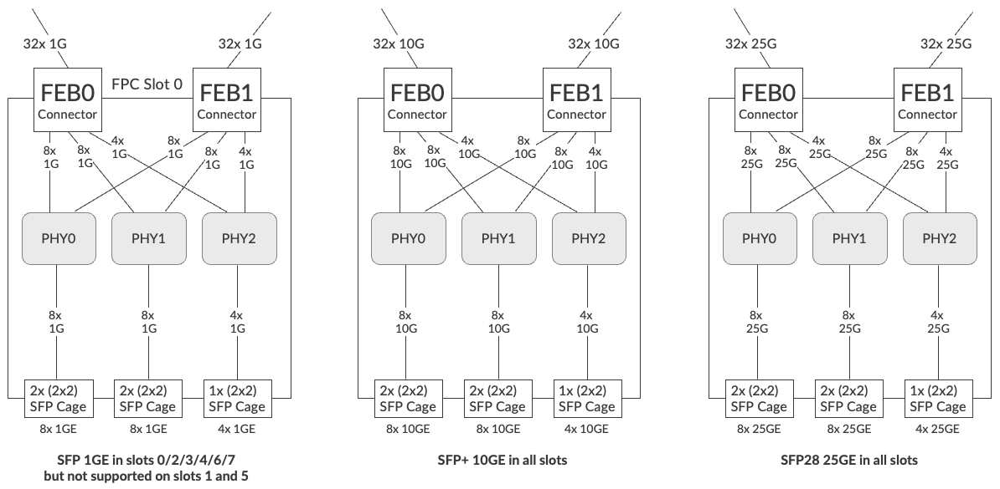

SFP 1GE is supported on all the slots except those using PM50 (slots 1 and 5). No limitation for SFP+ 10GE and SFP28 25GE, supported with the FPC inserted in any slot of the ACX7509 chassis.

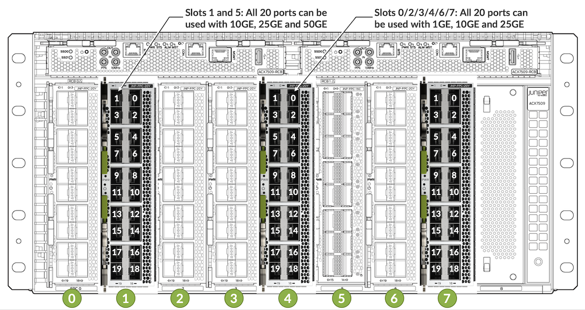

You can use the port checker to verify the supported combinations and options:

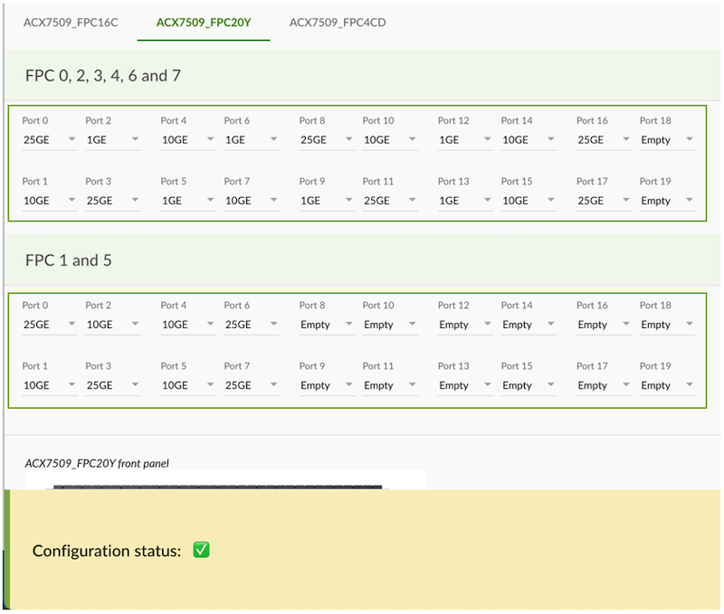

We check the port capabilities on slot 1.

```
regress@rtme-acx7509-01-re0> show chassis pic fpc-slot 1 pic-slot 0
FPC slot 1, PIC slot 0 information:
  Type                             20x1/10/25/50-SFP56
  State                            Online
  PIC version                   255.09
  Uptime                           3 hours, 56 minutes, 36 seconds

PIC port information:
<SNIP>

Port speed information:

  Port  PFE      Capable Port Speeds
  0      0       1x1G 1x10G 1x25G 1x50G 
  1      0       1x1G 1x10G 1x25G 1x50G 
  2      0       1x1G 1x10G 1x25G 1x50G
  3      0       1x1G 1x10G 1x25G 1x50G 
  4      0       1x1G 1x10G 1x25G 1x50G
  5      0       1x1G 1x10G 1x25G 1x50G
  6      0       1x1G 1x10G 1x25G 1x50G 
  7      0       1x1G 1x10G 1x25G 1x50G
  8      0       1x1G 1x10G 1x25G 1x50G
  9      0       1x1G 1x10G 1x25G 1x50G 
  10     0       1x1G 1x10G 1x25G 1x50G
  11     0       1x1G 1x10G 1x25G 1x50G
  12     0       1x1G 1x10G 1x25G 1x50G 
  13     0       1x1G 1x10G 1x25G 1x50G
  14     0       1x1G 1x10G 1x25G 1x50G
  15     0       1x1G 1x10G 1x25G 1x50G
  16     0       1x1G 1x10G 1x25G 1x50G
  17     0       1x1G 1x10G 1x25G 1x50G 
  18     0       1x1G 1x10G 1x25G 1x50G
  19     0       1x1G 1x10G 1x25G 1x50G

{master}
regress@rtme-acx7509-01-re0>
```

Note: this output is displaying hardware capabilities,

- It doesn't reflect what the software support
- It doesn't reflect what is tested and therefore officially supported

By default, all ports of the ACX7509-FPC-20Y are configured for 25GE, meaning if you insert SFP28 optics, you don't need to configure anything specific. You'll need to set up speed explicitly for 1GE and 10GE.

50GE optics support is added in JUNOS 22.4R1:

- only in slots 1 and 5
- all 20 ports of the FPC can be used

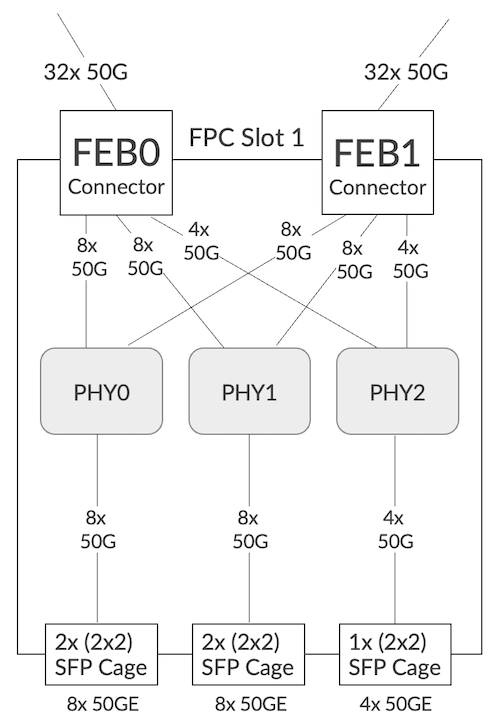

### ACX7509-FPC-16C

This second FPC is designed for high density 100GE use cases but can also be used for other scenarios. When inserted in PM50 slots (1 and 5), we can enable the full capability with 16 ports QSFP28 100GE:

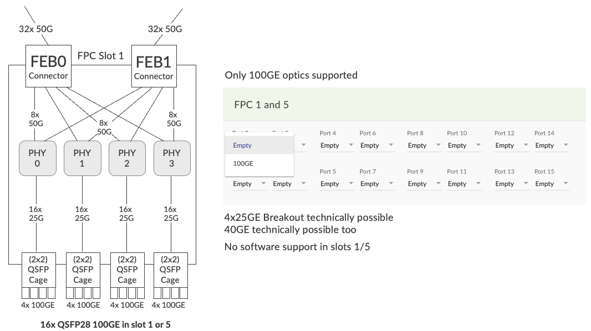

This FPC is composed of 4 PHY modules fulfilling different roles including MUX, retimer, Gearbox and Reverse Gearbox (GB/RGB). They guarantee communication between FEB (via Orthogonal Direct connectors) and the optical cages / modules.

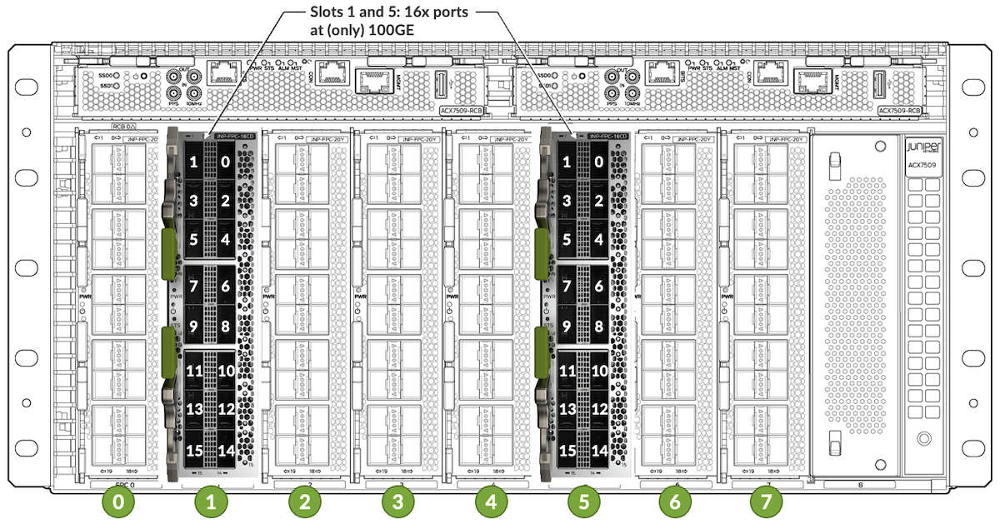

The PHY in the FPC are used in Gearbox mode, with 50Gbps on the system side and 25Gbps on the line side. That way, we support 4 lanes options (SR4, LR4, ...)

```
regress@rtme-acx7509-02-re0> show chassis pic fpc-slot 5 pic-slot 0
FPC slot 5, PIC slot 0 information:
  Type                             16x100G-QSFP
  State                            Online  
  PIC version               255.09
  Uptime                         53 days, 8 hours, 43 minutes, 21 seconds

PIC port information:
<SNIP>

Port speed information:

  Port  PFE      Capable Port Speeds
  0      1       1x100G 1x40G 4x10G 4x25G
  1      1       1x100G 1x40G 4x10G 4x25G
  2      1       1x100G 1x40G 4x10G 4x25G 
  3      1       1x100G 1x40G 4x10G 4x25G
  4      1       1x100G 1x40G 4x10G 4x25G
  5      1       1x100G 1x40G 4x10G 4x25G 
  6      1       1x100G 1x40G 4x10G 4x25G
  7      1       1x100G 1x40G 4x10G 4x25G
  8      1       1x100G 1x40G 4x10G 4x25G 
  9      1       1x100G 1x40G 4x10G 4x25G
  10     1       1x100G 1x40G 4x10G 4x25G
  11     1       1x100G 1x40G 4x10G 4x25G 
  12     1       1x100G 1x40G 4x10G 4x25G 
  13     1       1x100G 1x40G 4x25G 4x10G
  14     1       1x100G 1x40G 4x25G 4x10G
  15     1       1x100G 1x40G 4x25G 4x10G 

{master}
regress@rtme-acx7509-02-re0>
```

Today, the software doesn't support 40GE optics or 4x 10GE / 4x 25GE break out options in these slots.

When inserted in the PM25 slots (0/2/3/4/6/7), we have different capabilities.

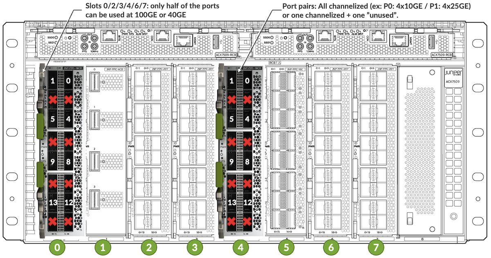

In these PM25 slots 0/2/3/4/6/7, we can only use half of the ports of the FPC.

More precisely, we can only use the first two ports of each cage:

- 0 and 1
- 4 and 5
- 8 and 9
- 12 and 13

These ports can be populated with 100GE, 4x 25GE, 40GE and 4x 10GE with some restrictions we will list a bit later. The other ports will not appear, the user doesn't need to configure them in any specific manner.

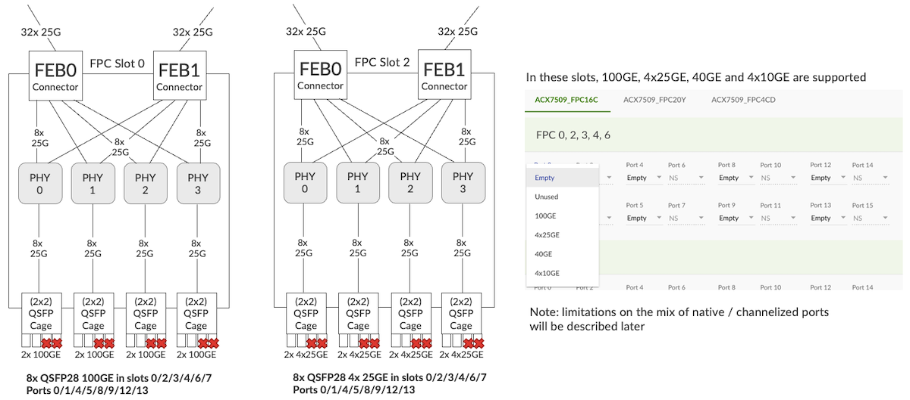

The PHYs are used as retimers here (25Gbps to 25Gbps) and HMUX. The port checker clearly shows the port restrictions and the available options.

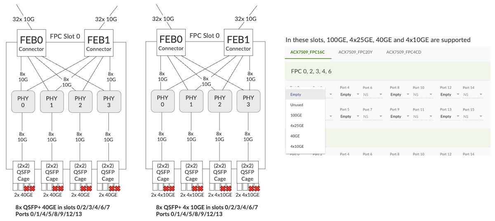

```
regress@rtme-acx7509-03-re0> show chassis pic fpc-slot 2 pic-slot 0
FPC slot 2, PIC slot 0 information:
  Type                             16x100G-QSFP
  State                            Online
  PIC version                   255.09
  Uptime                           1 day, 9 hours, 34 minutes, 47 seconds

PIC port information:
<SNIP>

Port speed information:

  Port  PFE      Capable Port Speeds
  0      0       1x100G 1x40G 4x10G 4x25G 
  1      0       1x100G 1x40G 4x10G 4x25G
  4      0       1x100G 1x40G 4x10G 4x25G
  5      0       1x100G 1x40G 4x10G 4x25G 
  8      0       1x100G 1x40G 4x10G 4x25G
  9      NA      1x100G 1x40G 4x10G 4x25G
  12     0       1x100G 1x40G 4x10G 4x25G 
  13     0       1x100G 1x40G 4x25G 4x10G

{master}
regress@rtme-acx7509-03-re0>
```

Regarding the use of channelized ports, some basic rules need to be followed.

Within a group of two adjacent ports (0-1, 4-5, 8-9, 12-13), if one is configured as channelized, the other must be channelized too or kept empty.

In the example, below, the port checker allows the configuration of Port4: 4x25GE with Port5: 4x10GE. But it raises an alarm with Port0: 100GE and Port1: 4x25GE.

If a user tries to force an unsupported configuration (channelized port with adjacent non-channelized port), the ports will not come up and a PIC violation alarm will be triggered.

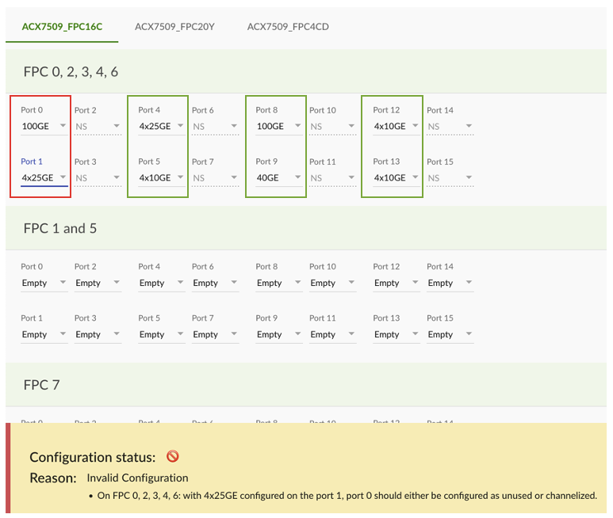

Finally, let's highlight a specific exception here: when using the ACX7509-FPC-16Y in slot 7, a port is disabled to allow the PTP configuration: port 13.

Note: even if you don't configure specifically PTP, the port is unused.

As illustrated in figure 26 below, the port checker will not let you configure it.

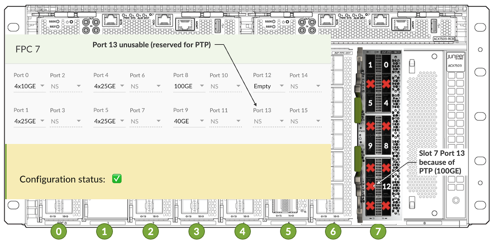

### ACX 7509-FPC-4CD

Only slot 1 and slot 5 can provide 53Gbps PAM4 and, therefore, support 400GE interfaces.

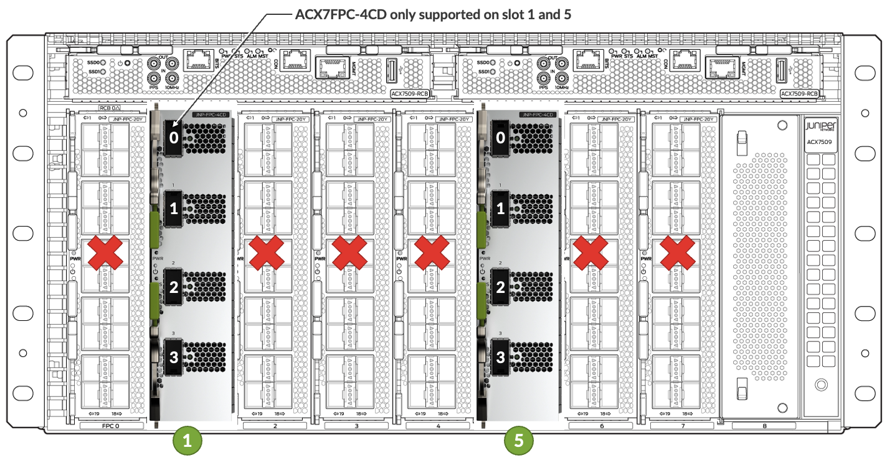

All the ports can be used at 400GE or in breakout of 4x 100GE. No restriction in the mix when enabling breakout here.

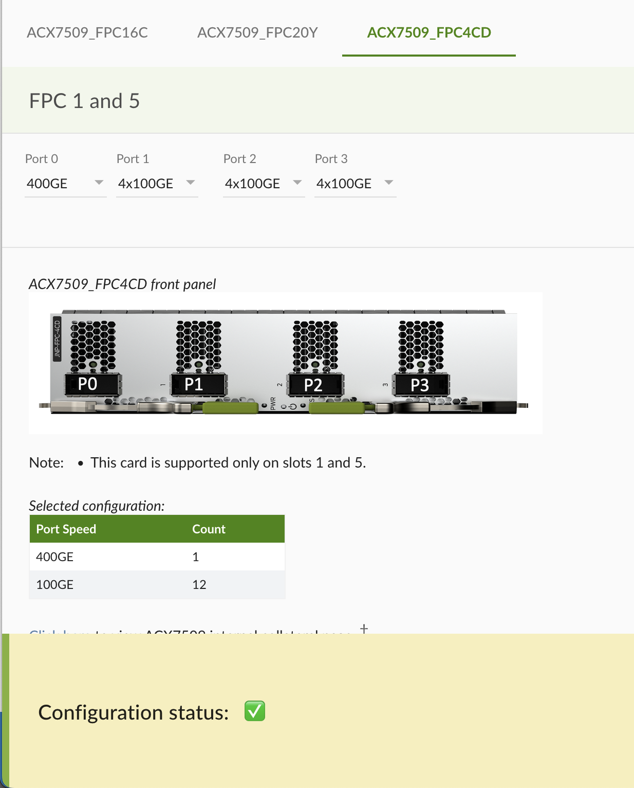

```
regress@rtme-acx7509-01-re0> show chassis pic fpc-slot 5 pic-slot 0
FPC slot 5, PIC slot 0 information:
  Type                             4x400G QSFP56-DD
  State                            Online
  PIC version                   255.09
  Uptime                           3 hours, 57 minutes, 26 seconds

PIC port information:
<SNIP>

Port speed information:

  Port  PFE      Capable Port Speeds
  0      1       1x400G 4x100G 1x200G 2x100G 8x50G
  1      1       1x400G 4x100G 1x200G 2x100G 8x50G
  2      1       1x400G 4x100G 1x200G 2x100G 8x50G
  3      1       1x400G 4x100G 1x200G 2x100G 8x50G 

{master}
regress@rtme-acx7509-01-re0> 
```

To verify the latest support of optics, always use the Hardware Compatibility Tool: [https://apps.juniper.net/hct/product/?prd=ACX7509](https://apps.juniper.net/hct/product/?prd=ACX7509)

### Maximum number of ports supported on ACX7509 Routers

Now that we detailed the potential restrictions in term of FPC position in the chassis, let's identify the maximum number of ports we can offer in an ACX7509 and how we calculate it.

|  | 1GE | 10GE | 25GE | 40GE | 50GE | 100GE | 200GE | 400GE |
|:--|:--|:--|:--|:--|:--|:--|:--|:--|
| Native | 120 | 160 | 160 | 47 | N/S | 79 | N/S | 8 |
| With BreakOut | N/A | 188 | 188 | N/A | N/S | 79 | N/S | N/A |

N/A: Not applicable -- N/S: Not supported

Let's check the math here:

- 1GE available on ACX7509-FPC-20Y only, in PM25 slots (0/2/3/4/6/7) 6x FPC and 20x ports each: 120x 1GE total.
- 10GE available on ACX7509-FPC-20Y natively and ACX7509-FPC-16C with QSFP+ breakout cables.With a chassis full populated with ACX7509-FPC-20Y cards: 8x FPC and 20x SFP+ each: 160x 10GE total. With breakout cable: ACX7509-FPC-16C supports 4x 10GE on PM25 slots only, and on half of the ports, with a specific case of slot 7 where port 13 is blocked for PTP. That gives us: 5x FPC with 8x QSFP+ 4x10GE and 1x FPC with 7x QSFP+ 4x 10GE for a total of 5x8x4 + 7x4 = 188x 10GE.
- 25GE: same logic than 10GE with SFP28 and breakout on QSFP28. Native:  8x FPC and 20x SFP28 each: 160x 25GE total. With breakout: 5x FPC with 8x QSFP28 4x25GE and 1x FPC with 7x QSFP28 4x 25GE: 5x8x4 + 7x4 = 188x 25GE total.
- 40GE via QSFP+ modules and therefore only supported on the ACX7509-FPC-16C in PM25 slots (0/2/3/4/6/7) on half of the ports and with the specific case of slot 7. 5x8 + 7 = 47x 40GE total.
- 50GE not supported at the moment of the publication of this article, in the roadmap. When available, it will be on ACX7509-FPC-20Y in PM50 slots 1 and 5. 2x FPC and 20x SFP56 modules each; 40x 50GE total.
- 100GE available on ACX7509-FPC-16C natively, with 16 ports in PM50 slots and 8 ports in PM25 slots (with slot 7 exception).
Also available with breakout on ACX7509-FPC-4CD but it doesn't improve the max supported scale. 2x FPC with 16x QSFP28 each + 5x FPC with 8x QSFP28 each + slot 7 FPC with 7x QSFP28. That gives us 79x 100GE total.
- 200GE not supported at the moment of the publication of this article.
- 400GE supported on ACX7509-FPC-4CD only in slots 1 and 5. 2x 4x QDD56 modules: 8x 400GE total.

## Internal Details

### Block Diagrams

The ACX7509 is internally composed of multiple parts, themselves containing different chipsets .

At very high-level, we can summarize them to:

- FEB (potentially x2) each of them containing
  - Two Broadcom Jericho2c PFE (BCM8882x) with 2x 4GB HBM
  - Orthogonal Direct connectors towards the 8 FPCs
- RCB (potentially x2), each of them containing
  - Intel x86 CPU with DDR4 memory and SSD storage
  - PCI switch to interconnect the different components
  - Internal controllers for I2C (inter-integrated circuit), fan control, ...
  - TPM 2.0 module (Trusted Platform Module)
- FPC
  - PHY acting as HMUX, retimer and (Reverse) Gearboxes to adapt 50 Gbps PAM4 into 25Gbps NRZ or vice versa, to broadcast and select traffic to and from FEBs
  - FPGA for control signals
  - Optical cages to accommodate different optic modules

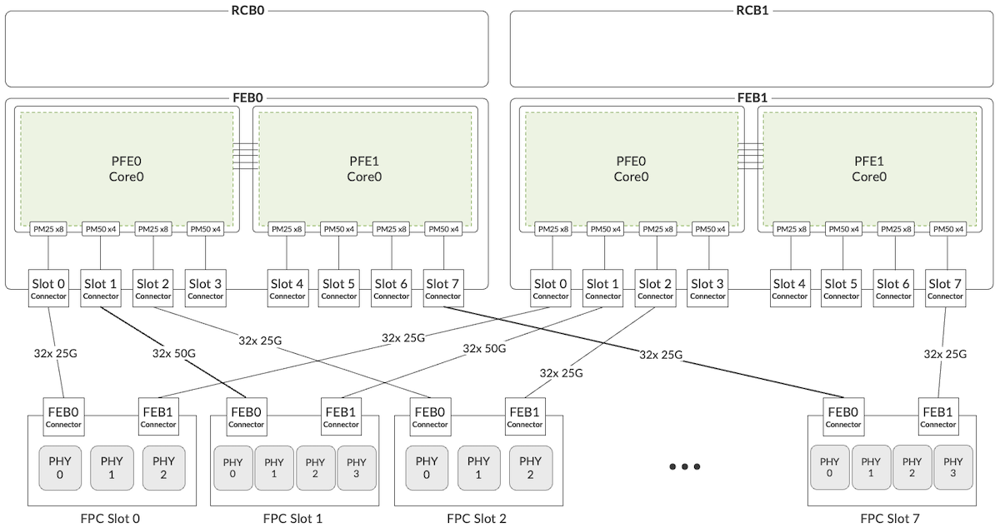

### PFE Description

Let's zoom in the Packet Forwarding Engine used in the ACX7509.

Each FEB hosts two Broadcom Jericho2c (BCM8882x) in back-to-back "mesh" mode.

Jericho2c is a single core chipset offering:

- 2.4Tbps and 1BPPS forwarding capacity
- 4Tbps of Network Interfaces (NIF) via a mix of 32x 50Gbps SERDES and 96x 25Gbps SERDES
- 48 Fabric 50Gbps SERDES
- 128k Virtual Output Queues
- 384k Counters
- Hybrid buffering with 16MB on-chip ingress buffer, 4GB off-chip ingress buffer and 6MB for egress queueing.

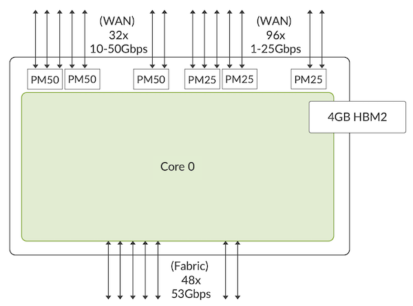

So, why two J2c at 2.4Tbps instead of a single Jericho2 at 4.8Tbps?

This dual ASIC approach offers multiple advantages, but the two major ones are:

- A mix of PM25 and PM50 allowing ports from 1GE to 400GE in the same chassis J2 only offers PM50s, check [the link for more details](https://juniper.github.io/techposts/building-the-acx7000-series-the-pfe/article)
- Higher scalability in queues and counters

The two J2c ASICs are connected via 48x SERDES 50Gbps. The traffic "cellification" between ingress and egress pipelines and the internal headers added to each packet/cell (traffic management, packet processing and fabric headers), reduces this theorical 2.4Tbps connection to 2.15Tbps in the best case. Let's say it's "more or less 2Tbps" to simplify the discussion.

The aggregated NIF represents 4Tbps (32x50G + 96x25G), but of course the chipset cannot push or receive these 4Tbps. Nevertheless, and it could be counter-intuitive, the chip can receive and transmit more than 2.4Tbps:

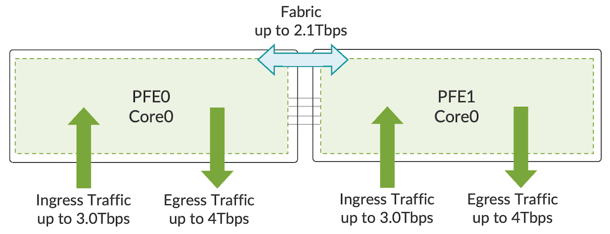

It's entirely dependent on the packet size, and for certain ranges like [505-570], the forwarding performance goes below 2.4Tbps. It's the famous sawtooth diagram you may have seen in the past.

In a nutshell, the larger the average packet size, the more bandwidth you will get.

You can imagine ideal cases to optimize the bandwidth like:

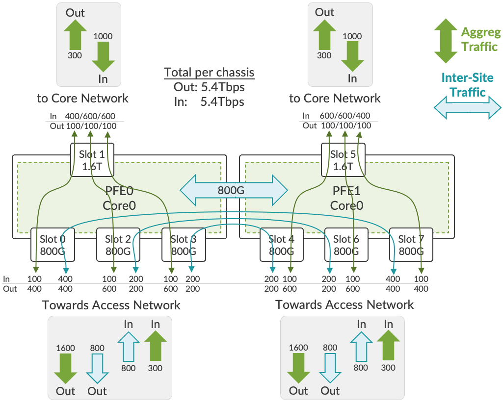

This example in figure 32 is supposing a 4:1 to 6:1 downstream/upstream ratio in an aggregation network and a third of east-west (inter-site) traffic.

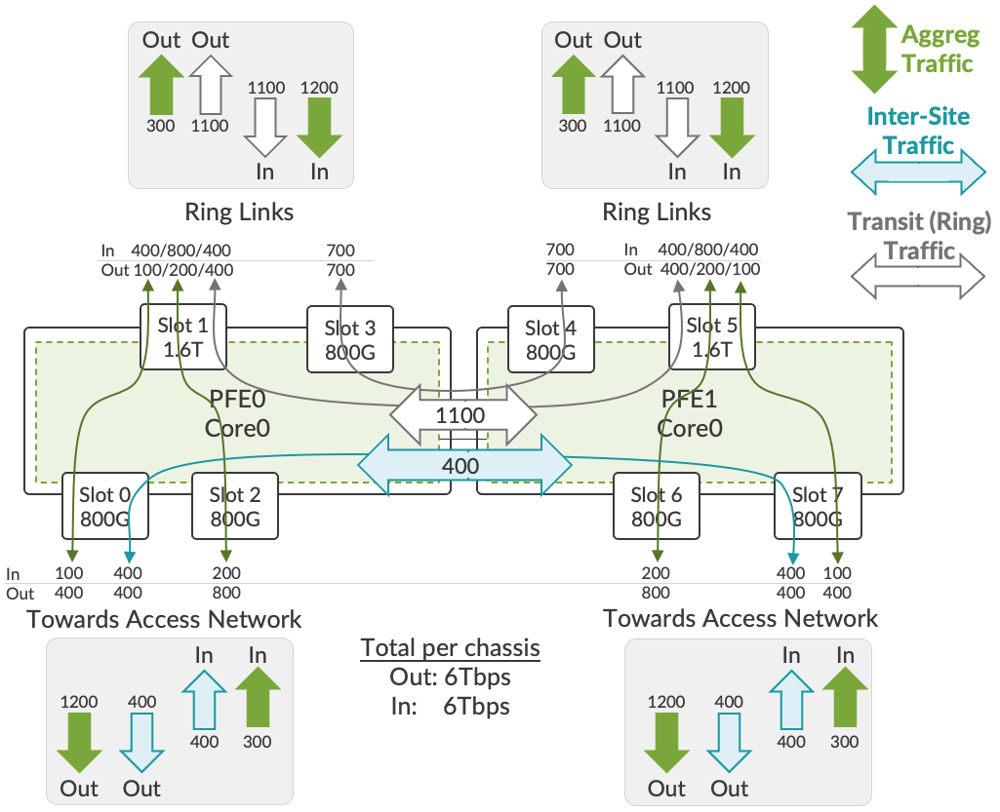

## Redundancy

RCB0 and FEB0 are grouped and represent a tight pair, same for RCB1 and FEB1.

We **won't** support the following scenarios:

- 2x RCB 0+1 and only FEB0 (or only FEB1)
- 2x FEB 0+1 and only RCB0 (or only RCB1)
- RCB0 with FEB1
- RCB1 with FEB0

In the "Base" bundle, the ACX7509 chassis is shipped with only RCB0 and FEB0.

In the "Premium" bundle, the ACX7509 chassis is coming with RCB0 paired with FEB0 and RCB1 paired with FEB1. In this redundant configuration, they behave in a "shared fate" mode, meaning that the failure of one will trigger the mastership switchover.

If you insert a FEB without the matching RCB or vice versa, the system will trigger a mismatch alarm and the part will not come ONLINE.

To illustrate the logic, we start with the default status when you boot up the chassis: RCB/FEB Pair "0" is Active and Pair "1" is standby

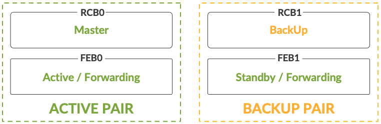

In this situation, the RCB0 is Master and RCB1 is in Backup state.

Both FEBs are capable of forwarding (we will show why in a minute):

- FEB0 is Active and paired to RCB0
- FEB1 is in Standby mode, and paired to RCB1

If the RCB0 fails or is ejected:

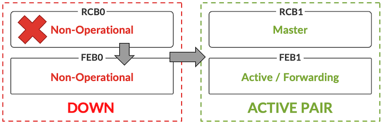

It triggers a mastership switchover and the pair RCB1/FEB1 becomes Active / Master.

This happens in a few milliseconds, the I2C internal network enables the detection and triggers the change decision.

An alternative scenario is the failure of the FEB0:

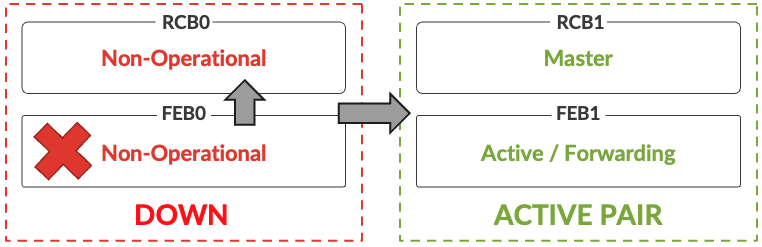

Here again, a mastership switchover happens in a few milliseconds, with the pair RCB1/FEB1 taking the control.

The signaling of the mastership is also influencing the PHY behavior in the FPCs. And to understand why, let's follow the data path at high level in the chassis.

These PHYs are not only responsible for retiming and SERDES speed translation, but they also act as a Hybrid Multiplexer (HMUX) responsible for broadcasting the traffic coming from the interfaces towards the two FEBs and to select the appropriate traffic coming from the PFEs to be transmitted to the NIF.

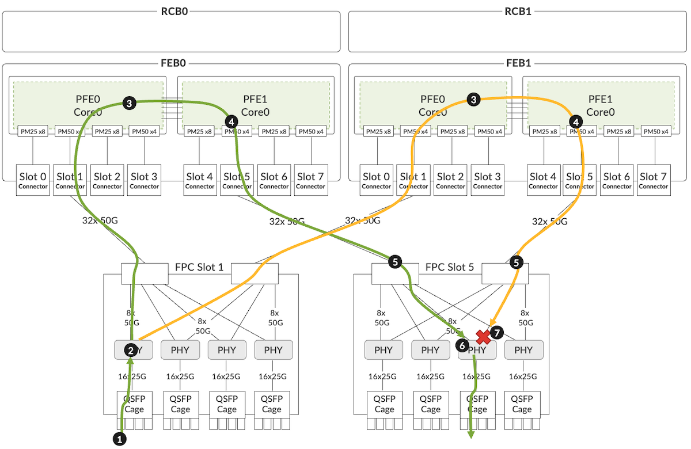

1. The traffic is received on the FPC slot 1
2. The PHY associated to this interface duplicates the traffic to both FEB0 and FEB1 on the system-facing SERDES mapped to the source interface.
3. The traffic green and orange are received by both PFE0s of FEB0 and FEB1, the ingress packet treatment is applied, including the destination lookup and next-hop resolution, leading to the forwarding of the packets to PFE1
4. Still happening in parallel, the traffic arrives in PFE1 egress pipeline and is transmitted towards the FPC slot 5 via the OD connector
5. At that moment, the duplicated traffic arrives in FPC slot 5 and is passed to the PHY
6. Based on the FEB_SELECTOR configuration, it will forward the green traffic coming from the active FEB0
7. And it will drop the orange traffic coming from FEB1 (backup)

This FEB_SELECTOR information is signaled through the internal I2C networks. When a mastership switchover is triggered, making the pair RCB1/FEB1 Active, the information is instantly passed to the PHYs from the new active RCB, reprogramming the HMUX to accept traffic from FEB1 and no longer from FEB0 as show in figure

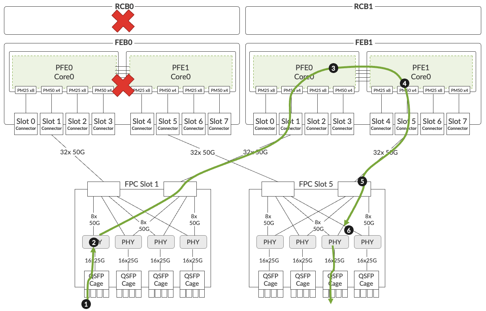

## In Conclusion

We didn't cover MACsec support and Class-C timing, both features enabled at the PHY level in the different PFCs (since Jericho2c can't provide these services). These two technologies will be the topic of dedicated TechPost article in the future.

For your information, a series of articles has been dedicated to the ACX7000 Metro use-cases validation and it does include the ACX7509 chassis. They cover EVPN MAC-VRF, EVPN VPWS, L3VPN, 6PE, L2VPN, VPLS and L2 learning rate: how we configure it and what is the supported scale. The first articles of this series are listed in the links below.

Next article on ACX7509 will be dedicated to the High-Availability testing, stay tuned.

## Useful links

- TechLibrary pages: [https://www.juniper.net/documentation/product/us/en/acx7509/](https://www.juniper.net/documentation/product/us/en/acx7509/)
- Datasheet: [https://www.juniper.net/content/dam/www/assets/datasheets/us/en/routers/acx7509-cloud-metro-router-datasheet.pdf](https://www.juniper.net/content/dam/www/assets/datasheets/us/en/routers/acx7509-cloud-metro-router-datasheet.pdf)
- Port checker: [https://apps.juniper.net/home/port-checker/index.html](https://apps.juniper.net/home/port-checker/index.html)
- Power calculator: [https://apps.juniper.net/power-calculator/?view=calculate&pdt=10107509&type=2](https://apps.juniper.net/power-calculator/?view=calculate&pdt=10107509&type=2)
- EVPN MAC VRF Metro Validation: [https://juniper.github.io/techposts/evpn-mac-vrf-validation-on-acx7000/article](https://juniper.github.io/techposts/evpn-mac-vrf-validation-on-acx7000/article)
- EVPN VPWS Metro Validation: [https://juniper.github.io/techposts/evpn-vpws-validation-on-acx7000/article](https://juniper.github.io/techposts/evpn-vpws-validation-on-acx7000/article)
- L3VPN and 6PE Metro Validation: [https://juniper.github.io/techposts/l3vpn-validation-on-acx7000/article](https://juniper.github.io/techposts/l3vpn-validation-on-acx7000/article)

## Glossary

- AFO: Airflow Out
- ASIC: Application-Specific Integrated Circuit
- CLI: Command Line Interface
- CPU: Central Processing Unit
- DIN (connector): Deutsches Institut fur Normung e.V.
- FEB: Forwarding Engine Board
- FPC: Flexible PIC Concentrator
- FRU: Field Replaceable Unit
- FPGA: Field Programmable
- FT: Fan Tray
- HA: High Availability
- HMUX: Hybrid Multiplexer
- I2C: Inter-Integrated Circuit
- MUX: Multiplexer
- NIF: Network Interface
- NRZ: Non-Return to Zero
- OD: Orthogonal Direct (connectors)
- PAM4: Pulse Amplitude Modulation 4-level
- PFE: Packet Forwarding Engine
- PM: Port Macro
- PSM: Power Supply Module
- PSU: Power Supply Unit
- QSFP: Quad Small Form-factor Pluggable
- RCB: Routing Controller Board
- RU: Rack Unit
- SERDES: SERializer DESerializer
- SFP: Small Form-factor Pluggable
- SKU: Stock Keeping Unit
- VOQ: Virtual Output Queue

## Acknowledgements

Many thanks to Vyasraj Satyanarayana, Dhaval Bhodia, Rajeshwar Sable for their explanations on the ACX7509 and PFE details. Thanks to Aysha Jabeen and Amit Kantelia for the review of this document.
