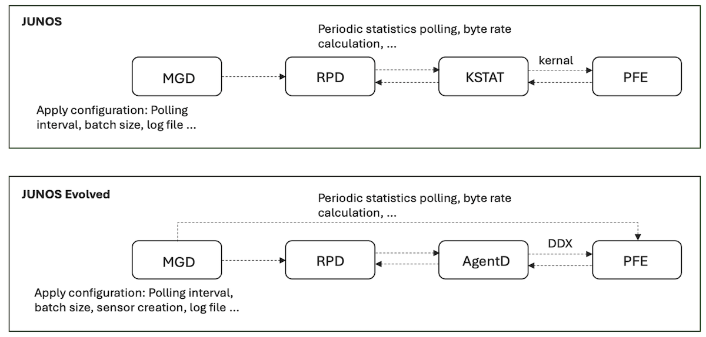
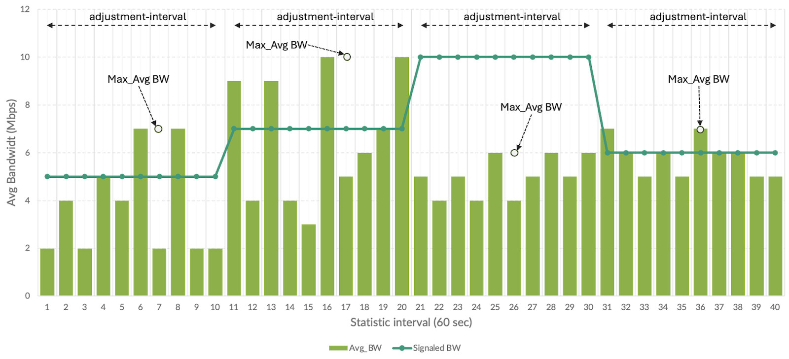
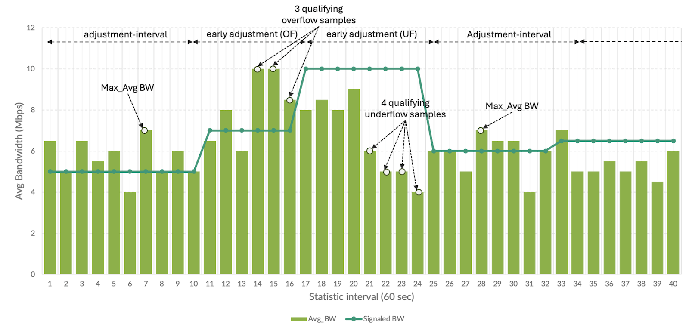
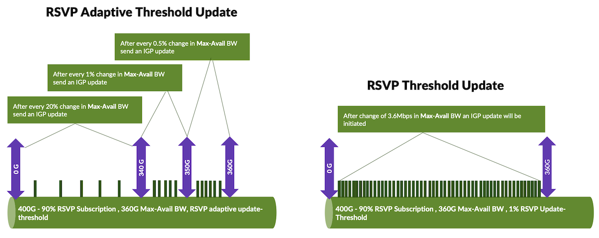
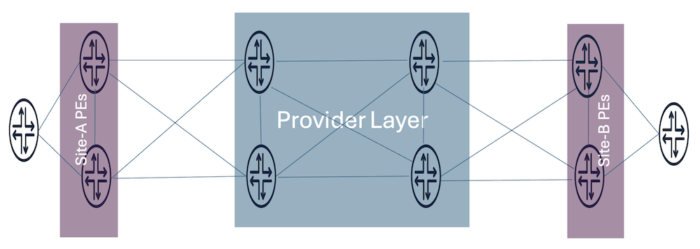
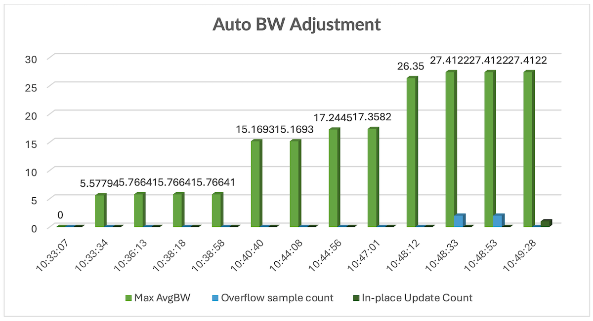

# Adaptive Resource Control in TE Networks

**Kashif Nawaz - 07/05/2025**

In modern MPLS networks, managing traffic flows with precision is essential for maintaining performance and reliability. RSVP-TE provides a robust framework for establishing traffic-engineered paths that align with specific resource requirements. As network conditions fluctuate, static bandwidth reservations often fall short. To address this, dynamic mechanisms like auto-bandwidth allow the network to adapt in real time, ensuring efficient use of available capacity.

## Introduction

RSVP-TE is a powerful protocol suite used in MPLS networks to establish and manage Label Switched Paths (LSPs) with specific Traffic Engineering (TE) requirements. Its capabilities are so extensive that a comprehensive exploration would require a short novel. One of the most compelling features of RSVP-TE is its ability to signal and reserve bandwidth across each physical link that an LSP traverses. This ensures that network resources are allocated efficiently and that traffic flows are predictable and manageable.

To prevent over-subscription of link bandwidth during LSP setup, RSVP-TE includes mechanisms to reserve bandwidth from the total available physical bandwidth on each link. However, static bandwidth reservations are often unsuitable for production environments, where traffic patterns are dynamic and unpredictable. Static configurations fail to adapt to fluctuations in traffic volume, leading to either underutilization or congestion. This is where** auto-bandwidth** comes into play. Auto-bandwidth enables the dynamic adjustment of an LSP's bandwidth reservation based on real-time incoming load. By periodically measuring traffic and adjusting reservations accordingly, auto-bandwidth ensures optimal utilization of RSVP-enabled links in an MPLS network.

## Auto-Bandwidth Overview

Real-time bandwidth/resource management is crucial in modern networks to maximize available resources and adapt to changing traffic patterns.  As opposed to over-provisioning and/or static bandwidth allocations techniques.

The MPLS Auto-Bandwidth feature enables an RSVP signaled label-switched path (LSP) to automatically adjust its signaled bandwidth based on the volume of traffic flowing through it.  Auto-bandwidth consists of three major building blocks:

- **1 - Statistics Collection**: The Routing Protocols Daemon (RPD) periodically requests traffic statistics about all RSVP sessions from each Packet Forwarding Engine (PFE) in the system. RPD sends the stats request to Kstat (Kernel Statistics). Kstat sends the request to each PFE through the kernel and collects the responses back from all PFEs, then sends the responses back to RPD.  In Junos OS Evolved, only sensor-based-stats are supported. In Junos OS Evolved, similarly, RPD sends the requests to Agentd , which sends the request to each PFE through the Evo infrastructure (Distributed Data eXchange or DDX) and collects the responses back from all PFEs.  Response may be optionally recorded via a log file if defined.  Figure 1 illustrates these interactions for both Junos OS and Junos OS Evolved.



- **2 - Bandwidth Estimation**: At the end of a collection period (adjust-interval), the maximum average value is recorded from the set of collected statistics.  Figure 2 provides a simple illustration of periodic statistics collection, followed by re-signaling of bandwidth using the Maximum Average Bandwidth (Max AvgBW) value from the previous collection period after each adjustment interval.



- **3 - Path Placement**: An attempt is made to signal a new path for an LSP with the preceding sample periods Max AvgBW at the end of an adjustment interval.  If the new path is successfully established, the original path is removed and the LSP is switched over to the new path. If a new path is not created, the LSP continues to use its current path until the end of the next adjustment interval, when another attempt is made to establish a new path.

Here is a *minimal configuration example* in Junos:

```
protocols {
    mpls {
        statistics {
            interval 50;
            auto-bandwidth;
        }
        label-switched-path A-B {
            to 172.172.172.2;
            auto-bandwidth {
                adjust-interval 900;
                adjust-threshold 3;
```

With the above configuration, BW (bps) statistics will be collected for the LSP A-B every 50 seconds and RPD calculates a BW value.  After 900 sec (adjust-interval), 18 samples will have been collected, and the largest value (max_avg) will be selected.  If the max_avg value differs by more than 3% (adjust-threshold) of the current signaled BW, the max_avg value will be used to find a new path for LSP A-B that satisfies the new requested BW.  Stats collection then begins for the new LSP and the cycle repeats.  In this way, LSPs are adapting to the demands of the network. (For example, if adjust-threshold is set to 3 and the current LSP bandwidth is 100 Mbps, then the LSP will be resized only if the following conditions are met.

In Juniper ACX 7K series routers which are based on Broadcom DNX chip, LSP statistics collection needs to be enabled at the PFE level. Configuring / deleting LSP statistics at PFE level results in a PFE restart.

Ingress LSP statistics:

```
set system packet-forwarding-options mpls lsp-ingress-stats-enable
```

Transit LSP statistics:

```
set system packet-forwarding-options mpls lsp-transit-stats-enable
```

## Handling Sudden Changes in Bandwidth

Considering the above configuration, the ingress LER will only evaluate and potentially resize the LSP after each adjust-interval i.e 900 seconds (15 minutes) based on the maximum average bandwidth (MaxAvg BW) observed during that time. However, this approach may not be responsive enough to handle sudden increases in ingress load that occur within the 15-minute window. To enable auto-bw to better adapt to such occurrences more quickly, the stats collection and bandwidth estimation components of auto-bw provide additional parameters that enable more responsive and intelligent bandwidth adjustments.

- The adjust-threshold-overflow-limit defines how many consecutive BW samples within the same adjust-interval greater than the configured adjust-threshold to trigger LSP BW adjustment and path re-optimization
- The adjust-threshold-underflow-limit defines how many consecutive BW samples within the same adjust-interval less than the configured adjust-threshold to trigger LSP BW adjustment and path re-optimization

For example, if an LSP has a signaled bandwidth of 100 Mbps and for 3 consecutive statistical samples (i.e. 150 seconds), the calculated MaxAvg  bandwidth is greater than 3% of 100Mbps (i.e. 103 Mbps or more) which matches the configured adjust-threshold overflow will be triggered. Thus, instead of waiting 900 seconds, the LSP will be reoptimized after 150 seconds. As a result, the LSP adapts to sudden increases in traffic demand with minimal delay, improving responsiveness, thus avoiding potential congestion.

```
protocols {
    mpls {
        label-switched-path A-B {
            to 172.172.172.2;
            auto-bandwidth {
                adjust-interval 900;
                adjust-threshold 3;
                adjust-threshold-overflow-limit 3;
                adjust-threshold-underflow-limit 5;
```

Figure below expands from the previous example, figure 2, to include overflow and underflow triggered BW adjustments



## Adjusting "faster"

Currently, the minimum allowed value for the adjust-interval is 300 seconds and the product of the statistics interval x overflow/underflow limit must be >= 150 seconds.  Beginning in JunOS 25.4R1, an LSP may be associated with a custom polling profile.

When a custom polling profile is used, RPD can request statistics for each LSP using unique intervals.  For example, statistics collection may be requested every 10 seconds for LSP A and every 30 sec for LSP B.  Furthermore, when a custom polling profile is associated with an LSP, the rules for minimum adjust-interval and overflow/underflow products are relaxed.  Thus, enabling the potential for very fast LSP bandwidth adjustments.  Custom polling profiles can be created using the following CLI:

```
set protocols mpls statistics auto-bandwidth polling-profile <profile-name> interval <sec>
set protocols mpls label-switched-path <lsp-name> auto-bandwidth polling-profile <profile-name>
```

## Avoiding Unnecessary LSP Re-Signaling

The adjust-threshold-activate-bandwidth parameter in auto-bandwidth configuration acts as an additional safeguard to prevent unnecessary LSP bandwidth adjustments triggered by minor or operationally insignificant traffic variations. While the adjust-threshold defines a percentage-based trigger for initiating a bandwidth adjustment, the adjust-threshold-activate-bandwidth introduces an absolute threshold specified in bits per second which must also be exceeded for the adjustment to occur.

For example, if an LSP is configured with a 3% adjust-threshold and adjust-threshold-activate-bandwidth is configured to 8 Mbps. Then both of the following conditions must be met for a bandwidth adjustment trigger.

**MaxAvg BW >= 103 of current LSP BW AND the change >= 8 Mbps**

This dual-trigger mechanism ensures that auto-bandwidth adjustments are not made in response to insignificant changes, which is important in high-bandwidth networks where small percentage shifts in load can represent large absolute values, thus enhancing the traffic engineering recipe with the following ingredients.

- Improves network stability
- Reduces unnecessary LSP re-signaling
- Helps prevent control plane overhead caused by reacting to short-lived bandwidth fluctuations

When used in conjunction with other tuning parameters such as adjust-threshold-overflow-limit and adjust-threshold-underflow-limit, it provides fine-grained control over auto-bandwidth behavior.

```
protocols {
    mpls {
        statistics {
            interval 50;
            auto-bandwidth;
        }
        label-switched-path A-B {
            to 172.172.172.2;
            auto-bandwidth {
                adjust-interval 900;
                adjust-threshold 3;
                adjust-threshold-activate-bandwidth 8m;
```

## Advantages of in-place-lsp-bandwidth-update

The in-place-lsp-bandwidth-update feature in RSVP-TE provides several operational advantages, particularly in dynamic MPLS environments. Its primary benefit is that it allows LSP bandwidth to be adjusted without changing the LSP ID. With out this knob whenever auto-bandwidth adjusts the bandwidth for a path, a new LSP is signaled with a different LSP ID followed by a make-before-brake (MBB) procedure to switch traffic to the new LSP and tear down the old LSP. With this feature enabled, the same LSP ID is retained throughout the adjustment process, eliminating MBB, simplifying network operations, and preserving LSP continuity.

This reduces control plane overhead by avoiding full LSP teardown and re-signaling, thereby minimizing RSVP signaling messages and reducing router processing load, which is important in large-scale networks with frequent LSP resizing. By enabling in-place bandwidth adjustment, service routes on the ingress LER can continue utilizing the existing LSP and thereby providing a more stable and efficient mechanism to accommodate dynamic bandwidth demands.

```
protocols {
    mpls {
        label-switched-path A-B {
            in-place-lsp-bandwidth-update;
```

## Optimize Timer

The optimize-timer determines how frequently the CSPF (Constrained Shortest Path First) algorithm is periodically executed to optimize existing LSPs. This timer may play a role in balancing responsiveness to network changes, such as topological events, with control plane stability when changes in bandwidth, due to the auto-bandwidth policy configuration, do not trigger CSPF.
The auto-bandwidth adjust-interval defines how frequently max_avg is evaluated, possibly resulting in an LSP's bandwidth being adjusted. In contrast, the optimize-timer controls how frequently CSPF is re-computed to potentially re-signal an LSP to a better path (shortest IGP metric). It is recommended to configure conservative values for optimize-timer, ideally as a multiple of the adjust-interval as this will help to ensure network stability and predictable LSP behavior at scale.

## RSVP-TE Node-Link Protection and Bandwidth-Aware Bypass LSPs

RSVP-TE node-link protection, as defined in RFC 4090, is a Fast Reroute (FRR) mechanism that provides local protection for LSPs against link or node failures. Routers precompute and install bypass LSPs, which can be immediately activated by the Point of Local Repair (PLR) to forward transit traffic upon failure detection. Protection is applied at the link level (interface failure) or node level (next-hop router failure).

In core and aggregation networks, node-link protection is critical for high availability. Combined with features like auto-bandwidth. It enables a dynamic and resilient MPLS infrastructure.

Starting with Junos OS Evolved 23.4R1, Juniper introduced bandwidth-aware bypass selection, enabled via the optimize-bandwidth option under RSVP interface configuration.

```
[edit protocols rsvp]
interface ge-0/0/1.0 {
    link-protection {
        optimize bandwidth;
```

This instructs CSPF to use bandwidth as an optimization objective, thus resulting in bypass LSPs being set up along paths with the maximum unreserved bandwidth, rather than shortest path alone. The result is:

- Better bandwidth utilization during failover
- Less congested, more resilient backup paths
- Improved alignment with TE and SLA policies

This enhancement complements facility backup by ensuring that bypass LSPs are not just available but also optimized in terms of capacity. Together, these features deliver fast, scalable, and efficient protection for modern MPLS networks.

## RSVP Threshold Update

In RSVP-TE deployments, maintaining an up-to-date Traffic Engineering Database (TED) is essential for accurate Constrained Shortest Path First (CSPF) calculations. RSVP achieves this by tracking reserved bandwidth on each link and triggering IGP updates when changes occur.

However, in large-scale or dynamic networks, frequent bandwidth fluctuations can cause RSVP to generate excessive IGP updates, placing unnecessary load on the control plane. To mitigate this, Junos provides the update-threshold knob, which determines when RSVP should trigger an IGP update due to changes in reserved bandwidth.

```
[edit protocols rsvp interface interface-name]
   update-threshold percentage;
```

```
[edit protocols rsvp interface interface-name]
        update-threshold threshold-value value;
```

The update-threshold can be configured using either threshold-percent or threshold-value. These two options are mutually exclusive. The threshold-percent option allows operators to define the percentage change in reserved bandwidth that should trigger an update. Its default value is 10%, with a configurable range from 0.001% to 20%. When this option is set, Junos automatically calculates and displays the corresponding threshold-value.

Alternatively, the threshold-value option specifies an absolute bandwidth delta in bits per second, capped at 20% of the interface's bandwidth. If the configured value exceeds this limit, it is automatically scaled down by the system, and the CLI will display the equivalent threshold-percent.

For example, on a 1 Gbps link, configuring threshold-percent to 5% results in a computed threshold-value of 50 Mbps. Similarly, if the threshold-value is set to 200 Mbps, the corresponding threshold-percent shown would be 20%.

While static thresholds are effective in many scenarios, they can be suboptimal in highly dynamic environments. A threshold set too low may result in excessive IGP flooding, while a threshold set too high can delay critical updates, leading to stale TED information and suboptimal path selection. To address this, Junos offers an adaptive update-threshold capability. This allows operators to define bandwidth ranges and associated sensitivity thresholds.

```
[edit protocols rsvp interface interface-name]
   update-threshold {
       adaptive {
           limit 10g threshold-percent 0.5;
           limit 20g threshold-percent 1;
           limit 400g threshold-percent 20;
```

For instance, an adaptive configuration might define a 0.5% threshold for available bandwidth below 10 Gbps, a 1% threshold for available bandwidth between 10 and 20 Gbps, and a 20% threshold for available bandwidth above 20 Gbps. This graded response ensures more frequent updates during constrained conditions and suppresses updates when bandwidth availability is high, thereby improving control plane scalability without compromising path accuracy.



A real-world example illustrates this advantage. Consider a 100 Gbps link with 90 RSVP LSPs, each reserving approximately 1.01 Gbps. With a static threshold-percent of 1%, nearly every LSP setup or teardown would exceed the threshold, triggering an IGP update. This could result in 180 updates during churn. Using adaptive thresholds in the same scenario could reduce the number of updates to just 27, significantly lightening control plane load. In conclusion, update-threshold, especially in its adaptive form; is a critical tool for balancing IGP update sensitivity and control plane efficiency in large-scale MPLS networks. It enables network operators to maintain accurate TED information while avoiding excessive signaling, improving both scalability and LSP placement effectiveness.

## Putting Everything Together

### LSP Config

```
  groups {
    MPLS_BACKBONE {
        protocols {
            mpls {
                statistics {
                   file auto-bw;
                    interval 60;
                    auto-bandwidth;
                }
                optimize-timer 3600;
                adaptive;
                label-switched-path <*> {
                     node-link-protection;
                     in-place-lsp-bandwidth-update;
                     auto-bandwidth {    
                        adjust-interval 900;
                        adjust-threshold 3;
                        adjust-threshold-activate-bandwidth 25m;
                        maximum-bandwidth 100g;
                        adjust-threshold-overflow-limit 3;
                        adjust-threshold-underflow-limit 5;
```

### RSVP Config

```
[edit groups] 
RSVP-DEFAULT {
    protocols {
        rsvp {
            interface <et-*> {
                subscription 90;
                update-threshold {
                    adaptive {
                        limit 10g threshold-percent 0.5;
                        limit 20g threshold-percent 1;
                        limit 800g threshold-percent 20;
                    }
                
                }
                link-protection {
                    optimize-timer 3600;
                    optimize bandwidth;
                }
            }
            interface <xe-*> {
                subscription 90;
                update-threshold {
                    adaptive {
                        limit 1g threshold-percent 0.5;
                        limit 2g threshold-percent 1;
                        limit 10g threshold-percent 20;
                    }
                }
                link-protection {
                    optimize-timer 3600;
                    optimize bandwidth;
                }
            }
            interface <ae*> {
                subscription 90;
                update-threshold {
                    adaptive {
                        limit 10g threshold-percent 0.5;
                        limit 20g threshold-percent 1;
                        limit 1600g threshold-percent 20;
                    }
                 }
                link-protection;
                optimize bandwidth;
```

## Test Execution

### Testbed Details

The configurations described in this write-up are validated using Juniper PTX10001-36MR (23.4R2-S4.11-EVO) and MX10003 (23.4R2-S4.11).



All links operate at 100 Gbps and RSVP bandwidth subscription set to 90%. RSVP allows network operators to subscribe to a percentage of the physical link bandwidth for RSVP-signaled LSPs. This mechanism ensures that RSVP does not over-allocate bandwidth beyond what the operator intends to reserve for traffic-engineered paths, thus protecting the link from over-subscription.

```
[edit protocols]
rsvp {
    interface et-0/0/2.0 {
        subscription 90;
```

Above configuration sets the RSVP subscription to 90% of the physical bandwidth on interface et-0/0/2.0.

```
show rsvp interface 
RSVP interface: 5 active
Interface        State  resv    iption   BW          BW              BW            mark
et-0/0/2.0          Up       2    90%   100Gbps  90Gbps      1000bps     1000bps 
```

- **Static BW**: Total physical bandwidth (10Gbps).
- **Subscription**: 90% static BW = 9Gbps.
- **Available BW**: Remaining bandwidth after current reservations.
- **Reserved BW**: Currently reserved bandwidth (1000bps).
- **Highwater Mark**: Peak reservation observed on the interface.

The following output highlights the operation of the adaptive threshold update mechanism. On a 100G interface with a 90% RSVP subscription, the maximum available bandwidth (Max-Avail BW) is 90G. At the time this output was captured, the interface was operating within the 20% adaptive threshold-update region. The next IGP update will be triggered only if the reserved bandwidth changes to 18 Gbps or more (i.e 20% of 90G MaxAvail BW).

```
show rsvp interface et-0/0/2.0 extensive
et-0/0/2.0 Index 95, State Ena/Up
 NoAuthentication, Aggregate, Reliable, LinkProtection
 HelloInterval 9(second)
 Address 10.20.49.1
 ActiveResv 43, PreemptionCnt 25, MaxResvTh 0bps, 0% 
 Update threshold 20.000%, UpdateThresholdValue 18Gbps
 Subscription 90%, Actual 90%
 bc0 = ct0, StaticBW 100Gbps
 ct0: StaticBW 100Gbps, AvailableBW 36.716Gbps
   MaxAvailableBW 90Gbps = (bc0*subscription)
```

### Test Summary

The following graph and device outputs indicate that the test lasted for approximately two adjust-intervals, with each interval set to 900 seconds. During the first interval, which ended at the timestamp ~10:44:56, the MaxAvg bandwidth remained above the adjust-threshold, but did not meet the adjust-threshold-activate-bandwidth value (i.e 25Mbps). In the second adjust-interval, both the adjust-threshold and adjust-threshold-activate-bandwidth conditions were satisfied.

The first occurrence of this condition was between 10:47:01 and 10:48:12, although the output was not captured at that time. However, during timestamps 10:48:53 and 10:49:28, the criteria defined by the formula statistical-interval x adjust-threshold-overflow-limit (i.e., 60 x 3 = 180 seconds) to exceed adjust-threshold and adjust-threshold-activate-bandwidth were met. As a result, the LSP bandwidth was adjusted to the current MaxAvg value of 27.4122 Mbps with in-place manner.



```
show mpls lsp name site-a-wan2-pe-to-site-b-wan1-pe extensive 
Ingress LSP: 506 sessions
June 25 10:33:07

10.187.0.76
  From: 10.20.48.6, State: Up, ActiveRoute: 0, LSPname: site-a-wan2-pe-to-site-b-wan1-pe, LSPid: 106
  ActivePath: primary-path (primary)
  Node/Link protection desired
  LSPtype: Static Configured, Penultimate hop popping
  LoadBalance: Least-fill
  Follow destination IGP metric
  Autobandwidth 
  MaxBW: 100Gbps
  AdjustTimer: 900 secs AdjustThreshold: 3% 
  Adjust Threshold Activate Bandwidth: 25Mbps
  Max AvgBW util: 0bps, Bandwidth Adjustment in 716 second(s).
  Overflow limit: 3, Overflow sample count: 0
  Underflow limit: 3, Underflow sample count: 0, Underflow Max AvgBW: 0bps
  Encoding type: Packet, Switching type: Packet, GPID: IPv4
  LSP Self-ping Status : Enabled
 *Primary   primary-path     State: Up
    Priorities: 2 2
    OptimizeTimer: 60
    SmartOptimizeTimer: 180
    Flap Count: 1
    MBB Count: 1
    In-place Update Count: 0 (bandwidth), 0 (hold-priority)

show mpls lsp name site-a-wan2-pe-to-site-b-wan1-pe extensive 
Aug 23 10:49:10
Ingress LSP: 506 sessions

10.187.0.76
  From: 10.20.48.6, State: Up, ActiveRoute: 0, LSPname: site-a-wan2-pe-to-site-b-wan1-pe, LSPid: 106
  ActivePath: primary-path (primary)
  Node/Link protection desired
  LSPtype: Static Configured, Penultimate hop popping
  LoadBalance: Least-fill
  Follow destination IGP metric
  Autobandwidth 
  MaxBW: 100Gbps
  AdjustTimer: 900 secs AdjustThreshold: 3% 
  Adjust Threshold Activate Bandwidth: 25Mbps
  Max AvgBW util: 27.4122Mbps, Bandwidth Adjustment in 650 second(s).
  Overflow limit: 3, Overflow sample count: 2
  Underflow limit: 3, Underflow sample count: 0, Underflow Max AvgBW: 0bps
  Encoding type: Packet, Switching type: Packet, GPID: IPv4
  LSP Self-ping Status : Enabled
 *Primary   primary-path     State: Up
    Priorities: 2 2
    OptimizeTimer: 60
    SmartOptimizeTimer: 180
    Flap Count: 1
    MBB Count: 1
    In-place Update Count: 0 (bandwidth), 0 (hold-priority)
    Reoptimization in 50 second(s).

show mpls lsp name site-a-wan2-pe-to-site-b-wan1-pe extensive 
Aug 23 10:49:28
Ingress LSP: 506 sessions

10.187.0.76
  From: 10.20.48.6, State: Up, ActiveRoute: 0, LSPname: site-a-wan2-pe-to-site-b-wan1-pe, LSPid: 106
  ActivePath: primary-path (primary)
  Node/Link protection desired
  LSPtype: Static Configured, Penultimate hop popping
  LoadBalance: Least-fill
  Follow destination IGP metric
  Autobandwidth 
  MaxBW: 100Gbps
  AdjustTimer: 900 secs AdjustThreshold: 3% 
  Adjust Threshold Activate Bandwidth: 25Mbps
  Max AvgBW util: 27.4122Mbps, Bandwidth Adjustment in 889 second(s).
  Overflow limit: 3, Overflow sample count: 0
  Underflow limit: 3, Underflow sample count: 0, Underflow Max AvgBW: 0bps
  Encoding type: Packet, Switching type: Packet, GPID: IPv4
  LSP Self-ping Status : Enabled
 *Primary   primary-path     State: Up
    Priorities: 2 2
    Bandwidth: 27.4122Mbps
    OptimizeTimer: 60
    SmartOptimizeTimer: 180
    Flap Count: 1
    MBB Count: 1
    In-place Update Count: 1 (bandwidth), 0 (hold-priority)
```

## Conclusion

RSVP-TE with auto-bandwidth is a vital component of dynamic traffic engineering in MPLS networks. It automatically adjusts LSP bandwidth based on real-time traffic, enhancing responsiveness and link utilization while reducing congestion. Key features such as in-place bandwidth updates, fine-grained control through adjust-threshold parameters (including overflow and underflow limits), and bandwidth-aware bypass LSPs; improve operational efficiency and resiliency. Additionally, RSVP adaptive update-thresholds help minimize unnecessary IGP updates, supporting scalability and control-plane stability. Together, these capabilities enable a self-optimizing MPLS control plane aligned with demanding SLA and performance objectives.

## Acknowledgments

A heartfelt thank you to Colby Barth, Juniper Distinguished Engineer RSVP-TE, for his meticulous review of each section, thoughtful corrections, and the insightful material he shared to clarify complex RSVP-TE concepts. His contributions were instrumental in ensuring the technical accuracy and depth of this document.
Special appreciation is also extended to Hafiz Balal Ahmad, Test Engineer in the Software Testing Organization, for conducting critical lab validations and sharing detailed outputs. His hands-on efforts were vital in reinforcing the practical relevance and reliability of the conclusions presented.

## Glossary

- Adaptive: Refers to dynamic behavior that adjusts thresholds or actions based on real-time network conditions.
- Adaptive Update-Threshold: A dynamic mechanism that adjusts the sensitivity of IGP updates based on available bandwidth.
- Adjust-Interval: The time period (in seconds) after which the system evaluates whether to adjust the LSP bandwidth.
- Adjust-Threshold: The percentage change in bandwidth required to trigger an adjustment.
- Adjust-Threshold-Activate-Bandwidth: The minimum bandwidth value that must be exceeded before any adjustment is considered.
- Adjust-Threshold-Overflow-Limit: The number of consecutive intervals the threshold must be exceeded before adjustment occurs.
- Agentd: A Junos background process that facilitates communication between the Junos OS and various management and telemetry agents, enabling automation and monitoring.
- Auto-Bandwidth: A feature that automatically adjusts the bandwidth reservation of an LSP based on observed traffic.
- IGP (Interior Gateway Protocol): A routing protocol (e.g., OSPF, IS-IS) used to exchange routing information within a domain.
- Ingress LER (Label Edge Router): The entry point of an LSP in an MPLS network, responsible for label imposition and traffic classification.
- In-Place Bandwidth Adjustment: Updating the bandwidth of an existing LSP without tearing it down and re-signaling.
- Junos EVO: The next-generation Junos OS architecture, built on a modular and cloud-optimized Linux-based platform, designed for scalability, programmability, and high availability
- Junos Kernel: The core operating system layer in Junos, responsible for managing system resources, process scheduling, memory, and hardware abstraction. In Junos EVO, it is based on a modern Linux kernel.
- Kstat (Kernel Statistics): A Junos internal mechanism that collects and reports real-time statistics from the kernel, often used for monitoring interface and traffic metrics.
- LSP (Label Switched Path): A path through an MPLS network, established by signaling protocols like RSVP.
- MaxAvg Bandwidth: The maximum average bandwidth observed during the adjust-interval.
- RPD (Routing Protocol Daemon): A core Junos process that handles routing protocols (e.g., OSPF, IS-IS, BGP) and manages the routing table and protocol interactions.Statistical-Interval: The duration over which bandwidth statistics are collected.
- RSVP (Resource Reservation Protocol): A protocol used to reserve bandwidth across a network for a specific traffic flow.TED (Traffic Engineering Database): A database used by IGPs to store information about network topology and available resources.
- Sensor-Based Stats: A telemetry feature in Junos that collects real-time operational data (e.g., interface stats, queue depth) and streams it to external collectors for analytics and automation.
- Update-Threshold: A configuration that controls when RSVP triggers an IGP update based on bandwidth changes.
- EVO DDx (Distributed Data Exchange): A subsystem in Junos EVO that includes the Distributed Data Store (DDS) and supporting components like the distributor and ZooKeeper. It enables real-time, consistent state sharing across distributed processes and nodes in the system

## Useful links

- [https://www.juniper.net/documentation/us/en/software/junos/mpls/topics/topic-map/rsvp-overview.html](https://www.juniper.net/documentation/us/en/software/junos/mpls/topics/topic-map/rsvp-overview.html)
- [https://www.juniper.net/documentation/us/en/software/junos/cli-reference/topics/ref/statement/auto-bandwidth-edit-protocols-mpls.html](https://www.juniper.net/documentation/us/en/software/junos/cli-reference/topics/ref/statement/auto-bandwidth-edit-protocols-mpls.html)
- [https://ippoint.wordpress.com/2010/11/18/advanced-mpls-from-junos/ ](https://ippoint.wordpress.com/2010/11/18/advanced-mpls-from-junos/)
- [https://supportportal.juniper.net/s/article/Junos-RSVP-adaptive-update-threshold-Complete-details?language=en_US#:~:text=The%20update%2Dthreshold%20is%20set,new%20IGP%20Link%20state%20update](https://supportportal.juniper.net/s/article/Junos-RSVP-adaptive-update-threshold-Complete-details?language=en_US#:~:text=The%20update%2Dthreshold%20is%20set,new%20IGP%20Link%20state%20update)
- [https://www.juniper.net/documentation/us/en/software/junos/cli-reference/topics/ref/statement/update-threshold-edit-protocols-rsvp.html](https://www.juniper.net/documentation/us/en/software/junos/cli-reference/topics/ref/statement/update-threshold-edit-protocols-rsvp.html)
