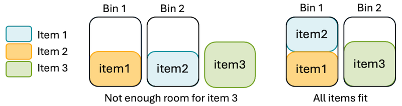
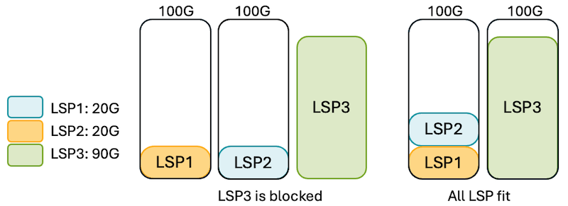
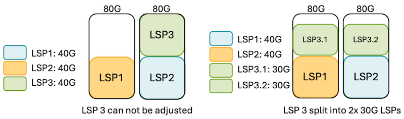
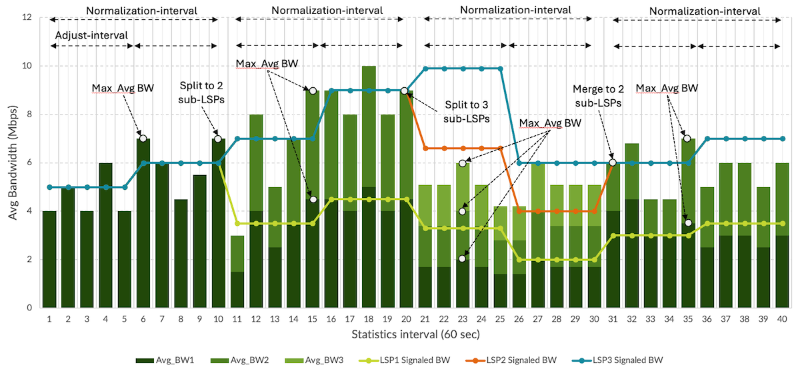
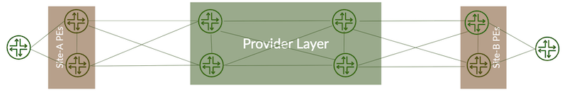

# Adaptive Resource Control with Container LSPs

**Kashif Nawaz - 07/21/2025**

Modern MPLS networks must support highly dynamic traffic patterns, especially in cloud and service provider environments. While RSVP-TE provides engineered path control, traditional single-LSP scaling is often insufficient. [Auto-bandwidth helps](https://juniper.github.io/techposts/adaptive-resource-control-in-te-networks/article), but as demand grows, deploying parallel LSPs across ECMP-eligible paths becomes essential. These parallel LSPs improve load distribution, enabling more scalable and resilient transport.

## Introduction

This paper explores several challenges in modern TE networks and provides Container LSPs anatomy and operations in depth. Container LSP is an abstract representation of a set of member auto-bandwidth LSPs, as a solution for improving resource management efficiency in TE networks. MPLS Auto-Bandwidth is a solution that allows LSPs (Label Switched Paths) to automatically adjust their reserved bandwidth based on traffic utilization, thus growing and shrinking as ingress load changes. While this mechanism ensures that LSPs can grow with changing traffic demands, it operates solely at the level of a single LSP. Thus, as the bandwidth demand for single LSPs continues to grow, various path placement challenges may be encountered which will be discussed in more detail below.

## Bin Packing Scenario

In modern networks, efficient bandwidth allocation is critical, especially in scenarios where bandwidth demand exceeds the capacity for single links or single paths. A common challenge arises when LSPs are signaled in a way that leads to blocking, even when total network capacity is sufficient. This issue is closely related to the bin-packing problem, a classic optimization challenge where items of varying sizes must be placed into a limited number of fixed-size bins without exceeding their capacities.



### Inefficiencies in bin-packing can lead to blocking

Let's apply the scenario depicted in figure 1 to an MPLS network.  Consider a scenario where two 20G LSPs and one 90G LSP must be placed across two 100G links.  If the two 20G LSPs are signaled first and each occupies a separate link, both links are left with 80G of unused capacity. The 90G LSP, although there is enough total bandwidth (200G), cannot be placed on either link due to insufficient contiguous space. This is a blocking problem caused by inefficient placement, placing small items in separate bins, and leaving not enough room for a larger item. Ideally, the two 20G LSPs should be placed on the same link, leaving the second link free to accommodate the 90G LSP. This approach mirrors the bin-packing example above where grouping the smaller items together free'd up space for larger ones.



### All or Nothing bandwidth adjustments

Consider another LSP blocking scenario where a new auto-bandwidth adjustment can't be accommodated by a single path, not unlike the 90G LSP in the example above.  With JunOS' current auto-bandwidth behavior, if a new auto-bandwidth triggered request cannot be accommodated in full, the LSP will not be adjusted. Instead, it continues to operate at the previously signaled bandwidth on its current path, until the next adjust-interval expires, and a bandwidth adjustment is retried.  This is the essence of the "All or Nothing" policy: LSP bandwidth changes are atomic, meaning either fully satisfied or entirely deferred.

In the figure below, a 40G LSP, LSP3, is initially signaled. At the end of its bandwidth adjustment interval, the LSP's BW is 60G. However, there are no paths with 60G of available BW. As a result, the LSP fails to resize despite sufficient aggregate capacity is available. This is where Container LSPs, or TE++, becomes valuable. It allows the LSP to be split into multiple member LSPs that can traverse different paths.



### Manually Establishing Multiple LSPs

Operators often provision multiple LSPs between ingress and egress routers thus distributing ingress load across the resulting ECMP (Equal-Cost Multi-Path) group of LSPs to address some of the challenges described above. While this can provide some relief in some scenarios, it comes with its own challenges:

- Each LSP consumes RSVP state and control plane resources, even when carrying small amounts of traffic. In large-scale networks, this leads to high control plane load and increased operational complexity.
- Bandwidth reserved for idle or underutilized LSPs remains locked, leading to inefficient use of network capacity. This static allocation prevents dynamic adaptation to real-time traffic demands.

## Anatomy of a Container LSP

To address such inefficiencies, Container LSPs adaptively manage the number and size of member LSPs based on real-time traffic demands, similar to how a bin-packing algorithm seeks to minimize the number of bins used while accommodating all items. This prevents bandwidth fragmentation, reduces blocking, and ensures optimal use of available resources.

- A Container LSP (TE++) is a logical construct composed of multiple dynamically created point-to-point RSVP-TE LSPs, known as "member" LSPs. These are automatically established between ingress and egress routers and governed by auto-bandwidth.
- By splitting a single LSP into multiple member LSPs, Container LSPs address the bin-packing problem. This allows new bandwidth demand to be distributed across several paths, increasing the likelihood of successful path setup.
- It also addresses the "All-or-Nothing" blocking problem. As explained in Figure 3, if a member LSP of the container fails to adjust, the ingress can immediately reevaluate the required number of member LSPs and create new members as needed.
- Instead of relying on pre-provisioned static LSPs, member LSPs are dynamically created or removed based on the aggregate traffic load of the container. This eliminates the need for numerous static LSPs, reducing control plane overhead and improving bandwidth efficiency.
- TE++ improves path diversity and increases the likelihood of satisfying both bandwidth and CSPF constraints. It also inherits the benefits of Equal-Cost Multipath (ECMP), such as better load balancing and the ability to absorb traffic surges. Dynamic adjustment ensures that the container LSP adapts to changing traffic conditions while maintaining efficient use of network resources.
- By combining dynamic provisioning, path diversity, and traffic-responsive scaling, Container LSPs offer a robust solution to the shortcomings of traditional RSVP-TE, particularly in large-scale, high-traffic environments.

### Key Operations

The ingress LER is solely responsible for managing the container and its member LSPs; transit and egress routers remain unaware of the Container LSP structure.  Each member LSP of a container is an auto-bandwidth LSP and is periodically  (re)optimized via any defined auto-bandwidth adjustment parameters.  Additional information on auto-bandwidth can be found in my previous blog.

The ingress router continuously monitors traffic and collects bandwidth samples from all member LSPs. These samples are used to compute the aggregate bandwidth of the container LSP, which can be calculated using different methods, such as average, maximum, or a percentile-based value (e.g., 90th percentile and it depends on the configured sampling mode.  Periodically, through a process called normalization, the system assesses the aggregate load across all member LSPs and adjusts the number of active member LSPs by splitting or merging them as needed.

Figure 4 illustrates a simple example of the splitting and merging member LSP growth process of a container LSP.



### Container Normalization and Member Splitting/Merging

Normalization is the core mechanism that ensures container LSPs dynamically adapt to changing traffic demands. It is a periodic process performed by the ingress router to evaluate whether the number of members of LSPs and their bandwidth allocations need to be adjusted based on real-time traffic conditions.

Periodically, the ingress router collects bandwidth samples and calculates the aggregate bandwidth of the container LSP. These samples are processed using a configured sampling mode, such as average, maximum, or percentile-based, which helps derive a representative bandwidth value. The normalization process may be triggered either by:

- **Expiry of normalization interval**: It can be triggered after expiry of regular intervals. At the end of each interval, the system evaluates various thresholds and parameters.
- **Event Driven**: It can also be triggered if an auto-bandwidth adjustment fails for a member LSP.

Once normalization is triggered, it can perform one of the following actions:

- **Splitting** occurs when the bandwidth allocated to a member LSP exceeds the configured splitting threshold. In this case, new member LSPs are created, and existing ones are re-signaled with updated bandwidth values to distribute the load evenly across all members.
- **Merging** is initiated when the bandwidth of a member LSP falls below the configured merging threshold. Underutilized LSPs are removed, and the remaining ones are re-signaled with updated bandwidth values to consolidate resources and reduce overhead.
- **Bandwidth adjustment** refers to the process of equally modifying the bandwidth across all member LSPs without performing any merge or split operations. This approach is used when the bandwidth needs to be fine-tuned but does not cross the thresholds that would trigger a split or merge. It ensures a balanced distribution of load while minimizing disruption.

## Key Considerations

### Container Normalization vs. Auto-Bandwidth Adjustments

Since container LSPs consist of auto-bandwidth member LSPs, it is important to maintain an optimal relationship between the normalization interval and the auto-bandwidth adjust-interval. A recommended best practice is to set the normalization interval to be at least twice the adjust interval of the member LSPs. This configuration allows enough time for meaningful traffic samples to accumulate and stabilize, which improves the accuracy of normalization decisions. In addition, the recommendation for MPLS optimizer-timer is described in [my previous post](https://juniper.github.io/techposts/adaptive-resource-control-in-te-networks/article).

### Splitting/Merging Calculation

The following attributes are calculated from operational state and statistics
collection and are leveraged when determining how many member LSPs to signal.

- **Sampled-aggregate-bandwidth**: Represents the measured bandwidth usage during a normalization interval, and it will be the baseline bandwidth during normalization process (split/ merge) and it will become **aggregate bandwidth** after normalization process
- **Aggregate-bandwidth**: The total currently signaled bandwidth of all active member LSPs within a specific container LSP. It represents the combined capacity provisioned across all child LSP.

The ingress router determines the required number of member LSPs by dividing the sampled-aggregate-bandwidth by the configured maximum-signaling-bandwidth. The result is then rounded up to the nearest whole number to ensure sufficient capacity. This value represents the number of LSPs that need to be signaled to accommodate the new bandwidth requirement.

### Example Calculation

- Sampled aggregate bandwidth = 19.6845 Gbps
- Maximum signaling bandwidth per LSP = 10 Gbps
- Resulting member LSPs = 19.6845 / 10 = 1.96845 -> Rounded up to 2
- Bandwidth per member LSP = 19.6845 / 2 = 9.84225 Gbps

This ensures that the total bandwidth is distributed evenly across the required number of LSPs, while staying within the signaling constraints.

### ECMP Relevance

Special consideration must be given to the combined number of maximum-member-lsps and bypass LSPs, as each contributes a next-hop entry to the RIB and FIB. This total must not exceed the maximum-ecmp limit configured under the chassis hierarchy. A deeper discussion on scaling considerations is beyond the scope of this section and may be covered in a separate blog.

```
chassis {
    maximum-ecmp $value;
}
```

### Sampling in TE++ (Container LSP)

If you recall our write-up for MPLS Auto-Bandwidth adjustment, traffic samples are collected at regular intervals i.e. statistical-interval (interval) with aim of finding MaxAvg BW during an adjust-interval. However, TE+ sampling works in a more detailed way as it is a foundational mechanism in TE++ that enables the ingress router to make informed decisions during normalization.

The ingress router records the current traffic rates across all member LSPs and stores them as aggregate samples. These samples are then used during normalization to determine whether the number of members LSPs or their bandwidth allocations need to be adjusted. To ensure accuracy and stability, TE++ allows historical samples to be retained and analyzed using statistical methods.

Operators can configure how the aggregate bandwidth is calculated using one of the following sampling modes:

- **Average**: Computes the mean of all collected samples after removing statistical outliers.
- **Max**: Selects the highest value from the filtered sample set.
- **Percentile**: Picks a specific percentile (e.g., 90th) from the sample distribution, offering a balance between responsiveness and stability.
- **Outlier Filtering**: To improve reliability, TE++ supports outlier filtering using a configurable cut-off threshold. This helps eliminate extreme traffic samples during bandwidth normalization, resulting in more stable and accurate estimations.
*For example, if the cut-off threshold is set to 10, the system will discard the lowest 10% and highest 10% of samples. The remaining 80% of samples are then used to compute a more reliable value, such as the average, maximum, or a specific percentile. Subsequently, it is used during normalization.*
- **Cold Start Behavior**: At initial setup, a container LSP starts with minimal members and bandwidth due to lack of traffic history. TE++ uses normalization to progressively adapt as traffic patterns emerge.

### Hitless MBB

In traffic-engineered MPLS networks, hitless Make-Before-Break (MBB) is a critical mechanism that enables seamless transitions from an existing LSP to a newly optimized one without disrupting live traffic. By establishing the new path before tearing down the old one, MBB aims to ensure uninterrupted service continuity. However, achieving a truly hitless transition requires precise control over when the old LSP is removed, especially in environments carrying latency-sensitive or mission-critical applications.

This is where Juniper's optimize-adaptive-teardown feature in TE++ adds significant operational value. It addresses the limitations of the traditional optimize-hold-dead-delay (OHDD) method, which relies on a fixed timer to delay the teardown of the old LSP after a better path is signaled. While OHDD provides a basic buffer, it lacks awareness of actual traffic migration. If service traffic has not fully transitioned by the time the delay expires, prematurely removing the old LSP can result in transient packet loss.

In contrast, optimize-adaptive-teardown introduces a feedback-driven mechanism that leverages the Routing Protocol Daemon (RPD) to monitor the migration of service traffic. The old LSP is only removed once all forwarding references and bindings have been released, ensuring that no traffic is left behind. This guarantees a truly hitless MBB, even in complex or high-throughput environments. Operators can fine-tune the behavior by configuring a post-migration delay (default: 10 seconds) to allow for stabilization, and a timeout (default: 600 seconds) to force teardown if migration does not complete within a reasonable window.

```
protocols { 
    mpls {
        optimize-adaptive-teardown {
            p2p;
            timeout 240;
            delay {
                10;
            }
        }
}
```

## Configuration

### Key Configuration Parameters

JunOS offers many fine-tuning parameters for container LSPs. This section covers some key parameters. Many of the remaining parameters are defined in the Glossary section for reference.

- **Auto-bandwidth template**: Each member LSP is instantiated based on a predefined template.  This template encapsulates all necessary parameters for individual member LSPs.
- **Splitting-Merging-Threshold**: Defines the threshold between the current signaled aggregate bandwidth and the sampled aggregate bandwidth required to trigger normalization (default = 10%). When traffic breaches this threshold, the splitting/merging process is run.
- **Splitting-bandwidth**: This is the threshold value for triggering a splitting operation. If the bandwidth utilization of any member LSP exceeds this value, at the end of the normalization interval more member LSPs will be created.  It is recommended to configure this as an absolute value per container, independent of percentage-based thresholds.
- **Merging-bandwidth**: This is the lower threshold for triggering a merging operation. If a member LSP's bandwidth usage falls below this value, at the end of the normalization interval member LSPs may be removed. Like splitting-bandwidth, this should be set as an absolute value per member.
- **Minimum-member-lsps**: This parameter defines the minimum number of members LSPs that must always be active within a container LSP (default = 1).
- **Maximum-member-lsps**: This sets the upper limit on the number of members LSPs that can be created within a container (default = 64).
- **Minimum-signaling-bandwidth**: This defines the smallest bandwidth reservation allowed for any member LSP during creation. A container LSP reserves at least minimum-member-lsps x minimum-signaling-bandwidth. If not explicitly configured, this value defaults to the merging-bandwidth.
- **Maximum-signaling-bandwidth**: This sets the maximum bandwidth that any member LSP can reserve. It serves as the upper bound for auto-bandwidth scaling. If not configured, it inherits the value from splitting-bandwidth.
- **Normalization Interval**: The Normalization interval specifies how often the container LSP normalizes it's member LSPs.

### Example configuration

Define the member LSP template:

```
protocols {
mpls {
    optimize-timer 3600;
    label-switched-path Container-LSP-template {
        template;
        adaptive;
        in-place-lsp-bandwidth-update;
        auto-bandwidth {
            adjust-interval 900;
            adjust-threshold 3;     
            adjust-threshold-activate-bandwidth 25m;
            maximum-bandwidth 100g;
            adjust-threshold-overflow-limit 3;
            adjust-threshold-underflow-limit 5;
```

Define the container LSP and reference the template (this example uses a configuration group):

```
groups {
 Container_LSP_Spec {
        protocols {
            mpls {
                container-label-switched-path <*-CONTAINER> {
                    label-switched-path-template {
                        Container-LSP-template;
                    }
                    splitting-merging {
                        maximum-member-lsps 32;
                        minimum-member-lsps 4;
                        splitting-bandwidth 10g;
                        merging-bandwidth 4g;
                        maximum-signaling-bandwidth 8g;
                        minimum-signaling-bandwidth 20k;
                        splitting-merging-threshold 25;
                        normalization {
                            normalize-interval 1800;
                            failover-normalization;
```

Apply the configuration group and define the egress router addresses:

```
protocols 
{
mpls {
    apply-groups  Container_LSP_Spec ;   
    container-label-switched-path SiteA-PE1-to-SiteB-PE1-CONTAINER {
    to 10.10.0.76;
```

The number of active members LSPs should match the configured minimum-member-lsps, and each member LSP is automatically named using the format <container-name>-<count>, such as SiteA-PE1-to-SiteB-PE1-CONTAINER-1.

```
show mpls container-lsp ingress  
Container LSP name                              State     Member LSP count
SiteA-PE1-to-SiteB-PE1-CONTAINERUp                4
To              From            State Rt P     ActivePath       LSPname
10.126.0.13     10.10.128.76    Up     0 *                      SiteA-PE1-to-SiteB-PE1-CONTAINER-1
10.126.0.13     10.10.128.76    Up     0 *                      SiteA-PE1-to-SiteB-PE1-CONTAINER-2
10.126.0.13     10.10.128.76    Up     0 *                      SiteA-PE1-to-SiteB-PE1-CONTAINER-3
10.126.0.13     10.10.128.76    Up     0 *                      SiteA-PE1-to-SiteB-PE1-CONTAINER-4

show mpls container-lsp terse      
Ingress LSP: 9 sessions
Container LSP name                              State     Member LSP count
SiteA-PE1-to-SiteB-PE1-CONTAINER.     Up                4
```

## Test Execution

### Test Bed Details



The configurations described in this write-up are validated using Juniper PTX10001-36MR (23.4R2-S4.11-EVO) and MX10003 (23.4R2-S4.11).  All the Control plane configurations will work on a Juniper ACX series router (which runs Junos EVO and are based on Broadcom DNX Chipset); however, ACX's PFE specific configuration is explained in [my previous blog post](https://juniper.github.io/techposts/adaptive-resource-control-in-te-networks/article).

### Test Summary

The LSP named SiteA-PE1-to-SiteB-PE-CONTAINER is configured with the following parameters. Please refer to the sections Key Configuration Parameters and Splitting/Merging Calculation sections to recall important parameters and their usage.

- Minimum-member-lsps is 1
- Maximum-member-lsps is 32
- Maximum signaling bandwidth is 10 Gbps
- Minimum signaling bandwidth is 20 Mbps
- Splitting bandwidth is 10 Gbps
- Merging bandwidth is 4 Gbps
- Normalization threshold (splitting-merging-threshold) is 10%

Individual member LSP, parameters (Auto-bandwidth) are also available under SiteA-PE1-to-SiteB-PE2-CONTAINER-1.

```
show mpls container-lsp name SiteA-PE1-to-SiteB-PE2-CONTAINER extensive    
Ingress LSP: 3 sessions
Container LSP name: SiteA-PE1-to-SiteB-PE2-CONTAINER, State: Up, Member count: 1
 Normalization 
  Min LSPs: 1, Max LSPs: 16
  Aggregate bandwidth: 20Mbps, Sampled Aggregate bandwidth: 0bps
  NormalizeTimer: 960 secs, NormalizeThreshold: 10%
  Max Signaling BW: 8Gbps, Min Signaling BW: 20Mbps, Splitting BW: 10Gbps, Merging BW: 4Gbps
  Mode: incremental-normalization, no-failover-normalization
  Sampling: Outlier cut-off 0, Max Aggregate
  Normalization in 144 second(s)
    4 Aug 24 06:13:59.535 Normalization complete: container (SiteA-PE1-to-SiteB-PE2-CONTAINER) with 1 members 
    3 Aug 24 06:13:58.357 Normalize: container (SiteA-PE1-to-SiteB-PE2-CONTAINER) into 1 members - each with bandwidth 20000000 bps
    2 Aug 24 06:13:58.357 Normalize: container (SiteA-PE1-to-SiteB-PE2-CONTAINER) create 1 LSPs, min bw 20000000bps, member count 0
    1 Aug 24 06:13:58.357 Normalize: normalization with aggregate bandwidth 0 bps

10.187.0.76
  From: 10.20.48.6, State: Up, ActiveRoute: 0, LSPname: SiteA-PE1-to-SiteB-PE2-CONTAINER-1, LSPid: 593
  ActivePath:  (primary)
  Node/Link protection desired
  LSPtype: Dynamic Configured, Penultimate hop popping
  LoadBalance: Least-fill
  Follow destination IGP metric
  Autobandwidth 
  MaxBW: 100Gbps
  AdjustTimer: 900 secs AdjustThreshold: 3% 
  Adjust Threshold Activate Bandwidth: 25Mbps
  Max AvgBW util: 0bps, Bandwidth Adjustment in 374 second(s).
  Overflow limit: 3, Overflow sample count: 0
  Underflow limit: 3, Underflow sample count: 0, Underflow Max AvgBW: 0bps
  ### Output omitted for brevity 
    Bandwidth: 20Mbps
  ### Output omitted for brevity 
```

In the next output, an **Auto-Bandwidth adjustment** was triggered for the member LSP, resulting in its bandwidth being increased to **9.9594 Gbps**. This updated value is now reflected as both the **Aggregate Bandwidth** and the **Sampled Aggregate Bandwidth** of the container LSP. This adjustment indicates that the system dynamically scaled the bandwidth allocation in response to observed traffic patterns, ensuring optimal utilization while staying within the configured thresholds and limits.

```
show mpls container-lsp name SiteA-PE1-to-SiteB-PE2-CONTAINER extensive    
Ingress LSP: 3 sessions
Container LSP name: SiteA-PE1-to-SiteB-PE2-CONTAINER, State: Up, Member count: 1
 Normalization 
  Min LSPs: 1, Max LSPs: 16
  Aggregate bandwidth: 9.9594Gbps, Sampled Aggregate bandwidth: 9.9594Gbps
  NormalizeTimer: 960 secs, NormalizeThreshold: 10%
  Max Signaling BW: 10Gbps, Min Signaling BW: 20Mbps, Splitting BW: 10Gbps, Merging BW: 4Gbps
  Mode: incremental-normalization, no-failover-normalization
  Sampling: Outlier cut-off 0, Max Aggregate
  Normalization in 4 second(s)
    4 Aug 24 06:13:59.535 Normalization complete: container (SiteA-PE1-to-SiteB-PE2-CONTAINER) with 1 members 
    3 Aug 24 06:13:58.357 Normalize: container (SiteA-PE1-to-SiteB-PE2-CONTAINER) into 1 members - each with bandwidth 20000000 bps
    2 Aug 24 06:13:58.357 Normalize: container (SiteA-PE1-to-SiteB-PE2-CONTAINER) create 1 LSPs, min bw 20000000bps, member count 0
    1 Aug 24 06:13:58.357 Normalize: normalization with aggregate bandwidth 0 bps

10.187.0.76
  From: 10.20.48.6, State: Up, ActiveRoute: 0, LSPname: SiteA-PE1-to-SiteB-PE2-CONTAINER-1, LSPid: 593
  ActivePath:  (primary)
  Node/Link protection desired
  LSPtype: Dynamic Configured, Penultimate hop popping
  LoadBalance: Least-fill
  Follow destination IGP metric
  Autobandwidth 
  MaxBW: 100Gbps
  AdjustTimer: 900 secs AdjustThreshold: 3% 
  Adjust Threshold Activate Bandwidth: 25Mbps
  Max AvgBW util: 9.9594Gbps, Bandwidth Adjustment in 899 second(s).
  Overflow limit: 3, Overflow sample count: 0
  Underflow limit: 3, Underflow sample count: 0, Underflow Max AvgBW: 0bps
  Encoding type: Packet, Switching type: Packet, GPID: IPv4
  LSP Self-ping Status : Enabled
 *Primary                    State: Up
    Priorities: 2 2
    Bandwidth: 9.9594Gbps
```

```
> show mpls container-lsp name SiteA-PE1-to-SiteB-PE2-CONTAINER extensive    
Ingress LSP: 3 sessions
Container LSP name: SiteA-PE1-to-SiteB-PE2-CONTAINER, State: Up, Member count: 1
 Normalization 
  Min LSPs: 1, Max LSPs: 16
  Aggregate bandwidth: 9.95894Gbps, Sampled Aggregate bandwidth: 19.6845Gbps
  NormalizeTimer: 960 secs, NormalizeThreshold: 10%
  Max Signaling BW: 10Gbps, Min Signaling BW: 20Mbps, Splitting BW: 10Gbps, Merging BW: 4Gbps
  Mode: incremental-normalization, no-failover-normalization
  Sampling: Outlier cut-off 0, Max Aggregate
  Normalization in 30 second(s)
From: 10.20.48.6, State: Up, ActiveRoute: 0, LSPname: SiteA-PE1-to-SiteB-PE2-CONTAINER-1, LSPid: 593
  ActivePath:  (primary)
  Node/Link protection desired
  LSPtype: Dynamic Configured, Penultimate hop popping
  LoadBalance: Least-fill
  Follow destination IGP metric
  Autobandwidth 
  MaxBW: 100Gbps
  AdjustTimer: 900 secs AdjustThreshold: 3% 
  Adjust Threshold Activate Bandwidth: 25Mbps
  Max AvgBW util: 9.95894Gbps, Bandwidth Adjustment in 877 second(s).
  Overflow limit: 3, Overflow sample count: 0
  Underflow limit: 3, Underflow sample count: 0, Underflow Max AvgBW: 0bps
  Encoding type: Packet, Switching type: Packet, GPID: IPv4
  LSP Self-ping Status : Enabled
 *Primary                    State: Up
    Priorities: 2 2
    Bandwidth: 9.95894Gbps
```

During the split operation, two member LSPs were created. A detailed explanation of how their number and bandwidth were determined is provided in the section titled "Splitting/Merging Calculation."

```
show mpls container-lsp name SiteA-PE1-to-SiteB-PE2-CONTAINER extensive    
Ingress LSP: 3 sessions
Container LSP name: SiteA-PE1-to-SiteB-PE2-CONTAINER, State: Up, Member count: 2
 Normalization 
  Min LSPs: 1, Max LSPs: 16
  Aggregate bandwidth: 19.6845Gbps, Sampled Aggregate bandwidth: 19.6845Gbps
  NormalizeTimer: 960 secs, NormalizeThreshold: 10%
  Max Signaling BW: 10Gbps, Min Signaling BW: 20Mbps, Splitting BW: 10Gbps, Merging BW: 4Gbps
  Mode: incremental-normalization, no-failover-normalization
  Sampling: Outlier cut-off 0, Max Aggregate
  Normalization in 898 second(s)
   11 Aug 24 06:40:53.933 Normalization complete: container (SiteA-PE1-to-SiteB-PE2-CONTAINER) with 2 members 
   10 Aug 24 06:40:53.137 Normalize: container (SiteA-PE1-to-SiteB-PE2-CONTAINER) into 2 members - each with bandwidth 9842228224 bps
    9 Aug 24 06:40:53.137 Normalize: normalization with aggregate bandwidth 19684456448 bps

10.187.0.76
  From: 10.20.48.6, State: Up, ActiveRoute: 0, LSPname: SiteA-PE1-to-SiteB-PE2-CONTAINER-1, LSPid: 593
  ActivePath:  (primary)
  Node/Link protection desired
  LSPtype: Dynamic Configured, Penultimate hop popping
  LoadBalance: Least-fill
  Follow destination IGP metric
  Autobandwidth 
  MaxBW: 100Gbps
  AdjustTimer: 900 secs AdjustThreshold: 3% 
  Adjust Threshold Activate Bandwidth: 25Mbps
  Max AvgBW util: 9.95894Gbps, Bandwidth Adjustment in 745 second(s).
  Overflow limit: 3, Overflow sample count: 0
  Underflow limit: 3, Underflow sample count: 0, Underflow Max AvgBW: 0bps
  Encoding type: Packet, Switching type: Packet, GPID: IPv4
  LSP Self-ping Status : Enabled
 *Primary                    State: Up
    Priorities: 2 2
    Bandwidth: 9.84223Gbps
    OptimizeTimer: 60
    SmartOptimizeTimer: 180
    Flap Count: 0
    MBB Count: 1
    In-place Update Count: 5 (bandwidth), 0 (hold-priority)
    Reoptimization in 13 second(s).     
    Computed ERO (S [L] denotes strict [loose] hops): (CSPF metric: 2110)
 10.20.2.238 S 10.20.3.135 S 10.174.255.99 S 
    Received RRO (ProtectionFlag 1=Available 2=InUse 4=B/W 8=Node 10=SoftPreempt 20=Node-ID):
          10.20.48.57(flag=0x21) 10.20.2.238(flag=1 Label=152154) 10.174.254.5(flag=0x20) 10.20.3.135(Label=1404) 10.187.0.76(flag=0x20) 10.174.255.99(Label=3)
   59 Aug 24 06:41:10.682 CSPF: computation result ignored, new path no benefit
   58 Aug 24 06:40:54.473 Link-protection Up
   57 Aug 24 06:40:53.473 Link-protection Down
   56 Aug 24 06:40:53.166 Autobw adjustment succeeded due to normalization: BW changes from 9958943744 bps to 9842228224 bps
   55 Aug 24 06:40:53.166 In-place LSP Update successful
   54 Aug 24 06:40:53.166 In-place Update Up
   53 Aug 24 06:40:53.152 Originate In-place LSP Update call
   52 Aug 24 06:40:53.152 CSPF: ERO retrace was successful  10.20.2.238 10.20.3.135 10.174.255.99
   51 Aug 24 06:40:13.077 CSPF: computation result ignored, new path no benefit
   50 Aug 24 06:40:00.839 Automatic Autobw adjustment succeeded: BW changes from 19030312960 bps to 9958943744 bps
   49 Aug 24 06:40:00.839 In-place LSP Update successful
   48 Aug 24 06:40:00.839 In-place Update Up
   47 Aug 24 06:40:00.825 Originate In-place LSP Update call
   46 Aug 24 06:40:00.825 CSPF: ERO retrace was successful  10.20.2.238 10.20.3.135 10.174.255.99
   45 Aug 24 06:39:14.125 CSPF: computation result ignored, new path no benefit[3 times, first Aug 24 06:37:15.799]
   44 Aug 24 06:37:00.830 Automatic Autobw adjustment succeeded: BW changes from 19684456448 bps to 19030312960 bps
   43 Aug 24 06:37:00.830 In-place LSP Update successful
   42 Aug 24 06:37:00.830 In-place Update Up
   41 Aug 24 06:37:00.817 Originate In-place LSP Update call
   40 Aug 24 06:37:00.817 CSPF: ERO retrace was successful  10.20.2.238 10.20.3.135 10.174.255.99
   39 Aug 24 06:36:17.878 CSPF: computation result ignored, new path no benefit[8 times, first Aug 24 06:29:30.323]
   38 Aug 24 06:29:00.807 Automatic Autobw adjustment succeeded: BW changes from 9959400448 bps to 19684456448 bps
   37 Aug 24 06:29:00.807 In-place LSP Update successful
   36 Aug 24 06:29:00.807 In-place Update Up
   35 Aug 24 06:29:00.794 Originate In-place LSP Update call
   34 Aug 24 06:29:00.794 CSPF: ERO retrace was successful  10.20.2.238 10.20.3.135 10.174.255.99
   33 Aug 24 06:28:33.115 CSPF: computation result ignored, new path no benefit[3 times, first Aug 24 06:27:07.348]
   32 Aug 24 06:27:07.348 Originate make-before-break call: Add skipped CSPF run
   31 Aug 24 06:27:07.348 Make-before-break: Cleaned up old instance: Hold dead expiry
   30 Aug 24 06:26:37.332 Pending old path instance deletion
   29 Aug 24 06:25:40.473 Link-protection Up
   28 Aug 24 06:25:39.103 Make-before-break: Switched to new instance
   27 Aug 24 06:25:39.103 Link-protection Down
   26 Aug 24 06:25:39.101 Self-ping ended successfully
   25 Aug 24 06:25:38.625 Record Route:  10.20.48.57(flag=0x21) 10.20.2.238(flag=1 Label=152154) 10.174.254.5(flag=0x20) 10.20.3.135(Label=1404) 10.187.0.76(flag=0x20) 10.174.255.99(Label=3)
   24 Aug 24 06:25:38.426 Up
   23 Aug 24 06:25:38.426 Self-ping started
   22 Aug 24 06:25:38.426 Self-ping enqueued
   21 Aug 24 06:25:38.426 Record Route:  10.20.48.57(flag=0x20) 10.20.2.238(Label=152154) 10.174.254.5(flag=0x20) 10.20.3.135(Label=1404) 10.187.0.76(flag=0x20) 10.174.255.99(Label=3)
   20 Aug 24 06:25:38.405 LSP-ID: 2 created
   19 Aug 24 06:25:38.405 Originate make-before-break call
   18 Aug 24 06:25:38.405 CSPF: computation result accepted  10.20.2.238 10.20.3.135 10.174.255.99
   17 Aug 24 06:25:00.853 Automatic Autobw adjustment succeeded: BW changes from 20000000 bps to 9959400448 bps
   16 Aug 24 06:25:00.853 In-place LSP Update successful
   15 Aug 24 06:25:00.853 In-place Update Up
   14 Aug 24 06:25:00.834 Originate In-place LSP Update call
   13 Aug 24 06:25:00.834 CSPF: ERO retrace was successful  10.20.2.238 10.20.3.133 10.174.255.99
   12 Aug 24 06:24:40.536 CSPF: computation result ignored, new path no benefit[11 times, first Aug 24 06:14:55.618]
   11 Aug 24 06:14:00.473 Link-protection Up
   10 Aug 24 06:13:59.535 Selected as active path
  Created: Sat Aug 24 06:13:58 2024

10.187.0.76
  From: 10.20.48.6, State: Up, ActiveRoute: 0, LSPname: SiteA-PE1-to-SiteB-PE2-CONTAINER-2, LSPid: 594
  ActivePath:  (primary)
  Node/Link protection desired
  LSPtype: Dynamic Configured, Penultimate hop popping
  LoadBalance: Least-fill
  Follow destination IGP metric
  Autobandwidth 
  MaxBW: 100Gbps
  AdjustTimer: 900 secs AdjustThreshold: 3% 
  Adjust Threshold Activate Bandwidth: 25Mbps
  Max AvgBW util: 0bps, Bandwidth Adjustment in 743 second(s).
  Overflow limit: 3, Overflow sample count: 0
  Underflow limit: 3, Underflow sample count: 0, Underflow Max AvgBW: 0bps
  Encoding type: Packet, Switching type: Packet, GPID: IPv4
  LSP Self-ping Status : Enabled
 *Primary                    State: Up
    Priorities: 2 2
    Bandwidth: 9.84223Gbps
    OptimizeTimer: 60
    SmartOptimizeTimer: 180
    Flap Count: 0
    MBB Count: 0
    In-place Update Count: 0 (bandwidth), 0 (hold-priority)
    Reoptimization in 55 second(s).
    Computed ERO (S [L] denotes strict [loose] hops): (CSPF metric: 2110)
 10.20.49.113 S 10.20.3.135 S 10.174.255.99 S 
    Received RRO (ProtectionFlag 1=Available 2=InUse 4=B/W 8=Node 10=SoftPreempt 20=Node-ID):
          10.20.48.57(flag=0x21) 10.20.49.113(flag=1 Label=152184) 10.174.254.5(flag=0x20) 10.20.3.135(Label=1405) 10.187.0.76(flag=0x20) 10.174.255.99(Label=3)
   12 Aug 24 06:41:51.851 CSPF: computation result ignored, new path no benefit
   11 Aug 24 06:40:55.473 Link-protection Up
   10 Aug 24 06:40:53.933 Selected as active path
    9 Aug 24 06:40:53.932 Self-ping ended successfully
    8 Aug 24 06:40:53.625 Record Route:  10.20.48.57(flag=0x21) 10.20.49.113(flag=1 Label=152184) 10.174.254.5(flag=0x20) 10.20.3.135(Label=1405) 10.187.0.76(flag=0x20) 10.174.255.99(Label=3)
    7 Aug 24 06:40:53.212 Up
```

## Conclusion

Container LSPs introduce several key enhancements to traditional RSVP-TE for efficiently managing available resources. By dynamically creating and managing member LSPs based on real-time traffic demands, it significantly improves control plane efficiency, optimizes bandwidth allocation across multiple paths, and streamlines network operations. These enhancements make Container LSPs well-suited for modern, large-scale IP/MPLS networks that require high scalability and operational agility.

## Acknowledgments

Special thanks to **Colby Barth** for the insightful review and for refining key concepts with the support of visual illustrations that helped shape this document. Gratitude also goes to **Hafiz Balal Ahmed** for sharing valuable lab test results that contributed to the technical accuracy and depth of the content.

## Glossary

- RSVP-TE (Resource Reservation Protocol - Traffic Engineering): A signaling protocol used in MPLS networks to reserve bandwidth and establish explicit LSPs with strict routing and QoS guarantees.
- LSP (Label Switched Path): A unidirectional, label-based forwarding path in an MPLS network, established using protocols like RSVP-TE. It enables explicit routing and supports traffic engineering policies.
- Container LSP: A logical abstraction that aggregates multiple member LSPs to collectively meet a desired bandwidth requirement. It enables dynamic scaling, improves bandwidth utilization, and distributes traffic across multiple paths to overcome RSVP-TE limitations.
- Member LSP: An individual LSP that is part of a Container LSP. These LSPs are dynamically created, resized, or deleted in response to real-time traffic demand and network constraints.
- Ingress LER (Label Edge Router): The entry point of the MPLS domain, responsible for classifying traffic, applying labels, and initiating LSP signaling.
- Transit LSR (Label Switch Router): A router within the MPLS domain that forwards packets based on labels without inspecting IP headers or modifying label stacks.
- Egress LER: The exit point of the MPLS domain where the label is removed and the original packet is forwarded based on IP routing. It completes the LSP path.
- Headend: Synonym for Ingress LER. Often used in the context of managing and controlling Container or member LSPs, including triggering normalization and auto-bandwidth adjustments.
- All-or-Nothing Problem: A constraint in RSVP-TE where an LSP can only be established if a single end-to-end path has enough contiguous bandwidth to meet the demand, even if aggregate bandwidth across multiple paths is sufficient.
- Bin-Packing Problem: A fragmentation challenge where available bandwidth is spread across multiple links, making it difficult to establish large LSPs. Container LSPs mitigate this by splitting demand across member LSPs.
- Normalization: A control mechanism that evaluates the current Container LSP state and triggers split or merge actions to align provisioned capacity with traffic demands. It helps rebalance traffic across paths.
- Normalization Interval: The time period (in seconds) after which normalization is triggered. It must be greater than or equal to the auto-bandwidth adjust interval.
- Auto-Bandwidth: A feature that automatically adjusts the reserved bandwidth of an LSP or Container LSP based on observed usage, ensuring optimal provisioning without manual intervention.
- Max Signaling Bandwidth: The maximum bandwidth that can be signaled for a single member LSP. If traffic exceeds this threshold, multiple member LSPs are created.
- Minimum Signaling Bandwidth: The minimum bandwidth that can be signaled for a member LSP.
- Sampled Aggregate Bandwidth: The total bandwidth observed over a sampling interval for a Container LSP. It is used as input for resizing or triggering normalization actions.
- Aggregate Bandwidth: The total currently signaled bandwidth of all active member LSPs within a specific Container LSP. It represents the combined capacity provisioned across all child LSP
- Split Operation: The process of dividing a single LSP into multiple member LSPs when the demand exceeds the capacity of a single path, allowing traffic to be distributed more efficiently.
- Merge Operation: The reverse split, where multiple underutilized member LSPs are consolidated into fewer LSPs to reduce control plane load and improve path efficiency.
- Failover Normalization: A resiliency mechanism where normalization is triggered when a member LSP fails or cannot scale, ensuring the Container LSP continues to meet bandwidth demands.
- Normalization Retry Duration: The time the ingress router waits before retrying normalization after a failed attempt. It should not be less than the lsp-retry-timer (default: 30 seconds).
- Normalization Retry Limits: The maximum number of normalization attempts the ingress router will make until a sufficient number of member LSPs are successfully established.
- Adaptive Update Threshold: A mechanism that controls when IGP updates are triggered based on dynamic bandwidth changes, reducing unnecessary signaling in large-scale networks.
- Maximum Member LSPs: The upper limit on the number of member LSPs that can be created during a split operation.
- Minimum Member LSPs: The minimum number of member LSPs that must remain active at all times.
- Splitting Bandwidth: The bandwidth utilization threshold that triggers a split operation.
- Merging Bandwidth: The bandwidth utilization threshold below which a merge operation is triggered.
- Sampling--Use Percentile: Instructs the ingress router to use a specific percentile (e.g., 90th) of bandwidth samples for normalization. This is mutually exclusive with average-based sampling.
- Sampling--Use Average Aggregate: Instructs the ingress router to use the average of aggregate bandwidth samples for normalization.
- Sampling--Cut-Off Threshold: Specifies the percentage of extreme high and low samples to discard when calculating aggregate bandwidth, improving accuracy and stability

## Useful links

- [https://www.juniper.net/assets/es/es/local/pdf/whitepapers/2000587-en.pdf](https://www.juniper.net/assets/es/es/local/pdf/whitepapers/2000587-en.pdf)
- [https://www.juniper.net/documentation/us/en/software/junos/mpls/topics/topic-map/container-lsp-configuration.html ](https://www.juniper.net/documentation/us/en/software/junos/mpls/topics/topic-map/container-lsp-configuration.html)
- [https://juniper.github.io/techposts/adaptive-resource-control-in-te-networks/article](https://juniper.github.io/techposts/adaptive-resource-control-in-te-networks/article)
