# Adding Device Profiles Using the Apstra UI

**Andy Ford - 08/11/2023**

The capabilities of a specific switch hardware model are defined in the Device Profile and linked to the logical representation of the switch. Linking these together allows Apstra to build out the topology efficiently, provide efficient day-2 changes, and accurately build the configuration for a given switch to be used in your topology.

## Introduction

The Apstra system utilizes defined building blocks so that designing, building, and expanding a production network as part of Day-2, is an efficient and accurate process. The building blocks include the following:

- Entities used to define a switch within your fabric: superspine, spine, leaf, access.
    - Logical Device (LD)
    - Interface Map (IM)
    - Device Profile (DP)
- Rack
    - One or more switches
    - ESI (Juniper) or MC-LAG (Cisco, Arista, SONiC)
- Template
    - 3-stage Clos
    - 5-stage Clos
    - Collapsed fabric (Juniper only)
- Blueprint: A representation of your production network with variables (ASNs / IPs / etc.) assigned

## LP <--> IM <--> DP

An Apstra switch comprises three elements so that multiple hardware models in production can satisfy the logical representation of the switch in the Apstra Blueprint. The capabilities of a specific switch hardware model are defined in the Device Profile and linked to the logical representation of the switch, as shown below. Linking these together allows Apstra to build out the topology efficiently, provide efficient day-2 changes, and accurately build the configuration for a given switch to be used in your topology.

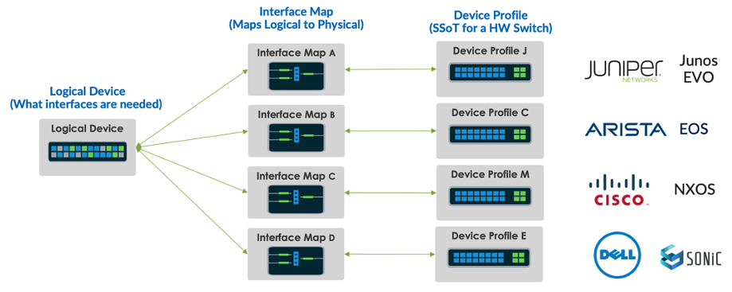

### How to Define a Switch within Apstra

You assign a DP to a switch in your Blueprint when you want to derive a config for that switch. A good example of when you wouldn't need to assign a DP to a switch is when it's an unmanaged access switch, i.e., an access switch for which Apstra will not create a validated config. As of Apstra v4.1.2, the only managed access switches are those from Juniper.

Another interesting situation arises when we add a Generic System to our Blueprint, such as a server. Traditionally, you would only assign an LD to describe the number and speed of the interfaces for that server, as it's also another unmanaged system in Apstra.
There is, however, a situation where you may want to add a server to a BP and describe the naming convention of the interfaces on that server in the BP. You can assign a DP to that server, as shown below.

In this example, an LD <--> IM <--> DP mapping was created, pointing to the DP named Generic_Server_1RU_2x10G_Centos. Assigning this DP to the Generic System (GS) in our Blueprint results in the GS interfaces being named accordingly.

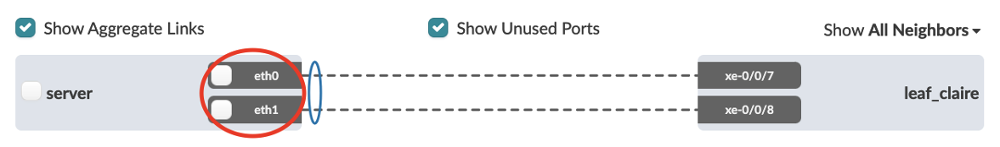

Here we can see that by assigning a DP to the Server, or Generic System (in Apstra-speak), we can label the ports to something meaningful, such as eth0 or eth1.

In this case, rename the ports in the DP for this server to something useful for your organization. A practical example of this is when one organization asks to modify the naming convention to upper & lower, so they could easily direct the DC cabling team where to plug in the cable.

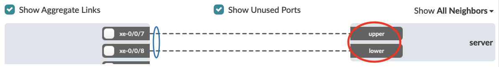

You can edit the DP directly in the UI for this use case, as shown below.

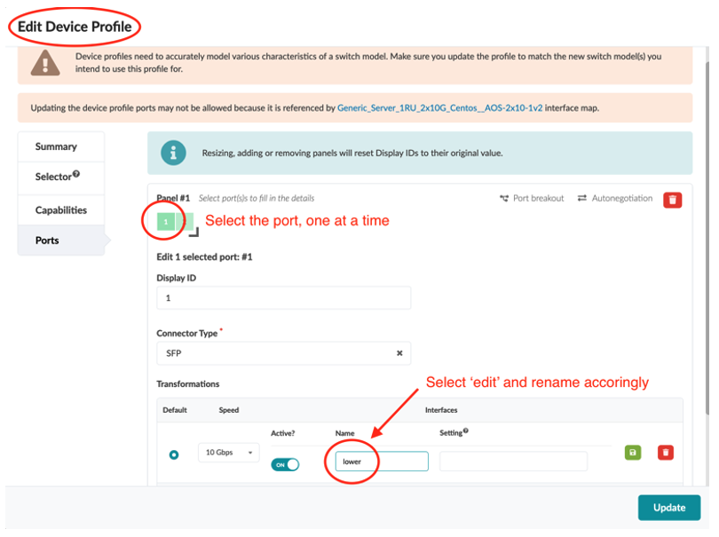

### Logical Devices (LD)

A representation of your intended port speed, how many are needed for a switch in your design, and where they will be connected. This will primarily be based on the required ports in a rack, i.e., the number of servers, the number of peer links for MC-LAG, and the number of leaf and spine ports. Your stated requirements in the LD will dictate which Device Profile you can ultimately link to in your design. If you specify 32 ports of 100G in the LD, Apstra will only give you the option to choose a Device Profile that can satisfy this port speed and count.

The following options of where individual ports can be 'Connected To' are:

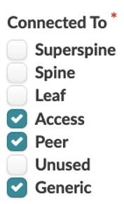

**Important points to note for Apstra v4.1.2 and above**

> **Note 1:** When you select a port or group of ports (as shown below in 'Edit Logical Device' you are presented with this 'Connected To' list of options. To enforce a given architecture, you can be very prescriptive here. For example, you may want your DC always to use the same peer ports or the same leaf ó spine ports.*

*Conversely, you can select all profiles for all ports to have a more relaxed approach to how you want the DC to be cabled. The latter approach provides more flexibility for changing your design on Day-2.*

> **Note 2:** The port numbering, as shown below, bears no relevance to the port number on the physical switch; it's purely a representation of the logical port number. *

> **Note 3:** The speed to all Generic System ports can be changed as a day-2 operation. *

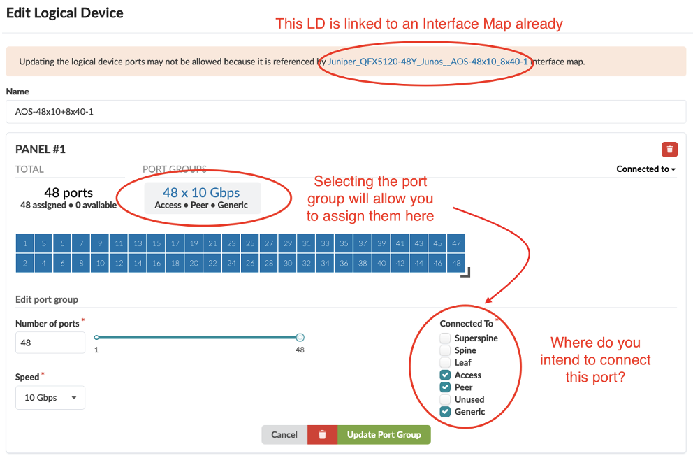

Below is an example of a Logical Device that represents a switch with two port groups (or panels) and roles assigned to those port groups.

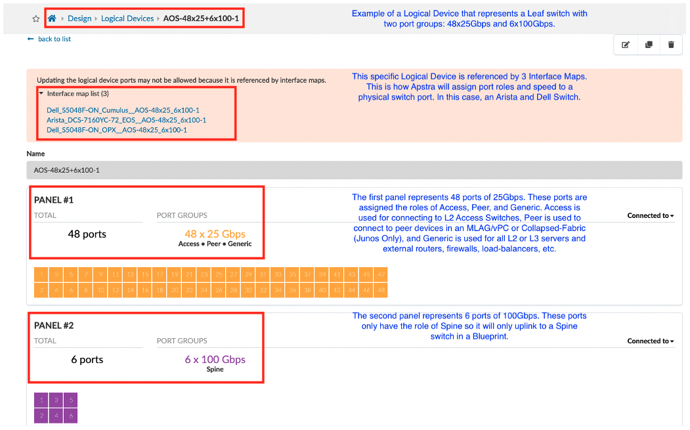

### Interface Map (IM)

Referring to the above diagram, 'How to define a switch within Apstra, 'the Interface Map (IM) is the link between your logical switch representation (LD) and the physical Device Profile (DP) representation.

The IM represents your intent on which physical ports will be utilized, as described in the Logical Device. Below is an example of an Interface Map for the Logical Device shown in the picture above. This is one of the Interface Maps referencing the Logical Device above (AOS-48x25_6x100-1) and the Device Profile of a physical device (Dell S5048F-ON).

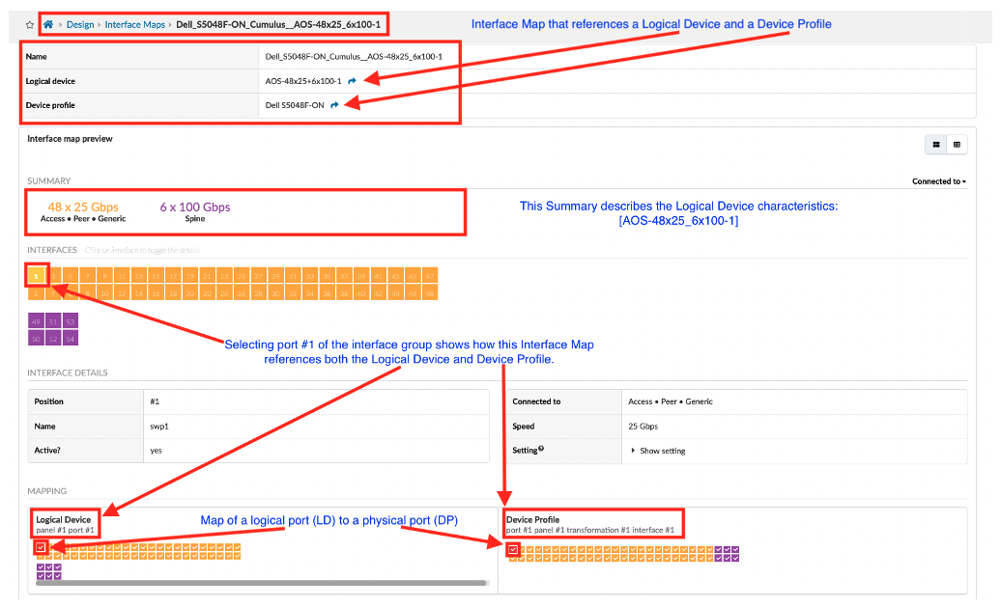

### Device Profile (DP)

A DP is a static representation of the capability of the vendor-specific switch:

- Vendor & model name
- NOS family
- CPU & ASIC type
- RAM
- ECMP limit
- Interface capacity number of ports and speed of ports
- Interface capabilities - which ports can be broken out, i.e., QSFP -> 4*SFP
- Number of ASIC SerDes (e.g. 64 or 128)

The Device Profile example below represents the DELL S5048F-ON referenced by the Interface Map above. The purpose of this document is to show how to create a Device Profile like the one below:

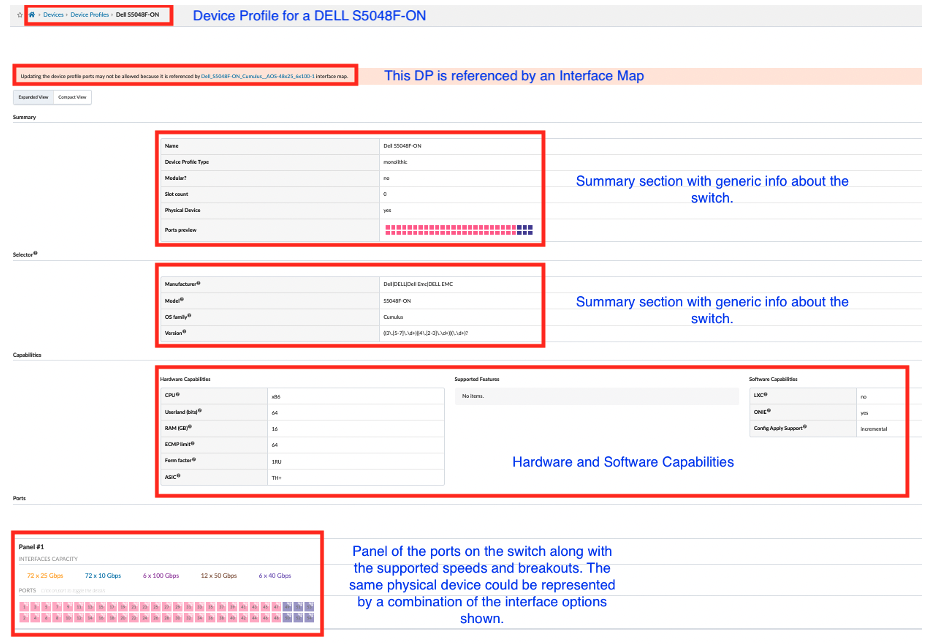

## How to Add a Device Profile (Finally!)

***Note:** Although we provide an interface via the UI to create a Device Profile in the UI, Apstra discourages user-defined DPs. It is preferable to have Apstra engineering drive the development of a DP to ensure accuracy.
**DP accuracy = Switch config accuracy*

### Adding a New Device Profile Using the Apstra UI

Before creating a new Device Profile, you can view what's available in Apstra. From the Web interface, navigate to **Devices / Device Profiles (1)** to see the list of **Device Profiles (2)**. Apstra ships with many predefined profiles. To sort the list, click the header of the category you'd like to sort. Click the header again to reverse the sort order.

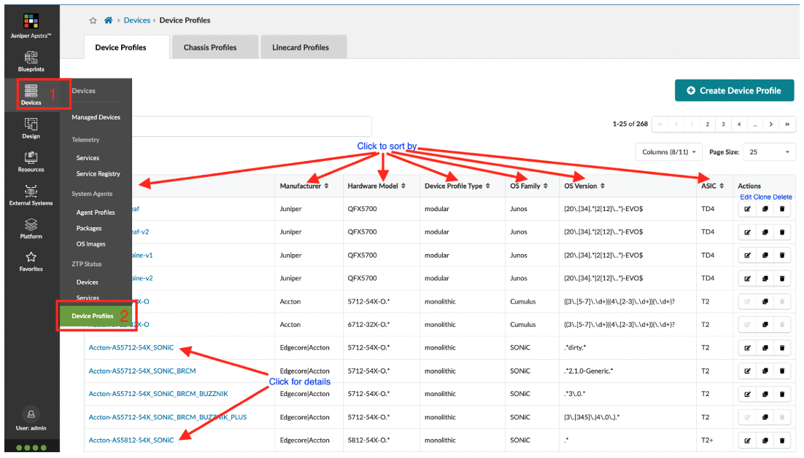

> **Note 1:** When you create Interface Maps, you'll assign Device Profiles (and Logical Devices) to them. You must ensure that the required Device Profiles exist for all physical devices you'll be using. *

> **Note 2:** Device Profiles contain extensive hardware model details. Apstra doesn't necessarily use all the information in a Device Profile for modeling. However, that may change in future Apstra releases.*

### When to Add a New Device Profile?

Although you could create a new DP, there are only two use cases for adding a new Device Profile:

1. When Apstra support has provided a validated DP for a new switch model you would like to use in your design. In this instance, you can easily navigate to Devices / Device Profiles and click on the [+ Create Device Profile] button and then click on the  following button to import the JSON payload.

2. When you are constructing a modular chassis through the UI, where the DP for both the chassis and available line cards are already created. In this case, you will create a chassis-based DP with the line cards you place in each slot.

### Method for Creating a Modular Chassis-Based Device Profile (DP)

1. Click the [+ Create Device Profile] button and select 'Modular' from the 'Type' dropdown list.

2. Give it a name. The example we will build is based on a QFX10008 with 4x36Q line cards and 1x30C line cards. So the name could be (e.g.) **Juniper_QFX10008-4x36Q+1x30C**.

3. Select the QFX10008 chassis in the Chassis profile dropdown, as shown below.

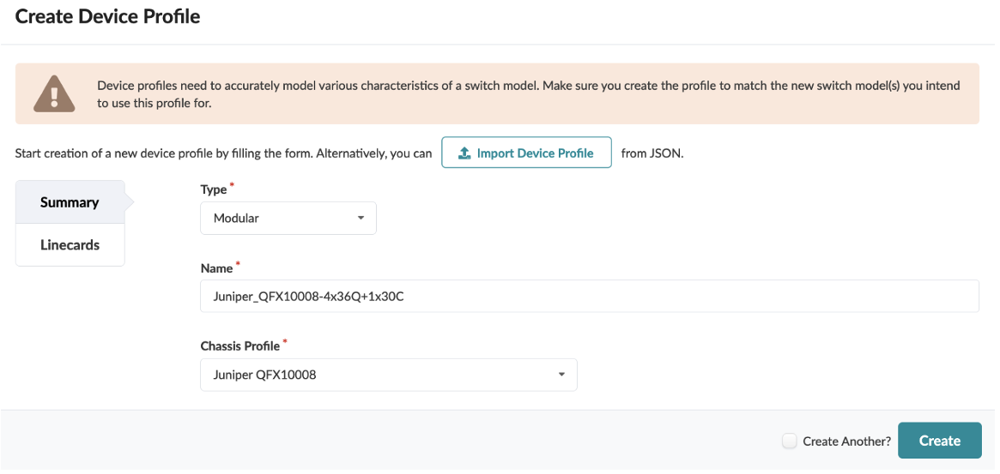

4. Switch to the Linecards tab on the left of the window to add the required line cards. In our case

- 4x 36
- 1x 30C

5. Click on the Add Linecard link

6. Select the slot and the line card you would like in that slot

7. Click save and continue with the next slot as shown below

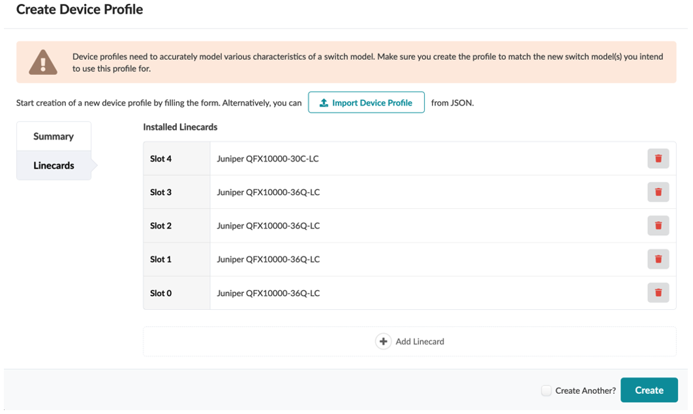

8. When complete, hit the [Create] button. You will see your named DP in the list.

9. Click on the Juniper_QFX10008-4x36Q+1x30C link, and you will see the modular chassis DP you have created.

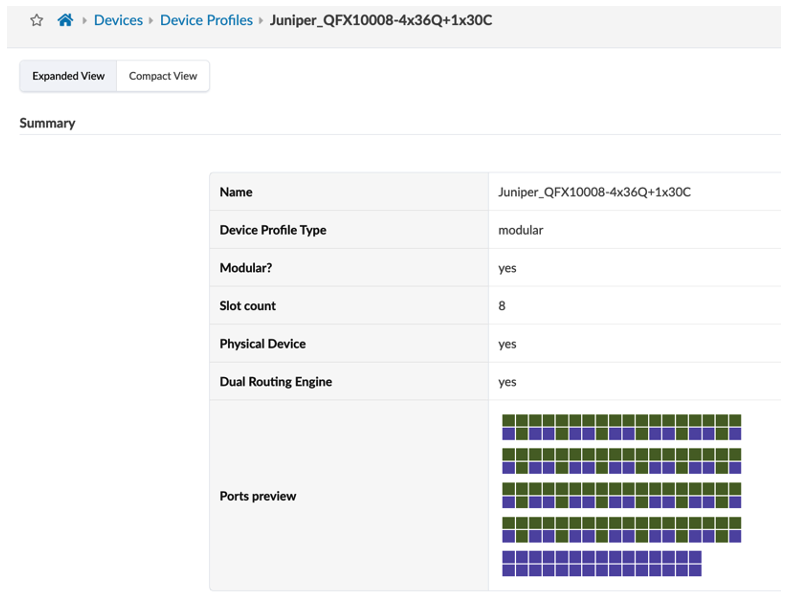

This DP is now ready to be linked to a Logical Device.

## Summary

Although Apstra provides an extensive library of Device Profiles, it is occasionally necessary to create your own DP or to customize a DP from the Apstra DP library. This paper shows the workflow for adding a DP, from creation to blueprint.

## Useful links

- Apstra User Guide: [https://www.juniper.net/documentation/us/en/software/apstra4.1/apstra-user-guide/index.html](https://www.juniper.net/documentation/us/en/software/apstra4.1/apstra-user-guide/index.html)

## Glossary

- ASN: Autonomous System Number
- BP: Blueprint
- DP: Device Profile
- ESI: Ethernet Segment Identifier
- GS: Generic System
- IM: Interface Map
- JSON: JavaScript Object Notation
- IP: Internet Protocol
- LD: Logical Device
- MC-LAG: MultiChassis Link Aggregation Group
