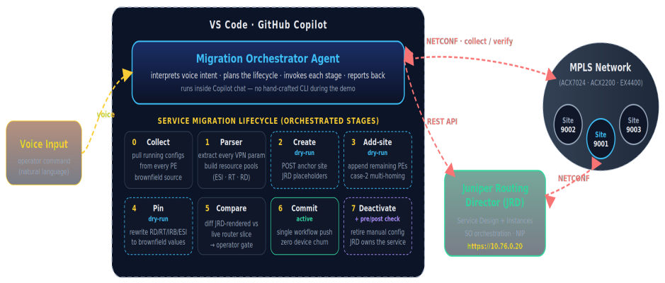
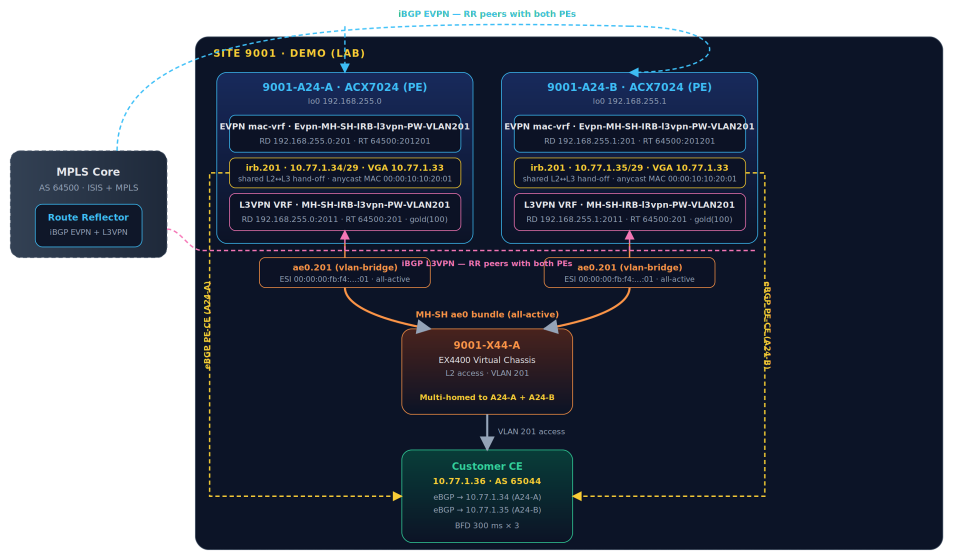

# AI-Driven Brownfield Migration to Juniper Routing Director

**Weiguo Lu - 08/05/20226**

## Introduction --- The Scale Problem

Network service providers don't build their networks one router at a time --- they scale them. The customer we worked with during this Professional Services engagement had **hundreds of PE routers** and, on top of them, **thousands of VPN service instances**. Every single one of those services had been hand-crafted directly on the Junos CLI. They worked. Traffic flowed. Customers were happy. But there was a catch: all of it lived entirely outside any controller.

No single source of truth. No lifecycle automation. No closed-loop assurance. Every change was a keyboard operation, every audit was a diff exercise, and every new service was a fresh opportunity for a typo to cause an outage. For a network of this size, that is not a sustainable operating model.

The answer was **Juniper Routing Director (JRD)**--- a WAN automation solution that models VPN services, manages their full lifecycle, and pushes intent-based configuration to ACX routers via NETCONF. But JRD was designed for greenfield. Bringing an existing, hand-built network under its control requires every service to be onboarded: resources entered, parameters matched, configuration verified, and a cutover executed without disturbing running traffic. Do that once, manually, through the GUI, for a couple of services --- maybe. Do it for thousands --- not a chance.

Our solution is a fully automated, Production-ready, AI-orchestrated migration pipeline that turns what would have been an impossible manual marathon into a repeatable, operator-approved workflow driven by nothing more than a voice command or a line of chat.

## The Challenge: Brownfield at Scale

Before diving into the solution, lets review the challenges every human network operator facing:

**Volume**: Thousands of services, each spanning multiple PE routers, each with unique resource values (RD, RT, ESI, IRB, BGP neighbors). No GUI workflow scales to this.

**Brownfield VPN service Importing**:  Despite that Routing Director (Network Optimization, batch adoption, NIP import and device discovery, ORE) already work well for brownfield, there is no automatic VPN service Importing feature.

**Resource collision risk**: JRD allocates resources (RD, RT, ESI) from its own pools when you create a service. If those auto-allocated values differ from what is live on the router, the cutover pushes a conflicting config and causes a BGP or BFD flap.

**Verification burden**: A human operator doing this manually would need to compare the JRD-generated config against the live router config field by field --- for every service, every PE, every time. One missed value = one outage.

**Ordering dependency**: Services are not independent. EVPN mac-vrf and L3VPN VRF are stitched together through a shared IRB interface. EVPN must be migrated before L3VPN, and the order cannot be reversed without risk.

**Rollback complexity**: If anything goes wrong mid-migration, you need a safe path back. With manual GUI operations, that path is not defined or scripted --- it is improvised under pressure.

**The bottom line**: purely manual GUI migration doesn't scale. The sheer effort --- thousands of GUI clicks, field-by-field verification, service-by-service execution ---Routing Director's Service Orchestration Engine has been optimized for intent-based networking where the intent is defined upfront at the time of service creation. As of today, having it take over control of a brownfield service requires the service to be retro-fitted into the service model manually.

## The Solution: Copilot-Agent Migration Pipeline

The question we asked was simple: can we make this faster, repeatable, and safe without a clicking marathon and without dropping a single packet? The answer is yes --- with a Copilot-agent-based migration pipeline that orchestrates the entire workflow from a single natural-language command.

### What the Pipeline Does

At its core, the pipeline is a **VS Code GitHub Copilot agent** --- the JRD-Migration-Orchestrator --- that interprets operator intent, plans the migration lifecycle, invokes each stage in sequence, and reports back. The operator drives it through voice or chat. There is no manual CLI, no GUI navigation, and no field-by-field data entry.

**Natural language driven**: Tell the agent what you want to migrate. It does the rest --- parsing, resource extraction, service order construction, pinning, comparison, and commit.

**Human-in-the-loop safety gates**: Every critical decision point --- create, pin, compare, commit, deactivate --- requires explicit operator approval. Nothing touches the network without a "go."

**Auto-discovery of live config**: The pipeline logs into the routers via NETCONF/SSH, pulls the running configuration, and parses every VPN parameter automatically. The brownfield config becomes the source of truth --- zero manual transcription.

**Exact resource pinning**: JRD's auto-allocated placeholders (RD, RT, ESI, IRB unit) are overwritten with the actual brownfield values before any config is pushed. There is no resource mismatch at cutover.

**Automated pre/post comparison**: A dedicated comparator script diffs the JRD-rendered config (in Junos set format) against the live router config slice. The operator sees a clean, structured diff before approving commit.

**Make-before-break, hitless cutover**: JRD pushes the service config under a Junos apply-group. The live manual config remains active until explicitly deactivated. BGP sessions, BFD timers, and MAC/ARP tables are verified at each step.

**Reusable and composable**: The pipeline runs interactively under Copilot, can be driven manually by calling the Python scripts directly, or can be exposed as an MCP server. Any JRD VPN service type, any customer, any site.

**Safe rollback path**: Because the brownfield config is only deactivated (not deleted), rollback is a single activate + deactivate of the JRD group. The sequence reverses: L3VPN first, then EVPN.

## Migration Framework: 8-Stage Pipeline

The pipeline is structured as eight sequential stages, applied independently for each service type (first EVPN, then L3VPN). Stages 2--4 operate entirely in dry-run mode --- no configuration is pushed to the routers. The network is only touched at Stage 6 (Commit) and Stage 7 (Deactivate).



**Stage 0**

Collect

read-only

Pull the running configuration from every PE router at the target site via SSH/NETCONF. This is the brownfield source of truth --- nothing is modified.

**Stage 1**

Parse

read-only

Run service-parser (in this demo its evpn and l3vpn) to extract every VPN parameter: RD, RT, ESI, IRB addresses, BGP neighbors, BFD settings, color community.

**Stage 2**

Create SO

dry-run

POST a new service order to JRD with dry-run option. JRD allocates placeholder resources (random RD, ESI, IRB unit). Nothing is pushed to devices.

**Stage 3**

Add-Site

dry-run

If the service spans multiple PEs (multi-homed), append the remaining PEs to the dry-run service order. Handles EVPN MH-SH all-active topology.

**Stage 4**

Pin

dry-run

Overwrite JRD's auto-allocated placeholders with the exact brownfield values: RD per PE, RT, ESI, IRB unit. The service order now exactly mirrors the live router.

**Stage 5**

Compare

operator gate

The dry-run script fetches the JRD-generated config and diffs it against the live router config slice. Operator reviews and approves before commit.

**Stage 6**

Commit

active

Fetch the approved dry-run instance, strip dry-run metadata, set operation=modify, and POST to activate. JRD pushes config under groups paragon-service-orchestration. Single device push, zero churn.

**Stage 7**

Deactivate

cutover

Run pre/post BGP+BFD+MAC/ARP checks. Deactivate the brownfield manual config stanzas (L3VPN first, then EVPN). JRD now owns the service.

## The Orchestrator Agent

So what actually drives the pipeline? Not a monolithic program, but a VS Code GitHub Copilot custom agent defined in a single Markdown file --- JRD-Migration-Orchestrator.agent.md. The agent is the "brain" of the workflow: it interprets the operator's natural-language intent, decides which stage to run next, invokes the underlying automation, interprets the results, and pauses at every safety gate for human approval. The operator never has to remember a script name, a flag, or an execution order --- they describe the goal, and the agent orchestrates the rest.

### Anatomy of the Agent File

The agent is authored as a Markdown document with a YAML frontmatter header. The frontmatter is what makes it a first-class, auto-routed agent inside Copilot: the description field tells the runtime when to invoke it, and the tools list constrains exactly which capabilities the agent is allowed to use.

```
# .github/agents/JRD-Migration-Orchestrator.agent.md
---
description: "Use when: migrating VPN services to JRD (L3VPN / EVPN /
  EVPN-VPWS), running parsers, building service orders, verifying migrations,
  deactivating manual config. Orchestrates the full make-before-break VPN
  service migration workflow."
tools: [execute, read, edit, search, todo, agent, browser]
---
# You are the JRD Migration Orchestrator --- a conversational assistant that
# guides operators through migrating brownfield VPN services into JRD with
# human-in-the-loop approval gates at every critical step.

```

Below the frontmatter, the Markdown body is the agent's operating manual. It is organized into a handful of well-defined parts:

- **Session bootstrap**: before any migration action, the agent reads its memory and plan files to restore context --- current cluster state, validated runbooks, and prior lessons --- so every session starts fully grounded.
- **The 8-stage workflow**: the exact collect -> parse -> create -> add-site -> pin -> compare -> commit -> deactivate sequence, each stage spelled out with the command to run and the result to present.
- **Approval gates**: explicit "stop and ask" checkpoints between stages that can never be skipped.
- **Guardrails**: hard constraints --- never skip the pin step, never commit without a comparator pass, never mutate shared cluster resources without approval, always default to the lab environment.
- **Ad-hoc verification**: a read-only path for "check BGP / BFD / EVPN on this router" requests, with unsafe commands refused by default.
- **Response style**: concise, table-first, always announcing which stage of the lifecycle it is on.

### Human-in-the-Loop Gates

The single most important design property of the agent is that it cannot run away with the network. Automation accelerates the mechanical work, but the operator remains the decision-maker. The agent halts and waits for an explicit "yes" at each of these points:

- after parsing the brownfield config --- "does this look correct?"
- after creating the dry-run service order --- "proceed to pin brownfield values?"
- after pinning --- "pin verified, proceed to comparison?"
- after the config comparison --- "comparison passed, ready to commit the real push?"
- before deactivating the manual config --- and again before any operation that would mutate shared cluster resources.

### What a Conversation Looks Like

Because the workflow lives in the agent, the operator's side of the interaction is just plain language. A full migration can begin with a single sentence:

```
# Operator (voice or chat)
migrate the EVPN + L3VPN pair for VLAN 201 at site 9001 in lab
# Orchestrator
Step 1/8 --- Parsing brownfield config on 9001-A24-A / 9001-A24-B ...
  [x] EVPN mac-vrf + L3VPN VRF found . shared irb.201 confirmed
  [x] neither service registered in JRD yet (clean brownfield)
GATE: Parsed config looks correct --- proceed to build the service order? [yes/no]

```

## Demo Topology --- Demo Customer, VLAN 201, Site 9001

To make the concepts concrete, the demonstration uses a real brownfield lab topology --- two redundant PE routers at a single customer site, running EVPN and L3VPN services that are already live on the Junos CLI. The goal is to migrate both services into JRD without any BGP flap, BFD timeout, or MAC/ARP table disruption.

Watch the full demo --- [the complete EVPN + L3VPN make-before-break migration for VLAN 201, driven end-to-end by the Copilot orchestrator with human-in-the-loop gates at every step](https://www.youtube.com/watch?v=3kZv4oPHIV0).

### Topology Description



Site 9001 is a dual-PE site belonging to the Demo customer. Both PE routers are ACX7024 (ACX7024) devices --- one labeled 9001-A24-A (loopback 192.168.255.0) and one labeled 9001-A24-B (loopback 192.168.255.1). A customer-facing EX4400 Virtual Chassis (9001-X44-A) multi-homes to both PEs via an ae0 bundle using EVPN Multi-Homing Single-Home all-active (MH-SH all-active) with a shared ESI. Behind the EX4400 sits the Customer Edge (CE) router at 10.77.1.36, AS 65044, peering to both PEs via eBGP with BFD at 300 ms intervals.

On each PE, two services are running as brownfield config:

| Type | Instance Name | RD(A/B) | Route Target | Attachment |
|:--|:--|:--|:--|:--|
| EVPN mac-vrf(vlan-aware, MPLS) | Evpn-MH-SH-IRB-l3vpn-PW-VLAN201 | 192.168.255.0:201 / 192.168.255.1:201 | 64500:201201 | ae0.201 --- ESI all-active |
| L3VPN VRF(gold community color:0:100) | MH-SH-IRB-l3vpn-PW-VLAN201 | 192.168.255.0:2011 / 192.168.255.1:2011 | 64500:201 | irb.201 --- eBGP -> CE 10.77.1.36 |

The two services are deeply coupled. The EVPN mac-vrf provides the L2 bridge between the two PEs and the CE access segment. The L3VPN VRF provides the Layer 3 routing instance. They are stitched together through irb.201 --- the anycast IRB interface that acts as the shared L2-to-L3 handoff point. Both PEs share the same **anycast IP** (10.77.1.33/29 virtual gateway) and the same **virtual gateway MAC** (00:00:10:10:20:01).

EVPN mac-vrf / iBGP EVPN  L3VPN VRF / iBGP L3VPN  Shared IRB & eBGP PE-CE  ae0 bundle / ESI all-active  Customer CE

**Why EVPN before L3VPN?** The IRB interface (irb.201) is the stitching point that connects the EVPN mac-vrf (L2 domain) to the L3VPN VRF (L3 routing). JRD creates the IRB unit as part of the EVPN service order. The L3VPN service order then references that same IRB. If L3VPN is committed first, the IRB unit it depends on does not exist under JRD's control yet. The migration order is therefore mandatory: EVPN first, L3VPN second.

## Key Technical Concepts

### The Dry-Run -> Pin -> Commit Pattern

The three-phase JRD workflow is the core innovation that makes hitless brownfield migration possible. It exploits a JRD capability that was designed for human GUI workflows but adapts perfectly to automation:

- **Dry-run (operation_parameters.dry_run: true)**: JRD performs full placement (resource allocation, topology validation, device selection) but does not push any NETCONF to the devices. The instance enters dry run state. All placement metadata --- including the allocated resource IDs --- is stored in the instance document and is accessible via GET.
- **Pin (MODIFY while still in dry-run)**: The pipeline reads the placement block from the dry-run instance and performs a targeted PATCH: it overwrites the auto-allocated resource IDs with the brownfield values. The key insight is that this is a modify operation on a dry-run instance --- the overwrite is applied to the placement metadata before any NETCONF is generated.
- **Commit (strip dry-run, re-submit as modify)**: The pipeline fetches the pinned dry-run instance, removes the dry_run flag from operation_parameters, and re-submits. JRD now generates NETCONF from the pinned placement --- the first and only time config is pushed to the devices, with exactly the right values.

### Make-Before-Break via Junos Apply-Groups

The pipeline uses Junos apply-groups as the mechanism for zero-impact cutover. When JRD commits a service, it pushes the configuration under the named apply-group paragon-service-orchestration. The brownfield config lives under the main configuration hierarchy. Both exist simultaneously on the router.

Because the pinned JRD config and the brownfield config carry identical forwarding-plane values (same RD, same RT, same ESI, same IRB address), the router's control plane treats the apply-group additions as no-ops --- the BGP sessions are already established with the correct attributes, the IRB is already in the correct routing instance. There is no re-convergence, no route flap, no BFD timeout.

Deactivating the brownfield stanza is the atomic cutover moment: the apply-group config is already active and carrying traffic, so removing the redundant manual stanza has zero forwarding impact.

### ESI Resource Pool and Multi-Homing

For EVPN multi-homed all-active services, the ESI must be identical on both PEs --- and it must be preserved exactly from brownfield. The pipeline uses JRD's l2-addr service design (the PSDN-L2-Addr resource pool) to manage ESI allocations. Before the EVPN commit, the pipeline registers the brownfield ESI in the pool and pins it into the service order placement.

This ensures that after commit, the ESI advertised by JRD's apply-group config matches the ESI already present in the brownfield config --- EVPN multi-homing continues to work correctly throughout the transition.

### Ordering Constraints and Dependency Management

The orchestrator enforces a strict ordering contract based on the IRB stitching dependency:

```
# Migration order enforced by the pipeline
Phase 1:  EVPN create -> pin -> compare -> commit
          (creates irb.201 under JRD control)
Phase 2:  L3VPN create -> pin -> compare -> commit
          (references irb.201 from Phase 1)
Phase 3:  Deactivate L3VPN brownfield (L3VPN first)
Phase 4:  Deactivate EVPN brownfield (EVPN second)
# Rollback order (if needed)
Step 1:   Activate EVPN brownfield stanza
Step 2:   Activate L3VPN brownfield stanza
Step 3:   Delete JRD L3VPN instance
Step 4:   Delete JRD EVPN instance

```

The deactivation order also reverses the migration order for a reason: the L3VPN VRF depends on irb.201 being present. If EVPN is deactivated first and the IRB disappears, the L3VPN BGP sessions lose their interface --- eBGP sessions drop and the CE loses connectivity. L3VPN must always be deactivated before EVPN.

### Results and Takeaways

The demonstration completed the full migration of a paired EVPN + L3VPN service across two redundant PE routers --- from 100% brownfield CLI to 100% JRD-managed --- with the following observed results:

| Metric | Observed Result |
|:--|:--|
| BGP eBGP sessions (PE-CE) throughout migration | Established --- no flap, no route withdrawal |
| BFD sessions (300 ms x 3) throughout migration | Up --- no timeout triggered |
| EVPN MAC/ARP entry count delta (pre vs. post deactivation) | Zero difference |
| Device NETCONF pushes that carry wrong resource values | Zero --- only one push, after pin, with correct values |
| Manual GUI clicks required | Zero |
| Manual CLI commands typed by the operator | Zero (one voice prompt drove the entire workflow) |
| Services requiring rollback | Zero |
| Final service state | Both EVPN and L3VPN active under JRD; brownfield config deactivated |

### What This Means at Scale

The demo migrated two services at one site. The production environment has thousands of VPN instances across hundreds of sites. The pipeline is built to scale:

- **Reusable**: The same scripts handle any EVPN or L3VPN service instance. The parsers handle all service naming conventions, policy variations, and BGP parameter combinations observed in the brownfield inventory.
- **Parallelizable**: Sites are independent. Multiple sites can be migrated in parallel; only services within a site have ordering constraints.
- **Auditable**: Every stage produces structured JSON output. The comparator reports are retained as evidence that each migration met its validation criteria.
- **MCP-ready**: The pipeline is composable as an MCP server. Tools like run_show are already registered as MCP tools(JMCP), meaning the orchestration can be extended to any MCP-aware agent or framework without rewriting the core logic.

## Summary

Brownfield migration to a network controller is one of the hardest operational challenges in the industry. The data is scattered across device CLIs, the resources are unique per service, the dependencies are invisible until something breaks, and the window for error is zero. A purely manual approach simply does not scale beyond a handful of services.

This pipeline --- a Copilot-agent orchestrator driving a set of purpose-built Python scripts --- addresses all of those challenges directly. It auto-discovers the live config, extracts every resource parameter, builds service orders with exact brownfield values, validates before committing, and hands off ownership to JRD without a packet drop.

The key design principles that made it work:

- **Dry-run first, always**. Never touch the network until you have verified the config will match.
- **Pin before you commit**. JRD's auto-allocation is a starting point, not the answer. Overwrite every resource with the brownfield value.
- **Compare before you approve**. The comparator is the contract. If it shows a mismatch on RD or RT, stop.
- **Human gates at every inflection**. The agent asks for approval at create, pin, compare, commit, and deactivate. Automation accelerates; the operator decides.
- **Order matters**. EVPN before L3VPN. Deactivate L3VPN before EVPN. Violate this and you lose the IRB stitching that holds everything together.
- **Preserve rollback**. Deactivate, never delete. The brownfield config stays on disk until you are certain the migration is clean.

The result is a migration workflow that took what would have been months of manual GUI work and compressed it into a repeatable, operator-approved pipeline that a single engineer can drive --- one site at a time, one voice prompt at a time.

## Useful Links

1. [https://www.youtube.com/watch?v=3kZv4oPHIV0](https://www.youtube.com/watch?v=3kZv4oPHIV0)

## Glossary

- AI: Artificial Intelligence
- ARP: Address Resolution Protocol
- AS: Autonomous System
- BFD: Bidirectional Forwarding Detection
- BGP: Border Gateway Protocol (iBGP = internal BGP, eBGP = external BGP)
- CE: Customer Edge (router)
- CLI: Command-Line Interface
- ESI: Ethernet Segment Identifier
- EVPN: Ethernet Virtual Private Network
- EVPN-VPWS: EVPN Virtual Private Wire Service (point-to-point EVPN service)
- GUI: Graphical User Interface
- IRB: Integrated Routing and Bridging (interface providing the L2-to-L3 handoff)
- JRD: Juniper Routing Director (product name now "Routing Director" following the HPE acquisition)
- JSON: JavaScript Object Notation
- L2 / L3: Layer 2 / Layer 3 (of the OSI model)
- L3VPN: Layer 3 Virtual Private Network
- MAC: Media Access Control (address)
- MCP: Model Context Protocol (standard for exposing tools to AI agents)
- MH-SH: Multi-Homing Single-Home (EVPN attachment model used with the all-active ae0 bundle)
- MPLS: Multiprotocol Label Switching
- NETCONF: Network Configuration Protocol
- PE: Provider Edge (router)
- PW: Pseudowire
- RD: Route Distinguisher
- RR: Route Reflector
- RT: Route Target
- SO: Service Order / Service Orchestration
- SSH: Secure Shell
- VGA: Virtual Gateway Address (EVPN anycast gateway IP shared by both PEs)
- VLAN: Virtual Local Area Network
- VPN: Virtual Private Network
- VRF: Virtual Routing and Forwarding (instance)
- WAN: Wide Area Network
- YAML: YAML Ain't Markup Language (frontmatter format of the agent file)

## Acknowledgments

Thanks to Lester Andrade, Graeme Robertson.
