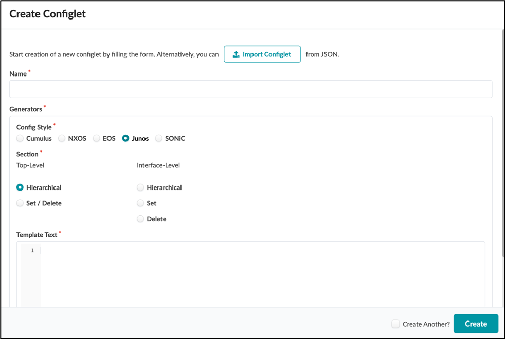
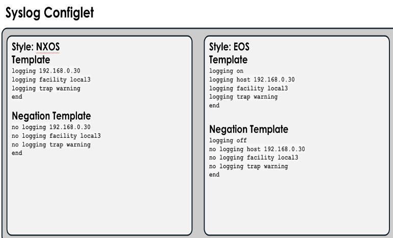
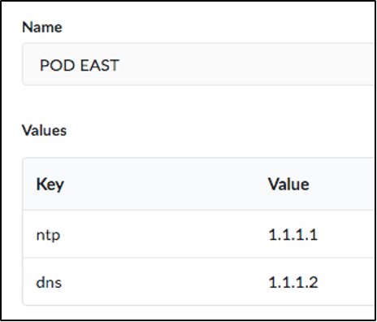
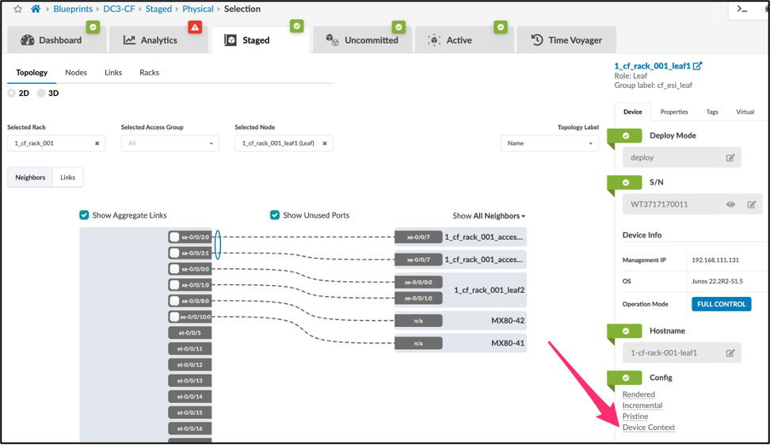
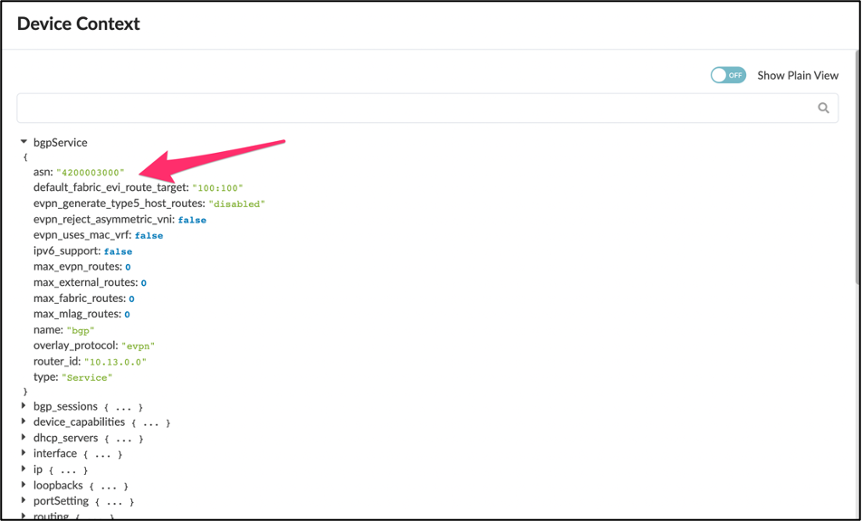
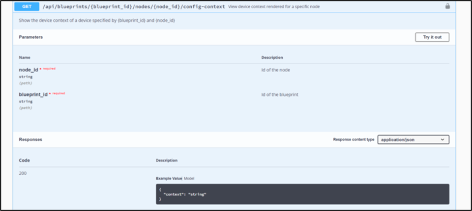

# Apstra Configlets

**Wataru Nakamae - 09/07/2023**

Configlets allow the administrator to create custom configuration templates and automatically deploy them to devices based on intent.

This document was developed from the original work by Josh Saul. Special thanks to Adam Grochowski for his significant contribution to the development of the content in this document.

## Introduction

Juniper Apstra automates the creation and management of Networks.  The complex parts of the configuration are fully automated and validated by the Apstra Graph Model.  Customers typically have a selection of bespoke small features or settings that they want to enable on devices.  To allow customers to accomplish all of their configuration tasks, e.g., add configuration not included in the reference design, Apstra provides a feature known as Configlets. Configlets allow the administrator to create custom configuration templates and automatically deploy them to devices based on intent.  The Configlet management system is designed to support multiple vendor and syntax types.

## Configlets Overview

**Recommendation 1:** Configlets are a very powerful feature, however, when used incorrectly they have the potential to take down a network.  Use extreme caution when designing, testing, and deploying Configlets.  Juniper Professional Services can assist with Configlet design.*

### Styles

Apstra supports Configlets for multiple vendor config styles.  In all current versions of Apstra, the following styles are supported:

- NX-OS (Cisco)
- EOS (Arista)
- Junos (Juniper)
- SONiC (Dell)



### Configlet Templates

The Configlet Template is the exact set of CLI commands that you wish to deploy to the device.  These commands or file contents are issued directly to the devices.  Within Apstra, the contents of the template and negation template are not validated by Apstra.

> **Note**: When creating Configlet templates, it is critical that you use a raw text editor such as OSX Textedit, Windows Notepad++, or vi.  The inclusion/addition of hidden characters will cause unforeseen issues when deploying Configlets.*

### Negation Templates

The negation template is used to properly disable the functionality within the Configlet for a specific style.  Examples of proper negation are:

| Template | Negation Template |
|:--|:--|
| shut | no shut |
| logging 10.10.10.10 | no logging 10.10.10.10 |
| ip access-list 100 permit 10.10.10.10 0.0.0.0 anyip access-list 100 deny any any | no ip access-list 100 |

***Recommendation 2**:  Test every Configlet template and negation template on a separate dedicated device to ensure that it is doing exactly what is intended.*

## Caveats

### NXOS Style

Do not create a Configlet for MOTD for NXOS due to known issues.

### Junos Style

Junos supports two styles of generators:

- Hierarchical
- Set/Delete

### Sections

The sections may vary depending on the Style (NOS) selected.

### System Section

The System section provides the ability to run commands on a Linux device as the root user.  This is also used in conjunction with the FILE style to restart processes or perform administrative tasks after file level operations have been completed. (Sonic Only)

### Interface Section

This Configlet section is designed for controlling interface level settings.  If this option is selected when the Configlet is created, additional options will be presented when importing the Configlet to a running blueprint.  This allows the operator to apply the Configlet to an interface or range of interfaces.

### File Section

The File section enables the administrator to append text to an existing file located under /etc/.  This section does not support negation.



### Property Sets

Property Sets are an optional enhancement that allow the engineer to fully parameterize Configlets to separate the unchanging portions of the Configlet from the actual variables.

For example, the configuration of NTP on all devices in the enterprise may be consistent, but with differing time sources or strata per geography.  The NTP Configlet can be built using a variable that is different for each of these areas.  In this case, you can use the property with the name "ntp".  The Configlet would be constructed with {{ntp}} in place of the actual IP address you wish to use for the NTP server.  The same Configlet is imported into all blueprints. Still, blueprints running in the East region would have the "POD EAST" Property Set imported, and blueprints running in the West region would have the "POD WEST" Property Set imported.



Changes to Property Sets are not automatically imported or synced to blueprints that are using them.  You must manually reimport the Property Set for changes to take effect.

Property Sets are part of the Graph, and values can be used in IBA probes.

### Rendering Order

Users can specify where in the config rendering process the Configlet is applied.  This provides flexibility to completely control which commands override other rendered settings.  The rendering sections are:

- System_top
- System
- Interface
- SVI

### System_top

System_top is applied to the device BEFORE the Apstra Reference Design configuration is applied.  This is ideal for ensuring that Apstra can overwrite a setting to implement the programmed intent.  If a user turns off a needed feature, Apstra will reenable it when the reference design is applied.

### System

The System rendering location occurs AFTER the reference design has been applied, which means that this location offers absolute insertion of the Configlet, but these changes could break the functionality of the reference design.  Users can view the insertion of the Configlet by viewing the "rendered" configuration before it is applied.

### Interface/SVI

The Interface and SVI rendering location occurs AFTER the reference design has been applied, which means that this location offers absolute insertion of the Configlet, but these changes could break the functionality of the reference design.

### Rendering Order per OS

Configuration rendering order is as follows:

1. System Top: negation template text (NX-OS, EOS)

2. System Top: template text (NX-OS, EOS)

3. Apstra reference design

4. Interface: negation template text (NX-OS, EOS)

5. System: negation template text (Junos, NX-OS, EOS, SONiC)

6. File (SONiC)

7. System: template text (Junos, NX-OS, EOS, SONiC)

8. Interface: template text (NX-OS, EOS)

To control the order of operations within a section, create Configlets with numeric names. For example, 01_syslog renders before 02_ntp. Configlets are then ordered based on the condition of the Configlet (for example, the spine or leaf role), and then by the Node ID of the Configlet.

## Operational Details

***Recommendation 3:** Use Configlets for simple standardized configurations, leverage Apstra for routing and switching management.*

## Jinja Support in Configlets

### Using Jinja in Configlets

Configlets support the use of Jinja2 delimiters. Moreover, users can access the Apstra internal device context, which essentially serves as built-in property sets for Configlets.

This can be useful for some Configlet use cases where the user must apply the Configlet to many switches or interfaces with parameterized values or they want the Configlet to include data (such as the switch's own ASN or IP addresses) from the Blueprint.

This feature can potentially reduce the number of Configlets that need to be created, applied, and maintained for such use cases.

### Examples of Configlets using Jinja

**Example 1:** Defining variables and using for loops

| Configlet Template |
|:--|
| ip prefix-list BGP-vm-{{ direction }}-filter seq 1000 {{ entry.0 }} {{ entry.1 }} |
| Resulting Rendered Configuration |
| ip prefix-list BGP-vm-in-filter seq 1000 permit 10.0.0.0/8ip prefix-list BGP-vm-out-filter seq 1000 deny 6.6.0.0/16 |

**Example 2:** Using the device model (built-in property sets)

| Configlet Template |
|:--|
| router bgp {{ bgpService.asn }}{{ bgpService.router_id }}{{ logical_vtep_ipv4_address }} |
| Resulting Rendered Configuration |
| router bgp 6451210.0.0.210.0.0.13/32 |

### Accessing the Device Model

The built-in property sets are currently undocumented. However, they are accessible through the Apstra Server. You can view them by looking at the device-context which can be seen by looking at the topology or nodes view and inspecting the node.  Down at the far-right corner you will see "Device Context"



Once you click Device Context you will see the device context.  Here we show the example of bgpService.asn variable which could be used in jinja for the Configlet.



### Using the API to Access the Device Context

The other way to find the same information is to use the API endpoint

<aos-ip>/api/blueprints/<bp-id>/nodes/<system-node-id>/config-context



**Example:**

To view the device model for leaf1 in the Blueprint, navigate to the device and take note of the Blueprint ID as well as the node ID of leaf1 in the URL string:

```
52.193.222.63:24509/#/blueprints/evpn-cvx-virtual/staged/physical/selection/node-preview/adcbf33d-7bdc-4791-be83-6aaa8fff0b8f
```

Then open:

```
52.193.222.63:24509/api/blueprints/evpn-cvx-virtual/nodes/adcbf33d-7bdc-4791-be83-6aaa8fff0b8f/config-context
```

Although it is not formatted for readability, one can view the above text to find what built-in variables are available to Configlets.
For example, the ASN of a particular node can be referred to by the bgpService.asn variable.

Here is a simple and very basic python script to print out the config-context via the API:

```
from aos.client import AosClient
import urllib3

urllib3.disable_warnings(urllib3.exceptions.InsecureRequestWarning)
AOS_IP = '172.25.90.163'
AOS_PORT = '443'
AOS_USER = 'admin'
AOS_PW = 'admin'

BP_ID = 'efe50d54-92f2-4dc3-b60b-cda3ac71c548'
NODE_ID = 'VT8QN_w6Eg8aw0u4SQ4'
aos = AosClient(protocol="https", host=AOS_IP, port=AOS_PORT)
aos.auth.login(AOS_USER, AOS_PW)
ids = aos.blueprint.get_all_ids()
# for this example just get the first returned blueprint for use.
# you could always just use the example of hardcoding the blueprint ID from the URI string of the GUI.
# I did that and just stored it into BP_ID in this example... 
# that would save you from having to use the aos.blueprint calls
print(f"blueprint ids ={ids[0].id}")
blueprint_id = ids[0].id
nodes = aos.blueprint.get_bp_nodes(blueprint_id)
# i get the nodes here and then just print them out...
# that way i can easily look through the output to find the node i want.
# print(nodes)
uri_string = f"/api/blueprints/{blueprint_id}/nodes/{NODE_ID}/config-context"
print(uri_string)
config_context = aos.rest.json_resp_get(uri=uri_string)
print(config_context["context"])
```

### Support for List Variables in User Defined Property Sets

You can also evaluate a data model from a property set containing a list of elements.

Example:

**Configlet Template**

```
ip access-list SNMP_RO
 
   permit ip host {{server}} any
   
   exit
   
  
 snmp-server source-interface traps loopback 0
 snmp-server community tempPassword group network-operator
 snmp-server community tempPassword use-ipv4acl SNMP_RO
 
 snmp-server host {{server}} traps version 2c mypass
 
```

**Property Set**

```
Name: snmp
 Properties: {{snmp_servers}}- 203.0.113.100,203.0.113.101
```

**Resulting Rendered Configuration**

```
 router bgp 64512
 10.0.0.2
 10.0.0.13/32
```

### Testing Jinja

If you want to test your Jinja2 template outside of Apstra -- since it is tedious to do so by repeatedly editing Configlets and re-applying them to a Blueprint in the UI -- below is a sample of  a minimal Python3 script that can be used:

**jinja-test.py**

```
 import jinja2
 # create Jinja2 Environment
 env = jinja2.Environment(loader = jinja2.FileSystemLoader('./'))

 # load template
 template = env.get_template('template.j2')

 # rendering
 data = {
    'bgp_filters':{
        'flb': {
            'in': ('permit', '66.66.66.66/32'),
        }
    }
 }
 result = template.render(data)

 # print result
 print(result)
```

**template.j2**
 
```
ip prefix-list BGP-vm-out-filter seq 1000 {{ bgp_filters.flb.in.0 }} {{ bgp_filters.flb.in.1 }}
```

**Printed Result**

```
ip prefix-list BGP-vm-out-filter seq 1000 permit 66.66.66.66/32
```

### Tags

One more powerful feature that a user can enact, is to refer to tags within Configlets. Tags allow configlets to refer to specific interfaces or devices such as:

```


```

This snippet allows a user to look for specific interfaces tagged with 'yourtag', and then use them in their configlet. For example, let's say we wanted to add a piece of configuration to an interface configuration, on interfaces tagged with 'yourtag', in this case, a specific description. We can create the following jinja code:

```


{
    {{iface.intfName}} {
        description This is my interface tagged with 'yourtag';
   }
}
```

All interfaces tagged with 'yourtag' now receive this new description.

## Summary

Configlets provide a flexible method to augment configuration enacted by the Apstra reference design. The ability to use jinja code in combination with the device context and property sets for variables allows network operators to add exactly the configuration they want, while keeping Configlet sprawl to a minimum.

## Useful links

- Apstra User Guide: [https://www.juniper.net/documentation/us/en/software/apstra4.1/apstra-user-guide/index.html](https://www.juniper.net/documentation/us/en/software/apstra4.1/apstra-user-guide/index.html)

## Glossary

- API: Application Programming Interface
- CSV: Comma-Separated Values
- Jinja: A web template engine for the Python programming language
- REST API: Representational State Transfer Application Programming Interface
- Syslog: A standardized system logging server
- UI: User Interface

## Acknowledgments

This document was developed from the original work by Josh Saul. Thanks to Adam Grochowski who added significant content to this document.
