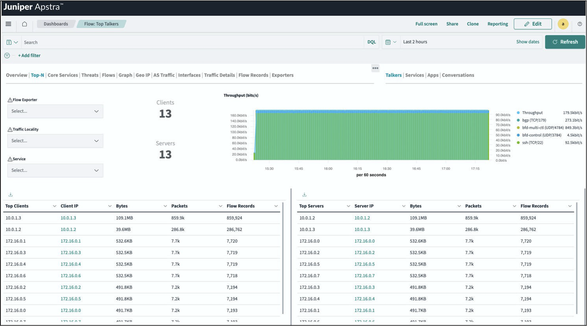
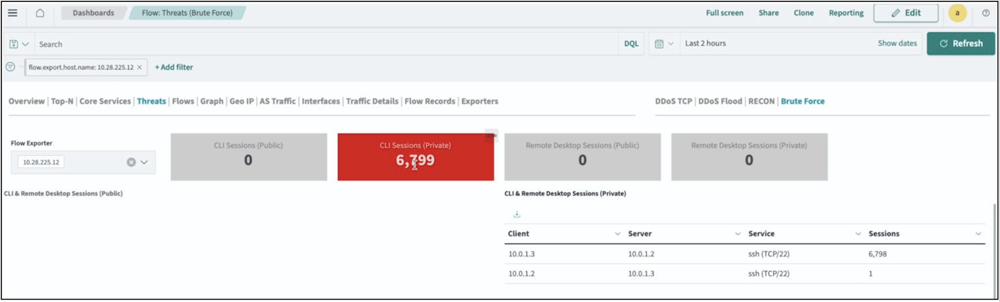
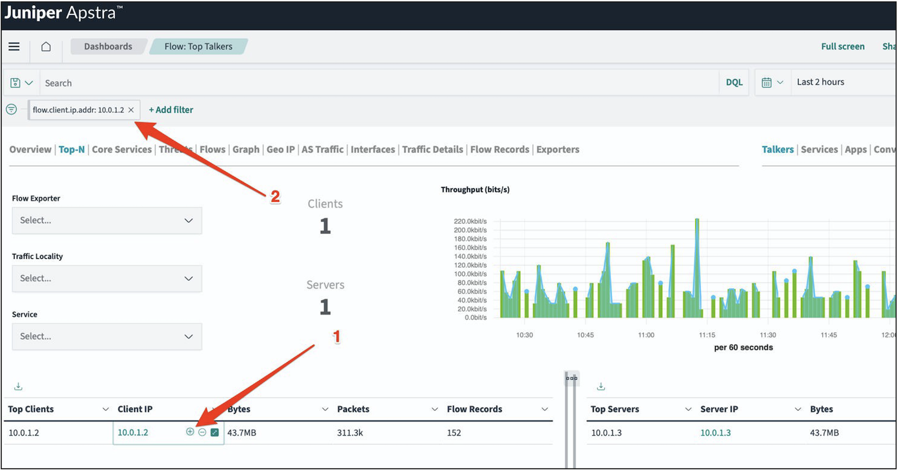
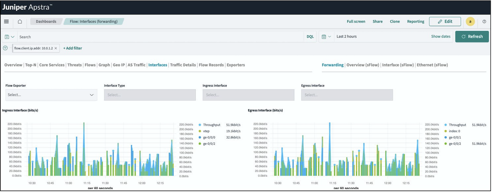

# Introduction to Apstra Flow Data

**Adam Grochowski - 03/07/2024**

## Introduction

With the popularity of distributed applications in systems using inter-process communication (IPC), troubleshooting network issues is crucial. With network flow monitoring, you can troubleshoot application issues in a DC fabric with distributed, cloud-native, virtualized, and containerized workloads. You can then use this information to troubleshoot network problems, improve performance, and detect security threats in your network.

In addition, network flow monitoring provides you with information about:

- Network performance and planning
- Inter and Intra application communication
- Network constraints
- Potential security breaches

## Apstra Flow Data Overview

Apstra has introduced a new multi-vendor capability called Apstra Flow Data. Flow Data is a comprehensive, scalable, high-performance flow collector and analyzer. This feature includes an array of network flow analytics that helps you understand application performance and usage across your Apstra-managed network. Flow data features out-of-the-box dashboards and advanced analytics capabilities such as fine-grain filtering, customizable charts, and drill-down dashboards.

Flow Data provides insights into how applications utilize network resources and impact users. This feature also helps you understand network issues, such as application performance issues, heavy traffic utilization, and anomalous behaviors. Flow Data works by collecting and analyzing flow data from network devices and provides rich visualizations of your network traffic. The flow data and visualizations provide you with a clearer understanding of what's happening on your network from an application and user perspective.

## What is Network Flow Data?

Network flow data is typically collected from various network devices such as servers, routers, switches, and firewalls. These devices monitor and record the traffic passing through the devices, capturing details such as source and destination IP addresses, port numbers, protocol types, and timestamps. This data gives you a comprehensive view of your network's activity and facilitates the analysis of communication patterns within the infrastructure. By knowing what's happening in your network, you can easily understand the following:

- Network performance and planning
- Application traffic
- How network-dependent applications are functioning
- Insight into potential bottlenecks
- Finding potential security breaches

Let's get started!

## Getting Started with Apstra Flow Data

Apstra Flow Data is a feature in the Apstra premium tier licensing plan. This feature is available only if you are an Apstra premium customer. If you already have a premium license, you can get started with Flow Data right away. (See the Juniper Apstra Flow Data Installation Guide in the Useful Links section for installation instructions). If you don't have a license, contact your Juniper Apstra sales representative for more information.

The high level of the installation process is as follows:

- Download and install the Apstra Flow VM.
- Apply your license in the Apstra GUI.
- Enable Flow Data on your desired devices. Apstra now includes a default confliget for Junos you can use to easily set up Flow Data.
- Authenticate and access the Flow Data dashboards to begin analyzing and visualizing your data.

## Why sFlow?

Although Flow Data supports sFlow, NetFlow, IPFIX, and Inband Flow Analyzer (IFA) 2.0, we recommend sFlow as your flow monitoring solution. sFlow has emerged as the industry standard for switch network traffic monitoring. sFlow provides hardware-based packet sampling independently of software-based traffic analysis, minimizing the load on network devices. This allows for real-time, scalable monitoring across all layers and protocols of the network stack. In contrast, NetFlow is a proprietary technology that relies on caching and processing packets within routers, hindering performance on high-speed links.

sFlow's vendor-neutral, standards-based approach provides:

- Flexibility in the sample rate
- Independent sampling and analysis
- Comprehensive visibility
- Critical optimization of network operations, security, troubleshooting, and planning in complex enterprise and service provider environments

sFlow's hardware offload of functions, standardization, real-time visibility, and minimal impact has led to its broad adoption over proprietary NetFlow. This is why we recommend sFlow for your comprehensive network-wide traffic monitoring and management needs. A standard Junos sFlow configlet is provided with Flow Data to help you get started. This configlet pushes the necessary configurations to your network devices quickly, so you can see the value of flow visibility right away.

Next, we'll show you some use cases using the Flow Data dashboards.

## Flow Data Use Cases

Now that you have a basic understanding of Flow Data, let's look at the ways it can help you manage your network. The following sections show examples of use cases using the Flow Data dashboards in the Apstra GUI. See the Juniper Apstra Flow Data Installation Guide on how to access the dashboards.

### Top-N Dashboard

Understanding and optimizing network performance is critical for any network operator. Flow Data lets you continuously learn about what is traversing your network at any given time and helps you continually improve network functionality. Figure 1 shows an example of the Top-N dashboard. Here, you can see the top traffic traversing your network. You can also filter information by talkers (traffic source and destination), services such as SSH and HTTPS, Apps, and Conversations.

In this view, you can add filters to further enrich the data shown. For example, you might want to narrow in on a particular source or destination, service, or TCP flags that show the connection status.

### Threats Dashboard

Flow Data can perform basic threat detection for flows. The Threats dashboard shows any DDoS, port scans, and brute force attempts on your network. Figure 2 shows an example of repeated SSH sessions that were sent between hosts. Here, Flow Data displays these sessions as brute-force attempts. Flow Data can also enrich the data that is displayed with DNS, and IP geolocation.

Flow Data allows you to trigger these results yourself by using the open-source hping3 network scanning tool. You can use this tool to send different packet types for security vulnerability testing.

### Performance and Planning Dashboards

Gaining inside knowledge into your network can help you rebalance your applications and capacity planning, but to do that, you need to see how the flows are impacting individual interfaces. To see a particular traffic flow in the Apstra GUI, you can create a filter that persists across the top-level tabs in the Flow Data dashboard.

For example, in Figure 3, from the Flow: Top Talkers tab, we chose the most talkative source IP (src) address as indicated by arrow1. By hovering over that IP and clicking the + sign, we created a filter as indicated by arrow 2.

This filter also applies to other tabs, such as the Interface tab as shown in Figure 4. The Interfaces tab shows the interfaces on which your chosen IP address communicates.

From the Interfaces dashboard, you can:

- **Identify link saturation**: See which interfaces are experiencing high traffic volume, helping you determine where to rebalance applications or add capacity.
- **Drill down further**: Select individual flow exporters (switches), interface types (ingress/egress), and specific interfaces for even more granular analysis.

This use case shows you where you are experiencing issues with link saturation in your network. This is useful for capacity planning exercises, or troubleshooting cloud-native applications that may run across many servers in a datacenter.

## Summary

Flow Data is a game changer for network operators seeking deeper insights into application performance and usage. It goes beyond traditional connectivity monitoring by providing real-time, comprehensive visibility into network activity from an application and user perspective.

In summary, Flow Data empowers you to:

- **Troubleshoot application issues**: Quickly find the root cause of performance problems, heavy traffic, and potential security threats.
- **Optimize network performance**: Gain valuable information about how applications utilize network resources, allowing you to optimize network functionality and prevent bottlenecks.
- **Plan for future needs**: Identify areas of link saturation and confidently plan for future capacity requirements.
- **Make informed decisions**: Leverage granular visibility and rich visualizations to make informed decisions about your network.

With Flow Data, you can control your data center environment, ensuring a reliable and secure network experience for your applications and users.

## Useful links

- Juniper Apstra Flow Data Installation Guide:
[https://www.juniper.net/documentation/us/en/software/apstra4.2/apstra-flow-data-install-guide/index.html](https://www.juniper.net/documentation/us/en/software/apstra4.2/apstra-flow-data-install-guide/index.html)
- Importing Configlets for Flow Data:
[https://www.juniper.net/documentation/us/en/software/apstra4.2/apstra-flow-data-install-guide/topics/topic-map/apstra-flow-data-install-import-configlet.html](https://www.juniper.net/documentation/us/en/software/apstra4.2/apstra-flow-data-install-guide/topics/topic-map/apstra-flow-data-install-import-configlet.html)
- Juniper Apstra User Guide:
[https://www.juniper.net/documentation/us/en/software/apstra4.2/apstra-user-guide/index.html](https://www.juniper.net/documentation/us/en/software/apstra4.2/apstra-user-guide/index.html)

## Glossary

- DC: Data Center
- DDOS: Distributed Denial of Service
- DNS: Domain Name Service
- GUI: Graphical User Interface
- HTTPS: Hypertext Transfer Protocol Secure
- IP: Internet Protocol
- IPC: Inter-Process Communication
- SSH: Secure Shell
- TCP: Transmission Control Protocol
- VM: Virtual Network
