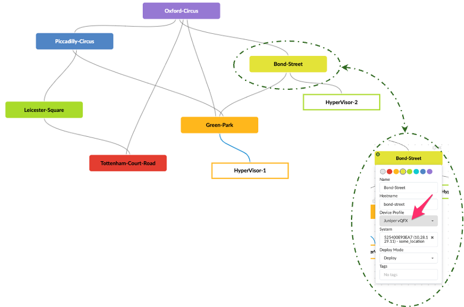
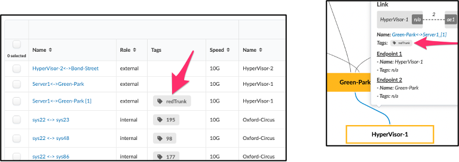
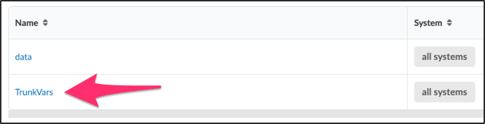
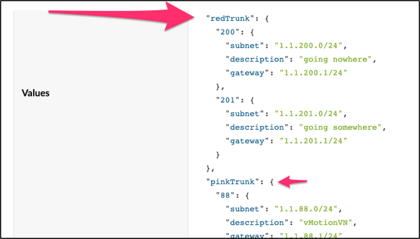
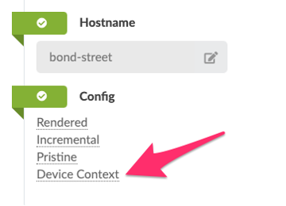
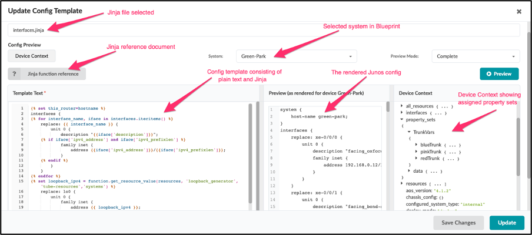
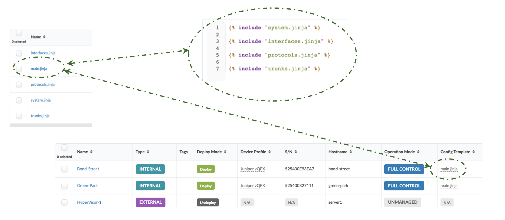

# Apstra Freeform Day-2 Configuration

**Andy Ford - 10/31/2023**

Using Tags, Property Sets, and Jinja to simplify Apstra Freeform Day-2 Configuration.

## Introduction

Alongside the Juniper Apstra DC reference architecture built on L2 + L3 VXLAN EVPN, 3 and 5-stage Clos or Collapsed Fabric, Juniper has an additional Apstra reference architecture called Freeform. Freeform provides many of the features and functionality from the DC reference architecture currently enjoyed by the Juniper Apstra community and brings with it the ability to deploy any Junos- / Junos EVO-based network topology, utilizing any protocols supported by these platforms. When the Apstra DC reference design isn't the right solution for your architectural needs, Freeform is the answer. There are a couple of elements exposed in the Freeform architecture that allow you to design and build a network of your choosing, which are:

- The Blueprint: to build any topology
- The Jinja templates: to build any configuration

With great power comes great responsibility, and as such, Apstra provides a framework that provides various levels of context to assist in designing and building the Freeform config with accuracy. The Freeform Single Source of Truth (SSoT) is based on a Graph Database (GraphDB) that holds the interconnected state of your fabric. As you design your Freeform fabric, the following is also added to the Freeform SSoT:

- **Device Profiles** that accurately describe the capability of the switch in your topology
- **Tags** that can be used to pinpoint elements of the fabric to monitor or build configuration
- **Resource allocation**, where Freeform can dynamically create and allocate resources for systems and links in the Blueprint.
- **Property Sets** that can hold any Python-based dataset such as:


Lists
Dictionaries
Integers
Dictionaries of dictionaries

To pull this context into an IDE-style friendly interface, Freeform provides a 3-pane IDE-like editor that consists of:

- **Pane-1**: The Jinja config template
- **Pane-2**: The Junos output that the Jinja config template generates
- **Pane-3**: Device Context that returns everything stored in the GraphDB for a given device for ease of lookup and use in the Jinja config template
- A **commit check** function so that once the configuration has been crafted, a check to determine whether the configuration is committable can be performed

## Using Freeform Elements to Dynamically Build Configuration

This article explains how Apstra can simplify Day-2 configuration changes by utilizing Tags, Property Sets, and programmatic Jinja-based Config Templates. To do this, we start with the topology described below. This topology represents part of the London Underground for no reason other than it is a network of connected nodes. The nodes with a solid color represent a managed system where Freeform will build and deploy configuration. The nodes outlined with color are unmanaged systems. They are purely there to describe to Freeform, how they are connected to the managed nodes and therefore provide valuable context in the SSoT, as described above.



By graphically editing the Blueprint, you can assign a color, blueprint name. Hostname, Device Profile, Agent ID, the Deploy Mode, and any Tags required.

### Tags

Tags are metadata that can be assigned to elements in the device context.  These tags can be used in programmatic language to identify elements and take actions on those elements.

For example, notice that a mouseover of the link between HyperVisor-1 and Green-Park, and under Staged / Physical / Links, a Tag 'redTrunk' has been assigned:



We will use this Tag name as a string that can be used to look up data objects in a Property Set to access the relevant information that may be needed to form a trunk on the link wherever the Tag has been assigned.

In this instance, the Property Set holds a dictionary of dictionaries, where the high-level keys are the Tags, as shown below.

### Property Sets

Under Staged / Catalog / Property Sets, a new Property Set has been created called TrunkVars, which has been assigned to all systems in the Blueprint. You may choose to assign any given Property Set to one, many, or all systems.



Clicking on TrunkVars reveals the dictionary of dictionaries with redTrunk and (in this example) pinkTrunk. Under each 'headline' key in the dictionary is another dictionary that holds:

- VLAN ID
- Subnet
- Description
- Gateway



In this example, we can modify the contents of the Property Set dictionary to add or remove VNs from the trunk. With Freeform, the incremental or full configs can be viewed in the Blueprint for each device.

### Device Context

The contextual information for each system is stored in the Freeform Single Source of Truth, the GraphDB. This can be viewed by selecting the system in the Blueprint and clicking on 'Device Context' or in a separate pane in the 3-pane editor.



### 3-Pane Editor

The 3-pane editor provides an IDE-style interface so the config template can be viewed and edited in:

- **Pane-1**: The Jinja Config Template
- **Pane-2**: The Junos output that the Jinja Config Template generates
- **Pane-3**: Device Context that returns everything stored in the GraphDB for a given device for ease of lookup and use in the Jinja Config Template. Notice in this example that the TrunkVars Property Set expanded to show the top-level keys of our dictionary of dictionaries.



### The Jinja Templates

The Jinja Templates are nested, where the top-level jinja is assigned to a system in the Blueprint.



## Pulling This All Together

We will now integrate these concepts to form a config template that utilizes tags to generate configurations dynamically.

### trunks.jinja Config Template

The trunk configuration is built by the trunks.jinja Config Template. The link between Green-Park and Hypervisor-1 has a Tag 'redTrunk' assigned, as described above. The Property Set 'TrunkVars' has a key 'redTrunk'. All that remains is to walk both data sets (TrunkVars and the Blueprint links) and when we get a match build configuration.

By selecting Green-Park in the Blueprint and then 'Rendered,' we can view the full rendered config for this system. Below is a snippet of the rendered output from trunks.jinja:

```
interfaces {
  xe-0/0/4 {
  description redTrunk
    unit 0 {
      family ethernet-switching {
          interface-mode trunk
          vlan {
            members [
                    vn201
                    vn200
            ]
         }
      }
    }
  }
}

irb {
    unit 201 {
        family inet {
            mtu 9000;
            address 1.1.201.1/24;
        }
    }
    unit 200 {
        family inet {
            mtu 9000;
            address 1.1.200.1/24;
        }
    }
  }
}

vlans {
  vn201 {
    vlan-id 201;
    description going somewhere-201;
    l3-interface irb.201;
  }
  vn200 {
    vlan-id 200;
    description going nowhere-200;
    l3-interface irb.200;
  }
}
```

### trunks.jinja Config Template

**Jinja2 in Purple & plain text in black**

```
 # creating a place to store the VLAN and IRB details as we iterate through TrunkVars
 # iterate through TrunkVars and pull out the high-level key
    # iterate through the interfaces in the Blueprint
     # check to see if there is a tag on the interface AND there is a match between the tag assigned to the link and the key in the TrunkVars Property Set dictionary

interfaces { # if we get here, a match has been found
  {{interface_name}} { # print the interface name found in the Blueprint interfaces
  description {{ ps_tag }} # add an optional description. In this case we use the tag itself
    unit 0 {
      family ethernet-switching {
          interface-mode trunk
          vlan {
            members [
                 # retrieve the vlan IDs from the TrunkVars Property Set by using the ps_tag as a key to the dictionary below
                     # store the vlan ID against the tag name in the Rendered_VNs dictionary as a key/value pair
                    vn{{ vlan_id }} # print out the vlan ID to STDOUT
                 # end the for loop for vlan IDs
            ]
         }
      }
    }
  }
    # end the if statement checking the interface tags
   # end the for statement iterating through the interfaces
   # end the for statement iterating through the TrunkVars Property Set

 # if we have stored anything in Rendered_VNs, then we have found a match above. It's now time to print the irb and the vlan configuration
irb {
     # iterate through the VLAN IDs in Rendered_VNs
 # set the tag variable stored in Rendered_VNs[vn]
    unit {{ vn }} { # output the unit number
        family inet {
            mtu 9000;
            address {{ property_sets.TrunkVars[tag][vn]['gateway'] }}; # output the gateway address
        }
    }
     # end the for loop to iterate through the Rendered_VNs dictionary
  }
}
vlans {
 # repeat the same to create the vlan configuration. The interface description is also used in the TrunkVars Property Set by using the tag name and the vn as keys to access the embedded dictionary in this Property Set. 

  vn{{ vn }} {
    vlan-id {{ vn }};
    description {{ property_sets.TrunkVars[tag][vn]['description'] }}-{{ vn }};
    l3-interface irb.{{ vn }}; # in this instance we created an L3 IRB.
  }
   # end the iteration
}
 # end the if statement checking whether the Rendered_VNs dictionary for content
TrunkVars Property Set
{
  "blueTrunk": {
    "99": {
      "subnet": "1.1.99.0/24",
      "description": "vMotionVN",
      "gateway": "1.1.99.1/24"
    },
    "100": {
      "subnet": "1.1.100.0/24",
      "description": "storageVN",
      "gateway": "1.1.100.1/24"
    },
    "101": {
      "subnet": "1.1.101.0/24",
      "description": "mgmtVN",
      "gateway": "1.1.101.1/24"
    }
  },
  "redTrunk": {
    "200": {
      "subnet": "1.1.200.0/24",
      "description": "going nowhere",
      "gateway": "1.1.200.1/24"
    },
    "201": {
      "subnet": "1.1.201.0/24",
      "description": "going somewhere",
      "gateway": "1.1.201.1/24"
    }
  },
  "pinkTrunk": {
    "88": {
      "subnet": "1.1.88.0/24",
      "description": "vMotionVN",
      "gateway": "1.1.88.1/24"
    },
    "89": {
      "subnet": "1.1.89.0/24",
      "description": "storageVN",
      "gateway": "1.1.89.1/24"
    },
    "90": {
      "subnet": "1.1.90.0/24",
      "description": "mgmtVN",
      "gateway": "1.1.90.1/24"
    }
  }
}
```

## Summary

There are many creative ways to build switch configurations with Freeform. Still, the most important part to consider is how you will improve Day-2 changes by reducing the manual change workload, which can be a complex challenge when using a limited tool such as Ansible, which has no dynamic connectivity information or device state. In this example, we've shown how to create one Jinja2 Configuration Template utilizing tags to render the creation of a trunk configuration. The variables required to build the config are stored in a Property Set. Adding or removing VNs from a trunk in this example is as simple as modifying the Property Set values., instead of modifying complex Jinja programmatic code. Adding and removing trunks is as simple as assigning a new tag. Consider adding another trunk with the data in the Property Set under blueTrunk.

Interestingly, you could use a variation of this approach to achieve something similar by adding all the information you need in the tag itself and bypassing using a Property Set. For example, you could build a trunk using the following Tag, which can be assigned to an interface in the Blueprint topology:

**Trunk1::VRF::vlanID::Description::Gateway**

As described above, we can iterate through the interfaces, and wherever I see a tag with this format, 'split' the contents using :: as a delimiter and form the config from the variables in the Tag.

## Useful links

To try this yourself, contact your Juniper SE to set up a Freeform topology in Apstra CloudLabs ([https://cloudlabs.apstra.com/login](https://cloudlabs.apstra.com/login)). Copy and paste the TrunkVars Property Set and trunks.jinja config template above, and assign the relevant tags to the interfaces in your Blueprint.

## Glossary

- DC: Data Center
- EVPN: Ethernet Virtual Private Network
- IDE: Integrated Developer Environment
- Jinja: A template engine
- L2: Layer 2
- L3: Layer 3
- SSoT: Single Source of Truth
- VLAN: Virtual Local Area Network
- VN: Virtual Network
- VXLAN: Virtual eXtensible Local Area Network

## Acknowledgments

The following people contributed content or editorial changes to this document: Adam Grochowski, Kathy Tally, Bill Wester and Jeff Doyle
