# Apstra IP Fabric Reference Design

**Bill Wester - 08/05/2023**

Juniper Apstra's fundamental purpose is to minimize operational costs and maximize the speed of network operations by furnishing predefined, rigorously validated reference designs. The reference design enables users to specify what they expect to happen with a minimal number of steps; the Apstra software takes care of the complexities of fulfilling the expressed expectations. That's the foundation of Intent-Based Networking.

This article has been co-written by Jeff Doyle and Bill Wester, and was developed from the original work by Josh Saul.

## Introduction

The advantages of Apstra begin with the streamlining of the architectural process. Providing a pre-built reference design eliminates hours of architectural design meetings; you simply deploy the software.

And this sometimes raises questions. Although Apstra's reference designs are based on industry best practices, there are many ways to design, virtualize, and operate virtual networks within a data center fabric. We are occasionally asked what goes on "under the hood," and why we have made our choices. For example:

- Why do we use EBGP in the underlay and overlay instead of IS-IS or IBGP?
- Why do we support ERB topologies and not CRB?
- Why do we handle DCI the way we do?

This blog examines the Apstra reference design and explains why we made specific decisions when creating the design.

## IP Fabric Reference Design Overview

### Intent-Based Networking

Modern enterprise architects are responsible for delivering highly scalable and redundant data center fabrics to support connecting a large number of servers together in an application hosting environment. Historically, this required extensive efforts related to design and testing. Over the past ten years, most DC or campus networks have converged on the simplicity and deterministic design of the Clos architecture. Most architects want to quickly create these patterns based on a few inputs specific to their needs, and the Apstra DC reference design is a perfect fit for these use cases.

Apstra consists of a number of reference architectures:

- DC Reference Design
- 3 / 5-stage: VxLAN - EVPN Clos, edge routed & bridged
- Collapsed fabric: VxLAN - EVPN, edge bridged, centrally routed.
- 3 / 5-stage Pure IP Fabric

Apstra contains validated reference designs for all of these architectures.  These designs can be used in the data center, campus, ISP POPs, and branch offices, but the primary design use case is the Data Center. The architecture is based on standard open protocols, including Ethernet, IP, eBGP, EVPN, VxLAN, and the standard Layer 2 and Layer 3 connectivity options. These protocols were selected for their reliability and vendor hardware and software support. One of the major criteria in selecting these protocols was:

- Apstra needed to satisfy the multi-vendor use case and hone in on standard design practices used by all of the supported vendors.
- The high level of interoperability and testing that has already been completed in real-world production environments

In addition, Apstra is constantly testing all of the supported Network Operating Systems (NOSs) and hardware platforms to ensure that this design works with any combination of these elements.

### The Reference Design at a Glance

Apstra supports several familiar and widely-used data center fabric architectures: 3- and 5-stage Clos, and collapsed fabric. All architectures can support VLAN and VxLAN overlays.

### 3-Stage Clos Architecture

The 3-stage Clos architecture is the most well-known and commonly deployed architecture for EVPN data center fabrics. Also known as spine-and-leaf, it consists of some number of spine switches and some (usually larger) number of leaf switches. The number of uplinks dictates the maximum number of spines on the leaves, and the maximum number of leaves is dictated by the number of downlinks on the spine switches. For example, if your leaf switches have four uplink ports, the architecture can have a maximum of four spines. And if those spines have 48 ports, the maximum number of leaves is 48. Within those limitations, a 3-stage Clos is scalable and highly resilient.

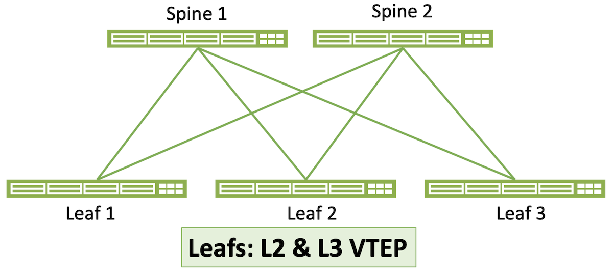

### 5-Stage Clos Architecture

The 5-stage architecture is designed for large data centers or for data centers in which the operators need distinct separation between multiple 3-stage fabrics. Multiple 3-stage Clos fabrics, called Pods in this architecture, are interconnected by a "supersine" layer. Apstra supports a 1:1 correspondence of spine-to-superspine links or some less-dense connectivitiy scheme.

### Collapsed Fabric

Collapsed fabric brings EVPN capability to small single-rack data centers. As the illustration shows, there is no spine layer here. Instead, the rack has one or at most two leaves (the latter is strongly recommended for redundancy). Access switches -- switches that provide ports into the fabric but do not participate in the EVPN overlay -- are also depicted in this illustration.

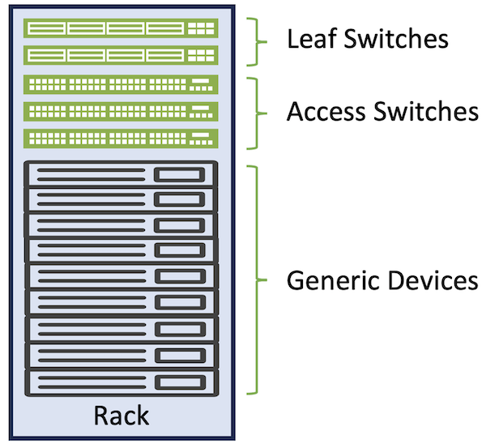

## Reference Design Advantages

The datacenter reference design at the core of Apstra is ideal for architects of networks ranging from small to large.  In addition, this reference design can be easily deployed with a few simple workflows on the Apstra server.  New networks can be deployed in minutes from a catalog of standard templates.

### Predictable Failure Scenarios

The IP Clos fabric is famous for predictability.  We can accurately determine exactly what will happen when any component in the system fails, based on the availability of functionally equivalent parts.

### Deterministic Behavior

The reference design is stored in a graph model with a complete schema containing every element needed to build and operate the network.  The content within this model is acted on by several processes that feed data into rendering engines.  The rendered output (the running device configurations) is delivered to the devices when they are placed into service.  There is no randomness in any of the configurations; based on the administrator's inputs, the configurations will be rendered the same every single time.

### No Dynamic Neighbor Protocols

The reference design is stored in a graph model with a complete schema containing every element needed to build and operate the network.  The content within this model is acted on by several processes that feed data into rendering engines.  The rendered output (the running device configurations) is delivered to the devices when they are placed into service.  There is no randomness in any of the configurations; based on the administrator's inputs, the configurations will be rendered the same every single time.

### Minimized L2 Fault Domains

The reference design is built to leverage the extensive capabilities and mission-critical nature of EBGP.  While other routing protocols could be used to create neighbor relationships with multicast discovery, this adds randomness and unpredictability to a purpose built network.  Apstra's advanced configuration rendering capabilities eliminate the configuration complexity of EBGP.  The required neighbor configurations (and subsequent monitoring) are guaranteed.

### Industry Standard Protocols

Apstra enables mixed vendor environments by using industry standard and ratified protocols with limited exceptions.  (The limited exceptions are vendor-driven rather than an Apstra choice, such as some vendors supporting MC-LAG and others ESI. These differences influence interoperability within a given multi-vendor architecture, and Apstra warns the user of potential interoperability problems during the design phase.) The fabric services are supported through Ethernet, IP, BGP, ECMP, VxLAN, and EVPN.  No proprietary fabric protocols are enabled, which ensures that any vendor or device can be replaced at any time.  This also enables the customer to purchase the basic L3 licenses for switches.  The services provided by other vendors' proprietary feature sets can be matched with the tested and validated services built into the Apstra reference design.

### Support for Non-Datacenter Deployments

The combination of the above design aspects makes the Clos IP fabric suitable for other network deployments, including campus, IP storage, super-compute, and more.

### Vendor Freedom

Users of Apstra are free to select from the largest possible number of available switch platforms.  Given the automated rendering of complex configurations and automatically enabled monitoring, operators do not need to know the specifics of each vendor's operating model, they can select the right sized device and insert it into their network.  Operational procedures are virtually identical regardless of which NOS or hardware model is used.

### Operational Consistency

Directly related to the previous section "Vendor Freedom," operational changes to the network, such as adds, changes, or deletions of virtual networks or VRFs are performed on the graph database representing the fabric, not on the fabric itself. Apstra then translates the expressed operational change into the correct NOS syntax for each controlled device in the fabric and pushes that syntax to the device. These vendor-specific syntax stanzas are a part of the reference design and have been rigorously validated so that the user is assured that the configurations of any two supported devices, regardless of syntactical differences, are doing the same thing. There is no risk of a slight configurational difference having an unexpected impact on your network.

### No Central Point of Failure

The Apstra server does not directly modify the control plane or data plane within the fabric.  The Apstra server and device Agents can be turned off with no impact on the forwarding state of the network, which continues operating under the last deployed configuration. This characteristic also enables in-service upgrades and maintenance of the Apstra server.

## Spine-Leaf Clos Topology

Apstra provides reference designs for a standard Spine-Leaf (Clos) network topology that can be customized for size and bandwidth requirements.  Spine-Leaf networks have proven to be the most popular and reliable topology and can be nested to create extremely large systems or collapsed to create small single-rack systems. Spine-Leaf networks in the data center began to replace a three-tier topology based on application evolution. In the past, most traffic was from external clients over the WAN or internet to a server in the data center (north-south). Now, as applications have evolved, most traffic is east-west. The oversubscription and extra hops of a three tier architecture were no longer suitable based on application traffic patterns. Spine-Leaf designs emerged, and proved uniquely suitable for modern application architectures.

In a Spine-Leaf system, each leaf is connected to every spine within a 3-stage Clos topology with all links running the same bandwidth. Ideally, the only thing that connects to spines are leaf switches. Leafs should not connect to other leafs (except in the case of MLAG/ESI peer links), and spines should not connect to other spines. This design, combined with BGP as a routing protocol is well documented in RFC 7938 ([https://trac.tools.ietf.org/html/rfc7938](https://trac.tools.ietf.org/html/rfc7938)).  This design provides multiple paths for redundancy levels based on specific business needs.  Equal bandwidth links enable a deterministic distribution of load across the spines.  This consistent, deterministic topology means that the path from any device in a rack to any device in another rack is exactly three switch hops away (Leaf-Spine-Leaf, hence the designation 3-stage). Latency between connected devices is entirely consistent, unless distance plus application sensitivity become enough of a factor for the speed of light to play a role. This is normally only a consideration in applications such as High-Performance Compute (HPC) or stock market data centers.

When new racks or servers are deployed onto the network, new leafs (which in the Apstra reference design are synonymous with Top of Rack  or TOR switches) can be added without impacting the live network performance.  When additional bandwidth is needed between racks or outbound from the pod, spines can be easily inserted without impacting the network.  Operationally, the workflows to perform these changes are simple and can be performed during normal business hours as the tasks are non-intrusive.

Deterministic operational expansion of a 3-Stage Clos fabric:

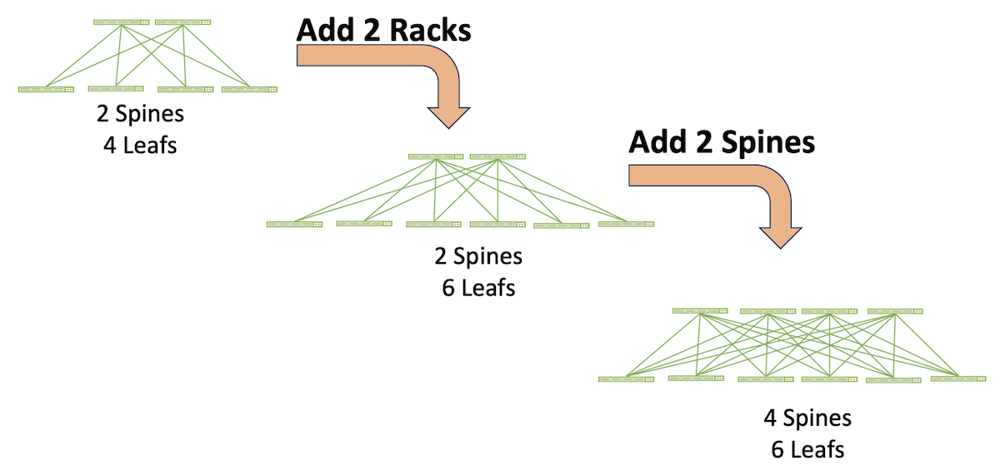

The "every leaf connects to every spine" principle of the 3-stage Clos topology determines its scale-out characteristics:

- The maximum number of spines is bounded by the maximum number of uplinks on the leaf switches. For example, if the leaf switches have six uplinks, the topology can have up to six spine switches.

Note: There are some constraints to this rule. If leafs have two uplinks to each spine, for example, the total number of spines is reduced to three. And if one leaf in the topology has only four uplinks, all leafs are constrained to using only four links. Hence the topology would be limited to four spines to maintain a homogenous topology.

- The maximum number of leafs is bounded by the number of downlink ports on the spine switches. So 48-port spine switches can support up to 48 leafs. In a typical data center each rack has two TOR switches, so in this example 48 leafs mean a maximum of 24 racks.
- The total inter-rack bandwidth is a sum of the leaf-to-spine uplink bandwidth times the number of TORs. So, for instance, a topology in which each rack with two TORs, each TOR having 100G uplinks to four spines, has 2(4x100G) = 800G available inter-rack bandwidth. This characteristic of Clos architecture is a highly advantageous physical underlay for environments such as VxLAN/EVPN in which L3 routing at the leaf can load balance across all uplinks.

Scale-out of 3-stage topologies is further expanded by linking the spines of multiple 3-stage topologies to an additional layer of spines called superspines. The individual, interconnected 3-stage topologies become Pods. Determinism is maintained because connectivity between any device connected to a leaf in one Pod to any device connected to a leaf in any other Pod is always five switch hops (leaf-spine-superspine-spine-leaf, hence 5-stage Clos).

A 5-stage Clos is not only massively scalable, Pods can be individually optimized for specific applications or business verticals.

Finally, a Clos topology is highly resilient to failures and to in-service maintenance. For example, a spine switch in a four-spine topology can be taken out of service for maintenance, and each leaf loses only 25% of its uplink bandwidth. An individual link or interface failure on a spine-leaf connection has the same result. A leaf switch that fails or is taken out of service in this same topology, assuming two TORs per rack, results in 50% bandwidth loss in that rack.

### Device Roles

**Spine**

Spine devices are responsible for high speed, low latency forwarding of IP packets with little to no network services enabled.  By minimizing the number of configured options for the spine devices, better maintenance workflows and larger operational windows can be achieved.  Therefore in the Apstra reference designthe spines are only connected to leafs and have the minimal amount of routing process configuration.  The spines are pure L3 routers, there are no interface level VLANs or spanning-tree functions enabled.  The spines are functionally equivalent to the fabric modules in a modular chassis, providing large predictable amounts cross-sectional or East-West bandwidth.

This reference design choice -- called Edge Routing and Bridging (ERB) -- is discussed further in the section "ERB versus CRB."

**Leaf**

Leaf devices connect to all of the spines in their blueprint or Pod.  Leaf devices forward packets to other leaf devices by routing through the connected spines.  Leaves can also connect to generic devices, MLAG/ESI peer leaves, or all of the above. In the Apstra reference design, all of the "intelligence" of the fabric -- the complexity of VxLAN/EVPN --  resides in the leafs. This leaves the spine layer to do little more than perform fast L3 forwarding with no knowledge of VLANs or VxLANs. This is discussed further in the section "ERB versus CRB."

**Superspine**

Superspines provide an additional layer of aggregation for the 5-stagetage Clos design.  In this topology superspines exist within a superspine plane, and multiple superspine planes are supported.  The superspines act as a spine-of-spines providing high bandwidth connectivity between Pods.  Superspines have a  minimal number of network services.

**Generic Systems**

Prior to release 4.0.0, Apstra differentiated between attached devices such as L2 Server, L3 Server, and External Router. However, these definitions were too specific and did not cover all devices that might attach to an Apstra-controlled fabric. So as a part of the addition of Connectivity Templates in 4.0.0, the term Generic System was adapted to give the user more leeway in defining attached systems.

A Generic System is any device that is attached to an Apstra-controlled fabric but is not itself controlled by Apstra, such as a server, router, firewall, or DCI gateway. Apstra's side of the connection to the Generic System is specified by a Connectivity Template that defines such parameters as IP addressing, routing policies, static routing, tagged and untagged VLANs, and BGP peering parameters such as passwords, remote neighbor address, and remote ASN.

## IP Routing

Apstra uses EBGP to create a routing domain for each deployed fabric.  The fabric, whether a 5-stage or 3-stage Clos or a Collapsed fabric, is specified in a blueprint that provides all variables the reference design needs to operate a specific fabric.  The fabric is connected to one or more core or upstream BGP routers, providing communication into and out of the fabric.  Apstra automates the configuration of the L3 routing protocol to ensure high levels of availability and redundancy within the fabric.  EBGP is very deterministic; it doesn't dynamically form adjacencies and requires administrative configuration to work properly. That is, unlike IGPs, EBGP assumes its peers are untrusted. This stems from EBGP's design as "the language of the Internet," connecting networks under different administrative authorities. So EBGP is designed to establish a peering session only when told to and when the neighbor's address, AS number, and optional security features such as authentication and TTL count are explicitly specified. EBGP is further designed to support a spectrum of routing policies from simple to quite complex.

These characteristics make EBGP an excellent choice for security conscious network operators.  However, the use of BGP typically adds configuration complexity and can be challenging to automate.  Apstra eliminates these issues through expert and consistent configuration rendering.  As a result, the EBGP routing domain in an Apstra fabric is as simple to use as a Link State protocol but offers a much higher degree of flexibility, scalability, security, and optimization.

### BGP vs Link State Protocols

Link State protocols are known for their ease of configuration, dynamic neighbor relationships, and quick convergence.  OSPF in particular is a very popular protocol in the campus where links are known to flap from time to time.  OSPF's use of neighbor discovery and update flooding enables it to converge in just a few seconds, which makes it a good choice for an AS-internal routing protocol (IGP).  However, BGP update timers can be tuned to a high frequency to achieve fast switchovers, and the use of ECMP ensures that the majority of flows are not affected when link failures occur.  Many service providers have evaluated and tested BGP in this manner, which has led to its increased use in the datacenter. Combining a deterministic routing protocol with automation ensures that the topology and path selection is exactly what the admin intended.

BGP is also capable of handling extremely large routing tables (including core Internet backbone routing) due to its optimized algorithms, which is relevant in datacenters that are deploying a large number of virtual machines and containers.  In fact, BGP has been augmented in RFC 7432 to support multiple protocols, which enables advertisement of MAC addresses within virtual networks like VxLANs.  BGP also has the advantage of consuming far fewer CPU cycles, both during normal operation and during routing updates.  Further details on using BGP as a datacenter routing protocol are available at ([https://trac.tools.ietf.org/html/rfc7938#section-5.1](https://trac.tools.ietf.org/html/rfc7938#section-5.1)).

Apstra configures a different ASN (Autonomous System Number) for each spine switch to guarantee that each route in the table has a unique path.  Some other BGP deployments mandate that all spines should use the same ASN, but this is to mitigate an issue where an administrator misconfigures BGP.  Apstra does not have an issue with "split horizon" or "count to infinity" as the paths are guaranteed to be accurate.  Split horizon is a routing protocol problem related to advertising routes back in the direction they came from, count to infinity is a routing loop issue where routes continue to pass through neighbors that they have already passed through.  Apstra managed networks are not susceptible to these problems.   In fact, Apstra constantly checks the validity of all paths in all of the managed routing tables, and split infinity issues are not possible.  Apstra automatically calculates the proper route maps and places them on the relevant devices to maintain consistent paths on each device.

The BGP routers use the multipath-relax configuration argument to ensure that ECMP can function properly even if the AS paths are different for the same route.  Multipath-relax enables BGP routers to load balance sessions across paths with equal AS-path lengths, even if the paths contain different external ASNs.

To achieve fast convergence with BGP, Apstra automates the configuration of all routers to use a 1-second keepalive and a hold time of 3 seconds.  This ensures that BGP can make a path as being unavailable in 3 seconds or less to quickly cut active flows over to one of the redundant paths.  Apstra automates the configuration of BFD (Bidirectional Failure Detection), decreasing the chance of cabling and routing anomalies.

### eBGP vs iBGP

eBGP is used by Apstra due to its detailed route reporting and controls.  In an eBGP environment, each route records the AS number as it is propagated through the system.  With the use of ECMP this can be used as a check to ensure that the fabric is fully balanced from a routing perspective and that all routes that are expected are in place.  As networks grow and add additional layers (for example, the addition of VRFs or a Super-Spine), the AS path can still be used to check that full cross sectional forwarding is active on every expected path.  The change in a single route (either by accidental or malicious causes) can be identified.  Apstra knows which routes and their associated next-hop IP addresses should be in every table.  Because of the closed-loop nature of Apstra, routing issues are minimized or eliminated by validating the routing tables and AS paths.  The automated analysis of the as-path values in all of the routes on all managed devices ensures that Apstra can track every possible path consistently, and in real time.

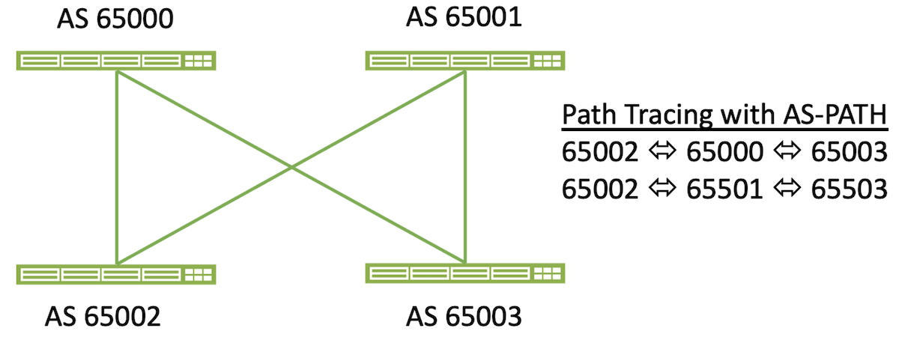

iBGP is commonly used by administrators due to its simplified configuration.  The use of Apstra as an automation platform eliminates the need to configure the routing protocol manually, therefore the advantages of eBGP with regard to path management outweigh the legacy requirements for config simplicity.

## Host Connectivity Options

### Layer 2 Attached Host Options

Apstra supports several different server connectivity options for Layer 2 connected devices.  These systems use Ethernet, Spanning Tree Protocol (STP), auto-negotiation, MLAG/vPC and 802.1q tags to participate in the network on a local VLAN or VxLAN at the switch port level.  Apstra does not directly manage layer 2 hosts so they appear gray in the topology diagrams.  Hosts need to be properly configured by the administrator, although they can leverage ZTP to automate their network configurations if desired.  Apstra can provide DHCP relay services to ensure hosts can acquire an IP address to communicate across the fabric.

The benefits of the routed L3 fabric between the leaf and spine switches is that L2 issues and events are isolated within the rack.  The spanning or trunking of VLANs through the fabric or horizontally to other leafs is not supported.  When L2 segments need to span racks, it is recommended that the administrator leverage the VxLAN functionality to ensure that the fabric remains purely L3.  This is a common best practice to provide fault isolation.  Even though STP is not needed in an Apstra-built network, it is still enabled by default to ensure that the tree can properly converge if an administrator was to accidentally miswire or configure a device.  This also guarantees that hosts cannot act as an L2 bridge if their link aggregation is not configured or functioning correctly.  The bridge priority for devices is set to 8192 and rapid-pvst is enabled to create a fast convergence and forwarding should an L2 event occur.  Should the administrator wish to set an alternate root, 4096 is the recommended priority.

Apstra can connect servers to isolated L2 networks without an SVI (default gateway) for secure backend communication.  Apstra can also automate the configuration and management of the SVIs on the leaf switches to allow routed packets to be forwarded to the spine and external routers.

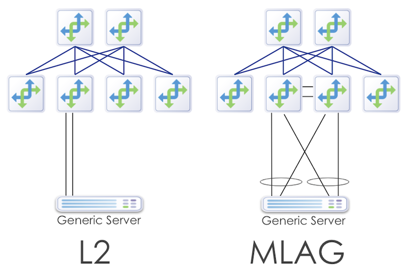

Due to the proprietary nature of L2 MLAG/CLAG/vPC implementations, mixing different vendor NOSs in an MLAG pair is impossible.  Apstra enforces this requirement when the admin creates a template.

### Layer 3 Attached Host Options

Many enterprises are gradually moving to the new L3 host connected model.  In this design, hosts are connected on routed L3 links to the leaf switches.  This has the advantage of eliminating the possibility of L2 issues and also provides a more deterministic method for connecting hosts.  These hosts run a BGP routing protocol instance in their software stack, like FRR (Free Range Routing), and peer directly with the leaf switches for routing updates.  The traffic from the host is load balanced via L3 ECMP instead of the proprietary L2 MLAG/vPC algorithms developed by each vendor.

L3 connected servers require IP addresses on each fabric facing interface, and their BGP configuration must be automated to assign neighbor ASNs, neighbor loopback addresses, and static routes pointing to the leaf switch interfaces.  When Apstra configures a leaf switch for L3 host routing, each server facing interface has an IP address that is part of a /31 subnet.  These addresses are taken from the pool assigned for this function in the Build phase.  Customers are required to create their own DHCP scopes to match the subnet being used for each interface.  Server loopback addresses are automatically admitted to the fabric through the Apstra automated route maps.

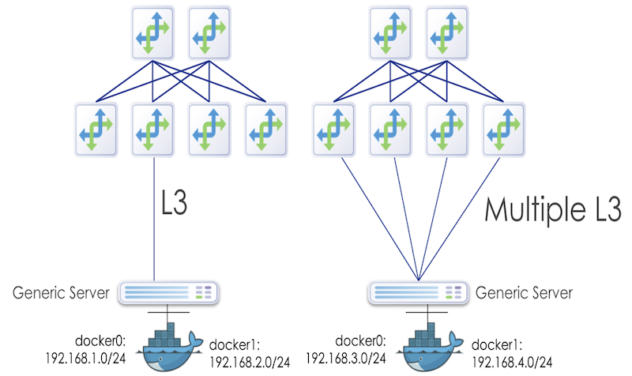

Note: Apstra can provide a script to automate this scope creation, in addition, Apstra will provide recommendations on how to properly address this requirement for customer deployments.

To automate the configuration of BGP, Apstra provides a device agent that runs on Linux servers (Debian, CentOS, Ubuntu 14.04/16.04).  This package installs the FRR routing suite, Apstra configuration, and telemetry agents.  Once the agent has been installed the server will have the proper BGP configuration deployed once the servers enter an operational state within Apstra.

Apstra includes options to configure the external routing policies, so an administrator can whitelist an ASN or range of IP subnets to be advertised.  Routes with the potential to disrupt the desired IP forwarding, such as the default route 0.0.0.0 can be blocked at the server level with a route map, which ensures that an application or misconfigured server is not able to create a traffic black hole for its neighbors.

## Multitenancy

Modern data center networks support a large number of different applications and functions, each with its own set of requirements and policies.  These systems often compete with each other for bandwidth, have overlapping private address space, and have varying security level requirements.  In order to maximize the usage of the compute farm, businesses are requiring different departments to share resources, which creates a new requirement for isolation of traffic and resource consumption according to the goals of the business.  Multitenancy is the management of these competing needs in a data center or cloud environment.

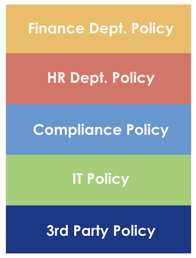

### VxLAN Overlays

The Layer 3 IP fabric deployed by Apstra has many advantages related to fault isolation.  Preventing L2 issues in the fabric is paramount, but this design limits the ability for servers to reach servers in other racks via broadcast frames.  These types of communication are typically used for cluster redundancy, backend service protocols, and application mobility.  While most new apps are built to be IP aware, there are still ongoing requirements to have L2 connectivity across the fabric.  To address these needs, the industry has standardized the use of VxLAN to carry frames across a routed core.  The VxLAN protocol is available in certain ASICs, which can handle the encapsulation of the L2 frames into routed packets.

VxLAN packets can possibly exceed the standard MTU size of 1500 bytes.  Apstra automatically adjusts the MTU size to support jumbo frames when VxLANs are enabled in the fabric.  The MTU for server-facing ports is set to 9000 and the fabric connections have their MTU set to 9050 bytes.

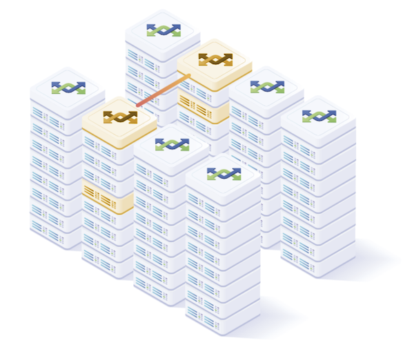

VxLAN mapping is handled automatically by Apstra, enabling servers or host devices to connect to a port using traditional 802.1q trunking.  Ports can also be configured without tagging enabled.  Apstra maps each inter-rack VLAN to a VxLAN VNI (Virtual Network Identifier).  Each VLAN number must be unique on the leaf. However the admin can specify the exact mapping on each switch if different VLAN numbers are needed per rack.

VxLAN is a protocol specification and not an architecture. Therefore it has no inherent ability to build networks without administrative configuration.  Vendors have implemented their own methods for connecting VxLANs across the fabric.  These methods are enabled either within the hypervisor of a server, or directly in the hardware and software of the ethernet switch.  Apstra currently supports using a hardware Virtual Tunnel Endpoint (VTEP) to create the tunnels through the fabric.  There are two options now available for VxLAN packet replication and routing: headend replication (HER) and EVPN.

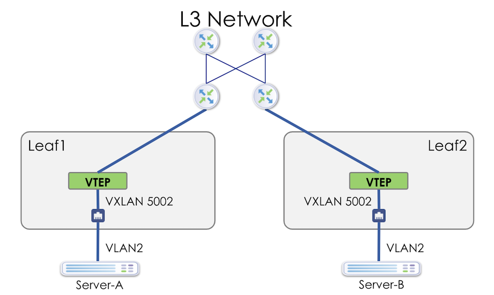

Both HER and EVPN options utilize EBGP as a routing protocol.  EBGP offers the benefits previously mentioned and using it in the overlay and underlay allows for simplified design parameters and unified telemetry.  With EBGP as a single routing protocol, the correlation between underlay and overlay routing and traffic patterns can be accomplished with the standard as-path vector.  In a static VxLAN (HER) design, the EBGP peers are created between the VTEPs for each virtual network.  In an EVPN-enabled system, the peering is established between loopbacks on each participating router within a VRF domain.

### Headend Replication (Flooding)

Headend replication, also known as static VxLAN routing, requires each switch to be configured with the VTEP IP address for all switches participating in the VxLAN.  This requires a full mesh within the configuration stanzas of the VxLANs.  Broadcast, Unicast, and Multicast (BUM traffic) packet replication and forwarding are handled by each local switch.  Because of this, there are limitations regarding the number of hosts and VxLANs that can be supported in a large environment.  The configuration of each switch contains a list of all VTEP IPs that will participate in each VNI:

```
vxlan vlan 4 vni 5003
  vxlan vlan 4 flood vtep 10.20.30.6 10.20.30.25 10.20.30.9 10.20.30.8
  vxlan vlan 10 vni 5002
  vxlan vlan 10 flood vtep 10.20.30.6 10.20.30.25 10.20.30.9 10.20.30.8
  vxlan vlan 3 vni 5001
  vxlan vlan 3 flood vtep 10.20.30.6 10.20.30.25 10.20.30.9 10.20.30.8
```

### EVPN

EVPN provides an intelligent control plane for VxLAN fabrics. EVPNs offload the management of the VxLAN networks to a multiprotocol BGP process on each switch.  Using EBGP, the switches can advertise MAC address reachability to minimize the need for switches to replicate and switch traffic at Layer 2 (flooding).  EVPNs are not currently compatible across all vendors.  Make sure your desired NOSs are supported for full interop.

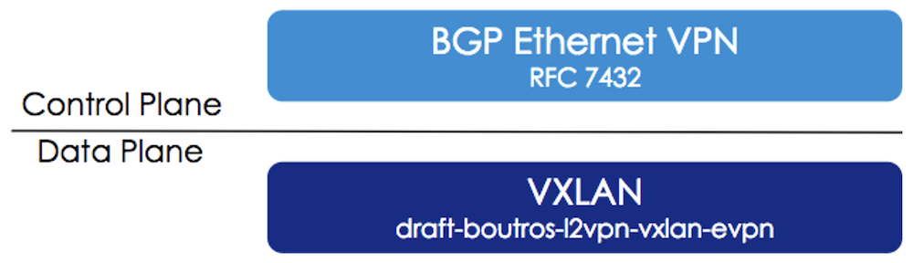

EVPN routing information is carried in separate VRFs and managed in Apstra through Routing Zones (VRFs).  Routing Zones align with tenants in an Apstra blueprint.  To route between tenants, traffic must flow to the external router.  Each VRF has a dedicated subinterface on the border routers.  In current EVPN deployments, this is done on the leaf switches acting as the border routers.  In the future, Apstra will allow administratively defined route leaking to help optimize tenant-to-tenant route flows.  Extended community attributes for EVPN support are automatically installed.

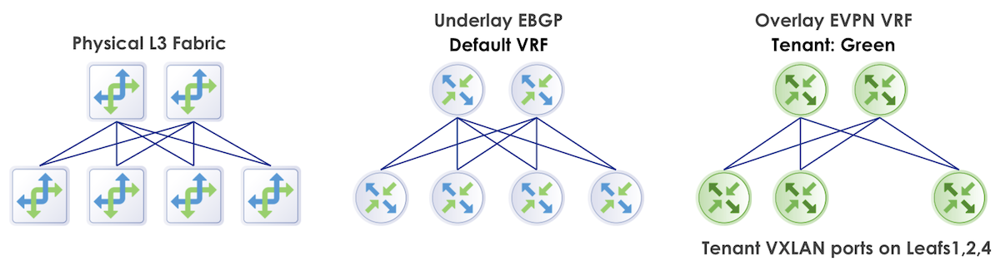

All virtual networks, both VLANs and VxLANs, are associated with a security zone.  Routing Zones automate the logical separation of networks, so the administrator does not have to create and update VRF configuration when new networks are added to a tenant.

Apstra manages EVPN-related resources - VNI Pools, Route-targets, Route-distinguishers, and VTEP IP addresses.  Managing route-targets and route-distinguishers is necessary to provide for predictable EVPN Telemetry and to work around vendor-specific 'auto' implementation limits for EVPN and EVPN address families, such as the inability to operate with iBGP or improper mapping between leafs.

EVPN is implemented in Apstra as Symmetrical Integrated Routing and Bridging (IRB), in which a Layer 3 VNI is allocated for each Tenant virtual network to carry routed traffic.  Apstra supports EVPN Type 2 (Mac and IP), EVPN Type 3 (Multicast / VTEP Flood list), and EVPN Type 5 (Tenant IP Prefix route).  Routes are automatically generated and advertised into the EVPN fabric based on the presence of virtual networks on that particular leaf switch.  If a switch does not need to participate in VRF Green, then VNIs related to VRF Green will not be configured on the switch.

To route outside Apstra Fabric, EVPN border leafs encapsulate tenant traffic underneath an 802.1q routed subinterface and peer via eBGP with an external router.  Route-leaking between VRFs is permitted via the external router, a firewall, load balancer, switch, or another device under the network administrator's control.

## EVPN and IP-Only Fabrics

IP-only fabrics are a prerequisite to EVPN fabrics to provide base connectivity -- that is, EVPN is deployed on top of an IP-only fabric. So while Apstra's primary objective is to support EVPN fabrics, we find that serving customers who only wish IP-only is easy. It's just a matter of using the initial deployment without continuing to the EVPN stage.

## ERB versus CRB

Apstra exclusively deploys Edge Routed Bridging (ERB) in its data center blueprints; Centrally Routed Bridging (CRB) is not an option. The difference between the two architectures is where inter-subnet (or inter-VN) routing occurs -- in the spine switches (CRB) or the leaf switches (ERB).

We recognize that there are cases in which CRB might be a better architectural choice, such as:

- Equipment limitations prohibiting routing at the leaf layer
- Fabrics in which the majority of traffic is North/South

However, we also recognize that the ERB advantages are more numerous, reflected in the notably wider use of ERB in data center fabrics. These advantages include:

- A widespread trend toward "intelligence at the edge" and "dumb" cores that do nothing except forward traffic. The trend was used in MPLS-based networks long before VxLAN/EVPN data center fabrics emerged.
- Leaving all the routing intelligence at the leaf layer means that spine switches can be smaller and cheaper.
- ERB is better suited for fabrics where most traffic is East/West. This is particularly true where a source and destination are on the same leaf. ERB enables routing directly on that leaf rather than requiring traffic to go to the spine to be routed, as with CRB.
- ERB is more efficient for intra-Pod traffic in 5-stage fabrics.
- By definition, a collapsed (single rack) fabric has no spine layer. ERB is required in this use case.
- CRB holds routing information in the few spine switches, whereas ERB distributes the routing information across the more numerous leaf switches. As a result, a node failure in an ERB fabric has less impact on the overall fabric (a smaller "blast radius") and reconverges quicker.

While ERB is the exclusive topology in the Apstra data center blueprints, some occasional customers require CRB -- either preferentially or because they have a production CRD architecture that cannot be easily changed. For these customers, we offer Freeform. CRB architectures are one of the original Freeform use cases.
Data Center Interconnect

Just as EVPN VxLAN works within a single site for extending Layer-2 (L2) between hosts, the DCI feature enables L2 connectivity between sites. The Apstra DCI feature allows the extension of Layer-2 or Layer-3 services between data centers for disaster recovery, load balancing of Active-Active sites, or even for facilitating the migration of services from one DC to another.

## Summary

Apstra enables corporations to quickly deploy and operate complex data center networks designed to support thousands of servers and the industry's most demanding applications.  Apstra has embedded many best practices from global service providers and hyper-scale compute environments to ensure architects optimize these networks without significant investments of time and money.  Every data center network built with Apstra automatically follows these practices and standards, freeing the designer from finding the latest white papers and reference guides.  These reference designs can be rapidly instantiated in minutes, enabling faster time to market and lower operational costs without sacrificing reliability or performance.

## Useful links

- Use of BGP for Routing in Large-Scale Data Centers: [https://trac.tools.ietf.org/html/rfc7938](https://trac.tools.ietf.org/html/rfc7938)
- Apstra User Guide: [https://www.juniper.net/documentation/us/en/software/apstra4.1/apstra-user-guide/index.html](https://www.juniper.net/documentation/us/en/software/apstra4.1/apstra-user-guide/index.html)

## Glossary

- AS-PATH: BGP Autonomous System Path attribute
- ASN: Autonomous System Number
- BFD: Bidirectional Failure Detection
- BGP: Border Gateway Protocol
- BUM: Broadcast, Unknown Unicast, Multicast
- Clos: A leaf-spine architecture in which every leaf is connected to every spine, named for Charles Clos.
- CPU: Central Processing Unit
- CRB: Centralize Routed and Bridged
- DC: Data Center
- DCI: Data Center Interconnect
- DHCP: Dynamic Host Configuration Protocol
- EBGP: External Border Gateway Protocol
- ECMP: Equal-Cost MultiPath
- EGP: External Gateway Protocol
- ERB: Edge Routed and Bridged
- ESI: Ethernet Switch Identifier Link Aggregation Group
- EVPN: Ethernet Virtual Private Network
- FRR: Free-Range Routing
- Generic System: A device connecting to the Apstra fabric but not directly controlled by Apstra
- HER: Head-End Replication
- IBGP: Internal Border Gateway Protocol
- IBN: Intent-Based Networking
- IBNS: Intent-Based Networking System
- IGP: Internal Gateway Protocol
- IP: Internet Protocol
- IRB: Integrated Routing and Bridging
- IS-IS: Intermediate System-to-Intermediate System
- ISP: Internet Service Provider
- L2: Layer 2
- L3: Layer 3
- Leaf: A switch providing access to the switching fabric
- MAC: Media Access Control
- MC-LAG: MultiChassis Link Aggregation Group
- MLAG: Multi-chassis Link Aggregation Group
- MTU: Maximum Transmission Unit
- NOS: Network Operating System
- OSPF: Open Shortest Path First
- Pod: A 3-stage component (spines and leafs) of a 5-stage Clos architecture
- POP: Point of Presence
- Spine: A DC switch connecting every leaf switch and providing a pathway to every leaf
- STP: Spanning Tree Protocol
- Superspine: A switch interconnecting spines in a 5-stage Clos architecture
- SVI: Switch Virtual Interface
- TOR: Top of Rack
- VLAN: Virtual Local Area Network
- VNI: Virtual Network Identifier
- vPC: Virtual Port Channel
- VPN: Virtual Private Network
- VRF: Virtual Routing and Forwarding
- VTEP: Virtual Tunnel Endpoint
- VxLAN: Virtual Extensible Local Area Network
- ZTP: Zero-Touch Provisioning

## Acknowledgments

This article has been co-written by Jeff Doyle and Bill Wester. This document was developed from the original work by Josh Saul.
