# Apstra Server Clustering

**Mehdi Abdelouahab - 12/09/2023**

How Apstra clustering works with respect to Off-box agents and Probe processing units

## Introduction

The Juniper Apstra standard implementation model is based on one virtual machine, a deployment model sufficient for most use cases.  However, in some situations driven either by scale or by the need for computationally intensive processing, it is required to scale out Apstra functions to maintain linear performance. From an architecture perspective, the Apstra application is designed to scale horizontally. That is achieved via Apstra clustering, which is a multi-VM deployment model where some functions can be extracted out of the main Apstra VM to be executed on multiple VMs in a true scale-out fashion where the user can add capacity as needed.

The elements that can benefit from Apstra clustering mechanisms are:

- Off-box agents
- Probe processing units

This document covers how Apstra clustering works with respect to these two features. What is not part of this document is any aspect related to High-Availability or fault tolerance of the Apstra server. That is a different topic, outside of the notion of Apstra cluster, and details can be found in the Apstra User Guide (see the Useful Links section for a hyperlink).

This document was originally written by Mehdi Abdelouahab in 2020 and updated by Adam Grochowski in 2023.

## Operating the Cluster

### Anatomy of an Apstra Cluster

An Apstra Cluster is a group of virtual machines with two roles:

- One controller VM
- Multiple worker VMs

Enabling Apstra Server Clustering does not affect how the user interacts with Apstra itself. UI and API interaction will remain on the primary (controller) Apstra VM. This also includes all interaction with the probes and associated probe output, as well as viewing anomalies within the dashboard.

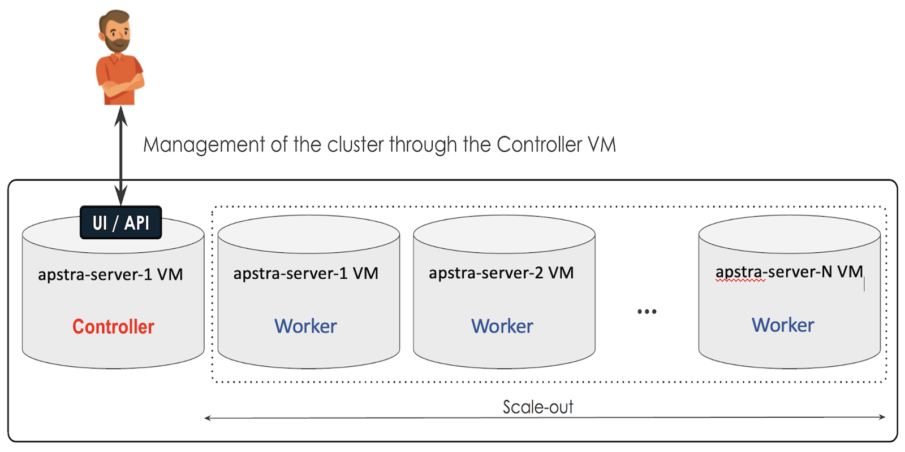

### Setting Up the Apstra Cluster

The software package for a Worker VM is the same one used to install a regular Apstra VM. To create an Apstra cluster composed of N worker nodes, deploy N+1 instances of Apstra servers, each running as different VMs. Use the same OVA file for all servers regardless of the role you plan to assign to each member VM. Before enabling the cluster, all VMs are identical. Only upon the configuration of the cluster will a difference be noticed between the member VMs based on their role. The most notable difference is that only the Controller VM will have a UI enabled.  The Controller VM it is the entry point for the management of the entire cluster, and all worker VMs will have their UI disabled. The same is true for APIs, where the controller node will be the central location for API endpoints, including any operation related to a specific worker node. This also facilitates monitoring aspects of the cluster and individual nodes.

Requirements for setting up a cluster:

- The same Apstra version must be used across the entire cluster.
- The virtual machines need standard IPv4 connectivity between them.
- There are no requirements for a shared file system between VMs, such as NFS.

> **NOTE: It's not required that all VMs be in the same Layer-2 domain even though that is advisable to facilitate the management of ACL and TCP/UDP port permissions between the Apstra instances.**

In this example, we are taking three Apstra instances that we intend to configure with the following set-up:

- aos-server-0 -> controller node.
- aos-server-1 -> worker node 1.
- aos-server-2 -> worker node 2.

Issuing a "docker ps" on the nodes before setting up the cluster will show that the initial state is identical VMs, showing 5 docker containers on each.

**VM: apstra-server-0**

```
admin@aos-server:~$ docker ps
CONTAINER ID        IMAGE                      COMMAND                  CREATED             STATUS              PORTS               NAMES
246cc5307840        aos:3.3.0-730              "/usr/bin/aos_launch..."   46 hours ago        Up 46 hours                             aos_controller_1
f0f1fcba7f56        aos:3.3.0-730              "/usr/bin/aos_launch..."   46 hours ago        Up 46 hours                             aos_metadb_1
cc1dcb0cfeed        aos:3.3.0-730              "/usr/bin/aos_launch..."   46 hours ago        Up 46 hours                             aos_auth_1
416a4e2c67f0        aos:3.3.0-730              "/usr/bin/aos_launch..."   46 hours ago        Up 46 hours                             aos_sysdb_1
9c77994e8043        nginx:1.14.2-upload-echo   "nginx -g 'daemon of..."   46 hours ago        Up 46 hours                             aos_nginx_1
```

**VM: apstra-server-1**

```
admin@aos-server:~$ docker ps
CONTAINER ID        IMAGE                      COMMAND                  CREATED             STATUS              PORTS               NAMES
94119d95d56c        nginx:1.14.2-upload-echo   "nginx -g 'daemon of..."   46 hours ago        Up 46 hours                             aos_nginx_1
55c80356fd81        aos:3.3.0-730              "/usr/bin/aos_launch..."   46 hours ago        Up 46 hours                             aos_controller_1
67ecfc0eb06f        aos:3.3.0-730              "/usr/bin/aos_launch..."   46 hours ago        Up 46 hours                             aos_metadb_1
439e2fabb415        aos:3.3.0-730              "/usr/bin/aos_launch..."   46 hours ago        Up 46 hours                             aos_sysdb_1
4af2314e9ddb        aos:3.3.0-730              "/usr/bin/aos_launch..."   46 hours ago        Up 46 hours                             aos_auth_1
```

**VM: apstra-server-2**

```
admin@aos-server:~$ docker ps
CONTAINER ID        IMAGE                      COMMAND                  CREATED             STATUS              PORTS               NAMES
ff11ffb7b8ae        aos:3.3.0-730              "/usr/bin/aos_launch..."   46 hours ago        Up 46 hours                             aos_sysdb_1
6ba44fdaa3cb        aos:3.3.0-730              "/usr/bin/aos_launch..."   46 hours ago        Up 46 hours                             aos_auth_1
0e286374ae04        aos:3.3.0-730              "/usr/bin/aos_launch..."   46 hours ago        Up 46 hours                             aos_controller_1
864d9465cbd9        aos:3.3.0-730              "/usr/bin/aos_launch..."   46 hours ago        Up 46 hours                             aos_metadb_1
bfc4eb3ff9ea        nginx:1.14.2-upload-echo   "nginx -g 'daemon of..."   46 hours ago        Up 46 hours                             aos_nginx_1
```

To set-up the cluster go to **Platform > Apstra Cluster**, click on **Create Node**, and provide the following information:

- Node name,
- Node IP address
- Apstra root admin credentials
- Tags

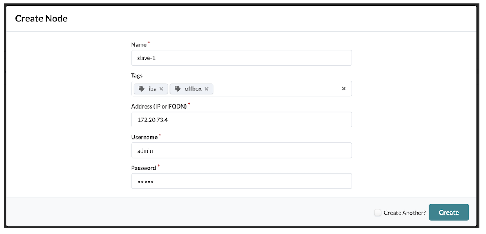

Node members of a cluster use the concept of tags for process scheduling. Tags help Apstra know whether a given node should be used to host IBA Processing Units and/or Offbox agents. The TaskScheduler process is involved in determining the individual placement based on resource utilization. By default, the controller node has both "**iba**" and "offbox" tags. In the context of a cluster setup, removing those tags from the controller VM is generally advised to keep a clean separation between node roles. Removing one or both tags from the controller node will therefore ensure that these resource-intensive processes will be executed on worker nodes and save resource utilization of the controller node for the core functions.

Upon creation, a node will appear in the **Platform > Apstra** Cluster view, and after a few seconds, its state will transition to Active if the node is reachable and meets the requirements:

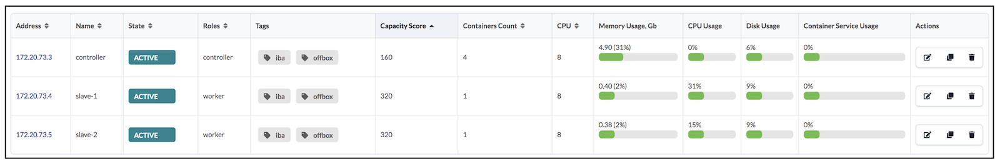

The container count column indicates the number of Docker containers running on each node. In the case of a controller node, the five initial docker containers remain, similarly to what they were before setting up the cluster configuration. The UI only counts and displays four out of the five, because it is not reporting the NGINX container. NGINX is the container hosting the web frontend part of Apstra, and responsible for the UI and API termination. Issuing the Docker terminal command docker stats --no-stream on the server shows all five containers. The Apstra cluster view of the containers on the controller node is shown below.

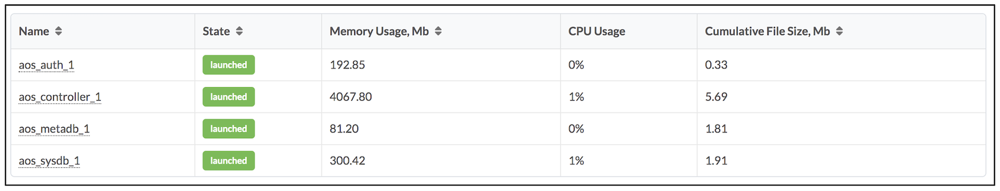

This display is equivalent to issuing a docker stats command on the server:

**VM: aos-server-0**

```
admin@aos-server:~$ docker stats --no-stream 
CONTAINER ID        NAME                CPU %               MEM USAGE / LIMIT     MEM %               NET I/O             BLOCK I/O           PIDS
246cc5307840        aos_controller_1    1.06%               4.054GiB / 15.66GiB   25.88%              0B / 0B             439MB / 410kB       167
f0f1fcba7f56        aos_metadb_1        0.30%               89.64MiB / 15.66GiB   0.56%               0B / 0B             37.3MB / 16.4kB     8
cc1dcb0cfeed        aos_auth_1          0.07%               208.5MiB / 15.66GiB   1.30%               0B / 0B             54MB / 8.19kB       7
416a4e2c67f0        aos_sysdb_1         0.48%               312.4MiB / 15.66GiB   1.95%               0B / 0B             198MB / 15.8MB      14
9c77994e8043        aos_nginx_1         0.00%               4.297MiB / 15.66GiB   0.03%               0B / 0B             17.6MB / 0B         2
admin@aos-server:~$ 
```

This command continuously reports the CPU, memory, network, and disk I/O metrics usage for containers. By default it updates the results every second, passing the option  --no-stream to *docker stats*, freezing the display for easier human reading.

The worker nodes initially show a container count of 1. That is the node_keeper container. The node_keeper container is used to watch any other container that lives on that node, being an offbox agent or IBA processing unit, so that these containers can be automatically restarted in case they are unexpectedly stopped:

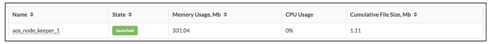

Issuing a docker ps command on the worker nodes illustrates that the aos_nginx_1 container is no longer active, indicating that the controller node acts as a single entry point.

**aos-server-1 (worker)**

```
admin@aos-server:~$ docker ps
CONTAINER ID        IMAGE               COMMAND                  CREATED              STATUS              PORTS               NAMES
0d3af03953d1        aos:3.3.0-730       "/usr/bin/aos_launch..."   About a minute ago   Up About a minute                       aos_node_keeper_1
admin@aos-server:~$ 
```

**aos-server-2 (worker)**

```
admin@aos-server:~$ docker ps
CONTAINER ID        IMAGE               COMMAND                  CREATED             STATUS              PORTS               NAMES
e8332b5843fd        aos:3.3.0-730       "/usr/bin/aos_launch..."   21 seconds ago      Up 20 seconds                           aos_node_keeper_1
admin@aos-server:~$ 
```

### How Scheduling Works

Once a node is part of a cluster, it is eligible to be used for resource distribution. The TaskScheduler is responsible for scheduling the resources on available VMs. It monitors the creation of off-box agents and IBA probes, and schedules the deployment of Offbox agents containers and IBA processing unit containers on the different VMs based on the tags assigned and the resource utilization of the VMs.

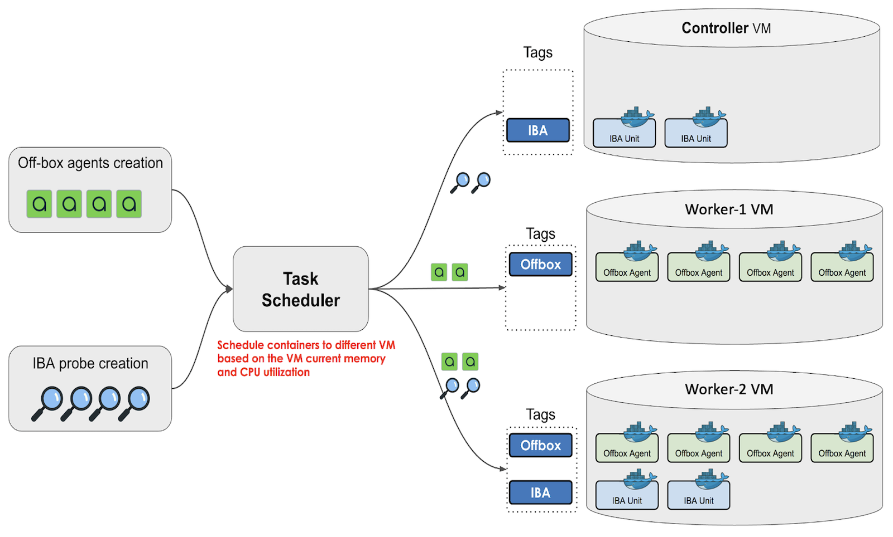

It is possible to move resources between VMs by removing a tag on a node. For example,  removing the offbox tag on Worker-1 VM moves all offbox containers running on that server to Worker-2, another node labeled with the offbox tag, hence eligible to host these containers. This process helps for maintenance purposes to gracefully free a node and accommodate required maintenance operations. In the case of offbox agents, observing a liveness anomaly on Apstra for a few seconds is possible, but that has no implication on data-plane traffic. However, ensure no Blueprint commit operations occur during the reassignment of tags to avoid any deployment errors. Note that reassigning the offbox tag on that Worker-1 node does not trigger a change and restore the resources back on that node. While a given node has enough CPU and memory resources to host containers, the Task scheduler does not trigger any change in the allocation pattern. New container creation and any change in label assignment to other nodes generate a resource deployment on that node based on its labels.

When creating an offbox agent or a new IBA probe Apstra informs the user of a lack of CPU/memory resources in the cluster to deploy that element. You may need to increase the number of worker nodes and their allocated compute resources or simply review your tag assignment strategy. Below is an example of an error message at IBA probe creation time.

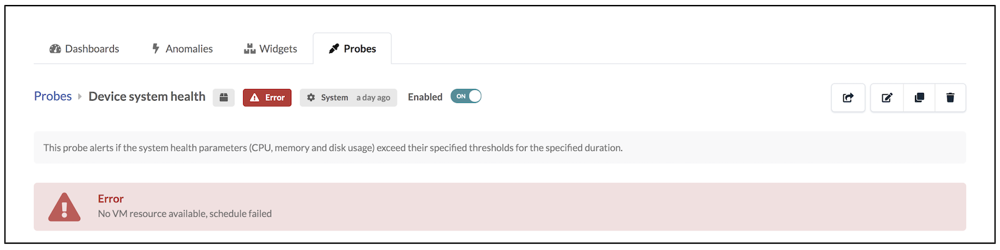

## Scaling-Out Resources

### Offbox Agents

Creating off-box agents follows the same procedure as on-box agents by navigating the **Devices > Agents** menu and selecting the **OFFBOX** tab. Alternatively, if you rely on the Apstra ZTP server for the system-agents installation, you just have to set the agent mode in the ztp.json file. Below is an example of setting that for Junos devices.

```
...
  "Junos": {
      ...
    ],
    "system-agent-params": {
      "username": "root",
      "platform": "junos",
      "agent_type": "offbox",  <----
      "install_requirements": true,
      "password": "admin",
      "operation_mode": "full_control"
    },
    "device-root-password": "root123"
  },
  "defaults": {
    ...
  }
}
```

Once system agents are deployed, you can go back to the **Platform > Apstra Cluster** page to validate an increase in the number of containers deployed on the nodes by checking the "containers count" column. A node from the cluster will only get an offbox agent deployed if it has the offbox tag. By default the controller node has both iba and offbox tags.

The below screen capture shows an environment where four offbox agents were created. They have been deployed by Apstra on both worker nodes (aos-server-1 and aos-server-2). Notice the container count column indicating that two additional containers exist on every worker node:

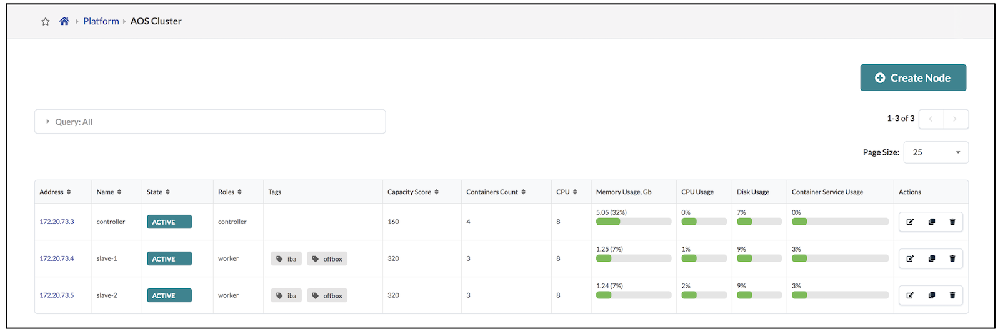

You can obtain the list of Docker containers by clicking on a specific node. This display is equivalent to issuing a docker stats command on the server.  The naming convention is aos-offbox<mgmt_ip_address>-f.

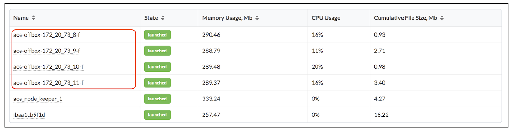

Notice that CPU and disk usage are negligible. RAM is the most important sizing factor. Depending on the NOS, an off-box agent consumes between 250 MB and 750 MB of RAM. In the case of a Juniper off-box agent, consider 750 MB of RAM in medium-/large-scale deployments.

Alternatively, you can find what cluster node is hosting a specific system-agent container by navigating in the **Device > Agents** page, where you can see a hyperlink pointing you to the cluster node for each system agent:

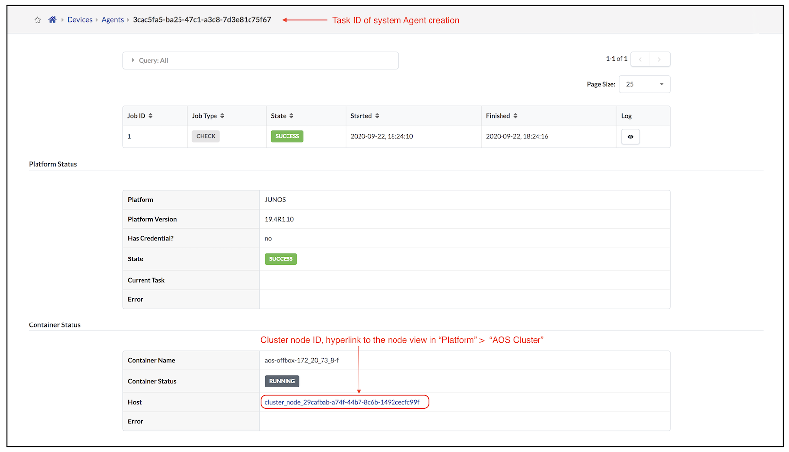

### IBA Processing Units

An "IBA Processing Unit" is fundamentally a group of IBA-related agents, which are processes responsible for managing the creation and operation of an IBA probe and its related analytic pipeline. Within an IBA probe, there is either real-time data transiting in the pipeline or sometimes long-term data kept for retention purposes. All storage of this data in Apstra is handled in memory and lives in the controller node; it is not part of the Apstra clustering mechanism. Only the processing part of the pipeline, which contains the analytics operation and reasoning on this data, is subject to the Apstra clustering and scale-out in the form of IBA unit containers.

Each IBA processing unit is a Docker container. One IBA processing unit can handle more than one probe, and new IBA units are automatically deployed as more probes are created. The resource allocation and scheduling are handled by the IBA scheduler process, which lives on the controller node and monitors IBA probe creation by the user. When a new probe is created, the IBA scheduler will perform the following:

- 1. Determine if the probe can be scheduled into one of the existing IBA processing units.
- 2. If the creation of a new IBA processing unit is required, it determines what worker nodes are selected to host it based on resource utilization.

You obtain the list of Docker containers by clicking on a specific node.  The naming convention for IBA processing unit container is iba<uuid>:

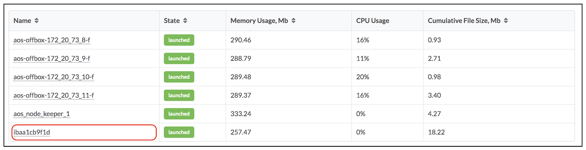

## Monitoring the Cluster

### Node Specific Monitoring

When selecting a node in **Platform > Apstra Cluster**, Apstra displays a usage section that lists several metrics and statistics to measure the node's health in the context of its membership to the Apstra cluster:

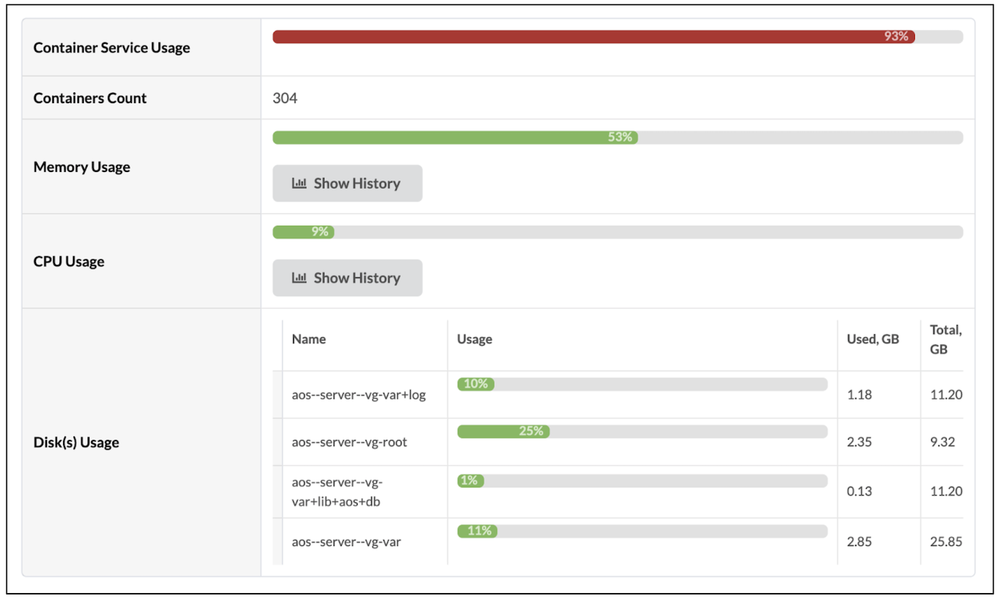

The first information listed relates to the running containers and how that number relates to the memory limits of that node. Notice in the example above the two lines showing a total count of 304 containers and the container service usage being at 93% with a red color to flag that as a high proportion.

The containers service usage metric is an important metric from a monitoring standpoint because it is used by TaskScheduler to schedule containers on the various nodes. The containers service usage value is a percentage calculated using the following logic:

- For a controller node: Total RAM (Mb) / (standard_memory_usage) / 2
- For a worker node: Total RAM (Mb) / (standard_memory_usage)

"Standard_memory_usage" value is a configuration parameter that represents the memory a Docker container must have to function properly. That value is set by default to 250MB for offbox agents and to 1000MB for IBA processing units. Those values can be modified by the user through API calls:

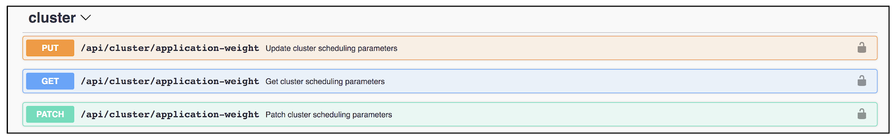

Additionally, the scheduling of IBA processing units has another configuration setting related to the number of IBA probes a given processing unit can handle. This number is set to 20 by default, and Apstra will schedule the first 20 probes on the first IBA processing unit container and create a second container starting for the 21st probe. You can change that number to a lower value using the following API endpoint:

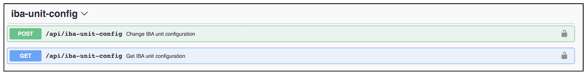

The rest of the usage section displays CPU, memory, and disk utilization. CPU and memory keep recent history and allow either a 2-minute or 1-hour average display.

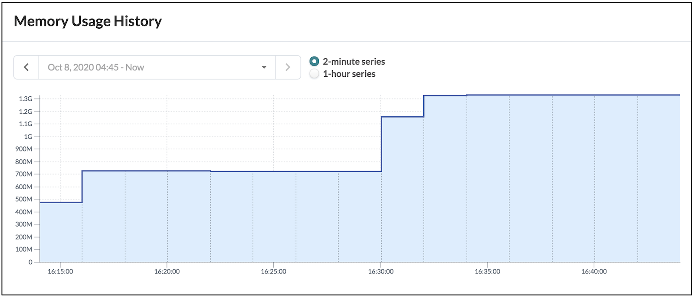

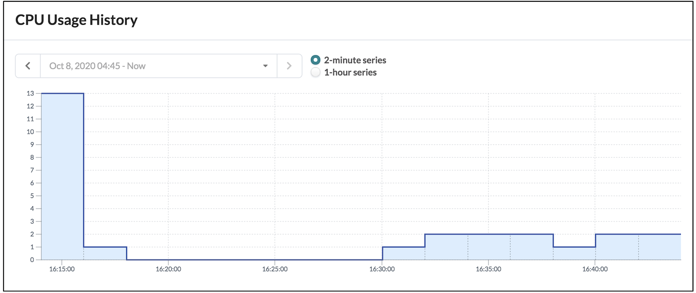

### Container-Specific Monitoring

The previous sections displayed the "containers" table of every node. That shows the running containers list along with their state and consumed resources. By clicking into a container, Apstra displays more information related to the processes inside that container. This represents  Apstra application-oriented monitoring and provides information about the Apstra agents inside a given container. Any container, offbox agent, or IBA processing unit hosts several processes, which we call Apstra agents.

See below the output for an offbox docker container, followed by the same output for an IBA processing unit container.

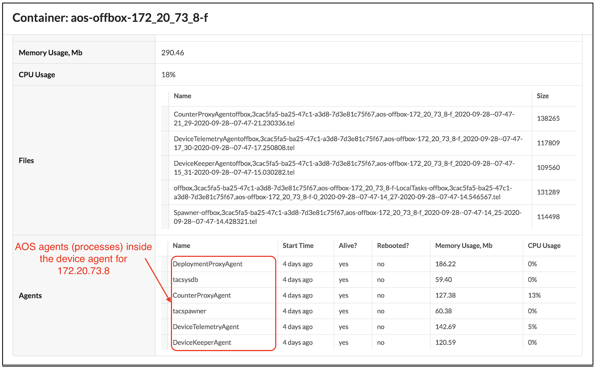

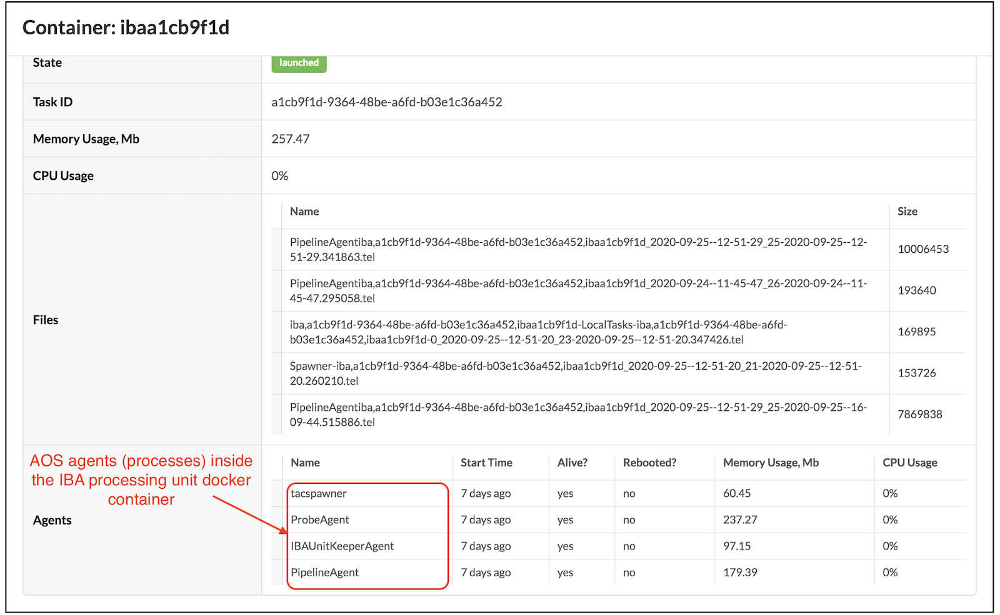

### API-Based Monitoring

Apstra exposes API endpoints to query for all information displayed in the UI. Using the API to monitor the cluster is useful when that monitoring has to be done regularly by a tool instead of a human watching screens. Check Apstra's REST API Documentation which uses an OpenAPI framework (Swagger) to find out more about the endpoints and their data format for both input parameters and output.

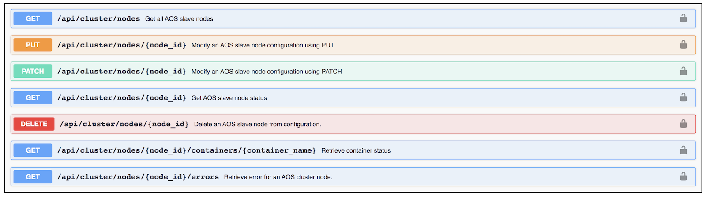

The following API call lists all nodes in the cluster and their status.

```
john@Johns-MacBook-Pro-2 ~/Downloads $ curl -X GET \
>   "https://$Apstra_CONTROLLER_SERVER_IP/api/cluster/nodes" \
>   -k \
>   -H "accept: application/json" \
>   -H "content-Type: application/json" \
>   -H "AUTHTOKEN: $Apstra_TOKEN" \
>   -o nodes.json
  % Total    % Received % Xferd  Average Speed   Time    Time     Time  Current
                                 Dload  Upload   Total   Spent    Left  Speed
100 16308    0 16308    0     0  19848      0 --:--:-- --:--:-- --:--:-- 19839
john@Johns-MacBook-Pro-2 ~/Downloads $ 
```

The response provides a data structure in JSON, where the output could be long. Using a Jsonquery parser helps navigate and extract only specific information. Below is an example extracting five fields only:

- Node name
- Node ID
- State
- IP address
- Number of containers

```
john@Johns-MacBook-Pro-2 ~/Downloads $ cat nodes.json | jq '.items[] | {label: .label, id: .id, role: .roles[0], address: .address, state: .state, num_containers: .num_containers}'
{
  "label": "aos-worker-1",
  "id": "cluster_node_c39ea5c5-afc1-4067-b8c9-77099590b576",
  "role": "worker",
  "address": "172.20.73.4",
  "state": "active",
  "num_containers": 4
}
{
  "label": "controller",
  "id": "AosController",
  "role": "controller",
  "address": "172.20.73.3",
  "state": "active",
  "num_containers": 4
}
{
  "label": "aos-worker-2",
  "id": "cluster_node_d8e92ae5-e187-496d-a6c1-f9269624f73f",
  "role": "worker",
  "address": "172.20.73.5",
  "state": "active",
  "num_containers": 3
}
john@Johns-MacBook-Pro-2 ~/Downloads $ 
```

You can use the ID from this output to pass in a second API call to request all detailed information of a specific node, for example, aos-worker-1:

```
john@Johns-MacBook-Pro-2 ~/Downloads $ curl -X GET \
>   "https://$Apstra_CONTROLLER_SERVER_IP/api/cluster/nodes/cluster_node_c39ea5c5-afc1-4067-b8c9-77099590b576" \
>   -k \
>   -H "accept: application/json" \
>   -H "content-Type: application/json" \
>   -H "AUTHTOKEN: $Apstra_TOKEN" \
>   -o node_worker_1.json
  % Total    % Received % Xferd  Average Speed   Time    Time     Time  Current
                                 Dload  Upload   Total   Spent    Left  Speed
100 13402    0 13402    0     0  14705      0 --:--:-- --:--:-- --:--:-- 14695
john@Johns-MacBook-Pro-2 ~/Downloads $
```

Similarly you can use a Jsonquery parser to extract only specific information and organize them in a given way. The example below requests high-level information on the node, such as its label, its IP address, its state, and any errors, as well as the list of containers described via their name, type and state.

```
john@Johns-MacBook-Pro-2 ~/Downloads $ cat node_1.json | jq '{label: .label, id: .id, role: .roles[0], address: .address, state: .state, erros: .errors, num_containers: .num_containers, containers: [.containers[]  | {name: .name, type: .type, state: .state}]}'
{
  "label": "aos-worker-1",
  "id": "cluster_node_c39ea5c5-afc1-4067-b8c9-77099590b576",
  "role": "worker",
  "address": "172.20.73.4",
  "state": "active",
  "erros": [],
  "num_containers": 4,
  "containers": [
    {
      "name": "aos-offbox-172_20_73_10-f",
      "type": "offbox",
      "state": "launched"
    },
    {
      "name": "iba1468a5d4",
      "type": "iba",
      "state": "launched"
    },
    {
      "name": "aos-offbox-172_20_73_8-f",
      "type": "offbox",
      "state": "launched"
    },
    {
      "name": "aos_node_keeper_1",
      "type": "Apstra_BASE",
      "state": "launched"
    }
  ]
}
john@Johns-MacBook-Pro-2 ~/Downloads $
```

> **A Final Note: Requesting Apstra show-tech on the controller uses the same procedure whether you have a single controller or a controller cluster with multiple worker nodes.**

## Summary

Managing the Apstra server size and monitoring its resource usage is essential to scaling the Apstra controller. Offbox agents and IBA probes are the largest potential resource hogs, and a server cluster can be created to offload these functions to multiple worker nodes.

## Useful links

- Apstra User Guide on Server Clustering:
[https://docs.google.com/document/d/1jwaCtph1xhIpFGrlF3S57eq9j3LLGMoaows1JqW_HLA/edit](https://docs.google.com/document/d/1jwaCtph1xhIpFGrlF3S57eq9j3LLGMoaows1JqW_HLA/edit)
- The Apstra Upgrade workflow, including worker nodes as discussed in this document, is found here:
[https://www.juniper.net/documentation/us/en/software/apstra4.1/apstra-install-upgrade/topics/ref/apstra-server-upgrade-workflow.html](https://www.juniper.net/documentation/us/en/software/apstra4.1/apstra-install-upgrade/topics/ref/apstra-server-upgrade-workflow.html)

## Glossary

- ACL: Access Control List
- API: Application Programming Interface
- I/O: Input/Output
- IBA: Intent-Based Analytics
- IPv4: Internet Protocl version 4
- JSON: JavaScript Object Notation
- NFS: Network File System
- NOS: Network Operating System
- OVA: Open Virtual Appliance
- TCP: Transmission Control Protocol
- UDP: User Datagram Protocol
- UI: User Interface
- VM: Virtual Machine

## Acknowledgements

This document was originally written by Mehdi Abdelouahab in 2020 and updated by Adam Grochowski in 2023.
