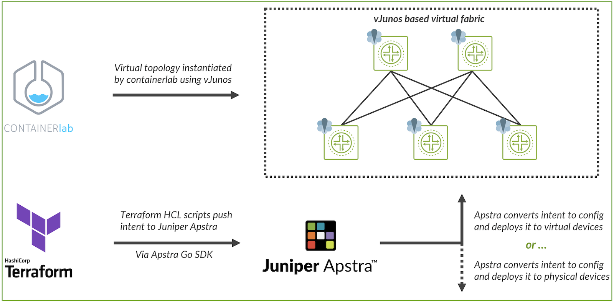
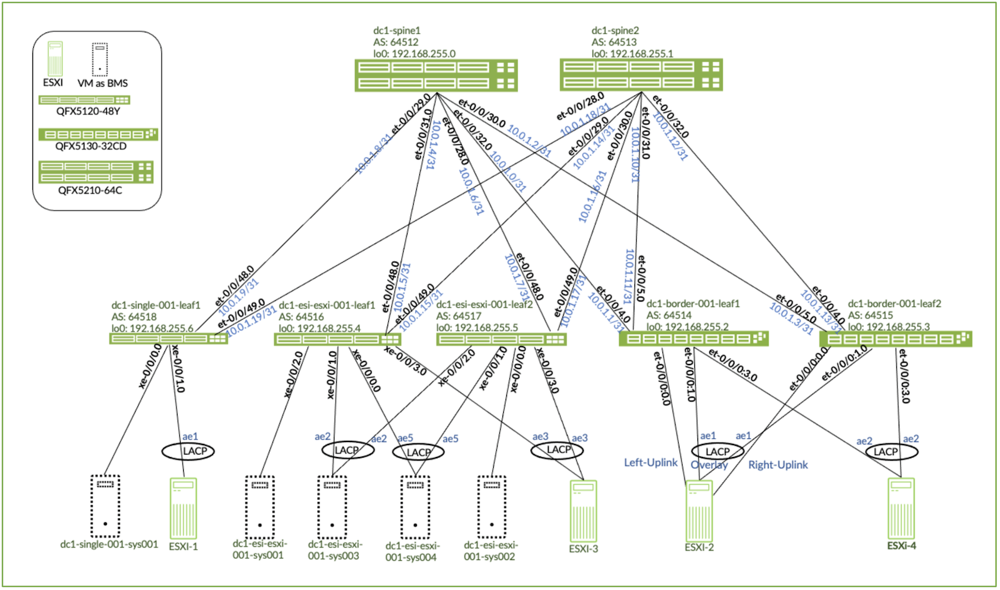
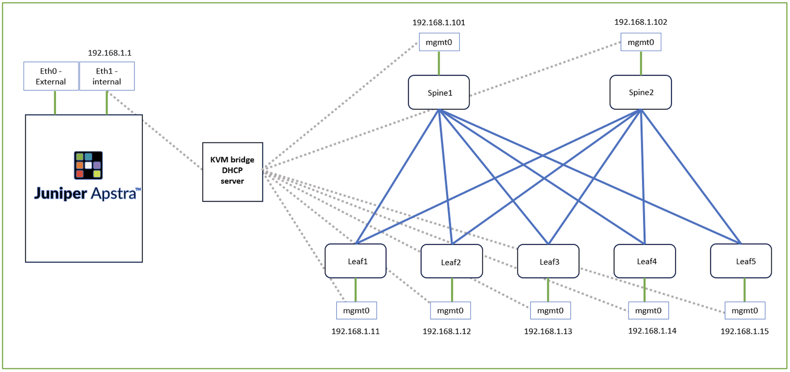
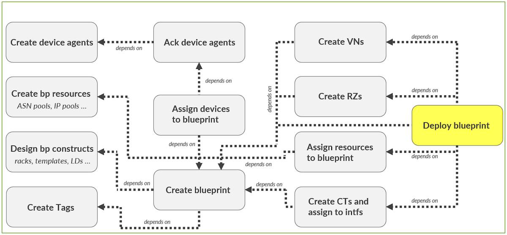
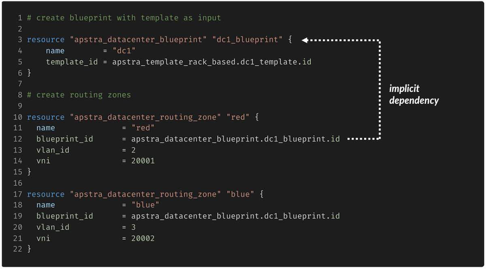
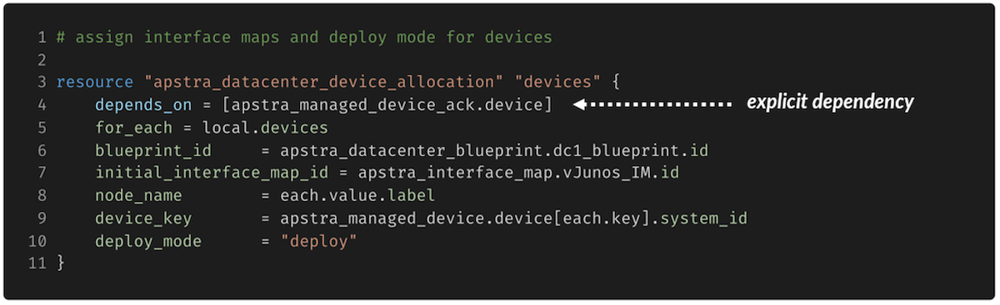
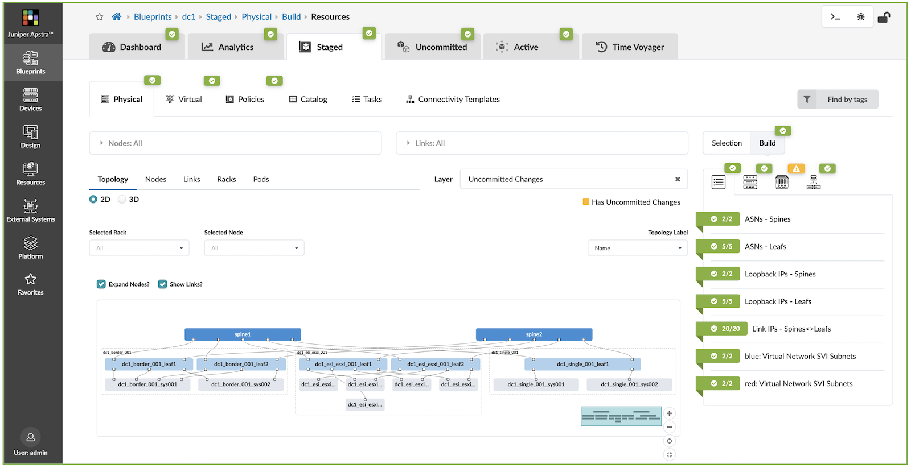

# Automating 3-stage Clos fabric with Terraform and Apstra

**Vivek V - 12/03/2023**

The Juniper Apstra SDK, written in Golang, integrates Apstra into the Terraform ecosystem, enabling an Apstra specific provider.

## Introduction

This article explains the automated deployment of a 3-stage Clos fabric with EVPN VXLAN using Terraform as the automation platform. The Juniper Apstra SDK, written in Golang, integrates Apstra into the Terraform ecosystem, enabling an Apstra specific provider. This provider can be utilized to write HCL based Terraform scripts to perform management operations on a network fabric via an Apstra instance on a physical or virtual network.

Juniper Validated Designs (JVDs) provide design and deployment recommendations for various kinds of network fabrics, routed and routing protocols, and services that have been validated and optimized for a Juniper datacenter network.

By choosing to implement a JVD for their DC, a user can be confident about the functioning and efficiency of various networking components and protocols in use in the data center.

Automated implementation of JVDs over manual deployment satisfies two primary needs: simplified  deployment and minimizing human error. By using the JVD Terraform examples repository provided by Juniper, one can orchestrate a DC Clos fabric end to end with minimal tweaks and changes.

Automating infrastructure with Juniper Apstra and Terraform lets us leverage various features and benefits of both platforms such as idempotency and configuration abstraction, which makes network fabrics elegant to deploy, and easy to scale.

## Components and Architecture



### Components

- [Containerlab](https://containerlab.srlinux.dev/) is an open-source network emulation tool that offers users the ability to deploy virtual network operating systems as containers -- As shown in the diagram, we have used Containerlab to deploy a skeletal virtual fabric which will emulate the DC network to be onboarded.
- [vJunos-switch](https://support.juniper.net/support/downloads/?p=vjunos) is a new VM-based virtual software offering from Juniper Networks, which emulates the software functionality of a Junos OS switch. This VM is packaged into a container and used   to create a virtual fabric via veth   pairs orchestrated by Containerlab.
- [Juniper Apstra](https://www.juniper.net/us/en/forms/apstra-free-trial.html) intent-based networking software orchestrates and validates design and deployment of datacenters. Apstra plugs into the virtual fabric in our scenario to construct the datacenter.
- [Apstra Terraform Provider](https://registry.terraform.io/providers/Juniper/apstra/latest/docs) allows Terraform to control Juniper Apstra managed fabrics.
- [Terraform](https://www.terraform.io/) is the infrastructure automation platform in use, which uses its Hashicorp Configuration Language (HCL) to automate network deployments.

## 3-Stage Clos JVD

The JVD automation that is being discussed in this document is for the 3 Stage (ERB) Datacenter design as showing in the diagram below. Further information about the JVD can be found here.



### Containerlab & vJunos  -switch

Wireframe topologies that have basic configuration such has layer 1 connectivity, management IPs, and other basic configuration can be deployed within Containerlab via yaml files as shown below. The vJunos-switch images are wrapped in containers and connected via veth pairs to form a topology , the connectivity can be declared in the "links" section of the YAML file.

*Output 1: Containerlab Topology YAML file*

```
#cat topology.yml
name: test-lab
mgmt:
  bridge: virbr0
  ipv4-subnet: 192.168.122.0/24
topology:
  nodes:
    spine1:
            kind: vr-vjunosswitch
            image: vrnetlab/vr-vjunosswitch:23.2R1.14
            mgmt-ipv4: 192.168.122.101
            startup-config: spine1.cfg
    spine2:
            kind: vr-vjunosswitch
            image: vrnetlab/vr-vjunosswitch:23.2R1.14
            mgmt-ipv4: 192.168.122.102
            startup-config: spine2.cfg
    leaf1:
            kind: vr-vjunosswitch
            image: vrnetlab/vr-vjunosswitch:23.2R1.14
            mgmt-ipv4: 192.168.122.11
            startup-config: leaf1.cfg
    leaf2:
            kind: vr-vjunosswitch
            image: vrnetlab/vr-vjunosswitch:23.2R1.14
            mgmt-ipv4: 192.168.122.12
            startup-config: leaf2.cfg
  links:
          - endpoints: ["leaf1:eth1", "spine1:eth1"]
          - endpoints: ["leaf1:eth2", "spine2:eth1"]
          - endpoints: ["leaf2:eth1", "spine1:eth2"]
          - endpoints: ["leaf2:eth2", "spine2:eth2"]
--snip---
```

Once the YAML for the JVD topology has been deployed, the Containerlab wireframe is as shown in the figure below.

*Output 2: Containerlab inspect wireframe.*

```
root:# containerlab inspect -t /home/anindac/jvd/jvd1/jvd-topology.yml 
INFO [0000] Parsing & checking topology file: jvd-topology.yml
+----+-----------------+--------------+------------------------------------+-----------------+---------+-------------------------+-----------------+
| #  | Name               | Container ID         | Image                                        | Kind           | State   | IPv4 Address   | IPv6 Address |
+----+-----------------+--------------+------------------------------------+-----------------+---------+-------------------------+------------------+
| 1  | clab-jvd-h1      | 0600fa555186      | aninchat/host:v1                    | linux           | running | 192.168.122.51/24  | N/A |
| 2  | clab-jvd-h2      | 5782ee8c57e        | aninchat/host:v1                    | linux           | running | 192.168.122.52/24  | N/A |
| 3  | clab-jvd-h3      | 08ed1dbed156     | aninchat/host:v1                   | linux           | running | 192.168.122.53/24  | N/A |
| 4  | clab-jvd-h4      | 589af03406ec      | aninchat/host:v1                   | linux           | running | 192.168.122.54/24  | N/A |
| 5  | clab-jvd-h5      | 4548763cc66a     |  aninchat/host:v1                   | linux           | running | 192.168.122.55/24  | N/A |
| 6  | clab-jvd-h6      | cb316f51ef9b       | aninchat/host:v1                    | linux           | running | 192.168.122.56/24  | N/A |
| 7  | clab-jvd-h7      | 97764bc89357     | aninchat/host:v1                   | linux           | running | 192.168.122.57/24  | N/A |
| 8  | clab-jvd-h8      | ecf2acbedcea        | aninchat/host:v1                    | linux           | running | 192.168.122.58/24  | N/A |
| 9  | clab-jvd-h9       | d678456cf476    | aninchat/host:v1                    | linux           | running | 192.168.122.59/24  | N/A |
| 10 | clab-jvd-leaf1  | d3d9f9ffb4fb      | vrnetlab/vr-vjunosswitch:23.2R1.14 | vr-vjunosswitch | running | 192.168.122.11/24  | N/A |
| 11 | clab-jvd-leaf2  | 94a9f89ee700    | vrnetlab/vr-vjunosswitch:23.2R1.1  | vr-vjunosswitch  | running | 192.168.122.12/24  | N/A |
| 12 | clab-jvd-leaf3  | d2839134f91b   | vrnetlab/vr-vjunosswitch:23.2R1.14 | vr-vjunosswitch | running | 192.168.122.13/24  | N/A |
| 13 | clab-jvd-leaf4  | f1be1080df0d    | vrnetlab/vr-vjunosswitch:23.2R1.14 | vr-vjunosswitch | running | 192.168.122.14/24  | N/A |
| 14 | clab-jvd-leaf5  | 97371a0cd068   | vrnetlab/vr-vjunosswitch:23.2R1.14 | vr-vjunosswitch | running | 192.168.122.15/24  | N/A |
| 15 | clab-jvd-spine1 | 074445d6c39a | vrnetlab/vr-vjunosswitch:23.2R1.14 | vr-vjunosswitch | running | 192.168.122.101/24 | N/A |
| 16 | clab-jvd-spine2 | a4c5189eea26 | vrnetlab/vr-vjunosswitch:23.2R1.14 | vr-vjunosswitch | running | 192.168.122.102/24 | N/A |
+----+-----------------+--------------+------------------------------------+-----------------+---------+--------------------+---------------+-----------+
```

We can see here that all the nodes have received management ip addresses in the 192.168.1.0/24 range which in our scenario is the same DHCP   scope as the KVM   bridge. Once this fabric has been deployed, we can start the integration process with the Apstra server.

## Deploying Juniper Apstra along with the virtual fabric



Once the virtual fabric has been defined via the YAML topology file, the next step is to deploy the virtual fabric. The key focus at this stage is to make sure that the management IP   addresses of the devices in the fabric and have reachability from the Apstra server. This can be achieved via two mechanisms, the reachability between the Apstra server KVM and Containerlab nodes can be established by manipulating the host route   tables, or by connecting the management interfaces of the virtual network nodes and the Apstra instance to the same bridge within the Containerlab server, as shown in the figure above.

The Apstra version used for the purposes of this demonstration is Apstra 4.1.2. In our design example, we have deployed an Apstra server as a KVM virtual machine and connected it to a virtual fabric, but the scope of this automation can be extended to orchestrate via a BMS  (bare metal server) Apstra server and a physical topology as well.

## Terraform

Terraform is an IaC (Infrastructure as Code) tool that is primarily used in cloud orchestration and provisioning. Terraform has gained traction rapidly in the cloud automation space, due to its ability to codify infrastructure.

With Terraform, a declarative configuration tool, one can specify the desired state of the infrastructure rather than describing the step-by-step provisioning process. The infrastructure configurations are written in a human-readable domain specific language (HCL) which maintains a state and thus enables version control.

Terraform uses a plan and apply mechanism, where operators get a preview of the potential changes that are about to be made to the infrastructure and avoid unintended modifications. Once the plan phase has been seen and verified, the user can apply the plan to the infrastructure.

*Output 3: Terraform Plan output.*

```
# apstra_template_rack_based.dc1_template will be created
+ resource "apstra_template_rack_based" "dc1_template"  {
        + asn_allocation_scheme         = "unique"
        + id                            = (known after apply)
        + name                          = "dc1_template"
        + overlay_control_protocol      = "evpn"
        + rack_infos                    = (known after apply)
        + spine                         = {
                            + count                      = 2
                            + logical_device             = (known after apply)
                            + logical_device_id          = (known after apply)
                            + tags                       = (known after apply)


        }
    }
Plan: 68 to add, to change, to destroy.
```

## Components of the JVD Automation Terraform Repository

### Provider.tf

The provider file contains the information about the various types of resources that are going to be used in the project. For example, if we want to create an S3 bucket on AWS the provider details will include the AWS API endpoints, credentials, and connection method. In this case, since the orchestration is done via Juniper Apstra, we will need to provide the information of our Apstra instance.

Multiple providers can be mentioned in this file based on the different types of resources that are required to orchestrate the network but for the scope of this document Apstra is the only provider required.

> NOTE: Please make sure that the Terraform instance has network reachability to the Apstra IP mentioned in the provider.

*Output 4: Terraform Provider file.*

```
root@dc-tme-bigtwin-01:/home/anindac/jvd/jvd1/automation# cat provider.tf 
Terraform {
    required_providers {
        apstra = {
            source = "Juniper/apstra"
        }
    }
}

## provider details


provider "apstra" {
    url = "https://[username]:[password]@[ip-address]:443"
    tls_validation_disabled = true
    blueprint_mutex_enabled = false
    # experimental = true
}
--snip--
```

### Resources.tf

The resource file contains the various resources that are required to configure different elements of the fabric. The convention for a resource definition is the keyword "resource" with the "resource type" and then the "resource name" followed by the constructs of the resource as show in the output below.

A full list of all available resources for the Juniper Apstra provider can be found here.

*Output 5: Terraform Resources file.*

```
root@dc-tme-bigtwin-01:/home/anindac/jvd/jvd1/automation# cat resources.tf 
# create fabric resources


resource "apstra_ipv4_pool" "loopback" {
  name = "loopback"
  subnets = [
    { network = "192.168.255.0/24" }
  ]
}


resource "apstra_ipv4_pool" "evpn_loopback" {
  name = "evpn_loopback"
  subnets = [
    { network = "192.168.11.0/24" }
  ]
}


resource "apstra_ipv4_pool" "p2p" {
  name = "p2p"
  subnets = [
    { network = "10.0.1.0/24" }
  ]
}


resource "apstra_asn_pool" "asn_pool" {
  name = "asn_pool"
  ranges = [
    {
      first = 64512
      last  = 64999
    }
  ]
--snip--
```

### Other Terraform files required for JVD automation.

From the output below we can see that there are few more files that listed to orchestrate the JVD. These files are specific to the Apstra implementation of network protocols. One can draw parallels in a way that each ".tf" file here would represent a module in Apstra that needs to be implemented to deploy a blueprint. The purpose of each of these modules are present inline with the HCL code on the Terraform repository.

*Output 6: Terraform required files.*

```
-rw-r--r-- 1 root root 1294 Sep 20 04:11 ack_devices.tf
-rw-r--r-- 1 root root 4348 Sep 20 04:11 blueprint.tf
-rw-r--r-- 1 root root 7670 Sep 16 09:13 ct.tf
-rw-r--r-- 1 root root  893 Oct 12 08:52 interface_map.tf
-rw-r--r-- 1 root root  307 Oct 12 08:52 logical_device.tf
-rw-r--r-- 1 root root 1262 Oct 12 08:53 onboard_devices.tf
-rw-r--r-- 1 root root 5099 Oct 12 08:58 rack.tf
-rw-r--r-- 1 root root 1457 Sep 14 15:22 routing_zones.tf
-rw-r--r-- 1 root root  218 Oct 12 08:53 tags.tf
-rw-r--r-- 1 root root 4393 Sep 15 07:30 virtual_networks.tf
```

## Apstra-Terraform Object/Workflow Dependency

The final step in an Apstra workflow is the deployment of a blueprint. To deploy the blueprint Apstra requires various modules and submodules to be created as shown in the figure below.



While the regular users of Apstra might find this intuitive as they manually create each component in a sequence before moving on to the next, this doesn't pose a challenge, however, since Terraform executes all the processes in parallel, there can be a race condition where a required module isn't present when it tries to create a superset module and hence the entire deployment fails and Terraform exists the workflow.

To circumvent the challenge mentioned above, we must use dependency constructs within Terraform to make sure that all the submodules are operational before it tries to create a dependent module and the execution continues unobstructed.

### Terraform Dependency Constructs

Implicit dependencies in Terraform as shown in the output below call on variables that will only be returned if the corresponding dependent function has been completed. Hence, though the execution of both resources begin in parallel, by stating that a resource inherits this variable, in this case dc1.blueprint.id, the routing zone resource will wait for the blueprint resource to return that variable after execution to complete its own execution.



Another mechanism that can be utilized is the "Explicit Dependency" wherein we can explicitly state as shown in the diagram below that the resource completion requires another resource to complete its execution.



## Apstra Blueprint

Once all the dependencies have been met, and all the modules have been created, Juniper Apstra will push all these changes in the intended order to the fabric, thus configuring it from its skeletal form with only management IP's and basic configuration to a fully functional Juniper validated CLOS fabric.



## Summary

To summarize, this post shows the automation of a 3-stage clos fabric JVD with Terraform and Apstra. It also outlines in brief the deployment of a virtual fabric which can be used to test and validate the design before applying it to physical infrastructure. We discussed the various benefits of using Terraform and Apstra and the various dependencies and resources that are required withing Terraform and Apstra to automate infrastructure.

## Useful links

- 3-Stage Clos JVD Automation Repo --
[https://github.com/Juniper/terraform-apstra-examples/tree/master/jvd-tf-automation/3-stage-jvd-automation](https://github.com/Juniper/terraform-apstra-examples/tree/master/jvd-tf-automation/3-stage-jvd-automation)
- Juniper Networks Virtual Switch software downloads - [https://www.juniper.net/us/en/dm/vjunos-labs.html ](https://www.juniper.net/us/en/dm/vjunos-labs.html)
- Containerlab home page -[ https://containerlab.dev/ ](https://containerlab.dev/)
- Juniper Apstra documentation - https://www.juniper.net/documentation/product/us/en/apstra/
Terraform Apstra SDK -[ https://registry.Terraform.io/providers/Juniper/apstra/latest/docs](https://registry.Terraform.io/providers/Juniper/apstra/latest/docs)

## Acknowledgments

- Aninda C -- TME, CRDC
- Nick Davey -- Director, Product Management, CRDC
- Cathy Gadecki - Senior Director, Product Management, CRDC
