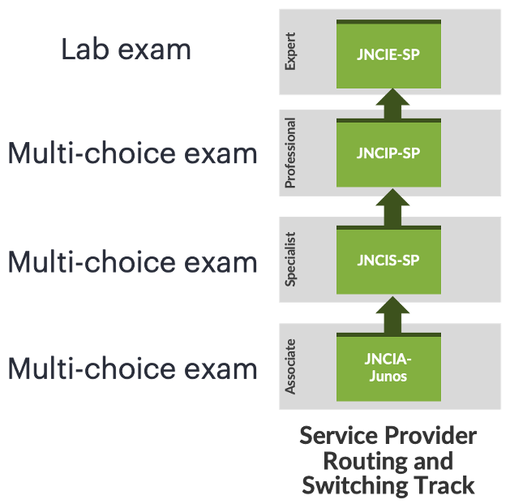
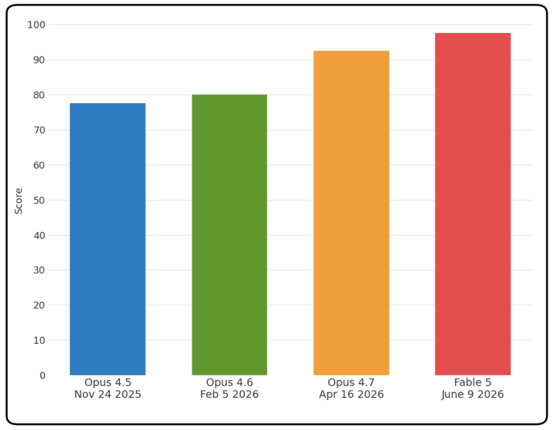
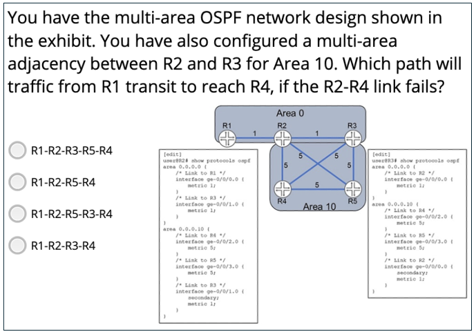
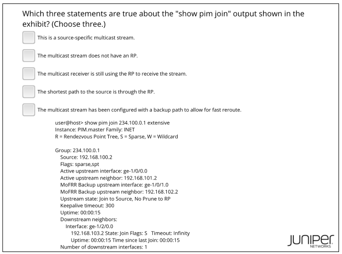
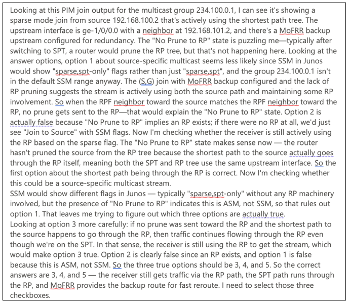
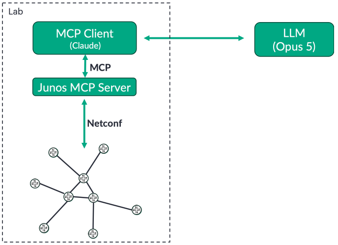

# Benchmarking LLMs against Networking Certification Exams

**Julian Lucek - 09/20/2026**

## Introduction

LLMs have improved greatly over the last few months with the advent of reasoning models. An off-the-shelf LLM that has had no specialised networking training is nevertheless very good at networking tasks. This is because during its general training on internet content and other sources, it gets exposed to networking-related material, such as blogs, discussion forums, networking vendor documentation, and IETF drafts and RFCs. We are now at the point where an LLM can do large chunks of network-related work unaided , saving valuable time for network operations.

You've probably seen how people have benchmarked LLMs against medical school and law school exams, so we thought that, by analogy, it would be interesting to test LLMs against networking certification exams.  Figure 1 shows the HPE Networking service provider routing and switching certification track. It consists of three levels of multiple-choice exams, Associate, Specialist and Professional, followed by the Expert level JNCIE-SP lab exam.

## Multiple-choice certification exam results

Table 1 shows the scores achieved by the Fable 5 LLM on the multiple-choice certification exams. The practice exams were used, rather than the actual exams that candidates sit, but the practice exams have been calibrated so that they are equivalent to the real exams.

Table: Scores achieved by the Fable 5 LLM on the multiple-choice certification exams. Pass-mark is 70%.

| Exam | Score |
|:--|:--|
| Associate exam (JNCIA-Junos) | 39/40 = 97.5% |
| Specialist exam (JNCIS-SP) | 40/40 = 100% |
| Professional exam (JNCIP-SP) | 39/40 = 97.5% |

These are very impressive scores, especially for the Professional exam. Its typical questions involve solving networking-based puzzles, so relying solely on fact-based rote-learning is insufficient to pass the exam.

Looking at the Professional level exam in more detail, Figure 2 shows the scores achieved by successive generations of LLM over the course of time. The dates shown are the release dates of the models. As you can see, over a period of just seven months, the score has improved by 20 percentage points, from 77.5% using Opus 4.5 to 97.5% using Fable 5. This is a large increase over a relatively short period of time, highlighting the rate of progress of this technology.

Figure 3 shows an OSPF question from the Professional level exam. As well as reading the main text of the question, the LLM needs to interpret the network diagram and understand the router configuration snippets. This shows that the LLM can deal with multi-modal inputs successfully, answering the question correctly only five seconds or so after first seeing it.

Figure 4 shows an example multicast question from the Professional level exam. It's fascinating to watch the "thought" process of the LLM appear in the chat window as it looks at the options and works out the correct answer. This is shown in Figure 5.

## Tackling the JNCIE-SP lab exam

Now let's turn our attention to the JNCIE-SP exam. This six-hour long lab exam is notorious in the industry for being exceptionally tough (albeit fair!). The candidate is required to build and troubleshoot a service provider network. Detailed expertise is required in ISIS, BGP, MPLS and VPNs, among other areas, in order to have any chance of success in the exam .

Figure 6 shows the exam setup. The Opus 5 LLM in Max Effort mode was used, in conjunction with the Junos MCP server . The Junos MCP server exposes tools that the LLM can use to view the configurations of routers, issue show commands and change the configuration of the routers .

One of the practice lab exams from the JNCIE-SP Self-Study Bundle  was used, as the content of the real lab exams is a closely guarded secret! However, the practice exams are as difficult as the real ones.

The exam has several sections, each with multiple goals that the candidate needs to achieve. The entire exam would have been too much for the LLM to deal with in a single chat session, so a fresh chat was used for each section of the exam. However, the LLM always had access to the entire exam paper so that it could check for dependencies between sections when working through a given section.

It was interesting to watch how the LLM tackled each section of the exam. The LLM tended to "think" about the current section for 10-15 minutes to craft a solution for the whole section in one go. It then applied the necessary router configurations via the Junos MCP server, tested the solution, and corrected the configurations, if needed. In contrast, people working on an exam section, typically configure the routers in smaller steps and test after each step. Trying to write the large amount of configurations to solve the whole section offline would be error-prone for most because it would be difficult to get the syntax correct for every required configuration item.

The LLM achieved a score of 87%, much higher than the average score achieved by candidates taking the exam. As a reminder, Opus 5 is a general-purpose LLM that has had no specialised network training. Its impressive, but not perfect score, shows that LLMs are not infallible when it comes to networking tasks.

It's tricky to discuss the mistakes that the LLM made in the lab exam without revealing too much specific detail about the content of the exam. It did not make "silly" mistakes, such as configuring the wrong IP address on an interface or forgetting to apply a routing policy that it had created. The parts where the LLM lost marks were not inherently more difficult than those that the LLM carried out successfully, although in some cases they involved more obscure knowledge that perhaps the LLM was not exposed to much during its training. In one error example, the LLM configured almost everything needed, except for one essential configuration item. Although everything seemed fine at the control plane level, something was amiss at the forwarding plane level. In general, the LLM did a good job of checking its work by issuing appropriate show commands, but in this case it only checked the control plane and not the forwarding plane. In scoring such a case, a certification candidate receives no credit for the task, as everything has to be fully working to be awarded the marks. Interestingly, after the exam had finished and the score was determined, we informed the LLM that this task had not been configured correctly and asked it to check its work. This time, after some troubleshooting, it found the issue and added the missing item of configuration.

## Conclusion

LLMs have improved greatly at networking tasks over the last few months and have reached the point where they can do large amounts of useful work unaided. A year ago, one wouldn't have even contemplated having an LLM attempt the JNCIE-SP lab exam. It would have failed miserably. However, do not fall into the trap of thinking that an LLM is always correct. Although the LLM attained a remarkably high score, it did not score 100%. The output of LLMs should always be reviewed in the same way that the work of people should.

## Useful links

- https://juniper.github.io/techposts/testing-bgp-roles-rfc-9234-with-the-jmcp-server/article
- JNCIE-SP lab exam objectives: https://learningportal.juniper.net/juniper/user_activity_info.aspx?id=14337
- Junos MCP Server: 
    - https://github.com/Juniper/junos-mcp-server
    - https://juniper.github.io/techposts/network-automation-with-ai-and-junos-mcp-server/article
- JNCIE Self-Study Bundle: https://learningportal.juniper.net/juniper/user_activity_info.aspx?id=EDU-JUN-WBT-SSB-JNCIE-SP

## Acknowledgments

Many thanks to Jasun Rutter for facilitating access to the lab environment and Sidney Kriger for his detailed review of this article