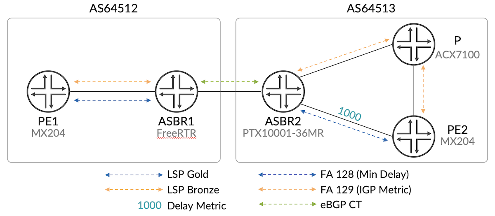

# BGP CT Interop Demo EANTC2023

**Kaliraj Vairavakkalai - 05/22/2023**

BGP CT interoperability tests between Junos, Junos Evo and FreeRTR routers conducted in Berlin during the EANTC2023 event in March 2023.

## Introduction

The BGP Classful Transport tests have been carried out in Berlin during the EANTC2023 interop event and included:

- Junos router: MX204
- Junos EVO: PTX10001-36MR
- RARE/freeRtr router BF2556X-1T

## Interop Demo

### Topology



The test topology consists of an Inter-AS option-C scenario, with two Autonomous Systems (AS 64512 and AS 64513) as shown in Figure 1.

PE1 and ASBR1 are in AS 64512. ASBR2, P, PE2 are in AS 64513. The PEs provide Internet service (IPv4 Unicast) to their CEs, not shown in this figure. The provider domains use IPv4/MPLS forwarding. Internet service routes exist only at the PEs level. It is a BGP (service routes) free core. MPLS forwarding is used on the Inter-AS link.

- RARE/freeRtr BF2556X-1T running v23.3.17-cur plays the role of ASBR1.
- Juniper PTX10001-36MR running 22.4R1.11-EVO plays the role of ASBR2.
- Juniper MX204 running 23.2R2 plays the roles of PE1 (logical-system) and PE2.
- Juniper ACX710 plays the role of the P router.
- Spirent STC playing the role of CE devices connected to the PE devices, is used as traffic generator.

Configuration files are available on this GitHub repo: [https://github.com/reshdas/EANTC-BGP-CT](https://github.com/reshdas/EANTC-BGP-CT)

### Demo Objective

The goal of the test is to preserve "end to end" the desired Intent (SLA) for IP traffic flowing between the CEs. The PEs control the SLA (whether traffic takes Gold or Bronze tunnels) by advertising BGP route for the CE prefixes with corresponding mapping community for the desired SLA.

To achieve this goal, freeRtr node ASBR1 needs to interoperate with Juniper nodes PE1 and ASBR2 using BGP CT protocol procedures at control plane as well as forwarding plane layers.

Traffic direction PE2 to PE1 is described in this article. The reverse direction works in a similar manner.

### Transport layer protocols

For this demonstration AS64512 runs ISIS as IGP, AS64513 runs OSPF. ASBR1 and ASBR2 peer with each other using EBGP session on interface addresses. PE and ASBR have IBGP peering.

BGP transport layer families are used to carry PE loopback reachability information between the two ASes. BGP LU (SAFI 4) is used for best effort SLA reachability. BGP CT (SAFI 76) is used to carry Gold and Bronze SLA reachability. BGP LU and BGP CT families are negotiated on BGP sessions between PE2 -- ASBR2, ASBR2 -- ASBR1, and ASBR1 -- PE1.

### Transport Classes

AS 64512 contains RSVP-TE LSPs with Gold and Bronze SLA between PE1 and ASBR1. Transport class Gold is provisioned at PE1 and ASBR1 with color 128, and Transport class Bronze is provisioned with color 129. RSVP-TE LSPs are associated with their respective transport classes.

AS 64513 contains OSPF FlexAlgo FA128 (Gold SLA) and FA129 (Bronze SLA). Transport class Gold is provisioned at PE2 and ASBR2 with color 128, and Transport class Bronze is provisioned with color 129. OSPF FA128 is associated with transport class Gold, and FA129 is associated with transport class Bronze.

Following configuration is used to provision Transport classes on the Juniper devices:

```
[edit routing-options]
transport-class {
    auto-create;
    name tc-128 {
        color 128;
    }
    name tc-129 {
        color 129;
    }
}
```

To associate RSVP-TE tunnels to the Transport classes:

```
[edit protocols mpls]
label-switched-path to-ASBR1-gold {
    from 100.7.0.36;
    to 100.7.0.37;
    install 100.1.0.37/32; /* ASBR-1 */
    transport-class tc-128;
}
label-switched-path to-ASBR1-bronze{
    from 100.7.0.36;
    to 100.7.0.37;
    install 100.1.0.37/32; /* ASBR-1 */
    transport-class tc-129;
}
```

To associate FlexAlgo tunnels to the Transport classes:

```
[edit routing-options]
flex-algorithm 128 {
    definition {
        metric-type delay-metric;
    }
    color 128;
    use-transport-class;
}
flex-algorithm 129 {
    definition {
        metric-type delay-metric;
        admin-group exclude GREEN;
    }
    color 129;
    use-transport-class;
}
```

Following configuration is used to provision Transport classes on the RARE/freeRtr device:

```
vrf definition eantc-bgp-ct-gold
    clr4import 128
    clr4export 128
    label4mode per-prefix
    exit

vrf definition eantc-bgp-ct-bronze
    clr4import 129
    clr4export 129
    label4mode per-prefix
    exit
```

To associate RSVP-TE tunnels to the Transport classes:

```
interface tunnel2
    description lsp_to_pe1_gold
    tunnel vrf eantc-bgp-ct
    tunnel destination 100.1.0.36 /* PE1 */
    tunnel mode p2pte
    vrf forwarding eantc-bgp-ct-gold
    

interface tunnel3
    description lsp_to_pe1_bronze
    tunnel vrf eantc-bgp-ct
    tunnel destination 100.1.0.36 /* PE1 */
    tunnel mode p2pte
    vrf forwarding eantc-bgp-ct-bronze
```

### Resolution Schemes

In BGP CT architecture, "Resolution schemes" are used to resolve received nexthop using correct Transport class route database based on mapping community on the route.

The transport class configuration in Juniper devices creates the resolution schemes associated with the transport class. These can be examined using the following show command:

```
cli> show route resolution scheme community transport-target:0:128
Resolution scheme: junos-resol-schem-tc-128-v4-transport
  AutoCreated
  References: 1
  Mapping community: transport-target:0:128
  Resolution Tree: 0x1aaba000, index: 21, Nodes: 2
  Policy: [__resolution-schem-common-import-policy__]
  Contributing routing tables: junos-rti-tc-128.inet.3 

cli> show route resolution scheme community transport-target:0:129
Resolution scheme: junos-resol-schem-tc-129-v4-transport
  AutoCreated
  References: 1
  Mapping community: transport-target:0:129
  Resolution Tree: 0x1a376000, index: 25, Nodes: 2
  Policy: [__resolution-schem-common-import-policy__]
  Contributing routing tables: junos-rti-tc-129.inet.3
```

Following configuration is used on freeRtr device to create the resolution scheme policy for Gold and Bronze SLAs.

```
route-policy imp-resol-scheme
  seq 10 if extcomm 2562:0:128
  seq 20  set vrf eantc-bgp-ct-gold ipv4
  seq 30  pass
  seq 40 enif
  seq 50 if extcomm 2562:0:129
  seq 60  set vrf eantc-bgp-ct-bronze ipv4
  seq 70  pass
  seq 80 enif
  seq 90 drop
  exit
```

These resolution schemes are used to resolve a route received with transport-target:0:128 using transport routes belonging to Gold Transport class, and routes received with transport-target:0:129 using transport routes belonging to Bronze Transport class.

### Transport layer route propagation

BGP CT family is negotiated on BGP sessions between PE2 -- ASBR2, ASBR2 -- ASBR1, and ASBR1 -- PE1.

freeRtr device ASBR1 negotiates BGP CT (SAFI 76) family on IBGP session with Junos node PE1,  and EBGP session with Junos Evo node ASBR2.

Following configuration enables BGP CT family on Juniper devices:

```
[edit protocols bgp]
group bgp-ct {
    type internal;
    family inet {
        transport;
    }
    export ct-export;
    Neighbor 100.2.0.37;
}
```

Following configuration enables BGP CT family on RARE/freeRtr device:

```
router bgp4 1
    nei 100.2.0.36 remote-as 64512
    nei 100.2.0.36 local-as 64512
    nei 100.2.0.36 address-family ctp
    nei 100.2.0.36 send-community standard extended
    nei 100.2.0.36 route-policy-in import-resol-scheme
    nei 100.2.0.36 route-policy-out exp-to-pe1
    afi-clr eantc-bgp-ct-gold enable
    afi-clr eantc-bgp-ct-bronze enable
```

BGP CT Route for Gold SLA is originated by PE1 with NLRI RD1:PE1/96, MPLS Label "Implicit Null", nexthop as PE1, and mapping community as transport-target:0:128.

On receiving this route, freeRtr node ASBR1 resolves over the RSVP Gold LSP to PE1 by virtue of resolution schemes described above, and re-advertises the route with nexthop as self to ASBR2. While doing so, ASBR1 advertises a new MPLS label TL1 on the route with NLRI RD1:PE1/96. The forwarding semantic for TL1 is "Swap" to RSVP Gold LSP label.

ASBR1 similarly re-advertises the RD1:PE1/96 route to PE2 with nexthop self, transport-target:0:128 and a new label TL2 whose forwarding semantic is to "Swap" to received label TL1.

PE2 resolves the received ingress BGP CT route over the OSPF FA128 LSP, it programs a "Push [TL2], [OSPF FA128 LSP Label]" as the ingress route's nexthop. This ingress route is published in Gold transport class. This creates an end-to-end Gold SLA path from PE2 to PE1, which service routes can use for nexthop resolution.

Similarly, BGP CT route for Bronze SLA is originated by PE1 with NLRI RD2:PE1/96 with MPLS Label "Implicit Null", nexthop as PE1, and mapping community as transport-target:0:129. This route is also re-advertised until PE2, forming an end-to-end Bronze SLA path from PE2 to PE1.

The BGP CT route with transport-target:0:128 for PE1/32 (after stripping RD) is installed in Gold TRDB (Transport Route Database) at PE2. Similarly, BGP CT route for PE1/32 with transport-target:0:129 is installed in Bronze TRDB.

### Service Layer, Routes and Forwarding Observations

PE1 and PE2 have a multihop EBGP session that negotiates IPv4 Unicast (SAFI 1) family. The PEs negotiate IPv4 Unicast family with their CEs as well.

PE1 advertises IPv4 route (SAFI 1) for CE prefix with mapping community as Color:0:128 and nexthop as PE1, when the traffic needs Gold SLA. This route is received on a multihop EBGP session by PE2, and it resolves it over the BGP CT ingress-route for PE1/32 in Gold TRDB. This makes the traffic destined towards PE1 take the OSPF FA128 LSP in AS 64513 and RSVP Gold LSP in AS 64512.

The following resolution schemes are used at Juniper device PE2 to resolve these service routes. Specifically, the tc-128 resolution scheme is used to resolve routes with Color:0:128.

```
cli> show route resolution scheme community color:0:128
Resolution scheme: junos-resol-schem-tc-128-v4-service
  AutoCreated
  References: 1
  Mapping community: color:0:128
  Resolution Tree: 0x1a7d8000, index: 2, Nodes: 27
  Policy: [__resolution-schem-common-import-policy__]
  Contributing routing tables: junos-rti-tc-128.inet.3 inet.3

cli> show route resolution scheme community color:0:129
Resolution scheme: junos-resol-schem-tc-129-v4-service
  AutoCreated
  References: 1
  Mapping community: color:0:129
  Resolution Tree: 0x1aaa8000, index: 23, Nodes: 27
  Policy: [__resolution-schem-common-import-policy__]
  Contributing routing tables: junos-rti-tc-129.inet.3 inet.3
```

To signal a change in the desired SLA to Bronze, PE1 re-advertises IPv4 route for CE prefix with Color:0:129, which makes the route map to tc-129 resolution scheme at PE2, and traffic switches to Bronze OSPF FA129 LSP in AS 64513, and RSVP Bronze LSP in AS 64512. The SLA and path taken by traffic was verified using RSVP-TE LSP statistics in AS 64512 and interface statistics in AS 64513.

## In Conclusion

This interop test demonstrates preserving "end to end" forwarding SLA across option-C domains consisting of Juniper and freeRtr devices.

This showcases successful Interop of BGP CT protocol procedures between freeRtr device ASBR1 and Juniper devices ASBR2 (Junos Evo), PE1 (Junos).

## Useful links

- [https://datatracker.ietf.org/doc/draft-ietf-idr-bgp-ct/](https://datatracker.ietf.org/doc/draft-ietf-idr-bgp-ct/)
- Config files (ASBR1 is FreeRTR, other nodes are Junos): [https://github.com/reshdas/EANTC-BGP-CT](https://github.com/reshdas/EANTC-BGP-CT)

## Glossary

- ASBR: Autonomous System Border Router
- BGP CT: Border Gateway Protocol Classful Transport
- BGP LU: BGP Labeled Unicast
- EANTC: European Advanced Networking Test Center
- FA: FlexAlgo
- OSPF: Open Shortest Path First
- LSP: Label Switched Path
- NLRI: Network Layer Reachability Information
- PE: Provider Edge
- RD: Route Distinguisher
- RSVP-TE: Resource Reservation Protocol - Traffic Engineering
- SAFI: Subsequent Address Family Indicator
- SLA: Service Level Agreement
- TRDB: Transport Route DataBase

## Acknowledgments

Thanks to Csaba Mate,  Natrajan Venkataraman and Reshma Das. Thanks to Anton Elita, Krzysztof Szarkowicz, Simon Leinen and Frédéric LOUI for the coordination with EANTC and on the ground support in Berlin. Thanks to exec support from Juniper, GEANT and RARE/FreeRtr. Without the excellent teamwork of all these involved parties, this interop demo would not have been successful. Finally, thanks to Nicolas Fevrier for polishing the recorded demo video into this fantastic presentable format.
