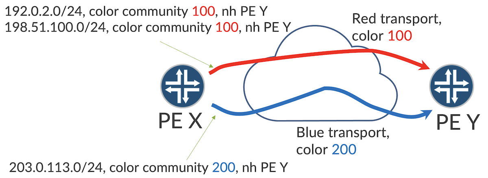
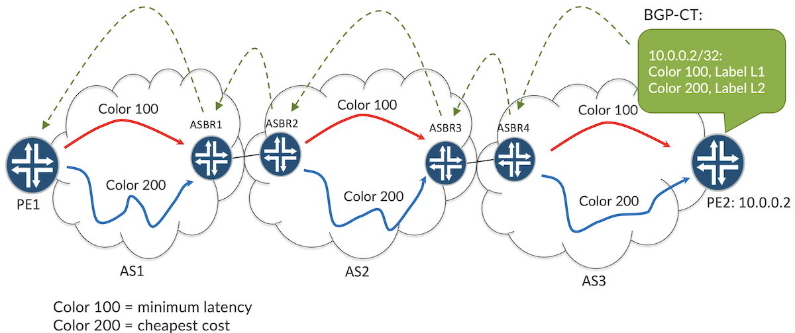
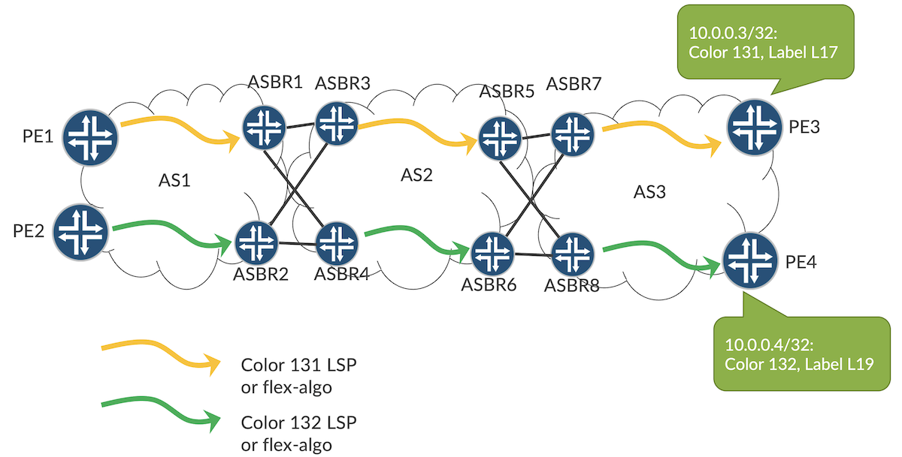
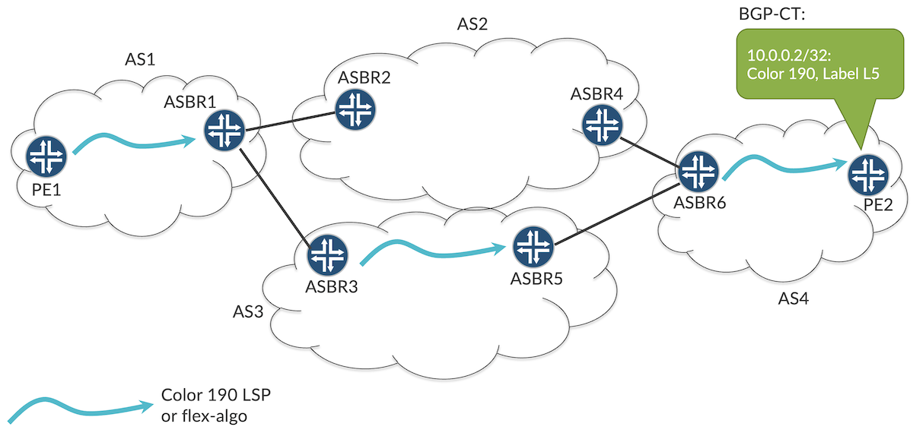
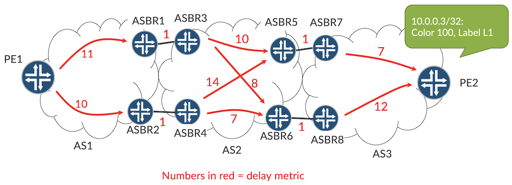
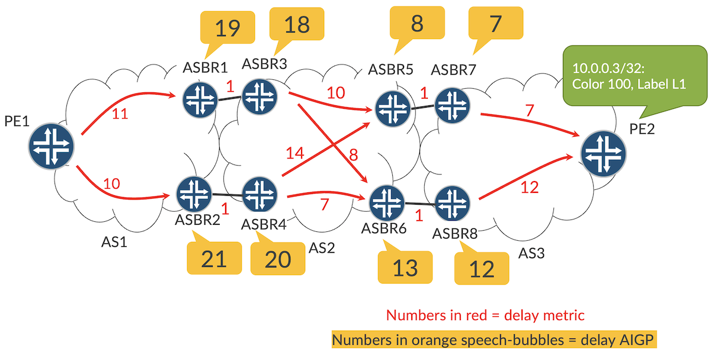

# BGP CT Use-Cases

**Julian Lucek - 08/28/2023**

Key applications of BGP Classful Transport (BGP-CT), including path-diversity across multiple ASes, multi-AS paths that take into account sovereignty constraints, and paths that achieve the minimum end-to-end latency across ASes.

## Introduction

Color-based transport has been used within single ASes for several years, so that  traffic can be selectively mapped onto the appropriate underlay transport that meets the service requirements. For example, services that need minimum latency would be mapped onto a transport that minimises the latency between the end-points. BGP-CT extends this approach to multi-AS scenarios, allowing traffic to consistently follow the appropriate transport for its needs as it travels across multiple ASes from source PE to destination PE.

In this techpost, we first recap how color-based transport works within a single AS, before describing how this is extended across multiple ASes by BGP-CT. We then describe some of the key applications of BGP-CT.

## Principles of color-based transport

Before looking at color-based transport across multiple ASes with BGP-CT, let's remind ourselves how color-based transport works within a single AS.

Figure 1 shows an AS that uses two types of transport. Minimum latency transport is shown in red and minimum monetary cost transport is shown in blue. Note that typically there will be other routers between PE1 and PE2, but these are not shown to make the diagram clearer.

Options for how to implement such transport are:

- Two meshes of RSVP-TE or SR-TE LSPs. Each LSP in the red mesh is computed to follow the minimum latency path and each LSP in the blue mesh is computed to follow the minimum monetary cost path. Each LSP in the red mesh has a color attribute of 100 associated with it while each LSP in the blue mesh has a color attribute of 200 associated with it.
- Two flex-algos. The red flex-algo is configured to use link delay metrics and the blue flex-algo is configured to use link metrics in proportion to monetary cost. The red flex-algo has a color attribute of 100 associated with it while the flex-algo has a color attribute of 200 associated with it.

Let's see how service-level prefixes are mapped to the appropriate color of transport. In the example, PE Y uses BGP to advertise prefixes 192.0.2.0/24 and 198.51.100.0/24 with color community 100. It also advertises 203.0.113.0/24 with color community 200. In general, the prefixes could be plain IP or could be Layer 3 VPN or Layer 2 VPN prefixes. PE X maps the prefixes onto the appropriate transport by matching colors. The prefixes with color community 100 are mapped onto the red color 100 minimum latency transport that terminates at the BGP next-hop, PE2, while the prefixes with color community 200 are mapped onto the blue color 200 minimum monetary cost transport.

As can be seen, simply by applying the appropriate color community, the egress PE controls what type of transport is used by other PEs to send traffic to it.

Now that we have seen how color-based transport works within an AS, let's see in the next section how BGP-CT extends the use of colors across multiple ASes.

## Principles of BGP-CT

In Figure 2, there are three ASes: AS1, AS2 and AS3. Like in the previous example, there are two colors in use within each AS: color 100 for minimum latency, shown in red, and color 200 for cheapest monetary cost, shown in blue. This allows nodes within an AS to exchange traffic using color-based transport. Note that typically there will be other routers in AS1 and AS3 between the PE and the local ASBR, and between the ASBRs in AS2, but these are not shown to make the diagram clearer. This is also the case in the subsequent figures in this techpost.

What if we want to extend color-based transport for travelling across more than one of these ASes? Traditionally, network operators have used BGP Labeled Unicast (BGP-LU) to extend MPLS transport across multiple ASes. However, BGP-LU does not have a notion of color. This is where BGP-CT comes in. Like BGP-LU, BGP-CT allows a PE's loopback address to be associated with an MPLS label. The difference is that BGP-CT is more fine-grain: it allows multiple labels to be associated with a PE's loopback address, one for each color that it supports. In the figure, we can see that in BGP-CT, Label L1 is associated with PE2's loopback address (10.0.0.2) in the context of Color 100 and Label L2 is associated with PE2's loopback address in the context of Color 200. These BGP-CT advertisements travel from right to left across the diagram, as shown by the green dashed arrows. When an ASBR readvertises to its peers, it sets the BGP next-hop to self, which as a side-effect, results in a change in the label value. This is the same behavior as we are accustomed to with BGP-LU.

Let's look at the scenario from PE1's perspective. PE1 receives via BGP-CT from ASBR1 two labels corresponding to PE2's loopback address, one for color 100 and one for color 200. This means that PE1 now knows how to send color 100 and color 200 traffic to PE2. Suppose PE1 also receives some VPN prefixes from PE2 (typically via route-reflectors) with color community 100. The BGP next-hop for the VPN prefixes is PE2. These prefixes resolve over the color 100 labelled BGP-CT prefix for PE2's loopback address that PE1 has received from ASBR2. As a result, PE1 forwards the traffic in the following way:

- first it pushes the VPN label onto the packet
- then it pushes the BGP-CT color 100 label corresponding to PE2's loopback address onto the packet
- then it pushes the label(s) associated with the local color 100 (red) transport to ASBR1, as ASBR1 is the BGP next-hop for the BGP-CT label

In this way, the packet travels to ASBR1 over the color 100 transport from PE1 to ASBR1. Because of penultimate-hop popping, by the time the packet arrives at ASBR1, the BGP-CT label is exposed. This tells ASBR1 to forward the packet to ASBR2. In turn, this tells ASBR2 to send the packet on the local color 100 (red) transport to ASBR3. ASBR3, seeing the BGP-CT label, passes the packet to ASBR4. Finally ASBR4, having inspected the BGP-CT label, puts the packet onto the red transport to the destination, PE2. As you can see, by virtue of BGP-CT, the packet always consistently follows the red transport as it travels across each AS to the destination PE.

Note that the operator of each AS can make their own choice about what type of transport to use within their own AS, independently of what the operators of the other ASes choose to use in their respective ASes. For example, AS1 could be using RSVP-TE while AS2 uses Flex-Algo and AS3 uses SR-TE. Regardless of that, BGP-CT provides the glue between the ASes for color-based transport.

## Path Diversity Across Multiple ASes

Let's look at how we can achieve path diversity across multiple ASes using BGP-CT. Path diversity is often used in conjunction with live-live services such as broadcast TV, market data and mobile signaling traffic. In the example in Figure 3, we want traffic flowing from PE1 to PE3 to follow a diverse path to traffic flowing from PE2 to PE4. This means the paths must be such that they do not have any link or nodes or SRLGs in common. This means that if a link or node fails along the path of one of the diverse paths, the other path is unaffected and the traffic still arrives intact at the destination. Within each AS, color 131 transport (shown in yellow) and color 132 transport (shown in green) are arranged such that they do not share fate. For example, in AS1, the yellow transport between PE1 and ASBR1 does not share fate with the green transport between PE2 and ASBR2.

This diversity within each AS can be achieved in one of the following two ways:

- Diversely-routed pairs of RSVP-TE or SR-TE LSPs within each AS. One LSP of each pair has color 131 (yellow) and the other LSP of each pair has color 132 (green).
- If, within an AS, the topology consists of two planes that do not share fate, a flex-algo with color 131 (yellow) is mapped to one plane and another flex-algo with color 132 (green) is mapped to the other plane.

The path diversity within each AS between the green and yellow transport is used in conjunction with BGP-CT in order to achieve end-to-end path diversity for traffic traveling across multiple ASes. Let's see how this works.

- 1/ PE3 originates a BGP-CT advertisement for its loopback address associated with color 131, but does not originate a BGP-CT advertisement for its loopback address associated with color 132.
- 2/ In contrast, PE4 originates a BGP-CT advertisement for its loopback address associated with color 132, but does not originate a BGP-CT advertisement for its loopback address associated with color 131.
- 3/ ASBR7 does not advertise the color 132 prefix associated with PE4 to its peers in AS2, because it does not have a color 132 transport path to PE4 (otherwise the traffic would be black-holed) . It only advertises the color 131 prefix associated with PE3.
- 4/ ASBR8 does not advertise the color 131 prefix associated with PE3 to its peers in AS2, because it does not have a color 131 transport path to PE3. It only advertises the color 132 prefix associated with PE4.
- 5/ Similar considerations apply to the way that ASBR3 and ASBR4 advertise BGP-CT prefixes to their peers in ASBR1.
- 6/ This means that PE1 receives a color 131 prefix corresponding to PE3 from ASBR1, but not from ASBR2. PE2 receives a color 132 prefix corresponding to PE4 from ASBR2, but not from ASBR1.
- 7/ The result is that color 131 traffic from PE1 to PE3 can only follow the path PE1-ASBR1-ASBR3-ASBR5-ASBR7-PE3 while color 132 traffic from PE2 to PE4 can only follow the path PE2-ASBR2-ASBR4-ASBR6-ASBR8-PE4.

In this way, with the aid of BGP-CT, path diversity is achieved end-to-end across the ASes.

## Geo-Routing

Suppose you run a global network with separate ASes per country or region. A Business VPN customer comes to you and says they do not want any of their traffic to pass through a particular AS, namely AS2 in Figure 4. This can be achieved with BGP-CT.

In the example in the figure, we use color 190 for traffic that must not pass through AS2. ASBR6 and ASBR4 have policy configuration to ensure that they do not advertise or accept any BGP-CT prefixes having color 190 on their peerings with the ASBRs in AS2. Now, suppose PE1 needs to send traffic to PE2 with color 190, in order to avoid AS2. PE1 has received a BGP-CT advertisement with color 190 from ASBR1 for PE2's loopback address. ASBR1 only sends such traffic via AS3, as it does not receive any color 190 prefix corresponding to PE2 from ASBR2. In this way, AS2 is avoided.

In general, as long as there is a continuous chain of ASes between an ingress PE and an egress PE that all support color 190, the traffic will get through, while avoiding the undesired ASes.

## Optimum Path Selection

Let's now look at how optimum path selection is achieved when there are multiple ways of reaching a destination in a remote AS when using transport of a particular color. In the example in Figure 5, minimum delay transport, denoted by the red arrows, has color 100. We show the delay metric in red font between endpoints within each AS. For example, the delay metric between PE1 and PE2 is 11. Note that, like in previous examples, typically there will be other routers along the path between endpoints within the same AS, so the red number denotes the total delay metric, typically over multiple hops, between the endpoints of a given red arrow.

Suppose PE1 needs to send traffic to PE2 with minimum delay. It receives BGP-CT advertisements with color 100 from both ASBR1 and ASBR2 corresponding to PE2's loopback address. How does PE1 know whether to send the traffic to ASBR1 or to ASBR2? The delay metric of 10 to ASBR2 is less than the delay metric of 11 to ASBR1. But if PE1 were to choose ASBR2 on that basis, it would be the wrong choice as the overall path from PE1 to PE2 would have a delay metric of 31 (10+1+7+1+12),  compared to 30 (11+1+10+1+7) if it had chosen ASBR1.

How do we ensure that PE1 chooses the optimum ASBR to exit its own AS? This can be achieved using the Accumulated IGP (AIGP) metric in BGP. AIGP has been around for several years. However, with the advent of color-based transport across multiple ASes in the shape of BGP-CT, a generalized version of AIGP is needed that accommodates multiple metrics, each potentially associated with a different color. Such a scheme is described in Reference [2].

Let's see how this is used to achieve optimum routing in our example. Figure 6 shows the accumulated delay metric in the orange speech-bubbles corresponding to destination PE2, from the point of view of each ASBR. ASBR5 advertises a metric of 8, as its metric to ASBR7 is 1 and ASBR7 has advertised a metric of 7 to the destination. ASBR6 advertises a metric of 13, as its metric to ASBR8 is 1 and ASBR8 has advertised a metric of 12 to the destination. ASBR3 has two ways of reaching PE2: via ASBR5 or via ASBR6. It chooses ASBR5, as the accumulated metric is 10 to ASBR5 plus 8 that ASBR5 had advertised, which is less than the accumulated of 21 via ASBR6. In turn, PE1 chooses ASBR1 as the total metric of 30 (11 to ASBR1 plus 19 from ASBR1 to the destination) is less than the total metric of 31 via ASBR2 (10 to ASBR2 plus 21 from ASBR2 to the destination).

In this way, BGP-CT in conjunction with the generalized AIGP ensures that the optimum path for a given color is used end-to-end across multiple ASes.

## Summary

In this tech-post, we have seen how BGP-CT allows the notion of color to be extended across multiple ASes. This allows more fine-grain control over the type of path that traffic of a given type follows to a destination PE in a remote AS, allowing service-level requirements to be more easily met.

## Useful links

- BGP Classful Transport (BGP-CT) draft: [https://datatracker.ietf.org/doc/draft-ietf-idr-bgp-ct/](https://datatracker.ietf.org/doc/draft-ietf-idr-bgp-ct/)
- Generic Metric for the AIGP attribute draft: [https://datatracker.ietf.org/doc/draft-ssangli-idr-bgp-generic-metric-aigp/](https://datatracker.ietf.org/doc/draft-ssangli-idr-bgp-generic-metric-aigp/)

## Glossary

- AS: Autonomous System
- ASBR: Autonomous System Border Router
- BGP: Border Gateway Protocol
- BGP-CT: BGP Classful Transport
- IGP: Interior Gateway Protocol
- RSVP: Resource Reservation Protocol
- SR: Segment Routing

## Acknowledgements

Many thanks to Krzysztof Szarkowicz for his review of this article.
