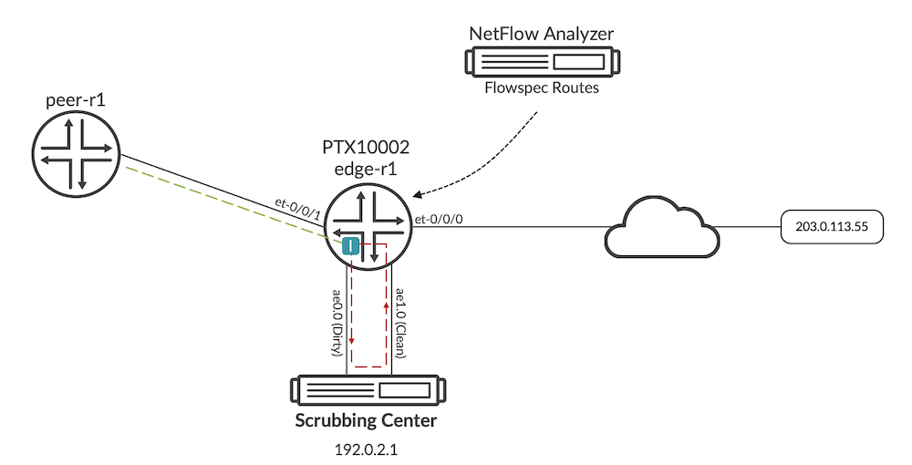
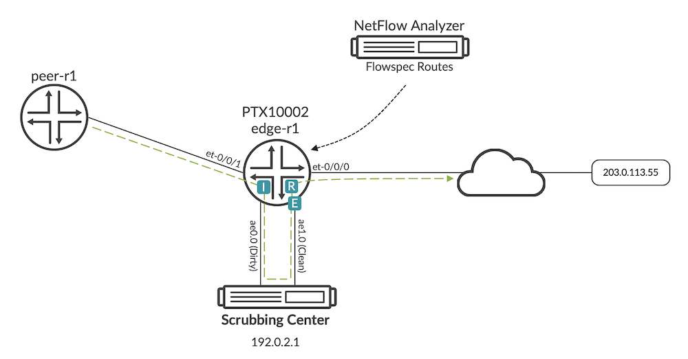

# BGP FlowSpec "Exclude Interfaces" on Express2 Platforms

**Jordan Head - 06/07/2023**

BGP FlowSpec is one of the mechanisms that allows a network to protect itself against DDoS attacks. A common mitigation tactic is to redirect malicious traffic to a scrubbing center for further analysis. If any of the analyzed traffic is found to be legitimate, it can be re-injected into the network. However, we must make a few considerations to ensure the re-injected traffic is properly forwarded to its original destination.

## Overview

DDoS attacks have been a problem on the internet for quite some time. BGP FlowSpec can play a significant role in protecting networks against those attacks, specifically in Service Provider environments.

Routers are configured to sample traffic using NetFlow sampling, which exports data to external systems to analyze it for various attack patterns (e.g. DNS amplification). In response, those systems can advertise BGP FlowSpec routes to routers. BGP FlowSpec routes essentially contain instruction sets that enable the router to instantiate fine-grained filters that malicious traffic could traverse in an attempt to mitigate the attack. These filters constructed from a combination of available match conditions such as source/destination prefix, source/destination port, IP protocol, TCP flags, and several others. Malicious traffic that matches the filter conditions can be rate-limited, redirected to another destination (e.g. a scrubbing center), or dropped entirely.

Scrubbing centers are dedicated systems that perform further analysis and filtering on "dirty" (malicious) traffic beyond what a router is capable of. If the scrubbing center determines that any of the traffic is legitimate (i.e. non-malicious), it is re-injected into the network and forwarded on to its original destination.

## Problem Statement

It is important to highlight the fact that the scrubbing center is intended to be transparent. As a result, traffic is completely unmodified when it is re-injected, i.e. the router doesn't have any indication that the traffic was "cleaned". Without special treatment this will cause traffic to loop and ultimately blackhole because traffic will simply pass through the same FlowSpec filters that got it there in the first place. Depending on the traffic profile, this is worse than not cleaning the traffic at all.

To illustrate this, let's look at how FlowSpec filters are instantiated after receiving a FlowSpec route.

1. Here is an active FlowSpec route in the inetflow.0 table that redirects traffic destined for 203.0.113.55 to 192.0.2.1 (a scrubbing center)

```
jhead@edge-r1# run show route table inetflow.0 extensive

inetflow.0: 1 destinations, 1 routes (1 active, 0 holddown, 0 hidden)
203.0.113.55,*/term:1 (1 entry, 1 announced)
TSI:
KRT in dfwd;
Action(s): redirect-to-nexthop nhid: 2097167,count
        *Flow   Preference: 5
                Next hop type: Indirect, Next hop index: 0
                Address: 0x28700f1c
                Next-hop reference count: 2
                Next hop type: Router, Next hop index: 739
                Next hop: 192.0.2.1 via ae0.0, selected
                Session Id: 145
                Protocol next hop: 192.0.2.1
                Indirect next hop: 0x8cfc508 2097167 INH Session ID: 402
                State: <Active SendNhToPFE>
                Local AS: 65401
                Age: 6  Metric2: 0
                Validation State: unverified
                Task: RT Flow
                Announcement bits (1): 0-Flow
                AS path: I
                Communities: redirect-to-ip:192.0.2.1:0
                Thread: junos-main
                Route Record: Not-Recorded nexthop 0x28700f1c
                              as-index: 1 (Recorded) com-index 83 (Not-Recorded)
                Indirect next hops: 1
                        Protocol next hop: 192.0.2.1
                        Indirect next hop: 0x8cfc508 2097167 INH Session ID: 402
                        Indirect path forwarding next hops: 1
                                Next hop type: Router
                                Next hop: 192.0.2.1 via ae0.0
                                Session Id: 145
                                192.0.2.1/31 Originating RIB: inet.3
                                  Node path count: 1
                                  Forwarding nexthops: 1
                                        Next hop type: Interface
                                        Next hop: via ae0.0
```

2. The "KRT in dfwd" line indicates that there is a corresponding filter installed in the PFE. FlowSpec filters that match IPv4 traffic are contained in the __flowspec_default_inet__ filter.

```
jhead@edge-r1> start shell pfe network fpc0

Routing platform (2500 Mhz Pentium processor, 3072MB memory, 0KB flash)

FPC0(edge-r1 vty)# show firewall
Program Filters:
---------------
   Index     Dir     Cnt    Text     Bss  Name
--------  ------  ------  ------  ------  --------

Term Filters:
------------
   Index    Semantic    Name
--------  ----------------
<trim>

   65024  Classic   __flowspec_default_inet__

<trim>
```

3. Using the filter's index (65024) we can view its programming. As you can see, we're matching traffic destined for 203.0.113.55/32 and then setting the "next-hop" to the next-hop identifier of 2097167.

```
FPC0(edge-r1 vty)# show filter index 65024 program
Filter index = 65024
Optimization flag: 0x0
Filter notify host id = 0
Pfe Mask = 0xFFFFFFFF
jnh inst = 0x0
Filter properties: None
Filter state = CONSISTENT
term 203.0.113.55,*
term priority 0
    destination-address
        203.0.113.55/32
    then
 action next-hop, type (nh-id)
        2097167
 count 203.0.113.55,*
term default-term
term priority 0
    then
 accept
```

4. Using that next-hop identifier, we can look at the next-hop programming. Here, we see that it's set to egress via ae0.0  toward the scrubbing center.

```
FPC0(edge-r1 vty)# show nhdb id 2097167 recursive
2097167(Indirect, IPv4, ifl:67:ae0.0, pfe-id:0, i-ifl:0:-)
    739(Aggreg., IPv4, ifl:67:ae0.0, pfe-id:0)
        740(Unicast, IPv4, ifl:91:et-0/0/4.0, pfe-id:6)
        741(Unicast, IPv4, ifl:92:et-0/0/5.0, pfe-id:7)
        742(Unicast, IPv4, ifl:93:et-0/0/6.0, pfe-id:6)
        743(Unicast, IPv4, ifl:94:et-0/0/7.0, pfe-id:7)
```

5. Now that we know the FlowSpec filter is programmed correctly according to the corresponding FlowSpec route, it's important to understand where the filter is instantiated in the forwarding path.

FlowSpec filters are considered "Implicit Forwarding-Table Filters". This means that they are installed in the context of an entire forwarding-table rather than explicitly on interface(s). In short, all traffic traversing a particular forwarding-table are subject to these filters. In our example, since the route is installed in inetflow.0 the filter will be instantiated into the inet.0 forwarding-table (default.0 as shown below).

```
FPC0(edge-r1 vty)# show route table proto ip
Protocol: IPv4
    Table Name                       Table Index (lrid ) # of Routes  Bytes        LOCAL     FRRP TID
    -------------------------------------------------------------------------------------------------------
<...trim...>

    default.0                        0           (0    ) 906361       192148528    LOCAL     low ----

FPC0(edge-r1 vty)# show route table proto ip table-index 0
Protocol: IPv4
    Table Name                       Table Index (lrid ) # of Routes  Bytes used   FRRP
    -----------------------------------------------------------------------------------
    default.0                        0           (0    ) 906358       192147892   i low
Input filter            : 0
Output filter           : 0
Input implicit filters  : [65024 ]
Localization bitmap : 0xffffffffffffffff : LOCAL to this FPC
VRF-Steer NH ID : 0
Tunnel RPF              : Off
installed, install error 0
```

6. See that the filter index (65024) for __flowspec_default_inet__ is installed as an implicit Forwarding-Table Filter in the input direction. This means that any traffic ingressing inet.0's forwarding-table will be subject to the corresponding FlowSpec filters.

Let's visualize the problem. Figure 1 depicts the scenario we just described. Let's assume that at least some of the traffic is successfully cleaned and re-injected into the network. Traffic destined for 203.0.113.55 will be redirected to a scrubbing center at 192.0.2.1. Cleaned traffic arrives at the router unmodified, the same filter lookup will occur (indicated by the "I" in the Figure 1), resulting in traffic being redirected to 192.0.2.1 for cleaning again. This process continues until the traffic is dropped due to TTL (Time-to-Live) expiration.



In short, we need a way to ensure that interface(s) receiving the clean re-injected traffic is not subjected to the same FlowSpec rules.

Platforms like the MX-Series and PTX10001-36MR support this functionality by configuring a group of interfaces to be excluded from FlowSpec filtering:

```
routing-options {
    flow {
        interface-group 66 exclude;
        }
}
```

Then by assigning the required interfaces to that group:

```
ae1 {
    unit 0 {
        family inet {
            filter {
                group 66;
            }
        }
    }
}
```

The PTX10002's forwarding architecture is based on the Paradise-Express chipset and doesn't support this functionality via the same configuration statements. It requires a different approach. This also applies to all other Paradise-Express based platforms (e.g. the PTX1000 or QFX10008).

## Solution

While the typical configuration is not supported on the PTX10002, we can mimic the same behavior by leveraging non-obvious behavior in the architecture's filter logic.

Let's go through the configuration required to accomplish this. Then we'll take you through step-by-step to demonstrate why the solution works.

**Step 1:** Configure a virtual-router containing a static default route back to inet.0.

```
routing-instances {
    IEXC-VR {
        instance-type virtual-router;
        routing-options {
            static {
                route 0.0.0.0/0 next-table inet.0;
            }
        }
    }
}
```

**  **

**Step 2:** Configure a firewall filter that pushes traffic into the virtual-router.  The firewall filter must contain terms that allow any necessary control plane traffic for your network to remain in inet.0 prior to the final term that pushes traffic into the virtual-router. The configuration in the following example is quite basic, so be sure to configure more explicit match conditions based on your network's control plane requirements.

```
firewall {
    family inet {
        filter IEXC-FILTER {
            term BGP {
                from {
                   port 179;
                }
                then accept;
            }             

            ...

            term CLEAN-TRAFFIC {
                then {
                    routing-instance IEXC-VR;
                }
            }
        }
    }
}
```

**  **

**Step 3:** Apply the firewall filters in the input direction to interfaces that are in the transit path for traffic that is re-injected by a scrubbing center. Depending on your deployment, this might only be interfaces directly connected scrubbing center's "clean" interface or possibly all core-facing interfaces.

```
ae1 {
    unit 0 {
        family inet {
            filter {
                input IEXC-FW;
            }
        }
    }
}
```

The figure below illustrates the same topology and traffic flow as before. Traffic ingresses the router and matches the implicit forwarding-table filter created by BGP FlowSpec (indicated by "I") which redirects it to the scrubbing center for cleaning. The traffic that is re-injected by the scrubbing center ingresses the "clean" interface and matches the explicitly configured filter (indicated by "E"), thereby bypassing the implicit filters that would normally cause traffic to loop. Traffic is then redirected into the virtual-router (indicated by "R") where it follows the static default route back into inet.0 for another route lookup so that it can be forwarded to its destination.

Let's look at how this happens in a bit more detail.



**Step 1:** As a baseline, notice that no traffic destined for 203.0.113.55 has matched our implicit FlowSpec filter programmed in the forwarding-table.

```
jhead@edge-r1> clear firewall all
 
jhead@edge-r1> show firewall filter __flowspec_default_inet__

Filter: __flowspec_default_inet__
Counters:
Name                                                Bytes              Packets
203.0.113.55,*                                          0                    0
```

**  **

**Step 2:** Now we push some traffic from our peer node and see that it is dropping due to TTL expiration, which is expected given that the implicit filter is causing a forwarding loop.

```
jhead@peer-r1> ping 203.0.113.55 count 10 rapid
PING 203.0.113.55 (203.0.113.55): 56 data bytes
..........
--- 203.0.113.55 ping statistics ---
10 packets transmitted, 0 packets received, 100% packet loss
```

We also see that the implicit FlowSpec filter's counter is incrementing. This confirms that our traffic is matching the filter and is being redirected as a result.

```
jhead@edge-r1> show firewall filter __flowspec_default_inet__

Filter: __flowspec_default_inet__
Counters:
Name                                                Bytes              Packets
203.0.113.55,*                                        840                   10
```

**  **

**Step 3:** Let's enable the required configuration. The goal here is to use the explicit filter to bypass the implicit filter for the applicable interfaces.

The routing-instance with a static route pointing to inet.0

```
set routing-instances IEXC-VR instance-type virtual-router
set routing-instances IEXC-VR routing-options static route 0.0.0.0/0 next-table inet.0
```

The firewall filter to redirect traffic into the routing-instance applied to interface receiving re-injected traffic (ae1)

```
set firewall family inet filter IEXC-FILTER term BGP from port 179
set firewall family inet filter IEXC-FILTER term BGP then accept
<trim>
set firewall family inet filter IEXC-FILTER term CLEAN-TRAFFIC then routing-instance IEXC-VR
set interfaces ae1 unit 0 family inet filter input IEXC-FILTER
```

Finally, a firewall filter to count egress traffic from the core-facing interface. This is purely for verification and not required for the overall solution.

```
set firewall family inet filter COUNT-FLOWSPEC term CLEAN from destination-address 203.0.113.55/32
set firewall family inet filter COUNT-FLOWSPEC term CLEAN then count CLEAN
set firewall family inet filter COUNT-FLOWSPEC term CLEAN then accept
set firewall family inet filter COUNT-FLOWSPEC interface-specific
set interfaces et-0/0/0:0 unit 0 family inet filter output COUNT-FLOWSPEC
```

**  **

**Step 4:** Let's examine the filter programming of our newly configured explicit filters. Note that our implicit FlowSpec filter is still present and although not shown, still applied to the forwarding-table.

```
jhead@edge-r1> start shell pfe network fpc0

Routing platform (2500 Mhz Pentium processor, 3072MB memory, 0KB flash)

FPC0(edge-r1 vty)# show filter
Program Filters:
---------------
   Index     Dir     Cnt    Text     Bss  Name
--------  ------  ------  ------  ------  --------

Term Filters:
------------
   Index    Semantic    Name
--------  ----------------
<...trim...>
      12  Classic   IEXC-FILTER
      13  Classic   COUNT-FLOWSPEC
   65024  Classic   __flowspec_default_inet__
```

Using the index, we can verify that it's programmed in the PFE.

```
FPC0(edge-r1 vty)# show filter index 12 program
Filter index = 12
Optimization flag: 0x0
Filter notify host id = 0
Pfe Mask = 0xFFFFFFFF
jnh inst = 0x0
Filter properties: None
Filter state = CONSISTENT
term BGP
term priority 0
    port
         179
    then
    accept

<trim>

term CLEAN-TRAFFIC
term priority 0

    then
    action next-hop, type (routing-inst)
        IEXC-VR
```

**  **

**Step 5: **Let's baseline our counters and send some more test traffic from the peer node.

Observe that there is no more packet loss.

```
jhead@edge-r1> clear firewall all

jhead@peer-r1> ping 203.0.113.55 count 10 rapid
PING 203.0.113.55 (203.0.113.55): 56 data bytes
!!!!!!!!!!
--- 203.0.113.55 ping statistics ---
10 packets transmitted, 10 packets received, 0% packet loss
round-trip min/avg/max/stddev = 0.547/0.599/0.904/0.103 ms
```

Nor is the implicit FlowSpec filter incrementing.

```
jhead@edge-r1> show firewall filter __flowspec_default_inet__

Filter: __flowspec_default_inet__
Counters:
Name                                                Bytes              Packets
203.0.113.55,*                                          0                    0
```

We do however see traffic egressing to the core. With this, we know that the cleaned traffic was not redirected by the implicit filter again and is being forwarded toward its destination.

```
jhead@edge-r1> show firewall filter COUNT-FLOWSPEC-et-0/0/0:0.0-o

Filter: COUNT-FLOWSPEC-et-0/0/0:0.0-o
Counters:
Name                                                Bytes              Packets
CLEAN-et-0/0/0:0.0-o                                  840                   10
```

## Conclusion

This works because filter lookups are only done twice as traffic moves through a device. Once in the input direction as traffic first arrives at the device (observe that this occurs prior to any route lookups). Then once in the output direction as traffic finally exits.

When traffic matches the explicit filter on an interface and is redirected to the virtual-router, we are essentially bypassing the implicit filter and allow traffic to be forwarded as normal. Without the redirection, however, traffic would be processed by both the explicit and the implicit filters. It is the redirection statement that allows us to bypass the implicit filter processing.

Once we have our prerequisite firewall filter configured, we're left with a solution that is just as simple as how the other platforms accomplish the same task. Instead of configuring the interface with a group number, we configure it with a firewall filter.

## Useful links

- [https://www.juniper.net/documentation/us/en/software/junos/bgp/topics/ref/statement/interface-group-group-id-exclude-edit-routing-options.html](https://www.juniper.net/documentation/us/en/software/junos/bgp/topics/ref/statement/interface-group-group-id-exclude-edit-routing-options.html)
- [https://www.juniper.net/documentation/us/en/software/junos/routing-policy/topics/ref/statement/filter-edit-interfaces-unit-family.html](https://www.juniper.net/documentation/us/en/software/junos/routing-policy/topics/ref/statement/filter-edit-interfaces-unit-family.html)
- [https://datatracker.ietf.org/doc/rfc4271/ ](https://datatracker.ietf.org/doc/rfc4271/)
- [https://datatracker.ietf.org/doc/rfc8955/](https://datatracker.ietf.org/doc/rfc8955/)

## Glossary

- BGP: Border Gateway Protocol
- DDoS: Distributed Denial-of-Service
- DNS: Domain Name System
- HL: Hop Limit
- IP: Internet Protocol
- TCP: Transmission Control Protocol
- TTL: Time-to-Live

## Acknowledgments

A big "thank you!" to Dmitry Shokarev for helping to solve a major problem for customers.
