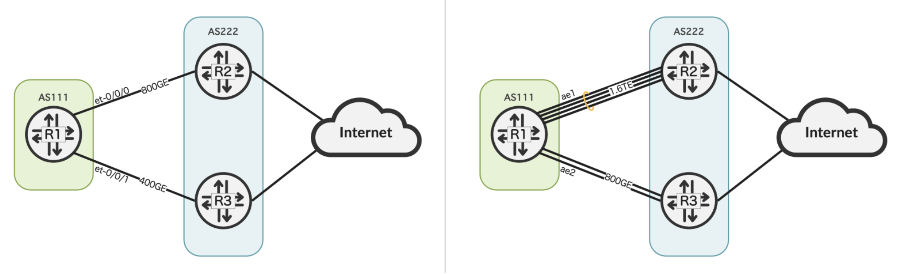
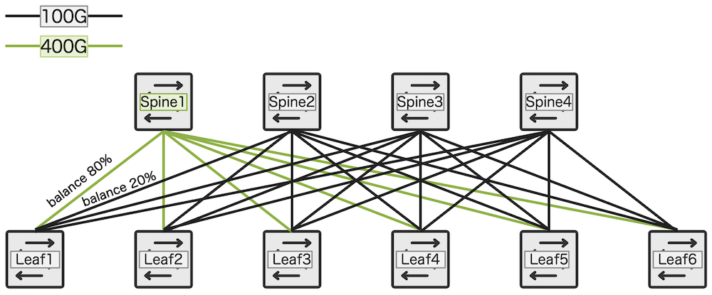

# BGP Link-Bandwidth with JunOS

**Moshiko Nayman - 05/13/2024**

The BGP Link-Bandwidth extension introduces an improvement to the BGP multipath, providing the ability to convey port speeds and propagate this information across network devices.

> *Note: the new features presented in this article are coming with Junos Release 23.4R2, publicly available the 27th of June, 2024.*

## Introduction

The BGP protocol lacks a built-in mechanism to factor in link bandwidth when calculating paths, unlike IGP protocols such as ISIS and OSPF. While internal networks can utilize underlay protocols like RSVP/SR for traffic engineering, connections between ISPs rely solely on eBGP. This presents challenges when managing multiple links with varying speeds and multipath configurations, resulting in uneven traffic distribution across links and potential packet loss. The goal is to address this issue locally and establish a method to communicate link speeds to remote peers, enabling better optimization of traffic distribution for load balancing. Driven by [draft-ietf-idr-link-bandwidth](https://datatracker.ietf.org/doc/draft-ietf-idr-link-bandwidth/) which is currently expired, Juniper is collaborating with other vendors to extend its support for the transitive Link-Bandwidth Community (lbwc).

In other words, we are enhancing the multipath feature to include both ECMP and WECMP options.

## Link-Bandwidth Community Structure

```
mnayman@R1> show route 1.0.0.0/24 detail | match "comm"         
                Communities: 9498:95 9498:100 9498:9498 9498:13335 34111:50112 34111:50113 40511:9498 bandwidth:222:99999997952
                Communities: 9498:95 9498:100 9498:9498 9498:13335 34111:50112 34111:50113 40511:9498 bandwidth:222:49999998976
```

**First Octet (bandwidth)**: indicates that the extended community pertains to bandwidth information.

**Second Octet (222)**: represents the autonomous system (AS) number associated with the extended community.

**Third Octet (99999997952)**: indicates the link speed encoded in the extended community.

In this case, the value 99999997952 corresponds to a link speed of 800 Gbps. Note: the value is in bytes.

**To derive the link speed in Gbps:**

- Multiply the third octet value by 8 (since 1 byte = 8 bits).
- Divide the result by 1 billion (to convert from bits to Gbps).
- Therefore, the link speed represented by "bandwidth:222:99999997952" is 800 Gbps.

> *Note: The number 99999997952 is accurate in terms of the calculation, but it may not match our expectation of a rounded value like 100,000,000,000. It represents the precise result of the calculation, taking into account the actual number of bits involved.*

## New Features Introduced in Junos 23.4R2

In summary, Junos 23.4R2 is bringing:

- Enhancement to the community member:

```
set policy-options community <community_name> members bandwidth-non-transitive:<value>
set policy-options community <community_name> members bandwidth-transitive:<value>
```

- Enhancement to policy-statement:

```
set policy-options policy-statement <policy-name> term <term_name> then auto-link-bandwidth transitive
set policy-options policy-statement <policy-name> term <term_name> then auto-link-bandwidth non-transitive

set policy-options policy-statement <policy_name> term <term_name> then aggregate-bandwidth transitive
set policy-options policy-statement <policy_name> term <term_name> then aggregate-bandwidth non-transitive
set policy-options policy-statement <policy_name> term <term_name> then aggregate-bandwidth divide-equal
```

- Enhancement to protocols bgp:

```
set protocols bgp group <name> link-bandwith auto-sense
set protocols bgp group <name> neighbor link-bandwidth auto-sense
set protocols bgp group <name> link-bandwidth auto-sense hold-down <hold-down> 

set protocols bgp group <name> send-non-transitive-link-bandwidth

set protocols bgp link-bandwidth-conflict use-community-order #Hidden command
```

## Auto-Link-Bandwidth

From Junos 23.4R2, there are two new knobs for the auto link-bandwidth feature.

```
set protocols bgp group <name> link-bandwith auto-sense
set protocols bgp group <name> neighbor link-bandwidth auto-sense
```

When link speed on IFL changes:

1. If the link speed of an existing IFL changes to lower than already sensed in link-bandwidth value, the change will trigger import evaluation immediately.
This is to prevent packet drops due to degraded link speed.
2. If the newly detected speed value is higher than already sensed link-bandwidth value, then the change will appear after the default timer expires, which by default 60s.
The default timer can be adjusted as necessary:

```
set protocols bgp group <name> link-bandwidth auto-sense hold-down <hold-down>
```

Example of Auto-Bandwidth with Auto-Sense

Whether it's a Service Provider network or a Data Center, BGP multipath offers significant advantages across diverse network scenarios. While traditional BGP Multipath is limited to Equal-Cost Multipath (ECMP) and BGP PIC is confined to active/backup configurations, recent advancements have introduced the capability for Weighted-ECMP (WECMP) in BGP.



With the following configuration, all imported routes on BGP group PEERING will be installed with the link-bandwidth community and balanced across two interfaces according to their respective link speeds, whether they are physical links (e.g., et- interfaces) or aggregated interfaces (e.g., ae).

Junos provides the flexibility to define policy conditions within a policy-statement, allowing you to specify criteria such as the route source (e.g., prefix, rib, protocol) and take corresponding actions, such as enabling auto-link-bandwidth.

```
set protocols bgp group PEERING link-bandwidth auto-sense

set policy-options policy-statement IMPORT-PEERING term 1 then auto-link-bandwidth
set policy-options policy-statement IMPORT-PEERING term 1 then accept
```

Validating control plane: The output displays the interface bandwidth and how it translates into a BGP route installed in the routing table.

```
mnayman@R1> show interfaces et-0/0/0.0 
  Logical interface et-0/0/0.0 (Index 353) (SNMP ifIndex 579)
    Flags: Up SNMP-Traps 0x4004000 Encapsulation: ENET2
    Bandwidth: 800Gbps

mnayman@R1> show interfaces et-0/0/1.0    
  Logical interface et-0/0/1.0 (Index 354) (SNMP ifIndex 580)
    Flags: Up SNMP-Traps 0x4004000 Encapsulation: ENET2
    Bandwidth: 400Gbps

mnayman@R1> show bgp neighbor 10.1.2.2                
Peer: 10.1.2.2+52576 AS 222    Local: 10.1.2.1+179 AS 111  
  Group: PEERING               Routing-Instance: master
  Forwarding routing-instance: master  
  Type: External    State: Established    Flags: <Sync>
  Last State: OpenConfirm   Last Event: RecvKeepAlive
  Last Error: Cease
  Import: [ IMPORT-PEERING ]
  Options: <PeerAS Multipath Refresh>
  Options: <GracefulShutdownRcv>
  Options: <LinkBandwidthAutoSense>
  Holdtime: 90 Preference: 170
  Graceful Shutdown Receiver local-preference: 0
  Number of flaps: 1
  Last flap event: InterfaceAddrDeleted
  Receive eBGP Origin Validation community: Reject
  Error: 'Open Message Error' Sent: 91 Recv: 0
  Error: 'Cease' Sent: 1 Recv: 0
  Link-Bandwidth Auto Sense Holdtime: 60

mnayman@R1> show route 1.0.0.0/24 extensive | match "balance|bandwidth" 
                Next hop: 10.1.2.2 via et-0/0/0.0 balance 67%, selected
                Next hop: 10.1.3.2 via et-0/0/1.0 balance 33%
                Communities: 9498:95 9498:100 9498:9498 9498:13335 34111:50112 34111:50113 40511:9498 bandwidth:222:99999997952
                Communities: 9498:95 9498:100 9498:9498 9498:13335 34111:50112 34111:50113 40511:9498 bandwidth:222:49999998976
```

Validating the forwarding plane: The output displays balanced installation in the PFE while maintaining equal multipath weights, resulting in Weighted-ECMP due to the Balanced influenced by the link-bandwidth auto-sense.

```
mnayman@R1> show route forwarding-table destination 1.0.0.0/24 table default extensive

Routing table: default.inet [Index 0] 
Internet:
    
Destination:  1.0.0.0/24
  Route type: user                  
  Route reference: 0                   Route interface-index: 0   
  Multicast RPF nh index: 0             
  P2mpidx: 0              
  Flags: sent to PFE, rt nh decoupled  
  Next-hop type: unilist               Index: 1048574  Reference: 2    
  Nexthop: 10.1.2.2
  Next-hop type: unicast               Index: 585      Reference: 5    
  Next-hop interface: et-0/0/0.0    Weight: 0x0   Balance: 43690
  Nexthop: 10.1.3.2
  Next-hop type: unicast               Index: 587      Reference: 5    
  Next-hop interface: et-0/0/1.0    Weight: 0x0   Balance: 65535
```

As stated, BGP Link-Bandwidth attribute is also beneficial for data centers due to its ability to support links with varying bandwidth capacities between spine and leaf devices. This feature facilitates the integration of devices with different transmission speeds within the network, enabling efficient traffic distribution based on link speed. Even with BGP multipath enabled, the network can effectively utilize unequal link rate with respective bandwidth utilization, optimizing data flow within the data center environment.



## Aggregate-bandwidth with Transitive and Non-Transitive Options

The aggregate-bandwidth feature is expanded to include transitive and non-transitive keywords.

When the aggregate divide option is enabled, the total link-bandwidth is divided by the number of peers in the advertising group. If peers are added or removed from the group, the new divided value must be sent to all peers.

```
set policy-options policy-statement <policy_name> then aggregate-bandwidth <transitive>
set policy-options policy-statement <policy_name> then aggregate-bandwidth <non-transitive>
set policy-options policy-statement <policy_name> then aggregate-bandwidth <divide-equal>
```

By default, the value is set to transitive for backward compatibility:

```
set policy-options policy-statement aggregate-bw then aggregate-bandwidth
```

## Sending Non-Transitive Link-Bandwidth Extended Communities

A new configuration option is introduced to allow the transmission of non-transitive-link-bandwidth-extended-community information to an eBGP neighbor at the group level. This feature is similar to the existing send-non-transitive-extended-community functionality which enables the transmission of all non-transitive extended communities over an eBGP session. However, the new knob specifically focuses on transmitting link-bandwidth communities. It doesn't distinguish between link-bandwidth communities that are originated locally and those that are received and readvertised; all non-transitive link-bandwidth communities will be advertised out using this configuration.

```
set protocols bgp group <name> send-non-transitive-link-bandwidth
```

## Resolving Global Link-Bandwidth Conflicts

To maintain the previous behavior of utilizing the first lower link-bandwidth (LBW) community based on community sorting, you can configure the hidden knob "use-sort-community."

```
set protocols bgp link-bandwidth-conflict use-community-order
```

The BGP session will reset after implementing this change.

## Conclusion

**Important note to conclude: **Enabling BGP multipath also installs additional next-hop entries in the PFE, occupying more memory, which can lead to memory constraints and limitations. However, this is not the case with Juniper devices such as MX Trio and PTX Express silicon.

Glossary

- AS: Autonomous System
- BGP: Border Gateway Protocol
- ECMP: Equal-Cost Multi-Path
- IFL: Interface Logical
- IP: Internet Protocol
- Junos: Juniper Operating System used in Juniper Networks routing, switching and security devices
- LBW: Link Bandwidth
- PE: Provider Edge router
- PFE: Packet Forwarding Engine
- PIC: Prefix Independent Convergence
- RE: Routing Engine
- WECMP: Weighted Equal-Cost Multi-Path

Useful links

- BGP Link Bandwidth IETF Draft: [https://datatracker.ietf.org/doc/draft-ietf-idr-link-bandwidth/](https://datatracker.ietf.org/doc/draft-ietf-idr-link-bandwidth/)
- MX304 FIB install rate
[https://juniper.github.io/techposts/mx304-fib-install-rate/article](https://juniper.github.io/techposts/mx304-fib-install-rate/article)
- Mastering BGP PIC on JUNOS
[https://juniper.github.io/techposts/mastering-bgp-pic-on-junos/article](https://juniper.github.io/techposts/mastering-bgp-pic-on-junos/article)
- FIB Compression
[https://juniper.github.io/techposts/ptx-fib-compression/article](https://juniper.github.io/techposts/ptx-fib-compression/article)
- BGP RIB Sharding
[https://juniper.github.io/techposts/bgp-rib-sharding/article](https://juniper.github.io/techposts/bgp-rib-sharding/article)

## Acknowledgments

Thanks to Reshma Das, Natarajan Venkataraman for developing the feature in Junos OS
