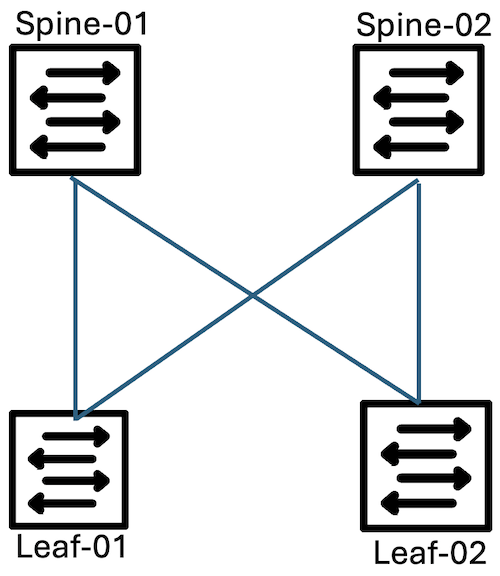
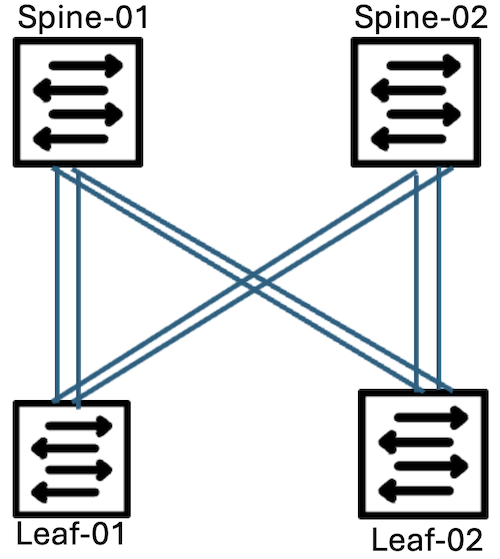
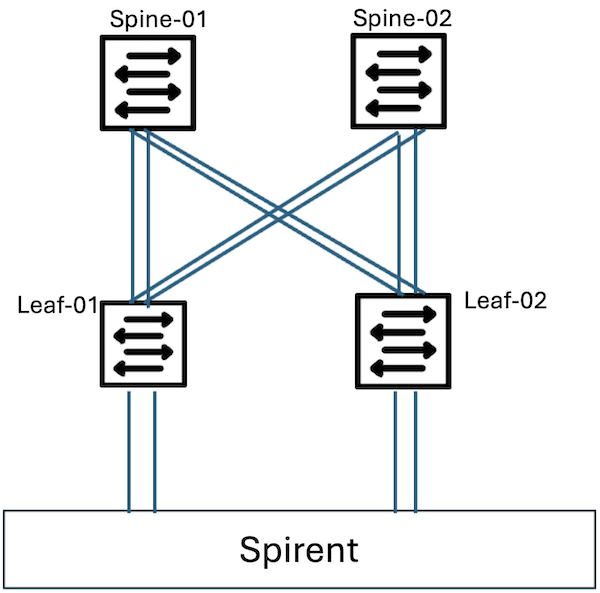
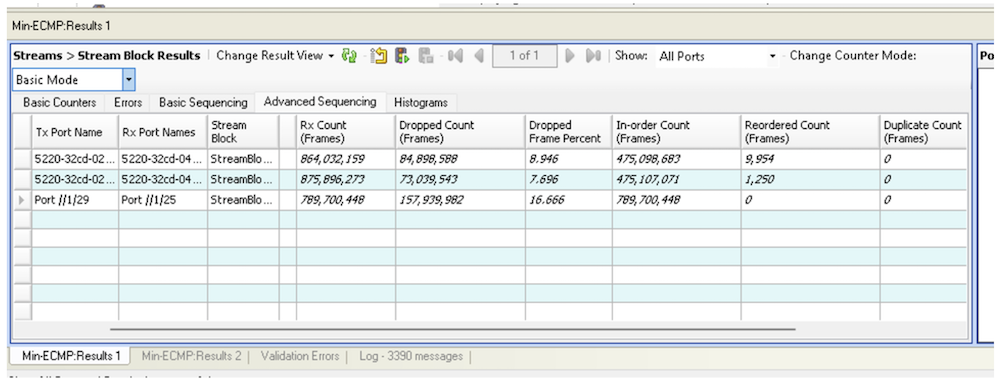
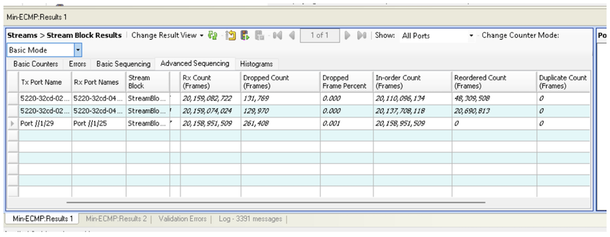
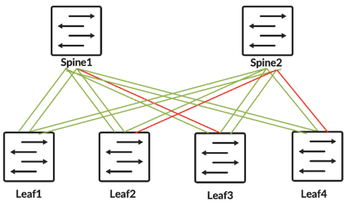
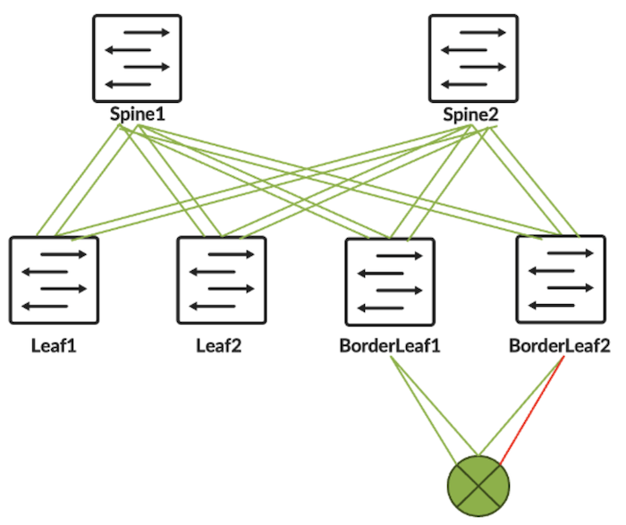

# BGP Minimum ECMP

**Himanshu Tambakuwala - 07/25/2024**

BGP Minimum ECMP is a new feature aiming at improving resiliency within DC networks.

## Introduction

This feature can help in any type of data center, whether enterprise or AI Inference and Training clusters given that there are multiple links connected between each pair of spine and leaf or spine and super spine. It will be helpful, especially in the enterprise or AI front-end networks where the traffic will travel north-south outside of the fabric.

This feature is introduced in Junos 23.4R2 on QFX5130-32CD, QFX5130-48C, QFX5130-48CM, QFX5220, QFX5230-64CD, QFX5240-64OD and QFX5240-64QD.

## Overview

Figure 1 below illustrates a 3-CLOS topology with two leaf and spine devices and with a single link between each leaf and spine. Traffic between Leaf-01 and Leaf-02 will be load-balanced across Spine-01 and Spine-02. In the event of failure of the connection between Spine-02 and Leaf-02, all the traffic destined to Leaf-02 will be re-routed to Spine-01 as BGP withdraws the prefixes learned through that neighbor.



Figure 2 illustrates a 3-CLOS topology with two leaf and spine devices with multiple links between the leaf and spine. Traffic between Leaf-01 and Leaf-02 will be load-balanced across all four links (two to spine-01 and two to spine-02). In the event of failure of one of the connections between Spine-02 and Leaf-02, Spine-02 will fail-over traffic to the other link. Leaf-01 is unaware of the link failure and will continue to send traffic on both its links to Spine-02. This may lead to traffic getting dropped at Spine-02 since the capacity is now reduced to 50%.



BGP minimum ECMP capability in our JunOS and Junos EVO operating systems is aimed at solving the problem scenario we discussed. With the introduction of this feature, BGP can conditionally advertise and withdraw routes. The "condition" needs to be configured under "policy-options" with a newly introduced match term, "minimum ecmp next hop". The user can decide to either advertise or withdraw routes based on the minimum ECMP next hop criteria being met or not.



With the context being set, let's simulate the problem scenario by bringing one of the links between Spine-02 and Leaf-02 down in Figure 3. We will first create the failure scenario and then configure the BGP Minimum ECMP feature to see how it helps with the scenario.

Traffic flows from the traffic generator between Leaf-01 and Leaf-02 via the spines. In Exhibit 1, we can see that Leaf-01 is receiving traffic on et-0/0/5 and et-0/0/10 which are connected to traffic generator ports. It is further load-balancing the traffic across all its four uplinks. Links et-0/0/1 and et-0/0/7 are connecting to Spine-01 and et-0/0/2 and et-0/0/3 are connecting to Spine-02.

*CLI Output - Exhibit 1*

```
root@leaf-01> monitor interface traffic
Interface    Link     Input bytes        (bps)      Output bytes        (bps)
<snipped output>
 et-0/0/1      Up         27269541           (0)  599695951480958 (29411692360)
 et-0/0/2      Up          5291891           (0)  689312038005878 (29412444040)
 et-0/0/3      Up          5238734           (0)  532198589530793 (29411719864)
 et-0/0/5      Up  775633304888629 (58823432392)          5054916           (0)
 et-0/0/7      Up          3790193           (0)  588580558635405 (29411591000)
 et-0/0/10     Up 1641208777608416 (58823556560)          6343119           (0)
```

Let us also verify from Spine-01 and Spine-02.

*CLI Output - Exhibit 2*

```
root@spine-01> monitor interface traffic
Interface    Link     Input bytes        (bps)      Output bytes        (bps)
<snipped output>
 et-0/0/1      Up  989858973289333 (29408598576)    1084387468550           (0)
 et-0/0/7      Up  591758955506148 (29405914880)          3806466           (0)
 et-0/0/25     Up  611386131242165 (58816986256)  456987836160527 (23526783464)
 et-0/0/26     Up         10633040           (0)  711732035731953 (35291199536)
```

Exhibit 2 illustrates that on spine-01, traffic is being received on et-0/0/1 and et-0/07 which are connecting to Leaf-01. The traffic is being forwarded on et-0/0/25 and et-0/0/26 which are connecting to Leaf-02.

*CLI Output - Exhibit 3*

```
root@spine-02> monitor interface traffic
Interface    Link     Input bytes        (bps)      Output bytes        (bps)
<snipped output>

 et-0/0/0      Up  699384531030678 (29411761912)         89384534           (0)
 et-0/0/1      Up       3978162477           (0)  763871545838342 (58823529408)
 et-0/0/3      Up  537352628600982 (29411783824)          8541204           (0)
 et-0/0/4      Up  618333639826744 (58823374656)         18976857        (1472)
 et-0/0/24     Up       2225584836           (0) 1083354593273763 (58821499976)
```

Exhibit 3 illustrates that on Spine-02, traffic is received on et-0/0/0 and et-0/0/3, which are connected to leaf-01, and sent out through et-0/0/1 and et-0/0/24, connected to leaf-02.

Spine-02 also receives traffic from another leaf on its et-0/0/4 interface, which is again going to Leaf-02 through the same links. This stream is active as the background traffic and will continue to flow in the same direction during the test.

We shut down the interface on Leaf-02 side that is connecting to Spine-02 as illustrated by Exhibit 4 and we check the impact on traffic.

*CLI Output - Exhibit 4*

```
root@leaf-02# set interfaces et-0/0/11 disable 

[edit]
root@leaf-02# commit 
commit complete

[edit]
root@leaf-02#
```

In the output of "monitor interface traffic" at spine-02 in Exhibit 5, we can see that traffic is received as it was on Exhibit 4 on et-0/0/0 and et-0/0/3. However, since et-0/0/24 is down, all traffic is sent through et-0/0/1. But it can only carry 100G and the rest of the traffic is being dropped.

*CLI Output - Exhibit 5*

```
root@spine-02> monitor interface traffic
Interface    Link     Input bytes        (bps)      Output bytes        (bps)
<snipped output>

 et-0/0/0      Up 1010355209139771 (29411290944)         91039778           (0)
 et-0/0/1      Up       3979816631           (0) 1412847456057907 (98038166136)
 et-0/0/3      Up  848323306694589 (29411393712)         10194711           (0)
 et-0/0/4      Up 1240274993769160 (58822717280)         20112081           (0)
```

In Figure 4, we observe the packet drops on the traffic generator.



These drops are happening because Leaf-01 is unaware of the change in total capacity available at Spine-02 towards the destination connected to Leaf-02, so it continues to send all traffic destined to Leaf-02 through its uplink towards Spine-02 as before. Meanwhile, Spine-02 had one of its local links fail. It forced the fail-over of all the traffic on this failed link to the other link, which resulted in exceeding the capacity of the link and leading to traffic loss.

Now, let see how BGP Minimum ECMP feature can be of help in this scenario.

## Configuration

As we alluded to earlier, BGP can take configured constraints before advertisement/withdrawal, via import and export policies. This constraint is introduced using the export policy match condition "nexthop-ecmp". Here Exhibit 6 illustrates a policy that rejects all prefixes when the prefix does not have 2 or more next-hops in the unilist which represents ECMP next hop.

*CLI Output - Exhibit 6*

```
root@spine-02> 
set policy-options policy-statement Min-ECMP term min-ecmp from nexthop-ecmp less-than 2
set policy-options policy-statement Min-ECMP term min-ecmp then reject
set policy-options policy-statement Min-ECMP term default then accept
```

This policy is applied as "export" as shown in Exhibit 7.

*CLI Output - Exhibit 7*

```
root@spine-02> 
set protocols bgp group underlay export Min-ECMP
```

Exhibit 8 shows that Spine-02 is advertising a prefix learned from Leaf-02 to Leaf-01.

*CLI Output - Exhibit 8*

```
root@spine-02> show route advertising-protocol bgp 192.168.11.6 4.0.0.0 

inet.0: 43 destinations, 51 routes (43 active, 0 holddown, 0 hidden)
  Prefix                  Nexthop              MED     Lclpref    AS path
* 4.0.0.0/32              Self                                    64522 65531 I

root@spine-02> show route advertising-protocol bgp 192.168.12.0 4.0.0.0    

inet.0: 43 destinations, 51 routes (43 active, 0 holddown, 0 hidden)
  Prefix                  Nexthop              MED     Lclpref    AS path
* 4.0.0.0/32              Self                                    64522 65531 I

root@spine-02>
```

Now, let's repeat the previous failure scenario by bringing down one of the interfaces between Spine-02 and Leaf-02 and verify that BGP no longer advertises the prefixes from Leaf-01 to its neighbors because our policy condition dictates that whenever the ecmp next hop is less than 2, it should reject all prefixes.

*CLI Output - Exhibit 9*

```
root@leaf-02# set interfaces et-0/0/11 disable 

[edit]
root@leaf-02# commit 
commit complete
```

*CLI Output - Exhibit 10*

```
root@spine-02> show route advertising-protocol bgp 192.168.11.6 4.0.0.0    

root@spine-02> show route advertising-protocol bgp 192.168.12.0 4.0.0.0    

root@spine-02>
```

In Exhibit 10, we verify that Spine-02 has stopped advertising leaf-02 prefixes to Leaf-01.

*CLI Output - Exhibit 11*

```
root@spine-01> monitor interface traffic
Interface    Link     Input bytes        (bps)      Output bytes        (bps)
<snipped output>

 et-0/0/25     Up 1250703436475939 (58823465728)  718426958083103 (72352852648)
 et-0/0/26     Up         12412622           (0) 1099948573932828 (45294072048)
```

Exhibit 11 illustrates interface statistics on Spine-01. Both et-0/0/25 and et-0/0/26 which are connecting to Leaf-02 have a significant increase in traffic as compared to Exhibit 2. This is because spine-02 stopped advertising Leaf-02 prefixes to Leaf-01, forcing it to stop sending any traffic through Spine-02. Instead, it is sending it to spine-01.

On Spine-01, we have enough capacity to take this additional traffic, so no traffic is lost as illustrated by Figure 5.



Let's look into some more production scenarios where this feature will be useful.



Figure 6 illustrates multiple failures between different spine and leaf combinations. Because of the failure of the link between Spine2 and Leaf4, for the traffic towards Leaf4, Spine1 will be preferred. Because of the failure of the link between Spine1 and Leaf3, for the traffic towards Leaf3, Spine2 will be preferred. Because of the link failure between Spine2 and Leaf2, for the traffic towards Leaf2, Spine1 will be preferred.



Figure 7 illustrates a topology with a border leaf where there is a failure between border leaf and gateway. As the capacity of BorderLeaf2 to the gateway is reduced, with the help of this capability, the traffic towards BorderLeaf2 can be reduced for certain prefixes to avoid the bottleneck.

## Conclusion

With the introduction of this feature, in DC fabrics where there are multiple ECMP links between leaf-spine nodes, users can overcome the inherent load-balancing behavior leading to reduced capacity. Users can effectively take a spine node out of service if it can't satisfy a predefined capacity. This feature can be applied to specific prefix ranges or to the whole prefixes with the flexibility of policy configurations.

## Glossary

- BGP: Border Gateway Protocol
- ECMP: Equal Cost Multi Path

## Acknowledgments

This article is a collaborative effort of Sanoop Rajan and Himanshu Tambakuwala.
