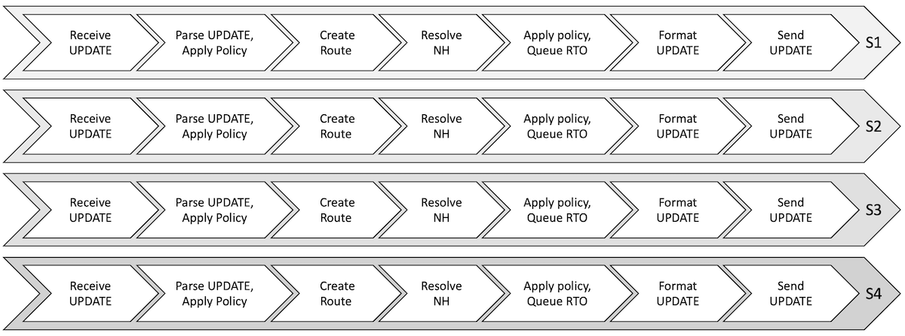
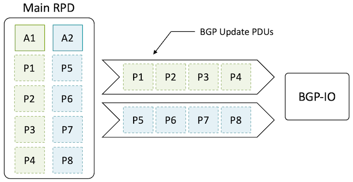
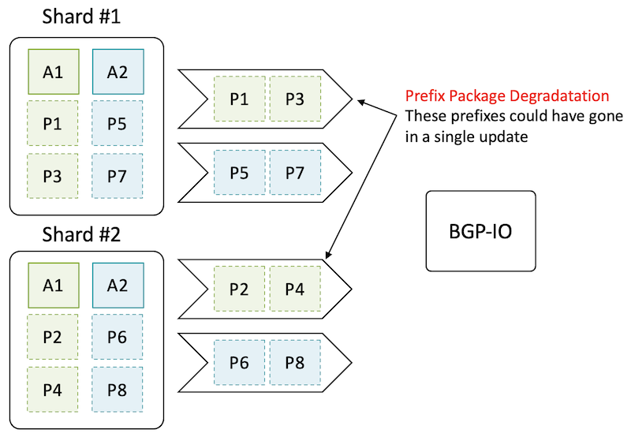
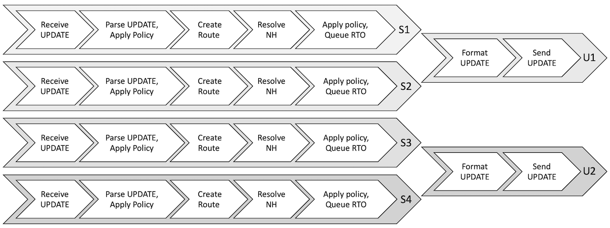
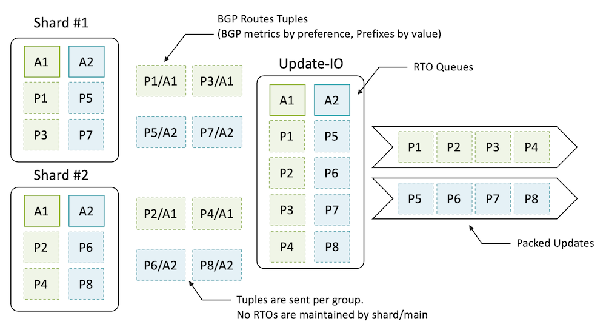
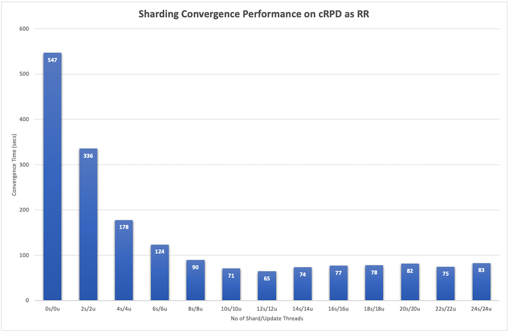
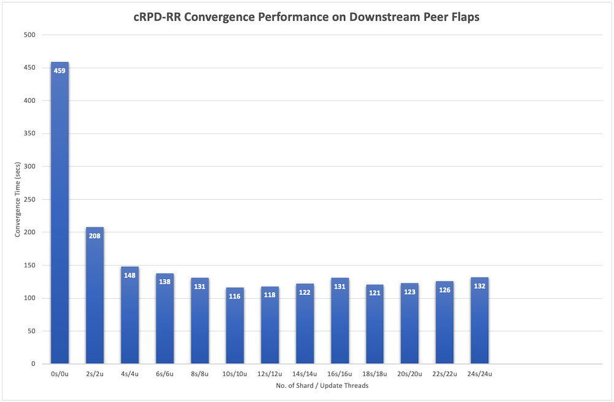
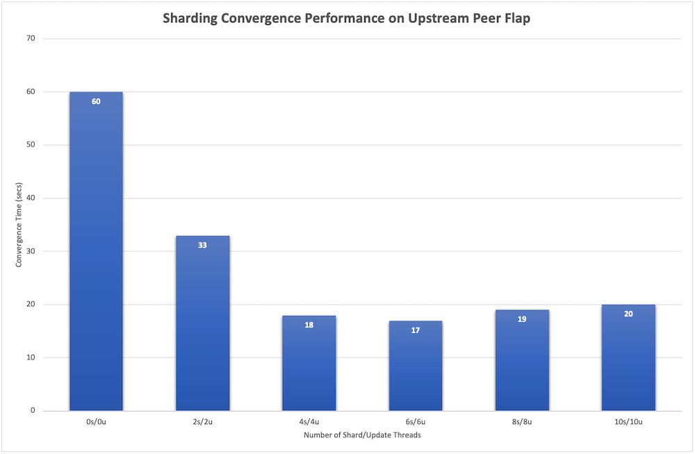
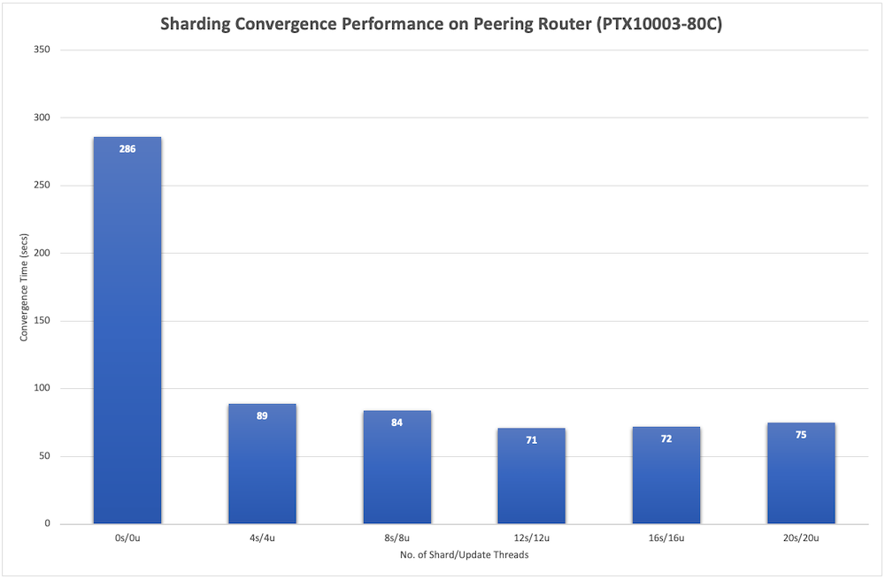
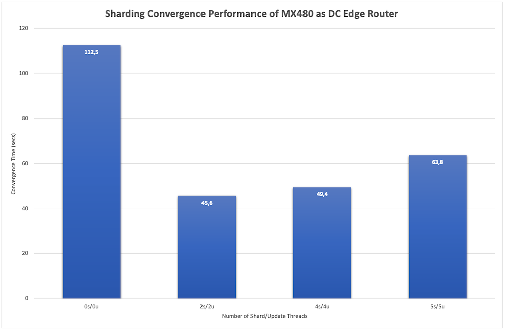

# BGP RIB Sharding

**Ravindran Thangarajah - 10/24/2022**

Discover how BGP RIB Sharding can help improve routing performance and scale in JUNOS.

## Introduction

Border Gateway Protocol (BGP) forms the basis for routing in the Internet and datacenter networks. This protocol has a track record of successfully running the Internet for years. It supports extensive policy controls and is expected to handle very large prefix scale as compared to intra-domain protocols like OSPF and ISIS. BGP's multi-protocol capabilities are used to setup large Layer2 and Layer3 VPNs on top of a core IP or IP/MPLS backbone. But it does suffer from some issues like 'slower convergence' when route flaps or peering goes down. Research reported in reference [1] and [2] has previously shown that BGP suffers from slow convergence, route instabilities and misconfigurations leading to routing errors.

BGP protocol processing can be viewed as a pipeline of operations that operate on information encapsulated in BGP Update messages. Information in the Update message includes destination prefixes and their attributes. This pipeline (Figure 1) enables a BGP node to learn routes from Update messages for its use and to advertise routes to BGP peers.

- The BGP Update message is received from a BGP peer.
- The Update is parsed and information in it is extracted.
- Input policies, if any, are applied. Route entries are created in the Routing Information Base (RIB) for all destination prefixes in the Update message.
- The route is resolved, if needed, to identify the next hop to be used for that route. Best path selection is done to identify the best route.
- Output policies are applied on RIB routes. Those routes that need to be advertised are converted into an intermediate form -- Route Tuple Object (RTO).
- The routes to be advertised are coalesced and formatted into BGP Update messages.
- Update messages are written to TCP sockets and sent to BGP peers.

To address the slower convergence issues, a newer approach was designed. This blog explains our approach of applying multithreading and Sharding of BGP Routing Information Base (RIB). Lastly, we list use cases where this approach is useful in improving convergence and several deployments, we have come across so far.

## Routing Protocols Daemon

RPD is the daemon which implements unicast routing, multicast routing, MPLS protocols, and VPN services for JUNOS. This daemon is designed to run on several form factor routers and switches shipped by Juniper. It also runs on servers and containers. Initially, RPD was designed to run in a single thread, in a memory constrained environment. It employed a cooperative run-to-completion multi-tasking task scheduler model.

While RPD was written to be highly efficient, the limitation of executing in a single CPU core was felt for a while, especially with many services built on top of BGP.

As part of first generation of improvements, some of the Input/Output (I/O) operations in RPD were delegated to separate "IO" threads -- for example, RSVP-IO, BGP-IO etc. These were loosely coupled to RPD main thread and did not contend for state in main thread. IO threads ran the same cooperative scheduler than the main RPD thread. These IO threads provided real-time responsiveness for hellos/IO during system load. They were otherwise unable to take CPU load off main RPD thread which was still running the bulk of BGP pipeline except for the socket read/write operations.

### RPD and Multithreaded BGP

Traditional approach to multithreading involves fine or coarse grain locking to ensure consistency of state information contented by various threads. RPD has been stabilized and finely tuned over decades and was deemed a non-starter to rewrite RPD to conform to lock-based concurrency architectures. It would have been quite an undertaking to introduce locks into an architecture that was not built for it. There were also concerns with industry experience in general with fine grained locks regarding maintainability and performance.

Juniper Engineers made following observations that influenced the multithreading architecture:

- BGP was the largest consumer of CPU in RPD. An architecture that enables BGP to use more cores naturally enhances the performance of RPD as a whole.
- BGP work commences with arrival of prefixes in inbound updates and concludes with advertisement of prefixes in update messages (aka BGP pipeline). This work is embarrassingly parallel for the most part.
- Routing protocols (in general) have evolved with an eventual consistency principle. This implies that the threads can be decoupled and evolve their states independently provided the system achieves overall eventual consistency. This was true even without multi-threading and is an inherent aspect of networking software design.

## Sharding for Multithreaded BGP

Sharding is a well-known technique used in cloud computing to scale services. A large data is sliced into "Shards" that are each handled by one or more servers in a cluster.

Sharding has been implemented in RPD by dividing RIB into shard slices. Each RIB slice is handled by a shard thread (like a server in a cluster) independently without needing any synchronization from other shard threads. This is quite amenable to RPD's design which sans any synchronization primitives.

A multithreaded BGP Pipeline is illustrated in Figure 2. BGP processing work commences with the arrival of prefixes and concludes with dissemination of updates. Much of RPD state required for the above pipeline is "localized" using per-thread storage. This provides the "mini eco-system" in which the existing RPD code runs the BGP pipeline without any need to synchronize among the various shard threads: S1, S2, S3, S4. We used hashing techniques to identify which BGP Updates needed to be handled by which Shard thread (S1..S4). A route prefix IP address is used for hash calculation. As a result of Update processing, an Update may be sent to one or more Shard threads.

When received by a shard thread, it only processes the route prefixes in the Update that belongs to the Shard thread. For the purposes of the best route calculation in each shard, all non-BGP routes from the main routing table are also distributed to shards after calculating hashes. This guarantees that all routes matching a prefix are all belonging to a single Shard thread.

### Why do we need Update threads?

BGP updates are sent most efficiently when prefixes that have same attributes are packed in same update message. Sharding, while parallelizing the BGP pipeline (as above), however, introduces a problem. If shard threads emit updates toward BGP peers, different prefixes from each shard thread will require its own update message and thus cannot be packed together. This has the unfortunate effect of reducing concurrency gains achieved by Sharding.

Consider the figure below where present day RPD/BGP is generating two updates. Update in Green contains attribute 'A1' with prefixes P1, P2, P3 and P4. Update in Blue contains attribute 'A2' with prefixes P5, P6, P7 and P8. RPD main thread generates these updates which are then sent to the peer(s) over TCP sockets by the BGP-IO thread.

Consider two shards: one handling 'odd' prefixes and other handling 'even' prefixes. Each generates two updates resulting in system generating 4 updates. This creates more work in shard threads and erases concurrency gains.

To address this problem with update threads, instead of generating updates, shards will send tuples containing shorthand for the prefix/attribute information and an update thread will pack the various tuples and will generate updates:

As can be seen below, the system now generates two efficiently packed updates.

Sharding by its inherent design distributes state across shard threads. However, some functions in RPD (& BGP also) requires a centralized view:

- For instance, resolution of a nexthop requires centralized view of all the routes that potentially resolve it. Active routes are sent to the Main thread from shards. A Resolver as a service application in main thread provides resolution service for various shards.
- A conditional manager policy requires presence of certain routes that may be spread across various shards. A condition manager proxy is implemented in shards that track the satisfiability of the conditions.
- There might be a requirement to export some BGP routes into IGP.
- FIB downloading module (KRT) requires access to active routes for downloading.

## Sharding Use Cases

Route scale and RIB-FIB ratios are two key parameters that determine the potential for performance gains with BGP Sharding.

Offloading BGP pipeline processing to separate threads of execution has a cost: the additional interactions and processing need to keep in sync the states managed by the different threads. Sharding performs well when the amount of offloaded processing outweighs the overheads involved.

The amount of work offloaded is high with large BGP routes scale. RIB Sharding's impact is significant when dealing with millions and tens of millions of routes. Use cases involving minimal additional processing other than BGP pipeline processing will place minimal demands on the rest of the threads in RPD, especially the main thread. These use cases have the best potential for performance gains.

Some scenarios might require processing in the main thread like active route selection (among routes contributed by multiple protocols) or downloading of active route to the FIB. For such use cases, the higher the amount of work is done in shard threads compared to the work done in the main thread for each destination prefix, the better the performance gains. When a given destination prefix is being learnt from many BGP peers, the per-prefix work in shard thread context typically exceeds the work done in the main thread, making for a good use case scenario for Sharding. When same destination prefixes are learnt from multiple BGP peers, we speak of a RIB-FIB ratio:

***RIB-FIB ratio = (Total Number of Prefixes Learnt / Total Number of Unique Prefixes)***

An high RIB-FIB ratio indicates a good Sharding use case.

### BGP Route Reflectors

BGP Route Reflectors (RR) are critical nodes in a network that help scale BGP deployments by reducing the number of direct peering connections between BGP nodes. Acting as brokers, they mediate the flow of BGP protocol information between BGP nodes. We call these BGP nodes "clients" of the RR.

Two characteristics of RRs make them the perfect use case for deploying Sharding:

- Large Route Scales: RRs typically handle route volumes in the range of millions to tens of millions of routes. In most use cases where basic levels of redundancy are built in, the RIB-FIB ratio is 4:1 or higher.
- Control Plane Only: RRs typically operate only at the control plane level and do not participate in packet forwarding. In other words, the routes that are learnt are not downloaded to the FIB. This means that from RPD's perspective the main thread has very minimal processing to do for these BGP routes. This allows for the performance to be scaled by scaling up the number of shards threads (along with the number of processor cores).

Optimal Route Reflection (ORR) functionality in RRs allow for better selection of best routes by factoring in the location of a client BGP node in the overall network topology. Best route selection is done separately for each client node using network topology information learnt via IGP protocols. This is a compute-intensive functionality. With Sharding this functionality is performed in parallel in the shard threads resulting in significant performance gains when ORR is deployed.

Juniper's RR product offerings also come in virtual form factors, like vRR (virtual Route Reflector) and cRPD (containerized RPD). These virtual products have a further advantage of being able to scale even better as they can take advantage of the numerous processor cores that are available on third party servers.

| Test Aspect | Test Setup Configuration |
|:--|:--|
| BGP Learning | 10 Internet Feeds (800 K routes each);800K x 10 peers = 8M prefixes inbound;these 10 peers are in one peer group |
| BGP Advertising | To 1000 peers;800K routes x 1000 peers = 800M prefixes outbound;20 peer groups with 50 peers in each peer group |
| JUNOS cRPD Version | 20.1R1.11 |
| Server | 24 core Intel Xeon E7-8890 v4 @ 2.20GHzand128 GB memory |
| Peer Nodes | vRRs on Dell servers with special test build for high-speedtransmission/reception of BGP PDUs to ensure that there is no IO bottleneck |

The total BGP learning and advertising time (convergence time) is measured from the time the first of the inbound prefix is received till the time the last of the outbound prefix gets sent out. The test was done without BGP Sharding for a baseline performance number to compare with. Then, BGP Sharding and update threading was configured, and the test was repeated for different number of shard and update threads. The observed convergence time is plotted in the graph below.

The best performance is seen with 12 shards and 12 update threads -- convergence with Sharding is almost nine times faster. This thread configuration uses 24 threads which, in turn, fits well with the 24 CPU cores available on the server. Higher number of threads result in slightly lower performance due to the scheduling/time-sharing overheads involved in sharing the available CPU cores among the threads.

Another convergence scenario that occurs frequently in the real world is BGP peer flaps -- peering connectivity with one or more BGP peers goes down due to network failures and then comes back up. When this happens, we would like the re-establishment of peer connectivity and relearning of prefixes from those peers to be as fast as possible. We measured the performance of Sharding for two different variations of this scenario: flapping of downstream peers (peers to which DUT advertises routes predominantly) and flapping of upstream peers (peers from which DUT learns routes predominantly).

Convergence performance with and without Sharding for the downstream flap scenario is depicted in the chart below. This test used the same configuration used for the previous test. 75% of the downstream peers (750 out of the total 1000) were picked at random and peer flaps induced for them. This scenario results in a lot of work for the egress stages of the BGP pipeline (write side) in the DUT. Workload for the ingress stages is not much at all. The performance gains therefore are dictated by the amount of parallelization possible for the egress stages. Convergence performance with Sharding was almost four times faster (for the best case) when compared to the baseline. Some variations in performance gains are observed around the best-case combination. This is mainly due to the randomness in the set of peers that flapped, which in turn affects the amount of work that needs to be done during the convergence window.

For the upstream peer flap scenario, the best path peer was picked (this is the one with the numerically lowest BGP peer address value) and flapped. Flapping this peer results in the highest workload as best path calculation has to be redone for all the routes so that they use the next best peer. Once all the routes use the next best peer, the flapped peer was brought up, which results in all routes eventually moving back to the flapped peer. Convergence performance from this test is shown in the chart below. The test was done on a server with an 8-core CPU, and the best-case performance is about three-and-a-half times faster than the performance without Sharding.

### Peering Routers

Peering routers, deployed at the boundary of a network, establish multiple eBGP peering sessions to peering routers of other networks to receive and publish network reachability information.

To enforce routing policies and for security purposes, these routers deploy elaborate BGP import and export policies as they peer and interact with their peers in other networks. Application of BGP policies is heavily compute-intensive. Offloading policy application to shard threads helps significantly speed up BGP processing in these routers.

The potential for speeding up policy application, along with the fact that these routers typically have a large number of BGP peers and deal with BGP route scale in the millions, makes for a compelling use case for deploying Sharding.

We tested a convergence scenario where BGP goes operationally down completely and then comes up relearning all the prefixes and setting up the forwarding plane. Convergence time was calculated indirectly by measuring the traffic outage time in the forwarding plane for traffic going to destinations reachable via those BGP prefixes. Juniper's PTX10003 router, which gets deployed in peering role very often, was chosen as the platform for this test. The most important aspects of the test are captured in table below:

| Test Aspect | Configuration Used |
|:--|:--|
| Platform | PTX10003-80C (Routing Engine: Intel Broadwell 12-core CPU with Hyper-Threading enabled) |
| JUNOS Release | 20.1R2-S3.3-EVO |
| BGP Learning | 11M routes total with 1M unique prefixes (11:1 RIB-FIB ratio) learnt from 200 eBGP peers |
| BGP Advertising | 1M route to 2 iBGP peers (route reflectors) |
| Convergence Event | "clear bgp neighbor all" CLI command was used to trigger all of BGP going down |
| IGP/MPLS Configuration | ISIS and RSVP were configured with scale seen in typical deployments. A few hundreds of  ingress/egress LSPs were also present as is typical of peering deployments. |
| Peer Nodes | Nodes with special test build capable of high performance BGP IOto ensure that IO is not a bottleneck were used. |

The results from the above test are captured in the graph below:

From the above graph, the best convergence performance was seen with 12 shards and 12 update threads. Sharding performed four times faster than the baseline scenario without Sharding. For higher thread counts the performance was slightly lower due to the scheduling overhead that comes into picture when the number of threads exceed the number of available CPU cores.

### Datacenter Edge Routers

Data center edge routers fill an important role as the conduit between a data center and the external world. Traffic between a data center and its end users, as well as traffic flowing between a data center and other data centers pass through these edge routers. Therefore, these edge routers occupy a critical position in the network.

Being the interface to the outside world they tend to peer with edge routers of other data centers and with internet peering routers. In some deployments they also take up significant portions of the peering functionality. Due to all these factors, they typically deal with a large route scale running into millions of routes. They also tend to have a good number of BGP peering connections. Virtual Routing and Forwarding (VRF) instances are also deployed for segregation and ease of management purposes.

The large route scales and BGP peering sessions, combined with the fact that these routers are deployed in a very critical position of the network, makes for a good case for deploying BGP Sharding. Sharding can help by improving BGP performance and by freeing up CPU compute for other protocols and policies so that the control plane performance is improved overall.

We tested the same convergence scenario that was tested with peering router -- how long does it take for BGP to come up, relearn and setup all routes in forwarding plane after going down. The configuration used was that of a typical data center edge router that also does peering role. Convergence performance was measured by finding the data plane traffic outage time. MX480 with Routing Engine RE-2X00x6, deployed quite frequently in DC Edge role, was chosen as the platform for this test. Salient aspects of the test setup and steps are captured in the table below.

| Test Aspect | Configuration Used |
|:--|:--|
| Platform | MX480 with RE-2X00x6 (4 CPU cores) and MPC7E |
| JUNOS Release | 20.1R1.11 |
| BGP Learning | 7M IPv4 prefixes with 1M unique routes (7:1 RIB-FIB ratio);600K IPv6 prefixes with 100K unique routes (6:1 RIB-FIB ratio);IPv4 prefixes learnt from 900 eBGP peers; IPv6 prefixes learnt from 200 eBGP peers |
| BGP Advertising | 1M IPv4 and 100K IPv6 prefixes advertised to 4 iBGP peers (RRs) |
| Convergence Event | "clear bgp neighbor all" CLI command was used to trigger BGP going down |
| IGP/MPLS Configuration | ISIS (flat topology L2 ISIS) and RSVP were configured with scale seen in typical deployments.  100K transit LSPs and 15K ingress/egress LSPs each were present |
| Peer Notes | Nodes with special test build capable of high performance BGP IOto ensure that IO is not a bottleneck |

Results from the test are depicted in the graph below:

From the graph above we can see that the convergence performance with Sharding is more than two-and-a-half times faster with Sharding than without it. The best performance is seen for the 2 shard and 2 update thread configurations as that keeps the total number of threads close to the number of available CPU cores. Increase in number of threads beyond this point results in lower performance gains due to the overheads involved in sharing CPU cores.

In summary, for the Sharding use cases that fit the deployment requirements, on appropriately chosen platforms, performance with Sharding can be many times higher when compared with the baseline performance without Sharding. By deploying Sharding properly in the use case scenarios that it was designed for, excellent BGP performance gains can be realized. This comes with the added benefit of improved performance for other protocols due to the offloading of BGP processing to dedicated threads.

## Customer Deployments

Sharding has been deployed successfully in customer networks of different types including service provider, cloud provider and large enterprise networks. Deployments are seen in networks with high BGP route scale typically in the range of millions of routes. Many of these deployments also have other compute intensive features like policy application and Optimal Route Reflection enabled in them. A sizeable proportion of the existing deployments have been for RR use cases. Sharding has helped improve BGP convergence performance and increase the overall performance and stability of the nodes involved.

### Deployment A

This deployment is at a large tier 1 service provider on their MX204 routers deployed as RR nodes. After initial lab testing that showed promising speed ups in BGP processing and exporting of routes, the deployment is underway in a gradual manner. It is eventually planned to cover more than the three dozen RR nodes in the network with deployment to Provider Edge (PE) routers planned after that.

A typical RR in this deployment with Sharding enabled has the following profile:

- About 150 BGP Peering sessions
- Around 10 million IPv4 routes (RIB-FIB ratio of about 12:1)
- Around 1 million IPv6 routes (RIB-FIB ratio of about 8:1)
- 5 shard and 5 update threads (default number of threads on a MX204)
- BGP families deployed: IPv4/IPv6 Unicast, Labeled-Unicast

### Deployment B

This deployment is also at a large tier 1 telecom service provider that offers fixed and mobile services. This deployment was in the RR nodes of the SP network. The main driver for this deployment was the use of Optimal Route Reflection (ORR) feature. Due to the heavy compute requirements of this feature, it was not rolled out in their network initially as the SP would have liked. With the availability of Sharding, ORR has been deployed along with Sharding in their vRR nodes running JUNOS. More than half dozen of their vRR nodes have been upgraded to deploy Sharding with ORR at the time of this writing.

A typical vRR node that has Sharding deployed would have:

- IPv4/IPv6 unicast, IPv4/IPv6-VPN BGP families deployed
- About 240 -- 260 BGP peering sessions
- About 3-4 Million Routes (with a RIB-FIB ratio of around 4:1)
- 16 shard and 16 update threads configured. In some cases more update threads are configured to handle higher loads on the advertising side of the pipeline

For the above customer, the primary driver was the deployment of ORR in their RRs. By offloading this compute intensive feature to multiple threads, Sharding was the key in helping scale the performance of BGP in their network.

## Conclusion

BGP protocol is a key building block for modern networks. It is deployed in service and transport layers in many networks around the world.

BGP convergence performance is vital for reducing traffic outage during convergence windows and thereby increasing service availability in today's networks. Sharding and update-threading approach to solve BGP convergence performance is based on proven approach to increasing performance through parallelization on multicore systems.

Using multiple BGP pipelines that run independently without needing to arbitrate access to shared state or to coordinate execution among themselves, provides for a highly scalable architecture.

Performance scales up well in this architecture along multiple dimensions -- be it an increase in CPU cores, RIB size and number of BGP peers, or the addition of new compute-intensive BGP features/functionality. This allows us to handle BGP performance scaling requirements for years to come even as BGP gets deployed more and more in modern networks.

All of this done in a single system architecture that can be deployed in single-threaded or multi-threaded mode on different platforms makes JUNOS's multithreaded BGP offering unique in the networking industry.

Many customers have deployed JUNOS BGP Sharding in multiple use case scenarios and are reaping the benefits of the superior performance that it brings, standing as a testament to these industry leading features!

### Reference

- [1] Craig Labovitz, Abha Ahuja, Abhijit Bose, and Farnam Jahanian. Delayed internet routing convergence. In Proceedings of the Conference on Applications, Technologies, Architectures, and Protocols for Computer Communication, SIGCOMM '00, page 175--187, New York,NY, USA, 2000. Association for Computing Machinery.
- [2] Zhuoqing Morley Mao, Ramesh Govindan, George Varghese, and Randy H. Katz. Route flap damping exacerbates internet routing convergence. In Proceedings of the 2002 Conference on Applications, Technologies, Architectures, and Protocols for Computer Communications, SIGCOMM '02, page 221--233, New York, NY,USA, 2002. Association for Computing Machinery.
- Day One Book on BGP RIB Sharing and Update Threading: [https://www.juniper.net/documentation/en_US/day-one-books/DO_BGPSharding.pdf](https://www.juniper.net/documentation/en_US/day-one-books/DO_BGPSharding.pdf)

## Glossary

- BGP: Border Getway Protocol
- CPU: Central Processing Unit
- I/O: Input/Output
- ISIS: Intermediate System to Intermediate System protocol
- KRT: Kernet Routing Table
- MPLS: Multi Protocol Label Switching
- NH: Next-Hop
- OSPF: Open Shortest Path First
- RIB: Routing Information Base
- RPD: Routing Protocols Daemon
- RR: Route Reflector
- RTO: Route Tuple Object
- TCP: Transmission Control Protocol
- VPN: Virtual Private Network
- VRF: Virtual Routing and Forwarding

## Acknowledgements

This article has been co-written with Sanjay Khanna and Jaihari Loganathan.
