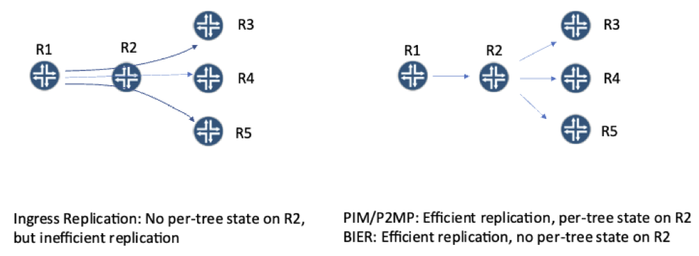
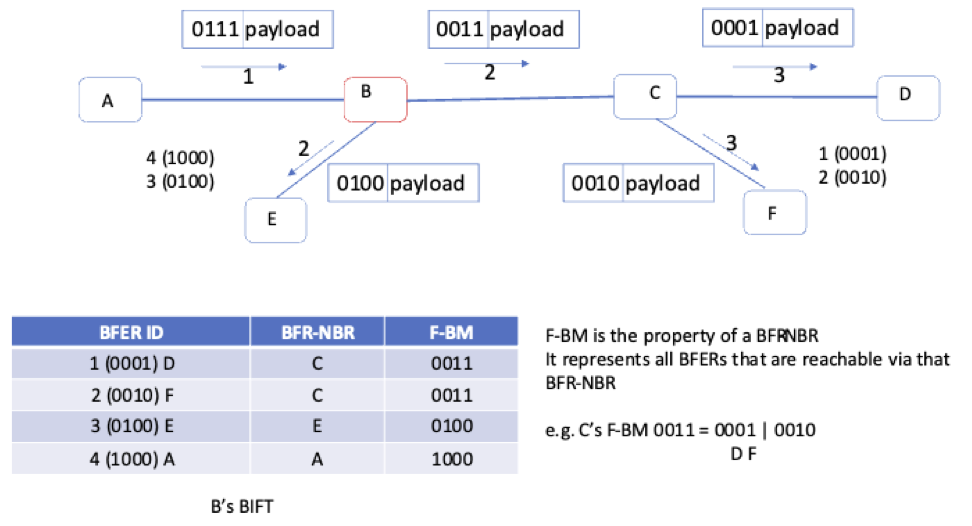

# BIER For SR Multicast -- Cheers!

**Jeffrey Zhang - 10/06/2023**

As a revolutionary multicast technology that allows efficient replication without requiring per-tree states in the network, Bit Index Explicit Replication (BIER) is the perfect solution for multicast in SR networks. This article explains BIER technology and its implementation/deployment prospects.

## Traditional Multicast: Replication Efficiency vs. State

Multicast delivers traffic to multiple recipients without sending multiple copies from the source. It started with IP multicast where the destination IP address identifies a group of recipients, and then multicast tunnels (e.g., MPLS P2MP tunnels) are introduced to tunnel traffic belonging to different IP multicast flows or even other tunnels.

Both IP multicast and multicast tunnels rely on trees for forwarding, and each tree node needs to maintain the state of the tree. The trees are set up via different signaling protocols, e.g., PIM for IP Multicast, RSVP-TE/mLDP-P2MP for MPLS P2MP tunnels.

If a network needs to support 10k IP multicast flows or tunnels, then the state for those 10k trees will need to be maintained on relevant tree nodes. If more trees are needed, more trees will have to be set up and more state to be maintained.

In some cases, to reduce the amount of tree state, Ingress Replication can be used -- the tree degrades to a root with leaves but no intermediate tree nodes (so only the root and leaves need to maintain the state). However, the root will need to tunnel individual copies to each leaf, often through some common nodes/links.

It becomes apparent that one has to trade-off between replication efficiency and the amount of state in the network.

## BIER: Best of Both Worlds

BIER was invented for the very purpose of addressing the above-mentioned problem. It removes the per-tree state from inside the network yet still allows efficient replication. This also means much better convergence with those per-tree states removed.

The way BIER works is that each packet carries a BitString, in which each bit that is set identifies a BIER Forwarding Egress Router (BFER) that needs to receive the packet. When a BIER router receives a BIER packet, it checks the BitString to figure out to which neighbor it needs to replicate the packet by consulting a Bit Indexed Forwarding Table (BIFT). A clever design ensures that no matter how many and which bits are set in the BitString, the number of lookups is bound by the number of replications that need to happen. For example, if 100 bits are set in the BitString for 100 BFERs that are reached through the same neighbor, then only one lookup is needed for them, no matter where the 100 bits are in the BitString.

The BIER forwarding does still need some state, i.e., the BIFTs, though they are only in proportion to the size of the network. No matter how many flows are going through the BIER domain, the BIFTs remain the same.

BIER architecture includes three layers:

- BIER signaling/forwarding
- Routing underlay
- Flow overlay

The BIFTs are built based on unicast paths to the BFERs in the routing underlay, using BIER signaling (via ISIS/OSPF/BGP extensions). When there is a topology change, the BIFTs can converge as fast as unicasts converge for the routes to the BFERs, and unicast-based Fast ReRoute (FRR) mechanisms can be used for BIER as well.  For comparison, traditional multicast needs to reconverge for each and every multicast tree. For that reason, BIER is a very good solution not only for scaled multicast but also for critical applications.

For an ingress BIER router (BFIR) to know what BitString to use for a multicast packet, BFERs need to signal to BFIRs in the flow overlay. Many signaling options can be used - the BGP-MVPN is the most common one and BIER in turn acts as provider tunnels for BGP-MVPN.

## Chicken and Egg Dilemma

As a multicast technology breakthrough, BIER was quickly standardized in IETF through a newly created Working Group (BIER WG), and Juniper has been an active contributor from the beginning.However, the actual deployment has lagged for this technology wonder. BIER uses a new encapsulation and forwarding algorithm, so it requires either programmable ASIC (e.g., Juniper's Trio chipset) or new fixed pipeline ASIC that has BIER functionality built-in. As a result, many existing routers are not able to support BIER.

Quite often, customers want to use BIER but have to back off because of the hardware limitation. On the other hand, once they back off the vendors don't see the clear demand for BIER so they hold off their investments. Even for platforms with programmable ASIC that can support BIER with just software upgrades, vendors don't prioritize the software feature because there is no end-to-end BIER solution until most routers (including core routers that often use fixed pipeline ASIC) can support BIER.

## Pioneers Break the Dilemma

A good technology like BIER is not going to just disappear without making a difference. Despite the slow adoption, pioneer vendors and operators are working together to break the dilemma.

Juniper has not only been actively contributing to BIER WG in IETF to advance the technology, but it also implemented BIER in its Express 5 ASIC for its PTX product line, and the FRS of Express 5-based PTX will have software for the three layers of the BIER architecture: ISIS signaling, MPLS-based BIER forwarding, and BGP-MVPN using BIER tunnel.

Broadcom's Jericho2 ASIC also supports BIER and it is used in Juniper's metro platform ACX. Adding the programmable Trio chipset for the MX platform, Juniper will be able to support BIER on its metro, edge, and core platforms, enabling end-to-end scalable multicast for mission-critical applications.

Other vendors also have their own BIER-capable hardware besides the merchant Jericho2 ASIC. Working together with pioneering vendors and operators, we are confident that BIER will become widely deployed, allowing operators to provide multicast at the internet scale, e.g., as described in this IETF draft [Multicast/BIER As A Service](https://datatracker.ietf.org/doc/html/draft-ietf-bier-multicast-as-a-service-02).

## Useful links

- [SR Multicast Options](https://www.linkedin.com/pulse/multicast-segment-routing-networks-overview-jeffrey-zhang?trackingId=g3CuANlBsM20DrIZIKo1oQ%3D%3D&lipi=urn%3Ali%3Apage%3Ad_flagship3_profile_view_base_recent_activity_content_view%3B29VqsVX7TL%2BFh0dNq1PKyg%3D%3D)
- [BIER Architecture](https://datatracker.ietf.org/doc/html/rfc8279)
- [BIER Encapsulation](https://datatracker.ietf.org/doc/html/rfc8296)
- [ISIS Signaling for BIER](https://datatracker.ietf.org/doc/html/rfc8401)
- [MVPN with BIER Provider Tunnel](https://datatracker.ietf.org/doc/html/rfc8556)

## Glossary

- BIER: Bit Indexed Explicit Replication
- BFIR: BIER Forwarding Ingress Router
- BFER: BIER Forwarding Egress Router
- BFR: BIER Forwarding Router
- BIFT: Bit Indexed Forwarding Table
