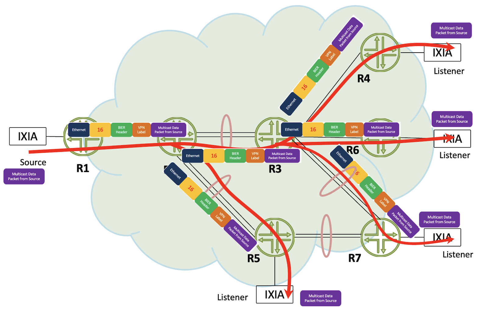
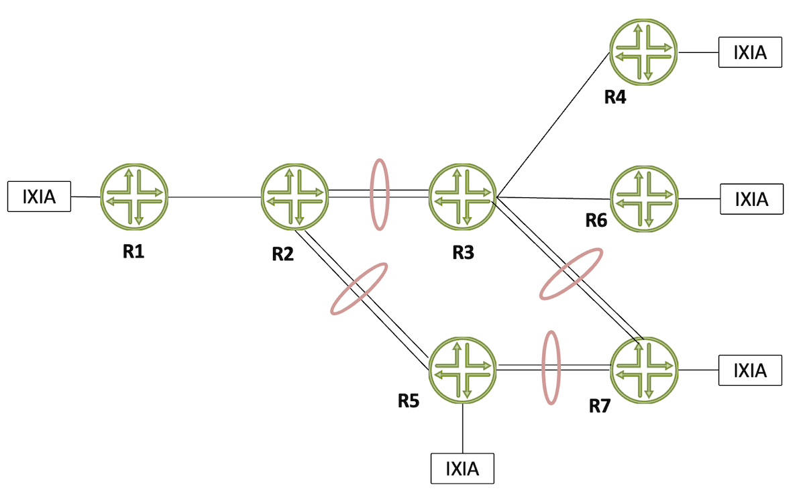
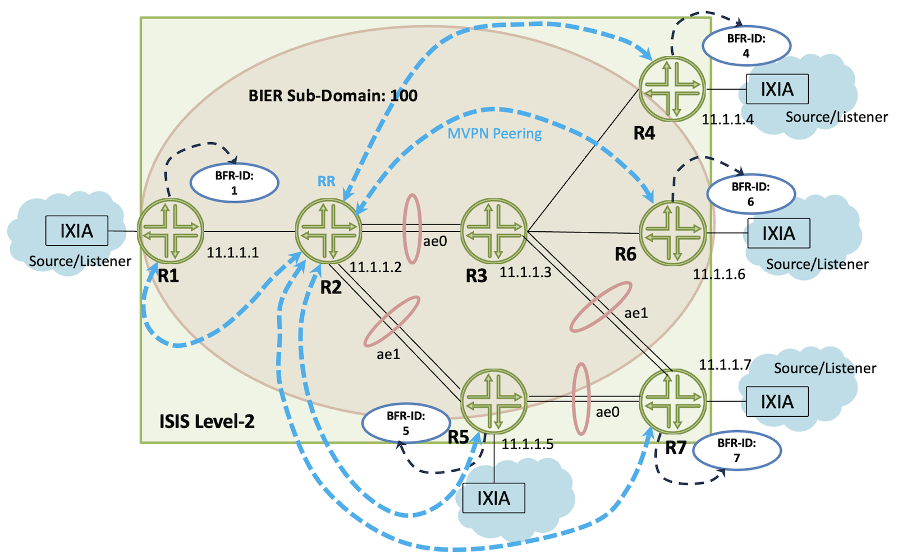
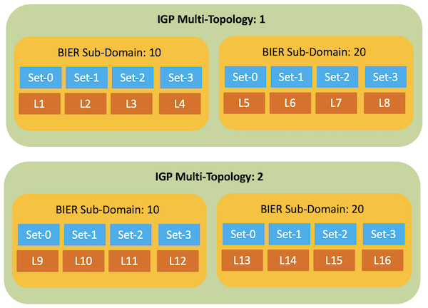
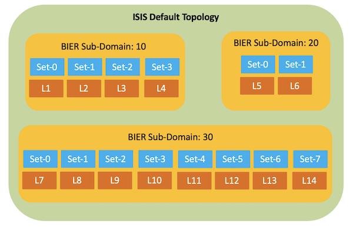
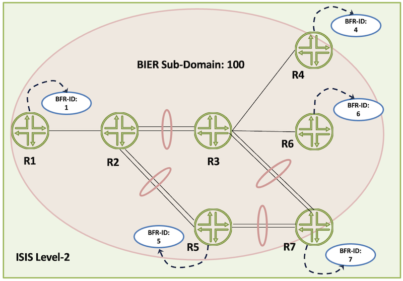
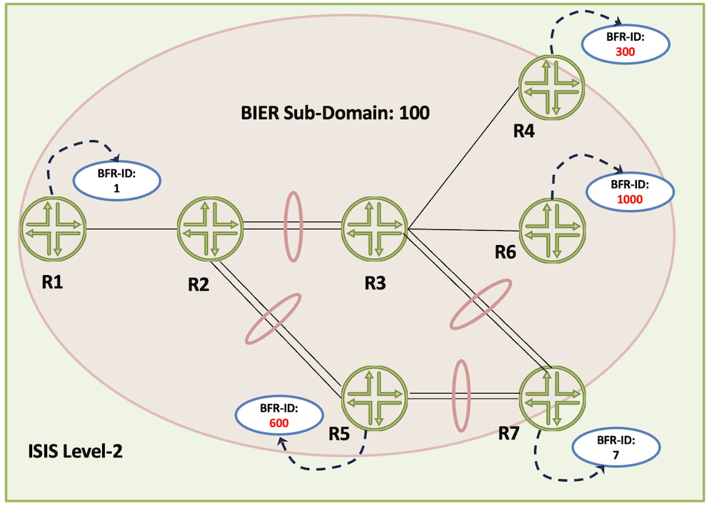
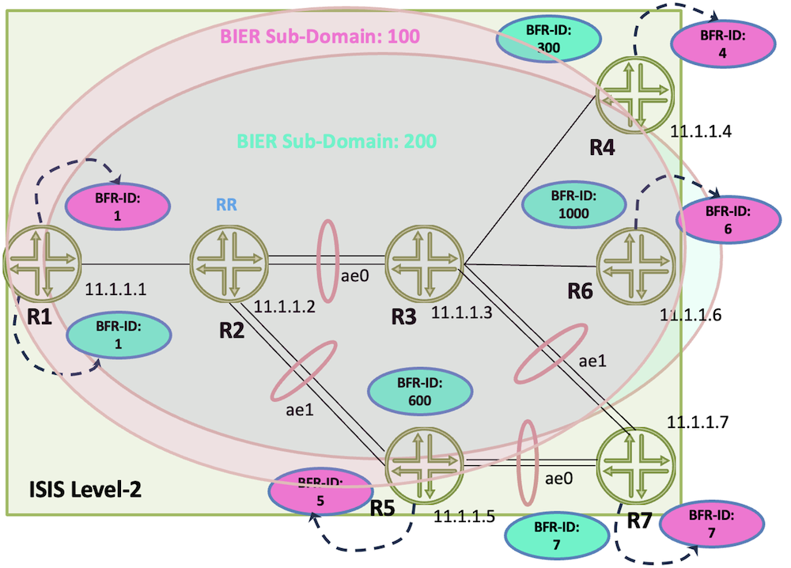

# BIER Introduction and Underlay

**Suneesh Babu - 07/24/2024**

First part of the 3-article series on BIER, discussing fundamental concepts and BIER underlay.

The series is composed of the following posts:

- Introduction to BIER and BIER Underlay (present article)
- BIER Table Lookup: [https://juniper.github.io/techposts/bier-table-lookup/article](https://juniper.github.io/techposts/bier-table-lookup/article)
- BIER Overlay: [https://juniper.github.io/techposts/bier-overlay/article](https://juniper.github.io/techposts/bier-overlay/article)

## Introduction

BIER (Bit Index Explicit Replication) provides a multicast-capable layer 2.5 architecture with no per-tree multicast states in the core. The economy of scale implied in such a reduced state is achieved by carrying the information encoding the destination routers within the packet header itself.  Detailed BIER architecture has been published in the [IETF Standard RFC-8279](https://datatracker.ietf.org/doc/rfc8279/). In generic multicast terms, BIER achieves a bi-directional, simultaneous selective, and inclusive PMSI (Provider Multicast Service Interface) functionality on a per packet basis while relying on state equivalent to longest prefix match in unicast, which, in itself was one of the key ingredients permitting IP to scale beyond other network technologies deployed.

BIER architecture is structured into three independent layers: a BIER underlay, a BIER layer, and ultimately, a BIER overlay. The underlay functionality may be provided by OSPF, ISIS, BGP, statically configured tables or even be programmed via a centralized infrastructure. The overlay utilizing BIER PMSI consists typically of MVPN, EVPN, or Global IP Multicast though BIER ultimately does not limit itself to any specific overlay technology or even to carrying just IP in architectural terms.

In a BIER multicast domain, each node with attached multicast listeners or sources is configured with a unique identification number, which represents a bit position in a bitstring included subsequently in the BIER header itself. A multicast packet enters a BIER domain at a Bit Forwarding Ingress Router (BFIR) and leaves the domain via one or more BIT Forwarding Egress Routers (BFER) while replication happens in the intermediate BFRs. A BIER domain may contain again one or more sub-domains. A sub-domain may be mapped to a particular multi-topology and the resulting flexibility helps to cover many use cases. For each of the sub-domains, the BFIR/BFER are identified by a unique BFR-ID within it while BFRs do not need BFR-IDs to participate in the BIER domain.

As a simple and convenient BIER underlay, ISIS can deliver the necessary infrastructure to build the BIER label and the forwarding bitmasks (FBM) in the BIER routers. BIER layer provides the encapsulation and various bitmask lengths (BML) support. The BIER overlay such as MVPN provides the necessary infrastructure to discover the BFER nodes and to create the bitstring and VPN label it will append to the multicast packet.

Juniper Networks PTX10002-36QDD is the first platform supporting BIER. It's a 36x 800Gbps router based on Express5 and running next-generation JUNOS operating system. In JUNOS , the BIER Underlay support is provided by ISIS and MVPN includes BIER PMSI configuration.

To start with a concrete example, let us consider the following customer domain where BIER is applied. Here R1 to R7 constitutes the core of the BIER domain. The multicast source is behind R1 at IXIA and listeners are at R4, R5, R6, R7 and are connected to IXIA.



ISIS acting as the BIER underlay advertises the BIER labels and builds the FBMs for each of the forwarding next-hop routers in the core. BIER layer provides the MPLS encapsulation, BSL, SI related functionalities and MVPN overlay uses the BIER PMSI to connect the BFIR and BFER's to send the multicast data.

CE1 (IXIA connected to R1) as the multicast source sends the multicast packet to PE1(R1). PE1 has remote receivers attached and it encapsulates the packet with BIER label, BIER header and VPN label and subsequently forwards the packets to the core. The BIER label helps to identify the BIFT table of the relevant sub-domains and BIER Header contains the bitstring info needed to identify the various Bit Forwarding Egress Routers (BFER) the packet has to be replicated to. Once the packet is received at the egress BFRs, it uses the VPN label learned via the MVPN overlay to redirect the packet to the respective VPN customer.

## BIER on PTX10002-36QDD

BIER on PTX10002-36QDD with 23.4R2-S1 release supports ISIS as the preferred IGP and "default topology" and multiple sub-domains. In the upcoming releases, we will be supporting BIER on ISIS multi-topologies too.

In our journey to understanding BIER, we will be using the following topology.



- R1, R4, R5, R6, R7 are BFIR or BFER routers.
- R2 and R3 are BFR. R5 can act as BFR as well as BFIR/BFER.
- The links between R2&R3, R2&R5, R3&R7 and R5&R7 are in link bundle.
- R1, R4, R5, R6, R7 are the provider edge routers and customer edge router are simulated on the IXIA connected to these routers.
- R2 will be acting as the route-reflector for the MVPN family.

### BIER Logical Topology



## BIER Underlay

JUNOS-EVO supports ISIS as the BIER underlay protocol with default topology.

To enable the BIER functionality, configure bier in forwarding options as shown and reboot the system or restart the PFE.

```
regress@r1-sb-bier-RE0> show configuration forwarding-options |display inheritance no-comments 
bier;
```

### ISIS with Single BIER Sub-Domain

BIER is configured on the BFIR and BFER as follows:

```
regress@r1-sb-bier-RE0> show configuration protocols bier |display inheritance no-comments 
sub-domain 100 {
    bfr-id 1;
    bfr-prefix 11.1.1.1;
    encapsulation mpls bitstringlen 256 number-sets 4;
}
```

BIER is configured on the BFR as follows, please note that there is no bfr-id present in the BFR:

```
regress@r2-sb-bier-RE0> show configuration protocols bier|display inheritance no-comments 
sub-domain 100 {
    bfr-prefix 11.1.1.2;
    encapsulation mpls bitstringlen 256 number-sets 4;
}
```

BIER sub-domain created is bound to the ISIS:

```
regress@r1-sb-bier-RE0> show configuration protocols isis |display inheritance no-comments
interface lo0.0 {
    passive;
}
interface et-0/0/9.0 {
    level 1 disable;
    point-to-point;
}
bier-sub-domain 100;
level 1 disable;
level 2 wide-metrics-only;
```

ISIS helps to inform the bier sub-domain created, the bfr-ids and bfr-prefixes within the domain:

```
regress@r1-sb-bier-RE0> show isis database r4-sb-bier-RE0.00-00 extensive level 2 

Warning: License key missing; requires 'ISIS' license

IS-IS level 2 link-state database:

r4-sb-bier-RE0.00-00 Sequence: 0x65, Checksum: 0xf327, Lifetime: 1087 secs
   IS neighbor: r3-sb-bier-RE0.00             Metric:       10
     Two-way fragment: r3-sb-bier-RE0.00-00, Two-way first fragment: r3-sb-bier-RE0.00-00
   IP prefix: 11.1.1.4/32                     Metric:        0 Internal Up
   IP prefix: 12.1.4.0/24                     Metric:       10 Internal Up

  Header: LSP ID: r4-sb-bier-RE0.00-00, Length: 156 bytes
    Allocated length: 284 bytes, Router ID: 11.1.1.4
    Remaining lifetime: 1087 secs, Level: 2, Interface: 1004
    Estimated free bytes: 128, Actual free bytes: 128
    Aging timer expires in: 1087 secs
    Protocols: IP, IPv6

  Packet: LSP ID: r4-sb-bier-RE0.00-00, Length: 156 bytes, Lifetime : 1194 secs
    Checksum: 0xf327, Sequence: 0x65, Attributes: 0x3 <L1 L2>
    NLPID: 0x83, Fixed length: 27 bytes, Version: 1, Sysid length: 0 bytes
    Packet type: 20, Packet version: 1, Max area: 0

  TLVs:
    Area address: 49.0002.0011 (5)
    LSP Buffer Size: 1492
    Speaks: IP
    Speaks: IPV6
    IP router id: 11.1.1.4
    IP address: 11.1.1.4
    Hostname: r4-sb-bier-RE0
    Extended IS Reachability TLV, Type: 22, Length: 37
    IS extended neighbor: r3-sb-bier-RE0.00, Metric: default 10 SubTLV len: 26
      IP address: 12.1.4.2
      Neighbor's IP address: 12.1.4.1
      Local interface index: 1004, Remote interface index: 1005
      Link MSD Advertisement Sub-TLV:Type: 15, Length: 2
        Base MPLS Imposition MSD:Type: 1, Value: 0
    IP extended prefix: 11.1.1.4/32 metric 0 up
      13 bytes of subtlvs               
      Bier-Sub-Domain: 100, Bfr-Id: 4, Bier-Algo: 0, Algo: 0
        Max-SI: 4, BS Len: 256, Label: 16
    IP extended prefix: 12.1.4.0/24 metric 10 up
    Router Capability:  Router ID 11.1.1.4, Flags: 0x00
      Node MSD Advertisement Sub-TLV:Type:  23, Length: 4
        Base MPLS Imposition MSD:Type:  1, Value: 0
        Entropy Readable Label Depth MSD:Type:  2, Value: 8
  No queued transmissions

regress@r1-sb-bier-RE0>
```

The ISIS route table for BIER:

```
regress@r1-sb-bier-RE0> show isis route bier  

Warning: License key missing; requires 'ISIS' license

</snip>
IPv4/IPv6 BIER Routes
----------------------
Prefix             L Version   Metric Type Interface       NH   Via                 Backup Score
100-11.1.1.4       2     473       30 int  et-0/0/9.0      MPLS r2-sb-bier-RE0(11.1.1.2)
100-11.1.1.5       2     473       20 int  et-0/0/9.0      MPLS r2-sb-bier-RE0(11.1.1.2)
100-11.1.1.6       2     473       30 int  et-0/0/9.0      MPLS r2-sb-bier-RE0(11.1.1.2)
100-11.1.1.7       2     473       30 int  et-0/0/9.0      MPLS r2-sb-bier-RE0(11.1.1.2)

regress@r1-sb-bier-RE0>
```

### ISIS with Multiple BIER Sub-Domains

Each of the BFR router is configured with one more sub-domain, with BFR-ID's as follows:

| Router | BSL | BFR-ID | Sub-Set | BFR-ID Sub-Set Range |
|:--|:--|:--|:--|:--|
| R1 | 256 | 1 | 0 | 1-256 |
| R2 | 256 | - | - | - |
| R3 | 256 | - | - | - |
| R4 | 256 | 300 | 1 | 257-512 |
| R5 | 256 | 600 | 2 | 513-768 |
| R6 | 256 | 1000 | 3 | 769-1024 |
| R7 | 256 | 7 | 0 | 1-256 |

BIER Config on BFIR/BFER router R1:

```
regress@r1-sb-bier-RE0> show configuration protocols bier |display inheritance no-comments 
sub-domain 100 {
    bfr-id 1;
    bfr-prefix 11.1.1.1;
    encapsulation mpls bitstringlen 256 number-sets 4;
}
sub-domain 200 {
    bfr-id 1;
    bfr-prefix 11.1.1.1;
    encapsulation mpls bitstringlen 256 number-sets 4;
}
```

The ISIS binding to BIER sub-domain:

```
regress@r1-sb-bier-RE0> show configuration protocols isis |display inheritance no-comments 
interface lo0.0 {
    passive;
}
interface et-0/0/9.0 {
    level 1 disable;
    point-to-point;
}
bier-sub-domain 100;
bier-sub-domain 200;
level 1 disable;
level 2 wide-metrics-only;
```

BIER Config on the BFR router R2:

```
regress@r2-sb-bier-RE0> show configuration protocols bier |display inheritance no-comments 
sub-domain 100 {
    bfr-prefix 11.1.1.2;
    encapsulation mpls bitstringlen 256 number-sets 4;
}
sub-domain 200 {
    bfr-prefix 11.1.1.2;
    encapsulation mpls bitstringlen 256 number-sets 4;
}
```

ISIS carries both the BIER sub-domain information:

```
regress@r1-sb-bier-RE0> show isis database r4-sb-bier-RE0.00-00 extensive    
<snip>
      Bier-Sub-Domain: 100, Bfr-Id: 4, Bier-Algo: 0, Algo: 0
        Max-SI: 4, BS Len: 256, Label: 16
      Bier-Sub-Domain: 200, Bfr-Id: 300, Bier-Algo: 0, Algo: 0
        Max-SI: 4, BS Len: 256, Label: 20
</snip>
```

## Label Allocation Schema in BIER

The label allocation schema is per IGP topology per sub-domain per sub-set. For example, if the DUT supports two IGP topologies each with two sub-domains with a sub-set of 4, the labels are allocated as follows:

| IGP Topology-ID | Label | Sub-Domain | BSL | SI |
|:--|:--|:--|:--|:--|
| 1 | L1 | 10 | 256 | 0 |
| 1 | L2 | 10 | 256 | 1 |
| 1 | L3 | 10 | 256 | 2 |
| 1 | L4 | 10 | 256 | 3 |
| 1 | L5 | 20 | 256 | 0 |
| 1 | L6 | 20 | 256 | 1 |
| 1 | L7 | 20 | 256 | 2 |
| 1 | L8 | 20 | 256 | 3 |
| 2 | L9 | 10 | 256 | 0 |
| 2 | L10 | 10 | 256 | 1 |
| 2 | L11 | 10 | 256 | 2 |
| 2 | L12 | 10 | 256 | 3 |
| 2 | L13 | 20 | 256 | 0 |
| 2 | L14 | 20 | 256 | 1 |
| 2 | L15 | 20 | 256 | 2 |
| 2 | L16 | 20 | 256 | 3 |



### Label Allocation Schema in JUNOS-EVO

PTX10002-36QDD with 23.4R2 supports BIER on a default ISIS topology with 18 BIER sub-domains(with default ISIS packet size) and sets varying from 2 to 16.



### Label Allocation with a Single BIER Sub-Domain

In the below configuration, we have 4 sets defined, each set having 256 as the bit string length, ie the node supports 256*4 or 1024 unique BFIR/BFER nodes in the BIER sub-domain 100.

```
regress@r1-sb-bier-RE0> show configuration protocols bier |display inheritance no-comments 
sub-domain 100 {
    bfr-id 1;
    bfr-prefix 11.1.1.1;
    encapsulation mpls bitstringlen 256 number-sets 4;
}
```

Each of the set is assigned with a label as shown below, as we have only BFR-IDs from the first set, rest of the table bier routes are marked as "Discard"

```
regress@r1-sb-bier-RE0> show route table mpls.0 protocol bier 

mpls.0: 18 destinations, 18 routes (18 active, 0 holddown, 0 hidden)
+ = Active Route, - = Last Active, * = Both

16                 *[BIER/70] 20:40:59
                       Multicast (IPv4) Composite
17                 *[BIER/70] 21:06:20
                       Discard
18                 *[BIER/70] 21:06:20
                       Discard
19                 *[BIER/70] 21:06:20
                       Discard

regress@r1-sb-bier-RE0>

regress@r1-sb-bier-RE0> show route table mpls.0 protocol bier label 16 extensive 

mpls.0: 18 destinations, 18 routes (18 active, 0 holddown, 0 hidden)
16  (1 entry, 1 announced)
TSI:
KRT in-kernel 16     /52 -> {[6007]}
Opaque data client: BIER
Opaque data: TLV type:32820 APP flag:0x80
Address: 0x5588581441e0
Opaque-data reference count: 8
Stats ID Group: Kernel ID = 4097, Stats IDs = { 4026531842 }
        *BIER   Preference: 70
                Next hop type: Multicast (IPv4) Composite, Next hop index: 6007
                Address: 0x55884ec17a44
                Next-hop reference count: 2, key opaque handle: 0x558859f62580
                Nexthop key opaque app data dump: TLV Type:32776, :bier-100-0.bier.0, Num of entries:256, 1-3, 4-8054, 5-8054, 6-8054, 7-8054
                Kernel Table Id: 0
                State: <Active OpaqueData>
                Local AS: 64512 
                Age: 20:44:49 
                Validation State: unverified 
                Task: bier global task
                Announcement bits (1): 1-KRT 
                AS path: I 
                Statistics - Packets: 348809, pps: 0, Bytes: 187659242
                Stats ID Group: Kernel ID = 4097, Stats IDs = { 4026531842 }
                Thread: junos-main 

regress@r1-sb-bier-RE0>
```

Once the number of sets is increased from 4 to 8, eight MPLS labels got created as shown below, one each for the sets

```
regress@r1-sb-bier-RE0> show configuration protocols bier |display inheritance no-comments 
sub-domain 100 {
    bfr-id 1;
    bfr-prefix 11.1.1.1;
    encapsulation mpls bitstringlen 256 number-sets 8;
}

regress@r1-sb-bier-RE0> show route table mpls.0 protocol bier                                 

mpls.0: 18 destinations, 22 routes (18 active, 0 holddown, 0 hidden)
+ = Active Route, - = Last Active, * = Both

16                 *[BIER/70] 00:01:09
                       Multicast (IPv4) Composite
17                 *[BIER/70] 00:01:09
                       Discard
18                 *[BIER/70] 00:01:09
                       Discard
19                 *[BIER/70] 00:01:09
                       Discard
20                  [BIER/70] 00:01:09
                       Discard
21                  [BIER/70] 00:01:09
                       Discard
22                  [BIER/70] 00:01:09
                       Discard
23                  [BIER/70] 00:01:09
                       Discard

regress@r1-sb-bier-RE0>
```

JUNOS supports 16 sets for each BIER sub-domain

```
[edit groups JNPR-BIER-Underlay protocols bier sub-domain 100]
regress@r1-sb-bier-RE0# set encapsulation mpls bitstringlen 256 number-sets ?
Possible completions:
  <number-sets>        Number of bier sets (set range size) (2..16)
[edit groups JNPR-BIER-Underlay protocols bier sub-domain 100]
regress@r1-sb-bier-RE0# set encapsulation mpls bitstringlen 256 number-sets    
```

Once the BFR-ID is configured in such a manner that one ID is present from each set, the BIER route status changes from "Discard" to "Composite"

In the following topology BFR-IDs 1, 4, 5, 6 & 7 are taken from the first set 1-256



The MPLS Label Table is as follows:

```
regress@r7-sb-bier-RE0> show route table mpls.0 protocol bier 

mpls.0: 19 destinations, 19 routes (19 active, 0 holddown, 0 hidden)
+ = Active Route, - = Last Active, * = Both

16                 *[BIER/70] 1d 14:18:57
                       Multicast (IPv4) Composite
17                 *[BIER/70] 2d 20:26:51
                       Discard
18                 *[BIER/70] 2d 20:26:51
                       Discard
19                 *[BIER/70] 2d 20:26:51
                       Discard

regress@r7-sb-bier-RE0>
```

But when the BIER-ID is selected from all four sets, ie 1 from the first set (1-256), 300 from the second set (257-512), 600 from the third set (513-768) and 1000 from the fourth set (769-1024), the label allocation values changes as follows:



The "Discard" state changes to "Multicast (IPv4) Composite"

```
regress@r1-sb-bier-RE0> show route table mpls.0 protocol bier    

mpls.0: 18 destinations, 18 routes (18 active, 0 holddown, 0 hidden)
+ = Active Route, - = Last Active, * = Both

16                 *[BIER/70] 00:00:06
                       Multicast (IPv4) Composite
17                 *[BIER/70] 00:00:06
                       Multicast (IPv4) Composite
18                 *[BIER/70] 00:01:24
                       Multicast (IPv4) Composite
19                 *[BIER/70] 00:00:58
                       Multicast (IPv4) Composite

regress@r1-sb-bier-RE0>
```

### Label Allocation with Multiple BIER Sub-Domains

The underlay ISIS can support multiple bier sub-domains in the default topology. In the below diagram, we have two sub-domains.



As we have two BIER domains, for each domain, labels are created for the number of sets configured. Labels 16, 17, 18 and 19 are for the BIER sub-domain:100 and Labels 20, 21, 22, and 23 are for BIER sub-domain:200.

```
regress@r1-sb-bier-RE0> show route table mpls.0 protocol bier 

mpls.0: 22 destinations, 22 routes (22 active, 0 holddown, 0 hidden)
+ = Active Route, - = Last Active, * = Both

16                 *[BIER/70] 02:26:13
                       Multicast (IPv4) Composite
17                 *[BIER/70] 02:30:27
                       Discard
18                 *[BIER/70] 02:30:27
                       Discard
19                 *[BIER/70] 02:30:27
                       Discard
20                 *[BIER/70] 02:26:29
                       Multicast (IPv4) Composite
21                 *[BIER/70] 02:26:29
                       Multicast (IPv4) Composite
22                 *[BIER/70] 01:53:04
                       Multicast (IPv4) Composite
23                 *[BIER/70] 02:26:29
                       Multicast (IPv4) Composite

regress@r1-sb-bier-RE0>
```

## Conclusion

This first article covers the basics of BIER Multicast Replication, the label allocation and the underlay. Follow up posts will cover table lookup and overlay. Stay tuned.

## Useful links

RFC/Drafts

- [https://datatracker.ietf.org/doc/rfc8279/](https://datatracker.ietf.org/doc/rfc8279/)
- [https://datatracker.ietf.org/doc/rfc8296/](https://datatracker.ietf.org/doc/rfc8296/)
- [https://datatracker.ietf.org/doc/rfc8401/](https://datatracker.ietf.org/doc/rfc8401/)
- [https://datatracker.ietf.org/doc/rfc8556/](https://datatracker.ietf.org/doc/rfc8556/)
- [https://datatracker.ietf.org/doc/draft-ietf-bess-mvpn-evpn-aggregation-label/14/](https://datatracker.ietf.org/doc/draft-ietf-bess-mvpn-evpn-aggregation-label/14/)
- [https://www.rfc-editor.org/rfc/rfc7902.html](https://www.rfc-editor.org/rfc/rfc7902.html)

PTX10002-36QDD:

- [https://juniper.github.io/techposts/introducing-ptx10002-36qdd/article](https://juniper.github.io/techposts/introducing-ptx10002-36qdd/article)
- [https://juniper.github.io/techposts/express-5-overview/article](https://juniper.github.io/techposts/express-5-overview/article)
- [https://www.juniper.net/us/en/products/routers/ptx-series/ptx10002-36qdd-packet-transport-router.html](https://www.juniper.net/us/en/products/routers/ptx-series/ptx10002-36qdd-packet-transport-router.html)

BIER TechPost Articles

- [https://juniper.github.io/techposts/bier-table-lookup/article](https://juniper.github.io/techposts/bier-table-lookup/article)
- [https://juniper.github.io/techposts/bier-overlay/article](https://juniper.github.io/techposts/bier-overlay/article)
- [https://juniper.github.io/techposts/bier-mvpn-in-ptx-express-5/article](https://juniper.github.io/techposts/bier-mvpn-in-ptx-express-5/article)
- [https://juniper.github.io/techposts/eantc-bier-interop-testing-on-ptx10002-36qdd/article](https://juniper.github.io/techposts/eantc-bier-interop-testing-on-ptx10002-36qdd/article)

EANTC 2024 InterOP Report

- [https://eantc.de/wp-content/uploads/2023/12/EANTC-MPLSSDNInterop2024-TestReport-v1.3.pdf](https://eantc.de/wp-content/uploads/2023/12/EANTC-MPLSSDNInterop2024-TestReport-v1.3.pdf)

## Glossary

- BIER: Bit Index Explicit Replication
- BFR: Bit Forwarding Router
- BFR-NBR: BFR Neighbor
- BFR-Prefix: BFR Prefix IP address
- BFER: Bit Forwarding Egress Router
- BFIR Bit Forwarding Ingress Router
- BIRT:  Bit Index Routing Table
- BIFT: Bit Index Forwarding Table
- BML: Bit Mask Length
- BSL: Bit String Length
- BFR-Id: BFR Identifier
- BGP: Border Gateway Protocol
- DCB: Domain-wide Common Block
- DLU: Destination Lookup
- EANTC: European Advanced Networking Test Center
- EPP: Egress Packet Processor
- FBM: Forwarding Bit Mask
- IGMP: Internet Group Management Protocol
- IGP: Interior Gateway Protocol
- IGP: Ingress Parser
- ISIS: Intermediate System Intermediate System
- LDP: Label Distribution Protocol
- LSA: Link State Advertisement
- MCE: Multicast Engine
- m-LDP: Multicast LDP
- MPLS: Multi Protocol Label Switching
- MVPN: Multicast VPN
- MWC: MPLS World Congress
- OSPF: Open Shortest Path First
- PIM: Protocol Independent Multicast
- PMSI: Provider Multicast Service Interface
- RFC: Request For Comments
- RSVP-TE: Resource Reservation Protocol -- Traffic Engineering
- VRF: Virtual Routing and Forwarding
- VPN: Virtual Private Network

## Acknowledgments

Thanks To: Jeffrey Zhang, Vinod Kumar Nagaraj, Venkatesan  Parthasarathi, Poorna Pushkala Balasubramanian, Sambasiva Rao p,Antoni Przygienda, Nicolas Fevrier, Vasily Mukhin, Sanoj Vivekanandan, Dmitry Shokarev, Krzysztof Szarkowicz
