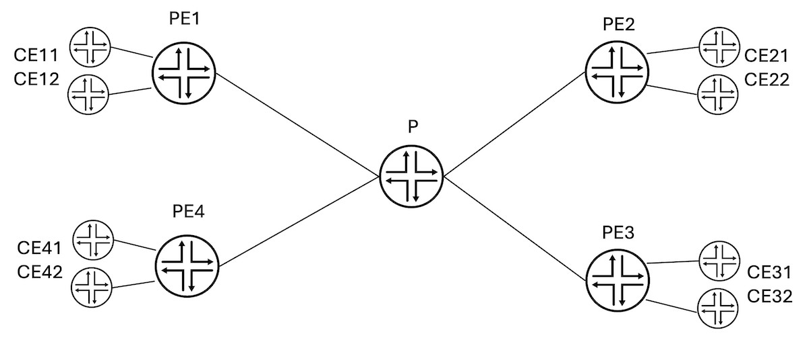

# BIER + MVPN in PTX Express 5

**Jeffrey Zhang - 04/26/2024**

High-level functionality description of BIER as MVPN provider tunnels in the upcoming release of PTX Express 5.

## Introduction

[In Cheers! Have a BIER](https://juniper.github.io/techposts/bier-for-sr-multicast-cheers/article), we explained how BIER [RFC8279] works and how it has come to a prime time for BIER deployment with the hardware capabilities from several major vendors across the edge/access/core platforms. This article will discuss the BIER implementation in Juniper's upcoming PTX Express 5 FRS (First Release Shipping).

### Supported Functionalities

In this FRS release, the following functionalities are supported:

- BIER as the provider/underlay tunnels for BGP-MVPN and BGP-MVPN as the Flow Overlay for BIER [RFC8556]. Domain-wide Common Block (DCB) labels are used to identify VPNs [draft-ietf-bess-mvpn-evpn-aggregation-label].
- ISIS signaling [RFC8401] at both levels and in multi-instance.
- Multiple BIER sub-domains, MPLS Encapsulation with BitStringLen 256 and a maximum of four sets.
- Aggregated Ethernet interfaces

## Deployment Scenario Example

A complex scenario is intentionally given here to illustrate the multi-instance and multi-subdomain functionality for advanced deployment scenarios. In a typical deployment scenario, a single sub-domain in the default instance may be enough.

### Topology

Consider a provider network with default, red, and blue topologies instantiated with ISIS multi-instances. For simplicity in the illustration, each PE/P link has three VLANs -- one for each instance.



There are two VPNs, v1 and v2, connecting CEx1 and CEx2 respectively.

All PE/P routers are configured with three BIER sub-domains, each associated with an ISIS instance (in a future release, multi-topology could also be used and each sub-domain could be associated with a topology instead of an ISIS instance).

### Configuration

BIER configuration on PE1:

```
protocols {
    bier {                                                                                          
        sub-domain 10 {                                                                             
            bfr-id 1;                                                                               
            bfr-prefix 1.1.1.1;                                                                     
            encapsulation mpls bitstringlen 256 number-sets 4;                                      
        }                                                                                           
        sub-domain 20 {                                                                             
            bfr-id 1;                                                                               
            bfr-prefix 1.1.1.11;                                                                    
            encapsulation mpls bitstringlen 256 number-sets 4;                                      
        }                                                                                           
        sub-domain 30 {                                                                             
            bfr-id 1;                                                                               
            bfr-prefix 1.1.1.21;                                                                    
            encapsulation mpls bitstringlen 256 number-sets 4;                                      
        }                                                                                           
    }                                 
}
```

The PE routers are BFIRs/BFERs, and the P routers are transit BFRs. The BIER configurations on other PE/P routers are all similar, except that:

- On the P/BFR routers, the bfr-id is typically 0  and there is no need to be configured.
- Each PE/BFIR/BFER has a different bfr-id in the same sub-domain.

Note that:

- The same router can have the same or different bfr-id in different sub-domains. In this example, the same bfr-id is used in different sub-domains.
- The same router can have the same or different bfr-prefix in different sub-domains. In this example, different bfr-prefixes are used and they're exported into different ISIS instances (via the export_lo0addr1, export_lo0addr2, export_lo0addr3 policies below).

ISIS configuration on PE1:

```
protocols {
    isis {                                                                                          
        interface et-0/0/9.101;

        bier-sub-domain 10;                                                                         
                                                                                                    
        export export_lo0addr1;                                                                     
    }                                                                                               
    isis-instance blue {                                                                            
        interface et-0/0/9.102;                                                                     
                                                                                                  
        bier-sub-domain 20;
                                                                         
        export export_lo0addr2;                                                                     
    }                                                                                               
    isis-instance red {                                                                             
        interface et-0/0/9.103;                                                                     
                                                                                                    
        bier-sub-domain 30;
                                                                         
        export export_lo0addr3;                                                                     
    }    
}
```

Notice that sub-domain 10, 20, and 30 are put into different ISIS instances (for different topologies). The same instance can also have multiple sub-domains though not used here.

Relevant VRF configuration on PE1:

```
routing-instances {
v1 {
   ...
        vrf-table-label static 990001;                                                              
        provider-tunnel {                                                                           
            bier {                                                                                  
                subdomain-id 10;
            }
            selective {                                                                             
                group 232.1.1.0/24 {                                                                
                    source 0/0 {                                                                    
                        bier {                                                                      
                            subdomain-id 20;                                                        
                        }                                                                           
                    }                                                                               
                }                                                                                   
            } 
        }
     }
v2 {
   ...
        vrf-table-label static 990002;                                                              
        provider-tunnel {                                                                           
            bier {                                                                                  
                subdomain-id 10;
            }
            selective {                                                                             
                group 232.1.2.0/24 {                                                                
                    source 0/0 {                                                                    
                        bier {                                                                      
                            subdomain-id 30;                                                        
                        }                                                                           
                    }                                                                               
                }                                                                                   
            }
        }
     }     
  }
}
```

On all PEs, VRF v1 has the same static VRF table label 990001 configured, and VRF v2 has the same static VRF table label 990002 configured. This is also the VPN-identifying DCB label after the BIER header [draft-ietf-bess-mvpn-evpn-aggregation-label] - an ingress PE uses the common static label (after the BIE header) to send traffic and an egress PE can direct the traffic to the matching VRF based on the label.

Both v1 and v2 use the sub-domain 10 in the default ISIS instance for the inclusive tunnel, while v1 uses the sub-domain 20 for the selective tunnel for (232.1.1.0/24, 0/0) flows, and v2 uses the sub-domain 30 for the selective tunnel for (232.1.2.0/24, 0/0) flows.

### Operational States

Each BIFT has a name in the [topology]:bier-{subdomain-id}-{set-id}.0 format. For example, PE1 has the following BIFTs for sub-domain 10:

```
root@PE1-RE0> show route table :bier-10-0.bier.0    

:bier-10-0.bier.0: 4 destinations, 4 routes (4 active, 0 holddown, 0 hidden)
+ = Active Route, - = Last Active, * = Both

1/16                
                   *[BIER/70] 4d 02:30:32
                       to table mpls.0
2/16                
                   *[BIER/70] 00:05:30
                    >  to 123.1.5.5 via et-0/0/9.101, Push 16
3/16                
                   *[BIER/70] 00:05:30
                    >  to 123.1.5.5 via et-0/0/9.101, Push 16
4/16                
                   *[BIER/70] 00:05:30
                    >  to 123.1.5.5 via et-0/0/9.101, Push 16

root@PE1-RE0> show route table :bier-10-1.bier.0     

root@PE1-RE0> show route table :bier-10-2.bier.0    

root@PE1-RE0> show route table :bier-10-3.bier.0    


```

In this topology, there are only four BFIRs/BFERs and the maximum bfr-id is 4, so :bier-**10**-**1**.bier.0, :bier-**10**-**2**.bier.0, and :bier-**10**-**3**.bier.0 (for sets 1, 2, and 3 respectively) are all empty as shown.

The first entry in :bier-**10**-**0**.bier.0 is for bfr-id 1. Since it is for the router itself, the NH is "decapsulate BIER header and send to mpls.0 for inner label lookup":

```
1/16                
                   *[BIER/70] 4d 02:30:32
                       to table mpls.0
```

The second entry is for bfr-id 2. Its content is shown in the following extended format:

```
2/16 (1 entry, 0 announced)
        *BIER   Preference: 70
                ...
                Nexthop key opaque app data dump: TLV type:32794 APP data:Bier nbr 0x5555c95b4f18, label:16, Addr:5.5.5.5
                Nexthop nonkey opaque app data dump: TLV type:32829, Flag:0x4, FBM:0:0:0:0:0:0:0:0000000e, Next-hop session id: 6
                Kernel Table Id: 0
                Next hop: 123.1.5.5 via et-0/0/9.101, selected
                Label operation: Push 16
                ...
```

The red text shows that to reach the BFER with bfr-id 2:

- The nexthop neighbor is 5.5.5.5 (BFR-prefix) reached via interface et-0/0/9.101.
- The BIER label is 16 - advertised by the neighbor for this BIFT (for <subdomain 10, BSL 256, set 0>).
- The F-BM for the neighbor is 0:0:0:0:0:0:0:0000000e -- the bits for bfr-id 2, 3, 4 respectively are set in the F-BM, indicating that a copy sent to this neighbor can cover those three BFERs (with bfr-id 2, 3, 4 respectively).

For the multicast flows:

```
root@PE1-RE0> show multicast route extensive instance v1  
Instance: vrf1 Family: INET

Group: 232.2.1.1
    Source: 31.11.21.21/32
    Upstream interface: et-0/0/10.1
    Downstream interface list: 
        Push 990001, BS:0:0:0:0:0:0:0:0000000e, label 16
...

Group: 232.1.1.1
    Source: 31.11.21.21/32
    Upstream interface: et-0/0/10.1
    Downstream interface list: 
        Push 990001, BS:0:0:0:0:0:0:0:0000000c, label 20
...
```

The (232.2.1.1, 31.11.21.21) flow uses the inclusive BIER tunnel in sub-domain 10. The above red output shows that the static VPN-identifying label 990001 is pushed first, followed by an outer BIER header with BitString 0:0:0:0:0:0:0:0000000e, then followed by an outer BIER label 16. The BitString has three bits set for bfr-id 2,3,4 or PE2/PE3/PE4 respectively (this inclusive tunnel reaches all three egress PEs). The BIER label 16 is advertised by ***this*** router for <sub-domain 10, BSL 256, set 0> -- the packet with the newly imposed BIER encapsulation is recirculated to BIER forwarding as if it was received from another BIER router. The recirculated BIER packet undergoes BIER replication based on the bits that are set in the BitString.

The (232.1.1.1, 31.11.21.21) flow uses the selective BIER tunnel in sub-domain 20. The above green output shows that the static VPN-identifying label 990001 is pushed first, followed by an outer BIER header with BitString 0:0:0:0:0:0:0:0000000c, then followed by an outer BIER label 20. The BitString has two bits set for bfr-id 3,4 or PE3/PE4 respectively (this selective tunnel reaches PE3/PE4 only). The BIER label 20 is advertised by ***this*** router for <sub-domain 20, BSL 256, set 0> -- the packet with the newly imposed BIER encapsulation is recirculated to BIER forwarding as if it was received from another BIER router.

The following mpls.0 entries for the BIER label 16 and 20 are shown in extensive format:

```
root@PE1-RE0> show route table mpls.0 extensive
...
16  (1 entry, 1 announced)
        ...
        *BIER   Preference: 70
                ...
                Nexthop key opaque app data dump: TLV Type:32776, :bier-10-0.bier.0

...
20  (1 entry, 1 announced)
        ...
        *BIER   Preference: 70
                ...
                Nexthop key opaque app data dump: TLV Type:32776,:bier-20-0.bier.0,
```

Incoming packets with label 16 will be treated as BIER packets and forwarded according to :bier-10-0.bier.0. Similarly, incoming packets with label 20 will be treated as BIER packets and forwarded according to :bier-20-0.bier.0.

Useful links

- RFC8279: [https://datatracker.ietf.org/doc/html/rfc8279](https://datatracker.ietf.org/doc/html/rfc8279)
- RFC8556: [https://datatracker.ietf.org/doc/html/rfc8556](https://datatracker.ietf.org/doc/html/rfc8556)
- RFC8401: [https://datatracker.ietf.org/doc/html/rfc8401](https://datatracker.ietf.org/doc/html/rfc8401)
- draft-ietf-bess-mvpn-evpn-aggregation-label: [https://datatracker.ietf.org/doc/draft-ietf-bess-mvpn-evpn-aggregation-label/](https://datatracker.ietf.org/doc/draft-ietf-bess-mvpn-evpn-aggregation-label/)

## Glossary

- BIER: Bit Index Explicit Replication
- BFR: BIER Forwarding Router
- BFIR: BIER Forwarding Ingress Router
- BFER: BIER Forwarding Egress Router

## Acknowledgments

Poorna Balasubramanian and Sanoj Vivekanandan helped build and review the content.
