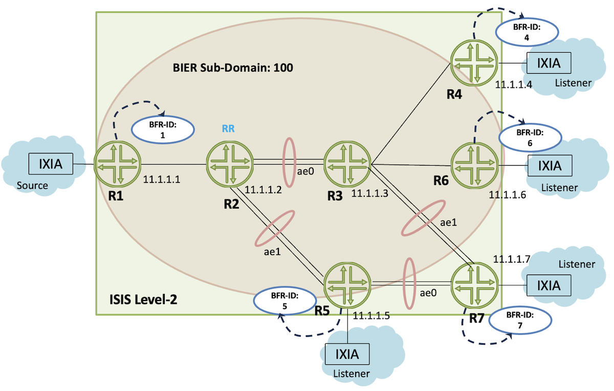
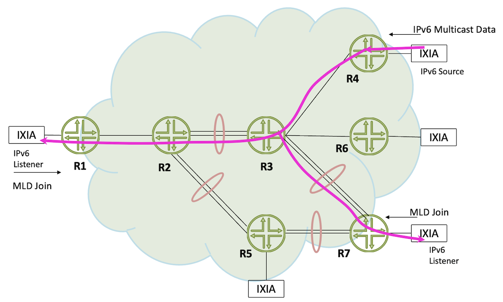
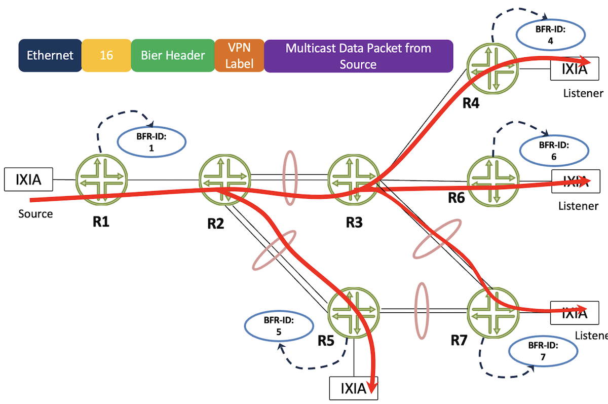
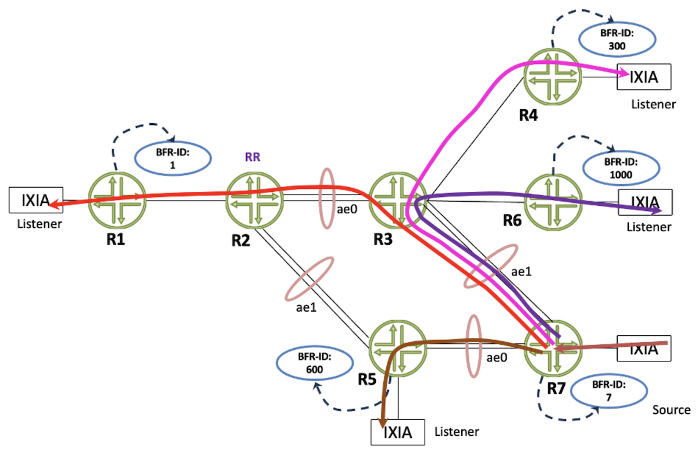
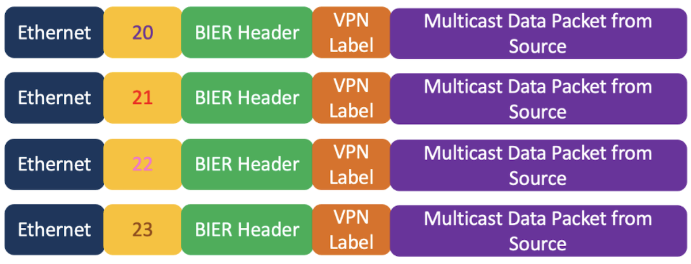

# BIER Overlay

**Suneesh Babu - 08/08/2024**

The series is composed of the following posts:

- [Introduction to BIER and BIER Underlay](https://juniper.github.io/techposts/bier-introduction-and-underlay/article)
- [BIER Table Lookup](https://juniper.github.io/techposts/bier-table-lookup/article)
- BIER Overlay (present article)

In this TechPost, we talk in deeper detail about overlay details.

## BIER overlay

The Overlay helps determine interested multicast sources and listeners in the BIER domain. The Overlay can be MVPN, EVPN, or Global IP Multicast. BIER on PTX10002-36QDD supports MVPN as the Overlay in Junos 23.4R2 release.

MVPN can use P2MP tunnels created by RSVP-TE, mLDP, or PIM to transport customer multicast traffic across the provider's backbone network. P2MP tunnels in "aggregate tunnel mode" allocate an "upstream-assigned MPLS label" for each VPN and each packet sent on this P2MP tunnel carries the upstream-assigned MPLS label that the ingress PE has bound to the packet's VPN.

The upstream-assigned label procedures can result in scaling problems, as each PE allocates a label from its own label space. A detailed analysis is captured in the [mvpn-evpn-aggregation-label draft](https://www.ietf.org/archive/id/draft-ietf-bess-mvpn-evpn-aggregation-label-14.html). BIER implementation on PTX10002-36QDD follows the optimized approach mentioned in the above draft to solve all scaling issues. Here, the labels are allocated in the provider network by a central entity. All PEs use the same label to represent a VPN.

The BIER sub-domain got mapped to MVPN VPN instance as shown in the output below:

```
regress@r1-sb-bier-RE0> show configuration routing-instances m_customer_A |display inheritance no-comments |no-more 
instance-type vrf;
protocols {
    bgp {
        group ce-pe-v4-customer-1 {
            type external;
            family inet {
                unicast;
            }
            export Export-Local-Routes;
            peer-as 64001;
            local-as 64512;
            as-override;
            neighbor 13.1.1.2;
        }
    }
    mvpn {
        mvpn-mode {
            spt-only;
        }
    }
    pim {
        rp {
            static {
                address 100.1.1.1;
                address 2100:100:1:1::1;
            }
        }
        interface et-0/0/18.10;
        interface lo0.1;
    }
}
interface et-0/0/18.10;
interface lo0.1;
route-distinguisher 11.1.1.1:1;
vrf-target target:64512:1;
vrf-table-label static 990001;
provider-tunnel {
    bier {
        subdomain-id 100;
        label 990001;
    }
}

regress@r1-sb-bier-RE0>
```

### BGP MVPN Peering on PEs

The BFIR/BFER routers are enabled with BGP MVPN family, and BFR R2 acts as the Route Reflector. The BGP Peering details:

```
regress@r2-sb-bier-RE0> show bgp summary    

Warning: License key missing; requires 'BGP' license

Threading mode: BGP I/O
Default eBGP mode: advertise - accept, receive - accept
Groups: 1 Peers: 5 Down peers: 0
Table          Tot Paths  Act Paths Suppressed    History Damp State    Pending
bgp.mvpn.0           
                       9          6          0          0          0          0
bgp.l3vpn.0          
                      10         10          0          0          0          0
Peer                     AS      InPkt     OutPkt    OutQ   Flaps Last Up/Dwn State|#Active/Received/Accepted/Damped...
11.1.1.1              64512       2797       2781       0       0    20:58:57 Establ
  bgp.mvpn.0: 1/1/1/0
  bgp.l3vpn.0: 2/2/2/0
11.1.1.4              64512       2797       2777       0       1    20:58:41 Establ
  bgp.mvpn.0: 2/2/2/0
  bgp.l3vpn.0: 2/2/2/0
11.1.1.5              64512       2808       2780       0       1    20:58:25 Establ
  bgp.mvpn.0: 1/2/2/0
  bgp.l3vpn.0: 2/2/2/0
11.1.1.6              64512       2807       2777       0       1    20:58:06 Establ
  bgp.mvpn.0: 1/2/2/0
  bgp.l3vpn.0: 2/2/2/0
11.1.1.7              64512       2806       2775       0       1    20:57:46 Establ
  bgp.mvpn.0: 1/2/2/0
  bgp.l3vpn.0: 2/2/2/0

regress@r2-sb-bier-RE0>
```

### Multicast Source and Receivers Joining the PE's CE

The multicast source is emulated on the IXIA behind R1 and listeners are emulated behind R4, R5, R6 and R7.



Source 13.1.1.2 is residing at CE1 of R1 and Listeners are at R4, R5, R6, and R7. The listeners send igmp join for (13.1.1.2, 232.1.1.1).

### Remote Receiver at R4

At BFER R4, igmp is enabled. Let's check the group membership.

```
regress@r4-sb-bier-RE0> show igmp group 

Warning: License key missing; requires 'L3 Multicast/IGMP' license

Interface: et-0/0/18.10, Groups: 1
    Group: 232.1.1.1
        Group mode: Include
        Source: 13.1.1.2
        Last reported by: 13.1.2.2
        Timeout:     240 Type: Dynamic
Interface: local, Groups: 4
    Group: 224.0.0.0
        Source: 0.0.0.0
        Last reported by: Local
        Timeout:       0 Type: Dynamic
    Group: 224.0.0.2
        Source: 0.0.0.0
        Last reported by: Local
        Timeout:       0 Type: Dynamic
    Group: 224.0.0.13
        Source: 0.0.0.0
        Last reported by: Local
        Timeout:       0 Type: Dynamic
    Group: 224.0.0.22
        Source: 0.0.0.0
        Last reported by: Local
        Timeout:       0 Type: Dynamic

regress@r4-sb-bier-RE0>
```

### Multicast Source at R1

R1 acts as the BFIR router where the multicast source is present. As shown below, the down-stream OIF is the Pseudo-MVPN interface corresponding to the BIER tunnel and IIF is the directly connected interface from which the multicast data is sourced.

```
regress@r1-sb-bier-RE0> show pim join extensive instance m_customer_A inet     

Warning: License key missing; requires 'PIM' license

Instance: PIM.m_customer_A Family: INET
R = Rendezvous Point Tree, S = Sparse, W = Wildcard

Group: 232.1.1.1
    Source: 13.1.1.2
    Flags: sparse
    Upstream interface: et-0/0/18.10          
    Upstream neighbor: Direct
    Upstream state: Local Source
    Keepalive timeout: 
    Uptime: 20:32:50 
    Downstream neighbors:
        Interface: Pseudo-MVPN            
            Uptime: 20:32:50 Time since last Join: 20:32:50
    Number of downstream interfaces: 1
    Number of downstream neighbors: 1

regress@r1-sb-bier-RE0>
```

### MVPN Type-1 Route Advertisements

Through the type-1 routes, the peering routers PEs or BFIR/BFER advertise their PMSI characteristics including VPN label, subdomain id, and bfr-id.

Let's analyze the routes advt. by the source PE for the VPN customer. As shown below, at the receiver PE, R4, it received the VPN information from the source PE, R1 with VPN label as 990001, Sub Domain 100, BFR-ID 1.

```
regress@r4-sb-bier-RE0> show route receive-protocol bgp 11.1.1.2 table bgp.mvpn.0                                                     

Warning: License key missing; requires 'BGP' license

bgp.mvpn.0: 6 destinations, 6 routes (6 active, 0 holddown, 0 hidden)
  Prefix                  Nexthop              MED     Lclpref    AS path
  1:11.1.1.1:1:11.1.1.1/240                   
*                         11.1.1.1                     100        I
  1:11.1.1.5:1:11.1.1.5/240                   
*                         11.1.1.5                     100        I
  1:11.1.1.6:1:11.1.1.6/240                   
*                         11.1.1.6                     100        I
  1:11.1.1.7:1:11.1.1.7/240                   
*                         11.1.1.7                     100        I

regress@r4-sb-bier-RE0>

regress@r4-sb-bier-RE0> show route receive-protocol bgp 11.1.1.2 table bgp.mvpn.0 match-prefix 1:11.1.1.1:1:11.1.1.1/240 extensive    

Warning: License key missing; requires 'BGP' license

bgp.mvpn.0: 6 destinations, 6 routes (6 active, 0 holddown, 0 hidden)
* 1:11.1.1.1:1:11.1.1.1/240 (1 entry, 0 announced)
     Import Accepted
     Route Distinguisher: 11.1.1.1:1
     Nexthop: 11.1.1.1
     Localpref: 100
     AS path: I  (Originator)
     Cluster list:  11.1.1.2
     Originator ID: 11.1.1.1
     Communities: target:64512:1
     PMSI: Flags 0x0: Label 990001: Type BIER 11.1.1.1 100 1

regress@r4-sb-bier-RE0>

regress@r4-sb-bier-RE0> show route table bgp.mvpn.0 match-prefix 1:11.1.1.1:1:11.1.1.1/240 extensive 

bgp.mvpn.0: 15 destinations, 15 routes (15 active, 0 holddown, 0 hidden)
1:11.1.1.1:1:11.1.1.1/240 (1 entry, 0 announced)
        *BGP    Preference: 170/-101
                PMSI: Flags 0x0: Label 990001: Type BIER 11.1.1.1 100 1
                Next hop type: Indirect, Next hop index: 0
                Address: 0x55cf71960a5c
                Next-hop reference count: 12
                Kernel Table Id: 0
                Source: 11.1.1.2
                Protocol next hop: 11.1.1.1
                Indirect next hop: 0x2 no-forward INH Session ID: 0
                Indirect next hop: INH non-key opaque: (nil) INH key opaque: (nil)
                State: <Active Int Ext>
                Local AS: 64512 Peer AS: 64512
                Age: 2d 17:54:26  Metric2: 1 
                Validation State: unverified 
                Task: BGP_64512.11.1.1.2
                AS path: I  (Originator)
                Cluster list:  11.1.1.2
                Originator ID: 11.1.1.1
                Communities: target:64512:1
                Import Accepted
                Localpref: 100
                Router ID: 11.1.1.2
                Secondary Tables: m_customer_A.mvpn.0
                Thread: junos-main 
                Indirect next hops: 1
                        Protocol next hop: 11.1.1.1 Metric: 1 ResolvState: Resolved
                        Indirect next hop: 0x2 no-forward INH Session ID: 0
                        Indirect next hop: INH non-key opaque: (nil) INH key opaque: (nil)
                        Indirect path forwarding next hops: 1
                                Next hop type: Router
                                Next hop: 12.1.4.1 via et-0/0/9.0
                                Session Id: 3
                                Statistics ID Group: Kernel ID = 4123, Stats IDs = { 805306391 }
                                11.1.1.1/32 Originating RIB: inet.3
                                  Metric: 1 Node path count: 1
                                  Forwarding nexthops: 1
                                        Next hop type: Router
                                        Next hop: 12.1.4.1 via et-0/0/9.0
                                        Session Id: 3
                                        Statistics ID Group: Kernel ID = 4123, Stats IDs = { 805306391 }

regress@r4-sb-bier-RE0>
```

On receiving this information at the receiver PE, R4, it adds the label to the mpls.0. When it receives a packet with VPN label of 990001, it will send it to the tunnel ifl lsi.0 after popping the label.

```
regress@r4-sb-bier-RE0> show route label 990001 

mpls.0: 18 destinations, 18 routes (18 active, 0 holddown, 0 hidden)
+ = Active Route, - = Last Active, * = Both

990001             *[VPN/0] 21:28:55
                    >  via lsi.0 (m_customer_A), Pop      

regress@r4-sb-bier-RE0> show route label 990001 extensive 

mpls.0: 18 destinations, 18 routes (18 active, 0 holddown, 0 hidden)
990001 (1 entry, 1 announced)
TSI:
KRT in-kernel 990001 /52 -> {Pop      }
        *VPN    Preference: 0
                Next hop type: Router, Next hop index: 9050
                Address: 0x55b7f336e25c
                Next-hop reference count: 2, Next-hop session id: 1
                Kernel Table Id: 0
                Next hop: via lsi.0 (m_customer_A), selected
                Label operation: Pop      
                Load balance label: None; 
                Label element ptr: 0x55b7f3257f60
                Label parent element ptr: (nil)
                Label element references: 1
                Label element child references: 0
                Label element lsp id: 0
                Session Id: 1
                State: <Active Int Ext LsiL3>
                Age: 21:28:58 
                Validation State: unverified 
                Task: RT
                Announcement bits (1): 1-KRT 
                AS path: I 
                Thread: junos-main 

regress@r4-sb-bier-RE0>
```

Let's analyze the routes advertised by the receiver PE, R4, to other PEs (to the source PE, R1)

```
regress@r4-sb-bier-RE0> show route advertising-protocol bgp 11.1.1.2 table bgp.mvpn.0 

Warning: License key missing; requires 'BGP' license

bgp.mvpn.0: 6 destinations, 6 routes (6 active, 0 holddown, 0 hidden)
  Prefix                  Nexthop              MED     Lclpref    AS path
  1:11.1.1.4:1:11.1.1.4/240                   
*                         Self                         100        I
  7:11.1.1.1:1:64512:32:13.1.1.2:32:232.1.1.1/240                   
*                         Self                 0       100        I

regress@r4-sb-bier-RE0>

regress@r4-sb-bier-RE0> show route advertising-protocol bgp 11.1.1.2 table bgp.mvpn.0 match-prefix 1:11.1.1.4:1:11.1.1.4/240              

Warning: License key missing; requires 'BGP' license

bgp.mvpn.0: 6 destinations, 6 routes (6 active, 0 holddown, 0 hidden)
  Prefix                  Nexthop              MED     Lclpref    AS path
  1:11.1.1.4:1:11.1.1.4/240                   
*                         Self                         100        I

regress@r4-sb-bier-RE0>
```

On the Source PE's bgp.mvpn.0 table, we could see the type-1 routes advertised by the receiver PE, PE4 as follows:

```
regress@r1-sb-bier-RE0> show route table bgp.mvpn.0 match-prefix 1:11.1.1.4:1:11.1.1.4/240 

bgp.mvpn.0: 6 destinations, 7 routes (6 active, 0 holddown, 0 hidden)
+ = Active Route, - = Last Active, * = Both

1:11.1.1.4:1:11.1.1.4/240               
                   *[BGP/170] 21:21:51, localpref 100, from 11.1.1.2
                      AS path: I, validation-state: unverified
                    >  to 12.1.1.2 via et-0/0/9.0, Push 22

regress@r1-sb-bier-RE0>

regress@r1-sb-bier-RE0> show route table bgp.mvpn.0 match-prefix 1:11.1.1.4:1:11.1.1.4/240 extensive 

bgp.mvpn.0: 6 destinations, 7 routes (6 active, 0 holddown, 0 hidden)
1:11.1.1.4:1:11.1.1.4/240 (1 entry, 0 announced)
        *BGP    Preference: 170/-101
                PMSI: Flags 0x0: Label 990001: Type BIER 11.1.1.4 100 4
                Next hop type: Indirect, Next hop index: 0
                Address: 0x55885715a69c
                Next-hop reference count: 2
                Kernel Table Id: 0
                Source: 11.1.1.2
                Protocol next hop: 11.1.1.4
                Indirect next hop: 0x2 no-forward INH Session ID: 0
                Indirect next hop: INH non-key opaque: (nil) INH key opaque: (nil)
                State: <Active Int Ext>
                Local AS: 64512 Peer AS: 64512
                Age: 21:22:44    Metric2: 1 
                Validation State: unverified 
                Task: BGP_64512.11.1.1.2
                AS path: I  (Originator)
                Cluster list:  11.1.1.2
                Originator ID: 11.1.1.4
                Communities: target:64512:1
                Import Accepted
                Localpref: 100
                Router ID: 11.1.1.2
                Secondary Tables: m_customer_A.mvpn.0
                Thread: junos-main 
                Indirect next hops: 1
                        Protocol next hop: 11.1.1.4 Metric: 1 ResolvState: Resolved
                        Indirect next hop: 0x2 no-forward INH Session ID: 0
                        Indirect next hop: INH non-key opaque: (nil) INH key opaque: (nil)
                        Indirect path forwarding next hops: 1
                                Next hop type: Router
                                Next hop: 12.1.1.2 via et-0/0/9.0
                                Session Id: 2
                                Statistics ID Group: Kernel ID = 4106, Stats IDs = { 805306379 }
                                11.1.1.4/32 Originating RIB: inet.3
                                  Metric: 1 Node path count: 1
                                  Forwarding nexthops: 1
                                        Next hop type: Router
                                        Next hop: 12.1.1.2 via et-0/0/9.0
                                        Session Id: 2
                                        Statistics ID Group: Kernel ID = 4106, Stats IDs = { 805306379 }

regress@r1-sb-bier-RE0>
```

The type-1 routes protocol next-hop is BFER R4, reachable as follows:

```
regress@r1-sb-bier-RE0> show route 11.1.1.4 table inet.3 

inet.3: 15 destinations, 15 routes (15 active, 0 holddown, 0 hidden)
+ = Active Route, - = Last Active, * = Both

11.1.1.4/32        *[LDP/9] 21:23:57, metric 1
                    >  to 12.1.1.2 via et-0/0/9.0, Push 22

regress@r1-sb-bier-RE0>
```

This implies that, for the BGP MVPN peering to work, we need label exchange protocols like LDP, RSVP, and SR in the core. In our case, we enabled LDP, which provides the labels to inet.3, which BGP uses for resolution.

Note: For the BIER domain to work, the labels are advertised by the IGP underlay (ISIS). The overlay (MVPN) depends on the labeling protocol LDP, RSVP, or SR.

### Type-7 Route Advertisement

The receiving PE router advertises the type-7 to source PE:

```
regress@r4-sb-bier-RE0> show route advertising-protocol bgp 11.1.1.2 table bgp.mvpn.0 match-prefix 7:11.1.1.1:1:64512:32:13.1.1.2:32:232.1.1.1/240 

Warning: License key missing; requires 'BGP' license

bgp.mvpn.0: 6 destinations, 6 routes (6 active, 0 holddown, 0 hidden)
  Prefix                  Nexthop              MED     Lclpref    AS path
  7:11.1.1.1:1:64512:32:13.1.1.2:32:232.1.1.1/240                   
*                         Self                 0       100        I

regress@r4-sb-bier-RE0> 

regress@r4-sb-bier-RE0> ...table bgp.mvpn.0 match-prefix 7:11.1.1.1:1:64512:32:13.1.1.2:32:232.1.1.1/240 extensive                               

Warning: License key missing; requires 'BGP' license

bgp.mvpn.0: 6 destinations, 6 routes (6 active, 0 holddown, 0 hidden)
* 7:11.1.1.1:1:64512:32:13.1.1.2:32:232.1.1.1/240 (1 entry, 1 announced)
 BGP group bier_mvpn type Internal
     Route Distinguisher: 11.1.1.1:1
     Nexthop: Self
     Flags: Nexthop Change
     MED: 0
     Localpref: 100
     AS path: [64512] I 
     Communities: target:11.1.1.1:51

regress@r4-sb-bier-RE0>
```

Let's check the routes in the source PE's bgp.mvpn.0 table

```
regress@r1-sb-bier-RE0> show route table bgp.mvpn.0 match-prefix 7:11.1.1.1:1:64512:32:13.1.1.2:32:232.1.1.1/240 

bgp.mvpn.0: 6 destinations, 7 routes (6 active, 0 holddown, 0 hidden)
+ = Active Route, - = Last Active, * = Both

7:11.1.1.1:1:64512:32:13.1.1.2:32:232.1.1.1/240               
                   *[PIM/105] 21:02:20, metric 0
                       Multicast (IPv4) Composite
                    [BGP/170] 21:02:20, MED 0, localpref 100, from 11.1.1.2
                      AS path: I, validation-state: unverified
                    >  to 12.1.1.2 via et-0/0/9.0

regress@r1-sb-bier-RE0>

regress@r1-sb-bier-RE0> show route table bgp.mvpn.0 match-prefix 7:11.1.1.1:1:64512:32:13.1.1.2:32:232.1.1.1/240 extensive 

bgp.mvpn.0: 6 destinations, 7 routes (6 active, 0 holddown, 0 hidden)
7:11.1.1.1:1:64512:32:13.1.1.2:32:232.1.1.1/240 (2 entries, 0 announced)
        *PIM    Preference: 105
                Next hop type: Multicast (IPv4) Composite, Next hop index: 0
                Address: 0x7f076adcc18c
                Next-hop reference count: 4
                Kernel Table Id: 0
                State: <Secondary Active Int Ext>
                Age: 21:02:56   Metric: 0 
                Validation State: unverified 
                Task: PIM.m_customer_A
                AS path: I 
                Communities: no-advertise target:11.1.1.1:51
                Primary Routing Table: m_customer_A.mvpn.0
                Thread: junos-main 
         BGP    Preference: 170/-101
                Next hop type: Indirect, Next hop index: 0
                Address: 0x55885715d4fc
                Next-hop reference count: 2
                Kernel Table Id: 0
                Source: 11.1.1.2
                Protocol next hop: 11.1.1.2
                Indirect next hop: 0x2 no-forward INH Session ID: 0
                Indirect next hop: INH non-key opaque: (nil) INH key opaque: (nil)
                State: <Int Ext>
                Inactive reason: Route Preference
                Local AS: 64512 Peer AS: 64512
                Age: 21:02:56   Metric: 0   Metric2: 1 
                Validation State: unverified 
                Task: BGP_64512.11.1.1.2
                AS path: I  (Originator)
                Cluster list:  11.1.1.2
                Originator ID: 11.1.1.2
                Communities: target:11.1.1.1:51
                Import Accepted
                Localpref: 100
                Router ID: 11.1.1.2
                Secondary Tables: m_customer_A.mvpn.0
                Thread: junos-main      
                Indirect next hops: 1
                        Protocol next hop: 11.1.1.2 Metric: 1 ResolvState: Resolved
                        Indirect next hop: 0x2 no-forward INH Session ID: 0
                        Indirect next hop: INH non-key opaque: (nil) INH key opaque: (nil)
                        Indirect path forwarding next hops: 1
                                Next hop type: Router
                                Next hop: 12.1.1.2 via et-0/0/9.0
                                Session Id: 0
                                Statistics ID Group: Kernel ID = 0, Stats IDs = { 805306375 }
                                11.1.1.2/32 Originating RIB: inet.3
                                  Metric: 1 Node path count: 1
                                  Forwarding nexthops: 1
                                        Next hop type: Router
                                        Next hop: 12.1.1.2 via et-0/0/9.0
                                        Session Id: 0
                                        Statistics ID Group: Kernel ID = 0, Stats IDs = { 805306375 }

regress@r1-sb-bier-RE0>
```

Let's check the routes in VPN table:

```
regress@r1-sb-bier-RE0> show route table m_customer_A.mvpn.0 match-prefix 7:11.1.1.1:1:64512:32:13.1.1.2:32:232.1.1.1/240 

m_customer_A.mvpn.0: 6 destinations, 7 routes (6 active, 1 holddown, 0 hidden)
+ = Active Route, - = Last Active, * = Both

7:11.1.1.1:1:64512:32:13.1.1.2:32:232.1.1.1/240               
                   *[PIM/105] 21:04:33, metric 0
                       Multicast (IPv4) Composite
                    [BGP/170] 21:04:33, MED 0, localpref 100, from 11.1.1.2
                      AS path: I, validation-state: unverified
                    >  to 12.1.1.2 via et-0/0/9.0

regress@r1-sb-bier-RE0>

regress@r1-sb-bier-RE0> show mvpn instance inet 

MVPN instance:
Legend for neighbor state (St)
A-    Preferred upstream neighbor for inter-AS

Legend for provider tunnel
S-    Selective provider tunnel
F-    Flood NH forwarding NH
M-    Multicast Composite NH
C-    Cloned NH

Legend for c-multicast routes properties (St)
DS -- derived from (*, c-g)          RM -- remote VPN route
I -- Inactive
Family : INET
    
Instance : m_customer_A
  MVPN Mode : SPT-ONLY
  Sender-Based RPF: Disabled. Reason: Not enabled by configuration.
  Hot Root Standby: Disabled. Reason: Not enabled by configuration.
  Provider tunnel: I-P-tnl:BIER: subdomain-id 100 bfr-id 1 label 990001
  Neighbor                      Inclusive Provider Tunnel                           Label-In    St             Segment
  11.1.1.4                      BIER: subdomain-id 100 bfr-id 4 bier-prefix 11.1.1.4   990001
  11.1.1.5                      BIER: subdomain-id 100 bfr-id 5 bier-prefix 11.1.1.5   990001
  11.1.1.6                      BIER: subdomain-id 100 bfr-id 6 bier-prefix 11.1.1.6   990001
  11.1.1.7                      BIER: subdomain-id 100 bfr-id 7 bier-prefix 11.1.1.7   990001

  C-mcast IPv4 (S:G)            Provider Tunnel                                     Label-In    St    FwdNh    Segment
  13.1.1.2/32:232.1.1.1/32      BIER: subdomain-id 100 bfr-id 1 label 990001                    RM    M-8063

regress@r1-sb-bier-RE0>
```

As shown below at the BFIR, the multicast packet is encapsulated with a VPN label of 990001, the BIER BitString containing BFR-IDs of R4, R5, R6, and R7, and the BIER label of 16 which corresponds to the {ISIS Topology: Default, BIER Sub-Domain:100, Set:0}.

```
regress@r1-sb-bier-RE0> show multicast route instance m_customer_A inet 
Instance: m_customer_A Family: INET

Group: 232.1.1.1
    Source: 13.1.1.2/32
    Upstream interface: et-0/0/18.10
    Downstream interface list: 
        Push 990001, BS:0:0:0:0:0:0:0:00000078, label 16

regress@r1-sb-bier-RE0> show multicast route instance m_customer_A inet extensive 
Instance: m_customer_A Family: INET

Group: 232.1.1.1
    Source: 13.1.1.2/32
    Upstream interface: et-0/0/18.10
    Downstream interface list: 
        Push 990001, BS:0:0:0:0:0:0:0:00000078, label 16
    Number of outgoing interfaces: 1
    Session description: Source specific multicast
    Statistics: 51 kBps, 100 pps, 475555 packets
    Next-hop ID: 6009
    Upstream protocol: MVPN
    Route state: Active
    Forwarding state: Forwarding
    Cache lifetime/timeout: forever
    Wrong incoming interface notifications: 0
    Uptime: 21:07:19
    Sensor ID: 0xf000000a

regress@r1-sb-bier-RE0>

regress@r1-sb-bier-RE0> show route table mpls.0 protocol bier   

mpls.0: 18 destinations, 18 routes (18 active, 0 holddown, 0 hidden)
+ = Active Route, - = Last Active, * = Both

16                 *[BIER/70] 21:35:39
                       Multicast (IPv4) Composite
17                 *[BIER/70] 22:01:00
                       Discard
18                 *[BIER/70] 22:01:00
                       Discard
19                 *[BIER/70] 22:01:00
                       Discard

regress@r1-sb-bier-RE0>
```

## BIER for IPv6 Multicast

BIER carries the IPv6 multicast data over the Service Provider Core Network. In the below topology IPv6 Listeners sends MLD join from R1 and R7. The IPv6 multicast data stream is behind R4.



As shown below the IPv6 listener behind R7 sends MLD join for the SSM group ff3a::1

```
regress@r7-sb-bier-RE0> show mld group    
Interface: et-0/0/11.30, Groups: 3
    Group: ff02::1:ff00:1
        Source: ::
        Last reported by: fe80::21c:1ff:fe00:1
        Timeout:     142 Type: Dynamic
    Group: ff02::1:ff00:2
        Source: ::
        Last reported by: fe80::21c:1ff:fe00:1
        Timeout:     142 Type: Dynamic
    Group: ff3a::1
        Group mode: Include
        Source: 2002:13:3:2::2
        Last reported by: fe80::21c:1ff:fe00:1
        Timeout:     140 Type: Dynamic
Interface: local, Groups: 4
    Group: ff02::
        Source: ::
        Last reported by: Local
        Timeout:       0 Type: Dynamic
    Group: ff02::2
        Source: ::
        Last reported by: Local
        Timeout:       0 Type: Dynamic
    Group: ff02::d
        Source: ::
        Last reported by: Local
        Timeout:       0 Type: Dynamic
    Group: ff02::16
        Source: ::
        Last reported by: Local
        Timeout:       0 Type: Dynamic

regress@r7-sb-bier-RE0> 
```

The BFER R7, advertises a Type-7 route corresponding to the SSM group of interest.

```
regress@r7-sb-bier-RE0> show route advertising-protocol bgp 11.1.1.2 table bgp.mvpn-inet6.0 

Warning: License key missing; requires 'BGP' license

bgp.mvpn-inet6.0: 10 destinations, 10 routes (10 active, 0 holddown, 0 hidden)
  Prefix                  Nexthop              MED     Lclpref    AS path
  1:11.1.1.7:1:11.1.1.7/432                   
*                         Self                         100        I
  1:11.1.1.7:2:11.1.1.7/432                   
*                         Self                         100        I
  1:11.1.1.7:3:11.1.1.7/432                   
*                         Self                         100        I
  7:11.1.1.4:3:64512:128:2002:13:3:2::2:128:ff3a::1/432                   
*                         Self                 0       100        I

regress@r7-sb-bier-RE0>
```

The extensive output shows the next-hop type as IPv6 Composite Multicast

```
regress@r7-sb-bier-RE0> show route table bgp.mvpn-inet6.0 match-prefix 7:11.1.1.4:3:64512:128:2002:13:3:2::2:128:ff3a::1/432 extensive 

bgp.mvpn-inet6.0: 10 destinations, 10 routes (10 active, 0 holddown, 0 hidden)
7:11.1.1.4:3:64512:128:2002:13:3:2::2:128:ff3a::1/432 (1 entry, 1 announced)
TSI:
Page 0 idx 0, (group bier_mvpn type Internal) Type 1 val 0x563f39fc6760 (adv_entry)
   Advertised metrics:
     Flags: Nexthop Change
     Nexthop: Self
     MED: 0
     Localpref: 100
     AS path: [64512] I
     Communities: target:11.1.1.4:54
    Advertise: 00000001
Path 7:11.1.1.4:3:64512:128:2002:13:3:2::2:128:ff3a::1
Vector len 4.  Val: 0
        *PIM    Preference: 105
                Next hop type: Multicast (IPv6) Composite, Next hop index: 0
                Address: 0x563f2e81ad84
                Next-hop reference count: 2
                Kernel Table Id: 0
                State: <Secondary Active Int Ext>
                Age: 36         Metric: 0 
                Validation State: unverified 
                Task: PIM.m_customer_C
                Announcement bits (1): 0-BGP_RT_Background 
                AS path: I 
                Communities: target:11.1.1.4:54
                Primary Routing Table: m_customer_C.mvpn-inet6.0
                Thread: junos-main 
```

The multicast route at the BFIR R4 captures the downstream BIER tunnel

```
regress@r4-sb-bier-RE0> show multicast route instance m_customer_C  
Instance: m_customer_C Family: INET

Instance: m_customer_C Family: INET6

Group: ff3a::1
    Source: 2002:13:3:2::2/128
    Upstream interface: et-0/0/18.30
    Downstream interface list: 
        Push 990003, BS:0:0:0:0:0:0:0:00000041, label 16
    
regress@r4-sb-bier-RE0> show multicast route instance m_customer_C extensive 
Instance: m_customer_C Family: INET

Instance: m_customer_C Family: INET6

Group: ff3a::1
    Source: 2002:13:3:2::2/128
    Upstream interface: et-0/0/18.30
    Downstream interface list: 
        Push 990003, BS:0:0:0:0:0:0:0:00000041, label 16
    Number of outgoing interfaces: 1
    Session description: Unknown
    Statistics: 51 kBps, 100 pps, 9855 packets
    Next-hop ID: 6035
    Upstream protocol: MVPN
    Route state: Active
    Forwarding state: Forwarding
    Cache lifetime/timeout: forever
    Wrong incoming interface notifications: 0
    Uptime: 00:01:38
    Sensor ID: 0xf0000028

regress@r4-sb-bier-RE0>
```

## BIER Multicast Packet Flow

BIER includes the functionality provided by three layers:

- The BIER underlay, in our case ISIS, gives the necessary information to create the BIER Routing Tables (BIRT) and BIER Forwarding Tables (BIFT) with information FBM (Forwarding Bit Mask) and BIER labels.
- The BIER layer, states the encapsulation to pick and the various BSL (Bit string lengths) and Sets.
- The BIER Overlay, in our case MVPN, the MVPN Overlay creates the bitstring to be appended to the multicast packet to be sent to the core from the IBGP MVPN peering with other PE routers of the core and builds either inclusive or selective tunnels. It also appends the correct VPN label for the destination VPN customers.

When the entire BFER falls into the same set, the multicast data replication is as follows. Here multicast source is behind R1 and multicast listeners are at R4, R5, R6 and R7



Let's get the traffic stats at the BFIR R1. It shows 100pps packets sent toward R2 for the FBM

```
regress@r1-sb-bier-RE0> show bier neighbor 
BIER info:
Subdomain ID: 100  BSL: 256
BIER Neighbor                     Label      Nexthop                                   Packets(pps)      Bytes
11.1.1.2                          16         12.1.1.2                                  9340355(  100)     5025110990
FBM:0:0:0:0:0:0:0:00000078                                                  

regress@r1-sb-bier-RE0>
```

At BFR R2, we have three neighbors. Two of them are toward the listeners

```
regress@r2-sb-bier-RE0> show bier neighbor    
BIER info:
Subdomain ID: 100  BSL: 256
BIER Neighbor                     Label      Nexthop                                   Packets(pps)      Bytes
11.1.1.1                          16         12.1.1.1                                        0(    0)              0
FBM:0:0:0:0:0:0:0:00000001                                                  
11.1.1.3                          16         12.1.2.2                                   597729(  100)      321578202
FBM:0:0:0:0:0:0:0:00000068                                                  
11.1.1.5                          16         12.1.3.2                                   597107(  100)      321243566
FBM:0:0:0:0:0:0:0:00000050                                                  

regress@r2-sb-bier-RE0>
```

At BFR R3, we have three BFER neighbors

```
regress@r3-sb-bier-RE0> show bier neighbor    
BIER info:
Subdomain ID: 100  BSL: 256
BIER Neighbor                     Label      Nexthop                                   Packets(pps)      Bytes
11.1.1.4                          16         12.1.4.2                                 15214713(  100)     8185515594
FBM:0:0:0:0:0:0:0:00000008                                                  
11.1.1.6                          16         12.1.7.2                                 15219117(  100)     8187884946
FBM:0:0:0:0:0:0:0:00000020                                                  
11.1.1.7                          16         12.1.6.2                                 14316592(  100)     7702326496
FBM:0:0:0:0:0:0:0:00000050                                                  
11.1.1.2                          26         12.1.2.1                                        0(    0)              0
FBM:0:0:0:0:0:0:0:00000011                                                  

regress@r3-sb-bier-RE0>
```

The BIER multicast packet structure within the BIER domain is as follows:


When the BFER are in different sets, one copy of the multicast data is created for each of the sets as shown below.
**



The multicast data packet structure for each of the sets is as follows:



The following table captures the multicast replication for the BFER in different subdomains

```
regress@r7-sb-bier-RE0> show bier neighbor subdomain-id 200    
BIER info:
Subdomain ID: 200  BSL: 256
BIER Neighbor                     Label      Nexthop                                   Packets(pps)      Bytes
11.1.1.3                          20         12.1.6.1                                   468550(  108)      252079900
FBM:0:0:0:0:0:0:0:00000001                                                  
11.1.1.5                          20         12.1.8.1                                        0(    0)              0
FBM:0:0:0:0:0:0:0:00000001                                                  
11.1.1.3                          21         12.1.6.1                                   624163(  108)      335799694
FBM:0:0:0:0:0:0:00000800:0                                                  
11.1.1.5                          22         12.1.8.1                                   597120(  108)      321250560
FBM:0:0:0:0:0:00800000:0:0                                                  
11.1.1.3                          23         12.1.6.1                                   624165(  108)      335800770
FBM:00000080:0:0:0:0:0:0:0                                                  

regress@r7-sb-bier-RE0>
```

In the following example, the multicast source is behind R7 and listeners are behind R1, R4, R5, and R6 in different sets, we have four downstream tunnels.

```
regress@r7-sb-bier-RE0> show multicast route instance m_customer_B fa inet 
Instance: m_customer_B Family: INET

regress@r7-sb-bier-RE0> show multicast route instance m_customer_B            
Instance: m_customer_B Family: INET

Group: 232.2.2.2
    Source: 13.2.5.2/32
    Upstream interface: et-0/0/11.20
    Downstream interface list: 
        Push 990002, BS:0:0:0:0:0:00800000:0:0, label 22 Push 990002, BS:00000080:0:0:0:0:0:0:0, label 23
        Push 990002, BS:0:0:0:0:0:0:0:00000001, label 20 Push 990002, BS:0:0:0:0:0:0:00000800:0, label 21
```

The multicast route info from BFER perspective is as follows, per multicast VPN, there will be one lsi interface created and that will act as the upstream interface towards the source of the multicast stream.

```
regress@r1-sb-bier-RE0> show multicast route instance m_customer_B    
Instance: m_customer_B Family: INET

Group: 232.2.2.2
    Source: 13.2.5.2/32
    Upstream interface: lsi.1
    Downstream interface list: 
        et-0/0/18.20
```

## Useful links

RFC/Drafts

- [https://datatracker.ietf.org/doc/rfc8279/](https://datatracker.ietf.org/doc/rfc8279/)
- [https://datatracker.ietf.org/doc/rfc8296/](https://datatracker.ietf.org/doc/rfc8296/)
- [https://datatracker.ietf.org/doc/rfc8401/](https://datatracker.ietf.org/doc/rfc8401/)
- [https://datatracker.ietf.org/doc/rfc8556/](https://datatracker.ietf.org/doc/rfc8556/)
- [https://datatracker.ietf.org/doc/rfc9573/](https://datatracker.ietf.org/doc/rfc9573/)
- [https://www.rfc-editor.org/rfc/rfc7902.html](https://www.rfc-editor.org/rfc/rfc7902.html)

PTX10002-36QDD:

- [https://juniper.github.io/techposts/introducing-ptx10002-36qdd/article](https://juniper.github.io/techposts/introducing-ptx10002-36qdd/article)
- [https://juniper.github.io/techposts/express-5-overview/article](https://juniper.github.io/techposts/express-5-overview/article)
- [https://www.juniper.net/us/en/products/routers/ptx-series/ptx10002-36qdd-packet-transport-router.html](https://www.juniper.net/us/en/products/routers/ptx-series/ptx10002-36qdd-packet-transport-router.html)

BIER TechPost Articles

- [https://juniper.github.io/techposts/bier-mvpn-in-ptx-express-5/article](https://juniper.github.io/techposts/bier-mvpn-in-ptx-express-5/article)
- [https://juniper.github.io/techposts/eantc-bier-interop-testing-on-ptx10002-36qdd/article](https://juniper.github.io/techposts/eantc-bier-interop-testing-on-ptx10002-36qdd/article)

EANTC 2024 InterOP Report

- [https://eantc.de/wp-content/uploads/2023/12/EANTC-MPLSSDNInterop2024-TestReport-v1.3.pdf](https://eantc.de/wp-content/uploads/2023/12/EANTC-MPLSSDNInterop2024-TestReport-v1.3.pdf)

## Glossary

- BIER Bit Index Explicit Replication
- BFR Bit Forwarding Router
- BFR-NBR BFR Neighbor
- BFR-Prefix BFR Prefix IP address
- BFER Bit Forwarding Egress Router
- BFIR Bit Forwarding Ingress Router
- BIRT  Bit Index Routing Table
- BIFT Bit Index Forwarding Table
- BML Bit Mask Length
- BSL Bit String Length
- BFR-Id BFR Identifier
- BGP Border Gateway Protocol
- DCB Domainwide Common Block
- DLU Destination Lookup
- EANTC European Advanced Networking Test Center
- EPP Egress Packet Processor
- FBM Forwarding Bit Mask
- IGMP Internet Group Management Protocol
- IGP Interior Gateway Protocol
- IGP Ingress Parser
- ISIS Intermediate System Intermediate System
- LDP Label Distribution Protocol
- LSA Link State Advertisement
- MCE Multicast Engine
- m-LDP Multicast LDP
- MPLS Multi Protocol Label Switching
- MVPN Multicast VPN
- MWC MPLS World Congress
- OSPF Open Shortest Path First
- PIM Protocol Independent Multicast
- PMSI Provider Multicast Service Interface
- RFC Request For Comments
- RSVP-TE Resource Reservation Protocol -- Traffic Engineering
- VRF Virtual Routing and Forwarding
- VPN Virtual Private Network

## Acknowledgments

Jeffrey Zhang, Vinod Kumar Nagaraj, Venkatesan  Parthasarathi, Poorna Pushkala Balasubramanian, Sambasiva Rao p,Antoni Przygienda, Nicolas Fevrier, Vasily Mukhin, Sanoj Vivekanandan, Dmitry Shokarev, Krzysztof Szarkowicz
