# BIER Table Lookup

**Suneesh Babu - 07/30/2024**

Second part of the 3-article series on BIER, detailing how is performed the lookup in the different BIER Tables.

The series is composed of the following posts:

- [Introduction to BIER and BIER Underlay](https://juniper.github.io/techposts/bier-introduction-and-underlay/article)
- BIER Table Lookup (present article)
- [BIER Overlay](https://juniper.github.io/techposts/bier-overlay/article)

In this TechPost, we talk in deeper detail about the different tables such as the BIRT (Bit Index Routing Table) and the BIFT (Bit Index Forwarding Table), the FBM (Forwarind BitMap) representation, but also the BIER Layer and the BIFT lookup.

## Bit Index Routing Table

The BIRT table is created per sub-domain of the BIER domain and it maps the BFR-Id of a BFER to the BFR-prefix of that BFER, and to the BFR-NBR on the path to that BFER.

### Naming Convention

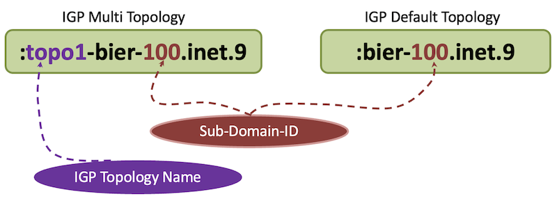

### BIRT in JUNOS-EVO

The BIRT table contains the BFR-Prefixes of the BFIR/BFER routers in the BIER domain. As all BFIR/BFER falls into the same sets, the same BIER label is pushed to the packet.

```
regress@r1-sb-bier-RE0> show route table :bier-100.inet.9 

:bier-100.inet.9: 4 destinations, 4 routes (4 active, 0 holddown, 0 hidden)
+ = Active Route, - = Last Active, * = Both

11.1.1.4/32        *[L-ISIS/14] 19:55:50, metric 30
                    >  to 12.1.1.2 via et-0/0/9.0, Push 16
11.1.1.5/32        *[L-ISIS/14] 19:55:50, metric 20
                    >  to 12.1.1.2 via et-0/0/9.0, Push 16
11.1.1.6/32        *[L-ISIS/14] 19:55:50, metric 30
                    >  to 12.1.1.2 via et-0/0/9.0, Push 16
11.1.1.7/32        *[L-ISIS/14] 19:55:50, metric 30
                    >  to 12.1.1.2 via et-0/0/9.0, Push 16
```

Let's look into one of the routes in the BIRT, the multicast packet towards BFER R4, will be pushed with a BIER label of 16

```
regress@r1-sb-bier-RE0> show route 11.1.1.4 table :bier-100.inet.9 

:bier-100.inet.9: 4 destinations, 4 routes (4 active, 0 holddown, 0 hidden)
+ = Active Route, - = Last Active, * = Both

11.1.1.4/32        *[L-ISIS/14] 19:59:22, metric 30
                    >  to 12.1.1.2 via et-0/0/9.0, Push 16
```

The extensive output of the route in the BIRT table is as follows:

```
regress@r1-sb-bier-RE0> show route 11.1.1.4 table :bier-100.inet.9 extensive 

:bier-100.inet.9: 4 destinations, 4 routes (4 active, 0 holddown, 0 hidden)
11.1.1.4/32 (1 entry, 1 announced)
        *L-ISIS Preference: 14
                Level: 2
                Next hop type: Router, Next hop index: 0
                Address: 0x55885715871c
                Next-hop reference count: 4, Next-hop session id: 0
                Kernel Table Id: 0
                Next hop: 12.1.1.2 via et-0/0/9.0
                Gateway opaque handle: 0x558859f62f40
                , selected
                Label operation: Push 16
                Label TTL action: prop-ttl
                Load balance label: Label 16: None; 
                Label element ptr: 0x5588579156a0
                Label parent element ptr: (nil)
                Label element references: 1
                Label element child references: 0
                Label element lsp id: 0
                Session Id: 0
                State: <Active Int OpaqueData>
                Local AS: 64512 
                Age: 19:59:33   Metric: 30 
                Validation State: unverified 
                ORR Generation-ID: 0 
                Task: IS-IS
                Announcement bits (1): 0-bier global task 
                AS path: I 
                Thread: junos-main 

regress@r1-sb-bier-RE0>
```

## Bit Index Forwarding Table

### Naming Convention

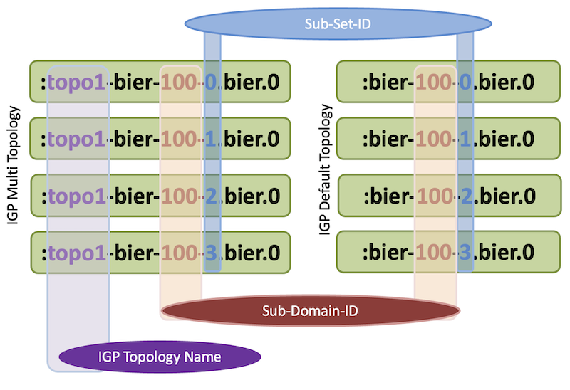

### BIFT in JUNOS-EVO

When entire BFR-IDs fall into the first set, there will be only one BIFT table created as follows:

```
regress@r1-sb-bier-RE0> show route table :bier-100-0.bier.0 

:bier-100-0.bier.0: 5 destinations, 5 routes (5 active, 0 holddown, 0 hidden)
+ = Active Route, - = Last Active, * = Both

1/16                
                   *[BIER/70] 20:00:58
                       to table mpls.0
4/16                
                   *[BIER/70] 19:57:09
                    >  to 12.1.1.2 via et-0/0/9.0, Push 16
5/16                
                   *[BIER/70] 19:57:09
                    >  to 12.1.1.2 via et-0/0/9.0, Push 16
6/16                
                   *[BIER/70] 19:57:09
                    >  to 12.1.1.2 via et-0/0/9.0, Push 16
7/16                
                   *[BIER/70] 19:57:09
                    >  to 12.1.1.2 via et-0/0/9.0, Push 16

regress@r1-sb-bier-RE0>
```

Whenever the BFR-ID is present in other sets, corresponding BIFT tables are created. In the following output, R1 is configured with BFR-ID of 1, R4 with 400, R5 with 600, R6 with 1000, and R7 with 7. R1 and R7 fall into the first set, R4 in the second, R5 in the third and R6 in the fourth. The format is BFR-ID/Mask. As per RFC, BFR-ID is a 2-byte or 16-bit field, so the mask is shown as 16 here.

The Router R1 and R7 having BFR-ID 1 and 7 fall into the first set:

```
regress@r1-sb-bier-RE0> show route table :bier-100-0.bier.0 

:bier-100-0.bier.0: 2 destinations, 2 routes (2 active, 0 holddown, 0 hidden)
+ = Active Route, - = Last Active, * = Both

1/16                
                   *[BIER/70] 1d 17:17:27
                       to table mpls.0
7/16                
                   *[BIER/70] 1d 17:17:27
                    >  to 12.1.1.2 via et-0/0/9.0, Push 16
```

Router R4 is configured with a BFR-ID of 300, which falls into the second set and its identifier within the second set is 44 (ie 300-256)

```
regress@r1-sb-bier-RE0> show route table :bier-100-1.bier.0    

:bier-100-1.bier.0: 1 destinations, 1 routes (1 active, 0 holddown, 0 hidden)
+ = Active Route, - = Last Active, * = Both

44/16                
                   *[BIER/70] 00:23:26
                    >  to 12.1.1.2 via et-0/0/9.0, Push 17
```

Router R5 is configured with a BFR-ID of 600, which falls into the third set and its identifier within the third set is 88 (ie 600-256*2)

```
regress@r1-sb-bier-RE0> show route table :bier-100-2.bier.0    

:bier-100-2.bier.0: 1 destinations, 1 routes (1 active, 0 holddown, 0 hidden)
+ = Active Route, - = Last Active, * = Both

88/16                
                   *[BIER/70] 00:23:50
                    >  to 12.1.1.2 via et-0/0/9.0, Push 18
```

Router R6 is configured with a BFR-ID of 1000, which falls into the fourth set and its identifier within the fourth set is 232 (ie. 1000-256*3)

```
regress@r1-sb-bier-RE0> show route table :bier-100-3.bier.0   

:bier-100-3.bier.0: 1 destinations, 1 routes (1 active, 0 holddown, 0 hidden)
+ = Active Route, - = Last Active, * = Both

232/16                
                   *[BIER/70] 00:23:58
                    >  to 12.1.1.2 via et-0/0/9.0, Push 19
```

Let's look into the BFR-ID in the BIFT table

```
regress@r1-sb-bier-RE0> show route table :bier-100-0.bier.0 match-prefix 4/16              

:bier-100-0.bier.0: 5 destinations, 5 routes (5 active, 0 holddown, 0 hidden)
+ = Active Route, - = Last Active, * = Both

4/16                
                   *[BIER/70] 20:06:03
                    >  to 12.1.1.2 via et-0/0/9.0, Push 16

regress@r1-sb-bier-RE0>
```

The extensive output in the BIFT table contains the FBM information.

```
regress@r1-sb-bier-RE0> show route table :bier-100-0.bier.0 match-prefix 4/16 extensive    

:bier-100-0.bier.0: 5 destinations, 5 routes (5 active, 0 holddown, 0 hidden)
4/16 (1 entry, 0 announced)
        *BIER   Preference: 70
                Next hop type: Router, Next hop index: 8054
                Address: 0x55885715a23c
                Next-hop reference count: 5, key opaque handle: 0x558859f62b80, non-key opaque handle: 0x558859f62c40
                Nexthop key opaque app data dump: TLV type:32794 APP data:Bier nbr 0x55884ea06b18, label:16, Addr:11.1.1.2
                Nexthop nonkey opaque app data dump: TLV type:32829, Flag:0x4, FBM:0:0:0:0:0:0:0:00000078
                , Next-hop session id: 2
                Kernel Table Id: 0
                Next hop: 12.1.1.2 via et-0/0/9.0, selected
                Label operation: Push 16
                Label TTL action: prop-ttl
                Load balance label: Label 16: None; 
                Label element ptr: 0x558857339af8
                Label parent element ptr: (nil)
                Label element references: 1
                Label element child references: 0
                Label element lsp id: 0
                Session Id: 2
                Statistics ID Group: Kernel ID = 4101, Stats IDs = { 4026531846 }
                State: <Active Int>
                Local AS: 64512 
                Age: 20:06:14 
                Validation State: unverified 
                Task: bier global task
                AS path: I 
                Thread: junos-main 

regress@r1-sb-bier-RE0>
```

## BIFT-FBM Formation

### FBM View from BFR

The BIFT-FBM table from the BFR router R3 is shown below in Figure 3. The BFIR/BFER R4, R6, and R7 are directly reachable, hence only one bit got set in the FBM. Router R1 and R5 are reachable via R2, hence logical OR operation of those two routers form the FBM, ie having two bits set in the FBM. Router R5 is reachable via two ECMP paths(via R2, via R5).

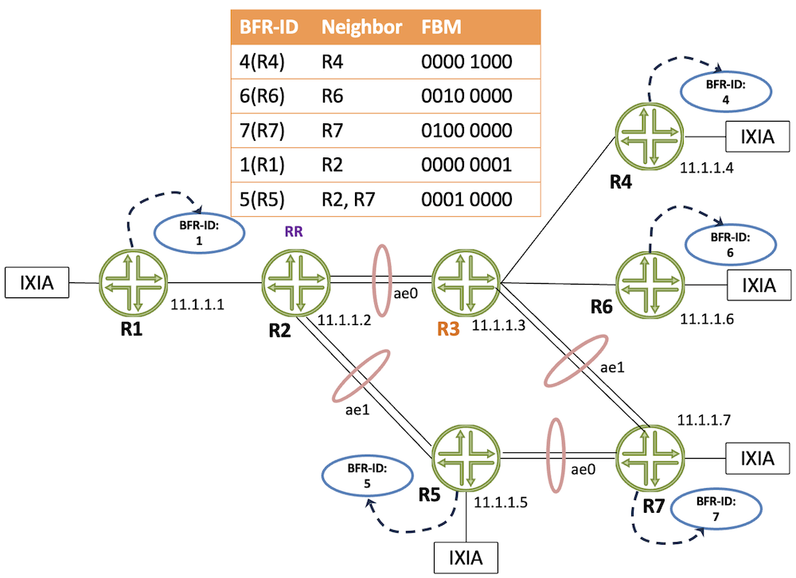

The BIFT-FBM Table from the BFR router R2 is shown below. The BFIR/BFER R4, R6, and R7 are reachable via R3, hence three bits are set in the FBM, whereas R1, and R5 are directly reachable hence only one bit got set.


### FBM View from BFIR/BFER

Let's get the BIFT-FBM table from BFIR/BFER router R1. As all other BFIR/BFER are reachable via R2, all bits corresponding to R4, R5, R6, and R7 will be set.


### Decoding FBM BitString in JUNOS-EVO

In JUNOS FBM BitString is present in the BIER neighbour table info.

```
regress@r1-sb-bier-RE0> show bier neighbor 
BIER info:
Subdomain ID: 100  BSL: 256
BIER Neighbor                     Label      Nexthop                                   Packets(pps)      Bytes
11.1.1.2                          16         12.1.1.2                                   348809(    0)      187659242
FBM:0:0:0:0:0:0:0:00000078   
```

In the FBM representation, 8 values are present for a bit-string-length of 256b, and each is separated by ":", each value represents 32 BFIR/BFER.

In the following diagram, BFR-ID of 1 and 32 are represented:

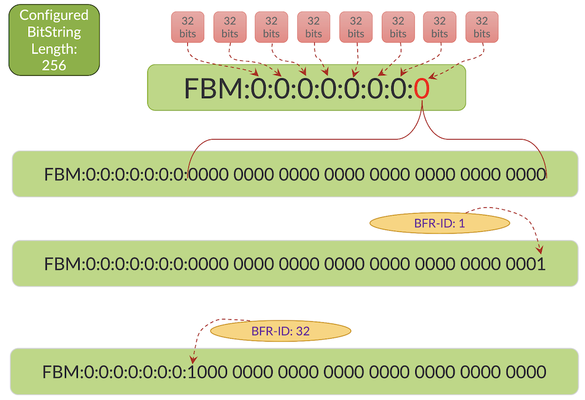

In the below diagram, BFR-ID 33 and 64 are represented

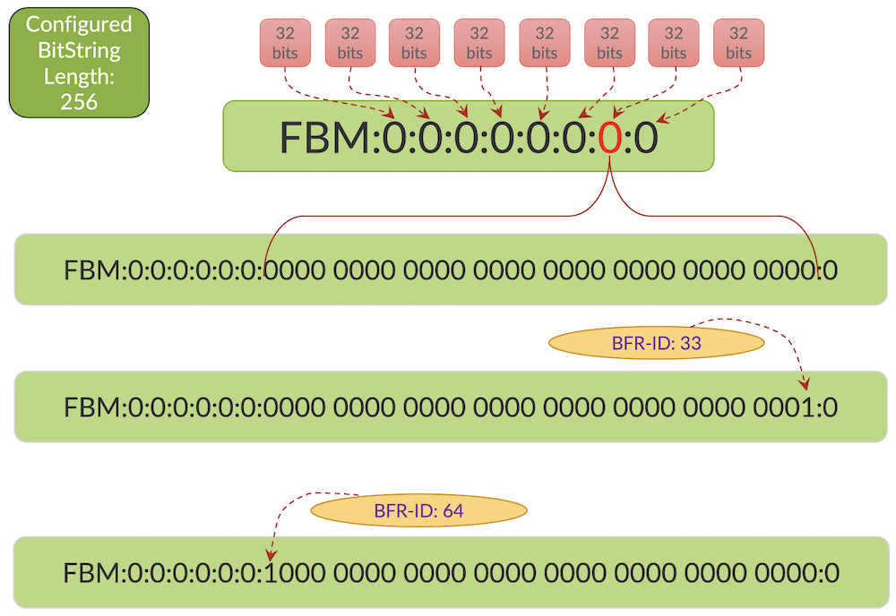

BFR-ID 225 and 256 are represented as below.

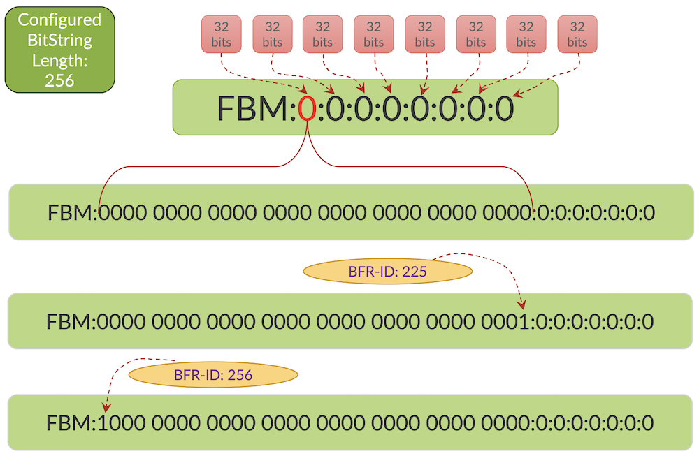

## BIFT-FBM with Single BIER Domain

### BIFT-FBM View from BFR R2

The BFR R2 has three neighbors R1, R3, and R5 via the BFIR/BFER are reachable.

```
regress@r2-sb-bier-RE0> show bier neighbor 
BIER info:
Subdomain ID: 100  BSL: 256
BIER Neighbor                     Label      Nexthop                                   Packets(pps)      Bytes
11.1.1.1                          16         12.1.1.1                                        0(    0)              0
FBM:0:0:0:0:0:0:0:00000001                                                  
11.1.1.3                          16         12.1.2.2                                   697618(    0)      375318484
FBM:0:0:0:0:0:0:0:00000068                                                  
11.1.1.5                          16         12.1.3.2                                   348809(    0)      187659242
FBM:0:0:0:0:0:0:0:00000050     
```

Let's take the FBM with Neighbor 11.1.1.3 ie, **FBM:0:0:0:0:0:0:0:00000068**. The same can be represented as **FBM:0:0:0:0:0:0:0:000000 0110 1000**, where 6 is decoded as 0110 and 8 as 1000. Here BFIR/BFER Router's R4, R6, and R7 are reachable via R3.

### BIFT-FBM View from BFIR/BFER R1

The BFIR/BFER R1 has a single neighbor R2 and all other BFIR/BFERs are reachable through it.

```
regress@r1-sb-bier-RE0> show bier neighbor
BIER info:
Subdomain ID: 100  BSL: 256
BIER Neighbor                     Label      Nexthop                                   Packets(pps)      Bytes
11.1.1.2                          16         12.1.1.2                                   348809(    0)      187659242
FBM:0:0:0:0:0:0:0:00000078
```

The FBM string **FBM:0:0:0:0:0:0:0:00000078** can be represented as **FBM:0:0:0:0:0:0:0:000000 0111 1000**, where 7 is decoded as 0111 and 8 as 1000. Ie BFIR/BFER's R4, R5, R6 and R7 are reachable via R2.

### BIFT-FBM with multiple BIER Sub-Domains

For each sub-domain, set one BIFT table will be created.

### BIFT-FBM View at BFIR/BFER(R1)

Here, two sub-domains 100 and 200 are displayed. The first one having entire BFIR/BFERs are in the same set, whereas in sub-domain 200, BFIR/BFER R1 and R7 are in one set, and others are in a different set.

```
regress@r1-sb-bier-RE0> show bier neighbor 
BIER info:
Subdomain ID: 100  BSL: 256
BIER Neighbor                     Label      Nexthop                                   Packets(pps)      Bytes
11.1.1.2                          16         12.1.1.2                                    58434(  100)       31437492
FBM:0:0:0:0:0:0:0:00000078                                                  
BIER info:
Subdomain ID: 200  BSL: 256
BIER Neighbor                     Label      Nexthop                                   Packets(pps)      Bytes
11.1.1.2                          20         12.1.1.2                                        0(    0)              0
FBM:0:0:0:0:0:0:0:00000040                                                  
11.1.1.2                          21         12.1.1.2                                        0(    0)              0
FBM:0:0:0:0:0:0:00000800:0                                                  
11.1.1.2                          22         12.1.1.2                                        0(    0)              0
FBM:0:0:0:0:0:00800000:0:0                                                  
11.1.1.2                          23         12.1.1.2                                        0(    0)              0
FBM:00000080:0:0:0:0:0:0:0                                                  

regress@r1-sb-bier-RE0>
```

From BFIR/BFER R1 perspective, there is only one next-hop R2 hence only one FBM was created for each of the BFERs (R4, R5, R6, R7) for sub-domain 200.

### BIFT-FBM View at BFR (R2)

The BFR R2 has three neighbors R1, R3, and R5. As all

```
regress@r2-sb-bier-RE0> show bier neighbor 
BIER info:
Subdomain ID: 100  BSL: 256
BIER Neighbor                     Label      Nexthop                                   Packets(pps)      Bytes
11.1.1.1                          16         12.1.1.1                                        0(    0)              0
FBM:0:0:0:0:0:0:0:00000001                                                  
11.1.1.3                          16         12.1.2.2                                    35100(  100)       18883800
FBM:0:0:0:0:0:0:0:00000068                                                  
11.1.1.5                          16         12.1.3.2                                    70196(  200)       37765448
FBM:0:0:0:0:0:0:0:00000050                                                  
BIER info:
Subdomain ID: 200  BSL: 256
BIER Neighbor                     Label      Nexthop                                   Packets(pps)      Bytes
11.1.1.1                          20         12.1.1.1                                        0(    0)              0
FBM:0:0:0:0:0:0:0:00000001                                                  
11.1.1.3                          20         12.1.2.2                                        0(    0)              0
FBM:0:0:0:0:0:0:0:00000040                                                  
11.1.1.5                          20         12.1.3.2                                        0(    0)              0
FBM:0:0:0:0:0:0:0:00000040                                                  
11.1.1.3                          21         12.1.2.2                                        0(    0)              0
FBM:0:0:0:0:0:0:00000800:0                                                  
11.1.1.5                          22         12.1.3.2                                        0(    0)              0
FBM:0:0:0:0:0:00800000:0:0                                                  
11.1.1.3                          23         12.1.2.2                                        0(    0)              0
FBM:00000080:0:0:0:0:0:0:0                                                  

regress@r2-sb-bier-RE0>
```

As BFIR/BFER R7 (bfr-id:7) is reachable via both R3 (11.1.1.3) and R5 (11.1.1.5), and we could see two FBM values.

## BIER Layer

The BIER layer has the FBM information for each of the BFER for each of the forwarding next-hop routers. The FBM is AND with the BitString of the Multicast packet to figure out the next forwarding router.

The BIER header packet structure as per the RFC-8279 is as follows:

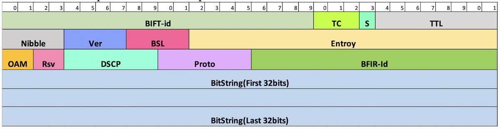

*BIER Packet Header*

The first 32 bits constituting the BIFT-id, TC, S, TTL are the same as that of an MPLS label structure, the first 20 bits BIFT-id is the BIER label, which uniquely identifies the table to look for the FBM to send the multicast packet to various destinations.

## BIFT Table Lookup

The BIER label in the multicast packet is matched on the mpls.0 table to identify the IGP topology and sub-domain and the set. Once the set is identified, the BitString in the BIER header is processed on the corresponding BIFT table.

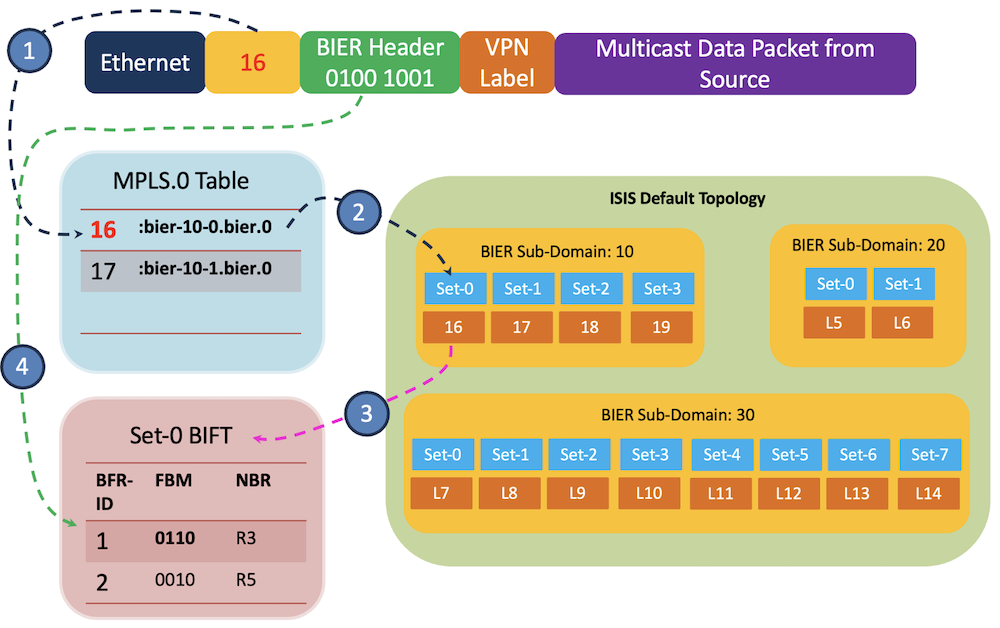

### BIFT Lookup in BFR

When MPLS encapsulation is used with BIER, the first 20 bits of the BIER header correspond to an MPLS label. On a Transit router, based on the BIER label, the BIFT is identified and the incoming packet's BitString is updated. There is a separate BIFT per "sub-domain" and "Set".

In PTX10002-36QDD, based on the BIER packet's entropy field, one of the PFEs is chosen for the processing of the packet.

In Express platforms, there are two ways to program multicast flow. Any multicast flow whose replication can be handled locally to the PFE is achieved using "EgressCopy". If a multicast flow whose final egress PFE is not the current PFE uses "IngressCopy" to send the packet back to IGP so that it can be sent across the fabric to another PFE.

In the following diagram, we will see the different places where lookup is performed based on different scenarios:

- Ingress Parser (IGP)
- Destination LookUp (DLU)
- Multicast Engine (MCE)
- Egress Packet Processor (EPP)

The BIER multicast flow in a BFR within the Express platform follows the following sequences.

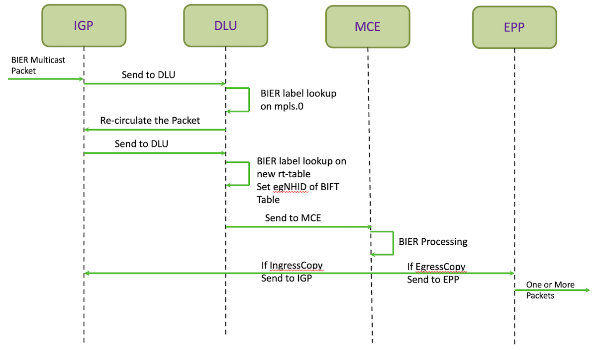

### BIFT Lookup in BFIR

When a multicast packet enters a BIER domain, the BFIR determines the packet's "sub-domain" and the "set of egress routers" to which the packet needs to be forwarded. It encapsulates the packet with a "BIER header" which contains a BitString. Each bit in the BitString represents an egress router to which the multicast packet needs to be forwarded to.

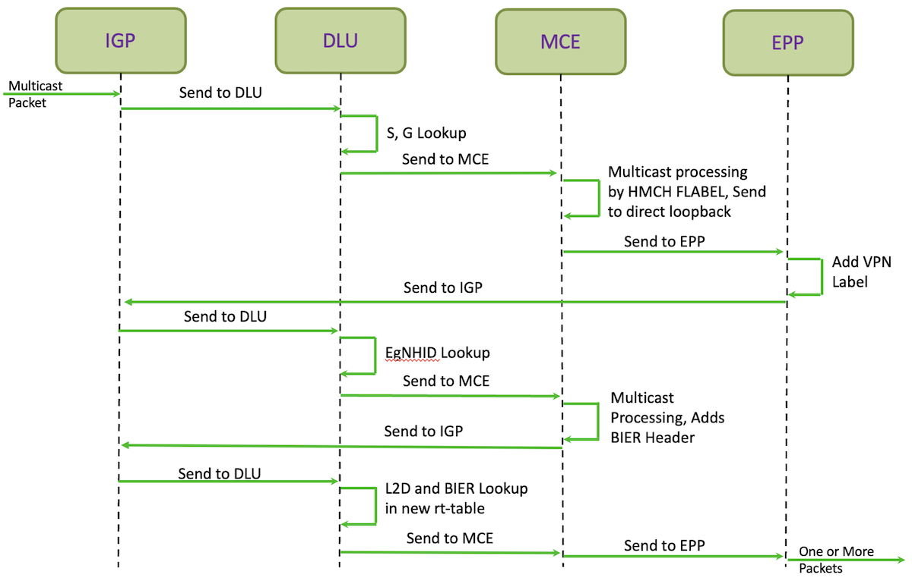

### BIFT Lookup in BFER

On a BFER, the BIER header needs to be removed and traditional multicast processing must be done based on the inner multicast IP header. As the incoming packet is a BIER packet with a BIER header, BFTR processing is done. The recirculation path cannot be skipped for BFER. MCE engine removes the BIER header and loops the packet back to IGP. Regular multicast processing based on the inner packet is done after that.

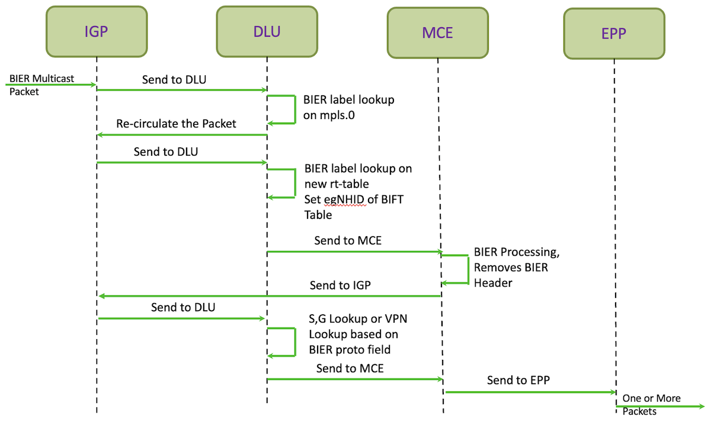

Let's look into one of the BIFT Label and its subsequent table lookup, here we are checking the BIFT Label -- 21, the mpls.0 table gives the BIFT, which returns the FBM used for checking the BIER header to identify the interested BFER and its next-hops.

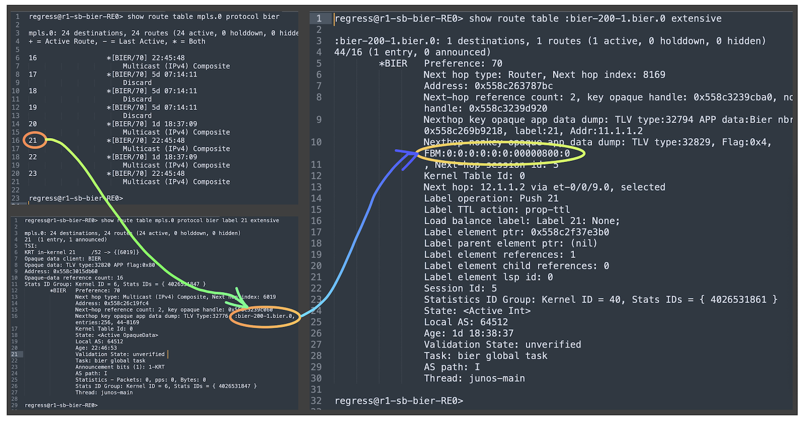

## Useful links

RFC/Drafts

- [https://datatracker.ietf.org/doc/rfc8279/](https://datatracker.ietf.org/doc/rfc8279/)
- [https://datatracker.ietf.org/doc/rfc8296/](https://datatracker.ietf.org/doc/rfc8296/)
- [https://datatracker.ietf.org/doc/rfc8401/](https://datatracker.ietf.org/doc/rfc8401/)
- [https://datatracker.ietf.org/doc/rfc8556/](https://datatracker.ietf.org/doc/rfc8556/)
- [https://datatracker.ietf.org/doc/draft-ietf-bess-mvpn-evpn-aggregation-label/14/](https://datatracker.ietf.org/doc/draft-ietf-bess-mvpn-evpn-aggregation-label/14/)
- [https://www.rfc-editor.org/rfc/rfc7902.html](https://www.rfc-editor.org/rfc/rfc7902.html)

PTX10002-36QDD:

- [https://juniper.github.io/techposts/introducing-ptx10002-36qdd/article](https://juniper.github.io/techposts/introducing-ptx10002-36qdd/article)
- [https://juniper.github.io/techposts/express-5-overview/article](https://juniper.github.io/techposts/express-5-overview/article)
- [https://www.juniper.net/us/en/products/routers/ptx-series/ptx10002-36qdd-packet-transport-router.html](https://www.juniper.net/us/en/products/routers/ptx-series/ptx10002-36qdd-packet-transport-router.html)

BIER TechPost Articles

- [https://juniper.github.io/techposts/bier-introduction-and-underlay/article](https://juniper.github.io/techposts/bier-introduction-and-underlay/article)
- [https://juniper.github.io/techposts/bier-overlay/article](https://juniper.github.io/techposts/bier-overlay/article)
- [https://juniper.github.io/techposts/bier-mvpn-in-ptx-express-5/article](https://juniper.github.io/techposts/bier-mvpn-in-ptx-express-5/article)
- [https://juniper.github.io/techposts/eantc-bier-interop-testing-on-ptx10002-36qdd/article](https://juniper.github.io/techposts/eantc-bier-interop-testing-on-ptx10002-36qdd/article)

EANTC 2024 InterOP Report

- [https://eantc.de/wp-content/uploads/2023/12/EANTC-MPLSSDNInterop2024-TestReport-v1.3.pdf](https://eantc.de/wp-content/uploads/2023/12/EANTC-MPLSSDNInterop2024-TestReport-v1.3.pdf)

## Glossary

- BIER: Bit Index Explicit Replication
- BFR: Bit Forwarding Router
- BFR-NBR: BFR Neighbor
- BFR-Prefix: BFR Prefix IP address
- BFER: Bit Forwarding Egress Router
- BFIR Bit Forwarding Ingress Router
- BIRT:  Bit Index Routing Table
- BIFT: Bit Index Forwarding Table
- BML: Bit Mask Length
- BSL: Bit String Length
- BFR-Id: BFR Identifier
- BGP: Border Gateway Protocol
- DCB: Domain-wide Common Block
- DLU: Destination Lookup
- EANTC: European Advanced Networking Test Center
- EPP: Egress Packet Processor
- FBM: Forwarding Bit Mask
- IGMP: Internet Group Management Protocol
- IGP: Interior Gateway Protocol
- IGP: Ingress Parser
- ISIS: Intermediate System Intermediate System
- LDP: Label Distribution Protocol
- LSA: Link State Advertisement
- MCE: Multicast Engine
- m-LDP: Multicast LDP
- MPLS: Multi Protocol Label Switching
- MVPN: Multicast VPN
- MWC: MPLS World Congress
- OSPF: Open Shortest Path First
- PIM: Protocol Independent Multicast
- PMSI: Provider Multicast Service Interface
- RFC: Request For Comments
- RSVP-TE: Resource Reservation Protocol -- Traffic Engineering
- VRF: Virtual Routing and Forwarding
- VPN: Virtual Private Network

## Acknowledgments

Thanks To: Jeffrey Zhang, Vinod Kumar Nagaraj, Venkatesan  Parthasarathi, Poorna Pushkala Balasubramanian, Sambasiva Rao p,Antoni Przygienda, Nicolas Fevrier, Vasily Mukhin, Sanoj Vivekanandan, Dmitry Shokarev, Krzysztof Szarkowicz
