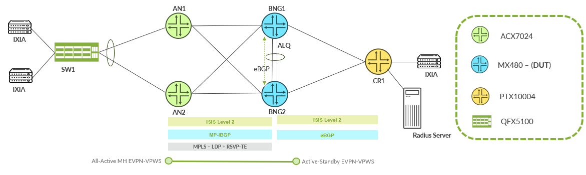
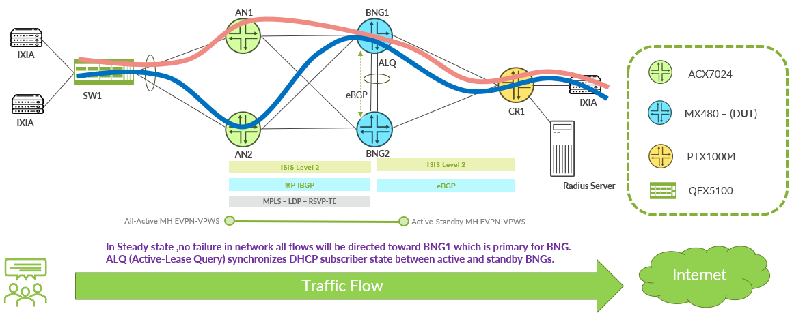
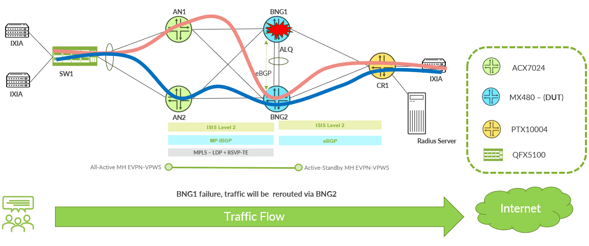

# BNG Chassis Redundancy with DHCP Active Lease Query and EVPN VPWS

**Sathish Eruvala - 07/16/2026**

When a Broadband Network Gateway goes down, thousands of subscribers lose connectivity. Traditional BNG redundancy solutions often result in subscriber session loss, requiring DHCP reinitialization and leading to service disruption.

Active Lease Query (ALQ) solves this challenge by synchronizing DHCP lease states between BNG peers in real time. When the active BNG fails, the standby BNG already has all subscribers provisioned and takes over seamlessly, with no DHCP re-establishment required.

In this article, we validate ALQ-based chassis redundancy on MX480 BNGs with MPC10E TRIO-based line cards using EVPN-VPWS multihoming to demonstrate scalable and resilient broadband service delivery at 64K subscriber scale, and present measured convergence results from failover testing.

As a prerequisite, familiarity with BNG subscriber management concepts and EVPN fundamentals will help. For a related deep dive on BNG subscriber management on MPC10E, see the [BNG on MPC10E](https://juniper.github.io/techpost/articles/bng-on-mpc10e/article/)  TechPost.

## BNG Failures and Subscriber Impact

In broadband access networks, the BNG is the subscriber anchor: it terminates DHCP sessions, assigns addresses, enforces policies, and steers traffic through services like CGNAT. If you don't have proper redundancy, a BNG failure means:

- Every DHCP subscriber must restart address negotiation (DISCOVER -> OFFER -> REQUEST -> ACK for DHCPv4, plus the equivalent Solicit/Advertise/Request/Reply exchange for DHCPv6)
- Subscribers experience minutes of downtime during re-authentication and route convergence
- PPPoE sessions must fully re-establish (LCP/NCP renegotiation)
- CGNAT port-block mappings are lost, breaking in-progress TCP sessions

For a BNG serving 64,000+ subscribers, this translates to a major outage, even if the standby BNG is ready to serve traffic within seconds.

## How Active Lease Query Works

Active Lease Query (defined in [RFC 7724](https://www.rfc-editor.org/rfc/rfc7724) for DHCPv4 and [RFC 7653](https://www.rfc-editor.org/rfc/rfc7653) for DHCPv6) addresses this problem by enabling real-time synchronization of DHCP lease state between BNG peers over a persistent TCP connection. Here's how it works:

1. **TCP connection establishment**: Each BNG opens a TCP session to its peer using configured peer addresses (port 67 for DHCPv4, port 547 for DHCPv6). Separate connections handle v4 and v6 independently.
2. **Initial bulk synchronization**: When the connection comes up, the standby BNG uses Bulk Lease Query (BLQ) to pull the full lease database from the active peer.
3. **Continuous hot-standby updates**: After initial sync, every lease event (binding, renewal, release) on the active BNG is pushed to the standby via ALQ messages in real time. The standby processes each update through its own DHCP state machine: instantiating profiles, performing authentication, and activating address families : so the subscriber is fully provisioned on both nodes simultaneously.
4. **Failover**: When the active BNG fails, the standby already holds the current lease state for all DHCP subscribers. Once EVPN DF election completes and traffic shifts, subscribers continue without re-authentication.

What ALQ does not synchronize:

- PPPoE sessions. PPP uses a reconnect model by design. After failover, PPPoE subscribers must re-establish LCP/NCP, which takes approximately 3 minutes in this validation.
- Subscriber statistics and accounting counters
- Services attached to subscriber sessions (these are re-applied from RADIUS/profile on the standby)

In a mixed DHCP + PPPoE deployment (common in broadband), this means DHCP subscribers get sub-second failover while PPPoE subscribers go through a full session re-establishment.

## Solution Architecture

## EVPN-VPWS for BNG Redundancy

ALQ handles the DHCP state plane, but you still need a mechanism to steer Layer 2 subscriber traffic between access nodes and the correct BNG. In this design, we used EVPN-VPWS (Virtual Private Wire Service) with pseudowire headend termination (PWHT) because it provides:

- Single-active multihoming on the BNG side. Only one BNG is the Designated Forwarder (DF) at a time, with deterministic preference-based election
- All-active multihoming on the access side. Both access nodes forward traffic simultaneously for load distribution
- Fast DF election. When the active BNG fails, EVPN signals the standby to assume DF responsibility without waiting for protocol timers
- Loop-free forwarding. EVPN's split-horizon and DF election prevent duplicate traffic delivery

Together, these two pieces deliver the complete BNG HA solution:

- EVPN-VPWS handles traffic steering, determining which BNG receives traffic
- ALQ handles state synchronization, ensuring the active BNG already has the subscriber provisioned

## Topology



| Role | Platform | Software | Key Hardware |
|:--|:--|:--|:--|
| Access Node (AN1, AN2) | ACX7024 | Junos Evo 23.4R2-S2.3 | :  |
| BNG (BNG1, BNG2) | MX480 | Junos 23.2R2-S4.5 | MPC10E (subscribers), SPC3 (CGNAT) |
| Core Router (CR1) | PTX10004 | Junos Evo 24.2R2 | JNP10K-LC1201 |
| Access Switch | QFX5100-48S | Junos 17.4R1 | :  |

MPC10E provides subscriber access interfaces, while the integrated SPC3 performs CGNAT for BNG subscriber traffic:

- **Underlay transport**: IS-IS with a flat Level 2 domain and MPLS (LDP + RSVP-TE) for label distribution.
- **Control plane**: MP-BGP carries EVPN routes between all PE devices. eBGP provides upstream connectivity from BNGs to core.
- **Subscriber emulation**: IXIA traffic generator emulates both DHCP and PPPoE, dual-stack subscribers. A RADIUS server provides authentication and authorization.

## Design Decisions

The overall design is subject to operator preference, but the following table summarizes the choices made in this validation:

| Decision | Choice | Rationale |
|:--|:--|:--|
| BNG-side multihoming | Single-active | ALQ is a 1:1 chassis redundancy model: one active, one standby |
| Access-side multihoming | All-active | Maximizes access bandwidth; both ANs forward simultaneously |
| DF election | Preference-based (Least Preference) | EVPN preference-based DF election defaults to highest-value-wins. This design uses designated-forwarder-preference-least to invert that, so BNG1 (100) wins over BNG2 (900) |
| ALQ peer connectivity | Directly connected ALQ peering | ALQ lease-state synchronization is carried over a dedicated inter-BNG Layer-3 link |
| CGNAT placement | Per-BNG (independent pools) | Each BNG has its own CGNAT pool: avoids cross-BNG NAT state dependency |

## Configuration

The following sections highlight the key configuration elements that make this solution work.

## Active Lease Query

ALQ ensures synchronization of the DHCP lease state between active and standby nodes in a redundant BNG setup. The configuration resides within the routing instance hosting subscriber services, with each BNG configured to use the IP address of its peer on the dedicated inter-BNG transport link for ALQ state synchronization:

BNG1 configuration:

```
routing-instances {
    CGN-SUB {
        system {
            services {
                dhcp-local-server {
                    dhcpv6 {
                        active-leasequery {
                            peer-address 2001:db8::172:19:200:2;
                        }
                    }
                    active-leasequery {
                        peer-address 172.19.200.2;
                    }
                }
            }
        }
    }
}

```

BNG2 configuration (mirror: points back to BNG1):

```
routing-instances {
    CGN-SUB {
        system {
            services {
                dhcp-local-server {
                    dhcpv6 {
                        active-leasequery {
                            peer-address 2001:db8::172:19:200:1;
                        }
                    }
                    active-leasequery {
                        peer-address 172.19.200.1;
                    }
                }
            }
        }
    }
}

```

Note the symmetry: each BNG is configured with the transport address of its peer on the dedicated inter-BNG Layer-3 adjacency. The resulting Active Leasequery (ALQ) TCP sessions (DHCPv4 port 67, DHCPv6 port 547) provide continuous replication of DHCP lease-state information, ensuring synchronization between the active and standby chassis.

## Subscriber Management Redundancy

The subscriber-management redundancy block ties ALQ to the pseudowire anchor interface and controls failover behavior:

```
system {
    services {
        subscriber-management {
            gres-route-flush-delay;
            enable {
                force;
            }
            redundancy {
                interface ps21.0 {
                    local-inet-address 172.19.1.11;  /* BNG2 uses 172.19.1.12 */
                    shared-key "SPN-ps21-key";
                }
                protocol {
                    pseudo-wire;
                }
                no-advertise-routes-on-backup;
                route-operation-interval 1;
            }
        }
    }
}

```

The local-inet-address identifies this BNG in the redundancy relationship. The shared key authenticates the peering. The protocol pseudo-wire statement declares that EVPN VPWS (not VRRP) drives the active/standby election.

## EVPN VPWS Routing Instance

EVPN VPWS provides overlay Layer 2 transport connectivity between the Access Nodes and redundant BNG chassis. It enables scalable service delivery, simplified provisioning, and resilient access connectivity for subscriber traffic forwarding in the chassis redundancy architecture.

```
**BNG1 configuration:**
routing-instances {
    EVPN-PS21 {
        instance-type evpn-vpws;
        protocols {
            evpn {
                interface ps21.0 {
                    vpws-service-id {
                        local 202100;
                        remote 102100;
                    }
                }
                designated-forwarder-election-hold-time 1200;
                designated-forwarder-preference-least;
                label-allocation per-instance;
                control-word;
            }
        }
        description "evpn-vpws (ps21.0) vlan: any";
        interface ps21.0;
        route-distinguisher 172.19.1.11:2100;
        vrf-target target:172.19.1.11:12100;
    }
}
**BNG2 configuration:**
routing-instances {
    EVPN-PS21 {
        instance-type evpn-vpws;
        protocols {
            evpn {
                interface ps21.0 {
                    vpws-service-id {
                        local 202100;
                        remote 102100;
                    }
                }
                designated-forwarder-election-hold-time 1200;
                designated-forwarder-preference-least;
                label-allocation per-instance;
                control-word;
            }
        }
        description "evpn-vpws (ps21.0) vlan: any";
        interface ps21.0;
        route-distinguisher 172.19.1.12:2100;
        vrf-target target:172.19.1.11:12100;
    }
}

```

## EVPN VPWS Anchor Interface (ps21)

The pseudowire interface ps21 acts as a scalable anchor point for subscriber sessions, enabling dynamic provisioning of both DHCP and PPPoE users. Its ESI (Ethernet Segment Identifier) is shared between both BNGs to form a multi-homed Ethernet segment:

```
interfaces {
    ps21 {
        anchor-point {
            lt-0/1/0;               /* BNG2 uses lt-2/0/0 */
        }
        flexible-vlan-tagging;
        auto-configure {
            stacked-vlan-ranges {
                dynamic-profile AUTO-STACKED-PWHT {
                    accept [ dhcp-v4 dhcp-v6 pppoe ];
                    ranges {
                        any,any;
                    }
                }
            }
            vlan-ranges {
                dynamic-profile AUTO-VLAN-PWHT {
                    accept [ dhcp-v4 dhcp-v6 pppoe ];
                    ranges {
                        any;
                    }
                }
            }
            remove-when-no-subscribers;
        }
        mtu 9192;
        encapsulation flexible-ethernet-services;
        esi {
            00:11:22:33:44:00:00:00:21:21;
            single-active;
            df-election-type {
                preference {
                    value 100;      /* BNG2 uses 900: higher value = standby */
                }
            }
        }
        mac 00:11:22:33:21:aa;
        no-gratuitous-arp-request;
    }
}

```

Key points:

- Both BNGs share the same ESI (00:11:22:33:44:...), so EVPN treats them as a redundancy pair
- DF election preference determines active/standby: BNG1 (100) wins over BNG2 (900)
- The auto-configure block accepts both DHCP and PPPoE subscribers dynamically
- remove-when-no-subscribers cleans up VLAN state when all subscribers on a VLAN disconnect

## CGNAT Integration

This design implements a dual-stack CGNAT architecture where IPv4 traffic is translated to optimize public address utilization, while IPv6 traffic is forwarded natively without NAT. Each BNG operates its own independent CGNAT pool:

```
services {
    nat {
        source {
            pool INTERNET-POOL-1 {
                address {
                    203.0.113.1/32;
                }
                port {
                    automatic {
                        round-robin;
                    }
                    block-allocation {
                        block-size 64;
                        maximum-blocks-per-host 1;
                        active-block-timeout 300;
                    }
                }
                mapping-timeout 180;
            }
        }
    }
}

```

**Why independent pools per BNG**? ALQ synchronizes DHCP lease state, but it does not synchronize CGNAT mappings. After failover, the new active BNG creates fresh NAT bindings from its own pool. This means:

- In-progress TCP sessions through CGNAT will break on failover (the public ***IP:port*** mapping changes)
- New connections are established immediately on the new BNG's pool
- For most broadband traffic (web, DNS, streaming), this is an acceptable trade-off since sessions are short-lived

The IPv6 path bypasses NAT entirely. The service-set passes IPv6 traffic through without translation:

```
services {
    nat {
        source {
            rule-set IPv6_NAT_RULE_SETS {
                rule NAT_OFF {
                    match {
                        source-address ::/0;
                        destination-address ::/0;
                    }
                    then {
                        source-nat {
                            off;
                        }
                    }
                }
                match-direction input;
            }
        }
    }
}

```

## Subscriber Routing Instance (CGN-SUB)

The CGN-SUB routing instance hosts all subscriber sessions and the DHCP server configuration, supporting DHCPv4 and DHCPv6 (including IA_NA for address assignment and IA_PD for prefix delegation) with dynamic IPoE and PPP subscriber management:

```
routing-instances {
    CGN-SUB {
        instance-type vrf;
        system {
            services {
                dhcp-local-server {
                    dhcpv6 {
                        overrides {
                            rapid-commit;
                            client-negotiation-match incoming-interface;
                            always-process-option-request-option;
                            delete-binding-on-renegotiation;
                        }
                        group V6 {
                            overrides {
                                delegated-pool SUBS-IPv6-DELEGATED-POOL;
                                dual-stack ds-dhcp;
                            }
                            interface demux0.0;
                        }
                    }
                    duplicate-clients-in-subnet incoming-interface;
                    group V4 {
                        authentication {
                            password "********";
                            username-include {
                                mac-address;
                            }
                        }
                        overrides {
                            client-discover-match incoming-interface;
                            delete-binding-on-renegotiation;
                            dual-stack ds-dhcp;
                        }
                        interface demux0.0;
                    }
                    dual-stack-group ds-dhcp {
                        dynamic-profile AUTO-DHCP-DS-DEMUX;
                        on-demand-address-allocation;
                        classification-key {
                            mac-address;
                        }
                    }
                }
            }
        }
    }
}

```

The *dual-stack-group* with *on-demand-address-allocation* and *classification-key-mac-address* ensures that DHCPv4 and DHCPv6 sessions from the same subscriber (identified by MAC) are bound together into a single dual-stack session.

## Validation Results

Testing was performed with 64,000 dual-stack subscribers (32,000 DHCP + 32,000 PPPoE) distributed across the EVPN VPWS access infrastructure.

## Steady-State Operation (BNG1 Active)



With BNG1 as the active (DF) node:

| Metric | BNG1 (Active) | BNG2 (Standby) |
|:--|:--|:--|
| Total active subscribers | 128,000 | 64,000 |
| DHCP subscribers | 64,000 | 32,000 (synced via ALQ) |
| VLAN logical interfaces | 32,000 | 32,000 (synced via ALQ) |
| PPPoE subscribers | 32,000 | 0 (not synced: expected) |

The 128,000 count on BNG1 represents 64,000 dual-stack subscribers, each with both an IPv4 and IPv6 binding counted separately. BNG2's 64,000 reflects only the DHCP-synced sessions. PPPoE sessions are absent on standby because ALQ does not synchronize the PPP state.

**EVPN VPWS state:** both BNGs show fully resolved control-plane state:

- BNG1: Primary DF role, ps21.0 active
- BNG2: Backup role, ps21.0 standby
- Both access nodes (AN1, AN2): All-active, fully resolved

```
BNG1> show evpn vpws-instance EVPN-PS21
Instance: EVPN-PS21, Instance type: EVPN VPWS, Encapsulation type: MPLS
  Route Distinguisher: 172.19.1.11:2100
  Number of local interfaces: 1 (1 up)
    Interface name  ESI                            Mode          Role     Status
    ps21.0          00:11:22:33:44:00:00:00:21:21  single-active Primary  Up
  Local SID: 202100  Advertised Label: 29
    PE addr       ESI                            Label  Mode          Role    Status
    172.19.1.12   00:11:22:33:44:00:00:00:21:21  28     single-active Backup  Resolve
  Remote SID: 102100
    PE addr       ESI                            Label  Mode        Role     Status
    172.19.1.15   00:01:02:03:04:00:00:00:21:11  16     all-active  Primary  Resolved
    172.19.1.16   00:01:02:03:04:00:00:00:21:11  16     all-active  Primary  Resolved
  DF Election Information for Single-Active ESI
    ESI: 00:11:22:33:44:00:00:00:21:21
    DF Election Algorithm: Preference based
    Primary PE: 172.19.1.11, Preference: 100
    Backup PE:  172.19.1.12, Preference: 900

```

```
BNG2> show evpn vpws-instance EVPN-PS21
Instance: EVPN-PS21, Instance type: EVPN VPWS, Encapsulation type: MPLS
  Route Distinguisher: 172.19.1.12:2100
  Number of local interfaces: 1 (1 up)
    Interface name  ESI                            Mode          Role    Status
    ps21.0          00:11:22:33:44:00:00:00:21:21  single-active Backup  Up
  Local SID: 202100  Advertised Label: 28
    PE addr       ESI                            Label  Mode          Role     Status
    172.19.1.11   00:11:22:33:44:00:00:00:21:21  29     single-active Primary  Resolved
  Remote SID: 102100
    PE addr       ESI                            Label  Mode        Role     Status
    172.19.1.15   00:01:02:03:04:00:00:00:21:11  16     all-active  Primary  Resolved
    172.19.1.16   00:01:02:03:04:00:00:00:21:11  16     all-active  Primary  Resolved

```

Both BNGs show fully resolved EVPN VPWS state. With least-cost used, BNG1 is Primary with preference 100, BNG2 is Backup with preference 900. Both access nodes (AN1 at 172.19.1.15, AN2 at 172.19.1.16) are all-active and resolved.

**ALQ redundancy state:**

```
BNG1> show system subscriber-management redundancy-state dhcp active-leasequery interface ps21.0
Interface    Redundancy State
ps21.0       Master
BNG2> show system subscriber-management redundancy-state dhcp active-leasequery interface ps21.0
Interface    Redundancy State
ps21.0       Backup

```

DHCP bindings are confirmed in sync with identical IP-to-MAC mappings on both BNGs in BOUND state, confirming ALQ replication is working.

## Failover: BNG1 Failure



When BNG1 is powered off (simulating a hard chassis failure):

1. EVPN detects DF loss and elects BNG2 as new primary
2. BNG2 transitions to Master role on ps21.0
3. DHCP subscribers continue without re-authentication: lease state already present
4. PPPoE subscribers re-establish sessions from scratch (~3 minutes)
5. CGNAT port-blocks are reallocated from BNG2's pool

**Post-failover state on BNG2:**

| Metric | BNG2 (Now Active) |
|:--|:--|
| Total active subscribers | 128,000 |
| DHCP subscribers | 64,000 (preserved from ALQ sync) |
| VLAN logical interfaces | 32,000 |
| PPPoE subscribers | 32,000 (re-established) |

BNG2 comes up at full scale with DHCP sessions intact, PPPoE re-negotiated as expected.

## Convergence Measurements

The following convergence times were measured using IXIA traffic generators with 64,000 subscribers (32K DHCP + 32K PPPoE):

**Failover (BNG1 power-off -> BNG2 takes over):**

| Traffic Type | Direction | Convergence Time | Notes |
|:--|:--|:--|:--|
| DHCP | Uplink (subscriber -> network) | 269 ms | EVPN DF election completes, BNG2 has routes ready |
| DHCP | Downlink (network -> subscriber) | 68.8 seconds | Core routing convergence to redirect traffic to BNG2 |
| PPPoE | Uplink | 178.8 seconds | Full session re-establishment (LCP/NCP/Auth/IPCP) |
| PPPoE | Downlink | 179.1 seconds | Full session re-establishment |

****

**Key observations:**

- DHCP uplink convergence was sub-second. Once DF election completes, BNG2 serves traffic immediately because ALQ already provisioned the subscriber state
- DHCP downlink was slower, bounded by core routing convergence (BGP withdraw/re-advertise) rather than ALQ itself
- PPPoE is ~3 minutes. Regardless of direction, PPP sessions must fully renegotiate. That's how PPP works, so it's not an ALQ limitation

## Traffic Verification

During steady-state operation, bidirectional traffic flows confirmed:

- IPv4 subscriber traffic correctly translated through CGNAT (NAT sessions active, port-blocks allocated)
- IPv6 subscriber traffic forwarded natively without translation
- CGNAT port-block mappings were correctly allocated and utilized, with zero failed subscriber sessions

After failover to BNG2:

- CGNAT port-blocks reallocated from BNG2's pool with full utilization maintained
- Bidirectional NAT sessions re-established with incrementing packet/byte counters
- No traffic black-holing observed once convergence completed

## Operational Considerations

## What to Monitor

| Indicator | Command | Healthy State |
|:--|:--|:--|
| ALQ peering | show system subscriber-management redundancy-state dhcp active-leasequery interface <intf> | Master/Backup as expected |
| EVPN DF role | show evpn vpws-instance <instance> | Primary/Backup with "Resolved" status |
| Subscriber sync count | show subscribers summary (on standby) | DHCP count matches active BNG |
| CGNAT utilization | show services nat source port-block | Port-blocks allocated, no exhaustion |

## Expected Limitations

- **PPPoE is not protected by ALQ:** subscribers using PPPoE will experience ~3-minute reconnection on any failover event. If the deployment is PPPoE-heavy, consider this when planning the SLA.
- **CGNAT sessions break on failover:** each BNG uses independent NAT pools. In-flight TCP sessions through NAT will not survive failover. Short-lived sessions (web browsing, DNS) recover quickly; long-lived sessions (downloads, video calls) will be interrupted.
- **ALQ synchronization is best-effort:** per [RFC 7724](https://www.rfc-editor.org/rfc/rfc7724), there is no explicit acknowledgment that all subscribers have been synced. If failover occurs during initial bulk sync (e.g., immediately after BNG restart), some subscribers may need to re-negotiate. In JUNOS, we can reduce potential issues by leveraging designated-forwarder-election-hold-time 1200 configured on the EVPN-VPWS instance, giving ALQ 20 minutes to complete synchronization before DF election can transfer traffic to a newly-restored BNG.

## Scale Boundaries Tested

| Parameter | Validated Scale |
|:--|:--|
| Dual-stack subscribers (DHCP) | 32,000 per BNG |
| Dual-stack subscribers (PPPoE) | 32,000 per BNG |
| Total subscriber sessions (active BNG) | 128,000 (64K x 2 address families) |
| CGNAT port-block utilization | 1,008 blocks / 64 ports each |
| Failover scenarios | Power-off, FPC offline, PS interface disable |

## Conclusion

ALQ chassis redundancy with EVPN-VPWS single-active multihoming delivers deterministic failover behavior at 64K subscriber scale: 269 ms uplink convergence means DHCP subscribers barely notice a chassis failure. The solution ensures DHCP-based subscriber session continuity through lease state synchronization, while IPv4 subscriber traffic is processed via CGNAT and IPv6 subscriber traffic is forwarded natively.

That said, there are some caveats to keep in mind: PPPoE subscribers reconnect in ~3 minutes, and CGNAT sessions don't survive failover. Both are inherent to PPP and CGNAT, not ALQ. If those matter for your deployment, alternatives exist (active-active CGNAT sync, or migrating PPPoE subscribers to IPoE).

For operators deploying this solution:

- Start with the ALQ peering and subscriber-management redundancy configuration as the foundation
- Layer EVPN VPWS single-active multihoming for deterministic traffic steering
- Plan CGNAT pools independently per BNG: don't assume NAT state continuity
- Monitor the standby BNG's subscriber count to confirm ALQ sync is healthy
- Test failover regularly under load to validate convergence meets SLA requirements

## Useful Links

Juniper Documentation:

- [DHCP Individual and Bulk Leasequery](https://www.juniper.net/documentation/us/en/software/junos/subscriber-mgmt-sessions/topics/topic-map/dhcp-individual-bulk-leasequery.html): protocol mechanics underpinning ALQ
- [M:N Subscriber Redundancy](https://www.juniper.net/documentation/us/en/software/junos/subscriber-mgmt-sessions/topics/topic-map/m-to-n-subscriber-redundancy.html): the redundancy framework ALQ operates within
- [M:N Subscriber Redundancy on DHCP Server](https://www.juniper.net/documentation/us/en/software/junos/subscriber-mgmt-sessions/topics/topic-map/mn-subscriber-redundancy-on-dhcp-server.html): DHCP server-side configuration for M:N redundancy

Juniper Validated Designs:

- [Metro Fabric and Broadband Edge JVD](https://www.juniper.net/documentation/us/en/software/jvd/jvd-metro-fabric-and-broadband-edge/use_case_and_reference_architecture.html): reference architecture for metro broadband deployments

Related TechPosts:

- [BNG on MPC10E](https://juniper.github.io/techpost/articles/bng-on-mpc10e/article/) : BNG subscriber management architecture on MPC10E TRIO-based line cards
- [Centralized Deterministic CGNAT](https://juniper.github.io/techpost/articles/centralized-deterministic-cgnat/article/) : CGNAT design patterns on Juniper platforms
- [New Subscriber QoS for Next Generation Broadband](https://juniper.github.io/techpost/articles/new-subscriber-qos-for-next-generation-broadband/article/) : subscriber CoS architecture
- [Juniper BNG CUPS Architecture](https://juniper.github.io/techpost/articles/juniper-bng-cups-architecture/article/) : alternative BNG architecture with control/user plane separation

Standards:

- [DHCP Active Leasequery (RFC 7724)](https://www.rfc-editor.org/rfc/rfc7724): DHCPv4 ALQ protocol specification
- [DHCPv6 Active Leasequery (RFC 7653)](https://www.rfc-editor.org/rfc/rfc7653): DHCPv6 ALQ protocol specification

## Glossary

- ALQ: Active Lease Query: DHCP protocol extension for real-time lease state synchronization between peers
- BLQ: Bulk Lease Query: initial full-database synchronization between DHCP peers at connection startup
- BNG: Broadband Network Gateway: the router terminating subscriber sessions in access networks
- CGNAT: Carrier-Grade NAT: large-scale IPv4 address translation for subscriber traffic
- DF: Designated Forwarder: the EVPN-elected node responsible for forwarding traffic on a multi-homed segment
- ESI: Ethernet Segment Identifier: a shared identifier linking multiple PEs to the same multi-homed segment
- EVPN: Ethernet VPN: BGP-based control plane for Layer 2 services with multihoming support
- IPoE: IP over Ethernet: subscriber access model using DHCP (as opposed to PPPoE)
- MPC10E: Modular Port Concentrator 10E: MX Series line card
- PWHT: Pseudowire Headend Termination: termination of pseudowires directly on the BNG
- SPC3: Services Processing Card 3: MX Series service card providing inline CGNAT, stateful firewall, etc.
- VPWS: Virtual Private Wire Service: point-to-point Layer 2 VPN service

## Acknowledgements

Special thanks to Kevin Brown for his continuous guidance and valuable contributions throughout the creation of this TechPost. I would also like to thank Indranil Hazra and Gururaj Rao for their technical insights and feedback.