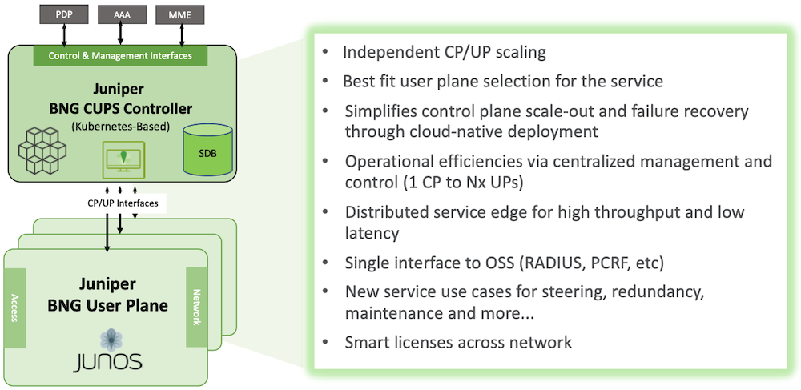
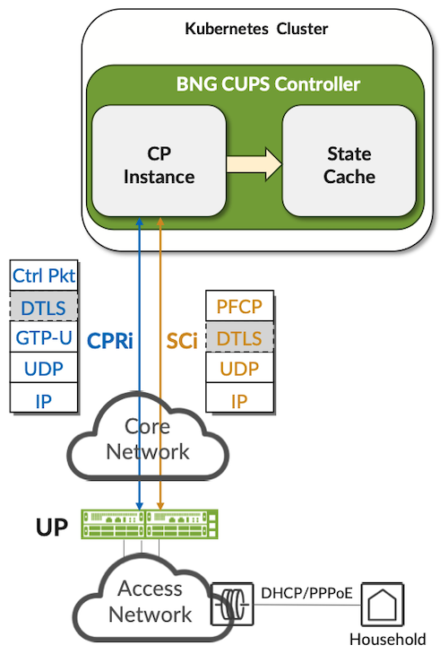
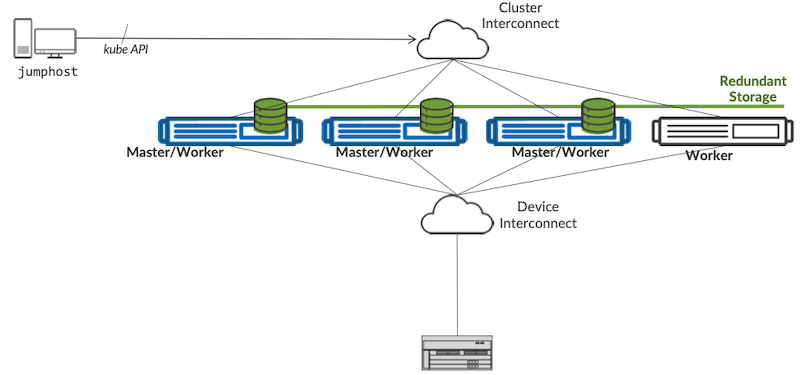
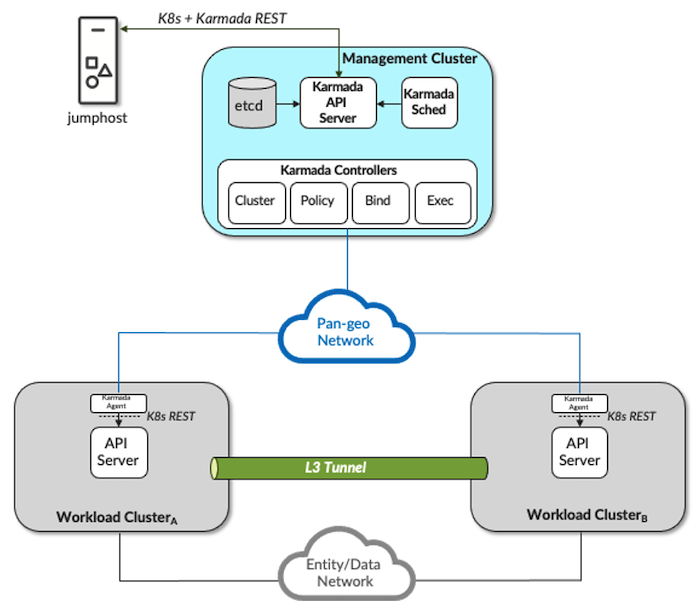
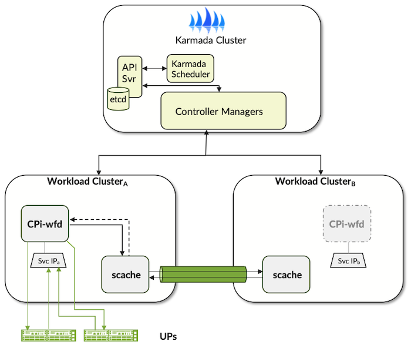

# BNG CUPS Controller and Geographical Redundancy

**Horia Miclea - 03/02/2025**

Juniper BNG CUPS (Control and User Plane Separation) Architecture supports the Broadband Forum TR-459 Issue 2 and 3 use cases. This blog announces the CUPS Controller deployment options, specifically the new development for geographical redundancy. This use case improves the CUPS solution's availability in case of data-center failures.

## Introduction

As the long-time global leader in BNG technology, Juniper Networks is leading the industry in bringing new broadband innovations to service providers. In the past year, we've expanded and enhanced the Juniper Networks(R) [MX Series Universal Routers](https://www.juniper.net/us/en/products/routers/mx-series.html) and [ACX Series Universal Metro Routers](https://www.juniper.net/us/en/products/routers/acx-series.html) to enable a more distributed IP/MPLS Access Network and the distribution of service edges closer to the subscriber.

The Juniper BNG CUPS solution is the next step in delivering both cloud agility and economics to service providers. Juniper BNG CUPS is among the industry's first architectures to bring the disaggregation vision defined in the Broadband Forum (BBF) TR-459 standard to real-world networks. In fact, Juniper played a leading role in developing the standard and is heavily involved in initiatives with BBF and others to define tomorrow's more disaggregated, converged, and cloudified CSP networks.

Through these efforts, Juniper is helping service providers around the world enable more flexible, intelligent broadband architectures. With solutions like Juniper BNG CUPS, CSPs can meet customers' ever-growing capacity and performance demands while transforming their network economics.

## Juniper BNG CUPS Architecture

Juniper BNG CUPS is one of the industry's first architectures to bring the disaggregation vision defined in BBF TR-459 to real-world networks. It is available and compliant with Broadband Forum TR459 Issue 2 and 3. It features two basic components:

- **Juniper BNG CUPS Controller**: This virtualized, cloud-native controller provides the full range of BNG control plane functions (subscriber session management, authentication and authorization, policy enforcement, and more), plus a session database (SDB) for network-wide subscriber state information, in a single, centralized solution. Juniper BNG CUPS controllers are highly available, microservices-based, Kubernetes-orchestrated cloud instances. They can be instantiated, scaled, and moved quickly and automatically, using the same mechanisms employed in the world's largest hyperscale clouds.
- **Juniper BNG User Planes**: Juniper offers BNG user plane functions on MX and ACX platform series, in multiple physical and virtual form factors, including smaller, streamlined platforms designed for distributed scale-out architectures. Operators can distribute these BNG user plane functions closer to subscribers while controlling them all centrally, with a single interface to back-office systems. BNG CUPS user planes can support DHCP IPoE dual stack (IPv4/IPv6), PPPoE PTA dual stack, and LAC sessions.



*Juniper BNG CUPS Overview Architecture*

## Juniper BNG CUPS Controller

Juniper BNG CUPS controller is a cloud application, running in a Kubernetes cluster that disaggregates and consolidates the control plane from multiple BNG user planes. It implements the BBF TR459 specifications including the interfaces defined and standardized there. It includes two major microservices: the Control Plane Instance (CPi) microservice that implements the control plane for a group of up to 32 BNG Ups and 512,000 dual-stack sessions (with the JUNOS 24.4R1 release), and the State Cache microservice that implements the database service for storing and synchronizing session state maintained by the CPi.  In the current release of the CUPS controller, a single CPi instance is supported. In a future release, by the end of 2025, multiple CPi instances will be possible, enabling a scale-out architecture for the controller up to 16 CPi instances, 5 million sessions, and 256 user planes.



The CUPS Controller communication with the BNG User Planes is based on two interfaces as defined by BBF TR459 Issue 2:

- Session Control Interface (SCi), based on PFCP (Packet Forwarding Control Interface), is DTLS protected and implements the User Plane node management and the BNG session management and control. In addition, it enables statistics reporting.
- Control Packet Redirect Interface (CPRi), based on GPRS Tunneling Protocol (GTP), is DTLS protected as well, tunnels the subscriber management control traffic (DHCP, PPPoE, L2TP), and provides neighbor discovery.

The BNG CUPS Controller application runs in the current release on an on-premises Kubernetes cluster in a single geography or in a multi-cluster setup for geographical redundancy. The Kubernetes nodes can be realized as bare metal servers or as VMs. These Kubernetes nodes can run as Linux systems: Ubuntu 22.04 LTS or later (for a BBE CloudSetup Kubernetes cluster) or Red Hat Enterprise Linux CoreOS (RHCOS) 4.15 or later (for an OpenShift Container Platform cluster). The APM cloud application manages the IP address pools for an entire broadband network and can be deployed in the same Kubernetes cluster or multi-cluster setup with the CUPS Controller if desired.

### Juniper BNG CUPS Controller Single Cluster, Geography

Juniper BNG CUPS Controller Kubernetes Cluster requires at least three hybrid master/worker nodes for availability. An additional node is required as a jump host for administration and management.

The minimum system requirements for the Kubernetes hybrid master/worker nodes are: 12 CPU cores with hyperthreading, 64 GB DRAM, and 512GB SSD. We recommend 16 CPU cores and 64GB RAM, especially if targeting the scale-out evolution in the future.
The minimum system requirements for the jump host node are: 2 CPU Cores, 8 GB RAM, and 128GB SSD.

For Ubuntu deployments, the BBE CloudSetup script will create a cluster formed by three combined control-plane/worker (hybrid) nodes.  If you are using instead a Red Hat OpenShift Container Platform cluster, you must have the OpenShift CLI installed on the jump host and create the Kubernetes Cluster using any of the RHOCP installation methods.

Please refer to the [Juniper BNG CUPS Installation Guide](https://www.juniper.net/documentation/us/en/software/bng-cups/cups-controller-installation-guide/bng-cups-install-migrate/topics/topic-map/cups-install.html) for additional details and instructions. The Juniper BNG CUPS utility can be used to install, upgrade, start, and validate the CUPS Controller, its Kubernetes cluster, and microservices. Here is an example of a successful installation with microservices running:

```
$ dbng status --context context-name --detail
MICROSERVICE   POD                             STATE      RESTARTS  UPTIME           NODE
cpi-exampl-1   cpi-exampl-1-pod-84cd94f6c5-wkp85 Running  0         0:00:19.887097   swwf-ilk46-s.juniper.net
scache         scache-pod-77d749dc6f-5h5ft       Running  0         0:03:41.887146   swwf-ilk46-s.juniper.net
Storage: Healthy
```



*BNG CUPS Controller Single Kubernetes Cluster/Geography Architecture*

### Juniper BNG CUPS Controller Multi-Cluster, Geographical Redundancy

BNG CUPS Controller Geographical Redundancy requires a multi-cluster Kubernetes architecture that can integrate into any cloud. Juniper decided to use open-source components like Karmada and Submariner, to enable this multi-cluster architecture. The multi-cluster architecture is anchored by a management cluster responsible for coordinating and scheduling work across its member or workload clusters.  The management cluster runs the Karmada control plane and the ECAV (Event Collection and Visualization) application optionally. The Karmada control-plane is responsible for presenting an augmented REST API (regular K8s API plus Karmada extensions) for querying and manipulating the state of API objects in the multi-cluster, installing state and scheduling workloads and monitoring the lifecycle of workload clusters through the Karmada controllers.



*Karmada Multi-Cluster Logical Architecture*

The Karmada control plane creates objects and schedules work (pods) on the workload clusters.  The workload clusters are presented as one "stretched" cluster to the applications that run on them using L3 tunneling and optionally a service mesh technology.  The internal cluster networks of the workload clusters are interconnected via Submariner open-source software.  The Submariner tunnel may use either VXLAN or IPSec encapsulation depending on whether inter-cluster communications are unencrypted or encrypted respectively.  The network may be an L2 or L3 network, so long as the latency between any pair of clusters is less than 100ms.

In much the same way that a Junos Virtual Chassis extends the concept of RE and line-card roles to a chassis level, a Karmada multi-cluster extends the concept of master and worker nodes to a cluster level.  The Karmada management cluster acts as a master node for each of the workload clusters acting as a worker node (or scheduling target).

The Karmada multi-cluster provides the basic infrastructure for each of the applications (APM and BNG CUPS Controller) to add support for geographic redundancy.  The ECAV (Event Collection and Visualization) application runs on the management cluster, being a management application.

A Karmada multi-cluster consists of:

- Management Cluster
- and up to two Workload Clusters.

We advise deploying each cluster in a different geographical location. The loss of Management Cluster impacts the scheduling across the Workload Clusters but does not impact the applications running in the Workload Clusters. The interface to the multi-cluster is through a jumphost which interfaces to the Management Cluster's REST interface. The Management Cluster is connected to the Workload clusters through a pan-geo network.

All clusters in the Karmada multi-cluster will be either RHOCP-based (with JUNOS 25.2R1) or RKE2-on-Ubuntu-based, which is available now, 24.4R1. They will run Kubernetes v1.28 or later, assuming a 3x hybrid nodes architecture like the Single Cluster.

The Management Cluster requires the following, software and hardware resources:

- At least 3 hybrid nodes
- Each node must have connectivity to the workload clusters and the jump host
- Cluster Services:
    - Container registry
    - Persistent storage class (container storage interface)
- Open-source software:
    - Karmada 1.9.0
    - Submariner 0.17.0
    - Kubernetes 1.28.6 or later
- A node is a Linux system (either virtual or physical system) that has a management address and a domain name. The hybrid nodes must meet the following requirements:
    - CPU---8 cores
    - Memory---32 GB
    - Storage---512 GB

In this release, two Workload Clusters are required, active and backup. The Workload Clusters require the following software and hardware resources:

- At least 3 hybrid nodes
- Each node must have connectivity to the other workload cluster, the management cluster, and the jump host
- Cluster Services:
    - Container registry
    - Persistent storage class (container storage interface)
    - Network load balancer with Layer 3 (L3) capability
- Open-source software:
    - Submariner 0.17.0
    - Kubernetes 1.28.6 or later
- A node is a Linux system (either virtual or physical system) that has a management address and a domain name. The hybrid nodes must meet the following requirements:
    - CPU---12 cores
    - Memory---64 GB
    - Storage---512 GB

We recommend 16 CPU cores if CUPS Controller is combined with APM and if targeting the CUPS Controller scale out evolution in the future.

The multi-cluster will have four distinct contexts: multi-cluster or Karmada context (this is the context that most BBE Utility scripts will target to orchestrate their geo-redundant applications), one context for each of the two workload clusters, and a separate context for the management cluster (applications that are not geo-redundant, e.g. BBE ECAV, can run on the management cluster). For example, the context output from the jump host might appear as:

```
$ kubectl config get-contexts
CURRENT   NAME                CLUSTER             AUTHINFO         NAMESPACE
          mgmt                mgmt                mgmt-admin   
*         swwf-jh-k5a         swwf-jh-k5a k       karmada-admin    
          wl-cluster-1        wl-cluster-1        k91-admin        
          wl-cluster-2        wl-cluster-2        k92-admin   
```

Please refer to the [Juniper BNG CUPS Installation Guide](https://www.juniper.net/documentation/us/en/software/bng-cups/cups-controller-installation-guide/bng-cups-install-migrate/topics/topic-map/cups-install.html) for additional details and instructions. The Juniper BNG CUPS utility can be used to install, upgrade, start, and validate the CUPS Controller, its Kubernetes multi-geography workload clusters, and microservices. Here is an example of a successful installation with microservices running:

```
$ dbng status --context karmada-context-name --detail
MICROSERVICE   WORKLOAD    CLUSTER                     POD STATE RESTARTS UPTIME           NODE
configserver   workload-1  configserver-workload-1-pod  Running   0       10:01:24.596559  swwf-il-k91-s.englab.juniper.net
configserver   workload-2  configserver-workload-2-pod  Running   0       10:01:40.596604  swwf-il-k92-s.englab.juniper.net
scache-1       workload-1  scache-1-pod-7ddfdc8857      Running   0       10:01:24.596627  swwf-il-k91-s.englab.juniper.net
scache-2       workload-2  scache-2-pod-6fd6b48954      Running   0       10:01:40.596647  swwf-il-k92-s.englab.juniper.net
cpi-example1   workload-1  cpi-example1-pod-7           Running   0       00:02:23.877720  swwf-il-k91-s.englab.juniper.net

Storage:
workload-1: Healthy
workload-2: Healthy
```

In the current JUNOS 24.4R1 release, the Workload Clusters enable active/standby geographical redundancy for the CUPS Controller. APM will be supported in the 3.4.0 release by mid-2025.



For the CUPS Controller, the state cache synchronizes session states across the workload clusters via the IP tunnel. The Control Plane Instance (CPi) runs normally in the primary Workload Cluster, as per the configuration done in the Karmada manager. In case of failure, the Karmada manager will start a new Control Plane Instance (CPi) in the backup Workload Cluster once it detects the failure of the primary cluster. This new CPi instance will recover the session state from the local instance of the state cache and will reconnect with the user planes. The user planes dissociate from the failed CPi and will accept the new association from the new CPi. The same multi-clustering procedure will apply to APM, meanwhile, support for APM comes in 3.4.0 by mid-2025. We expect the recovery time for CUPS Controller and APM to be resolved in a few minutes, and while user planes still function, the impact is minimal to none for the service.

When the failed Workload Cluster recovers, application micro-services are non-revertive.  The micro-services do not automatically switch back to their original Workload Cluster to reduce impact.  If the service provider operator wants to switch back to the recovered cluster, they would need to issue the graceful switchover command from the utility script provided by Juniper and preferably trigger it during a maintenance window.

### Juniper BNG CUPS Controller Activation

To enable the BNG CUPS solution, licenses are required for both the Juniper BNG CUPS Controller and the Juniper BNG User Planes associated with the Juniper BNG CUPS Controller. The MX Series devices used in the Juniper BNG CUPS solution also require their own separate licenses.

The baseline configuration for the CUPS Controller includes its identity and list of user planes. In addition, while the target architecture assumes a scaled-out set of multiple CPi instances, the configuration includes the list of CPi instances and the granular mapping for the user planes. Each user plane is associated with a profile defining the broadband service. An example is provided below but a detailed explanation is available in the user guide.

```
[edit]
groups {
    bbe-bng-director {
        bng-controller {
            bng-controller-name controller-1;
            user-planes {
                sample-up-1 {
                    transport {
                        inet 198.19.231.43;
                    }
                    dynamic-address-pools {
                        partition new-england;
                    }
                    user-plane-profile up-prof-1;
                }
            }
            control-plane-instances {
                cpi-boston {
                    control-plane-config-group bbe-common-0;
                    user-plane sample-up-1;
                }
            } 
        } 
   } 
   bbe-common-0 {
       # Subscriber-management configuration
        user-plane-profiles {
            up-prof-1 {}
        }
   }
}
```

The CUPS Controller initiates the connection to the User Planes. This simplifies the CUPS Controller geographical redundancy as described previously.

## References

Industry References

- [Global Market Data Forecast by ITU](https://www.researchgate.net/figure/Global-mobile-data-traffic-forecast-by-ITU-Overall-mobile-data-traffic-is-estimated-to_fig1_331159423)
- [Point Topic Global Broadband Subscribers in Q3 2023](https://www.point-topic.com/post/global-broadband-subscribers-q3-2023)
- [LightReading article on Broadband Forum BNG CUPS work ](https://www.lightreading.com/regulatory-politics/broadband-forum-unveils-bng-disaggregation-project)
- [BNG CUPS Introduction and Motivations (BBF Marketing Report)](https://www.broadband-forum.org/pdfs/mr-459-1-0-0.pdf)
- [Improving Service Resiliency with Disaggregated BNG (BBF Marketing Report)](https://www.broadband-forum.org/pdfs/mr-459.2-1-0-0.pdf)

Juniper and ACG Networks References:

- [Juniper BNG CUPS Architecture](https://juniper.github.io/techposts/juniper-bng-cups-architecture/article)
- [Juniper BNG CUPS Documentation](https://www.juniper.net/documentation/product/us/en/juniper-bng-cups/)
- [Juniper Address Pool Manager Documentation](https://www.juniper.net/documentation/product/us/en/address-pool-manager-apm/)
- [Juniper BNG CUPS Smart Load Balancing with High Availability](https://juniper.github.io/techposts/juniper-bng-cups-smart-load-balancing-with-ha/article)
- [Juniper BNG CUPS Address Pool Management](https://juniper.github.io/techposts/juniper-bng-cups-address-pool-management/article)
- [Juniper BNG CUPS Hitless User Plane Maintenance](https://juniper.github.io/techposts/juniper-bng-cups-hitless-user-plane-maintenance/article)
- [ACG -- Juniper TCO Benefit for Distributed Broadband with CUPS](https://juniper.highspot.com/items/63b607f251d3ea6ca3d4bb63)
- [Juniper MX series routers](https://www.juniper.net/us/en/products/routers/mx-series.html)
- [Juniper ACX 7100 and 7300 series routers](https://www.juniper.net/us/en/products/routers/acx-series.html)

## Glossary

- AAA: Authentication, Authorization, and Accounting
- APM: Address Pool Manager
- BBF (TR): BroadBand Forum (Technical Report)
- BNG:  Broadband Network Gateway
- CUPS: Control and User Plane Separation
- CPi: CUPS Controller Control Plane instance, microservice
- CSP: Content Service Provider
- DHCP: Dynamic Host Configuration Protocol
- DPI: Deep Packet Inspection
- PFCP: Packet Forwarding Control protocol
- PFE: Packet Forwarding Engine
- PMO: Present Mode of Operation
- PoP: Point of Presence
- PPPoE PTA: Point-to-Point Protocol over Ethernet / PPP Termination and Aggregation
- QoE: Quality of Experience
- QoS: Quality of Service / HQoS (Hierarchical QoS)
- RADIUS: Remote Authentication Dial-In User Service
- RE: Routing Engine
- SDB, State Cache: CUPS  Controller Session DataBase
- SGRP: Subscriber Group Redundancy Pools
- SLA: Service Level Agreement

## Acknowledgments

Many thanks to the engineering leads John Zeigler and Steve Onishi for their guidance, support, review, and for making these use cases a reality.
