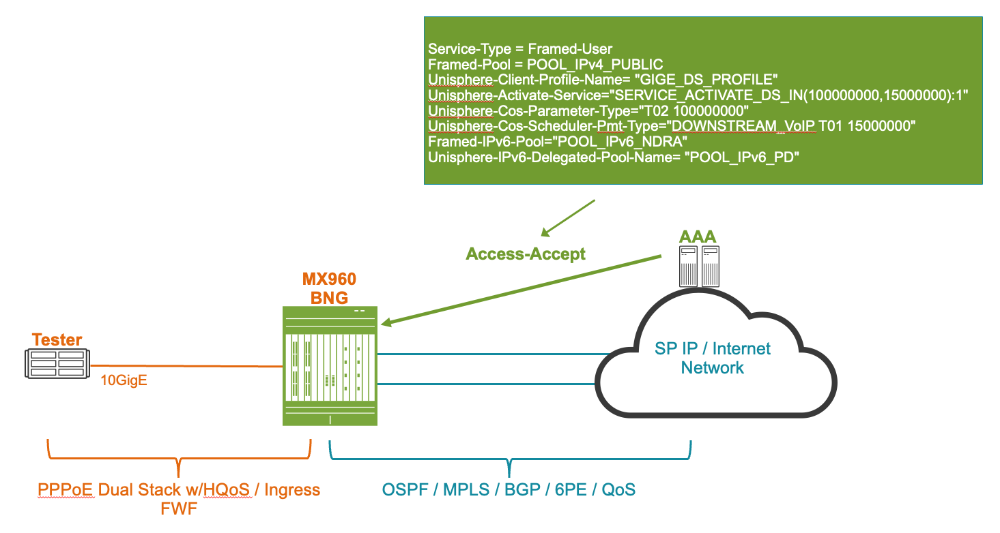
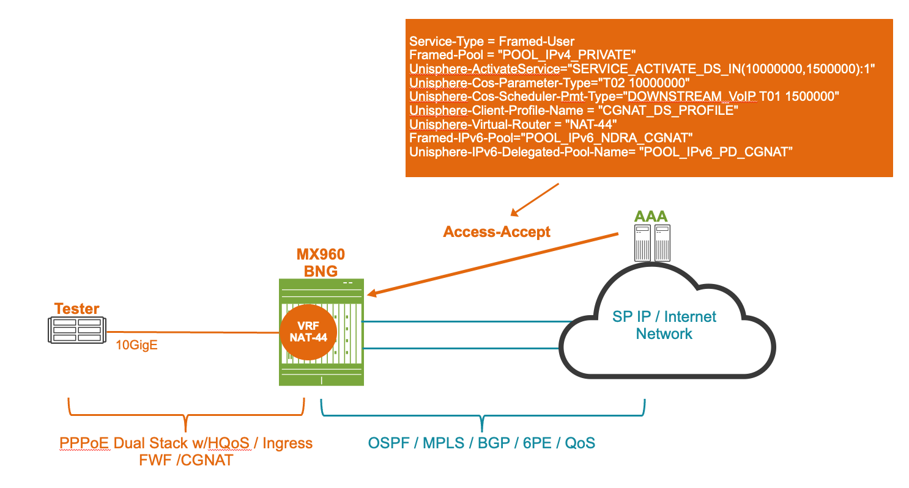

# BNG on MPC10E

**Ricardo Dominguez - 12/08/2023**

Starting in the 22.4R1 JUNOS release, MPC10E supports BNG subscriber access connections.

## Introduction

Both MPC10E line card versions support subscriber management. MPC10E-10C has 2 Trio-5 PFEs, supporting 32K Dual Stack subscribers per PFE, for a total of 64K Dual Stack subscribers. MPC10E-15C has 3 Trio-5 PFEs supporting 32K Dual Stack subscribers per PFE, for a total of 96K subscribers.

MPC10E supports both PPPoE and IPoE access methods along PWHT for PPPoE or IPoE, scalability is the same for any of these access methods.

Enabling HQoS, ingress/egress FW Filtering, or ingress/egress policing for subscriber access connections in any of the MPC10E line cards, doesn't impact subscriber scalability.

This tech post will explore the following BNG capabilities on MPC10E:

- Test Topology
- Hardware Used
- RADIUS Subscribers' Profiles
- Configuration
    - DS Subscribers
    - DS CGNAT Subscribers
- Verification
    - DS Subscribers
    - DS CGNAT Subscribers

We will show both DS subscribers and DS CGNAT subscribers in the same BNG, in other words, for CGNAT subscribers, BNG will perform DS subscriber termination plus CGNAT functionalities.

PPPoE is the broadband access method used in this tech post, NDRA for IPv6 WAN addressing, and DHCPv6 Prefix Delegation for IPv6 LAN addressing. IPoE could be used as an alternative access method and DHCPv6 IA_NA also as an alternative for WAN Addressing.

BNG+CGNAT with MPC10+SPC3 is supported starting in 23.1R1 release.

The test is based on MPC10E-10C using JUNOS 23.2R1 release and having 10GigE access connections, although we connect 16K DS subscribers in a single PFE, this is not a scalability report, it's target to demonstrate typical Dual Stack BNG functionalities on MPC10E.

## Test Topology

Our test topology consists of a Tester (Spirent Test Center) to emulate PPPoE Dual Stack subscribers, connected to xe-9/0/3:0 port on MPC10E, uplink interfaces, and RADIUS to provide AAA service for subscribers. The below figures show both a public IPv4 DS subscriber and DS CGNAT subscriber.





## Hardware Used

MX960 is acting as BNG, it includes 1 x MPC10E-10C for access and uplink connections, it also includes an SPC3 to perform CGNAT functions for BNG subscribers.

```
jnpr@MX960> show chassis hardware 
Hardware inventory:
Item             Version  Part number  Serial number     Description
Chassis                                JN1122462BGB      MX960
Midplane         REV 03   710-013698   TS4563            MX960 Backplane
Fan Extender     REV 02   710-018051   CABA5883          Extended Cable Manager
FPM Board        REV 03   710-014974   XE1257            Front Panel Display
PDM              Rev 03   740-013110   QCS124350BD       Power Distribution Module
PEM 2            Rev 02   740-063048   QCS2410V0AF       DC 4.1kW Power Entry Module
PEM 3            Rev 02   740-063048   QCS2410V0M2       DC 4.1kW Power Entry Module
Routing Engine 0 REV 05   750-072925   CAPD8855          RE-S-2X00x6
CB 0             REV 32   750-070866   CAPD7333          Enhanced MX SCB 3
CB 1             REV 32   750-070866   CAPC9612          Enhanced MX SCB 3
FPC 5            REV 31   750-073435   CANB4267          SPC3
  CPU                     BUILTIN      BUILTIN           SPC3 vCPP Broadwell
  PIC 0                   BUILTIN      BUILTIN           SPC3-PIC
  PIC 1                   BUILTIN      BUILTIN           SPC3-PIC 
FPC 9            REV 42   750-078633   CAPD7388          MPC10E 3D MRATE-10xQSFPP
  CPU            REV 20   750-072571   CAPE1525          FMPC PMB
  PIC 0                   BUILTIN      BUILTIN           MRATE-5xQSFPP
    Xcvr 3       REV 01   740-054050   INFAK0601128      QSFP+-4X10G-LR
  PIC 1                   BUILTIN      BUILTIN           MRATE-5xQSFPP
Fan Tray 0       REV 03   740-057995   DAAA3433          Enhanced Fan Tray
Fan Tray 1       REV 02   740-057995   DAAA2754          Enhanced Fan Tray

jnpr@MX960> show chassis hardware models 
Hardware inventory:
Item             Version  Part number  Serial number     FRU model number
Midplane         REV 03   710-013698   TS4563            CHAS-BP-MX960-S
Fan Extender     REV 02   710-018051   CABA5883          ECM-MX960
FPM Board        REV 03   710-014974   XE1257            CRAFT-MX960-S
PEM 2            Rev 02   740-063048   QCS2410V0AF       PWR-MX960-4100-DC-S
PEM 3            Rev 02   740-063048   QCS2410V0M2       PWR-MX960-4100-DC-S
Routing Engine 0 REV 05   750-072925   CAPD8855          RE-S-X6-128G-S-S
CB 0             REV 32   750-070866   CAPD7333          SCBE3-MX-S
CB 1             REV 32   750-070866   CAPC9612          SCBE3-MX-S
FPC 5            REV 31   750-073435   CANB4267          JNP-SPC3
  CPU                     BUILTIN      BUILTIN          
FPC 9            REV 42   750-078633   CAPD7388          MPC10E-10C-X
Fan Tray 0       REV 03   740-057995   DAAA3433          FFANTRAY-MX960-HC-S
Fan Tray 1       REV 02   740-057995   DAAA2754          FFANTRAY-MX960-HC-S
```

## RADIUS Subscribers' Profiles

The following RADIUS Profile is used for Public IPv4 DS subscribers.

```
Inte-Subsc          
Service-Type = Framed-User
Framed-Pool = POOL_IPv4_PUBLIC
Unisphere-Client-Profile-Name= "GIGE_DS_PROFILE"
Unisphere-Activate-Service="SERVICE_ACTIVATE_DS_IN(100000000,15000000):1"
Unisphere-Cos-Parameter-Type="T02 100000000"
Unisphere-Cos-Scheduler-Pmt-Type="DOWNSTREAM_VoIP T01 15000000"
Framed-IPv6-Pool="POOL_IPv6_NDRA"
Unisphere-IPv6-Delegated-Pool-Name= "POOL_IPv6_PD"
```

The Inte-Subsc is the username used for DS subscribers, RADIUS returns this profile to subscribers with the following RADIUS attributes:

- An IPv4 Pool configured on MX, this pool emulates public IPv4 addressing.
- The dynamic profile "GIGE_DS_POFILE" has parameters and variables for IPv4, IPv6, NDRA, and HQoS to be applied to the subscriber.
- A service activate "SERVICE_ACTIVATE_DS" dynamic profile to be applied to subscribers returns two values that correspond to two variables configured in this dynamic profile. In this way, the MX configuration is reduced, and the values are handled via AAA, which reduces time to market and human errors. This dynamic profile contains IPv4 and IPv6 ingress FWF with MF classifiers and policers.
- CoS parameter for egress shaping is applied to subscribers, same here, this reduces MX configuration, and downstream bandwidth per subscriber is handled from AAA reducing time to market and human errors.
- A scheduler transmit-rate value, reducing MX configuration, time to market, and human errors. This value is handled by AAA.
- IPv6 NDRA Pool configured on MX, this one is used for IPv6 WAN addressing.
- IPv6 PD Pool configured on MX and used for IPV6 LAN addressing.

The MX configuration for the above parameters is shown in the configuration section.

Below is displayed the RADIUS Profile for DS CGNAT subscribers.

```
CGNAT-Subsc          
Service-Type = Framed-User
Framed-Pool = "POOL_IPv4_PRIVATE"
Unisphere-Client-Profile-Name = "CGNAT_DS_PROFILE"
Unisphere-Activate-Service="SERVICE_ACTIVATE_DS_IN(10000000,1500000):1"
Unisphere-Cos-Parameter-Type="T02 10000000"
Unisphere-Cos-Scheduler-Pmt-Type="DOWNSTREAM_VoIP T01 1500000"
Unisphere-Virtual-Router = "NAT-44"
Framed-IPv6-Pool="POOL_IPv6_NDRA_CGNAT"
Unisphere-IPv6-Delegated-Pool-Name= "POOL_IPv6_PD_CGNAT"
```

The CGNAT-Subsc is the username used for DS CGNAT subscribers, RADIUS returns this profile to subscribers with the following RADIUS attributes:

- An IPv4 Pool configured on MX, this pool emulates private IPv4 addressing.
- The dynamic profile "GGNAT_DS_POFILE" that has parameters and variables for IPv4, IPV6, NDRA, HQoS, and a Routing-Instance to be applied to the subscriber.
- A service activate "SERVICE_ACTIVATE_DS" dynamic profile to be applied to subscribers returns two values that correspond to two variables configured in this dynamic profile. In this way, the MX configuration is reduced, and the values are handled via AAA, which reduces time to market and human errors. This dynamic profile contains IPv4 and IPV6 ingress FWF with MF classifiers and policers.
- CoS parameter for egress shaping is applied to subscribers, same here, this reduces MX configuration and downstream bandwidth per subscriber is handled from AAA reducing time to market and human errors.
- A scheduler transmit-rate value, reducing MX configuration, time to market, and human errors. This value is handled by AAA.
- The Routing-Instance name which the subscriber interface will be assigned.
- IPv6 NDRA Pool configured on MX, this one is used for IPv6 WAN addressing.
- IPv6 PD Pool configured on MX and used for IPV6 LAN addressing.

Again, MX configuration for the above parameters is shown in the configuration section.

## Configuration

In the following sections are shown the most relevant BNG configuration such as an access interface, IPv4 and IPv6 pools, and dynamics profiles. The DS CGNAT specific configuration is displayed in the DS CGNAT subscribers configuration.

Routing, MPLS, RADIUS, uplink interfaces, ALG, QoS along more generic configurations are omitted for brevity.

### Access Interface

MPC10E access interfaces xe-9/0/3:0 for PPPoE subscribers in displayed below, it will negotiate PPPoE parameters received over VLAN 1585 statically configured (N:1 access) based on "GIGE_DS_PROFILE" and RADIUS returned attributes.

```
interfaces {
    xe-9/0/3:0 {
        description "SPIRENT_CONNECTION";
        hierarchical-scheduler maximum-hierarchy-levels 2;
        vlan-tagging;
        mtu 2014;
        unit 1585 {
            encapsulation ppp-over-ether;
            vlan-id 1585;                  
            pppoe-underlying-options {
                duplicate-protection;
                dynamic-profile GIGE_DS_PROFILE;
                max-sessions 16000;
                short-cycle-protection {
                    lockout-time-min 60;
                    lockout-time-max 240;
                }
            }
        }
    }
}
```

### DHCPv6 Local Server

For IPv6 LAN addressing, we use local DHCPv6 server in our testing scenario, the configuration is shown below, this includes de IPv6 PD pool along with accepting DHCPv6 over PPP interfaces. DHCPv6 Relay configuration is also supported.

IPv6 LAN addressing is negotiated via DHCPv6 PD. IPv6 WAN addressing is negotiated either via NDRA or DHCPv6 IA_NA.

```
system {
    services {
        dhcp-local-server {
            dhcpv6 {
                overrides {
                    interface-client-limit 1;
                    delegated-pool POOL_IPv6_PD;
                }
                group PPPoE {
                    interface pp0.0;
                }
            }
        }
    }
}
```

### Dynamic Profile

PPPoE "GIGE_DS_PROFILE" configuration is displayed below, this profile allows PPP parameters, IPv4, IPv6 NDRA, and IPv6 LAN negotiation. It also includes egress HQoS parameters assignment to a subscriber such as a shaping rate (subscriber downstream bandwidth) and schedulers for a different kinds of traffic treatment as shown in this dynamic profile configuration.

Subscriber downstream bandwidth is returned by RADIUS in the Access-Accept message according to the subscriber bandwidth profile acquired. The transmit rate value for the "DOWNSTREAM_VoIP" scheduler is also returned by RADIUS, based on the subscriber profile acquired.

Using JUNOS variables in dynamic profiles allows:

- Reduce MX configuration.
- A central place to modify values.
- Expedite go to market for any downstream or upstream bandwidth profile modification.
- Reduce human errors.
- It also allows to assign a default value to a variable If RADIUS is not configured correctly.

```
dynamic-profiles {
    GIGE_DS_PROFILE {
        predefined-variable-defaults {
            cos-scheduler-tx rate 512k;
            cos-shaping-rate 5120000;
        }
        interfaces {
            pp0 {
                unit "$junos-interface-unit" {
                    ppp-options {
                        pap;
                    }
                    pppoe-options {
                        underlying-interface "$junos-underlying-interface";
                        server;
                    }
                    keepalives interval 30;
                    family inet {
                        rpf-check;
                        unnumbered-address "$junos-loopback-interface";
                    }
                    family inet6 {
                        rpf-check;
                        unnumbered-address "$junos-loopback-interface";
                    }
                }
            }
        }
        protocols {
            router-advertisement {
                interface "$junos-interface-name" {
                    other-stateful-configuration;
                    prefix $junos-ipv6-ndra-prefix;
                }
            }
        }
        class-of-service {
            traffic-control-profiles {
                PROFILE_DOWNSTREAM {
                    scheduler-map DOWNSTREAM;
                    shaping-rate "$junos-cos-shaping-rate";
                }
            }
            interfaces {
                pp0 {
                    unit "$junos-interface-unit" {
                        output-traffic-control-profile PROFILE_DOWNSTREAM;
                    }
                }
            }
            scheduler-maps {
                DOWNSTREAM {
                    forwarding-class AF2X scheduler DOWNSTREAM_AF2X;
                    forwarding-class AF3X scheduler DOWNSTREAM_AF3X;
                    forwarding-class VoIP scheduler DOWNSTREAM_VoIP;
                    forwarding-class best-effort scheduler DOWNSTREAM_BEST_EFFORT;
                    forwarding-class network-control scheduler NETWORK_CONTROL;
                }
            }
            schedulers {
                DOWNSTREAM_BEST_EFFORT {
                    transmit-rate percent 20;
                    priority low;
                }
                DOWNSTREAM_AF2X {
                    transmit-rate percent 25;
                    priority medium-low;
                }
                DOWNSTREAM_AF3X {
                    transmit-rate percent 30;
                    priority high;
                }
                DOWNSTREAM_VoIP {
                    transmit-rate {
                        "$junos-cos-scheduler-tx";
                        rate-limit;
                    }
                    priority strict-high;
                }
                NETWORK_CONTROL {
                    transmit-rate percent 5;
                    priority high;
                }
            }
        }
    }
}
```

### Service Profile

Service Activate "SERVICE_ACTIVATE_DS_IN" dynamic profile is used to assign upstream parameters to a subscriber such as upstream policer for upstream subscriber bandwidth, and MF classifier to assign a specific forwarding-class for traffic treatment accordingly.

Subscriber upstream bandwidth is returned by RADIUS in the Access-Accept message according to the subscriber bandwidth profile acquired. RADIUS service activate VSA allows a dynamic profile to be assigned to a subscriber for different use cases, in our example RADIUS instructs MX to activate the "SERVICE_ACTIVATE_DS_IN" dynamic profile, this one is used for upstream purposes.

Service Activate Profiles can be attached during session setup via a service activation in the access-accept and it can be attached via CoA. It is possible to dynamically add/remove one or more service profiles via CoA.

The variable used in this dynamic profile allows:

- Upstream subscriber bandwidth.
- VoIP upstream bandwidth.
- Upstream Policer Burst is calculated dynamically based on upstream subscriber bandwidth, reducing MX configuration and human errors.
- A logical interface hierarchical policer to limit Premium (VoIP) traffic and aggregate traffic.
- IPv4 MF classifier.
- IPV6 MF classifier.

```
dynamic-profiles {
    SERVICE_ACTIVATE_DS_IN {
        variables {
            inBW;
            voiceBW;
            burstPolicer equals "$inBW * 0.125";
            policer uid;
            UPSTREAM_IN uid;
            UPSTREAM_IN_v6 uid;
        }
        interfaces {
            pp0 {
                unit "$junos-interface-unit" {
                    family inet {
                        filter {
                            input "$UPSTREAM_IN";
                        }
                    }
                    family inet6 {
                        filter {
                            input "$UPSTREAM_IN_v6";
                        }
                    }
                }
            }
        }
        firewall {
            family inet {
                filter "$UPSTREAM_IN" {
                    interface-specific;
                    term 1 {
                        from {
                            dscp ef;
                        }
                        then {
                            hierarchical-policer "$policer";
                            count VoIP_ACCEPT;
                            forwarding-class VoIP;
                            accept;
                        }
                    }
                    term 2 {
                        from {
                            dscp [ af33 af32 af31 ];
                        }
                        then {
                            hierarchical-policer "$policer";
                            forwarding-class AF3X;
                            accept;
                        }
                    }
                    term 3 {
                        from {
                            dscp [ af23 af22 af21 ];
                        }
                        then {
                            hierarchical-policer "$policer";
                            forwarding-class AF2X;
                            accept;
                        }
                    }
                    term 4 {
                        then {
                            hierarchical-policer "$policer";
                            forwarding-class best-effort;
                            accept;
                        }
                    }
                }
            }
            family inet6 {
                filter "$UPSTREAM_IN_v6" {
                    interface-specific;
                    term 1 {
                        from {
                            traffic-class ef;
                        }
                        then {
                            hierarchical-policer "$policer";
                            count VoIP_IPV6_ACCEPT;
                            forwarding-class VoIP;
                            accept;
                        }
                    }
                    term 2 {
                        from {
                            traffic-class [ af33 af32 af31 ];
                        }
                        then {
                            hierarchical-policer "$policer";
                            forwarding-class AF3X;
                            accept;
                        }
                    }
                    term 3 {
                        from {
                            traffic-class [ af23 af22 af21 ];
                        }
                        then {
                            hierarchical-policer "$policer";
                            forwarding-class AF2X;
                            accept;
                        }
                    }
                    term 4 {
                        then {
                            hierarchical-policer "$policer";
                            forwarding-class best-effort;
                            accept;
                        }
                    }
                }
            }
            hierarchical-policer "$policer" {
                logical-interface-policer;
                aggregate {
                    if-exceeding {
                        bandwidth-limit "$inBW";
                        burst-size-limit "$burstPolicer";
                    }
                    then {
                        discard;
                    }
                }
                premium {
                    if-exceeding {
                        bandwidth-limit "$voiceBW";
                        burst-size-limit 9216;
                    }
                    then {
                        discard;
                    }
                }
            }
        }
    }
}
```

Having both "GIGE_DS_PROFILE" and "SERVICE_ACTIVATE_DS_IN" dynamic profiles allows MX to limit subscriber downstream and upstream traffic based on  downstream and upstream values returned by RADIUS according to the subscriber profile acquired.

### IPv4 and IPv6 Pools

IPv4, IPv6 PD (LAN addressing), and IPv6 NDRA (WAN addressing) pools for a DS subscriber are displayed below. These pools allow IPv4 addresses and IPv6 prefixes assignment to a subscriber. It also assigns IPv4 and IPv6 DNS to a subscriber.

```
access {
    address-assignment {
        high-utilization 85;
        abated-utilization 75;
        pool POOL_IPv4_PUBLIC {
            family inet {
                network 172.20.1.0/16;
                range 1 {
                    low 172.20.0.0;
                    high 172.20.255.255;
                }
                xauth-attributes {
                    primary-dns 8.8.8.8/32;
                    secondary-dns 8.8.4.4/32;
                }
            }
        }
        pool POOL_IPv6_PD {
            family inet6 {
                prefix 2222::/48;
                range r1 prefix-length 64;
                dhcp-attributes {
                    maximum-lease-time 86400;
                    dns-server {
                        2001:4860:4860::8888;
                    }
                }
            }
        }
        pool POOL_IPv6_NDRA {
            family inet6 {
                prefix fdff:fffe::/48;
                range r1 prefix-length 64;
                dhcp-attributes {
                    maximum-lease-time 86400;
                }
            }
        }
    }
}
```

### DS CGNAT Subscribers Configuration

This section describes specific CGNAT configurations for a DS subscriber.

### CGNAT Service Interface

The multiservice interface allows traffic to be NATed in ingress and egress traffic direction. This interface has 2 legs, one to the private network (inside) and one to the public network (outside), the inside multiservice interface is in charge of sending traffic to the Juniper MX SPC3 service card, so traffic can be translated, this interface is assigned to a routing-instance. These interfaces are numbered according to the slot in which SPC3 is inserted, PIC0 represents SPC3 NPU0 and PIC1 represents SPC3 NPU1, the port number is always 0.

```
interfaces {
    vms-5/0/0 {
        unit 1 {
            family inet;
            service-domain inside;
        }
        unit 2 {
            family inet;
            service-domain outside;
        }
    }
}
```

### CGNAT Dynamic Profile

PPPoE "GGNAT_DS_PROFILE" is assigned to the subscriber by RADIUS during the subscriber's authentication. If the subscriber is a CGNAT subscriber, RADIUS will return another dynamic profile than the one assigned to the MPC10E access interface, because to CGNAT dynamic profile needs to assign the subscriber to a routing-instance which in our example is specified by RADIUS in the access-accept attributes returned to subscriber.

Routing redirect can be achieved in three ways: RADIUS returned Unisphere-Virtual-Router VSA, predefined-variable in the dynamic-profile and access domain-map target-routing-instance.

"CGNAT_DS_PROFILE" dynamic profile configuration is almost identical to the one described in the dynamic profile configuration section. The difference is that the "CGNAT_DS_PROFILE" dynamic profile includes a routing-instance to which the subscriber will be assigned.

```
dynamic-profiles {
    CGNAT_DS_PROFILE {
        predefined-variable-defaults {
            cos-scheduler-tx rate 512k;
            cos-shaping-rate 5120000;
        }
        routing-instances {
            "$junos-routing-instance" {
                interface "$junos-interface-name";
            }
        }
        interfaces {
            pp0 {
                unit "$junos-interface-unit" {
                    ppp-options {
                        pap;
                    }
                    pppoe-options {
                        underlying-interface "$junos-underlying-interface";
                        server;
                    }
                    keepalives interval 30;
                    family inet {
                        rpf-check;
                        unnumbered-address lo0.1;
                    }
                    family inet6 {
                        rpf-check;
                        address $junos-ipv6-address;
                    }
                }
            }
        }
        protocols {
            router-advertisement {
                interface "$junos-interface-name" {
                    other-stateful-configuration;
                    prefix $junos-ipv6-ndra-prefix;
                }
            }
        }
        class-of-service {
            traffic-control-profiles {
                PROFILE_DOWNSTREAM {
                    scheduler-map DOWNSTREAM;
                    shaping-rate "$junos-cos-shaping-rate";
                }
            }
            interfaces {
                pp0 {
                    unit "$junos-interface-unit" {
                        output-traffic-control-profile PROFILE_DOWNSTREAM;
                    }
                }
            }
            scheduler-maps {
                DOWNSTREAM {
                    forwarding-class AF2X scheduler DOWNSTREAM_AF2X;
                    forwarding-class AF3X scheduler DOWNSTREAM_AF3X;
                    forwarding-class VoIP scheduler DOWNSTREAM_VoIP;
                    forwarding-class best-effort scheduler DOWNSTREAM_BEST_EFFORT;
                    forwarding-class network-control scheduler NETWORK_CONTROL;
                }
            }
            schedulers {
                DOWNSTREAM_BEST_EFFORT {
                    transmit-rate percent 20;
                    priority low;
                }
                DOWNSTREAM_AF2X {
                    transmit-rate percent 25;
                    priority medium-low;
                }
                DOWNSTREAM_AF3X {
                    transmit-rate percent 30;
                    priority high;
                }
                DOWNSTREAM_VoIP {
                    transmit-rate {
                        "$junos-cos-scheduler-tx";
                        rate-limit;
                    }
                    priority strict-high;
                }
                NETWORK_CONTROL {
                    transmit-rate percent 5;
                    priority high;
                }
            }
        }
    }
}
```

### CGNAT Routing Instance

DS CGNAT subscriber is assigned to a CGNAT routing instance, we're using a VRF routing-instance in our example, a virtual-router routing-instance can also be used

The CGNAT routing-instance name is specified by RADIUS in the access-accept attributes returned to the subscriber.

This CGNAT routing-instance includes the DHCPv6 server configuration used for IPv6 PD assignment (LAN addressing) as described in the DHCPv6 Local Server configuration section. It also includes IPv4 private, IPv6 PD (LAN addressing), and IPv6 NDRA (WAN addressing) pools for a DS CGNAT subscriber. These pools allow IPv4 private address and IPv6 prefix assignment to a DS CGNAT subscriber. It also assigns IPv4 and IPv6 DNS to a DS CGNAT subscriber.

In our example, DS CGNAT subscriber's traffic is sent to virtual-router (PIC0) via a forwarding-options input filter. The inside multiservice interface is assigned to a virtual-router, this is used to send traffic to the corresponding multiservice interface in the next-hop CGNAT solution.

```
routing-instances {
    NAT-44 {
        instance-type vrf;
        system {
            services {
                dhcp-local-server {
                    dhcpv6 {
                        overrides {
                            interface-client-limit 1;
                            delegated-pool POOL_IPv6_PD_CGNAT;
                        }
                        group PPPoE {
                            interface pp0.0;
                        }
                    }
                }
            }
        }
        access {
            address-assignment {
                high-utilization 85;
                abated-utilization 75;
                pool POOL_IPv4_PRIVATE {
                    family inet {
                        network 172.29.0.0/16;
                        range 1 {
                            low 172.29.0.0;
                            high 172.29.247.255;
                        }
                        xauth-attributes {
                            primary-dns 8.8.8.8/32;
                            secondary-dns 8.8.4.4/32;
                        }
                    }
                }
                pool POOL_IPv6_PD_CGNAT {
                    family inet6 {
                        prefix 2223::/48;
                        range r1 prefix-length 64;
                        dhcp-attributes {
                            maximum-lease-time 86400;
                            dns-server {
                                2001:4860:4860::8888;
                            }
                        }
                    }
                }
                pool POOL_IPv6_NDRA_CGNAT {
                    family inet6 {
                        prefix fdff:ffff::/48;
                        range r1 prefix-length 64;
                        dhcp-attributes {
                            maximum-lease-time 86400;
                        }
                    }
                }
            }
        }
        forwarding-options {
            family inet {
                filter {
                    input FILTER_TO_CGNAT;
                }
            }
        }
        route-distinguisher 192.168.0.1:13;
        vrf-target import target:65500:13;
        vrf-table-label;
    }
    PIC0 {
        instance-type virtual-router;
        routing-options {
            static {
                route 0.0.0.0/0 next-hop vms-5/0/0.1;
                route 172.29.0.0/16 next-table NAT-44.inet.0;
            }
        }
        interface vms-5/0/0.1;
    }
}
```

Default route redirects traffic to inside multiservice interface, so traffic can be NATed. Static route 172.29/16 sends traffic to NAT-44 routing-instance which subscriber resides.

### Deterministic CGNAT Translation

CGNAT specific configuration includes a service-set which is the main CGNAT building block, it groups the inside and outside multiservice interfaces along the NAT rule, this is where the translation takes place. The packets toward the inside multiservice interface are translated based on the NAT rule defined under this service-set.

Having a next-hop style service represents an inside multiservice interface (private network addressing) and an outside multiservice interface (public network addressing).

A firewall rule is needed for the service-set, this firewall rule can accept everything as displayed below or can do firewalling based on specific requirements.

The NAT rule identifies the source private addressing and based on the source addressing along the ALGs does the source NAT, it calls a pool in the source NAT action. A NAT rule is defined under a NAT rule-set, the NAT rule-set can have multiple NAT rules.

An address-book contains address ranges, and private source addressing is defined under these ranges.

Application Layer Gateways allows applications to work within NAT, Junos includes rich ALGs for NAT such as FTP, DNS, H323, ICMP, SIP, PPTP, SNMP, TFTP, etc. Most applications have evolved to function in an IPv4 NAT, working in the application layer.

The NAT pool contains the public IPv4 address to which private addressing will be translated, and the ports range available per public IPv4 address, if PBA or Deterministic NAT is used, it then also includes the port block-size and the IPv4 private addressing.

```
services {
    service-set SLOT5_PIC0 {
        stateful-firewall-rules ALLOW-ALL;
        nat-rule-sets CGNAT_PIC0_SET;
        next-hop-service {
            inside-service-interface vms-5/0/0.1;
            outside-service-interface vms-5/0/0.2;
        }
    }
    nat {
        source {
            pool CGNAT_PIC0_POOL {
                address {
                    179.159.4.16/32 to 179.159.7.255/32;
                    200.100.106.200/32 to 200.100.106.215/32;
                }
                port {
                    range {
                        2048;
                        to {
                            65535;
                        }
                    }
                    deterministic {
                        block-size 2048;
                        host address-name RANGE_1;
                        include-boundary-addresses;
                    }
                }
                ei-mapping-timeout 120;
                mapping-timeout 120;
            }
            rule-set CGNAT_PIC0_SET {
                rule CGNAT_PIC0_RULE {
                    match {
                        source-address-name RANGE_1;
                        application APPS;
                    }
                    then {
                        source-nat {
                            pool {
                                CGNAT_PIC0_POOL;
                            }
                        }
                    }
                }
                match-direction input;
            }
        }
    }
    policies {
        stateful-firewall-rule ALLOW-ALL {
            match-direction input;
            policy ACCEPT {
                match {
                    source-address any;
                    destination-address any;
                    application any;
                }
                then {
                    permit;
                }
            }
        }
    }
    address-book {
        global {
            address RANGE_1 {
                address-range 172.29.0.0/32 {
                    to {
                        172.29.123.255/32;
                    }
                }
            }
        }
    }
}
```

## Verification

MX BNG DS subscribers and DS CGNAT subscriber's connections on MPC10E are shown through the following commands,

Specific DS subscribers and DS CGNAT verification sections are displayed following the current section.

16K PPPoE sessions are connected on the MPC10E xe-9/0/3:0 port. Of these 16K subscribers, 8K are for DS subscribers and 8K for DS CGNAT subscribers.

As subscribers are DS, 16K DHCP, and 16K PPPoE sessions are established.

```
jnpr@MX960> show subscribers summary port 

Interface           Count               
xe-9/0/3:0          16000              

Total Subscribers: 16000


jnpr@MX960> show subscribers summary 

Subscribers by State
   Active: 32000
   Total: 32000

Subscribers by Client Type
   DHCP: 16000
   PPPoE: 16000
   Total: 32000
```

DS and DS CGNAT subscribers are shown below. DS subscribers are assigned to the default routing-instance, and DS CGNAT subscribers are assigned to the NAT-44 routing-instance.

Each subscriber has a unique dynamic PPPoE interface, an IPv4 address representing either a Public or Private IPv4, an Internet IPv6 PD (LAN addressing) pefix, and a private IPv6 prefix for WAN addressing.

The IPv4 172.20/16 prefix represents public addressing, while the IPv4 172.29/16 prefix represents private addressing.

IPv6 prefixes 2222::/64 and 2223::/64 represent Internet IPv6 prefixes.

IPv6 prefixes fdff:fffe::/64 and fdff:ffff::/64 represent private IPv6 prefixes.

Inte-Subsc username is used for 8K DS subscribers, and the CGNAT-Subsc username is used for 8K DS CGNAT subscribers.

```
jnpr@MX960> show subscribers 
Interface                       IP Address/VLAN ID                      User Name                      LS:RI
pp0.3221225483                  172.29.0.3                              CGNAT-Subsc               default:NAT-44       
*                               2223::/64
*                               fdff:ffff:0:3::/64
pp0.3221225485                  172.29.0.4                              CGNAT-Subsc               default:NAT-44       
*                               2223:0:0:1::/64
*                               fdff:ffff:0:4::/64
pp0.3221225489                  172.29.0.5                              CGNAT-Subsc               default:NAT-44       
*                               2223:0:0:2::/64
*                               fdff:ffff:0:5::/64
pp0.3221225494                  172.20.0.1                              Inte-Subsc                default:default      
*                               2222:0:0:1::/64
*                               fdff:fffe:0:8::/64
pp0.3221225492                  172.20.0.0                              Inte-Subsc                default:default      
*                               2222::/64
*                               fdff:fffe:0:7::/64
pp0.3221225493                  172.29.0.6                              CGNAT-Subsc               default:NAT-44       
*                               2223:0:0:3::/64
*                               fdff:ffff:0:6::/64
```

16K PPPoE sessions have been established, and PPPoE messages have been exchanged.

```
jnpr@MX960> show pppoe statistics 
Active PPPoE sessions: 16000
  PacketType                       Sent         Received
    PADI                              0            16000
    PADO                          16000                0
    PADR                              0            16000
    PADS                          16000                0
    PADT                              0                0
    Service name error                0                0
    AC system error                   0                0
    Generic error                     0                0
    Malformed packets                 0                0
    Unknown packets                   0                0

jnpr@MX960> show pppoe sessions 
Interface       Underlying            State       Session    Remote                                  
                interface                         ID         MAC
pp0.3221225483  xe-9/0/3:0.1585       Session Up  1          DC:8D:B7:00:00:00  

pp0.3221225485  xe-9/0/3:0.1585       Session Up  2          DC:8D:B7:00:00:01  

pp0.3221225489  xe-9/0/3:0.1585       Session Up  3          DC:8D:B7:00:00:02  

pp0.3221225493  xe-9/0/3:0.1585       Session Up  4          DC:8D:B7:00:00:03  

pp0.3221225497  xe-9/0/3:0.1585       Session Up  5          DC:8D:B7:00:00:04

jnpr@MX960> show pppoe underlying-interfaces xe-9/0/3:0.1585 extensive 
xe-9/0/3:0.1585 Index 539
  State: Static, Dynamic Profile: GIGE_DS_PROFILE, 
  Max Sessions: 16000, Max Sessions VSA Ignore: Off, 
  Active Sessions: 16000, 
  Service Name Table: None, 
  Duplicate Protection: On, Short Cycle Protection: mac-address, 
  Direct Connect: Off, 
  AC Name: MX960, 
  PacketType                       Sent         Received
    PADI                              0            16000
    PADO                          16000                0
    PADR                              0            16000
    PADS                          16000                0
    PADT                              0                0
    Service name error                0                0
    AC system error                   0                0
    Generic error                     0                0
    Malformed packets                 0                0
    Unknown packets                   0                0
  Lockout Time (sec):  Min: 60, Max: 240
    Total clients in lockout: 0
    Total clients in lockout grace period: 0
```

NDRA packets per PPPoE interface are exchanged for both DS and DS GNAT subscribers, and NDRA is used for IPv6 WAN Addressing.

```
jnpr@MX960> show ipv6 router-advertisement 
Interface: pp0.3221225483
  Advertisements sent: 9, last sent 0:08:22 ago
  Solicits received: 1, last received 1:02:28 ago
  Advertisements received: 0
Interface: pp0.3221225484
  Advertisements sent: 9, last sent 0:08:22 ago
  Solicits received: 1, last received 1:02:28 ago
  Advertisements received: 0
Interface: pp0.3221225485
  Advertisements sent: 9, last sent 0:08:22 ago
  Solicits received: 1, last received 1:02:28 ago
  Advertisements received: 0
Interface: pp0.3221225486
  Advertisements sent: 9, last sent 0:08:22 ago
  Solicits received: 1, last received 1:02:28 ago
  Advertisements received: 0
```

All subscribers have a shaping rate and a service activate assigned via RADIUS. Each subscriber also has an IPv4 and IPv6 input FWF.

```
jnpr@MX960> show subscribers extensive | match "junos-cos-shaping-rate:" | count 

Count: 16000 lines

jnpr@MX960> show subscribers extensive | match SERVICE_ACTIVATE_DS_IN | count 

Count: 16000 lines

jnpr@MX960> show subscribers extensive | match "IPv4 Input Filter Name: UPSTREAM_IN" | count 

Count: 16000 lines

jnpr@MX960> show subscribers extensive | match "IPv6 Input Filter Name: UPSTREAM_IN_v6" | count 

Count: 16000 lines

jnpr@MX960> show firewall templates-in-use 
                  Dynamic Subscribers Reference Counts
Filter Template                                         Reference Count
----------------                                        ----------------
UPSTREAM_IN_UID1008                                     16000             
UPSTREAM_IN_v6_UID1009                                  16000
```

### DS Subscribers Verification

8K DS subscribers are connected in the default routing-instance through the MPC10E xe-9/0/3:0 port.

As subscribers are DS, 8K DHCP and 8K PPPoE sessions are established.

```
jnpr@MX960> show subscribers summary routing-instance default 

Subscribers by State
   Active: 16000
   Total: 16000

Subscribers by Client Type
   DHCP: 8000
   PPPoE: 8000
   Total: 16000

Subscribers by LS:RI
   default:default: 16000
   Total: 16000
```

DHCPv6 PD (IPv6 LAN addressing) sessions are bound for each PPPoE subscriber.

```
jnpr@MX960> show dhcpv6 server binding routing-instance default 
Prefix                  Session Id  Expires  State    Interface    Client DUID
2222::/64               74069       84036    BOUND    pp0.3221225492 LL_TIME0x1-0x838aa9-ac:b6:87:00:00:00
2222:0:0:4::/64         74073       84036    BOUND    pp0.3221225495 LL_TIME0x1-0x838aa9-ac:b6:87:00:00:01
2222:0:0:5::/64         74075       84036    BOUND    pp0.3221225499 LL_TIME0x1-0x838aa9-ac:b6:87:00:00:02
2222:0:0:7::/64         74077       84036    BOUND    pp0.3221225502 LL_TIME0x1-0x838aa9-ac:b6:87:00:00:03
2222:0:0:9::/64         74080       84036    BOUND    pp0.3221225505 LL_TIME0x1-0x838aa9-ac:b6:87:00:00:04
2222:0:0:b::/64         74084       84036    BOUND    pp0.3221225508 LL_TIME0x1-0x838aa9-ac:b6:87:00:00:05
2222:0:0:d::/64         74086       84036    BOUND    pp0.3221225511 LL_TIME0x1-0x838aa9-ac:b6:87:00:00:06
2222:0:0:f::/64         74091       84036    BOUND    pp0.3221225514 LL_TIME0x1-0x838aa9-ac:b6:87:00:00:07
2222:0:0:11::/64        74093       84036    BOUND    pp0.3221225517 LL_TIME0x1-0x838aa9-ac:b6:87:00:00:08
2222:0:0:12::/64        74096       84036    BOUND    pp0.3221225520 LL_TIME0x1-0x838aa9-ac:b6:87:00:00:09
2222:0:0:16::/64        74099       84038    BOUND    pp0.3221225523 LL_TIME0x1-0x838aa9-ac:b6:87:00:00:0a
2222:0:0:17::/64        74105       84038    BOUND    pp0.3221225526 LL_TIME0x1-0x838aa9-ac:b6:87:00:00:0b
2222:0:0:1e::/64        74106       84038    BOUND    pp0.3221225528 LL_TIME0x1-0x838aa9-ac:b6:87:00:00:0c
2222:0:0:20::/64        74109       84038    BOUND    pp0.3221225531 LL_TIME0x1-0x838aa9-ac:b6:87:00:00:0d
2222:0:0:21::/64        74111       84038    BOUND    pp0.3221225532 LL_TIME0x1-0x838aa9-ac:b6:87:00:00:0e
2222:0:0:22::/64        74114       84038    BOUND    pp0.3221225538 LL_TIME0x1-0x838aa9-ac:b6:87:00:00:0f
2222:0:0:24::/64        74117       84038    BOUND    pp0.3221225549 LL_TIME0x1-0x838aa9-ac:b6:87:00:00:10
2222:0:0:25::/64        74121       84039    BOUND    pp0.3221225550 LL_TIME0x1-0x838aa9-ac:b6:87:00:00:11
2222:0:0:26::/64        74124       84039    BOUND    pp0.3221225551 LL_TIME0x1-0x838aa9-ac:b6:87:00:00:12
2222:0:0:28::/64        74127       84039    BOUND    pp0.3221225552 LL_TIME0x1-0x838aa9-ac:b6:87:00:00:13
2222:0:0:2a::/64        74130       84039    BOUND    pp0.3221225553 LL_TIME0x1-0x838aa9-ac:b6:87:00:00:14
2222:0:0:2b::/64        74133       84039    BOUND    pp0.3221225557 LL_TIME0x1-0x838aa9-ac:b6:87:00:00:15
```

8K IPv4 addresses and 8K IPv6 prefixes are consumed from their respective IP pools.

```
jnpr@MX960> show network-access aaa statistics address-assignment pool POOL_IPv4_PUBLIC 
Address assignment statistics
  Pool Name: POOL_IPv4_PUBLIC
    Out of Memory: 0
    Out of Addresses: 0
    Address total: 65536
    Addresses in use: 8000
    Address Usage (percent): 13
    Pool drain configured: no

jnpr@MX960> show network-access aaa statistics address-assignment pool POOL_IPV6_PD 
Address assignment statistics
  Pool Name: POOL_IPV6_PD
    Out of Memory: 0
    Out of Addresses: 0
    Address total: 65536
    Addresses in use: 8000
    Address Usage (percent): 13
    Pool drain configured: no
```

Each subscriber has been assigned an IPv4 address, DNS, an IPv6 PD prefix, and an IPv6 prefix for WAN addressing. IPv4 addresses and IPv6 prefixes are taken from the corresponding pools indicated by RADIUS.

A shaping rate to limit downstream subscriber bandwidth and a transmit rate for a scheduler are assigned to each subscriber via RADIUS. A service activate is also assigned to each subscriber by RADIUS with the corresponding IPv4 and IPv6 input FWF. The variables defined for such service-activate receive a value from RADIUS to limit upstream bandwidth for each subscriber.

In DS, a DHCP logical interface is tied to a PPPoE interface. The DHCP logical interface specifies the DHCPv6 pool used for DHCPv6 PD.

```
jnpr@MX960> show subscribers interface pp0.3221225492 extensive 
Type: PPPoE
User Name: Inte-Subsc
IP Address: 172.20.0.0
IP Netmask: 255.255.255.255
Primary DNS Address: 8.8.8.8
Secondary DNS Address: 8.8.4.4
IPv6 Prefix: 2222::/64
IPv6 User Prefix: fdff:fffe:0:7::/64
Logical System: default
Routing Instance: default
Interface: pp0.3221225492
Interface type: Dynamic
Underlying Interface: xe-9/0/3:0.1585
Dynamic Profile Name: GIGE_DS_PROFILE
Dynamic Profile Version: 1
MAC Address: ac:b6:87:00:00:00 
State: Active
Radius Accounting ID: 1619305
Session ID: 1619305
PFE Flow ID: 59750
VLAN Id: 1585
Login Time: 2023-08-28 17:20:32 CST
Service Sessions: 1
IP Address Pool: POOL_IPv4_PUBLIC
IPv6 Address Pool: POOL_IPv6_NDRA
IPv6 Delegated Address Pool: POOL_IPv6_PD
IPv6 Interface Address: fdff:fffe:0:7::1/64
IPv6 Framed Interface Id: 44f6:1f8b:9c2c:ec81
Accounting interval: 600
Dynamic configuration: 
      junos-cos-scheduler: DOWNSTREAM_VoIP
          junos-cos-scheduler-tx: 15000000
  junos-cos-shaping-rate: 100000000
  junos-ipv6-ndra-prefix: fdff:fffe:0:7::/64

   Service Session ID: 1619635
   Service Session Name: SERVICE_ACTIVATE_DS_IN
   Service Session Version: 1
   State: Active
   Family: inet, inet6
   IPv4 Input Filter Name: UPSTREAM_IN_UID1008-pp0.3221225492-in
   IPv6 Input Filter Name: UPSTREAM_IN_v6_UID1009-pp0.3221225492-in
   Service Activation time: 2023-08-28 17:20:33 CST
   Dynamic configuration: 
     UPSTREAM_IN: UPSTREAM_IN_UID1008
     UPSTREAM_IN_v6: BROADBAND_185_IN_v6_UID1009
     burstPolicer: 12500000
     inBW: 100000000
     policer: policer_UID1007
     voiceBW: 15000000

Type: DHCP
IPv6 Prefix: 2222::/64
Logical System: default
Routing Instance: default
Interface: pp0.3221225492
Interface type: Static
Underlying Interface: pp0.3221225492
MAC Address: ac:b6:87:00:00:00 
State: Active
Radius Accounting ID: 1619718
Session ID: 1619718
Underlying Session ID: 1619305
PFE Flow ID: 59750
Login Time: 2023-08-28 17:20:34 CST
IPv6 Address Pool: POOL_IPv6_NDRA
IPv6 Delegated Address Pool: POOL_IPv6_PD
```

### DS CGNAT Subscribers Verification

8K DS CGNAT subscribers are connected in the NAT-44 routing-instance through the MPC10E xe-9/0/3:0 port.

As subscribers are DS, 8K DHCP and 8K PPPoE sessions are established.

```
jnpr@MX960> show subscribers summary routing-instance NAT-44 

Subscribers by State
   Active: 16000
   Total: 16000

Subscribers by Client Type
   DHCP: 8000
   PPPoE: 8000
   Total: 16000

Subscribers by LS:RI
   default:NAT-44: 16000
   Total: 16000

jnpr@MX960> show subscribers routing-instance NAT-44 
Interface                       IP Address/VLAN ID                      User Name                      LS:RI
pp0.3221225483                  172.29.0.3                              CGNAT-Subsc               default:NAT-44       
*                               2223::/64
*                               fdff:ffff:0:3::/64
pp0.3221225485                  172.29.0.4                              CGNAT-Subsc               default:NAT-44       
*                               2223:0:0:1::/64
*                               fdff:ffff:0:4::/64
pp0.3221225489                  172.29.0.5                              CGNAT-Subsc               default:NAT-44       
*                               2223:0:0:2::/64
*                               fdff:ffff:0:5::/64
pp0.3221225493                  172.29.0.6                              CGNAT-Subsc               default:NAT-44       
*                               2223:0:0:3::/64
*                               fdff:ffff:0:6::/64
pp0.3221225497                  172.29.0.7                              CGNAT-Subsc               default:NAT-44       
*                               2223:0:0:4::/64
*                               fdff:ffff:0:7::/64
pp0.3221225500                  172.29.0.8                              CGNAT-Subsc               default:NAT-44       
*                               2223:0:0:5::/64
*                               fdff:ffff:0:8::/64
pp0.3221225503                  172.29.0.9                              CGNAT-Subsc               default:NAT-44       
*                               2223:0:0:6::/64
*                               fdff:ffff:0:9::/64
pp0.3221225506                  172.29.0.10                             CGNAT-Subsc               default:NAT-44       
*                               2223:0:0:7::/64
*                               fdff:ffff:0:a::/64
pp0.3221225509                  172.29.0.11                             CGNAT-Subsc               default:NAT-44       
*                               2223:0:0:8::/64
*                               fdff:ffff:0:b::/64
pp0.3221225512                  172.29.0.12                             CGNAT-Subsc               default:NAT-44       
*                               2223:0:0:9::/64
*                               fdff:ffff:0:c::/64
pp0.3221225515                  172.29.0.13                             CGNAT-Subsc               default:NAT-44       
*                               2223:0:0:a::/64
*                               fdff:ffff:0:d::/64
pp0.3221225518                  172.29.0.14                             CGNAT-Subsc               default:NAT-44       
*                               2223:0:0:b::/64
*                               fdff:ffff:0:e::/64
pp0.3221225521                  172.29.0.15                             CGNAT-Subsc               default:NAT-44       
*                               2223:0:0:c::/64
*                               fdff:ffff:0:f::/64
pp0.3221225522                  172.29.0.16                             CGNAT-Subsc               default:NAT-44       
*                               2223:0:0:d::/64
*                               fdff:ffff:0:10::/64
```

DHCPv6 PD (IPv6 LAN addressing) sessions are bound for each PPPoE subscriber in the NAT-44 routing-instance.

```
jnpr@MX960> show dhcpv6 server binding routing-instance NAT-44 
Prefix                  Session Id  Expires  State    Interface    Client DUID          
2223::/64               74059       84035    BOUND    pp0.3221225483 LL_TIME0x1-0x594d2c5e-dc:8d:b7:00:00:00
2223:0:0:1::/64         74064       84035    BOUND    pp0.3221225485 LL_TIME0x1-0x594d2c5e-dc:8d:b7:00:00:01
2223:0:0:2::/64         74067       84035    BOUND    pp0.3221225489 LL_TIME0x1-0x594d2c5e-dc:8d:b7:00:00:02
2223:0:0:3::/64         74070       84036    BOUND    pp0.3221225493 LL_TIME0x1-0x594d2c5e-dc:8d:b7:00:00:03
2223:0:0:4::/64         74072       84036    BOUND    pp0.3221225497 LL_TIME0x1-0x594d2c5e-dc:8d:b7:00:00:04
2223:0:0:5::/64         74076       84036    BOUND    pp0.3221225500 LL_TIME0x1-0x594d2c5e-dc:8d:b7:00:00:05
2223:0:0:6::/64         74078       84036    BOUND    pp0.3221225503 LL_TIME0x1-0x594d2c5e-dc:8d:b7:00:00:06
2223:0:0:7::/64         74081       84036    BOUND    pp0.3221225506 LL_TIME0x1-0x594d2c5e-dc:8d:b7:00:00:07
2223:0:0:8::/64         74083       84036    BOUND    pp0.3221225509 LL_TIME0x1-0x594d2c5e-dc:8d:b7:00:00:08
2223:0:0:9::/64         74085       84036    BOUND    pp0.3221225512 LL_TIME0x1-0x594d2c5e-dc:8d:b7:00:00:09
2223:0:0:a::/64         74090       84036    BOUND    pp0.3221225515 LL_TIME0x1-0x594d2c5e-dc:8d:b7:00:00:0a
2223:0:0:b::/64         74094       84036    BOUND    pp0.3221225518 LL_TIME0x1-0x594d2c5e-dc:8d:b7:00:00:0b
2223:0:0:c::/64         74097       84036    BOUND    pp0.3221225521 LL_TIME0x1-0x594d2c5e-dc:8d:b7:00:00:0c
2223:0:0:d::/64         74100       84038    BOUND    pp0.3221225522 LL_TIME0x1-0x594d2c5e-dc:8d:b7:00:00:0d
2223:0:0:e::/64         74102       84038    BOUND    pp0.3221225527 LL_TIME0x1-0x594d2c5e-dc:8d:b7:00:00:0e
2223:0:0:f::/64         74104       84038    BOUND    pp0.3221225529 LL_TIME0x1-0x594d2c5e-dc:8d:b7:00:00:0f
2223:0:0:10::/64        74108       84038    BOUND    pp0.3221225530 LL_TIME0x1-0x594d2c5e-dc:8d:b7:00:00:10
2223:0:0:11::/64        74112       84038    BOUND    pp0.3221225536 LL_TIME0x1-0x594d2c5e-dc:8d:b7:00:00:11
```

A 2,048 port block size from a public IPv4 address is assigned to each of the 8K private IPv4 addresses, in other words, 2,048 Deterministic NAT sessions are allowed per private IPv4 address.

```
jnpr@MX960> show services nat source deterministic 

Pool name: CGNAT_PIC0_POOL
Port-overloading-factor:     1     Port block size: 2048
Used/total port blocks: 1/31775
Host_IP                       External_IP                         Port_Block              Ports_Used/
                                                                    Range                 Ports_Total
172.29.0.0                    200.100.106.200                     2048-4095                   0/2048*1
172.29.0.1                    200.100.106.200                     4096-6143                   0/2048*1
172.29.0.2                    200.100.106.200                     6144-8191                   0/2048*1
172.29.0.3                    200.100.106.200                     8192-10239                  0/2048*1
172.29.0.4                    200.100.106.200                    10240-12287                  0/2048*1
172.29.0.5                    200.100.106.200                    12288-14335                  0/2048*1
172.29.0.6                    200.100.106.200                    14336-16383                  0/2048*1
172.29.0.7                    200.100.106.200                    16384-18431                  0/2048*1
172.29.0.8                    200.100.106.200                    18432-20479                  0/2048*1
172.29.0.9                    200.100.106.200                    20480-22527                  0/2048*1
172.29.0.10                   200.100.106.200                    22528-24575                  0/2048*1
```

Each of the subscribers has been assigned an IPv4 address, DNS, an IPv6 PD prefix, and an IPv6 prefix for WAN addressing. IPv4 addresses and IPv6 prefixes are taken from the corresponding NAT-44 routing-instance pools indicated by RADIUS.

For DS CGNAT subscribers, the client profile name is changed by RADIUS in order to assign subscriber to corresponding NAT-44 routing-instance.

A shaping rate to limit downstream subscriber bandwidth and a transmit rate for a scheduler are assigned to each subscriber via RADIUS. A service activate is also assigned to each subscriber by RADIUS with corresponding IPv4 and IPv6 input FWF. The variables defined for such service-activate receive a value from RADIUS to limit upstream bandwidth to each subscriber.

In DS, a DHCP logical interface is tied to a PPPoE interface, DHCP logical interface specifies the DHCPv6 pool used for DHCPv6 PD.

```
jnpr@MX960> show subscribers interface pp0.3221225483 extensive
Type: PPPoE
User Name: CGNAT-Subsc
IP Address: 172.29.0.3 
IP Netmask: 255.255.255.255
Primary DNS Address: 8.8.8.8
Secondary DNS Address: 8.8.4.4
IPv6 Prefix: 2223::/64
IPv6 User Prefix: fdff:ffff:0:3::/64
Logical System: default
Routing Instance: NAT-44
Interface: pp0.3221225483 
Interface type: Dynamic
Underlying Interface: xe-9/0/3:0.1585
Dynamic Profile Name: CGNAT_DS_PROFILE
Dynamic Profile Version: 1
MAC Address: dc:8d:b7:00:00:00   
State: Active
Radius Accounting ID: 1409582
Session ID: 1409582
PFE Flow ID: 966921
VLAN Id: 1585
Login Time: 2023-08-28 17:27:43 CST
Service Sessions: 1
IP Address Pool: POOL_IPv4_PRIVATE
IPv6 Address Pool: POOL_IPv6_NDRA_CGNAT
IPv6 Delegated Address Pool: POOL_IPv6_PD_CGNAT
IPv6 Interface Address: fdff:ffff:0:3::1/64
IPv6 Framed Interface Id: 0:0:2e82:1500
Accounting interval: 600
Dynamic configuration: 
      junos-cos-scheduler: DOWNSTREAM_VoIP
          junos-cos-scheduler-tx: 1500000
  junos-cos-shaping-rate: 10000000
  junos-ipv6-ndra-prefix: fdff:ffff:0:3::/64

   Service Session ID: 1409681
   Service Session Name: SERVICE_ACTIVATE_DS_IN
   Service Session Version: 1
   State: Active
   Family: inet, inet6
   IPv4 Input Filter Name: UPSTREAM_IN_UID1008-pp0.3221225483-in
   IPv6 Input Filter Name: UPSTREAM_IN_v6_UID1009-pp0.3221225483-in
   Service Activation time: 2023-08-28 17:27:44 CST
   Dynamic configuration: 
     UPSTREAM_IN: UPSTREAM_IN_UID1008
     UPSTREAM_IN_v6: UPSTREAM_IN_v6_UID1009
     burstPolicer: 1250000
     inBW: 10000000
     policer: policer_UID1007
     voiceBW: 1500000

Type: DHCP
IPv6 Prefix: 2223::/64
Logical System: default
Routing Instance: NAT-44
Interface: pp0.3221225483 
Interface type: Static
Underlying Interface: pp0.3221225483 
MAC Address: dc:8d:b7:00:00:00   
State: Active
Radius Accounting ID: jnpr :1409657
Session ID: 1409657
Underlying Session ID: 1409582
PFE Flow ID: 966921
Login Time: 2023-08-28 17:27:45 CST
IPv6 Address Pool: POOL_IPv6_NDRA_CGNAT
IPv6 Delegated Address Pool: POOL_IPv6_PD_CGNAT
```

## Conclusion

Juniper MX MPC10E-10C and MPC10E-15C line cards have subscriber management capabilities starting in the 22.4R1 release. These line cards support DS subscriber sessions, either IPoE or PPPoE access methods, NDRA or DHCP6 IA_NA for WAN addressing, and DHCPv6 PD for LAN addressing. MX Trio-5 supports subscriber management as in previous MX Trio generations.

MPC10E-10C supports 32K Dual Stack subscribers per PFE, for a total of 64K Dual Stack subscribers. MPC10E-15C supports 32K Dual Stack subscribers per PFE, for a total of 96K subscribers.

MPC10E line cards subscriber scalability is not impacted when enabling HQoS, ingress/egress FW Filtering, or ingress/egress policing per subscriber access connection.

## Useful links

- Centralized Deterministic CGNAT
[https://juniper.github.io/techposts/centralized-deterministic-cgnat/article](https://juniper.github.io/techposts/centralized-deterministic-cgnat/article)
- MX Interface Module Reference
[https://www.juniper.net/documentation/us/en/hardware/mx-module-reference/mx-module-reference.pdf](https://www.juniper.net/documentation/us/en/hardware/mx-module-reference/mx-module-reference.pdf)
- MPC10E Deep Dive
[https://juniper.github.io/techposts/mpc10e-deepdive/article](https://juniper.github.io/techposts/mpc10e-deepdive/article)
- Broadband Subscriber Sessions User Guide
[https://www.juniper.net/documentation/us/en/software/junos/subscriber-mgmt-sessions/index.html](https://www.juniper.net/documentation/us/en/software/junos/subscriber-mgmt-sessions/index.html)
- Broadband Subscriber Access Protocols User Guide
[https://www.juniper.net/documentation/us/en/software/junos/subscriber-mgmt-access/index.html](https://www.juniper.net/documentation/us/en/software/junos/subscriber-mgmt-access/index.html)
- Broadband Subscriber Management Wholesale User Guide
[https://www.juniper.net/documentation/us/en/software/junos/subscriber-mgmt-wholesale/index.html](https://www.juniper.net/documentation/us/en/software/junos/subscriber-mgmt-wholesale/index.html)
- Broadband Subscriber Services User Guide
[https://www.juniper.net/documentation/us/en/software/junos/subscriber-mgmt-services/index.html](https://www.juniper.net/documentation/us/en/software/junos/subscriber-mgmt-services/index.html)
- Broadband Subscriber VLANs and Interfaces User Guide
[https://www.juniper.net/documentation/us/en/software/junos/subscriber-mgmt-vlan/index.html](https://www.juniper.net/documentation/us/en/software/junos/subscriber-mgmt-vlan/index.html)
- NDRA and DHCPV6 Prefix Delegation
[https://www.juniper.net/documentation/us/en/software/nce/dual-stack-pppoe-ndra-dhcpv6-pd/index.html](https://www.juniper.net/documentation/us/en/software/nce/dual-stack-pppoe-ndra-dhcpv6-pd/index.html)
- DHCPv6 IA_NA and DHCPV6 Prefix Delegation
[https://www.juniper.net/documentation/us/en/software/junos/subscriber-mgmt-sessions/topics/topic-map/dhcpv6-iana-prefix-delegation-addressing.html](https://www.juniper.net/documentation/us/en/software/junos/subscriber-mgmt-sessions/topics/topic-map/dhcpv6-iana-prefix-delegation-addressing.html)
- Adaptive Services Interfaces User Guide for Routing Devices:
[https://www.juniper.net/documentation/us/en/software/junos/interfaces-adaptive-services/interfaces-adaptive-services.pdf](https://www.juniper.net/documentation/us/en/software/junos/interfaces-adaptive-services/interfaces-adaptive-services.pdf)
- Next Gen Services Interfaces User Guide for Routing Devices:
[https://www.juniper.net/documentation/us/en/software/junos/interfaces-next-gen-services/interfaces-next-gen-services.pdf](https://www.juniper.net/documentation/us/en/software/junos/interfaces-next-gen-services/interfaces-next-gen-services.pdf)

## Glossary

- AAA: Authentication, Authorization and Accounting
- ALG: Application Layer Gateway
- BNG: Broadband Network Gateway
- CGNAT: Carrier Grade NAT
- CoA: Change of Authorization
- DHCPv6: Dynamic Host Configuration Protocol version 6
- DNS: Domain Name System
- DS: Dual Stack
- FTP: File Transfer Protocol
- FW: Firewall
- FWF: Firewall Filtering
- GigE: Gigabit Ethernet
- HQoS: Hierarchical Quality of Service
- IA_NA: Identity Association for Non-Temporary Addresses
- ICMP: Internet Control Message Protocol
- IPv4: Internet Protocol version 4
- IPv6: Internet Protocol version 6
- LAN: Local Area Network
- MF: Multi-field
- MPLS: Multiprotocol Label Switching
- NAPT: Network Address Port Translation
- NAT: Network Address Translation
- NAT44: Translates an IPv4 to another IPv4
- NDRA: Neighbor Discovery Router Advertisement
- PD: Prefix Delegation
- PFE: Packet Forwarding Engine
- PIC: Physical Interface Card
- PPPoE: Point-to-Point Protocol over Ethernet
- PPTP:  Point-to-Point Tunneling Protocol
- RADIUS: Remote Authentication Dial-In User Service
- SIP: Session Initiation Protocol
- SNMP: Simple Network Management Protocol
- TFTP: Trivial File Transfer Protocol
- VR: Virtual Router
- VRF: Virtual Routing and Forwarding
- VSA: Vendor-specific attributes
- WAN:  Wide-area Network

## Acknowledgements

Thanks to Nicolas Fevrier for the opportunity and guidance to write this tech post. Thanks to Dirk van den Borne for encouraging me to create a tech post and also thanks to Aris Georgakas for the review and comments.
