# Boosting Route Scale and Performance with JunOS

**Moshiko Nayman - 12/14/2023**

Strategies to enhance the scale and performance of routing, aiming for faster convergence, improved stability, and optimized hardware utilization.

Disclaimer: The RIB and FIB scales discussed in this article are based on lab exercises and may not necessarily represent the official Juniper Validated numbers..

## Overview

Routes received by a router are processed across multiple planes and tables, encompassing tasks such as next-hop installation, Fast Reroute (FRR), route reflection, route filtering, Non-Stop Routing, and more. The primary planes for route installation are the RIB Control Plane and the FIB Forwarding Plane.

The RIB is integral to the decision-making process for routing, responsible for installing a portion of the information into the FIB. Meanwhile, the FIB plays a direct role in forwarding packets based on decisions made by the RIB. In the real world, route learning involves more than merely copying routes into the routing table.

In this blog, we will explore various options Junos offers to enhance scale and performance in real-world scenarios using:

- RIB Sharding on MX304, MX10003 and cRPD.
- Routing packet acceleration
- Optimization for BGP
- BGP Session scale
- FIB Localization
- Finally, is FIB compression which you can read about here: [https://juniper.github.io/techposts/ptx-fib-compression/article](https://juniper.github.io/techposts/ptx-fib-compression/article)

Routes received on a router installed in 2 places involving next-hop installation, and in some cases FRR, route reflection, route filtering.

- In the Routing Information Base (RIB), the routing table stores active, holddown, and hidden routes.
- In the Forwarding Information Base (FIB), the forwarding table stores the best routes and, in some cases, secondary routes.

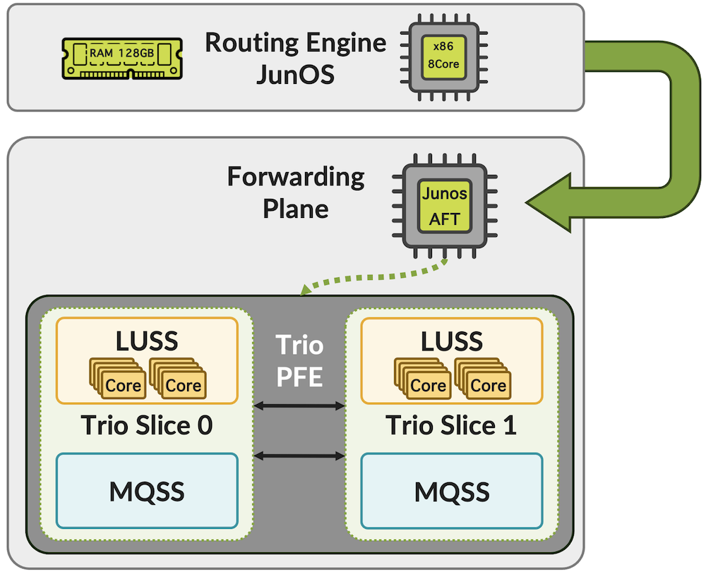

The MX Trio6 chipset has two PFE slices in a single package, also known as a system-in-package.

## Multiprocessing RIB -- "rib-sharding"

RIB Sharding with support for Non-Stop-Routing introduced in Junos OS Release 22.2R1.

BGP RIB sharding involves dividing the BGP process across routes. Various routes are hashed into distinct threads to enable concurrency. BGP RIB sharding divides a consolidated BGP RIB into multiple sub-RIBs, with each sub-RIB managing a subset of BGP routes. Each sub-RIB is supported by an independent RPD thread to achieve concurrency.

BGP RIB sharding supported for the following IPv4 and IPv6 address families:

- IPv4 Unicast
- IPv4 Multicast
- IPv6 Unicast
- IPv6 Multicast
- IPv4 VPN Unicast
- IPv4 VPN Multicast
- IPv6 VPN Unicast
- IPv6 VPN Multicast
- IPv4 Labeled Unicast
- IPv6 Labeled Unicast
- All the other BGP address families are still processed without sharding.

```
set system processes routing bgp rib-sharding number-of-shards <number-of-shards>
set system processes routing bgp update-threading number-of-threads <number-of-threads>
set system processes routing bgp update-threading group-split-size <group-split-size>
```

BGP RIB Sharding leverage multiprocessing capabilities present in MX Routing-Engine and cRPD running on top of compute so that BGP pipeline processing can happen in parallel.

Each instance is a unique thread of execution within the RPD process and is referred to as a shard thread.

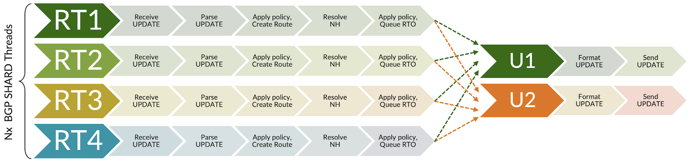

*BGP RIB Sharding leverage multiprocessing*

Benefit network convergence by improving route install and delete performance by 5 times in some cases.

Since parallel execution model on the output side is that more Update messages might be generated when advertising to a downstream peer. Update Threading (UT) was introduced to increase efficiency of the Update messages for the overall performance.

**Note**: Rib-Sharding is particularly effective for router is connected to many BGP peers.

## RIB Sharding on MX304 and MX10003

Two scenarios will be discussed in this blog post.

1. RIB sharding with the MX304

- a. Single eBGP peer generating 5 million routes.
- b. Multi eBGP peers generating the same 5 million routes.
- c. Multi eBGP peers unique 10 million routes; 60 million total routes.

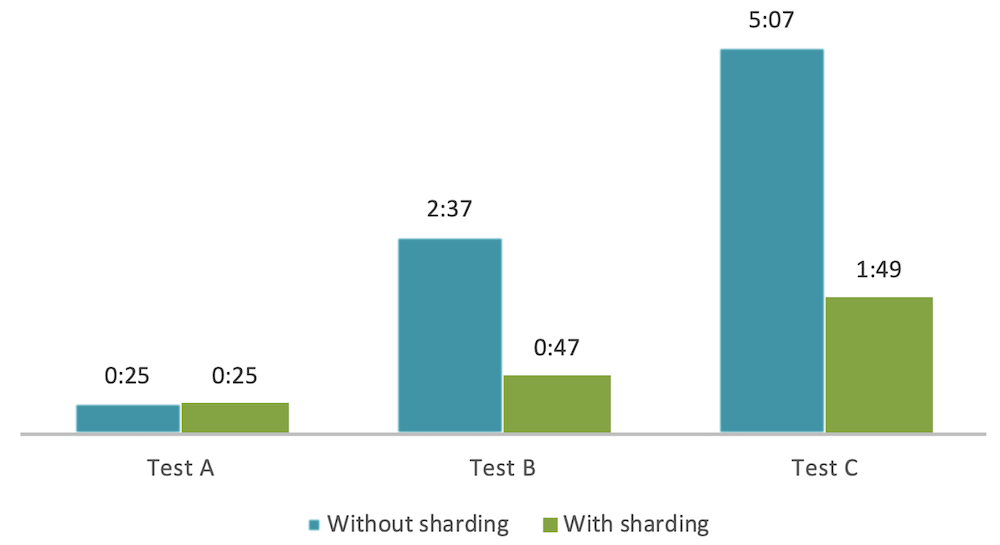

2. Enabling sharding on the older MX10003 to demonstrate the power of this capability and explore how this technology can significantly enhance route performance in both scenarios.

### Test scenario with MX304: 5 million routes from a single eBGP peer

Enabling RIB sharding on MX304 with NSR and GRES.

```
set system processes routing bgp rib-sharding number-of-shards 8
set system processes routing bgp update-threading number-of-threads 12
```

Routing process will restart and reset BGP peers.

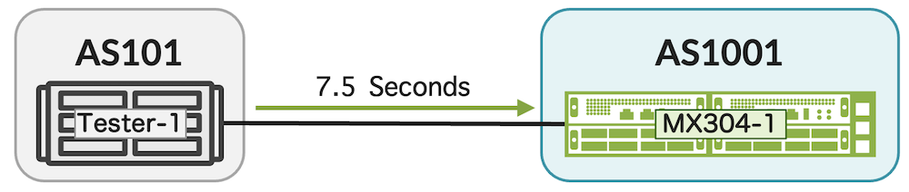

It took 7.5 seconds for shards to receive all 5 million routes and additional 18 seconds to complete route install in the main thread and have valid paths in inet.0 table.

Overall, 25 seconds so in this case with one peer, rib-sharding is not improving the effective routes.

While the potential is evident, there is no improvement with only one BGP peer, taking 25 seconds overall. This is not a common scenario as most deployments involve multiple BGP peers. Nevertheless, it's good to note situations where this feature may not add substantial value.

> **Note:** The presence of a route in the shard means that the route can be advertised immediately, even though it is not yet in the main thread, signifying that it is not ready for forwarding. For instance, a Route Reflector can benefit from the route in the shard capability as it can reflects routes before they are installed in the main thread.

**MX304 Output:**

```
mnayman@MX304-re0> set cli timestamp 
Dec 01 19:25:30
CLI timestamp set to: %b %d %T

mnayman@MX304-re0> show route summary table inet.0| refresh 1 
---(refreshed at 2023-12-02 19:16:30 PST)---
Autonomous system number: 1001
Router ID: 10.85.162.105

Highwater Mark (All time / Time averaged watermark)
    RIB unique destination routes: 56145 at 2023-12-02 19:16:29 / 0
    RIB routes                   : 56144 at 2023-12-02 19:16:29 / 0
    FIB routes                   : 2 at 2023-12-02 19:15:24 / 0
    VRF type routing instances   : 0 at 2023-12-02 19:15:23

inet.0: 56128 destinations, 8 routes (7 active, 0 holddown, 0 hidden)
              Direct:      3 routes,      2 active
               Local:      3 routes,      3 active
                 BGP:      1 routes,      1 active ...
...
---(refreshed at 2023-12-02 19:16:37 PST)---
Autonomous system number: 1001
Router ID: 10.85.162.105

Highwater Mark (All time / Time averaged watermark)
    RIB unique destination routes: 1095843 at 2023-12-02 19:16:37 / 0
    RIB routes                   : 1095842 at 2023-12-02 19:16:37 / 0
    FIB routes                   : 2 at 2023-12-02 19:15:24 / 0
    VRF type routing instances   : 0 at 2023-12-02 19:15:23

inet.0: 1095826 destinations, 5000007 routes (5000006 active, 0 holddown, 0 hidden)
              Direct:      3 routes,      2 active
               Local:      3 routes,      3 active
                 BGP: 5000000 routes, 5000000 active

mnayman@MX304-re0> show route summary table inet.0 rib-sharding main | refresh 1
---(refreshed at 2023-12-02 19:16:54 PST)---
Autonomous system number: 1001
Router ID: 10.85.162.105

Highwater Mark (All time / Time averaged watermark)
    RIB unique destination routes: 5000023 at 2023-12-02 19:16:54 / 0
    RIB routes                   : 5000022 at 2023-12-02 19:16:54 / 0
    FIB routes                   : 2 at 2023-12-02 19:15:24 / 0
    VRF type routing instances   : 0 at 2023-12-02 19:15:23


inet.0: 5000006 destinations, 5000007 routes (5000006 active, 0 holddown, 0 hidden)
              Direct:      3 routes,      2 active
               Local:      3 routes,      3 active
                 BGP: 5000000 routes, 5000000 active
```

MX304 achieves a speedy FIB installation in just 66 seconds, signaling efficient forwarding plane convergence. Yet, our focus in this test is on highlighting RIB improvements for an overall performance perspective.

### Test scenario with MX304: 5 million routes from each of the six eBGP peers

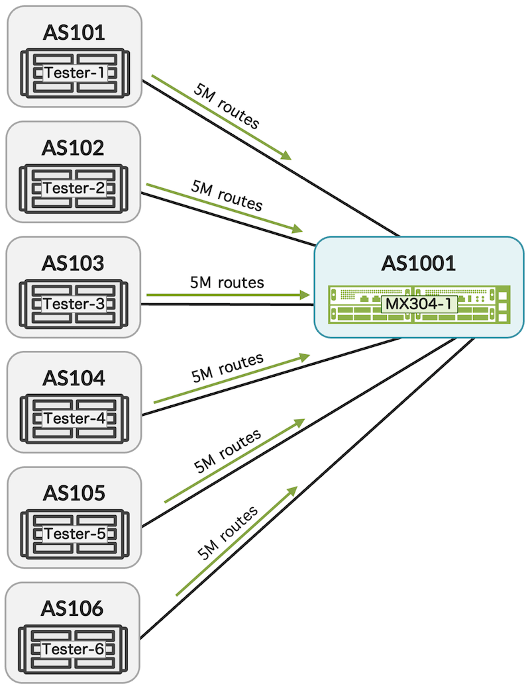

- **Without sharding:**

Fully converged RIB 2 minutes and 37 seconds to install 5M active routes; 30M in total.
FIB install 2 minutes and 50 seconds.

- **With sharding: **

Fully converged RIB in 47 seconds to install 5M active routes; 30M in total.
FIB install 5M best route 1 minute and 33 seconds.

To summarize, an impressive 70% improvement in RIB performance, with a corresponding positive impact on FIB performance, which improved by 46%.

While rib-sharding is a RIB feature, a faster RIB opens a bottleneck and aids in recovering the forwarding plane, thereby dramatically enhancing network convergence.

The power of Junos OS enhancements!

```
mnayman@MX304-re0> show route summary table inet.0 rib-sharding main | refresh 1
---(refreshed at 2023-12-02 20:17:48 PST)---
Autonomous system number: 1001
Router ID: 10.85.162.105

Highwater Mark (All time / Time averaged watermark)
    RIB unique destination routes: 34 at 2023-12-02 20:13:47 / 0
    RIB routes                   : 39 at 2023-12-02 20:17:47 / 0
    FIB routes                   : 3 at 2023-12-02 20:13:49 / 0
    VRF type routing instances   : 0 at 2023-12-02 20:12:32

inet.0: 17 destinations, 18 routes (17 active, 0 holddown, 0 hidden)
              Direct:      8 routes,      7 active
               Local:      8 routes,      8 active
                 BGP:      1 routes,      1 active
...
---(refreshed at 2023-12-02 20:18:35 PST)---
Autonomous system number: 1001
Router ID: 10.85.162.105

Highwater Mark (All time / Time averaged watermark)
    RIB unique destination routes: 5000033 at 2023-12-02 20:18:35 / 0
    RIB routes                   : 30000032 at 2023-12-02 20:18:35 / 0
    FIB routes                   : 1210937 at 2023-12-02 20:18:35 / 0
    VRF type routing instances   : 0 at 2023-12-02 20:12:32

inet.0: 5000016 destinations, 5000017 routes (5000016 active, 0 holddown, 0 hidden)
              Direct:      8 routes,      7 active
               Local:      8 routes,      8 active
                 BGP: 5000000 routes, 5000000 active
...

mnayman@MX304-re0> show route summary table inet.0 | refresh 1
---(refreshed at 2023-12-02 20:18:36 PST)---
Autonomous system number: 1001
Router ID: 10.85.162.105

Highwater Mark (All time / Time averaged watermark)
    RIB unique destination routes: 5000033 at 2023-12-02 20:18:35 / 0
    RIB routes                   : 30000032 at 2023-12-02 20:18:35 / 0
    FIB routes                   : 1242417 at 2023-12-02 20:18:35 / 0
    VRF type routing instances   : 0 at 2023-12-02 20:12:32

inet.0: 5000016 destinations, 30000017 routes (5000016 active, 0 holddown, 0 hidden)
              Direct:      8 routes,      7 active
               Local:      8 routes,      8 active
                 BGP: 30000000 routes, 5000000 active
...
---(refreshed at 2023-12-02 20:19:21 PST)---
Autonomous system number: 1001
Router ID: 10.85.162.105

Highwater Mark (All time / Time averaged watermark)
    RIB unique destination routes: 5000033 at 2023-12-02 20:18:35 / 0
    RIB routes                   : 30000032 at 2023-12-02 20:18:35 / 0
    FIB routes                   : 5000002 at 2023-12-02 20:19:21 / 0
```

### Test scenario with MX304: 10 million unique routes; 60 million total routes from six eBGP peers

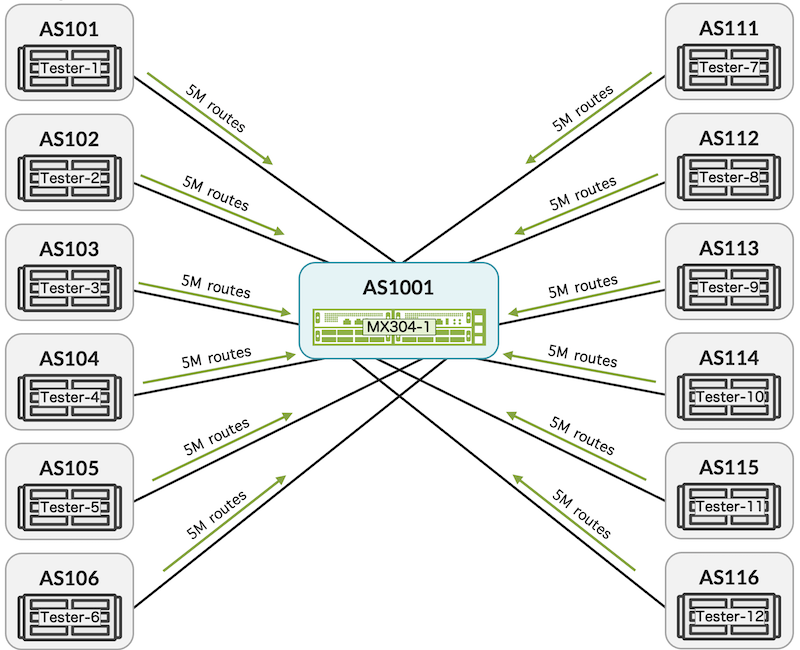

- **Without sharding:**

Fully converged RIB 5 minutes and 7 seconds to install 10M unique active routes; total 60 million routes.
FIB install 5 minutes and 35 seconds; 10M in total.

- **With sharding:**

Fully converged RIB 1 minutes and 49 seconds to install 10M unique active routes; total 60 million routes.
FIB install 3 minute and 22 seconds.

During the test, both the control-plane and forwarding-plane demonstrated impressive performance with relatively low resource utilization, especially notable given the scale of 60 million routes in the RIB and 10 million routes in the FIB, as shown below:

```
mnayman@MX304-re0> show route summary table inet.0                
Autonomous system number: 1001
Router ID: 10.85.162.105

Highwater Mark (All time / Time averaged watermark)
    RIB unique destination routes: 10000049 at 2023-12-05 14:33:58 / 0
    RIB routes                   : 60000044 at 2023-12-05 14:33:58 / 0
    FIB routes                   : 10000002 at 2023-12-05 14:35:31 / 0
    VRF type routing instances   : 0 at 2023-12-05 14:31:18

inet.0: 10000028 destinations, 60000029 routes (10000028 active, 0 holddown, 0 hidden)
              Direct:     14 routes,     13 active
               Local:     14 routes,     14 active
                 BGP: 60000000 routes, 10000000 active
              Static:      1 routes,      1 active

mnayman@MX304-re0> show chassis fpc    
                     Temp  CPU Utilization (%)   CPU Utilization (%)  Memory    Utilization (%)
Slot State            (C)  Total  Interrupt      1min   5min   15min  DRAM (MB) Heap     Buffer
  0  Online            31      1          0        1      1      2    32768      49          0

mnayman@MX304-re0> show system processes extensive    
last pid: 96480;  load averages:  0.37,  0.72,  1.32  up 3+00:08:04    14:46:20
612 threads:   13 running, 538 sleeping, 61 waiting
CPU:  0.8% user,  0.0% nice,  0.4% system,  0.1% interrupt, 98.7% idle
Mem: 33G Active, 1625M Inact, 192M Laundry, 5268M Wired, 470M Buf, 53G Free
```

And we haven't completed our discussion on the RIB Sharding feature. Junos introduces an additional optimization for scenarios where many BGP peers are managed within a single group.

For example, if we have a group with 1000 peers and 10 cores for update threads, the current setup uses only one thread for the entire group. This leaves some cores unused and creates extra work.

## Solution - "group-split-size"

In such cases, consider the following feature introduced in Junos OS 21.4R1.

```
set system processes routing bgp update-threading number-of-threads group-split-size <0..2000>
```

To efficiently manage a large number of peers within a single group, utilize multiple threads. Rather than relying on a single thread, allocate different threads to handle distinct segments of the group. This optimizes resource usage and minimizes additional workload on our system. The idea is to allow a group to be serviced internally by multiple update threads. Now, peers in the same group can connect to different threads. This helps lighten the system's load when dealing with outbound update packets.

The network design engineer needs to determine the optimal value for the group-split-size based on their topology, system capabilities, and network design.

### The power of MX

While it's not the primary focus of this blog, I couldn't overlook the exceptional scale and performance of the MX304 deserve attention. This 2RU system, equipped with a redundant RE, can handle an unparalleled scale of 20 million active routes in the FIB, with Trio6 PFE memory usage staying below 80%. Positioned as an outstanding Edge device, it also serves as an ideal route-reflector. With robust RIB features, MX304 can handle 120 million routes in the RIB, coupled with a redundant RE for true carrier-grade reliability, ensuring no impact in the event of RE failover.

```
mnayman@MX304-re0> show route summary table inet.0
Autonomous system number: 1001
Router ID: 10.85.162.105

Highwater Mark (All time / Time averaged watermark)
    RIB unique destination routes: 20000027 at 2023-12-02 12:24:32 / 0
    RIB routes                   : 20000026 at 2023-12-02 12:24:32 / 0
    FIB routes                   : 20000002 at 2023-12-02 12:27:23 / 0
    VRF type routing instances   : 0 at 2023-12-02 12:15:40

inet.0: 20000010 destinations, 20000011 routes (20000010 active, 0 holddown, 0 hidden)
              Direct:      5 routes,      4 active
               Local:      5 routes,      5 active
                 BGP: 20000000 routes, 20000000 active

mnayman@MX304-re0> show route forwarding-table table default summary    
Routing table: default.inet
Internet:
         user:         20000001 routes
         perm:          5 routes
         intf:          9 routes
         dest:         20 routes

mnayman@MX304-re0> start shell 
% vty fpc0
mnayman@MX304-re1-fpc0:pfe> show route summary proto ip    

IPv4 Route Tables:
Index         Routes     Size(b)  Prefixes     Aggr     Installed   Comp(%)  Errors
--------  ----------  ----------  ---------  ---------  ----------  ------  -------
Default     20000018  1920001728  20000018         0  20000018      -         0
```

### Test scenario with MX10003

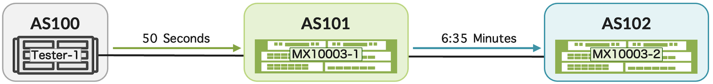

Directly connected tester is advertising 5 million unicast routes.

- RIB performance on MX1: 50 seconds; 100,000 routes per second
- FIB performance on MX1: 4 minutes; 20,818 routes per second
- Performance on MX2: 6:30 minutes; 12,820 routes per second. FIB isn't behind on speed.

Enabling RIB sharding on MX10003

```
set system processes routing bgp rib-sharding number-of-shards 6
set system processes routing bgp update-threading number-of-threads 6
```

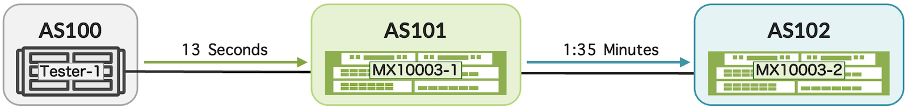

- MX1 receive 5M routes in the shard in 13 seconds. Additional 30 seconds required to install all routes as active in the main thread.
- MX2 receive all routes from MX1 in 1:35 minutes.

Looking at the packet capture, we can see packets are optimized to the interface MTU of 9000 so less messages, no delay between messages and no delay for every ACK.

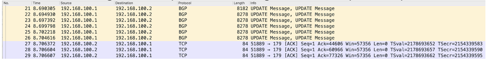

## RIB Sharding on cRPD

Another test using Junos(R) containerized routing protocol process (cRPD). Below is a quick demonstration of the average result from 10 tests.

Full internet table, along with 4 million routes, is advertised from one cRPD router to another cRPD router deployed with minimal compute of 4 vCPUs and 4GB vRAM.

| Learning / Delete | Without sharding | With sharding | Gain |
|:--|:--|:--|:--|
| Route Learning | 82 sec | 35 sec | 57% |
| Route Delete | 39 sec | 21 sec | 46% |


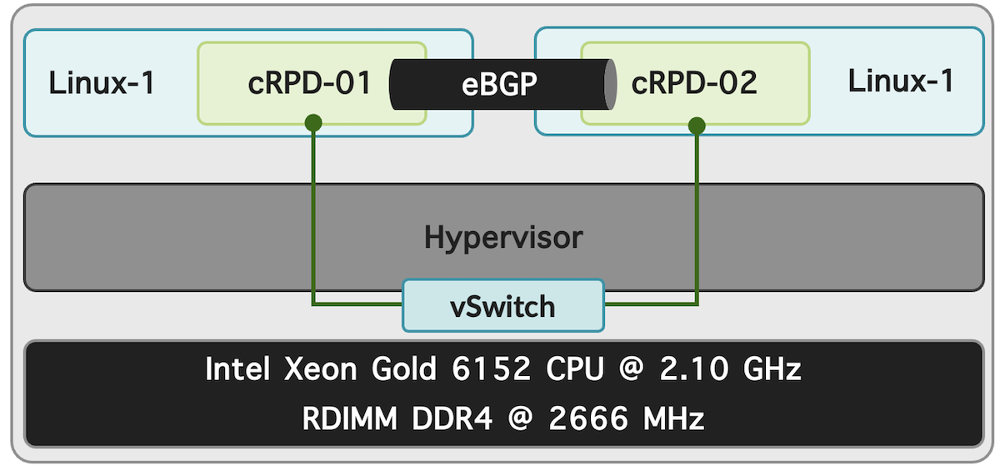

cRPD is a cloud-native router designed for on-premises and cloud deployment.  It is an excellent solution, particularly in cloud deployments where vCPU and vRAM are valuable resources.

## Routing Packet Acceleration

By default, even when jumbo frames are configured on physical interfaces, packets may be buffered and fragmented into smaller packets if there is insufficient processing capacity to handle the volume of messages. This gives rise to three issues:

- Extra processing on packets.
- Time to handle BGP messages double or more the number of messages.
- ACK result in delay of 100ms for every fragmented message.

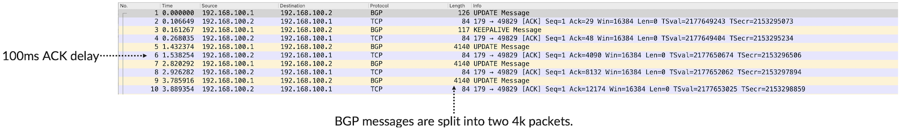

This is largely addressed by the aforementioned 'RIB Sharding', which enhances processing and eliminates the need for buffering. However, for those who haven't enabled RIB Sharding or wish to further enhance route learning and reflect routes, following enhancement can be enabled to optimize BGP message length size:

```
set protocols bgp send-buffer 64k
set protocols bgp receive-buffer 64k
```

Given the use case, at this point, one can leverage an MTU of 16,000 to minimize the number of messages and potentially optimize control plane route performance further.

```
set interfaces <interface-name> mtu 16000
```

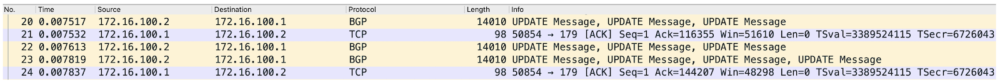

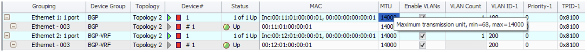

Note: The tester used in this scenario supports a maximum MTU of 14,000.

## FIB Localization -- "localized-fib"

Feature introduced in Junos OS Release 14.2 and uniquely supported on MX Series routers.

Router platforms often incorporate multiple Packet Forwarding Engines (PFE) or line cards with multiple PFEs to enhance bandwidth, port count, and logical scale. However, routers install the complete routing tables, such as inet and inet6 FIB, into the hardware of each PFE or line card.

In a multiple-slot chassis, whether it has one line card or multiple line cards with additional ports, the FIB scale remains constant. In essence, adding more line cards could potentially reduce the overall scale in certain scenarios.

In most deployments, this is not an issue for the MX platform, primarily due to the MX's exceptionally high FIB scale. That being said, localized FIB can further increase the overall scale and improve network convergence performance.

The FIB localization feature is designed to minimize the non-local footprint of each PFE and free up resources for greater scalability.

FIB-localization classifies router PFEs as 'FIB-remote' or 'FIB-local.' FIB-local engines install all routes from default inet and inet6 tables into the forwarding hardware. FIB-remote engines create a default route and forward packets to FIB-local engines for full IP lookups.

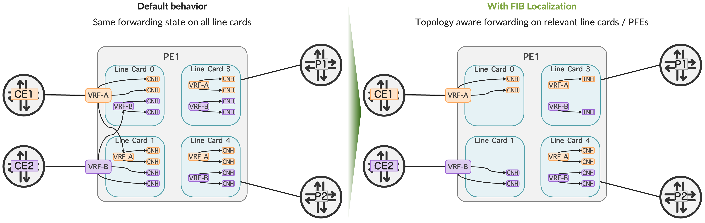

```
set routing-instances VRF-A routing-options localized-fib
set routing-instances VRF-B routing-options localized-fib
set chassis fpc 3 vpn-localization vpn-core-facing-only 
```

- vpn-core-facing-default has all the routes and next hops of the CE-facing interfaces.
- vpn-core-facing-only has no vpn-label state; does not store next hops of the CE-facing interfaces.

Note: Configure the FPC slot number of the CE-facing logical interfaces like AE or RSQL or IRB to localize the VRF routing instance routes.

```
set routing-instances <instance_name> routing-options localized-fib <local-fpc-slot-number>
```

### Testbed summary

- **CE1** connected to VRF-A is advertising 4,000 IPv4 routes
- **CE2** connected to VRF-B is advertising 2M IPv4 routes and 750K IPv6 routes
- **Core** is advertising 2.5M inet-vpn routes (SAFI 128)

**From CE1 and CE2**

```
mnayman@MX-1-RE0> show route summary table VRF 
Autonomous system number: 124009116
Router ID: 10.144.0.208

RIB Unique destination routes high watermark: 8674572 at 2023-11-27 15:07:07
RIB routes high watermark: 8674399 at 2023-11-27 15:07:06
FIB routes high watermark: 3299647 at 2023-11-27 15:01:08
VRF type routing instances high watermark: 303 at 2023-11-27 12:48:51

VRF-B.inet.0: 2000004 destinations, 2000004 routes (2000004 active, 0 holddown, 0 hidden)
              Direct:      2 routes,      2 active
               Local:      2 routes,      2 active
                 BGP: 2000000 routes, 2000000 active

VRF-A.inet.0: 4008 destinations, 4009 routes (4008 active, 0 holddown, 0 hidden)
              Direct:      1 routes,      1 active
               Local:      1 routes,      1 active
                 BGP:   4007 routes,   4006 active

VRF-B.inet6.0: 750004 destinations, 750004 routes (750004 active, 0 holddown, 0 hidden)
              Direct:      1 routes,      1 active
               Local:      2 routes,      2 active
                 BGP: 750000 routes, 750000 active
               INET6:      1 routes,      1 active
...
```

**From Core**

```
mnayman@MX-1-RE0> show route summary table bgp 
Autonomous system number: 124009116
Router ID: 10.144.0.208

RIB Unique destination routes high watermark: 8674572 at 2023-11-27 15:07:07
RIB routes high watermark: 8674399 at 2023-11-27 15:07:06
FIB routes high watermark: 3299647 at 2023-11-27 15:01:08
VRF type routing instances high watermark: 303 at 2023-11-27 12:48:51

bgp.l3vpn.0: 4507873 destinations, 4507873 routes (2007873 active, 0 holddown, 2500000 hidden)
              Direct:   1458 routes,   1458 active
               Local:      5 routes,      5 active
                 BGP: 4506408 routes, 2006408 active
           Aggregate:      2 routes,      2 active
...
```

Verification:

Show the localization information of all or specific VRFs.

```
mnayman@MX-1-RE0> show route vpn-localization vpn-name VRF-A        
Routing table: VRF-A.inet, Localized
  Index: 317, Address Family: inet, Localization status: Complete
  Local FPC's: 0 3 

Routing table: VRF-A.inet6, Localized
  Index: 317, Address Family: inet6, Localization status: Complete
  Local FPC's: 0 3 

{master}
mnayman@MX-1-RE0> show route vpn-localization vpn-name VRF-B    
Routing table: VRF-B.inet, Localized
  Index: 318, Address Family: inet, Localization status: Complete
  Local FPC's: 1 3 

Routing table: VRF-B.inet6, Localized
  Index: 318, Address Family: inet6, Localization status: Complete
  Local FPC's: 1 3
```

Now let's login to line card 0 to show the number of routes installed:

- Totally 10K routes installed on line card 0 including all tables and default
- Savings on the total amount of next-hop
- Per table routes with local / non-local

```
mnayman@MX-1-RE0> start shell
mnayman@MX-1-RE0:~ # vty fpc0
NPC0(MX-1-RE0 vty)# show route ip summary

IPv4 Route Tables:
Tables      Routes
--------  --------
     310     10832

NPC0(MX-1-RE0 vty)# show nhdb summary    
 Total number of NH = 10651

NPC0(MX-1-RE0 vty)# show route ip table    
Protocol: IPv4
    Table Name                       Table Index (lrid ) # of Routes  Bytes        LOCAL     FRRP TID         
    -------------------------------------------------------------------------------------------------------
    MOSHIKO-VRF-A.317                317         (0    ) 4016         562236       LOCAL     low ----
    MOSHIKO-VRF-B.318                318         (0    ) 1            136          NON-LOCAL low ----
...
    default.0                        0           (0    ) 2052         287288       LOCAL     low ----
```

On the same principle, login to line card 1 to verify the large-scale routes installed:

```
mnayman@MX-1-RE0> start shell
mnayman@MX-1-RE0:~ # vty fpc1
RMPC1(MX-1-RE0 vty)# show route ip summary

IPv4 Route Tables:
Tables      Routes
--------  --------
     310   2006832

RMPC1(MX-1-RE0 vty)# show route ip table    
Protocol: IPv4
    Table Name                       Table Index (lrid ) # of Routes  Bytes        LOCAL     FRRP TID         
    -------------------------------------------------------------------------------------------------------
    MOSHIKO-VRF-A.317                317         (0    ) 1            136          NON-LOCAL low ----
    MOSHIKO-VRF-B.318                318         (0    ) 2000015      280002096    LOCAL     low ---- 
...
```

Lastly we shall login to line card 3 connected to the core:

```
mnayman@MX-1-RE0> start shell
mnayman@MX-1-RE0:~ # vty fpc3
RMPC3(MX-1-RE0 vty)# show route ip summary

IPv4 Route Tables:
Tables      Routes
--------  --------
     310   2010846

RMPC1(MX-1-RE0 vty)# show route ip table    
Protocol: IPv4
    Table Name                       Table Index (lrid ) # of Routes  Bytes        LOCAL     FRRP TID         
    -------------------------------------------------------------------------------------------------------
    MOSHIKO-VRF-A.317                317         (0    ) 4016         562236       LOCAL     low ----
    MOSHIKO-VRF-B.318                318         (0    ) 2000015      280002096    LOCAL     low ---- 

RMPC3(D2IPE-I-RE0 vty)# show nhdb summary    
 Total number of NH = 11257
...
```

## BGP Session Scale -- "precision-timers"

Feature introduced in Junos OS 11.4

As we delve into route scale and performance improvement, it is crucial to take into account the scale of the BGP sessions. In scenarios involving millions of routes, a router is likely to have numerous BGP sessions. The method below becomes particularly advantageous in large-scale deployments with a high number of active sessions, such as those in edge or large VPN deployments.

The precision-timers statement plays a vital role in ensuring that if scheduler slip messages occur, the routing device continues to send keepalive messages. When the precision-timers statement is included, the generation of keepalive messages is executed in a dedicated kernel thread, effectively preventing BGP session flaps.

```
set logical-systems <name> protocols bgp precision-timers
set protocols bgp precision-timers
```

## Glossary

- AS: Autonomous System
- BGP: Border Gateway Protocol
- BGP-LU: Border Gateway Protocol-Labeled Unicast
- cRPD: Junos Containerized Routing Process Daemon
- FRR: Fast Reroute
- GRES: Graceful Routing Engine Switchover
- IP: Internet Protocol
- Junos: Operating System used in Juniper Networks routing, switching and security devices.
- MPLS: Multiprotocol Label Switching
- MTU: Maximum Transmission Unit
- PE: Provider Edge router
- PFE: Packet Forwarding Engine
- RE: Routing Engine
- RPD: Routing Process Daemon
- VPN: virtual private network

## Useful links

- MX304 FIB install rate: [https://juniper.github.io/techposts/mx304-fib-install-rate/article](https://juniper.github.io/techposts/mx304-fib-install-rate/article)
- Mastering BGP PIC on JUNOS: [https://juniper.github.io/techposts/mastering-bgp-pic-on-junos/article](https://juniper.github.io/techposts/mastering-bgp-pic-on-junos/article)
- FIB Compression: [https://juniper.github.io/techposts/ptx-fib-compression/article](https://juniper.github.io/techposts/ptx-fib-compression/article)
- BGP RIB Sharding: [https://juniper.github.io/techposts/bgp-rib-sharding/article](https://juniper.github.io/techposts/bgp-rib-sharding/article)

## Acknowledgements

Thanks to Kevin Wang for developing the feature set in Junos OS
