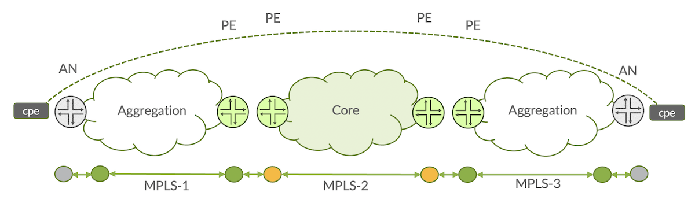
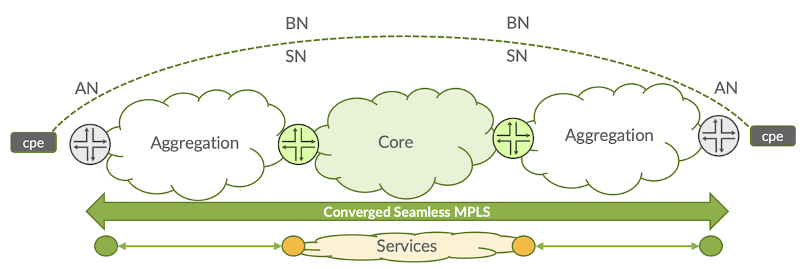
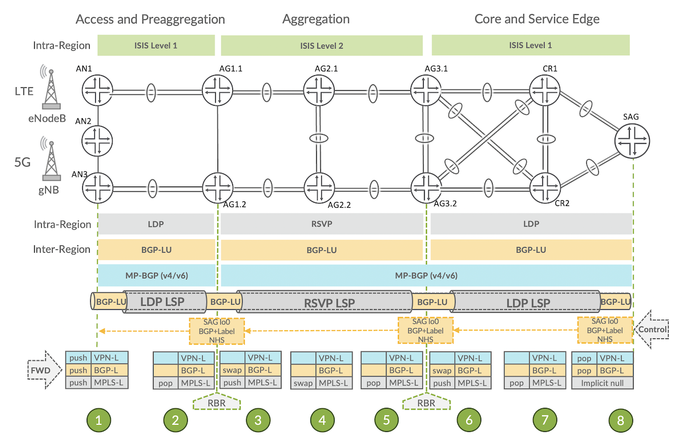
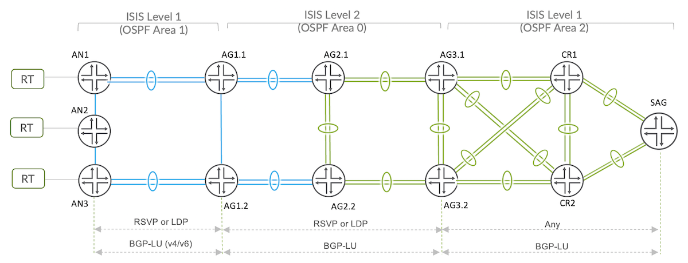
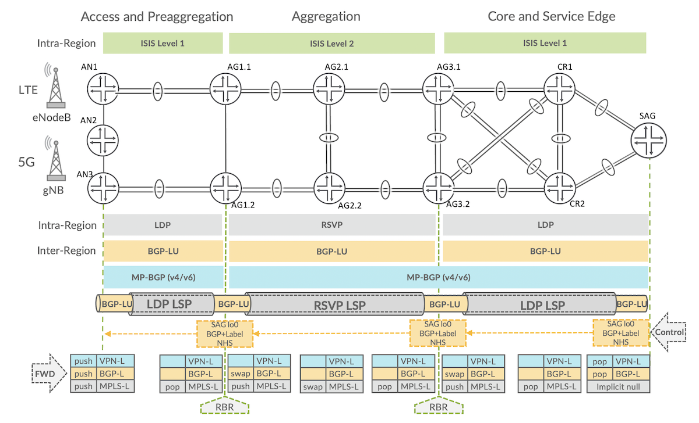
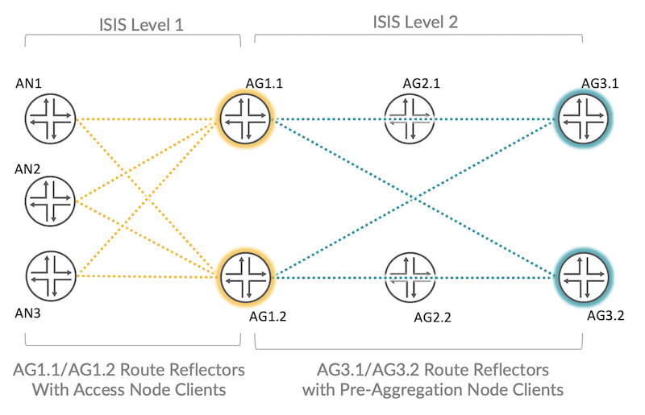
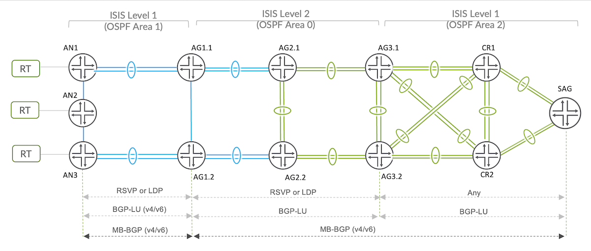

# Building Border Agnostic Architectures with Seamless MPLS

**Kevin Brown - 02/16/2023**

Third part of the Juniper Validated Design series on basic Mobile Backhauling, with a focus on Seamless MPLS and BGP-LU.

## Introduction

In the third Juniper Validated Design (JVD) article on the Mobile Backhaul reference architecture and use case, we explore the implementation of decoupling transport architecture from the service overlay by leveraging Seamless MPLS. This was a foundational technology represented in the featured validation. Be sure to check out the earlier blogs which provide the building blocks of the solution:

- [JVD Overview](https://juniper.github.io/techposts/introducing-the-validation-series/article)
- [Mobile Backhaul Overview](https://juniper.github.io/techposts/jvd-mobile-backhaul-overview/article)
- [Seamless MPLS LDP with OSPF underlay](https://juniper.github.io/techposts/seamless-mpls-ldp-with-ospf/article)
- [Building Border Agnostic Architectures with Seamless MPLS](https://juniper.github.io/techposts/border-agnostic-architectures-with-seamless-mpls/article) (present document)

## Seamless MPLS

Traditional networks (Figure 1) were built upon disparate network segmentation that required obtrusive service instantiation at border regions. The tightly coupled transport architecture further complicated interdomain service instantiation and created scaling challenges at the network border routers.



Seamless MPLS (Figure 2) by contrast invites network segmentation by containing the IGP in smaller domains referred as regions and limiting inter-region IGP communication, thereby reducing state, and providing mechanisms to extend coherent MPLS across network regions. Each region may exist independently and contain unique IGP characteristics. BGP Labeled Unicast (BGP-LU), defined by [RFC3107](https://datatracker.ietf.org/doc/html/rfc3107), is the machinery that enables stitching between border regions as another label distribution mechanism interpreted by MPLS. BGP-LU became widely popular with inter-AS VPN "carrier-of-carriers" solutions. Here it works similarly by establishing BGP sessions between border nodes and advertising loopbacks as labeled unicast (SAFI-4) routes, creating a new layer of abstraction across the existing MPLS domains. Internal labeled BGP (iBGP-LU) stitches intradomain endpoints while external labeled BGP (eBGP-LU) provides Inter-AS stitching capabilities with Option-C practices.



With Seamless MPLS, services are decoupled from the transport underlay, which allows drastic simplification of end-to-end service instantiation with the reduction of provisioning points. The converged architecture provides path selection flexibility, enabling massive scale to the order of 100,000 nodes, while supporting <=50ms convergence optimizing smaller and more manageable network regions.

Not surprising at all, one of the early adopters of Seamless MPLS was Mobile Operators supporting multi-segment topologies including permutations of Access, Aggregation and Core segments for the delivery of mobile backhaul solutions. Of course, Seamless MPLS ([draft-ietf-mpls-seamless-mpls-07](https://datatracker.ietf.org/doc/html/draft-ietf-mpls-seamless-mpls-07)) has been around for several years and well established in the industry. In fact, we now have even more intelligent methodologies to extend color-awareness between regions---but indeed that's a topic for another JVD! It must be pointed out there are other ways to skin the proverbial cat such as redistribution techniques, but certainly BGP-LU provides a simplistic approach supporting Option-C characteristics that folks can easily understand.

Before continuing into the components required to build the solution, let's take a moment to peel back the layers of the Seamless MPLS architecture to better understand the label imposition sequences at each point in the topology.



Figure 3 represents the physical topology created for the validated design along with selected intra/inter region transport underlay methodologies. Boundaries are delineated by Regional Border Routers (RBRs). Control plane is established advertising labeled loopbacks and at each RBR performing label swap operation with setting nexthop to self.

The following steps describe the Seamless MPLS data plane label operations once control plane reachability is established.

1. The Access Node (AN) **[1]** receives VPN traffic with a BGP-LU destination next-hop that resolves over the LDP LSP, resulting in a 3-label push: Service Label (VPN), inter-domain BGP Label (BGP-LU) and the intra-domain MPLS LDP Label to reach AG1 nodes.

2. AG1.1/AG1.2 **[2]** functions as Regional Border Routers (RBR), which pops the top LDP label from the Access region.

3. AG1.1/AG1.2** [3]** then swaps the BGP label (derived by BGP-LU) as we cross regions and pushes the RSVP label for transport across the Aggregation region toward AG3.

4. MPLS label operations **[4]** are business-as-usual for LSR AG2.1/AG2.2, shown as explicit null behavior swapping the MPLS label.

5. AG3.1/AG3.2 are also RBRs **[5]**, which pop the topmost RSVP label.

6. Once again, crossing regions results in AG3.1/AG3.2 RBRs **[6]** swapping the BGP label and pushing the next region LDP label required to reach SAG.

7. Next, CR1/CR2 **[7]** operating as implicit-null (default), pop the MPLS label.

8. Finally, SAG **[8]** pops the BGP label and resolves the VPN into the proper construct (depending on VPN type), popping the service label and forwarding the unlabeled traffic.

We'll cover the details on how Services are overlayed onto the Seamless MPLS topology in the next article, so for now let's continue through the underlay creation.

### Topology Building Blocks

In the previous articles, an underlay was built using either OSPF or ISIS as the IGP, along with LDP or RSVP signaled MPLS. I explained how these protocols exist, implementing metric-based decisions and protection mechanisms (rLFA or FRR), from within the comforts of their own domain---as shown below (Figure 4). A benefit of Seamless MPLS allows containment of network interruptions to the local region, which improves convergence and simplifies network expansion since regions do not require compatibility.



### Labeled BGP

Let's start from the furthest right node, the Services Aggregation Gateway (SAG) implements Internal BGP Labeled Unicast (iBGP-LU) toward border nodes AG3.1 and AG3.2, traversing disparate IGP domains (ISIS L1 into L2 or OSPF Area 2 into Backbone Area 0). To get started, we must enable family labeled-unicast [lines 5-6; 13-14]. By default, JUNOS will install these labeled BGP prefixes into inet.0 table, but to support BGP next-hop resolution for MPLS services, we need these routes in inet.3.

We can modify the default behavior by imposing the rib inet.3 statement [lines 8-9] to instead place these routes into inet.3. Labeled BGP routes can also be made available in inet.0 with the rib-group construct [line 7]. This isn't the only option to accomplishing the given behavior, particularly in the case where only labeled-unicast BGP family is utilized. But this method does allow flexibility in event we wanted to include additional BGP address families in the same BGP session. A similar operation can also be achieved using resolve-vpn.

**SAG iBGP configuration (to AG3.1/AG3.2)**

```
 1     bgp {
 2         group ibgp_sag {
 3             type internal;
 4             local-address 1.1.0.11;
 5             family inet {
 6                 labeled-unicast {
 7                     rib-group inet3-to-inet0;
 8                     rib {
 9                         inet.3;
10                     }
11                 }
12             }
13             family inet6 {
14                 labeled-unicast {
15                     rib {
16                         inet6.3;
17                     }
18                 }
19             }
20             export next-hop-self;
21             neighbor 1.1.0.7;      # AG3.1 Loopback
22             neighbor 1.1.0.8;      # AG3.2 Loopback
```

AG3.1 (shown below) and AG3.2 configuration to SAG is identical, except for local-address.

**AG3.1 iBGP configuration (to SAG)**

```
 1         group ibgp_sag {
 2             type internal;
 3             local-address 1.1.0.7;
 4             family inet {
 5                 labeled-unicast {
 6                     rib-group inet3-to-inet0;
 7                     rib {
 8                         inet.3;
 9                     }
10                 }
11             }
12             family inet6 {
13                 labeled-unicast {
14                     rib {
15                         inet6.3;
16                     }
17                 }
18             }
19             export next-hop-self;
20             neighbor 1.1.0.11;
21         }
22         log-updown;
23         multipath;
```

If we look under the routing-options stanza, our created rib-group defines exactly the procedures explained but filters only matching /32 routes. Again, multiple ways to accomplish this step! At this point the loopback /32 prefix is advertised by BGP with a label association that MPLS installs into the label forwarding table. SAG configuration is shown but RIB and policy constructs are the same on AG3.1/AG3.2.

There are a few other valuable but non-essential configuration elements in the given topic, which I've hyperlinked for additional dissection, including implementation of BGP-PIC [line 3, 17] for both IPv4 and IPv6 and chained composite next-hop for the supported VPN services [lines 7-11].

**SAG Routing Options**

```
 1 routing-options {
 2     rib inet6.0 {
 3         protect core;
 4     }
 5     forwarding-table {
 6         export pplb;
 7         chained-composite-next-hop {
 8             ingress {
 9                 l2vpn;
10                 l2ckt;
11                 l3vpn;
12             }
13         }
14     }
15     router-id 1.1.0.11;
16     autonomous-system 63535;
17     protect core;
18     rib-groups {
19         inet3-to-inet0 {
20             import-rib [ inet.3 inet.0 ];
21             import-policy ALLOW_LOOPBACK;
22         }
23     }
24 }
25 
26 policy-options {
27     policy-statement ALLOW_LOOPBACK {
28         from {
29             route-filter 0.0.0.0/32 orlonger;
30         }
31         then accept;
32     }
```

The final element of the Seamless MPLS configuration to point out is the crucial step around triggering NLRI label swap imposition, which occurs when BGP nexthop is changed. For intra-regions, it is business as usual for MPLS label operations (signaled by LDP or RSVP in our example---or similarly Segment Routing), but now we also carry BGP NLRIs with labeled prefixes. However, at inter-region borders, we need to swap the BGP-LU label. To accomplish this, we simply set next-hop to self (NHS) with Option-C type function.

```
1 policy-options {
2     policy-statement next-hop-self {
3         then {
4             next-hop self;
5             accept;
6         }
7     }
```

In our topology, the border Route Reflectors (RR) must support this behavior since they are also part of the forwarding path. This latter point is particularly important! If the RRs were intended to only provide control plane functions, such as pure VPN route reflection, setting NHS could be catastrophic by incentivizing traffic into suboptimize (or broken!) paths through the RRs.

Furthermore, reachability mandates NHS behavior in the Seamless MPLS infrastructure. Consider (Figure 5) that Access Nodes (AN1, AN2, AN3) must resolve the path toward AG3.1/AG3.2 loopback, which needs to derive the label for the MPLS underlay region itself is not attached. The transport reachability is facilitated by each border node setting nexthop to self.



**

### Redundant Route Reflectors

So far, we've covered the building blocks for the BGP-LU enabled Seamless MPLS topology. We will further scale and extend the Seamless MPLS domain with Route Reflectors at strategic positions in the architecture (Figure 6), which includes AG3.1 and AG3.2 aggregation nodes as redundant regional route reflector (RR) clusters with reflector clients at AG1.1 and AG1.2 pre-aggregation nodes. Then AG1.1/AG1.2 also serves as redundant hub site route reflector (RR) clusters with Access-facing clients, including AN1, AN2 and AN3.



Additional resilience is created by deploying both pairs as redundant route reflectors, thereby eliminating a single point of failure and it becomes even more logical since all RRs are also in the forwarding paths. The given topology doesn't mandate RR scaling of course, but the reference architecture assumes growth throughout the topology.

You might notice in the configuration below [lines 7, 15] that AG3.1/AG3.2 only include the address family for labeled BGP! Here the benefit of Seamless MPLS is realized as border nodes need only be concerned with communicating labeled BGP prefixes across boundaries and facilitating the related label operations. We'll establish a transit multiprotocol BGP session to facilitate MPLS-VPN services on top of this topology for inter-AS type behaviors.

Distinct cluster IDs [lines 22, 47] are used to create active-active route reflectors, which is particularly important when RRs participate in the forwarding path. This method will improve convergence at the cost of route scale, which is trivial for our purposes but may become a consideration in other architectures.

**AG3.1 RR cluster with AG1.1/AG1.2 clients**

```
 1 protocols {
 2     bgp {
 3         group ibgp_meg_rr {
 4             type internal;
 5             local-address 1.1.0.7;
 6             family inet {
 7                 labeled-unicast {
 8                     rib-group inet3-to-inet0;
 9                     rib {
10                         inet.3;
11                     }
12                 }
13             }
14             family inet6 {
15                 labeled-unicast {
16                     rib {
17                         inet6.3;
18                     }
19                 }
20             }
21             export next-hop-self;
22             cluster 1.1.0.7;
23             neighbor 1.1.0.4;      # AG1.2 Loopback
24             neighbor 1.1.0.3;      # AG1.1 Loopback
25         }
```

**AG3.2 RR cluster with AG1.1/AG1.2 clients**

```
26 protocols {
27     bgp {
28         group ibgp_meg_rr {
29             type internal;
30             local-address 1.1.0.8;
31             family inet {
32                 labeled-unicast {
33                     rib-group inet3-to-inet0;
34                     rib {
35                         inet.3;
36                     }
37                 }
38             }
39             family inet6 {
40                 labeled-unicast {
41                     rib {
42                         inet6.3;
43                     }
44                 }
45             }
46             export next-hop-self;
47             cluster 1.1.0.8;
48             neighbor 1.1.0.4;      # AG1.2 Loopback
49             neighbor 1.1.0.3;      # AG1.1 Loopback
50         }
```

Continuing from right to left (Figure 7), AG2.1 & AG2.2 are Labeled Switching Routers (LSRs) and BGP-free, participating only in the MPLS+IGP underlay. Since this is covered by the previous articles, let's move onto AG1.1/AG1.2 BGP configurations where things become a little more complex but after covering the building blocks up to this point, it should become clear. Nevertheless, I'll step through the setup!



The featured configuration (below) is taken from the hub site router (HSR) AG1.1 but AG1.2 will be identical except for having a unique RID and cluster ID. Here too comes the previously mentioned efficiencies around defaulting BGP-LU to inet.3 and, in parallel, selectively copying those labeled BGP prefixes into inet.0 for IPv4 forwarding purposes.

Three BGP groups are defined below, and I'll start from the last stanza, group ***ibgp_meg*** [lines 52-75] where only Labeled BGP family is established toward both AG3.1/AG3.2 regional RR peers to extend Seamless MPLS between boundaries. This is functionally the same as what was discussed in the previous section regarding AG3.1/AG3.2.

Next, let's look at the first stanza for BGP group ***ibgp_pag_rr*** [lines 1-34], which establishes the BGP sessions supporting route reflection from AG1.1 to the Access Node clients (AN1, AN2, AN3) and completes the Seamless MPLS design by extending BGP-LU to the access segment. Additionally, multiple BGP families are configured, including multiprotocol BGP with family inet-vpn for IPv4 L3VPN [line 13, 39], inet6-vpn for IPv6 v6PE [line 23, 42], and finally l2vpn signaling for both L2VPN (Kompella) and BGP-VPLS [line 26, 45], which address the needs of 5G xHaul connecting elements of the Mobile RAN and EPC at different locations of the network. All these BGP address families can coexist within the same BGP peering session while executing distinct preferences for RIB defaults!

AG1.1/AG1.2 will provide the interconnectivity points to other access segments, which are only emulated in this topology. These nodes will also proxy on behalf of their reflector clients for the sake of facilitating any required inter-AS relationships.

**AG1.1 BGP Configurations**

```
  1     bgp {
  2         group ibgp_pag_rr {
  3             type internal;
  4             local-address 1.1.0.3;
  5             family inet {
  6                 labeled-unicast {
  7                     rib-group inet3-to-inet0;
  8                     rib {
  9                         inet.3;
 10                     }
 11                 }
 12             }
 13             family inet-vpn {      # Enables IPv4 L3VPN
 14                 unicast;
 15             }
 16             family inet6 {
 17                 labeled-unicast {
 18                     rib {
 19                         inet6.3;
 20                     }
 21                 }
 22             }
 23             family inet6-vpn {      # Enables IPv6 L3VPN
 24                 unicast;
 25             }
 26             family l2vpn {          # Enables BGP-VPLS & L2VPN
 27                 signaling;
 28             }
 29             family route-target;
 30             export next-hop-self;
 31             cluster 1.1.0.3;
 32             neighbor 1.1.0.0;      # AN1 Loopback
 33             neighbor 1.1.0.1;      # AN2 Loopback
 34             neighbor 1.1.0.2;      # AN3 Loopback
 35         }
 36         group ibgp_sag_mpbgp {
 37             type internal;
 38             local-address 1.1.0.3;
 39             family inet-vpn {
 40                 unicast;
 41             }
 42             family inet6-vpn {
 43                 unicast;
 44             }
 45             family l2vpn {
 46                 signaling;
 47             }
 48             family route-target;
 49             export next-hop-self;
 50             neighbor 1.1.0.11;
 51         }
 52         group ibgp_meg {
 53             type internal;
 54             local-address 1.1.0.3;
 55             family inet {
 56                 labeled-unicast {
 57                     rib-group inet3-to-inet0;
 58                     rib {
 59                         inet.3;
 60                     }
 61                 }
 62             }
 63             family inet6 {
 64                 labeled-unicast {
 65                     rib {
 66                         inet6.3;
 67                     }
 68                 }
 69             }
 70             export next-hop-self;
 71             neighbor 1.1.0.7;      # AG3.1 Loopback
 72             neighbor 1.1.0.8;      # AG3.2 Loopback
 73         }
 74         log-updown;
 75         multipath;
 76     }
```

The final middle stanza is BGP group ***ibgp_sag_mpbgp*** [lines 36-50], which is purely a multiprotocol BGP (MP-BGP) session toward R16 (SAG), to support all VPN mobile backhaul services from Access Nodes to SAG, with Option-B structures. The Access Nodes (AN) only peer BGP with the Fronthaul AG1.1 & AG1.2 nodes.

There's one final piece to the above configuration I did not yet mention but it's a very important optimization: ***family route-target*** [lines 29, 48], known as Route Target Constraint (RTC) defined in [RFC4684](https://datatracker.ietf.org/doc/html/rfc4684). To put it simply, RTC allows valuable modification to the default behaviors of PE clients sending all VPN routes to their associated RR peer, which requires the RRs to parse all the data. However, RTC ensures only the VPN routes of interest are learned by the RR, thereby saving potentially significant resources. It also allows for incremental updates rather than the default bulk refresh operations. To read more about the immensely useful Route Target Constraint (RTC) feature, I'd encourage reading the [Juniper article on Route Target Filtering](https://www.juniper.net/documentation/us/en/software/junos/vpn-l3/topics/topic-map/l3-vpns-route-target-filtering.html).

## Conclusion

In this blog, we examined the evolution of transport architectures from traditional segmented infrastructures that required obtrusive service instantiation at border nodes into more modern designs where the network architecture is divided into regions, such as Access, Aggregation and Core. Each region exists as an independent IGP domain with locally unique characteristics that inherently reduces blast radius by containing service interruptions within the domain borders. BGP Labeled Unicast is the key enabler for stitching these domains together to create the end-to-end Seamless MPLS transport, supporting massive scale advantages. Services are decoupled from underlying transport, allowing multi-segment VPN services also with significant scaling advantages and simplification of VPN service activation at the network edge.

That's it for now! The next article explains how L2/L3 VPN Mobile Backhaul services are layered on top of the established Seamless MPLS topology.

## Useful links

- [KB37086](https://supportportal.juniper.net/s/article/M-MX-PTX-T-How-to-set-both-inet-unicast-and-inet-labeled-unicast-NLRI-for-a-BGP-peer?language=en_US) provides some additional valuable details on BGP-LU basics
- [Building Multi-Generation Scalable Networks with End-to-End MPLS](https://www.juniper.net/content/dam/www/assets/white-papers/us/en/building-multi-generation-scalable-networks-with-end-to-end.pdf)
- [Multiprotocol BGP](https://www.juniper.net/documentation/us/en/software/junos/bgp/topics/topic-map/multiprotocol-bgp.html)
- [Juniper 4G MBH Design Guide](https://www.juniper.net/documentation/en_US/release-independent/solutions/information-products/pathway-pages/Juniper_4G_MBH_DG.pdf)

## Glossary

- ABR Area Border Router
- AG Aggregation
- AN Access Node
- BFD Bidirectional Forwarding Detection
- BGP Border Gateway Protocol
- BGP-LU Border Gateway Protocol Labeled Unicast
- BGP-PIC Border Gateway Protocol Prefix-Independent Convergence
- BH Backhaul
- BN Border Node
- CR Core
- CSR Cell Site Router
- E-LINE Ethernet Virtual Private Line
- E-LAN Ethernet Virtual Private Local Area Network
- EBGP External Border Gateway Protocol
- FEC Forwarding Equivalence Class
- FH Fronthaul
- FRR Fast Reroute
- HSR Hub Site Router
- IBGP Internal Border Gateway Protocol
- IGP Interior Gateway Protocol
- IP Internet Protocol
- IPv4 Internet Protocol version 4
- IPv6 Internet Protocol version 6
- IS-IS Intermediate System to Intermediate System
- JVD Juniper Validated Design
- L2Circuit Layer 2 Circuit
- L2VPN Layer 2 VPN
- L3VPN Layer 3 VPN
- LFA Loop Free Alternative
- LDP Label Distribution Protocol
- MBH Mobile Backhaul
- MH Midhaul
- MPLS MultiProtocol Label Switching
- OAM Operation, Administration, and Maintenance
- OSPF Open Shortest Path First
- PFE Packet Forwarding Engine
- PLR Point of Local Repair
- R-LFA Remote Loop Free Alternative
- RBR Regional Border Router
- RR Route Reflector
- RSVP Resource Reservation Protocol
- SAG Services Aggregation Gateway
- SN Service Node
- T-LDP Targeted Label Distribution Protocol
- VPLS Virtual Private LAN Service
- VPN Virtual Private Network
- VPWS Virtual Private Wire Service
