# Building the ACX7000 Series: the PFE

**Nicolas Fevrier - 06/26/2022**

First article "Behind The Scene" on the building of the ACX7000 Series, starting with the heart of the router: the Packet Forwarding Engine.

## Introduction

With the introduction of the ACX7100 routers (-32C and -48L), we initiated the integration of Broadcom Jericho2 Network Processing Unit (NPU) in Juniper Networks ACX portfolio. It's the first of a series that will show the addition of many new platforms under the ACX7k umbrella in the next coming months.

In these articles, we will detail the routers' key components, what differentiates them and why we selected them. We start today with the heart of the router: the Packet Forwarding Engine (PFE).

The second article dedicated to VOQ and life of a packet in DNX PFEs is available here: [https://juniper.github.io/techposts/voq-and-dnx-pipeline/article](https://juniper.github.io/techposts/voq-and-dnx-pipeline/article)

> Note: in this post, we are interchanging PFE/NPU/ASIC/Chipset/Processor to limit repetitions (at the risk of horrifying purists ;)

## ACX Series and Broadcom DNX

If the article will principally focus on the Jericho2 chipsets and the ACX7000 family, it's worth spending a few minutes on the previous ACX platforms and their forwarding ASICs, listing what we will not cover in this post.

First, we'll put aside the ACX500/1000/1100/2100/2200/4000/5000 addressing very different market roles.

Then, the [ACX5448, ACX5448-D, and ACX5548-M](https://www.juniper.net/documentation/us/en/hardware/acx5448/topics/topic-map/acx5448-system-overview.html) are based on Qumran-MX (BCM88375) while the ACX710 is built around Qumran-AX (BCM88470). These two PFEs, are part of the first DNX Jericho architecture and can be grouped with Jericho, Jericho+, and Qumran-UX chipsets. They offer different bandwidth and SerDes options but are sharing the same architectural principles.

The [ACX7100-32C and ACX7100-48L](https://www.juniper.net/us/en/products/routers/acx-series/acx7100-cloud-metro-router.html) are the first ACX routers to integrate the Jericho2 generation in Juniper Networks.

In this new NPU generation, we list (not exhaustively):

- BCM88280 - Qumran2u
- BCM88290 - Qumran2n
- BCM88480 - Qumran2a
- BCM88690 - Jericho2
- BCM88800 - Jericho2c
- BCM88820 - Qumran2c
- BCM88830 - Jericho2x
- BCM88850 - Jericho2c+

The two ACX7100 routers were indeed the first to leverage the Jericho2 (BCM88690) PFE in 2021, and they were followed in 2022 by the ACX7509, a centralized platform based on Jericho2c (BCM88800) chipsets.

ACX7100: [https://www.juniper.net/us/en/products/routers/acx-series/acx7100-cloud-metro-router.html](https://www.juniper.net/us/en/products/routers/acx-series/acx7100-cloud-metro-router.html)

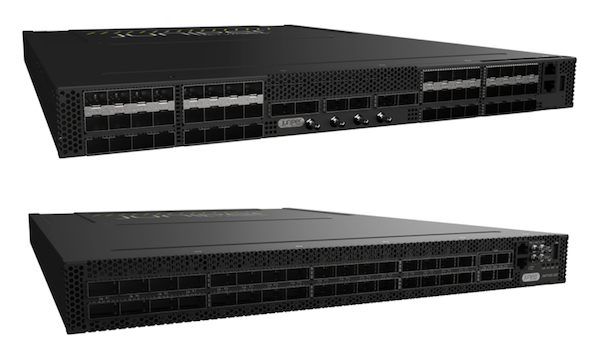

ACX7509: [https://www.juniper.net/documentation/us/en/hardware/acx7509/topics/topic-map/acx7509-system-overview.html](https://www.juniper.net/documentation/us/en/hardware/acx7509/topics/topic-map/acx7509-system-overview.html)

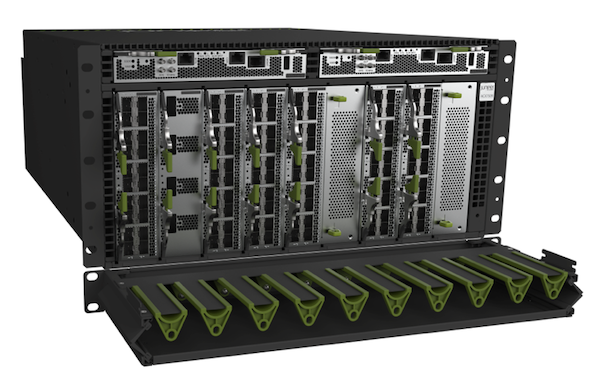

Jericho and Jericho2 generations differ in multiple aspects: starting from the number of variations presented in the list above, but also they present differences in pipeline structure, performance/scale, packet buffering capabilities, and the features they can deliver.

At a high level, the Jericho generation and J2 generation architectures are showing a lot of similarities. In the same package, ingress pipeline receives packets/frames from the NIF (Network Interfaces) and passes cells to a Fabric interface. And an egress pipeline receives cells from the Fabric interface and pushes packets/frames to the appropriate NIF.

Both ingress and egress paths are made of:

- Receive and Transmit Packet Processor blocks (IRPP, ITPP, ERPP, ETPP)
- Traffic Manager blocks managing packet buffering and queues (ITM, ETM)

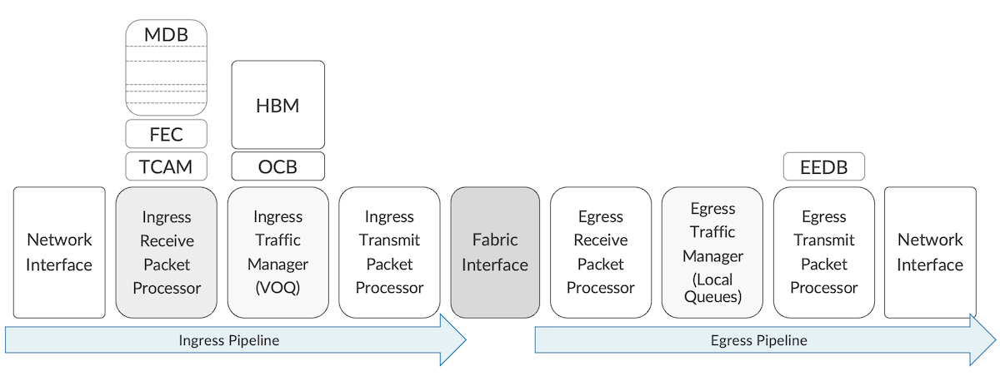

But a deeper look inside the constitutive elements of these ingress and egress paths shows that Jericho2 is a significantly more capable chipset than its predecessor:

- additional blocks in IRPP, and in ETPP, allow higher flexibility in the packet treatment
- the packet header size handled on the Jericho2 is larger (144 bytes vs 128 on Jericho), offering deeper packet parsing capabilities
- larger variety of resources
- larger size of these databases
- flexible resource allocation at boot up with MDB (Modular Database)
- availability of a programmable Elastic Pipeline
- in the majority of the NPUs, an HBM is used for ingress buffering (still based on a VOQ model). Some exceptions exist.
- optionally, a new generation of external TCAM (OP2) can extend the processing information capacity (FIB entries and counters)

All these improvements translate into more bandwidth and Packets per Second (PPS), more interfaces/ports, and larger feature support in one pass, limiting the situations where packet recycling is needed.

## What do We Need to Consider in PFE Selection Process?

Let's take a closer look at all these ASICs and identify the key parameters used to select one or another for a given ACX platform.

### Network and Fabric Interfaces

The Qumran PFEs have no fabric ports and, therefore, are most generally used in standalone mode for "System on the Chip" (SoC) architectures.

In such designs, all available ports are used towards Network Interfaces (NIF). The Jericho PFEs could be used in similar standalone fashion, but in this case, the fabric ports will not be used except to connect to external resources (like the OP2 external TCAM).

It's also possible to use the fabric ports to directly connect to another Jericho ASIC. This option is named "Back-to-Back mode" (B2B).

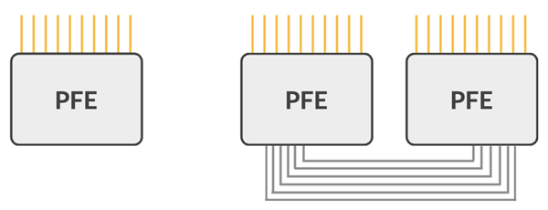

If not used in Back-to-Back or Standalone mode, the last option is of course to interconnect the Jericho2 chipsets via a fabric engine (BCM88790, code name "Ramon"). This chip is of course present on the fabric cards in the modular chassis architecture, but it can also be used in fixed-form factor routers ("pizza box").

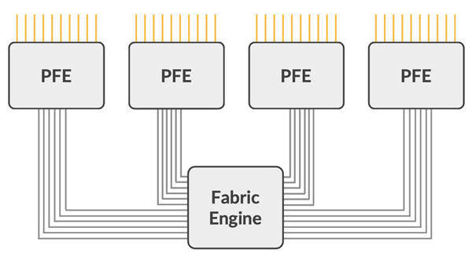

We will create 3 types of systems:

- fixed platforms
- centralized platforms
- modular chassis

The Fixed platforms could be potentially built around all kind of architecutre: standalone, Back-to-Back or Leaf-Spine, depending on the required number of ports. With high-bandwidth PFE options at hand, we will privilege the SoC or the B2B approach. Depending on the capacity required, we can use Qumran or Jericho, but only leveraging the fabric links in the B2B case.

As the name implies, a Centralized platform is commonly based on one or two forwarding cards hosting the PFE(s) and a chassis providing connectivity to simplified line cards. These cards are made of port cages, PHY, Gearboxes or retimers. Standalone chipset or B2B can we used in the forwarding cards. We will explain in the next pages why a high density of low-speed interfaces is better addressed by back-to-back NPUs.

The Modular Chassis architectures are based on the segmentation of control plane in Routing Engines (RE), forwarding plane in the line cards and internal cells routing via fabric cards. The leaf-spine design is necessary here, that means ASICs with both NIF and Fabric Interfaces in the Jericho2 Series. The line cards will host one or multiple J2/J2c+ PFEs and the fabric cards will use Ramon chipsets.

### Bandwidth and PPS performance

Now that we know the NPU architecture we will use, we will consider the performance, both in term of bandwidth (Gbps/Tbps) and packet treatment capability (Packets forwarded per second or PPS).

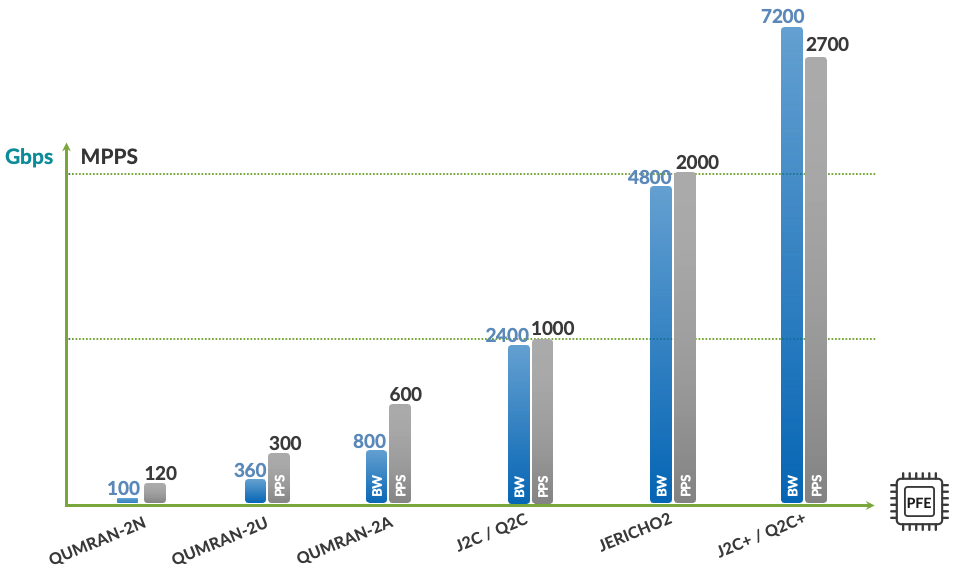

In blue, we represent the bandwidth (in Gbps) and in black, the performance expressed in millions of packets per second (MPPS). You notice the large variety of available options, starting from a "low" 100Gbps Qumran2n to much higher interface bandwidth, with the Jericho2c+ at 7.2Tbps. Of course, we are talking about full-duplex or bi-directional bandwidth here for "revenue interfaces" (not ingress+egress, nor NIF+Fabric).

PPS is not progressing linearly with the Gbps/Tbps bandwidth. It's a global trend explained by a constantly growing larger packet size on the internet traffic. We see more video traffic, live or on demand, with higher definition.

> Please note also that some systems can be purposefully designed with more interfaces than the forwarding capability of the ASIC. We talk about oversubscription and it's very common in the aggregation world.

With current PFE generation, we can create systems or line cards with forwarding capacity matching one or multiple of the following values:

- 100Gbps
- 360Gbps
- 800Gbps
- 1.6Tbps
- 2.4Tbps
- 4.8Tbps
- 7.2Tbps

Let's take some random examples. With these "bricks", we can create:

- stand-alone routers of 360Gbps based on Qumran2u, or 800Gbps based on Qumran2a
- stand-alone routers of 2.4Tbps (Qumran2c), 4.8Tbps (Jericho2)
- centralized routers of 2.4Tbps (Qumran2c) or 4.8Tbps (back-to-back Jericho2c)

It's not a commitment on the future products, just a thought exercise that don't consider key factors such as: footprint on the printed circuit boards (PCB), power and cooling capacity or front panel space.  Still, the ACX7100 based on Jericho2 and ACX7509 based on back-to-back Q2c are already shipping today.

### Port Macros

Now that we know the forwarding capacity of our router, we need to distribute it among Ethernet interfaces of different speeds and that where the concept of Port Macro (PM) comes in the picture.

PMs are blocks of SerDes (serializer/deserializer) connecting the PFE to other elements inside the router including Network Interfaces and Fabric Ports. [https://docs.broadcom.com/doc/Hardware-Design-Guidelines-for-StrataDNX-16-nm-Devices](https://docs.broadcom.com/doc/Hardware-Design-Guidelines-for-StrataDNX-16-nm-Devices)

Current Jericho2/Qumran2 generation are using:

- PM25 (Falcon16), a block of 4 serial links used for network interfaces
- PM50 (BlackHawk), a block of 8 serial links used for both network interfaces and fabric.

The use and support of one PM type or another has a direct impact on the Ethernet ports we will support. First, let's review the PM block types associated with each PFE:

- Qumran2n and Qumran2u use only PM25
- Jericho2x, Jericho2 and Jericho2c+ will rely only on PM50
- Qumran2a and Jericho2c/Qumran2c have a mix of both in different proportions

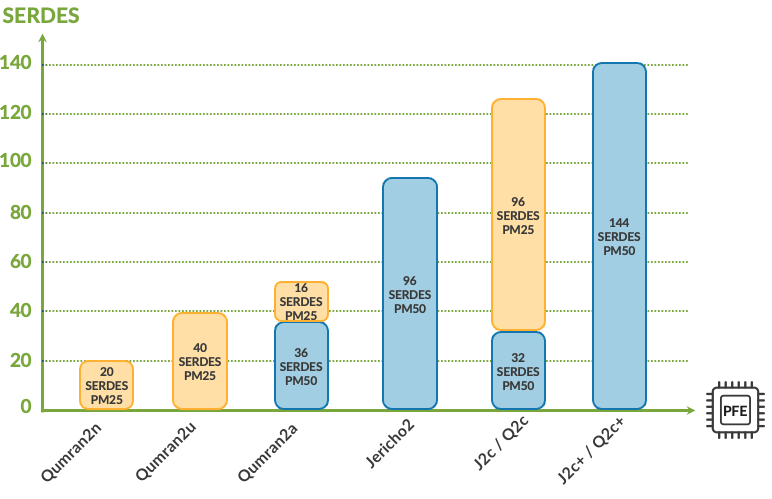

*Port Macros association with NPUs*

In the BCM88800 datasheet, Broadcom details the various speeds supported by Falcon16 and Blackhawk. We extract the following from the third chapter of this document:

*Ethernet Port Macros (PMs)*

```
PM50

- Each PM50 includes an octal SerDes (Blackhawk) supporting up to 53.125 Gb/s
- Each PM50 supports the following Ethernet configurations:

1 x 400GbE port over eight lanes (PAM4)
2 x 200GbE ports over four lanes (PAM4)
4 x 100GbE ports over two lanes (PAM4)
2 x 100GbE ports over four lanes
8 x 50GbE ports over one lane (PAM4)
4 x 50GbE ports over two lanes
4 x 40GbE ports over two lanes
2 x 40GbE ports over four lanes
8 x 25GbE ports over one lane
8 x 12GbE ports over one lane
8 x 10GbE ports over one lane

PM25

- Each PM25 includes a quad SerDes (Falcon16) supporting up to 25.78125 Gb/s
- Each PM25 supports the following Ethernet configurations:

1 x 100GbE port over four lanes
2 x 50GbE ports over two lanes
2 x 40GbE ports over two lanes
1 x 40GbE port over four lanes
4 x 25GbE ports over one lane
4 x 12GbE ports over one lane
4 x 10GbE ports over one lane
4 x 1GbE ports over one lane
```

Without detailing all combinations, let's just pay attention to the Min/Max of the supported speed range. PM25 can service from 1GE (over a single 1Gbps lane) to 100GE (over four 25Gbps lanes), but no 200GE or 400GE. PM50 can connect 10GbE ports (over a single 10Gbps lane) to 400GE port (over eight lanes) but no 1GE.

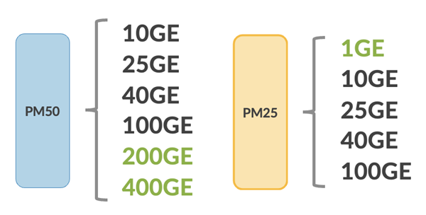

In consequence,

- Qumran2n and Qumran2u can't directly offer 400GE
- Jericho2x, Jericho2 and Jericho2c+ can't directly offer 1GE
- Qumran2a and Jericho2c/Qumran2c are the only ones capable of a 1GE to 400GE range support

These capabilities are crucial in the PFE selection process. It's not only the bandwidth that drives the choice but what kind of Ethernet ports you would like to offer on the product.

For your reference, a list of the different speeds required for each interface type:

| Gbps | Encoding | Host Interfaces |
|:--|:--|:--|
| 106.25 | PAM4 | 800GAUI-8 / 400GAUI-4 / 200GAUI-2 / 100GAUI-1 |
| 53.125 | PAM4 | 400GAUI-8 / 200GAUI-4 / 100GAUI-2 / 50GAUI-1 |
| 26.5625 | NRZ | 200GAUI-8 / 100GAUI-4 / 50GAUI-2 |
| 25.78125 | NRZ | 200GAUI-8 / 100GAUI-4 / 50GAUI-2 |
| 10.3125 | NRZ | XLAUI / XFI / SFI |
| 1.25 | NRZ | SGMII |

> Note: Jericho2 ASICs family is using PM25 and PM50, therefore no support for 100Gbps SerDes which means no 800GE interfaces.

Before wrapping up this section on Port Macro, let's briefly talk about Gearbox. These third-party elements are frequently used in the networking devices to extend the reach the traces in a PCB, or to change speed, encoding scheme and error correction mechanisms of the SerDes.

A device aggregating links of lower speed from the PFE to expose a lower number of higher speed lanes to the network interface is called "Forward Gearbox" (or just "Gearbox").

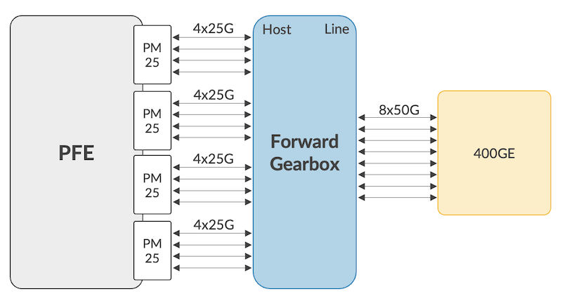

If the chipset performs the opposite task (fewer lane of higher speed on the Host side transformed into higher number of links of lower speed on the line side), we talk about "Reverse Gearbox".

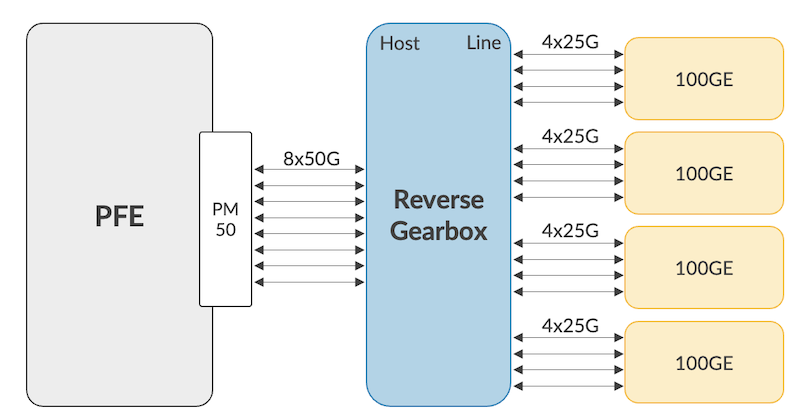

Finally, if this element only "relays" the lanes, we talk about retimer.

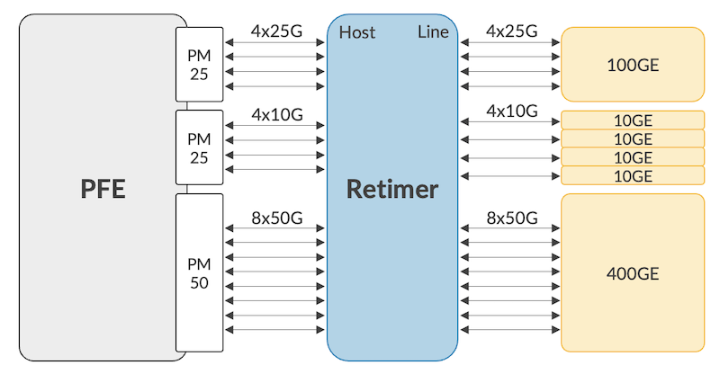

They can offer additional services, like MACsec encryption and timing support, potentially completing or replacing the PFE job. Finally, they can be used in Mux mode. An handy feature to redirect traffic from an active to a standby forwarding card or to duplicate traffic to multiple destinations.

They have their own set of limitations:

- the number of lanes they can handle: it reflects of the number of break-out we can configure (sometimes, forcing the "shutdown" or "unused" configuration of the N+1 port)
- the supported speeds: some products don't support 1Gbps
- the additional cost and power consumption

The latency is not zero but minimal (a few nanoseconds).

### Scales

Other key parameters to take into consideration when building an ACX router are the supported scales like the FIB size, the numbers of Virtual Output Queues or number of counters/stats we can allocate. It will help answering key questions like:

- Will it support the internet table in 5 years?
- How many customers will I be connecting per router?
- And what kind of services will I be able to sell them (and monitor it)?

Let's start with the FIB table. In mid-2022, the average IPv4 public table reaches 920k entries ([https://twitter.com/bgp4_table](https://twitter.com/bgp4_table)) while the IPv6 table already passed the 150k ([https://twitter.com/bgp6_table](https://twitter.com/bgp6_table)). If you consider the advertised prefixes advertised on internet, you can vaguely estimate the v6 entries will use twice the size of the IPv4 ones (max 24 bits subnet mask length for IPv4 and below /48 for IPv6). A wet finger guesstimation that won't work any longer if you add your IGP table to the equation. Certain roles can potentially require big routing scale with more than 1.3M entries, day one.

In the Jericho2 generation, these routes will be stored in the LPM (Longest Prefix Match) table, itself carved inside a Modular Database (MDB). At the boot up sequence, we allocate more or less space based on hardware profile configuration

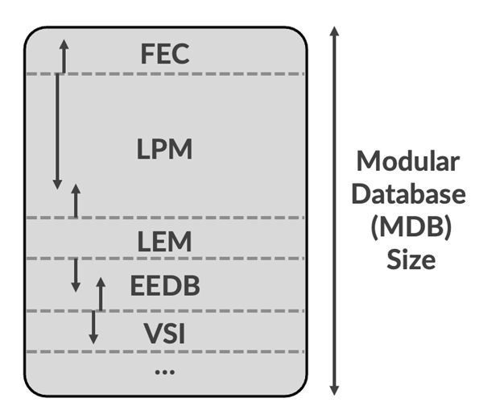

To optimize the ACX7000 in a routing role, we can privilege the LPM allocation in the MDB space with an L3-XL profile. Also, it possible to extend this FIB space with an external TCAM (OP2) where we will store more routes and statistics.

We will categorize the ACX7000 use-cases in the following three buckets:

| Requirements | NPU Powering the ACX7000 Router |
|:--|:--|
| No Need for full Internet table | Qumran2n/2u/2a |
| Max 2.2M/2.4M entries | Jericho2/2x/2c/2+ |
| More than 2,2M entries or extra statistics needs | Jericho2 with OP2 eTCAM |

These numbers are not necessarily reflecting the PFE capabilities (DRAM and CPU could be sized for low RIB/FIB scales), also they are unidimensional and always need to be taken with a grain of salt.

Aside the routing scale, other parameters can drive the selection process in one direction or another. For example, the queue scale will have a direct impact on the number of sub-interfaces you want to configure for your customers. Since the forwarding architecture is based on an ingress-buffering, VOQ-based model, the queue scale should be considered a global resource, by default. Depending on the ASIC selected, it will span from 32k to 128k with current systems we target.

Finally, let's briefly the counters scale. If you need to apply services on many interfaces (logical or sub-interfaces), you'll consume a lot of the statistic resource. In the links below, you'll find options supporting from 32k to 384k entries. If it's not enough for the role you target, the OP2 external TCAM can also be used to extend the scale.

### Other Considerations

It has been briefly covered when describing the Gearbox chipsets, if a PFE can not offer specific services such as MACsec, it will need to be completed by another specialized part.

Currently, among the available DNX options, Jericho2x and Jericho2c+ support MACsec encryption line rate on 10GE up to 400GE interfaces.

Finally, I'll mention one last question we have to ask ourselves when building a router series: do I need to support extreme environmental conditions and if so, what is the availability of an iTemp version of the chipset?

## Conclusion

This article aimed at getting familiar with the internals of the ACX7000 Series, by listing the many parameters we need to consider in the PFE selection to closely match the targeted use-cases. We detailed the bandwidth, the SerDes types and quantity, potentially with the assistance of gearbox, the embedded services, and various scales like FIB, VOQ or statistics.

The list is not meant to be exhaustive.

In the next articles, we will detail the hardware design decisions enabling unique cooling capabilities and we will demonstrate we can run systems fully loaded with high-power ZR optics.

## Useful links

Second article on VOQ and Life of a packet in DNX chipset: [https://juniper.github.io/techposts/voq-and-dnx-pipeline/article](https://juniper.github.io/techposts/voq-and-dnx-pipeline/article)

BCM88280 - Qumran2u

- Datasheet: [https://www.broadcom.com/products/ethernet-connectivity/switching/stratadnx/bcm88280](https://www.broadcom.com/products/ethernet-connectivity/switching/stratadnx/bcm88280)
- [https://docs.broadcom.com/doc/88280-DS107-PUB](https://docs.broadcom.com/doc/88280-DS107-PUB)
- [https://docs.broadcom.com/doc/88690-88800-88480-88280-Packet-Processing-Programming-Guide](https://docs.broadcom.com/doc/88690-88800-88480-88280-Packet-Processing-Programming-Guide) (same doc for BCM8869X, BCM8880X, BCM8848X, BCM8828X, BCM8883X)

BCM88290 - Qumran2n

- GDDR6 info: [https://docs.broadcom.com/doc/DNX16-AN123-PUB](https://docs.broadcom.com/doc/DNX16-AN123-PUB) (chapter 7)

BCM88480 - Qumran2a

- Datasheet: [https://www.broadcom.com/products/ethernet-connectivity/switching/stratadnx/bcm88480](https://www.broadcom.com/products/ethernet-connectivity/switching/stratadnx/bcm88480)
- [https://docs.broadcom.com/doc/88480-DS112-PUB](https://docs.broadcom.com/doc/88480-DS112-PUB)
- [https://docs.broadcom.com/doc/88480-DG2-PUB](https://docs.broadcom.com/doc/88480-DG2-PUB)
- [https://docs.broadcom.com/doc/88480-DG1-PUB](https://docs.broadcom.com/doc/88480-DG1-PUB)
- [https://docs.broadcom.com/doc/88690-88800-88480-88280-Packet-Processing-Programming-Guide](https://docs.broadcom.com/doc/88690-88800-88480-88280-Packet-Processing-Programming-Guide) (same doc for BCM8869X, BCM8880X, BCM8848X, BCM8828X, BCM8883X)

BCM88690 - Jericho2

- Datasheet: [https://www.broadcom.com/products/ethernet-connectivity/switching/stratadnx/bcm88690](https://www.broadcom.com/products/ethernet-connectivity/switching/stratadnx/bcm88690)
- [https://docs.broadcom.com/doc/BCM88690-9-6-Tb/s-Integrated-Packet-Processor-Traffic-Manager-and-Fabric-Interface-Single-Chip-Device-DS](https://docs.broadcom.com/doc/BCM88690-9-6-Tb/s-Integrated-Packet-Processor-Traffic-Manager-and-Fabric-Interface-Single-Chip-Device-DS)
- [https://docs.broadcom.com/doc/88690-88800-88480-88280-Packet-Processing-Programming-Guide](https://docs.broadcom.com/doc/88690-88800-88480-88280-Packet-Processing-Programming-Guide) (same doc for BCM8869X, BCM8880X, BCM8848X, BCM8828X, BCM8883X

BCM88800 - Jericho2c

- Datasheet: [https://www.broadcom.com/products/ethernet-connectivity/switching/stratadnx/bcm88800](https://www.broadcom.com/products/ethernet-connectivity/switching/stratadnx/bcm88800)
-
- [https://docs.broadcom.com/doc/88800-DG1-PUB](https://docs.broadcom.com/doc/88800-DG1-PUB)
- [https://docs.broadcom.com/doc/88690-88800-88480-88280-Packet-Processing-Programming-Guide](https://docs.broadcom.com/doc/88690-88800-88480-88280-Packet-Processing-Programming-Guide) (same doc for BCM8869X, BCM8880X, BCM8848X, BCM8828X, BCM8883X)

BCM88830 - Jericho2x

- Datasheet: [https://www.broadcom.com/products/ethernet-connectivity/switching/stratadnx/bcm88830](https://www.broadcom.com/products/ethernet-connectivity/switching/stratadnx/bcm88830)
- [https://docs.broadcom.com/doc/BCM88830-Integrated-PP-TM-and-Fabric-Interface-Single-Chip-Device-DS](https://docs.broadcom.com/doc/BCM88830-Integrated-PP-TM-and-Fabric-Interface-Single-Chip-Device-DS)
- [https://docs.broadcom.com/doc/88690-88800-88480-88280-Packet-Processing-Programming-Guide](https://docs.broadcom.com/doc/88690-88800-88480-88280-Packet-Processing-Programming-Guide) (same doc for BCM8869X, BCM8880X, BCM8848X, BCM8828X, BCM8883X)

BCM88820 - Qumran2c

- Datasheet: [https://www.broadcom.com/products/ethernet-connectivity/switching/stratadnx/bcm88820](https://www.broadcom.com/products/ethernet-connectivity/switching/stratadnx/bcm88820)

BCM88850 - Jericho2c+

- Datasheet: [https://www.broadcom.com/products/ethernet-connectivity/switching/stratadnx/bcm88850](https://www.broadcom.com/products/ethernet-connectivity/switching/stratadnx/bcm88850)
- [https://docs.broadcom.com/doc/88850-PB1-PUB](https://docs.broadcom.com/doc/88850-PB1-PUB)
- Useful description of the Packet Processing: [https://docs.broadcom.com/doc/88480-DG2-PUB](https://docs.broadcom.com/doc/88480-DG2-PUB)

## Glossary

- AUI: Attachment Unit Interface
- B2B: Back to Back
- DNX: Broadcom PFEs based on Dune Networks acquisition
- EEDB: Encap Database
- ERPP: Egress Receive Packet Processor
- ETM: Egress Traffic Manager
- ETPP: Egress Transmit Packet Processor
- FIB: Forwarding Information Base
- HBM: High Bandwidth Memory
- IRPP: Ingress Receive Packet Processor
- ITM: Ingress Traffic Manager
- ITPP: Ingress Transmit Packet Processor
- LPM: Longest Prefix Match
- MDB: Modular Database
- MPPS: Million Packet per Second
- NIF: Network Interface
- NPU : Network Processing Unit
- NRZ: Non-Return to Zero
- OCB: On-Chip Buffer
- OP2: Olympus Prime v2
- PAM4: Pulse Amplitude Modulation 4
- PCB: Printed Circuit Board
- PFE : Packet Forwarding Engine
- PM: Port Macro
- RE: Routing Engine
- SerDes: Serializer-Deserializer
- SoC: System on Chip
- VOQ: Virtual Output Queue
