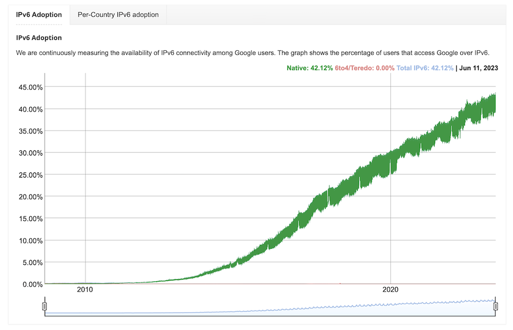
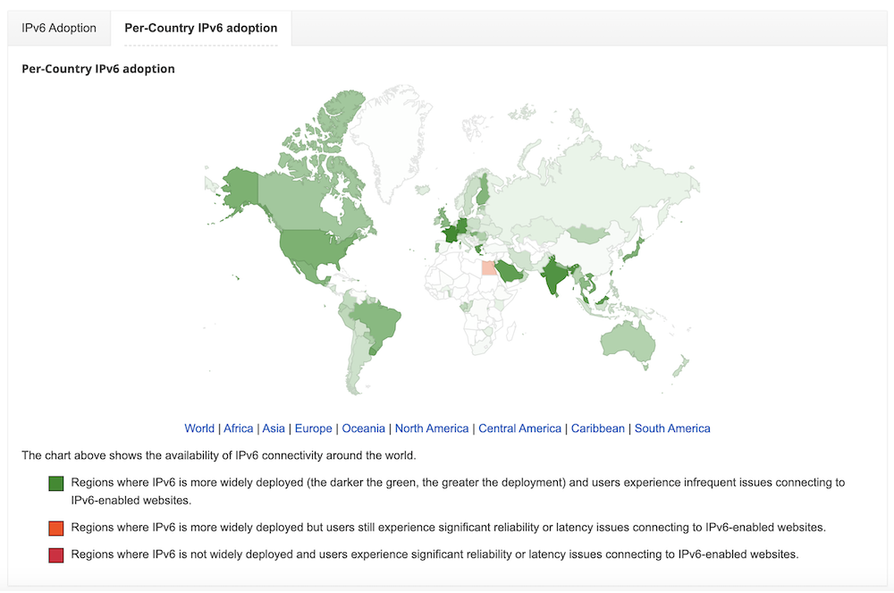
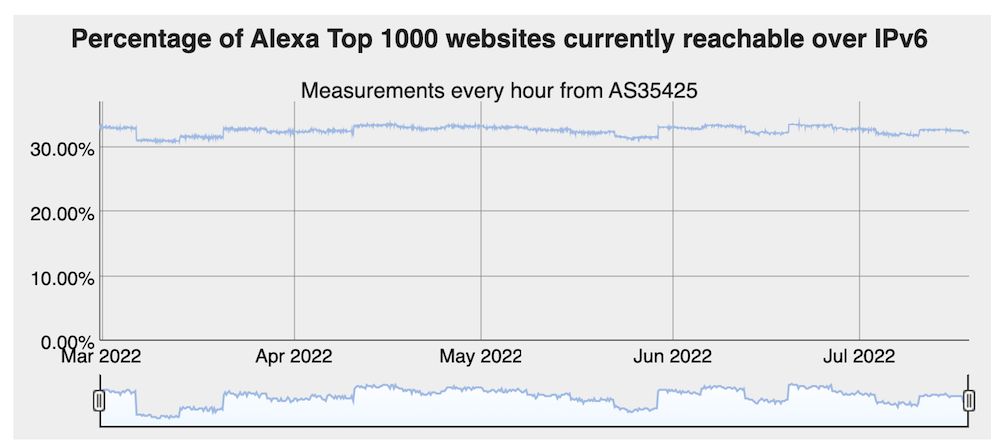
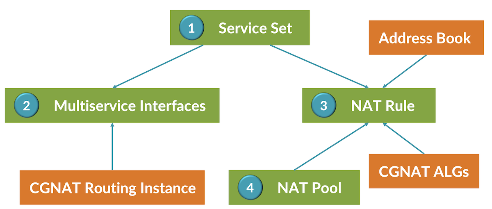
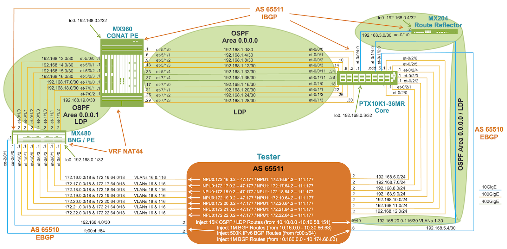
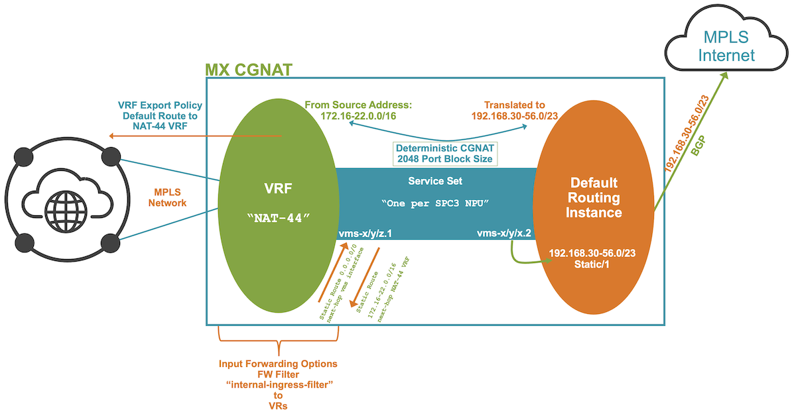

# Centralized Deterministic CGNAT

**Ricardo Dominguez - 08/03/2023**

All you need to know on Centralized Deterministic NAT configuration, scale and performance on MX routers.

## Introduction

Internet Assigned Numbers Authority (IANA) allocated the last 5 IPv4 addresses blocks on February 3, 2011.

RIPE NCC run out of IPv4 addresses, it allocated the final /22 IPv4 address on November 25, 2019.

IPv6 adoption started more than 10 years ago and till June 2023, only 40% of the Internet traffic is over IPv6.



Worldwide IPv6 usage, it varies country by country, Uruguay, USA, Mexico and Brazil lead IPv6 adoption in America; France, Germany and Finland in Europe; India, Malaysia and Japan in Asia; while Africa has few IPv6 endorsement.



In July 2022, about 33% of websites were just IPv6.



IPv4 still dominates and will continue dominating Internet traffic for a while, CGNAT is widely needed due to public IPv4 address exhaustion and the number of connected devices has overcome the IPv4 address space.

## IPv4 NAT Alternatives

There're many IPv4 NAT alternatives widely used, either, basic NAT, static source NAT,  destination NAT and Dynamic NAT.

NAT44 mainly involves three NAT alternatives: Dynamic NAT, Port Block Allocation (PBA) and Deterministic NAT.

|  | Dynamic NAT | NAT w/ BPA | Deterministic NAT |
|:--|:--|:--|:--|
| Logging | High | Low | Null |
| Security | High | Medium | Medium |
| Ratio Subscribers / IP Public | High | Low | Low |

### Dynamic NAT

Dynamic NAT allows mapping private IPv4 address (M) to public IPv4 address (N) from a pool, typically this M:N relation means many private IPv4 addresses to few public IPv4 addresses using port translation. Public IPv4 addresses are assigned dynamically.

This kind of NAT involves high volume of logging, a log is created for a source private IP/Port to source public IP/Port translation, it requires a high storage capacity in logging servers. The security for this NAT is high as the public IP/Port can fall in any of the 64,512 port available per public IP. The subscribers/IP public ratio is excellent as it can use the total of the 64,512 port per public IP, meaning less public IP addresses waste.

### NAT w/PBA

NAT w/PBA is a Dynamic NAT alternative, which assigns a block of ports per private IPv4 addresses. Using PBA reduces drastically the number of log entries, a port block is assigned to the first source private IP/Port to source public IP/Port translation, the rest of the same source private IPs will use same port block, only a log entry will be created for this port block, if the same source private IP needs more ports, another block can be assigned and new log entry will be generated for this new block.

When having PBA, the subscribers/IP public ratio can lead to some public IP addresses waste, In order to minimize this waste, it's important to assign smaller port blocks per private IP and if needed, then add more blocks to same private IP.

### Deterministic NAT

Deterministic NAT works similar to PBA in terms of allocating a block of ports per private IP but instead of generating a log entry to logging server, the entry is registered locally in Juniper MX router, the relation between source private IP/Port to corresponding public IP/Port block is setup when creating Deterministic NAT configuration and log server is no longer needed. A similar block of ports design as in the case of PBA is recommended to reduce wasting public IP addresses.

## CGNAT Configuration Blocks

CGNAT configuration is quite simple if we follow/understand each of its configuration parts, I call building blocks to these parts, the CGNAT processing relies on Juniper MX SPC3 services card.



### Service Set

It's the main CGNAT building block, it groups the inside and outside multiservice interfaces along the NAT rule, this is where the translation takes place. The packets toward the inside multiservice interface are translated based on the NAT rule defined under this service-set.

Having a next-hop style service represents an inside multiservice interface (private network addressing) and the outside multiservice interface (public network addressing).

Following is typical service-set configuration:

```
services {
    service-set PIC1_0 {
        stateful-firewall-rules ALLOW-ALL;
        nat-rule-sets CGNAT_IN_PIC1_0_SET;
        next-hop-service {
            inside-service-interface vms-1/0/0.1;
            outside-service-interface vms-1/0/0.2;
        }
    }
}
```

###

### Firewall

A firewall rule is needed for the service-set, this firewall rule can accept everything as shown below or can do firewalling based on specific requirements.

```
services {
    policies {
        stateful-firewall-rule ALLOW-ALL {
            match-direction input;
            policy ACCEPT {
                match {
                    source-address any;
                    destination-address any;
                    application any;
                }
                then {
                    permit;
                }
            }
        }
    }
}
```

###

### Multiservice Interface

The multiservice interface has 2 legs, one to the private network (inside) and one to public network (outside), the inside multiservice interface is in charge to send traffic to the Juniper MX SPC3 service card, so traffic can be translated. These interfaces are numbered according to the slot which SPC3 is inserted, PIC0 represents SPC3 NPU0 and PIC1 represents SPC3 NPU1, the port number is always 0.

A typical multiservice interface configuration is shown:

```
interfaces {
    vms-1/0/0 {
        unit 1 {
            family inet;
            service-domain inside;
        }
        unit 2 {
            family inet;
            service-domain outside;
        }
    }
}
```

###

### CGNAT Routing Instance

The inside multiservice interface is assigned to a routing-instance, either a VRF or VR, these are used to send traffic to the corresponding mutiservice interface in next-hop CGNAT solution. A VR configuration displayed below:

```
routing-instances {
 PIC1_0 {
        instance-type virtual-router;
        interface vms-1/0/0.1;
        routing-options {
            static {
                route 0.0.0.0/0 next-hop vms-1/0/0.1;
            }
        }
    }
}
```

###

### NAT Rule

The NAT identifies the source private addressing and based on the source addressing along the ALGs does the source NAT, it calls a pool in the source NAT action.

A NAT rule is defined under a NAT rule-set, the NAT rule-set can have multiple NAT rules. A NAT Rule configuration:

```
services {
    nat {
        source {
            rule-set CGNAT_IN_PIC1_0_SET {
                rule CGNAT_IN_PIC1_0_RULE {
                    match {
                        source-address-name RANGE_1_0;
                        application APPS;
                    }
                    then {
                        source-nat {
                            pool {
                                PIC1_0;
                            }
                        }
                    }
                }
                match-direction input;
            }
        }
    }
}
```

###

### Address Book

An address books contains address ranges, private source addressing is defined under these ranges. An address book configuration is below:

```
services {
    address-book {
        global {
            address RANGE_1_0 {
                address-range 172.16.0.2/32 {
                    to {
                        172.16.47.177/32;
                    }
                }
            }
        }
    }
}
```

###

### CGNAT ALGs

Application Layer Gateways allows applications to work within NAT, Junos includes a rich ALGs for NAT such as FTP, DNS, H323, ICMP, SIP, RSTP, PPTP, SNMP, TFTP, etc. Most applications have evolved to function in an IPv4 NAT, working in the application layer.

An example of ALGs configuration:

```
applications {
    application-set APPS {
        application appl-junos-sip;
        application appl-junos-syslog;
    }
    application appl-junos-sip {
        application-protocol sip;
        protocol udp;
        destination-port 5060;
        inactivity-timeout 3600;
        learn-sip-register;
        sip-call-hold-timeout 36000;
    }
    application appl-junos-syslog {
        protocol udp;
        destination-port 514;
        inactivity-timeout 30;
    }
}
```

###

### NAT Pool

The NAT pool contains the public IPv4 address to which private addressing  will be translated, the ports range available per public IPv4 address, if PBA or Deterministic NAT are used, it then also includes the port block-size and the IPv4 private addressing.

A Pool with deterministic CGNAT is shown:

```
services {
    nat {
        source {
            pool PIC1_0 {
                address {
                    192.168.30.0/32 to 192.168.31.255/32;
                }
                port {
                    range {
                        2048;
                        to {
                            65535;
                        }
                    }
                    deterministic {
                        block-size 2048;
                        host address-name RANGE_1_0;
                        include-boundary-addresses;
                    }
                }
            }
        }
    }
}
```

## CGNAT Deterministic NAT44

One of the Service Providers concerns when deploying a centralized CGNAT solution, it's the fact to modify or alter routing in order to send private IPv4 traffic to a centralized CGNAT solution. An alternative to this concern is the usage of a CGNAT VRF through the MPLS network, in which different BNG / PEs private IPv4 traffic is send dynamically through a CGNAT VRF to centralized CGNAT PE.

A topology with this scenario is show below, this topology will be used for CGNAT scalability testing.

A BNG or PE receives private IPv4 traffic across different access interfaces which are assigned to CGNAT VRF, MX480 in our testing topology is acting as such PE. This PE in its CGNAT VRF receives a default route to points traffic to same VRF in CGNAT PE. Through this default route traffic will be routed from Remote PEs to CGNAT PE through MPLS network.

PTX10K1-36MR is acting a peering node emulating Internet peering and public IP addressing, to have a more realistic scenario, a 15K OSPF and 15K LDP routes are being injected to PTX10K1-36MR and such routes are sent to both CGNAT PE and remote PE. 2M IPv4 routes are also injected to duplicate the size of the Internet IPv4 table and 500K IPv6 routes are tripling the IPv6 Internet table.



MX960 is acting as CGNAT PE, it includes 2 x MPC10E for access and uplink connections, it also has 400G interfaces for uplink connections, to perform CGNAT functions, it has 7 x SPC3 LC. See below:

```
jnpr@HERCULES-RE0> show chassis hardware | no-more 
Hardware inventory:
Item             Version  Part number  Serial number     Description
Chassis                                JN125E69xxxx      MX960
Midplane         REV 04   750-047849   ACRFxxxx          Enhanced MX960 Backplane
FPM Board        REV 03   710-014974   CAFXxxxx          Front Panel Display
PDM              Rev 01   740-063049   QCS1936xxxx       Power Distribution Module
PEM 0            Rev 11   740-027760   QCS1934xxxx       PS 4.1kW; 200-240V AC in
PEM 1            Rev 10   740-027760   QCS1717xxxx       PS 4.1kW; 200-240V AC in
PEM 2            Rev 11   740-027760   QCS1930xxxx       PS 4.1kW; 200-240V AC in
PEM 3            Rev 11   740-027760   QCS1934xxxx       PS 4.1kW; 200-240V AC in
Routing Engine 0 REV 05   750-072925   CAMGxxxx          RE-S-2X00x6
Routing Engine 1 REV 05   750-072925   CALGxxxx          RE-S-2X00x6
CB 0             REV 29   750-070866   CAMAxxxx          Enhanced MX SCB 3
CB 1             REV 29   750-070866   CAMFxxxx          Enhanced MX SCB 3
CB 2             REV 29   750-070866   CAMFxxxx          Enhanced MX SCB 3
FPC 1            REV 31   750-073435   CANBxxxx          SPC3
  CPU                     BUILTIN      BUILTIN           SPC3 vCPP Broadwell
  PIC 0                   BUILTIN      BUILTIN           SPC3-PIC
  PIC 1                   BUILTIN      BUILTIN           SPC3-PIC
FPC 2            REV 32   750-073435   CAPBxxxx          SPC3
  CPU                     BUILTIN      BUILTIN           SPC3 vCPP Broadwell
  PIC 0                   BUILTIN      BUILTIN           SPC3-PIC
  PIC 1                   BUILTIN      BUILTIN           SPC3-PIC
FPC 3            REV 32   750-073435   CANGxxxx          SPC3
  CPU                     BUILTIN      BUILTIN           SPC3 vCPP Broadwell
  PIC 0                   BUILTIN      BUILTIN           SPC3-PIC
  PIC 1                   BUILTIN      BUILTIN           SPC3-PIC
FPC 4            REV 29   750-073435   CAMRxxxx          SPC3
  CPU                     BUILTIN      BUILTIN           SPC3 vCPP Broadwell
  PIC 0                   BUILTIN      BUILTIN           SPC3-PIC
  PIC 1                   BUILTIN      BUILTIN           SPC3-PIC
FPC 5            REV 48   750-078633   EAAAxxxx          MPC10E 3D MRATE-10xQSFPP
  CPU            REV 21   750-072571   EAAAxxxx          FMPC PMB
  PIC 0                   BUILTIN      BUILTIN           MRATE-5xQSFPP
    Xcvr 0       REV 01   740-061405   1ECQ152xxxx       QSFP-100G-SR4-T2
    Xcvr 1       REV 01   740-061405   1ECQ152xxxx       QSFP-100G-SR4-T2
    Xcvr 2       REV 01   740-061405   1ECQ152xxxx       QSFP-100G-SR4-T2
    Xcvr 3       REV 01   740-061405   1ECQ155xxxx       QSFP-100G-SR4-T2
  PIC 1                   BUILTIN      BUILTIN           MRATE-5xQSFPP
    Xcvr 0       REV 01   740-061405   1ECQ152xxxx       QSFP-100G-SR4-T2
    Xcvr 1       REV 01   740-061405   1ECQ155xxxx       QSFP-100G-SR4-T2
    Xcvr 2       REV 01   740-061405   1ECQ152xxxx       QSFP-100G-SR4-T2
    Xcvr 3       REV 01   740-061405   1ECQ152xxxx       QSFP-100G-SR4-T2
    Xcvr 4       REV 01   740-090165   2H2TSAA52xxxx     QSFP56-DD-400G-AOC-3M
FPC 7            REV 47   750-070395   CAMWxxxx          MPC10E 3D MRATE-15xQSFPP
  CPU            REV 19   750-072571   CAMXxxxx          FMPC PMB
  PIC 0                   BUILTIN      BUILTIN           MRATE-5xQSFPP
    Xcvr 0       REV 01   740-061405   1ECQ152xxxx       QSFP-100G-SR4-T2
    Xcvr 1       REV 01   740-061405   1ECQ155xxxx       QSFP-100G-SR4-T2
    Xcvr 2       REV 01   740-061405   1ECQ152xxxx       QSFP-100G-SR4-T2
  PIC 1                   BUILTIN      BUILTIN           MRATE-5xQSFPP
    Xcvr 0       REV 01   740-061405   1ECQ152xxxx       QSFP-100G-SR4-T2
    Xcvr 1       REV 01   740-061405   1ECQ152xxxx       QSFP-100G-SR4-T2
    Xcvr 2       REV 01   740-061405   1ECQ153xxxx       QSFP-100G-SR4-T2
    Xcvr 3       REV 01   740-061405   1ECQ152xxxx       QSFP-100G-SR4-T2
    Xcvr 4       REV 01   740-090165   2H2TSAA52xxxx     QSFP56-DD-400G-AOC-3M
  PIC 2                   BUILTIN      BUILTIN           MRATE-5xQSFPP
FPC 8            REV 32   750-073435   CANGxxxx          SPC3
  CPU                     BUILTIN      BUILTIN           SPC3 vCPP Broadwell
  PIC 0                   BUILTIN      BUILTIN           SPC3-PIC
  PIC 1                   BUILTIN      BUILTIN           SPC3-PIC
FPC 9            REV 31   750-073435   CAMPxxxx          SPC3
  CPU                     BUILTIN      BUILTIN           SPC3 vCPP Broadwell
  PIC 0                   BUILTIN      BUILTIN           SPC3-PIC
  PIC 1                   BUILTIN      BUILTIN           SPC3-PIC
FPC 10           REV 32   750-073435   CANBxxxx          SPC3
  CPU                     BUILTIN      BUILTIN           SPC3 vCPP Broadwell
  PIC 0                   BUILTIN      BUILTIN           SPC3-PIC
  PIC 1                   BUILTIN      BUILTIN           SPC3-PIC
Fan Tray 0       REV 01   740-057995   ACDDxxxx          Enhanced Fan Tray
Fan Tray 1       REV 01   740-057995   ACDDxxxx          Enhanced Fan Tray
```

A Deterministic CGNAT was chosen in order to minimize syslog entries to an eternal logging system. MX980 is running Junos 21.2R3 version.

The following diagram shows MX960 CGNAT process.



MX960 has MPLS interfaces through which private IPv4 traffic is received, this traffic is assigned to CGNAT VRF (same VRF in remote PEs), this VRF advertises a default route to remote PEs, so these PE can send traffic via MPLS network to the CGNAT PE. An input CGNAT VRF forwarding-options FW Filter sends IPv4 private traffic to different VRs based on the source IPv4 subnet, each VR corresponds to a SPC3 NPU.

Traffic arrives to internal VRs and it's sent to inside multiservice interface via a static route, this multiservice interface is bound to SPC3 NPU, so traffic can be NATed, a NAT rule performs Deterministic NAT.

Once traffic has been NATed, a static route with public address is programmed in routing table pointed to outside multiservice interface, this route is created with a static protocol preference of 1. A policy-statement is used to announce public address through BGP.

When traffic comes from Internet, it's matched with such static route and pointed to outside multiservice interface, this interface pertains to a SPC3 NPU and traffic is translated from public addressing to corresponding private addressing and sent to inside multiservice interface's VR. Another VR static route sends traffic from each VR to CGNAT VRF, so this traffic can be sent to its remote PE via MPLS network.

### Sessions Scalability

A 24 million sessions are processes per each SPC3 NPU, for a total of 336 million sessions in MX960.

The show services sessions count command shows the total number of current sessions being handled by the MX.

```
jnpr@HERCULES-RE0> show services sessions count 


Interface   Service set                        Valid      Invalid      Pending  Other state
vms-1/0/0   PIC1_0                          23151274            0            0            0
vms-1/1/0   PIC1_1                          23102769            0            0            0
vms-2/0/0   PIC2_0                          24017927            0            0            0
vms-2/1/0   PIC2_1                          23955501            0            0            0
vms-3/0/0   PIC3_0                          23796227            0            0            0
vms-3/1/0   PIC3_1                          23777050            0            0            0
vms-4/0/0   PIC4_0                          24000000            0            0            0
vms-4/1/0   PIC4_1                          24000000            0            0            0
vms-8/0/0   PIC8_0                          24000000            0            0            0
vms-8/1/0   PIC8_1                          24000000            0            0            0
vms-9/0/0   PIC9_0                          24000000            0            0            0
vms-9/1/0   PIC9_1                          24000000            0            0            0
vms-10/0/0  PIC10_0                         24000000            0            0            0
vms-10/1/0  PIC10_1                         24000000            0            0            0
```

To check the creation of the pre-NAT, post NAT, and non-NAT'd sessions within the specified service set:

```
jnpr@HERCULES-RE0> show services sessions source-prefix 172.17.13.13 
Session ID: 98784248804, Service-set: PIC2_0, Policy name: ACCEPT/131089, State: Stand-alone, Timeout: 286, Valid
  In: 172.17.13.13/2329 --> 192.168.8.13/80;tcp, Conn Tag: 0x0, If: vms-2/0/0.1, Pkts: 7, Bytes: 523, 
  Out: 192.168.8.13/80 --> 192.168.34.107/48766;tcp, Conn Tag: 0x0, If: vms-2/0/0.2, Pkts: 54, Bytes: 78044, 

Session ID: 167503726581, Service-set: PIC2_0, Policy name: ACCEPT/131089, State: Stand-alone, Timeout: 114, Valid
  In: 172.17.13.13/2722 --> 192.168.8.115/80;tcp, Conn Tag: 0x0, If: vms-2/0/0.1, Pkts: 7, Bytes: 523, 
  Out: 192.168.8.115/80 --> 192.168.34.107/48148;tcp, Conn Tag: 0x0, If: vms-2/0/0.2, Pkts: 54, Bytes: 78044,
```

To verify the service set summary information for all services interfaces

```
jnpr@HERCULES-RE0> show services service-sets summary 

             Service sets                                                                           CPU
Interface    configured             Bytes used        Session bytes used     Policy bytes used      utilization
vms-1/0/0          1           6967242496 (44.19%) 18237778944 (83.61%)       7214816 ( 0.82%)        76.36 %
vms-1/1/0          1           6967260704 (44.19%) 15117384960 (69.31%)       7214816 ( 0.82%)        79.69 % 
vms-2/0/0          1           6967277056 (44.19%) 18372119808 (84.23%)       7214912 ( 0.82%)        83.27 %
vms-2/1/0          1           6967285040 (44.19%) 15039570432 (68.95%)       7214816 ( 0.82%)        78.60 % 
vms-3/0/0          1           6943506064 (44.09%) 18244572672 (83.65%)       7214800 ( 0.82%)        53.45 %
vms-3/1/0          1           6818853168 (44.12%) 15118995456 (69.32%)       7214800 ( 0.82%)        84.47 %
vms-4/0/0          1           6701310560 (42.94%) 18432000000 (84.51%)       7214816 ( 0.82%)        53.36 %
vms-4/1/0          1           6701327888 (42.94%) 18432000000 (84.51%)       7214816 ( 0.82%)        52.41 %
vms-8/0/0          1           6701305280 (42.94%) 18432000000 (84.51%)       7214912 ( 0.82%)        51.47 %
vms-8/1/0          1           6701292576 (42.94%) 18432000000 (84.51%)       7214800 ( 0.82%)        53.94 %
vms-9/0/0          1           6701298448 (42.94%) 18432000000 (84.51%)       7214768 ( 0.82%)        53.58 %
vms-9/1/0          1           6701310192 (42.94%) 18432000000 (84.51%)       7214688 ( 0.82%)        52.05 %
vms-10/0/0         1           6701338368 (42.94%) 18432000000 (84.51%)       7214800 ( 0.82%)        52.52 %
vms-10/1/0         1           6701311584 (42.94%) 18432000000 (84.51%)       7214816 ( 0.82%)        52.62 %
```

### CPS Scalability

A SPC3 NPU is able to create 350K sessions per second. The below commands show SPC3 NPU created sessions per second plus some commands to show NAT deterministic port used per source specific source prefixes.

```
jnpr@HERCULES-RE0> show services sessions analysis interface vms-1/0/0 | no-more 
  Interface:   vms-1/0/0

Session Analysis Statistics:
  Created sessions per Second             :349718       

jnpr@HERCULES-RE0> show services sessions analysis interface vms-1/1/0 | no-more 
  Interface:   vms-1/1/0

Session Analysis Statistics:
  Created sessions per Second             :350586       

jnpr@HERCULES-RE0> show services sessions analysis interface vms-2/0/0 | no-more 
  Interface:   vms-2/0/0

Session Analysis Statistics:
  Created sessions per Second             :354758       

jnpr@HERCULES-RE0> show services sessions analysis interface vms-2/1/0 | no-more 
  Interface:   vms-2/1/0

Session Analysis Statistics: 
  Created sessions per Second             :350945       

jnpr@HERCULES-RE0> show services sessions analysis interface vms-10/0/0 | no-more 
  Interface:   vms-10/0/0

Session Analysis Statistics:  
  Created sessions per Second             :349739       

jnpr@HERCULES-RE0> show services sessions analysis interface vms-10/1/0 | no-more 
  Interface:   vms-10/1/0

Session Analysis Statistics:        
  Created sessions per Second             :349661       

jnpr@HERCULES-RE0> show services nat source deterministic host-ip 172.16.13.13 
Pool name: PIC1_0
Port-overloading-factor:     1     Port block size: 2048
Used/total port blocks: 12208/15872

Host_IP                       External_IP                         Port_Block              Ports_Used/
                                                                    Range                 Ports_Total
172.16.13.13                  192.168.30.107                     47104-49151                475/2048*1

jnpr@HERCULES-RE0> show services nat source deterministic host-ip 172.16.21.1 
Pool name: PIC1_0
Port-overloading-factor:     1     Port block size: 2048
Used/total port blocks: 12208/15872

Host_IP                       External_IP                         Port_Block              Ports_Used/
                                                                    Range                 Ports_Total
172.16.21.1                   192.168.30.173                     26624-28671               1137/2048*1

jnpr@HERCULES-RE0> show services nat source deterministic host-ip 172.22.64.100 
Pool name: PIC10_1
Port-overloading-factor:     1     Port block size: 2048
Used/total port blocks: 12208/15872
Host_IP                       External_IP                         Port_Block              Ports_Used/
                                                                    Range                 Ports_Total
172.22.64.100                 192.168.56.3                       12288-14335               1500/2048*1

jnpr@HERCULES-RE0> show services nat source deterministic host-ip 172.22.100.1 
Pool name: PIC10_1
Port-overloading-factor:     1     Port block size: 2048
Used/total port blocks: 12208/15872
Host_IP                       External_IP                         Port_Block              Ports_Used/
                                                                    Range                 Ports_Total
172.22.100.1                  192.168.57.41                      18432-20479               1500/2048*1
```

###

### Throughput Scalability

TCP and UDP was sent for each SPC3 NPU, achieving 43Gbps traffic per NPU for 86Gbps per SPC3.

```
jnpr@HERCULES-RE0> show interfaces vms-1/0/0 | match rate 
  Input rate     : 43856358840 bps (3939511 pps)
  Output rate    : 43786116440 bps (3934187 pps)

jnpr@HERCULES-RE0> show interfaces vms-1/1/0 | match rate    
  Input rate     : 43727908616 bps (3903294 pps)
  Output rate    : 43772798392 bps (3910550 pps)

jnpr@HERCULES-RE0> show interfaces vms-2/0/0 | match rate    
  Input rate     : 43712820872 bps (3897532 pps)
  Output rate    : 43717330680 bps (3899817 pps)

jnpr@HERCULES-RE0> show interfaces vms-2/1/0 | match rate    
  Input rate     : 43786348896 bps (3905616 pps)
  Output rate    : 43779873432 bps (3905836 pps)

jnpr@HERCULES-RE0> show interfaces vms-3/0/0 | match rate    
  Input rate     : 43664313600 bps (3896582 pps)
  Output rate    : 43685011128 bps (3898347 pps)

jnpr@HERCULES-RE0> show interfaces vms-3/1/0 | match rate    
  Input rate     : 43746453608 bps (3906043 pps)
  Output rate    : 43803887088 bps (3910859 pps)

jnpr@HERCULES-RE0> show interfaces vms-4/0/0 | match rate    
  Input rate     : 42540707872 bps (7135832 pps)
  Output rate    : 42540774400 bps (7135836 pps)

jnpr@HERCULES-RE0> show interfaces vms-4/1/0 | match rate    
  Input rate     : 42538505160 bps (7136517 pps)
  Output rate    : 42538437240 bps (7136512 pps)

jnpr@HERCULES-RE0> show interfaces vms-8/0/0 | match rate    
  Input rate     : 42631235520 bps (7150655 pps)
  Output rate    : 42631231888 bps (7150653 pps)

jnpr@HERCULES-RE0> show interfaces vms-8/1/0 | match rate    
  Input rate     : 42637096432 bps (7152354 pps)
  Output rate    : 42637123304 bps (7152360 pps)

jnpr@HERCULES-RE0> show interfaces vms-9/0/0 | match rate    
  Input rate     : 42557953936 bps (7140223 pps)
  Output rate    : 42558116360 bps (7140251 pps)

jnpr@HERCULES-RE0> show interfaces vms-9/1/0 | match rate    
  Input rate     : 42546741608 bps (7136974 pps)
  Output rate    : 42546799144 bps (7136984 pps)

jnpr@HERCULES-RE0> show interfaces vms-10/0/0 | match rate   
  Input rate     : 42547510624 bps (7137326 pps)
  Output rate    : 42547487864 bps (7137318 pps)

jnpr@HERCULES-RE0> show interfaces vms-10/1/0 | match rate    
  Input rate     : 42566244520 bps (7139603 pps)
  Output rate    : 42566295184 bps (7139606 pps)
```

## Conclusion

Juniper MX960 SPC3 can be deployed as a centralized CGNAT solution, allowing a complete and diverse NAT types and supporting up to 52M of sessions and 90Gbps throughput per SPC3. A MX960 can support till 7 x SPC3 and 400GigE interfaces

## Useful links

- Google IPv6 Adoption Statistics:
[https://www.google.com/intl/en/ipv6/statistics.html#tab=ipv6-adoption](https://www.google.com/intl/en/ipv6/statistics.html#tab=ipv6-adoption)
- Google per Country IPv6 Adoption:
[https://www.google.com/intl/en/ipv6/statistics.html#tab=per-country-ipv6-adoption](https://www.google.com/intl/en/ipv6/statistics.html#tab=per-country-ipv6-adoption)
- World IPv6 Measurements:
[https://www.worldipv6launch.org/measurements/](https://www.worldipv6launch.org/measurements/)
- Adaptive Services Interfaces User Guide for Routing Devices:
[https://www.juniper.net/documentation/us/en/software/junos/interfaces-adaptive-services/interfaces-adaptive-services.pdf](https://www.juniper.net/documentation/us/en/software/junos/interfaces-adaptive-services/interfaces-adaptive-services.pdf)
- Next Gen Services Interfaces User Guide for Routing Devices:
[https://www.juniper.net/documentation/us/en/software/junos/interfaces-next-gen-services/interfaces-next-gen-services.pdf](https://www.juniper.net/documentation/us/en/software/junos/interfaces-next-gen-services/interfaces-next-gen-services.pdf)

## Glossary

- ALG: Application Layer Gateway
- BNG: Broadband Network Gateway
- CGNAT: Carrier Grade NAT
- CPS: Calls per Second
- FW: Firewall
- IANA: Internet Assigned Numbers Authority
- IPv4: Internet Protocol version 4
- IPv6: Internet Protocol version 6
- MPLS: Multiprotocol Label Switching
- NAPT: Network Address Port Translation
- NAT: Network Address Translation
- NAT44: Translates an IPv4 to another IPv4
- PBA: Port Block Allocation
- PE: Provider Edge
- RIPE NCC: Réseaux IP Européens Network Coordination Centre
- VR: Virtual Router
- VRF: Virtual Routing and Forwarding

## Acknowledgments

Thanks to Nicolas Fevrier for the opportunity and guidance to write this tech post. Thanks to Dirk van den Borne for encouraging me to create a tech post. Thanks also to Octavio Leonel, Mark Denny and Paul Lachapelle for the review and suggestions.
