# Chiplets - The Inevitable Transition

**Sharada Yeluri - 10/13/2023**

## Moore's Law - The Many Interpretations

Moore's law is an observation by Gordon Moore that the number of transistors in a computer chip doubles every two years. This law is often misinterpreted by many.

Transistor density, i.e., how many transistors can be packed in square mm of die area in a process node, is only a small part of that equation. Even if transistor densities doubled with each new process node, if the cost and power to get a specific performance in the new process node are higher than in the current node, then it does not make sense to transition to that node.

There is an inherent assumption in Moore's observation that, with each new process node:

- In addition to transistor density improvements, the manufacturing processes also improve so that the production cost of the wafers remains the same.
- With improvements in transitors operating voltages, the power density (power per unit area of the die) reduces with each process node.

As a result, for a given throughput, the cost and power consumption of the chip in the new process node would be significantly less, and it makes sense to transition to the new node to reap the benefits.

[Dennard scaling](https://en.wikipedia.org/wiki/Dennard_scaling) was introduced to complement Moore's law. Dennard scaling assumes that, with each new process node, we could scale the transistor's operating voltage (VDD) by 0.7x and the dimensions by 0.7x each. This results in a 50% area reduction (0.7 x 0.7) and around 30% (0.7x) reduction in gate capacitance.

`Power density = Power/Area = (Capacitance . Voltage **2 , Frequency) / Area`

Thus the transistors could be clocked at 40% (1/0.7) higher frequency for the same power density.

Combining Moore's law and Dennard scaling implied that, even without any architectural or micro-architectural innovations and additional processor cores, a CPU could deliver a 40% performance boost in 50% less area with the same total power consumption just by re-spinning the chip in the next node.

### First Inflection Point - Transistor Performance Slows Down

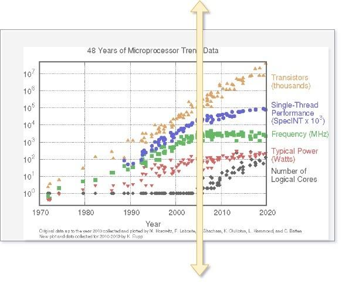

Dennard scaling held until the mid-2000s. Transistor performance started slowing down due to short-channel effects in CMOS devices. The short-channel effect becomes relevant when the channel length of the transistor is reduced to a point where the device's physical characteristics start to deviate from the ideal behavior assumed in theoretical transistor models.

The result is that the transistors need higher operating voltages (VDD) to turn between on/off states, and the typical 0.7x voltage scaling with each process node did not keep up after the 130nm process node. It reduced to 0.95-0.98x scaling. The increased leakage current at higher VDD caused a further increase in power consumption. In other words, power densities increased with new process nodes, and transistors could only be clocked 10-12% higher to keep the same power density.

With lower transistor performance, the single-thread performance improvements slowed down. Deeper pipelines and more architectural innovations were needed to improve single-thread performance. CPU vendors also started integrating more cores inside the die to double/triple the overall performance of the chip. This is dubbed as a system on a chip (SOC) era.

On the networking front, we saw the integration of all packet processing, queueing, and scheduling functions in the same die and multi-slice architectures.

By 2012, domain-specific accelerators like GPUs started gaining much more momentum. On the networking front, the general-purpose network processors gave way to fixed pipeline packet processing architectures that hardcoded most of the L2/L3 processing. Further, to reduce the latencies and power dissipation involved in going to external memories, some networking companies adapted VOQ architectures for their high-end switches.

### CMOS -> FinFET -> GAA

With the degrading performance of the CMOS devices, the industry quickly adopted FinFET transistor technology around 2012-2015. Intel introduced FinFETs into mainstream semiconductor manufacturing with its 22nm process node in 2011 without much success. TSMC introduced FinFET in the 16nm process node.

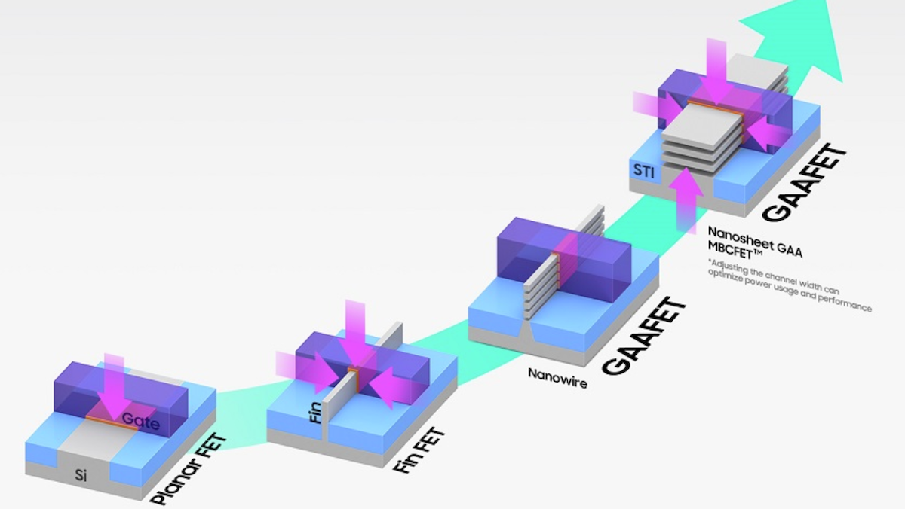

Unlike the CMOS transistors, FinFET is a non-planar or 3D transistor with raised fin-like structures. The gate material covers the fin on the top, left, and right. With the gate's ability to control the channel on multiple sides, these transitors can scale to lower dimensions than CMOS devices without short-channel effects. As a result, power consumed by the transistor at a specific clock speed improved to 60% going to FinFETs in 16nm. FinFET transistors also gave between 2-3x transistor and SRAM density improvements until the 7nm node (better than Moore's law!). After that, the transistor densities improved between 1.4-1.65x while SRAMs stopped scaling.

FinFETs are more complex devices, which are difficult to manufacture and scale at each node and incur significant R&D costs. As a result, the cadence for a fully scaled node has extended from 18 months to 2.5 years or even longer.

Gate-All-Around of GAAFET (also called ribbonFET by Intel) is a further improvement over FinFET. Unlike the FinFET, where the gate surrounds three sides of the transistor, in GAA, the gate material surrounds the channel from all sides, ensuring better electrostatic control over the channel, which improves performance over FinFETs and reduces leakage current further. This 3D transistor technology comes in two flavors.

- **Nanowire**: The transistor's channel is shaped like a wire, and the gate wraps around this wire.
- **Nanosheet**: It has a flat ribbon or sheet-like channel structure. Since the width of the channel is higher in nanowires, it allows for higher drive current and higher performance.

Samsung unveiled a 3nm process with GAA in 2022. TSMC/Intel plan to use this new technology for 2nm process node onwards.

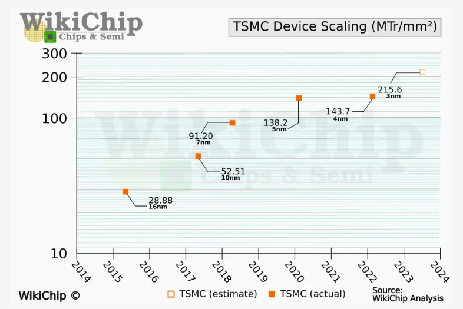

### Second Inflection Point - 2.5D Integration

The DRAMs used as external memory for GPU/CPUs and networking devices use a different process node than the ones used by the transistors in the ASICs. It is harder to scale the performance and density of the DRAM simultaneously while keeping the cost and power consumption low. DRAM vendors traded capacity over performance as there was more demand for capacity from CPU vendors. The DRAM latencies, dominated by the PCB traces on the board, were not improving either. This widening gap in DRAM versus logic performance is often called a "[memory wall](https://juniper.github.io/techposts/tearing-down-memory-wall/article)."

GPUs were the first ones to get affected by the memory wall as their workloads, like graphics rendering, are highly parallel in nature and distributed across many cores, and the longer latencies affect the graphics quality.

Around this time (2011), HBM was developed to respond to the increasing demands for bandwidth from the GPUs. Unlike traditional DDR memories, HBM stacks multiple DRAM dies vertically using through-silicon vias (TSVs) and microbumps. HBM connects to the core die through a silicon interposer inside the package substrate. This allows for a much wider memory interface and, consequently, much higher bandwidth than traditional DDR solutions while reducing power consumption and form factor. The HBM-integrated packages are often referred to as 2.5D packages.

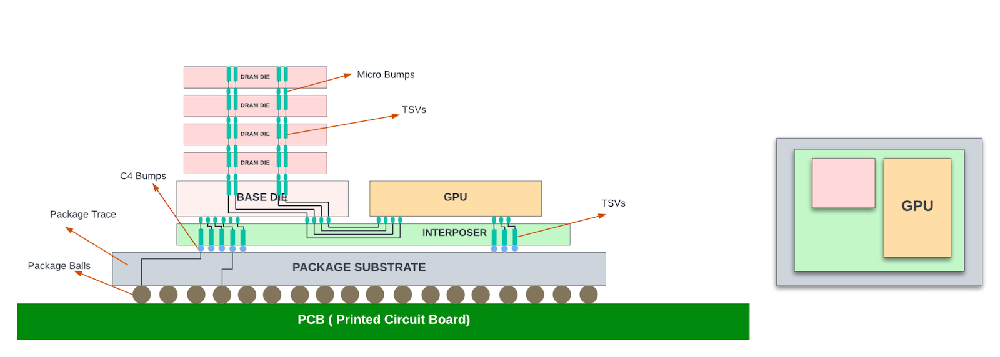

While the HBM die seems to have a much larger thickness (height) than the core/logic die in the diagram above, the diagram is for illustration purposes only and is not drawn to scale. The logic dies are often much thicker. After the dies are molded onto the interposer wafer, the entire structure goes through a grinding process (back grind) to make the surfaces align. This is needed for mechanical stability and to place thermal interface materials (TIM) over the dies for efficient heat dissipation.

TSMC provides 2.5D packaging with its Chip-on-Wafer-on-Substrate (CoWoS) packaging technology. Note that the Micro bumps that connect between the HBM dies and the base/ASIC dies to the silicon interposer usually have a pitch (distance between the bump center points) of 25-40um, which allows for high-density connections. The C4 bumps between the interposer and the package substrate usually have a 100-200um pitch, depending on the technology used.

AMD was the first to adopt HBM in their Fiji GPU architecture in 2015. Nvidia immediately followed the lead for its Tesla family of GPUs introduced in 2016. Networking chips followed the suite from 2018 onwards, with HBM replacing the external DDR memories for packet buffering and data structures.

Since then, HBM has seen much wider adoption in GPUs, high-end networking switches, and data center server chips. The ecosystem for HBM and the PHY has expanded, with multiple vendors developing these with JEDEC standards compliance. HBM performance and capacity also increased over the years, as shown in the table below.

| Metric | HBM1 | HBM2 | HBM2E | HBM3 | HBM3E |
|:--|:--|:--|:--|:--|:--|
| Numbers of lanes to the core | 1024 | 1024 | 1024 | 1024 | 1024 |
| Max lane transfer rate | 1Gbps | 2Gbps | 3.2Gbps | 6.4Gbps | 8.4-9.2Gbps |
| Total BW to the core | 1Tbps | 2Tbps | 3.2Tbps | 6.4Tbps | 9.2Tbps |
| Number of stacks (dies) | 4 | 4/8 | 4/8 | 4/8/12 | 4/8/12 |
| Capacity of each stack | 1GB | 2GB | 2GB | 2GB | 2GB (some vendors offer 3GB in 8-stack designs) |
| Max capacity | 4GB | 16GB | 16GB | 24GB | 24GB |

Note that desktop CPUs from Intel, AMD, and Apple continue to use DDR memory variants since HBM parts and 2.5D packaging are expensive, and the cost does not justify the bandwidth gains. Also, DDR memory (DIMMs) on motherboards allows users to upgrade or replace memory as needed and provides much higher memory capacity than HBM devices for a lot lower price. If a CPU used on-package HBM as its primary memory, this user-driven upgradability would be lost. The PC ecosystem (especially x86-based) is built upon decades of legacy infrastructure. Transitioning CPUs to a new memory standard would broadly affect the PC market, including motherboards, compatibility, software, etc.

## Multi-Chip Modules (MCMs) Era

### Idea behind MCMs

As the process node shrank, manufacturing became more complex and expensive, leading to a higher cost per square millimeter of silicon. Die cost does not scale linearly with die area. The cost of the die more than doubles with doubling the die area due to reduced yields (number of good dies in a wafer).

Instead of packing more cores inside a large die, it may be more economical to develop medium-sized CPU cores and connect them inside the package to get higher core density at the package level. These packages with more than one logic die inside are called multi-chip modules (MCMs). The dies inside the multi-chip modules are often referred to as chiplets.

Not all computing applications need high-bandwidth CPU cores. And using the medium-sized CPU chiplet allowed the CPU vendors to develop different package variations with a different number of CPU cores.

This chiplet architecture works only if the interconnects between the chips are fast enough not to slow down the performance of the chips. The HBM integration using silicon interposers in 2015 already proved that high-speed signals could be routed in silicon interposers.

However, silicon interposers are manufactured using semiconductor device manufacturing processes and are subjected to the same reticle size (858 sq mm) limits as the logic dies, and reticle stitching is needed to make them larger than 858 sq mm. This process was not mature then and resulted in expensive interposers even without any stitching. Building chiplets using interposers did not make sense economically for CPUs in the 2015 timeframe - especially if they didn't need HBM!

### AMD's Lead in 2D MCMs

AMD introduced the chiplet architecture in its first-generation "zen" EPYC processors (2017), using the organic substrate to interconnect four CPUs in a package. The organic substrates are high-quality PCBs that allow finer traces and provide better thermal and mechanical properties. Each CPU was ~200 sq mm in the 14nm node.

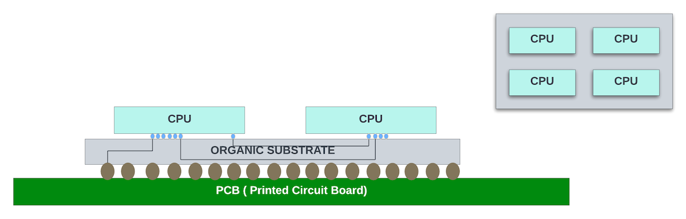

High-speed serdes were used as a physical medium for communication between the chiplets. AMD developed a proprietary Infinity fabric protocol. This protocol is used for communication between the processing cores within a CPU, the CPU chiplets in the package, and the MCMs on two different sockets. Using the same protocol across all core-to-core communication made the chiplet architecture easier to scale beyond four CPUs.

With the desktop/server CPUs launched in 2019 with "Zen 2" architecture, AMD went ahead with heterogeneous integration of the dies on the organic substrate. The IO chiplet that contained DDR memory controllers, PCIe interfaces, and other IO functions was in a 14nm process (~400 sq mm die), and the core chiplet containing the processor cores was in the 7nm process node (~75 sq mm die). This is one of the advantages of chiplet architecture - optimizing the process node for each chiplet for better power, performance, and cost.

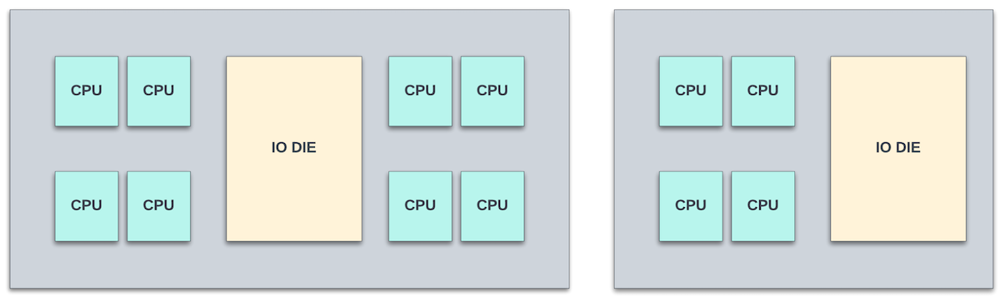

Intel has been tinkering with MCMs with organic substrates for their processor cores for over two decades but did not use them consistently in all the x86 series as they prioritized power/performance over cost. MCMs with long traces between the CPUs add significant latencies for inter-core communication compared to packing all of these cores in monolithic dies.

### Intel's Focus on Advanced Packaging

Intel focused on developing advanced packaging to enable high-density chiplet interconnects with lower latencies and power consumption. Among the many technologies it developed, "Foveros" and "EMIB" stand out the most.

Embedded Multi-die Interconnect Bridge (EMIB) allows high bandwidth chiplet connection through silicon bridges. The first Intel product to use EMIB was the Stratix 10 FPGA.

Instead of using a large silicon interposer, EMIB employs small silicon bridges. These bridges contain high-speed interconnects and can be embedded directly into the package's organic substrate.

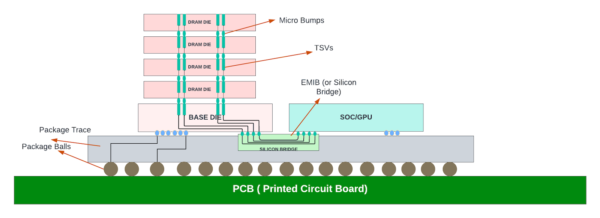

EMIB provides high interconnect density through very small bump pitches (10-20um in the latest EMIB), allowing for higher bandwidth between dies, and has much less power consumption than using organic substrate due to shorter trace lengths (in 1-2mm). It's akin to a miniaturized silicon interposer that only covers the area where connections between chiplets are needed.

EMIB can be used as an interconnect between a core chiplet and HBM or between any two core chiplets. Further, EMIB does not prevent us from using organic substrate for some interconnects in the same package. Thus, EMIB offers a middle ground between full silicon interposers and organic substrate interconnects, providing high density and performance. It removes the need to stitch 3-4x reticle-sized silicon interposers to cover larger dies. TSMC also provides similar technology to EMIB with its CoWoS-L offering.

While modern organic substrates AMD uses in its multi-CPU packaging can offer decent interconnect density, they typically can't match the ultra-fine pitch of EMIB or silicon interposers. However, organic substrates are less expensive and have better yields. AMD continued to use them in its Zen3 and Zen4 processor series.

Intel used EMIB technology to package its 8th generation CPU core with an AMD Radeon GPU on the same package. EMIB is used as an interconnect between the GPU and HBM2. This collaboration between Intel and AMD was significant then, and using EMIB was key to making this integration possible.

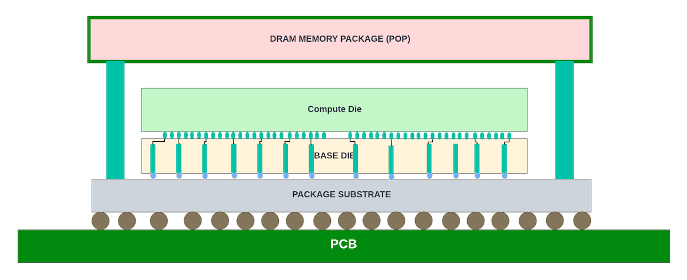

Intel developed Foveros technology to do 3D stacking of chiplets. The very first version uses face-to-face bonding of the dies using micro bumps. Lakefield processor (2020) uses Foveros 3D stacking of compute and base dies with an LPDDR4 memory package on the top. However, Intel discontinued this line of processors within a year of launching, as it could not compete with price/performance in the market segment.

The Meteor Lake processors, introduced in 2022, use chiplet architecture with CPU, GPU, SOC, and IO chiplets arranged on a large silicon interposer using later versions of Foveros technology.

Apple recently announced its latest desktop CPU chip (M1 ultra) that uses a large silicon interposer to connect two large M1 Max chips (~500 sq mm each) back to back. It uses proprietary packaging technology to connect over 10,000 signals between the dies through the silicon interposer, providing about 20Tbps bandwidth between them.

### Advanced 3D Packaging

Although SRAMs were shrinking with each process node, the scaling was not comparable to transistor scaling, and they started to fall behind in density and performance improvements compared to the logic gates. Unified large L3 caches shared across multiple cores helped offset the SRAM scaling problem and allowed for more integration of the cores in monolithic dies. Similarly, on the networking side, unified packet buffers and data structures were shared across multiple PFEs, and the packet buffers were further reduced in favor of better end-to-end congestion mechanisms.

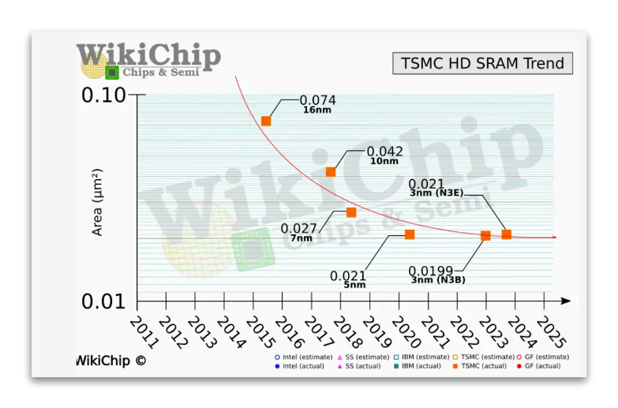

As the server performance needs increased and more cores (16-32) were packed in the dies, AMD saw the need for larger L3 caches that could be offered as an optional feature with premium pricing. It used TSMC's SoIC (Silicon on Integrated Chip) process to stack an additional 64MB of cache die on top of the CPU die in the Ryzen 7 series of desktop servers using the Zen 3 architecture (2020).

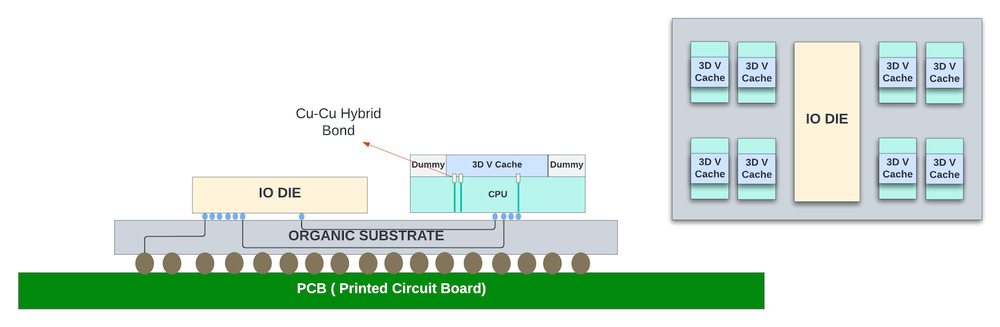

In this technology, the 3D V-cache chiplet is hybrid bonded to the main core that contains processor cores and the 32MB of L3 cache with direct cu-cu hybrid bonding, as shown above.

Compared to the microbumps used between the DRAM dies in HBM and between the cores in Foveros, hybrid bonding provides 15x interconnect density and 3x power efficiency. When dies are connected vertically, through either microbumps or hybrid binding, the TSVs act as regular metal interconnects. PHY or serdes are not needed to drive signals between the vertically stacked dies.

Intel's Fevoros Direct is very similar to SoIC from TSMC. It uses cu-cu bonding between the chips, allowing for a finer pitch (<10um) between the interconnects.

### Advanced Packaging - Combined 3D and 2.5D Stacking

Data center servers with multiple CPUs/GPUs and HBM interfaces could benefit from 3D stacking in the vertical direction and advanced 2.5D stacking for interconnectivity between the chiplets and HBM on the silicon interposer/EMIB.

AMD uses this approach with its data center-class server with nine 5nm dies (mix of CPU and GPU dies) placed on top of four 6nm base dies consisting of L3 cache, HBM PHY, and other IO functions. Each base die has two HBM3 interfaces. The GPU/CPU dies are 3D-stacked to the base die with TSMC's SoIC. The base dies may reside on a large ~3.5x reticle-sized silicon interposer. The die-to-die connectivity could be through USR (ultra short reach serdes). The total functional area of all dies together is ~1017 sq mm.

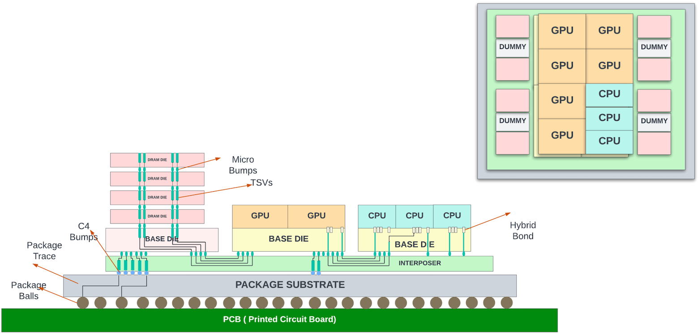

Intel has similar data center class server chips with GPU/CPU/HBMs integrated into their Falcon Shores series server chips. The Falcon Shores series "may" use Intel's EMIB for horizontal stacking and Foveros Direct (for vertical connectivity).

### Advanced Packaging - Integrated Fan Out Wafer Process

Tesla and TSMC have taken the packaging to wafer scale with Integrated Fan-Out (INFO) System On a Wafer (SOW) packaging used for packing the D1 Accelerator chips on a large DoJo tile.

In this INFO SOW process, the individual dies are cut from the wafer. Then the known good dies are precisely re-positioned on a carrier wafer or panel, with space for fan-out of the interface signals around each die.

The carrier wafer is then reconstituted by molding. A redistribution layer (RDL) is formed atop the entire molded area. Solder balls are placed on the top of the RDL. This eliminates the need for package substrate and the PCB and makes the interconnectivity between the chips highly efficient.

Closely packed chip arrays within a compact system enable low latency chip-to-chip communication, high bandwidth density, and low impedance for greater power efficiency. Tesla packed 25 D1 chips (645 sq mm each in TSMC 7nm) in this INFO SOW tile. In summary, this tile can hold up to 645 x 25 = 16,125 sq mm of functional silicon!

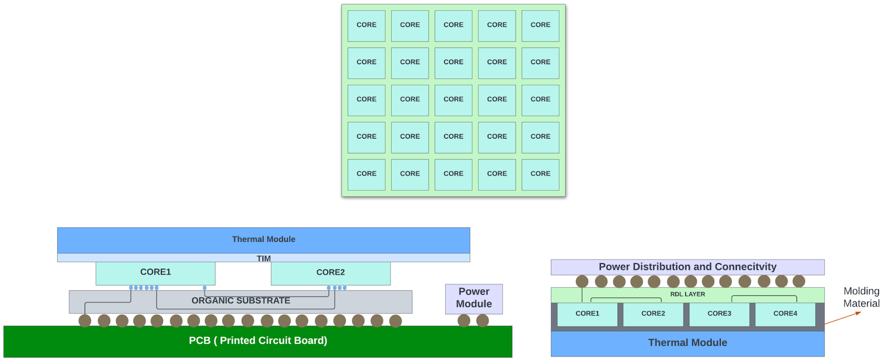

## The Other Camp

While AMD and Intel went full throttle for chiplet-based architectures for desktop/server CPUs and GPUs, Nvidia continued to develop large monolithic die GPUs, except for the 2.5D integration for HBM. There is a good reason for this. The chiplets add additional latency, which affects the performance of consumer gaming GPUs that Nvidia is not willing to compromise.

Regarding the data center/HPC GPUs, Nvidia's chips are already at the reticle size limits. The H100 chip at ~815 sq mm would have been a good candidate for chiplet design for a lower-cost ASIC package. But Nvidia, a market leader in AI/HPC GPUs, can control the pricing of their systems and probably didn't see the need to take any delays and software interoperability issues by introducing chiplets for lower-cost ASIC packages. They were more focused on delivering the next highest-performance GPUs ahead of the competition. And many are willing to pay the premium pricing for their GPUs!

There are rumors that the next-gen Hopper might also be a monolithic design in a 3nm process node. But, in the generation after the Hopper next, they might be forced to use chiplets as the SRAMs have stopped scaling in the last two process nodes. The more streaming processor cores they add to the die, the larger the L3 cache required, and they might not be able to offer performance improvements using monolithic dies.

Further, even if they continue to build reticle-sized dies in the 2nm process node, chiplet architecture does help them. For example, they could connect multiple reticle-sized dies through die-to-die interconnects that use NVLink protocol and create an ASIC package with multiple GPUs. This would reduce the number of ASICs in their 8-GPU server and should help overall with power and latencies. It will be interesting to see which packaging technology and approach Nvidia would take for its 2nm GPUs.

## Networking Silicon

Like Nvidia, networking chip vendors continued their focus on building monolithic dies for several reasons.

- Networking chips in high-performance routers/switches switch massive amounts of bandwidth between their datapath modules. In the early era of chiplet design, using the organic substrate and routing signals between the chiplets using serial interfaces would not have met the performance and power needs of these switches.
- Due to lower volumes (compared to the CPU counterparts), the cost benefits of building complex packages on large silicon interposers or EMIB structures were not there half a decade ago for high-end switches. Waiting for the technology to mature before jumping on the bandwagon was a prudent choice.
- The high-end modular systems have very strict power requirements, and the networking chips could not afford the extra power overhead associated with chiplet-based designs.
- The HBM integration with the 2.5D package happened first, as the off-chip DDR memories could not keep up with the increased bandwidth of the WAN interfaces. These HBMs hosted packet buffers and data structures.
- As the interposer and interconnect technology matured, Juniper took the leap of faith with Express 5 silicon (2022) and ventured into heterogeneous integration of chiplets in a 2.5D package.

### Express 5 Silicon

Two base chiplets were used as building blocks to enable eight different ASIC packages.

- X-Chiplet: Contains two Packet Forwarding Engines (PFEs) with shared buffers and data structures. It has 144 x 112G serdes on the WAN interface to receive traffic from the front panel ports. The packet forwarding engines have fixed pipeline packet processing. It has 162 x 112G Extreme Short Reach (XSR) serdes for connectivity to another X or F-chiplet.
- F-Chiplet: This is a cell-based fabric switch with 16Tbps switching capacity.

Juniper used XSR (or extra short reach serdes) for die-to-die communication with the organic substrate as the physical interconnect medium. These XSR serdes have 1/4th power and 1/4th area of a regular long-reach serdes. At the time of development, using XSR was a better option as the interposer technology was not mature enough to allow a large interposer encompassing all the chiplets.

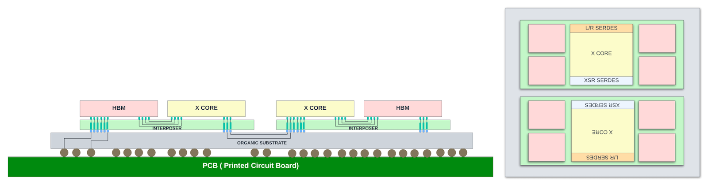

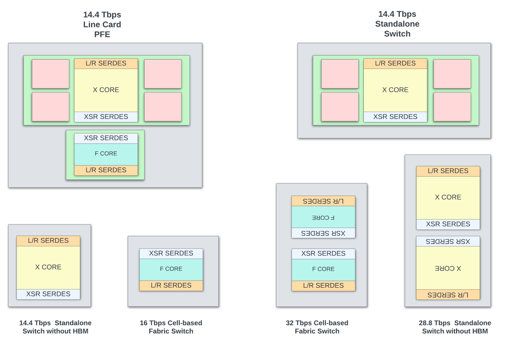

As shown in the package diagrams above, packages that cater to different applications (shallow buffer switches, deep buffer switches, line card PFEs, switches with different throughputs, etc.) can be built with two building blocks. Systems using Express 5 will start shipping in early 2024.

The large 85mm x 85mm package with two X-chipsets back to back gives the best power and performance (28.8Tbps switching) for a deep buffer standalone switch. Building such a high throughput ASIC using a monolithic die would have been impossible.

While the chiplet architecture adds additional latency through the XSR interconnect and has slight power overhead over building monolithic dies for some of the smaller packages shown above, if Juniper were to build dedicated monolithic dies for those packages or attempted to re-spin different variants of monolithic dies using the same building blocks, it would have added significant NRE and development cost to bring them to market.

In summary, choosing the chiplet approach is a careful trade-off between cost/power/performance and the time-to-market requirements. The cost of the ASIC, in addition to the total functional area and the size of the chiplets, also depends heavily on the volumes and the foundry partner, and thus no single recipe fits all high-end networking silicon vendors.

### High-End Networking Silicon - Future Trends

Except for Juniper, no other high-end networking silicon vendor is using the chiplet approach for their switches. Several of these TOR switches are already near reticle limits, with 51.6 Tbps of switching capacity! To get to > 100Tbps switching capacity inside a package in the future 2nm process node, with no SRAM scaling and lower scaling for serdes, they will have to rely on chiplet architectures.

With continuous improvements in advanced packaging, there are more options to slice and dice the functionality for future chips. Networking chips could further isolate the IOs and memory controllers inside the IO die (similar to the CPU counterparts). By decoupling the WAN interfaces and Memory controllers, the core packet forwarding die could be in later technology nodes, and the IO die could be customized for different WAN speeds and memory technologies.

Moving entire or partial on-chip packet buffering to a memory chiplet that is 3D-stacked with the main PFE die could also help increase the delay bandwidth buffering and routing scale of the high-end switches.

## Chiplets - Recap of Pros/Cons

Overall, transitioning to chipset-based architecture should help all high-end ASICs, where the area of the total functional silicon is well above the reticle size. The chiplet approach helps in many ways:

### Pros

- Improved yields lead to lower-cost ASICs. A package with more reasonably sized dies than one large reticle-sized die costs better overall.
- Enables packing of more bandwidth and capacity inside a large package that wouldn't have been possible with monolithic die packages due to reticle size limits for the dies. In other words, chiplets could be reticle sized, and multiple of them could be integrated together with advanced packaging options to provide higher performance/bandwidth at lower cost/power.
- Allows for a mix-and-match approach to cater to different applications. New products can be designed and brought to market quickly by mix-and-match of existing chiplets into ASIC packages.
- Different chiplets can be manufactured in different process nodes. For example, one may use the latest process node for the core for the best power and performance. At the same time, if the high-speed serdes are not available in that process node, the IO chiplet could use the previous process node.
- Can adapt to latest memory technologies without re-spinning all the chiplets. If the IO chiplet contains the memory controller and the HBM PHYs, then as the new memory technologies become available, it is possible to respin the IO chiplet to use the next generation HBMs for power/cost and bandwidth improvements and to extend the longevity of the ASIC.
- As the chiplet ecosystem expands with standard interfaces, chiplets for specialized functions could be sourced from third-party vendors. Not all development needs to happen in-house. This concept is similar to the IPs sourced from vendors for SOC integration. This creates a healthy ecosystem for chiplets and fosters innovation.

### Cons

The main concern for adapting to chiplet architecture for large packages;

- Additional design overhead for the die-to-die interconnects that contain the physical layer (PHY) and protocol layer logic. This logic adds extra area and power overhead. Depending on the protocol and physical interface used, the power could be anywhere between 3pJ/bit to 0.25pJ/bit.
- These Die-to-die interconnects can introduce additional latency compared to a monolithic design, especially if the data needs to travel through multiple chiplets to reach the destinations. This additional latency might be a non-starter for several applications, including low-latency switches and GPUs used for gaming.
- Coming up with an optimal partition that minimizes the latencies, die-to-die interconnects, and package size is challenging. Optimum placement of core/IO dies to optimize the interposer and package sizes is also a hard task.
- For some applications, the economies of scale might not justify a chiplet approach, especially if volumes are low or the design/application doesn't benefit from modularity.
- Time to market - Software and firmware may need modifications to work with chipset-based hardware. If transitioning to chiplets adds a burden for software and could delay the product launch/shipments, then there is a trade-off to be made.
- Thermal considerations: With the chiplet approach, depending on how the design is partitioned, there is a potential for hotspots in some chiplets that would create challenges for thermal solutions. Lid-less packaging, better TIM material, liquid/immersion cooling, etc., must be looked at for large ASIC packages that dissipate >1000W power.
- Testability and reliability are more involved. Silicon bridges, interposers, and hybrid bonds introduce additional points of failure. Testing the integrity and performance of these interconnects is crucial. System-level package testing before soldering the ASICs on PCB is essential to ensure that chiplets interact as expected.
- There are more mechanical challenges like warpage etc., with large packages.
- CAD tools used for physical design, SI, thermal, and package designs need to adapt to technology advancements. For example, in 3D stacking of chiplets with Cu-Cu bonds, the interconnects are spread across the die and behave like buffered wires, adding additional complexity to CAD tools used for physical design and timing. However, CAD tool vendors have made rapid progress in supporting chiplet designs from architecture to the final GDS. The major theme across major CAD vendors in DAC 2023 is supporting the chiplet eco-system!

Despite the thermal and mechanical challenges that are being addressed furiously in the industry, chiplet architecture does provide a better balance between cost/power/performance for many applications.

### Standardization of die-to-die Interconnects

A common chiplet interconnect specification enables chiplets from multiple vendors and across different process nodes to coexist in the package. It also creates healthy competition across the vendors and fosters innovation.

[UCIE, or Universal Chiplet Interconnect Express](https://www.uciexpress.org/specifications), is an open standard co-developed by several semiconductor industry stalwarts, including Intel, AMD, TSMC, etc. This interconnect standard could be used between chiplets in any packaging (standard 2D package or the advanced EMIB/CoWoS etc.).

UCIE 1.1 spec was released in August 2023. UCIE follows the layered approach. The physical layer specifies the die-to-die IO electrical characteristics and the bump-out specification. The fixed beach-front width allows for at least two generations of compatibility.

Each module supports 64 single-ended lanes in each direction with up to 2Tbps bandwidth for advanced packages or 16 lanes with up to 512Gbps for standard packages. The UCIe consortium has outlined aggressive performance and area targets while giving enough options to enable the spec to be deployed for many use cases.

The transport layer specification natively supports CXL/PCIe. The raw/streaming protocol option allows any other protocol to be used. Chiplets on both ends would need to support this custom protocol to connect in this case. This raw mode would allow a chipmaker to leverage the physical aspects of the UCIe standard to simplify their own design/production.

UCIe is yet to see wide industry adaption. Although AMD is part of the sponsor list, it has yet to transition to this standard. Intel announced that the Meteor Lake CPU will support UCIE. The raw streaming option hopefully allows for a faster transition where the vendors can continue to run their proprietary protocols using the UCIe PHY layer.

CAD tool vendors have started offering the physical layer IP (PHY) and the adapter IPs to enable faster adaption.

Sample metrics in UCIE:

| Metric | Standard Package | Advanced Package |
|:--|:--|:--|
| Numbers of lanes | 16 | 64 |
| Transfer rate GT/s | 4 / 8 / 12 / 16 / 24 / 32 | 4 / 8 / 12 / 16 / 24 / 32 |
| Bump pitch (um) | 100-130 | 25-55 |
| Channel reach | <=25mm | <=2mm |
| Max BW | 512Gbps | 2Tbps |
| Power (pJ/b) | 0.5 | 0.25 |

## Summary/Trends

Chiplets are here to stay for all the high-end ASICs looking to integrate more throughput inside packages than a reticle-sized die can provide.

Continuous innovation in packaging technologies, high-speed/high-density chiplet interconnects, and thermal management to cool these chiplets inside the package are essential to keep the momentum going.

### More Options for Advanced Packaging

This article barely touched on all the available packaging technologies across Samsung, Intel, TSMC, and other foundry partners/OSATs. There is continuous innovation across the foundries to make advanced packaging cost-effective. For example, 3D packaging could be done using either a chip-on-wafer or wafer-on-wafer process. There are package-on-package (POP) technologies that allow vertical stacking of the ASIC dies with the DRAM package to save board space. Similarly, integrated fan-out (INFO) is being scoped for integrating HBM as an economical alternative to silicon interposers... many more..

### 3D Packaging Trends

Intel, Samsung, and TSMC, with their competitive 3D packaging technologies, are racing ahead to create the next-gen 3D packaging with less than 5 um hybrid bond pitches. With these high-density Cu-CU bonding, the bandwidth between the 3D-stacked chips could increase exponentially and enable users to create more complex functional partitions between the dies. The high-density fine line bonding also helps reduce the overall power consumption in the vertical interconnects.

The current 3D stacking of the logic dies is limited to two stacks. Adding an additional layer of DRAM dies on top of logic stacks could further improve the package density and reduce DRAM read latencies to the core logic.

### Photonic Interposers

Photonic integrated circuits can act as active interposers to transmit data between the chiplets in the optical domain using waveguides. In this technology, electrical signals are converted into optical signals inside the active interposer, and communication between the ICs is in the optical domain.

The argument for photonic interconnects is that electrical signals consume more power and have more latency than optical signals. And it is harder to connect nonadjacent chiplets in the electrical domain. When building large wafer-scale MCMs with many chiplets that need any-to-any connectivity or topologies that needs remapping, using optical waveguides may be efficient. This technology is still nascent but has good potential to scale up to any number of cores in wafer-scale integration.

### Co-Packaged Optics

2.5D and 3D integration of the chiplets and photonic integrated circuits (for optical transceivers) in co-packaged optics would enable large HPC clusters to be built with a point-to-point connection between the server ASICs in the optical domain. Co-packaged optics with photonic interposers could take this concept further by switching in the optical domain both within and outside the package!

Ultimately, the high-scale integration of chiplets holds vast potential for continued innovation.

## References

- My networking background
- Online articles from Intel/Nvidia/AMD/Apple on their CPU/GPU offerings
- [HotChips conference archives](https://hotchips.org/archives/)
- Online Tech journals (Including but not limited to Anand's Tech, Tom's Hardware, Semianalysis, etc.)

## Glossary

- CMOS: Complementary Metal--Oxide--Semiconductor
- CoWoS: Chip-on-Wafer-on-Substrate
- CXL: Compute Express Link
- DDR: Double Data Rate (memory)
- EMIB: Embedded Multi-die Interconnect Bridge
- FinFet: Fin field-effect transistor
- GPU: Graphical Process Unit
- GAA: Gate-All-Around
- HBM: High Bandwidth Memory
- INFO SOW: Integrated Fan-Out System On a Wafer
- JEDEC: Joint Electron Device Engineering Council
- MCM: Multi-Chip Module
- NRE: Non-Recurring Engineering (cost)
- PCB: Printed Circuit Board
- PCIe: Peripheral Component Interconnect express
- PFE: Packet Forwarding Engine
- POP: Package on Package
- VDD: Voltage at drain (operating voltage of a chipset)
- RDL: Redistribution Layer
- SoC: System on a Chip
- SoIC: Silicon on Integrated Chip
- TIM: Thermal Interface Materials
- TSMC: Taiwan Semiconductor Manufacturing Company
- TSV: Through Silicon Vias
- UCIE: Universal Chiplet Interconnect Express
- USR: Ultra Short Reach
- XSR: eXtreme Short Reach
