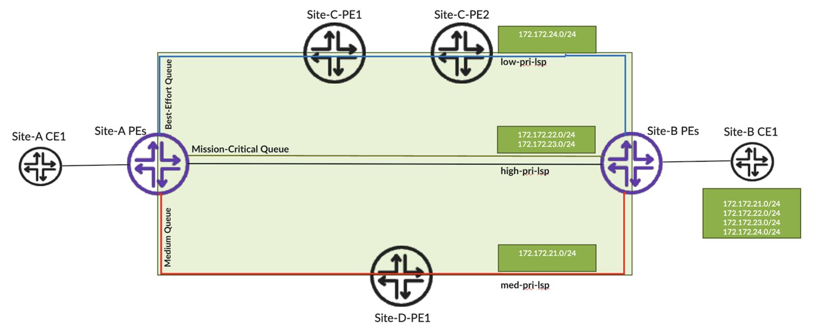

# Class Based Forwarding over RSVP LSPs Design Consideration

**Kashif Nawaz - 06/23/2025**

While Class of Service (CoS) ensures that priority traffic receives preferential treatment on congested interfaces, it does not inherently provide a mechanism to reduce transit latency for delay-sensitive traffic flows. Class-Based Forwarding (CBF) addresses this gap by enabling network operators to steer high-priority traffic over the shortest or most optimal paths, while directing low-priority traffic over longer or less optimal routes.

## Introduction

[In my previous blog, I covered Class of Service (CoS) design considerations](https://juniper.github.io/techposts/wholistic-design-approach-for-mpls-backbone-cos/article). In upcoming posts, I will also explore traffic engineering mechanisms such as Faster Auto-Bandwidth Adjustment and Container LSPs, which help fine-tune the network's responsiveness to rapidly changing traffic conditions.

While these features address many modern traffic engineering challenges, there may still be a business need to classify traffic such that high-priority or mission-critical traffic takes the shortest or most optimal path, medium-priority traffic follows the second-best path, and low-priority traffic is routed over the longest or least preferred link.

Class-Based Forwarding (CBF) addresses this requirement by directing traffic from each specific forwarding class to Label-Switched Paths (LSPs) that align with business-defined performance objectives. This solution assumes that, at the ingress Label Edge Router (LER), packet classification is performed using either a behavior aggregate (BA) or a multi-field classifier (MFC). Packets are then mapped to the appropriate forwarding class, which is further mapped to a specific LSP, thus ensuring that each type of traffic is transmitted through its designated forwarding class and corresponding LSP.



Note: Left-hand side (Site-A) and Right-hand side (Site-B) both have multiple PEs, but for brevity only a single PE is shown on each side.

Let's suppose Site-A needs to communicate with Site-B. As illustrated in the topology diagram above, there are three distinct paths available between these sites:

- The direct path between Site-A and Site-B offers the lowest latency, making it the most optimal route. This path is ideal for carrying traffic that requires expedited forwarding, typically routed over high-priority LSPs.
- The path that traverses Site-C serves as the secondary optimal route. It is well-suited for traffic that requires assured forwarding, offering balanced performance with reliable delivery under normal network conditions. Such traffic can be routed through medium-priority LSPs.
- The path through Site-D has the highest latency and is best suited for lower-priority traffic, which can be routed over low-priority LSPs.

This approach ensures that each traffic class is intelligently routed according to its priority and latency sensitivity. It enables optimal path selection based on business-specific performance requirements, thereby enhancing network efficiency and enabling service differentiation

## Objectives

Site-B is advertising four service prefixes, and Site-A must be able to reach each of these prefixes via specific physical paths that comply with predefined Service Level Agreements (SLAs).

| Service Prefix | Forwarding Class | LSP |
|:--|:--|:--|
| 172.172.21.0/24 | VIDEO | med-pri-lsp |
| 172.172.22.0/24 | VOICE | high-pri-lsp |
| 172.172.23.0/24 | MISSION-CRITICAL | high-pri-lsp |
| 172.172.24.0/24 | SCAVENGER | low-pri-lsp |

All configurations presented in this document were tested on Juniper PTX10001-36MR running JunOS EVO version 22.3R2-S3.10.

## Solution Components

It's assumed that the following config components are already available.

- BA or MF classification is applied on the edge interfaces of the ingress LERs at Site-A and Site-B to determine the appropriate forwarding class for incoming traffic.
- RSVP-signaled LSPs are pre-established between Site-A and Site-B using link coloring or administrative groups to ensure that specific LSPs traverse designated network links, aligning with SLA.

### Class of Service Forwarding Policy

Our objective is to forward traffic from Site-A to Site-B such that packets destined for specific service prefixes are mapped to designated forwarding-classes. These forwarding-classes are associated with LSPs that are engineered to traverse network paths that meet predefined SLAs.

In the configuration below, next-hop-maps are used to associate forwarding classes with set of LSPs using regular expressions. For each next-hop-map, we explicitly define the intended forwarding class. Additionally, we include the BEST-EFFORT forwarding class to serve as a default traffic handling mechanism. This ensures that if packets arriving at the ingress LER do not match any classifier and therefore are not mapped to a specific forwarding-class, then such packets will be forwarded using Queue 0, which corresponds to the BEST-EFFORT class in our setup.

The above-described behaviors will be further explained in the Forwarding Behavior Verification section.

```
class-of-service {
    forwarding-policy {
        next-hop-map CBF-MPRI {
            forwarding-class VIDEO {
                lsp-next-hop .*-MPRI-.*;
            }
            forwarding-class BEST-EFFORT {
                lsp-next-hop .*-LPRI-.*;
            }
        }
        next-hop-map CBF-HPRI-1 {
            forwarding-class VOICE {
                lsp-next-hop .*-HPRI-.*;
            }
            forwarding-class BEST-EFFORT {
                lsp-next-hop .*-LPRI-.*;
            }
        }
        next-hop-map CBF-LPRI {
            forwarding-class BEST-EFFORT {
                lsp-next-hop .*-LPRI-.*;
            }
            forwarding-class SCAVENGER {
                lsp-next-hop .*-LPRI-.*;
            }
        }
        next-hop-map CBF-HPRI-2 {
            forwarding-class MISSION-CRITICAL {
                lsp-next-hop .*-HPRI-.*;
            }
            forwarding-class BEST-EFFORT {
                lsp-next-hop .*-LPRI-.*;
            }
        }
    }
}
}
```

These **next-hop-maps** are then applied to traffic selectors to ensure the correct forwarding behavior, as illustrated in the following configuration snippet.

```
policy-options {
    policy-statement CBF {
        term 1 {
            from {
                route-filter 172.172.21.0/24 exact;
            }
            then cos-next-hop-map CBF-MPRI;
        }
        term 2 {
            from {
                route-filter 172.172.22.0/24 exact;
            }
            then cos-next-hop-map CBF-HPRI-1;
        }
        term 3 {
            from {
                route-filter 172.172.23.0/24 exact;
            }
            then cos-next-hop-map CBF-HPRI-2;
        }
        term 4 {
            from {
                route-filter 172.172.24.0/24 exact;
            }
            then cos-next-hop-map CBF-LPRI;
        }
    }
}
```

The following piece of configuration is required to apply traffic selector / route filter to forwarding-engine.

```
routing-options {
    autonomous-system 64980;
    forwarding-table {
        export CBF ;
    }
```

### Consideration for LSP Regex

**Multipath**

The PE routers at Site-B are advertising the subnet 172.172.21.0/24, which is being received and installed by the PE routers at Site-A. All ingress LSPs from Site-A to Site-B are used as next-hops because multipath (with vpn-unequal-cost) is enabled within the relevant VRF.

A detailed discussion of multipath and VRF configuration is beyond the scope of this document. In summary, enabling vpn-unequal-cost causes the router to disregard IGP metrics when installing LSP next-hops, allowing multiple LSPs to be used for traffic forwarding regardless of their IGP cost , thus ensuring path diversity and redundancy

```
show route 172.172.21.0/24 protocol multipath table trg.inet.0 

trg.inet.0: 11 destinations, 84 routes (11 active, 0 holddown, 0 hidden)
@ = Routing Use Only, # = Forwarding Use Only
+ = Active Route, - = Last Active, * = Both

172.172.21.0/24    #[Multipath/255] 01:58:05, metric2 2100
                       to 10.10.10.116 via et-0/2/6.0, label-switched-path SITEATOSITEBPE1-HPRI-CONTAINER-1
                       to 10.10.10.116 via et-0/2/6.0, label-switched-path SITEATOSITEBPE1-LPRI-CONTAINER-1
                       to 10.10.10.116 via et-0/2/6.0, label-switched-path SITEATOSITEBPE1-MPRI-CONTAINER-1
                       to 10.10.10.114 via ae0.0, label-switched-path Bypass->10.10.10.116->10.10.10.1
                       to 10.10.10.114 via ae0.0, label-switched-path Bypass->10.10.10.116->10.10.10.1
                       to 10.10.10.114 via ae0.0, label-switched-path Bypass->10.10.10.116->10.10.10.1
                    >  to 10.10.10.116 via et-0/2/6.0, label-switched-path SITEATOSITEBPE2PE2-HPRI-CONTAINER-1
                       to 10.10.10.116 via et-0/2/6.0, label-switched-path SITEATOSITEBPE2PE2-LPRI-CONTAINER-1
                       to 10.10.10.116 via et-0/2/6.0, label-switched-path SITEATOSITEBPE2PE2-MPRI-CONTAINER-1
                       to 10.10.10.92 via et-0/2/7.0, label-switched-path Bypass->10.10.10.116->10.10.10.5
                       to 10.10.10.92 via et-0/2/7.0, label-switched-path Bypass->10.10.10.116->10.10.10.5
                       to 10.10.10.92 via et-0/2/7.0, label-switched-path Bypass->10.10.10.116->10.10.10.5
                       to 10.10.10.92 via et-0/2/7.0, label-switched-path SITEATOSITEBPE2PE3-LPRI-CONTAINER-1
                       to 10.10.10.92 via et-0/2/7.0, label-switched-path SITEATOSITEBPE2PE3-MPRI-CONTAINER-1
                       to 10.10.10.114 via ae0.0, label-switched-path Bypass->10.10.10.92->10.10.10.85
                       to 10.10.10.114 via ae0.0, label-switched-path Bypass->10.10.10.92->10.10.10.85
                       to 10.10.10.92 via et-0/2/7.0, label-switched-path SITEATOSITEBPE2PE4-LPRI-CONTAINER-1
                       to 10.10.10.92 via et-0/2/7.0, label-switched-path SITEATOSITEBPE2PE4-MPRI-CONTAINER-1
                       to 10.10.10.114 via ae0.0, label-switched-path Bypass->10.10.10.92->10.10.10.87
                       to 10.10.10.114 via ae0.0, label-switched-path Bypass->10.10.10.92->10.10.10.87
```

**Active-Path**

In Junos, even when multipath is enabled and multiple next-hops are available in both the control and forwarding planes toward remote PEs, only a single best path is selected and installed as the active-path for each remote destination.

```
show route 172.172.21.0/24 active-path table trg.inet.0 

trg.inet.0: 11 destinations, 84 routes (11 active, 0 holddown, 0 hidden)
@ = Routing Use Only, # = Forwarding Use Only
+ = Active Route, - = Last Active, * = Both

172.172.21.0/24    @[BGP/170] 02:14:24, localpref 100, from 10.20.48.5
                      AS path: 65002 I, validation-state: unverified
                    >  to 10.10.10.116 via et-0/2/6.0, label-switched-path SITEATOSITEBPE1-HPRI-CONTAINER-1
                       to 10.10.10.116 via et-0/2/6.0, label-switched-path SITEATOSITEBPE1-LPRI-CONTAINER-1
                       to 10.10.10.116 via et-0/2/6.0, label-switched-path SITEATOSITEBPE1-MPRI-CONTAINER-1
                       to 10.10.10.114 via ae0.0, label-switched-path Bypass->10.10.10.116->10.10.10.1
                       to 10.10.10.114 via ae0.0, label-switched-path Bypass->10.10.10.116->10.10.10.1
                       to 10.10.10.114 via ae0.0, label-switched-path Bypass->10.10.10.116->10.10.10.1
```

It's important to note that only next-hops associated with the active-path configuration are considered by the next-hop-map. If a specific LSP name is referenced explicitly in the next-hop-map, it limits the ability to perform effective multipath load balancing.

To steer traffic over multiple LSPs  , when the same subnet is reachable through multiple remote PEs the forwarding logic must dynamically consider all active LSPs toward those egress LERs. This demands:

- Each forwarding class in the next-hop-map be mapped using regular expressions that match all relevant LSPs installed in the Routing Information (RIB) and Forwarding Information Based (FIB) as valid next-hops.
- The ingress LER dynamically selects among these LSPs based on real-time reachability and active path status.
- This flexibility allows the mapping to adapt to topology changes without requiring static LSP definitions.

**Indexed Next Hop (NH)**

For each forwarding-class defined in the next-hop-map, the corresponding LSPs are selected either by matching exact LSP names or by using regular expressions. These selected LSPs are then used to construct an indexed NH  entry in the forwarding information base (FIB). This entry establishes a link between service prefixes and their associated forwarding-classes, which are in turn mapped to one or more LSPs via the next-hop-map.

## Operational Verification

To view the mapping between forwarding-classes and their associated LSPs, the first step is to identify the Queue ID corresponding to each forwarding-class.

```
show class-of-service forwarding-class 

Forwarding class                       ID      Queue     No-Loss
  BEST-EFFORT                          0         0       disabled
  MISSION-CRITICAL                     2         2       disabled
  NETWORK-CONTROL                      3         3       disabled
  SCAVENGER                            4         5       disabled
  VIDEO                                5         4       disabled
  VOICE                                1         1       disabled
```

Once the Queue IDs are identified, we can inspect the FIB and  determine the indexed next-hop associated with each forwarding-class.

Detail explanation of NHs installed in FIB are not in scope of this document.

- In the output snippet below, idx:5 indicates that the VIDEO forwarding class (Queue ID 5) is mapped to four distinct next-hops. Each representing an LSP toward a different egress LER. Additionally, each next-hop includes associated bypass LSPs to provide protection against link or node failures.
- This reflects our earlier next-hop-map configuration, where the VIDEO forwarding class was mapped to LSPs matching the regular expression .*-MPRI-.*.
- Another indexed NH  is also created i.e. idx:xx---which handles traffic that is not classified under the VIDEO forwarding class but still targets the destination prefix 172.172.21.0/24. We will explore the details and behavior of this path in the next section.
- Above explanation can be visualized as under: -

```
Forwarding-Class: VIDEO (Queue ID: 5)
   +-- Indexed Next-Hop: idx:5
       +-- LSP-1 -> Egress-LER-1 (MPRI)
       |     +-- Bypass-LSP-1a
       +-- LSP-2 -> Egress-LER-2 (MPRI)
       |     +-- Bypass-LSP-2a
       +-- LSP-3 -> Egress-LER-3 (MPRI)
       |     +-- Bypass-LSP-3a
       +-- LSP-4 -> Egress-LER-4 (MPRI)
             +-- Bypass-LSP-4a

Forwarding-Class: BE (Queue ID: 0)
   +-- Indexed Next-Hop: idx:10
       +-- LSP-1 -> Egress-LER-1 (LPRI)
       |             +-- Bypass-LSP-1a
       +-- LSP-2 -> Egress-LER-2 (LPRI)
        |             +-- Bypass-LSP-1a
        +-- LSP-3 -> Egress-LER-3 (LPRI)
        |            +-- Bypass-LSP-1a
        +-- LSP-4 -> Egress-LER-4 (LPRI)
                 +-- Bypass-LSP-1a
```

show route forwarding-table destination 172.172.21.0/24 vpn trg 
Routing table: prod.inet
Internet:
Destination        Type RtRef Next hop           Type Index    NhRef Netif
172.172.21.0/24    user     0                    ulst     7435     1
                                                 comp         7430     1
                                                 indr            7423     1
                                                 idxd           7501     1
                   idx:5                      ulst            7495     1
                                                 sftw Push 17936     7399     1 et-0/2/6.0
                   10.10.10.116       ucst     6000     1 et-0/2/6.0
                                                 sftw Push 32292     7400     1 ae0.0
                  10.10.10.114        ucst     6005     1 ae0.0
                   idx:xx                    ulst     7484     1
                                                 sftw Push 17937     7286     1 et-0/2/6.0
                  10.10.10.116        ucst     6000     1 et-0/2/6.0
                                                 sftw Push 32292     7310     1 ae0.0
                 10.10.10.114         ucst     6005     1 ae0.0
                                                 comp     7431     1
                                                 indr     7425     1
                                                  idxd     7502     1
                   idx:5                      ulst     7496     1
                                                 sftw Push 17939     7401     1 et-0/2/6.0
                 10.10.10.116         ucst     6000     1 et-0/2/6.0
                                                 sftw Push 19497     7402     1 et-0/2/7.0
                   10.10.10.92         ucst     6001     1 et-0/2/7.0
                   idx:xx                    ulst     7486     1
                                                 sftw Push 17938     7288     1 et-0/2/6.0
                  10.10.10.116        ucst     6000     1 et-0/2/6.0
                                                 sftw Push 19497     7317     1 et-0/2/7.0
                   10.10.10.92        ucst     6001     1 et-0/2/7.0
                                                 comp     7432     1
                                                 indr     7420     1
                                                 idxd     7735     1
                   idx:5                      ulst     7497     1
                                                 sftw Push 19508     7291     1 et-0/2/7.0
                    10.10.10.92       ucst     6001     1 et-0/2/7.0
                                                 sftw Push 32296     7312     1 ae0.0
                   10.10.10.114      ucst     6005     1 ae0.0
                   idx:xx                    ulst     7498     1
                                                 sftw Push 19509     7290     1 et-0/2/7.0
                    10.10.10.92        ucst     6001     1 et-0/2/7.0
                                                 sftw Push 32296     7319     1 ae0.0
                    10.10.10.114      ucst     6005     1 ae0.0
                                                 comp     7433     1
                                                 indr     7421     1
                                                 idxd     7504     1
                    idx:5                         ulst     7499     1
                                                 sftw Push 19507     7281     1 et-0/2/7.0
                    10.10.10.92        ucst     6001     1 et-0/2/7.0
                                                 sftw Push 32297     7308     1 ae0.0
                     10.10.10.114     ucst     6005     1 ae0.0
                   idx:xx                      ulst     7500     1
                                                    sftw Push 19510     7305     1 et-0/2/7.0
                    10.10.10.92        ucst     6001     1 et-0/2/7.0
                                                  sftw Push 32297     7321     1 ae0.0
                    10.10.10.114     ucst     6005     1 ae0.0
```

### Detail Explanation of Forwarding Behavior Verification

Let's verify traffic forwarding behavior.

- Site-A-CE1 is sending ICMP traffic with TOS value 136 (dscp af41) towards Site-B-CE1 prefix 172.172.21.0/24

```
ping 172.172.21.254 routing-instance smf11 rapid count 100000 size 1472 do-not-fragment tos 136    
PING 172.172.21.254 (172.172.21.254): 1472 data bytes
!!!!!!!!!!!!!!!!!!!!!!!!!!!!!!!!!!!!!!!!!!!!
```

- As you may recall from our CBF traffic policy, we've mapped the prefix 172.172.21.0/24 to the VIDEO forwarding class and the MPRI LSPs.
- When a packet arrives at the Site-A PE router, it is classified using either a Multifield (MF) classifier or a Behavior Aggregate (BA) classifier. For more context on the classification process, please refer to my earlier blog post.
- In this case, a BA classifier is used. If the ingress IP packet has a DSCP value of AF41, it is mapped to the VIDEO forwarding class.
- The following output confirms this behavior---on the Site-A PE's egress interface (et-0/2/7), the queue counters for the VIDEO forwarding class show an increase, indicating that matching traffic is being correctly classified and forwarded

```
show interfaces queue et-0/2/7   
Queue: 4, Forwarding classes: VIDEO
  Queued:
    Packets              :                 10548                   244 pps
    Bytes                :              16307208               3017400 bps
  Transmitted:
    Packets              :                 10548                   244 pps
    Bytes                :              16307208               3017400 bps

show interfaces queue et-0/2/7

Queue: 4, Forwarding classes: VIDEO
  Queued:
    Packets              :                 11594                   252 pps
    Bytes                :              17924324               3111368 bps
  Transmitted:
    Packets              :                 11594                   252 pps
    Bytes                :              17924324               3111368 bps
```

- The output below shows that, on the Site-A PE, statistics for one of the MPRI LSPs are increasing. When combined with the previously shared output, this indicates that packets arriving at the Site-A PE with a DSCP value of AF41 and destined for the 172.172.21.0/24 prefix are being correctly classified into the VIDEO forwarding class and forwarded over the MPRI LSPs toward their destination i.e. Site-B

```
show mpls lsp statistics | match MPRI                 
10.20.48.5      10.187.0.78     Up              0                0 SITEATOSITEBPE1-MPRI-CONTAINER-1
10.20.48.6      10.187.0.78     Up              0                0 SITEATOSITEB PE2-MPRI-CONTAINER-1
10.20.48.85     10.187.0.78     Up          15768         23778144 SITEATOSITEBPE3-MPRI-CONTAINER-1
10.20.48.86     10.187.0.78     Up              0                0 SITEATOSITEBPE4-MPRI-CONTAINER-1
10.187.0.78     10.20.48.85     Up             NA               NA SITEATOSITEBPE2-MPRI-CONTAINER-1
 
cse@smf11-rpi-wan2-pe> show mpls lsp statistics | match MPRI    
10.20.48.5      10.187.0.78     Up              0                0 SITEATOSITEBPE1-MPRI-CONTAINER-1
10.20.48.6      10.187.0.78     Up              0                0 SITEATOSITEBPE2-MPRI-CONTAINER-1
10.20.48.85     10.187.0.78     Up          16212         24447696 SITEATOSITEBPE3-MPRI-CONTAINER-1
10.20.48.86     10.187.0.78     Up              0                0 SM SITEATOSITEBPE4-MPRI-CONTAINER-1
10.187.0.78     10.20.48.85     Up             NA               NA SITEATOSITEBPE2-MPRI-CONTAINER-1
```

If the same packet destined for 172.172.21.0/24 arrives at the Site-A PE without a DSCP value (i.e., with DSCP set to 0 or default).

```
ping 172.172.21.254 routing-instance smf11 rapid count 100000 size 1472 do-not-fragment    
PING 172.172.21.254 (172.172.21.254): 1472 data bytes
!!!!!!!!!!!!!!!!!!!!!!!!!!!!!!!!!!!!!!!!!!!!!!!!!!!!!!!!!!!!!!!!!!!!!!!!!!!!!!!!!!!!!!!!!!!!!!!!!!!!!!!!!!!!!!!!!!!!!!!!!!!!!!!!!!!!!!!!!!!!!!!!!!!!!!!!!!!!!!!!!!!!!!!!!!!!!!!!!!!!!!!!!!!!!!!!!!!!!!!!!!!!!!!!!!!!!!!!!!!!!!!!!!!!!!!!!!!!!!!!!!!!!!!!!!!!!!!!!!!!!!!!!!!!!!!!!!!!!!!
```

As we are using a Behavior Aggregate (BA) classifier, packet will not match the existing classification rule that maps AF41 to the VIDEO forwarding class.

```
show interfaces queue et-0/2/7
Queue: 0, Forwarding classes: BEST-EFFORT
  Queued:
    Packets              :                 42537                   288 pps
    Bytes                :              65762202               3552272 bps
  Transmitted:
    Packets              :                 42537                   288 pps
    Bytes                :              65762202               3552272 bps
    Tail-dropped packets :                     0                     0 pps
    Tail-dropped bytes   :                     0                     0 bps
    RED-dropped packets  :                     0                     0 pps
    RED-dropped bytes    :                     0                     0 bps

show interfaces queue et-0/2/7
Queue: 0, Forwarding classes: BEST-EFFORT
  Queued:
    Packets              :                 44098                   237 pps
    Bytes                :              68175508               2920464 bps
  Transmitted:
    Packets              :                 44098                   237 pps
    Bytes                :              68175508               2920464 bps
    Tail-dropped packets :                     0                     0 pps
    Tail-dropped bytes   :                     0                     0 bps
    RED-dropped packets  :                     0                     0 pps
    RED-dropped bytes    :                     0                     0 bps
```

Since these packets are classified under the BEST-EFFORT forwarding class, they are expected to traverse toward their destination, i.e. Site-B via the LPRI LSP. The output below confirms this behavior, as it shows increasing statistics for one of the LPRI LSPs, indicating active forwarding of BEST-EFFORT traffic

```
show mpls lsp statistics | match LPRI 
10.20.48.5      10.187.0.78     Up              0                0 SITEATOSITEBPE1-LPRI-CONTAINER-1
10.20.48.6      10.187.0.78     Up              0                0 SITEATOSITEBPE2-LPRI-CONTAINER-1
10.20.48.85     10.187.0.78     Up          47705         71939140 SITEATOSITEBPE3-LPRI-CONTAINER-1
10.20.48.86     10.187.0.78     Up              0                0 SITEATOSITEBPE4-LPRI-CONTAINER-1
10.187.0.78     10.20.48.85     Up             NA               NA SJC36PE1TOSMF11PE2-LPRI-CONTAINER-1
 
cse@smf11-rpi-wan2-pe> show mpls lsp statistics | match LPRI    
10.20.48.5      10.187.0.78     Up              0                0 SITEATOSITEBPE1-LPRI-CONTAINER-1
10.20.48.6      10.187.0.78     Up              0                0 SITEATOSITEBPE2-LPRI-CONTAINER-1
10.20.48.85     10.187.0.78     Up          48656         73373248 SITEATOSITEBPE3-LPRI-CONTAINER-1
10.20.48.86     10.187.0.78     Up              0                0 SITEATOSITEBPE4-LPRI-CONTAINER-1
10.187.0.78     10.20.48.85     Up             NA               NA SJC36PE1TOSMF11PE2-LPRI-CONTAINER-1
```

## Conclusion

Class-Based Forwarding (CBF) is an effective component that introduces an additional layer of traffic engineering, enabling the differentiation of traffic based on business needs. It allows low-priority traffic to traverse slower paths while ensuring that business-critical traffic utilizes the fastest or best available paths.

However, CBF has some limitations. In brownfield deployments, it is essential to predefine LSP names carefully to ensure that the mapping between forwarding classes and LSPs is both feasible and maintainable using regex. Without this planning, the effectiveness of CBF can be reduced.

CBF is considered a relatively old mechanism as compared to BGP Classful transport (BGP-CT), which also enables network operators to forward certain kinds of traffic over specific links / LSPs. CBF is considered a forwarding plane mechanism to manipulate traffic paths whereas BGP-CT is considered a control plan mechanism for traffic paths manipulation.

## Glossary

- BGP Classful Transport (BGP-CT) A control-plane mechanism that extends BGP to enable class-based traffic steering over transport-specific paths or LSPs.
- CE (Customer Edge) A router on the customer's premises that connects to the provider's network via a PE router. It does not participate in MPLS label switching.
- Class of Service (CoS) A mechanism for classifying and prioritizing network traffic to ensure that critical traffic receives preferential treatment, especially during congestion.
- Class-Based Forwarding (CBF) A forwarding strategy that routes traffic based on its forwarding class, allowing different classes to follow different LSPs aligned with business or performance goals.
- Egress LER The exit point from the MPLS network. It removes labels from packets and forwards them to their destination.
- FIB (Forwarding Information Base) A data-plane table derived from the RIB, used for fast and efficient packet forwarding
- Ingress LER The entry point into the MPLS network. It classifies incoming packets, assigns labels, and forwards them into the MPLS core.
- LER (Label Edge Router) A router at the edge of an MPLS domain that assigns labels to incoming packets (ingress) and removes labels from outgoing packets (egress).
- LSP (Label Switched Path) A unidirectional path through an MPLS network, established using protocols like RSVP or LDP, along which packets are forwarded based on labels rather than IP routing.
- PE (Provider Edge) A router located at the edge of a service provider network that connects to customer networks (CEs). It often functions as an LER in MPLS networks.
- RIB (Routing Information Base) A control-plane table that stores all learned routes and selects the best ones for forwarding
- RSVP (Resource Reservation Protocol) A signaling protocol used to reserve resources across a network for establishing LSPs in MPLS environments.

## Useful links

- [https://www.juniper.net/documentation/us/en/software/junos/cos/topics/example/cos-based-forwarding-example-cos-config-guide.html](https://www.juniper.net/documentation/us/en/software/junos/cos/topics/example/cos-based-forwarding-example-cos-config-guide.html)
- [https://www.juniper.net/documentation/us/en/software/junos/cos/topics/concept/cos-configuring-cos-based-forwarding.html](https://www.juniper.net/documentation/us/en/software/junos/cos/topics/concept/cos-configuring-cos-based-forwarding.html)
