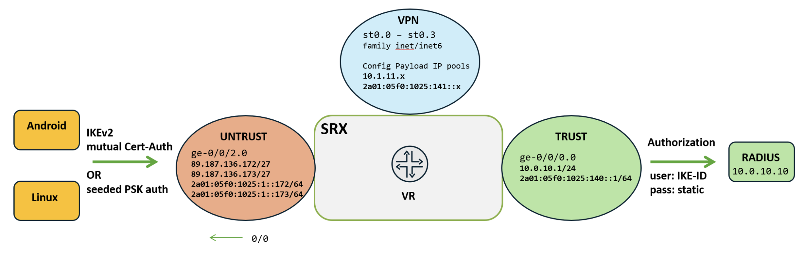
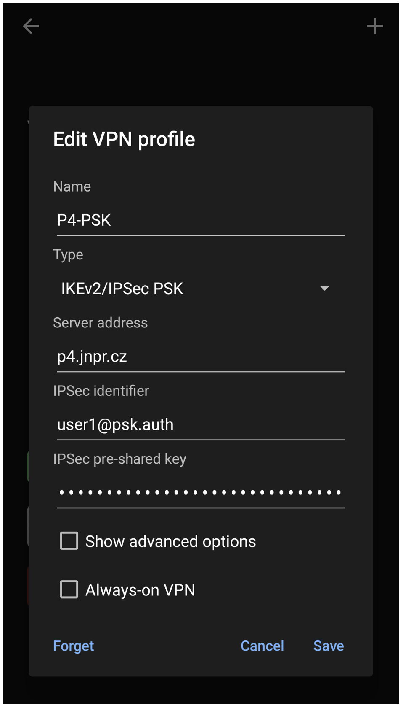
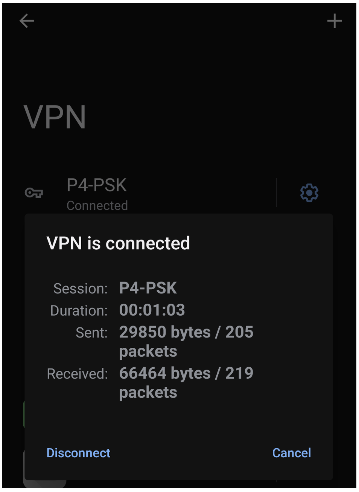
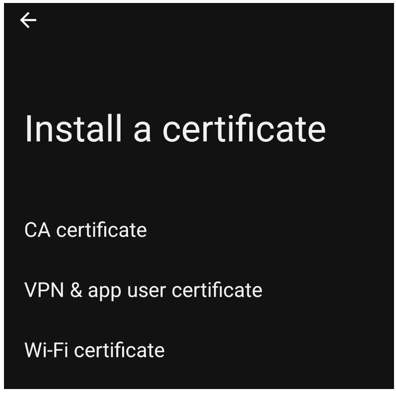
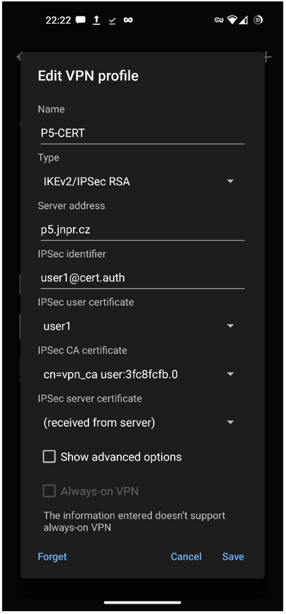
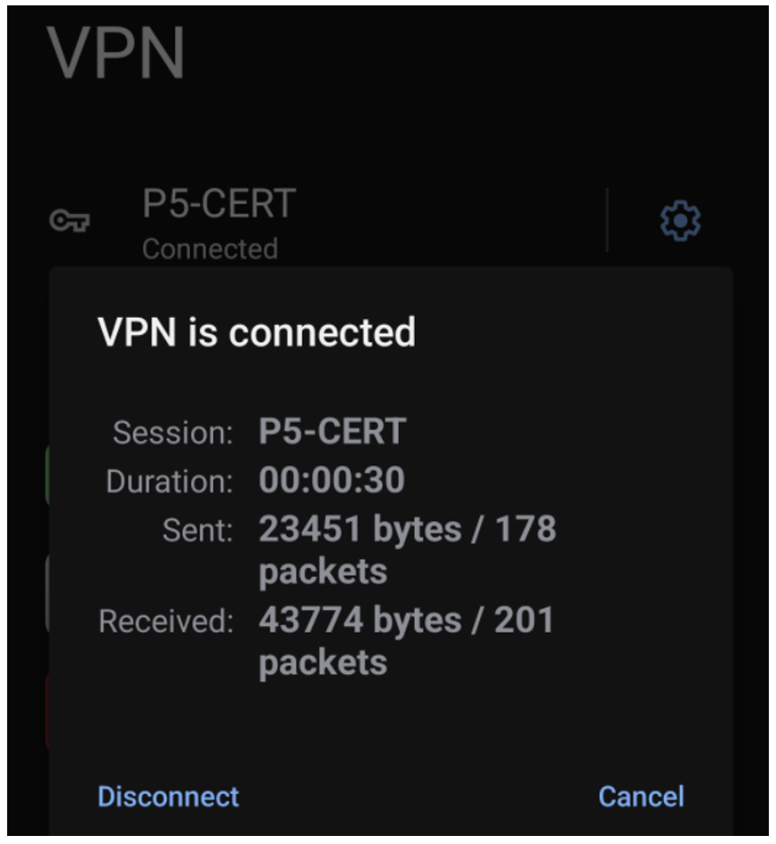

 # com.android.ipsec IKEv2 vs SRX

**Karel Hendrych - 04/13/2025**

Example settings for connecting a VPN from the native IKEv2 client on Android 13+ to a Juniper SRX firewall. Due to the client's nature, use cases may include basic remote access and embedded/IoT scenarios where additional software is undesirable.

## Introduction

For connecting a VPN from the Android platform to the Juniper SRX, multiple options exist:

- Fully supported Juniper Secure Connect (JSC) [client available in Google Play](https://play.google.com/store/apps/details?id=de.juniper.vpn.secureconnect)
- Add-on third-party IPSec app, with [strongSwan](https://play.google.com/store/apps/details?id=org.strongswan.android) Open Source being a typical choice
- Native [Android 11+ IKEv2 implementation](https://source.android.com/docs/core/ota/modular-system/ipsec) written in Java

This article focuses on the Android 11+ native client (Android 13+ practically with the SRX), where the most applicable scheme is IKEv2 mutual RSA certificate-based authentication, referred to in the client settings as IKEv2/IPSec RSA. Neither ECDSA nor EAP-TLS is supported in vanilla Android, as indicated by the scheme name. To support IKEv2 without EAP, the SRX side effectively uses a [pico-cell provisioning configuration](https://www.juniper.net/documentation/us/en/software/junos/vpn-ipsec/topics/topic-map/security-vpns-for-ikev2.html#id-example-configuring-the-srx-series-for-pico-cell-provisioning-with-ikev2-configuration-payload), a VPN style originally designed for the initial enrolment of cell site equipment in mobile networks.

Note: There seem to be specific Android vendor implementations, e.g., Samsung, which supports EAP-TLS, as noted later.

The involved RADIUS backend is used by the SRX for authorization by looking up the username constructed from the client's IKE-ID with a statically defined password. In the case of mutual certificate authentication between the client and the SRX, the mapping of the certificate attribute to the IKE-ID (effectively the subject of authorization by the backend) is validated by the SRX based on [RFC 4945](https://datatracker.ietf.org/doc/html/rfc4945#section-3.1). In the Pre-Shared Keys scenario (referred to as IKEv2/IPSec PSK), a unique PSK per IKE-ID ensures the binding, which is ultimately authorized by RADIUS as well. The client IP addressing using the IKEv2 Configuration Payload (IKEv2 option to provision IP addresses and related settings from the responder to the initiator) for both authentication scenarios is either from a local address pool on the SRX or potentially provided as an attribute from the backend RADIUS, overriding the local pool when used.

Note: Naturally, a question related to VPNs from the Apple ecosystem arises. For the time being, there is an issue where iOS disconnects after approximately 24 minutes during the first re-key operation. The root cause is unknown and would likely require cooperation with a technical expert on Apple's IKEv2 implementation. The disconnect issue seems to be widespread based on internet searches. Please reach out if you happen to be a technical expert on Apple's IKEv2 implementation.

Although documented first, the IKEv2/IPSec PSK authentication is likely less suitable from a security perspective, particularly regarding user factors (such as PSK leaks) and manageability/scalability. Additionally, mixing the SRX PKI and PSK-based proposals for dynamic endpoints on the same interface is possible only when using an IP alias, as different IKE policies can't coexist for dynamic VPN endpoints. The provided configurations for the PSK scheme are based on the [SRX AutoVPN / PSK with Linux strongSwan](https://juniper.github.io/techposts/srx-autovpn-psk-with-linux-strongswan/article) Tech Post article describing the SRX site-to-site AutoVPN for third-party spokes. For illustration purposes, the approach for both PSK and certificate schemes coexisting on the same device will be covered here.

In addition to certificate and PSK, the MSCHAPv2 scheme (which effectively involves EAP) is also implemented in the native Android client. However, it seems to have a known [padding issue](https://wiki.strongswan.org/issues/3673) that is still present, at least in Android 13. The same SRX configuration with the strongSwan app in EAP-MSCHAPv2 mode works fine, leading to this conclusion.

For baseline purposes and troubleshooting (or even trying out without Android), the SRX IKEv2 PSK and certificate troubleshooting sections cover equivalent Linux strongSwan settings.

## Android VPN Attributes

As of Android 13, the following attributes of the native Android IKEv2 implementation, in conjunction with the SRX, have been practically observed. The thoroughly tested devices include the Google Pixel 5 running Android 13-based [/e/OS](https://e.foundation/e-os/) and the vanilla Pixel 7 running stock Android 14.

- IKE parameters suitable with the SRX (IKED IKE control plane):
   - AES-CBC 128/192/256, SHA-256/384/512
   - AES-GCM 128/256
   - CHACHA20-POLY1305
   - DH groups 14, 16
- Transform proposals (please note Android doesn't use Perfect Forward Secrecy):
   - AES-GCM 128/192/256
   - AES-CBC 128/192/256, SHA-256/384/512
   - CHACHA20-POLY1305
- IKE rekey timer of 1 hour, hardcoded
- IPSec rekey timer of 1 hour, hardcoded
- Dual stack support
   - Tunnel endpoint
   - IPv4 and IPv6 traffic selector, Configuration Payload client addressing
- Tunnel all policy only, no narrowing based on gateway traffic selectors
- IKEv2 fragmentation support
- Redial in case of connection change (e.g., mobile->WiFi)
- No tunnel MTU settings, reliance on gateway MSS and fragmentation handling
- Always-on option only with PSK/password scheme (Android 13); Android 14 also for PKI

**Notes:**

- Android 11 seems to be using HMAC-SHA1 as the Pseudo-Random Function (PRF) along with AES CBC/GCM ciphers, but the offered PRF is not compatible with the SRX.
- Android 12 (on Samsung S9 with /e/OS) has issues likely related to certificate requests within IKE, resulting in ID verification failures; this issue is not yet fully understood.
- Android 14 on the Samsung Galaxy S21 and Galaxy Tablet S6 Lite supports EAP-TLS; however, for example, DH group 16 is not available, but DH groups 19, 20, and 21 are. Additionally, IPv6 Configuration Payload addressing is not occurring, which seems to be specific to Samsung.

## Demo Topology

Let's consider the following IPv4/IPv6 dual-stack topology with three zones: UNTRUST, TRUST and VPN zone accommodating tunnel interfaces for both certificate and PSK authentication. As mentioned in the introduction, dynamic endpoint IKE gateways with different proposals (certificate vs. PSK authentication) can't coexist on the same IP address; therefore, an additional pair of IP addresses exists for both public IPv4 and global IPv6. Config Payload IPv4 and IPv6 prefixes are common (and the clients are effectively dual-stacked).



For better clarity, the following table outlines the mapping of external IP addresses to the tunnel adapters and authentication schemes.

| External IP address | Related Tunnel interface | Common AutoVPN suffix |
|:--|:--|:--|
| 89.187.136.172 | st0.0 | @psk.auth |
| 2a01:05f0:1025:1::172 | st0.1 | @psk.auth |
| 89.187.136.173 | st0.2 | @cert.auth |
| 2a01:05f0:1025:1::173 | st0.3 | @cert.auth |

## Sample RADIUS Settings

As noted above, the prerequisite for using the pico-cell VPN style is RADIUS for authorization purposes. The following is a sample of the RADIUS client definition on FreeRADIUS, running on a Debian 12 host (apt install freeradius) with an IP address of **10.0.10.10** from the topology drawing above (SRX as the RADIUS client **10.0.10.1**):

```
/etc/freeradius/3.0/clients.conf:

client vsrx {
         ipaddr = 10.0.10.1
         secret = juniper123
}
```

Then, the following is a simple per-user authorization of the IKE-ID, where the password is defined in the SRX configuration as  config-payload-password setting (entire configuration in the SRX configuration sections):

```
/etc/freeradius/3.0/users:

user1@psk.auth Cleartext-Password :="juniper123"
user1@cert.auth Cleartext-Password :="juniper123"
```

The above method may not be ideal for scalability; however, options such as backend authorization using LDAP or SQL are available. For simple use cases, the following bulk authorization works for IKE-IDs: *@cert.auth and *@psk.auth.

```
/etc/freeradius/3.0/sites-enabled/default:

authorize {

        if (User-Name =~ /.*@cert\.auth$/ && User-Password == "juniper123") {
          update control {
            Auth-Type := Accept
          }
        }

        if (User-Name =~ /.*@psk\.auth$/ && User-Password == "juniper123") {
          update control {
            Auth-Type := Accept
          }
        }

        <OTHER FreeRADIUS AUTHORIZE CONFIGURATION STANZAS>

}
```

After changing the configuration, a restart or reload of FreeRADIUS is needed:

```
systemctl reload freeradius
```

For troubleshooting, the following command provides verbose debug output to the terminal:

```
systemctl stop freeradius
freeradius -X
```

In the case of certificate authentication, clients can be effectively banned from connecting if their user certificate is revoked. Alternatively, for both certificate and PSK authentication, blocking certain IKE IDs is possible, as described in the Blocking Certain IKE IDs on the SRX chapter of the [SRX AutoVPN / PSK with Linux strongSwan](https://juniper.github.io/techposts/srx-autovpn-psk-with-linux-strongswan/article) Tech Post.

Note: If the RADIUS server is EAP-TLS enabled, the SRX behaves transparently and can effectively serve as a VPN termination point for both mutual certificate authentication (with RADIUS authorization) and EAP-TLS authentication (e.g., strongSwan based clients).

## Common SRX VPN Settings

As a prerequisite, IKED must be deployed. By default, for this Tech Post, the vSRX 3.0 used includes the older KMD IKE control daemon. The corresponding command for vSRX and the SRX 4000 series is:

```
> request system software add optional://junos-ike.tgz
```

Sidenote: Platforms such as the SRX1600, SRX2300, SRX4300, and SPC3 already have IKED installed, while branch SRX models do not support IKED. To check if IKED is installed:

```
> show version | match ike 
JUNOS ike [20241219.060016_builder_junos_244_r1]
```

The idea behind the configuration approach is to separate the common elements used by both PSK and certificate authentication into distinct Junos groups. The complete configuration is provided in Appendix 1. Below is the common group that expands on the basic settings in the top configuration hierarchy. Common settings include tuning of MSS, expansion of existing NAT rules, security policies:

```
edit groups dial-up-vpn-common

set security flow tcp-mss ipsec-vpn mss 1400
set security nat source rule-set untrust from zone vpn

set security policies from-zone vpn to-zone trust policy permit-vpn match source-address any
set security policies from-zone vpn to-zone trust policy permit-vpn match destination-address any
set security policies from-zone vpn to-zone trust policy permit-vpn match application junos-icmp-ping
set security policies from-zone vpn to-zone trust policy permit-vpn then permit
set security policies from-zone vpn to-zone untrust policy permit-vpn match source-address any
set security policies from-zone vpn to-zone untrust policy permit-vpn match destination-address any
set security policies from-zone vpn to-zone untrust policy permit-vpn match application any
set security policies from-zone vpn to-zone untrust policy permit-vpn then permit

set security zones security-zone vpn tcp-rst
set security zones security-zone untrust interfaces ge-0/0/2.0 host-inbound-traffic system-services ike
```

RADIUS, and client IP addressing (IKEv2 Config Payload for both IPv4 and IPv6):

```
set access profile ikev2-access-profile-1 authentication-order radius
set access profile ikev2-access-profile-1 address-assignment pool ikev2-address-pool-1
set access profile ikev2-access-profile-1 address-assignment inet6-pool ikev2-address-pool-2
set access profile ikev2-access-profile-1 radius-server 10.0.10.10 secret juniper123
set access profile ikev2-access-profile-1 radius-server 10.0.10.10 routing-instance vr

set access address-assignment pool ikev2-address-pool-1 family inet network 10.1.11.0/24
set access address-assignment pool ikev2-address-pool-1 family inet range ikev2-range-1 low 10.1.11.2
set access address-assignment pool ikev2-address-pool-1 family inet range ikev2-range-1 high 10.1.11.200
set access address-assignment pool ikev2-address-pool-1 family inet xauth-attributes primary-dns 1.1.1.1/32
set access address-assignment pool ikev2-address-pool-1 family inet xauth-attributes secondary-dns 1.0.0.1/32
set access address-assignment pool ikev2-address-pool-2 family inet6 prefix 2a01:05f0:1025:141::/64
set access address-assignment pool ikev2-address-pool-2 family inet6 range ikev2-range-2 low 2a01:05f0:1025:141::2/128
set access address-assignment pool ikev2-address-pool-2 family inet6 range ikev2-range-2 high 2a01:05f0:1025:141::ff/128
set access address-assignment pool ikev2-address-pool-2 family inet6 xauth-attributes primary-dns-ipv6 2606:4700:4700::1111
set access address-assignment pool ikev2-address-pool-2 family inet6 xauth-attributes secondary-dns-ipv6 2606:4700:4700::1001
```

## SRX IKEv2 PSK auth

### SRX IKEv2 PSK Settings

In the PSK scenario, the only reasonable option is to use seeded PSKs, as this ensures that each user (with a unique IKE-ID) has a distinct PSK calculated based on an irreversible function, where the input consists of a PSK seed, IKE-ID, and salt.

The definition of proposals includes timers configured so that the client always initiates rekeying. Note the seeded-pre-shared-key stanza:

```
edit groups dial-up-vpn-psk

set security ike proposal ikev2-proposal-psk authentication-method pre-shared-keys
set security ike proposal ikev2-proposal-psk dh-group group16
set security ike proposal ikev2-proposal-psk encryption-algorithm aes-256-gcm
set security ike proposal ikev2-proposal-psk lifetime-seconds 57600
set security ike policy ikev2-policy-psk proposals ikev2-proposal-psk
set security ike policy ikev2-policy-psk seeded-pre-shared-key ascii-text juniper123
```

Due to how IKE gateways are handled by the SRX, there needs to be a distinct gateway for IPv4 and IPv6 endpoints. Below is the IPv4 configuration, which binds the public IP **89.187.136.172** and accepts IKE-IDs that include @psk.auth as the common part.

```
set security ike gateway ikev2-gw-ipv4-psk ike-policy ikev2-policy-psk
set security ike gateway ikev2-gw-ipv4-psk dynamic user-at-hostname "@psk.auth"
set security ike gateway ikev2-gw-ipv4-psk dynamic ike-user-type group-ike-id
set security ike gateway ikev2-gw-ipv4-psk local-identity hostname p4.jnpr.cz
set security ike gateway ikev2-gw-ipv4-psk external-interface ge-0/0/2.0
set security ike gateway ikev2-gw-ipv4-psk local-address 89.187.136.172
set security ike gateway ikev2-gw-ipv4-psk aaa access-profile ikev2-access-profile-1 config-payload-password juniper123
set security ike gateway ikev2-gw-ipv4-psk version v2-only
set security ike gateway ikev2-gw-ipv4-psk fragmentation size 1280
```

And correspondingly, the IPv6 gateway is configured with the address **2a01:5f0:1025:1::172**:

```
set security ike gateway ikev2-gw-ipv6-psk ike-policy ikev2-policy-psk
set security ike gateway ikev2-gw-ipv6-psk dynamic user-at-hostname "@psk.auth"
set security ike gateway ikev2-gw-ipv6-psk dynamic ike-user-type group-ike-id
set security ike gateway ikev2-gw-ipv6-psk local-identity hostname p4.jnpr.cz
set security ike gateway ikev2-gw-ipv6-psk external-interface ge-0/0/2.0
set security ike gateway ikev2-gw-ipv6-psk local-address 2a01:5f0:1025:1::172
set security ike gateway ikev2-gw-ipv6-psk aaa access-profile ikev2-access-profile-1 config-payload-password juniper123
set security ike gateway ikev2-gw-ipv6-psk version v2-only
set security ike gateway ikev2-gw-ipv6-psk fragmentation size 1280
```

IPsec (transform) proposal, please note that, based on observations, Android does not support Perfect Forward Secrecy (PFS):

```
set security ipsec proposal ipsec-proposal-psk protocol esp
set security ipsec proposal ipsec-proposal-psk encryption-algorithm aes-256-gcm
set security ipsec proposal ipsec-proposal-psk lifetime-seconds 3900
set security ipsec policy ipsec-policy-psk proposals ipsec-proposal-psk
```

VPN configuration for the IPv4 endpoint, based on observations, Android does not accept any remote traffic selectors other than **0.0.0.0/0** and **::/0**, respectively:

```
set security ipsec vpn ipsec-vpn-ipv4-psk bind-interface st0.0
set security ipsec vpn ipsec-vpn-ipv4-psk ike gateway ikev2-gw-ipv4-psk
set security ipsec vpn ipsec-vpn-ipv4-psk ike ipsec-policy ipsec-policy-psk
set security ipsec vpn ipsec-vpn-ipv4-psk traffic-selector ts1 term ipv4 local-ip 0.0.0.0/0
set security ipsec vpn ipsec-vpn-ipv4-psk traffic-selector ts1 term ipv4 remote-ip 0.0.0.0/0
set security ipsec vpn ipsec-vpn-ipv4-psk traffic-selector ts1 term ipv6 local-ip ::/0
set security ipsec vpn ipsec-vpn-ipv4-psk traffic-selector ts1 term ipv6 remote-ip ::/0
```

IPv6 configuration corresponding to the above IPv4 VPN:

```
set security ipsec vpn ipsec-vpn-ipv6-psk bind-interface st0.1
set security ipsec vpn ipsec-vpn-ipv6-psk ike gateway ikev2-gw-ipv6-psk
set security ipsec vpn ipsec-vpn-ipv6-psk ike ipsec-policy ipsec-policy-psk
set security ipsec vpn ipsec-vpn-ipv6-psk traffic-selector ts1 term ipv4 local-ip 0.0.0.0/0
set security ipsec vpn ipsec-vpn-ipv6-psk traffic-selector ts1 term ipv4 remote-ip 0.0.0.0/0
set security ipsec vpn ipsec-vpn-ipv6-psk traffic-selector ts1 term ipv6 local-ip ::/0
set security ipsec vpn ipsec-vpn-ipv6-psk traffic-selector ts1 term ipv6 remote-ip ::/0
```

The assignment of tunnel interfaces for both IPv4 and IPv6 to zones and routing instances is as follows:

```
set security zones security-zone vpn interfaces st0.0
set security zones security-zone vpn interfaces st0.1

set interfaces st0 unit 0 description ipsec-vpn-ipv4-psk
set interfaces st0 unit 0 family inet
set interfaces st0 unit 0 family inet6
set interfaces st0 unit 1 description ipsec-vpn-ipv6-psk
set interfaces st0 unit 1 family inet
set interfaces st0 unit 1 family inet6

set routing-instances vr interface st0.0
set routing-instances vr interface st0.1
```

Finally, apply both common and PSK groups:

```
top
set apply-groups dial-up-vpn-common
set apply-groups dial-up-vpn-psk
commit
```

### Android IKEv2 PSK Validation

The first step in validating this scenario is to retrieve the per-user unique PSK. As long as the IKE policy remains the same, the key will be identical for both the IPv6 and IPv4 gateways:

```
> show security ike pre-shared-key gateway-name ikev2-gw-ipv4-psk user-id user1@psk.auth 
  Pre-shared key: b69d81f4c3e608a83d882c7aed8266fd88144b63
```

Client-side settings are straightforward; the Server address must match the one configured as local on the SRX and IPSec identifier is the one used for generating PSK:



Status upon connection:



SRX side upon successful connection:

```
> show security ike active-peer detail 


Local gateway interface: ge-0/0/2.0
Routing instance: vr
Local address: 89.187.136.172, Port: 4500,
Local IKE-ID : p4.jnpr.cz
Peer address: 81.93.249.121, Port: 5928,
Peer IKE-ID : user1@psk.auth
AAA username: not available
Assigned network attributes:
IP Address      : 10.1.11.18 ,   netmask         : 255.255.255.0
DNS Address     : 1.1.1.1 ,   DNS2 Address    : 1.0.0.1
WINS Address    : 0.0.0.0 ,   WINS2 Address   : 0.0.0.0
Assigned network attributes (IPv6):
IP Address      : 2a01:5f0:1025:141::12 ,   prefix          : 64
DNS Address     : 2606:4700:4700::1111 ,   DNS2 Address    : 2606:4700:4700::1001

Previous Peer address   : 0.0.0.0, Port               : 0
Active IKE SA indexes   : 5974
IKE SA negotiated       : 1
IPSec tunnels active    : 1, IPSec Tunnel IDs   : 500027
```

Corresponding IKED logs are as follows:

```
vsrx-p4 iked[17437]: IKE_GATEWAY_ID_VALIDATION_SUCCESS: IKE: Gateway N:ikev2-gw-ipv4-psk L:89.187.136.172:500 R:81.93.249.121:5928 Successful ike-id:user1@psk.auth U:N/A IKE:IKEv2 Role:R
\vsrx-p4 iked[17437]: IKE_VPN_UP_ALARM_USER: VPN ipsec-vpn-ipv4-psk from 81.93.249.121 is up. Local-ip: 89.187.136.172, gateway name: ikev2-gw-ipv4-psk, vpn name: ipsec-vpn-ipv4-psk, tunnel-id: 500027, local tunnel-if: st0.0, remote tunnel-ip: 80.92.248.120, Local IKE-ID: p4.jnpr.cz, Remote IKE-ID: user1@psk.auth, AAA username: Not-applicable, VR id: root, Traffic-selector: ts1, Traffic-selector local ID: ipv4(0,0-65535,0.0.0.0-255.255.255.255) ipv6(0,0-65535,::-ffff:ffff:ffff:ffff:ffff:ffff:ffff:ffff) , Traffic-selector remote ID: ipv4(0,0-65535,10.1.11.18-10.1.11.18) ipv6(0,0-65535,2a01:5f0:1025:141::12-2a01:5f0:1025:141::12) , SA Type: dynamic
```

### SRX IKEv2 PSK Troubleshooting

An easy way to verify if the SRX configuration is correct is to test it from a Linux client, which provides rich debugging capabilities. One of the available options is the [strongSwan](https://strongswan.org/) OSS software, which is included in modern Linux distributions.

To install the minimal strongSwan packages on Debian Linux 12, the following list of packages can be used for easy copy/pasting as an argument of the apt install command (this will bring in the necessary dependencies):

```
charon-systemd libstrongswan libstrongswan-extra-plugins libstrongswan-standard-plugins strongswan-libcharon strongswan-swanctl
```

The next step is to generate the Linux-specific (seeded) PSK on the SRX for user2@psk.auth:

```
> show security ike pre-shared-key gateway-name ikev2-gw-ipv4-psk user-id user2@psk.auth 
Pre-shared key: 724ce42300e0d3f65ab739dababde2eeb7d8559a
```

Next, the example settings for the IKEv2 VPN in the Linux /etc/swanctl/swanctl.conf file for the specific setup with IPv4 and IPv6 Config Payload addressing are as follows (the remote IPv4 selector is set to specific prefixes to avoid potential loss of management connection when using **0.0.0.0/0**).

```
connections {
   p4 {
      remote_addrs = p4.jnpr.cz
      version = 2
      proposals = aes256gcm16-prfsha384-modp4096
      keyingtries = 0
      dpd_delay = 30
      rekey_time = 8h
      vips= 0.0.0.0, ::
      local {
         auth = psk
         id = user2@psk.auth
      }
      remote {
         auth = psk
         id = p4.jnpr.cz
      }
      children {
         p4 {
            remote_ts = 10.0.10.0/24, 1.1.1.1/32, ::/0
            esp_proposals = aes256gcm16
            start_action = none
            close_action = none
            dpd_action = none
         }
      }
   }
}
secrets {
   ike-srx {
       id = p4.jnpr.cz
       secret = 724ce42300e0d3f65ab739dababde2eeb7d8559a
   }
}
```

Finally, restart strongSwan and initiate the VPN. The terminal output will indicate a successful VPN connection, followed by a listing of the IPsec Security Associations (SAs):

```
# systemctl restart strongswan
# swanctl --initiate --child p4

[IKE] initiating IKE_SA p4[1] to 89.187.136.172
[ENC] generating IKE_SA_INIT request 0 [ SA KE No N(NATD_S_IP) N(NATD_D_IP) N(FRAG_SUP) N(HASH_ALG) N(REDIR_SUP) ]
[NET] sending packet: from 192.168.123.121[500] to 89.187.136.172[500] (712 bytes)
[NET] received packet: from 89.187.136.172[500] to 192.168.123.121[500] (786 bytes)
[ENC] parsed IKE_SA_INIT response 0 [ SA KE No N(NATD_S_IP) N(NATD_D_IP) N(FRAG_SUP) N((40002)) V V V V ]
[IKE] received NetScreen Technologies vendor ID
[ENC] received unknown vendor ID: 09:00:26:89:df:d6:b7:12
[IKE] received Juniper SRX vendor ID
[ENC] received unknown vendor ID: 67:96:70:50:f1:38:eb:51:de:0c:a6:5f:54:f1:f0:36
[CFG] selected proposal: IKE:AES_GCM_16_256/PRF_HMAC_SHA2_384/MODP_4096
[IKE] local host is behind NAT, sending keep alives
[IKE] sending cert request for "CN=P1_CA"
[IKE] authentication of 'user2@psk.auth' (myself) with pre-shared key
[IKE] establishing CHILD_SA p4{1}
[ENC] generating IKE_AUTH request 1 [ IDi N(INIT_CONTACT) CERTREQ IDr AUTH CPRQ(ADDR ADDR6 DNS DNS6) SA TSi TSr N(MOBIKE_SUP) N(NO_ADD_ADDR) N(EAP_ONLY) N(MSG_ID_SYN_SUP) ]
[NET] sending packet: from 192.168.123.121[4500] to 89.187.136.172[4500] (422 bytes)
[NET] received packet: from 89.187.136.172[4500] to 192.168.123.121[4500] (428 bytes)
[ENC] parsed IKE_AUTH response 1 [ IDr AUTH CPRP(ADDR MASK DNS DNS ADDR6 DNS6 DNS6) SA TSi TSr ]
[IKE] authentication of 'p4.jnpr.cz' with pre-shared key successful
[CFG] handling INTERNAL_IP4_NETMASK attribute failed
[IKE] installing DNS server 1.1.1.1 to /etc/resolv.conf
[IKE] installing DNS server 1.0.0.1 to /etc/resolv.conf
[IKE] installing DNS server 2606:4700:4700::1111 to /etc/resolv.conf
[IKE] installing DNS server 2606:4700:4700::1001 to /etc/resolv.conf
[IKE] installing new virtual IP 10.1.11.4
[IKE] installing new virtual IP 2a01:5f0:1025:141::4
[IKE] IKE_SA p4[1] established between 192.168.123.121[user2@psk.auth]...89.187.136.172[p4.jnpr.cz]
[IKE] scheduling rekeying in 28336s
[IKE] maximum IKE_SA lifetime 31216s
[CFG] selected proposal: ESP:AES_GCM_16_256/NO_EXT_SEQ
[IKE] CHILD_SA p4{1} established with SPIs c0d2b836_i 720d220a_o and TS 10.1.11.4/32 2a01:5f0:1025:141::4/128 === 1.1.1.1/32 10.0.10.0/24 ::/0
initiate completed successfully

# swanctl --list-sas

p4: #1, ESTABLISHED, IKEv2, 169735011a7aab7c_i* da9daeb76f214ae9_r
  local  'user2@psk.auth' @ 192.168.123.121[4500] [10.1.11.4 2a01:5f0:1025:141::4]
  remote 'p4.jnpr.cz' @ 89.187.136.172[4500]
  AES_GCM_16-256/PRF_HMAC_SHA2_384/MODP_4096
  established 2s ago, rekeying in 28334s
  p4: #1, reqid 1, INSTALLED, TUNNEL-in-UDP, ESP:AES_GCM_16-256
    installed 2s ago, rekeying in 3243s, expires in 3958s
    in  c0d2b836,      0 bytes,     0 packets
    out 720d220a,      0 bytes,     0 packets
    local  10.1.11.4/32 2a01:5f0:1025:141::4/128
    remote 1.1.1.1/32 10.0.10.0/24 ::/0
```

## SRX IKEv2 Certificate auth

The obvious prerequisite for certificate authentication is a PKI infrastructure that issues certificates to SRX VPN head-end and remote access clients. In an EAP-TLS scenario, a certificate for RADIUS must also be issued. However, in our specific example of mutual certificate authentication, RADIUS serves solely as authorization for IKE-IDs, without the use of EAP.

### PKI Infrastructure

There are professional PKI solutions and various wrappers, primarily around OpenSSL. For this specific example, a tailored wrapper script named [SRX_VPN_demo_CA](https://github.com/JNPRAutomate/SRX_VPN_demo_CA) will be used for SRX VPN demonstration purposes (reading the online documentation is recommended). The following are the steps conducted on Debian Linux 12 to set up a Certificate Authority (CA), the SRX VPN head-end certificate, and user certificates (for Android VPN and Linux troubleshooting purposes).

To install the SRX VPN demo CA from GitHub, either cloning the repository or download of the .zip file directly from GitHub is possible. To clone:

```
apt install --no-install-recommends git
git clone https://github.com/JNPRAutomate/SRX_VPN_demo_CA
cd SRX_VPN_demo_CA
chmod 755 .needed_binaries.sh *.sh
```

Generation of CA key/certificate valid for 10 years (by default, 4096-bit RSA with SHA-256) with a common name of VPN_CA:

```
./1_CA_init.sh VPN_CA 3650
```

FQDN (Fully Qualified Domain Name) for the certificate's DNS Subject Alternative Name of the SRX head-end, followed by the generation of a key/certificate valid for 2 years:

```
echo p5.jnpr.cz > cert_list_server
./2_CA_gencerts_from_cert_list-server.sh 730
```

Configuration of the sample password (pass) for PKCS#12 containers containing the user key and certificate, along with the specification of the user's FQDN (email) Subject Alternative Names (SAN) for matching the AutoVPN common IKE-ID part. This is followed by the generation of certificates valid for 1 year:

```
echo pass > PKCS12_password
echo user1@cert.auth >  cert_list_user
echo user2@cert.auth >> cert_list_user
./3_CA_gencerts_from_cert_list-user.sh 365
```

Sample transfer of the private key, certificate, and CA certificate to the SRX, along with the transfer of PKCS#12 containers and the CA certificate from the CA host machine to the distribution site (ideally the private keys would be generated on-box):

```
scp CA/cacert.pem CA/p5_jnpr_cz-key.pem CA/p5_jnpr_cz-cert.pem vsrx:
scp CA_host:SRX_VPN_demo_CA/CA/{user*.p12, cacert.crt} .
```

### SRX Side PKI Setup

The CA profile is intentionally kept outside of the Junos group because if the group is deactivated, the CA certificate would be cleared. Therefore, the CA profile is configured in the top config hierarchy:

```
set security pki ca-profile VPN_CA ca-identity VPN_CA
set security pki ca-profile VPN_CA revocation-check disable
```

The next step is to load the CA certificate and private key along with matching certificate, followed by validation. Typical failure reasons are related to the CRL (or generally revocation check), which is deactivated for demonstration purposes:

```
> request security pki local-certificate load filename p5_jnpr_cz-cert.pem key p5_jnpr_cz-key.pem certificate-id p5-jnpr-cz_VPN_CA
> request security pki ca-certificate load ca-profile VPN_CA filename cacert.pem
> request security pki local-certificate verify certificate-id p5-jnpr-cz_VPN_CA
```

### SRX IKEv2 Cert Settings

Definition of proposals with timers configured so that the client always initiates rekeying. The difference between the PSK proposal and the certificate-based proposal lies in the use of different authentication methods (RSA signatures) and the reference to the certificate loaded in the previous step:

```
edit groups dial-up-vpn-cert

set security ike proposal ikev2-proposal-cert authentication-method rsa-signatures
set security ike proposal ikev2-proposal-cert dh-group group16

set security ike proposal ikev2-proposal-cert encryption-algorithm aes-256-gcm
set security ike proposal ikev2-proposal-cert lifetime-seconds 57600

set security ike policy ikev2-policy-cert proposals ikev2-proposal-cert
set security ike policy ikev2-policy-cert certificate local-certificate p5-jnpr-cz_VPN_CA
```

Due to how IKE gateways are handled by the SRX, there needs to be a distinct gateway for IPv4 and IPv6 endpoints. Below is the IPv4 configuration, which binds the public IP 89.187.136.173 and accepts the common IKE-ID part @cert.auth:

```
set security ike gateway ikev2-gw-ipv4-cert ike-policy ikev2-policy-cert
set security ike gateway ikev2-gw-ipv4-cert dynamic user-at-hostname "@cert.auth"
set security ike gateway ikev2-gw-ipv4-cert dynamic ike-user-type group-ike-id
set security ike gateway ikev2-gw-ipv4-cert local-identity hostname p5.jnpr.cz
set security ike gateway ikev2-gw-ipv4-cert external-interface ge-0/0/2.0
set security ike gateway ikev2-gw-ipv4-cert local-address 89.187.136.173
set security ike gateway ikev2-gw-ipv4-cert aaa access-profile ikev2-access-profile-1 config-payload-password juniper123
set security ike gateway ikev2-gw-ipv4-cert version v2-only
set security ike gateway ikev2-gw-ipv4-cert fragmentation size 1280
```

Correspondingly, the IPv6 gateway is configured with the address 2a01:5f0:1025:1::173:

```
set security ike gateway ikev2-gw-ipv6-cert ike-policy ikev2-policy-cert
set security ike gateway ikev2-gw-ipv6-cert dynamic user-at-hostname "@cert.auth"
set security ike gateway ikev2-gw-ipv6-cert dynamic ike-user-type group-ike-id
set security ike gateway ikev2-gw-ipv6-cert local-identity hostname p5.jnpr.cz
set security ike gateway ikev2-gw-ipv6-cert external-interface ge-0/0/2.0
set security ike gateway ikev2-gw-ipv6-cert local-address 2a01:5f0:1025:1::173
set security ike gateway ikev2-gw-ipv6-cert aaa access-profile ikev2-access-profile-1 config-payload-password juniper123
set security ike gateway ikev2-gw-ipv6-cert version v2-only
set security ike gateway ikev2-gw-ipv6-cert fragmentation size 1280
```

The IPsec (transform) proposal is the same as that for PSK authentication. Please note that, based on observations, Android does not support Perfect Forward Secrecy (PFS):

```
set security ipsec proposal ipsec-proposal-cert protocol esp
set security ipsec proposal ipsec-proposal-cert encryption-algorithm aes-256-gcm
set security ipsec proposal ipsec-proposal-cert lifetime-seconds 3900
set security ipsec policy ipsec-policy-cert proposals ipsec-proposal-cert
```

VPN configuration for the IPv4 endpoint: Based on observations, Android does not accept any remote traffic selectors other than **0.0.0.0/0** and **::/0**, respectively. The difference between the PSK and certificate groups is the use of different st0 logical units:

```
set security ipsec vpn ipsec-vpn-ipv4-cert bind-interface st0.2
set security ipsec vpn ipsec-vpn-ipv4-cert ike gateway ikev2-gw-ipv4-cert
set security ipsec vpn ipsec-vpn-ipv4-cert ike ipsec-policy ipsec-policy-cert
set security ipsec vpn ipsec-vpn-ipv4-cert traffic-selector ts1 term ipv4 local-ip 0.0.0.0/0
set security ipsec vpn ipsec-vpn-ipv4-cert traffic-selector ts1 term ipv4 remote-ip 0.0.0.0/0
set security ipsec vpn ipsec-vpn-ipv4-cert traffic-selector ts1 term ipv6 local-ip ::/0
set security ipsec vpn ipsec-vpn-ipv4-cert traffic-selector ts1 term ipv6 remote-ip ::/0
```

IPv6 configuration corresponding to the above IPv4 VPN:

```
set security ipsec vpn ipsec-vpn-ipv6-cert bind-interface st0.3
set security ipsec vpn ipsec-vpn-ipv6-cert df-bit clear
set security ipsec vpn ipsec-vpn-ipv6-cert ike gateway ikev2-gw-ipv6-cert
set security ipsec vpn ipsec-vpn-ipv6-cert ike ipsec-policy ipsec-policy-cert
set security ipsec vpn ipsec-vpn-ipv6-cert traffic-selector ts1 term ipv4 local-ip 0.0.0.0/0
set security ipsec vpn ipsec-vpn-ipv6-cert traffic-selector ts1 term ipv4 remote-ip 0.0.0.0/0
set security ipsec vpn ipsec-vpn-ipv6-cert traffic-selector ts1 term ipv6 local-ip ::/0
set security ipsec vpn ipsec-vpn-ipv6-cert traffic-selector ts1 term ipv6 remote-ip ::/0
```

The assignment of tunnel interfaces for both IPv4 and IPv6 to zones and routing instances is as follows:

```
set security zones security-zone vpn interfaces st0.2
set security zones security-zone vpn interfaces st0.3
set interfaces st0 unit 2 description ipsec-vpn-ipv4-cert
set interfaces st0 unit 2 family inet
set interfaces st0 unit 2 family inet6
set interfaces st0 unit 3 description ipsec-vpn-ipv6-cert
set interfaces st0 unit 3 family inet
set interfaces st0 unit 3 family inet6

set routing-instances vr interface st0.2
set routing-instances vr interface st0.3
```

Finally, apply both the common and certificate groups:

```
top

set apply-groups dial-up-vpn-common
set apply-groups dial-up-vpn-cert
commit
```

### Android IKEv2 Cert Validation

Normally, a solution like an MDM would handle the distribution of PKI materials. However, for testing purposes, an easy way to retrieve PKI materials is to download them from a secure HTTPS site---both the DER-encoded CA certificate and the PKCS#12 container (*.p12 files) containing the user's private key and certificate (which also includes the CA certificate, but Android does not seem to support the import of the embedded CA certificate). After downloading, import the DER-encoded CA certificate (.cer) and the user's key/certificate from the encrypted PKCS#12 container, via the VPN & app user certificate menu item:



In the next step, configure the VPN profile, where a critical part is ensuring that the Server address matches the SRX certificate's DNS SAN and the IPSec identifier corresponds to the client's certificate email SAN.



Followed by initiating the VPN connection:



SRX side upon a successful connection:

```
> show security ike active-peer detail 

Local gateway interface: ge-0/0/2.0
Routing instance: vr
Local address: 89.187.136.173, Port: 4500,
Local IKE-ID : p5.jnpr.cz
Peer address: 90.176.69.153, Port: 17674,
Peer IKE-ID : user1@cert.auth
AAA username: not available
Assigned network attributes:
IP Address      : 10.1.11.28 ,   netmask         : 255.255.255.0
DNS Address     : 1.1.1.1 ,   DNS2 Address    : 1.0.0.1
WINS Address    : 0.0.0.0 ,   WINS2 Address   : 0.0.0.0
Assigned network attributes (IPv6):
IP Address      : 2a01:5f0:1025:141::1c ,   prefix          : 64
DNS Address     : 2606:4700:4700::1111 ,   DNS2 Address    : 2606:4700:4700::1001

Previous Peer address   : 0.0.0.0, Port               : 0
Active IKE SA indexes   : 24385
IKE SA negotiated       : 1
IPSec tunnels active    : 1, IPSec Tunnel IDs   : 500062
```

Corresponding IKED logs are as follows:

```
vsrx-p4 iked[17449]: IKE_GATEWAY_ID_VALIDATION_SUCCESS: IKE: Gateway N:ikev2-gw-ipv4-cert L:89.187.136.173:500 R:90.176.69.153:4412 Successful ike-id:user1@cert.auth U:N/A IKE:IKEv2 Role:R

vsrx-p4 iked[17449]: IKE_VPN_UP_ALARM_USER: VPN ipsec-vpn-ipv4-cert from 90.176.69.153 is up. Local-ip: 89.187.136.173, gateway name: ikev2-gw-ipv4-cert, vpn name: ipsec-vpn-ipv4-cert, tunnel-id: 500063, local tunnel-if: st0.2, remote tunnel-ip: 90.176.69.153, Local IKE-ID: p5.jnpr.cz, Remote IKE-ID: user1@cert.auth, AAA username: Not-applicable, VR id: root, Traffic-selector: ts1, Traffic-selector local ID: ipv4(0,0-65535,0.0.0.0-255.255.255.255) ipv6(0,0-65535,::-ffff:ffff:ffff:ffff:ffff:ffff:ffff:ffff) , Traffic-selector remote ID: ipv4(0,0-65535,10.1.11.29-10.1.11.29) ipv6(0,0-65535,2a01:5f0:1025:141::1d-2a01:5f0:1025:141::1d) , SA Type: dynamic
```

### SRX IKEv2 Cert Troubleshooting

Similarly, as with SRX IKEv2 PSK troubleshooting, strongSwan on Linux serves as the tool to validate PKI and VPN SRX head-end settings, offering rich logging and debugging options. The strongSwan installation steps are included in the PSK troubleshooting section and in addition to the PSK authentication scheme, PKI materials need to be transferred to the Linux machine:

PKI materials is placed in the folders as shown below:

| Purpose | File path |
|:--|:--|
| CA certificate | /etc/swanctl/x509ca/VPN_CA-cert.pem |
| Private key | /etc/swanctl/private/user2-key.pem |
| Certificate | /etc/swanctl/x509/user2-cert.pem |

Next, the example settings for the IKEv2 VPN in the Linux /etc/swanctl/swanctl.conf file for certificate authentication with IPv4 and IPv6 Config Payload addressing are as follows (the remote IPv4 selector is set to specific prefixes to avoid potential loss of remote management connection when using **0.0.0.0/0**). This configuration requires manual VPN tunnel initiation:

```
connections {
   p5 {
      remote_addrs = p5.jnpr.cz
      version = 2
      proposals = aes256gcm16-prfsha384-modp4096
      keyingtries = 0
      dpd_delay = 30
      rekey_time = 8h
      vips= 0.0.0.0, ::
      local {
         auth = pubkey
         id = user2@cert.auth
         certs = user2-cert.pem
      }
      remote {
         auth = pubkey 
         id = p5.jnpr.cz
      }
      children {
         p5 {
            remote_ts = 10.0.10.0/24, 1.1.1.1/32, ::/0
            esp_proposals = aes256gcm16
            start_action = none
            close_action = none
            dpd_action = none
         }
      }
   }
}
```

Finally, to restart strongSwan, check the PKI materials, and initiate the VPN - the terminal output will indicate a successful VPN connection, followed by a listing of the IPsec Security Associations (SAs):

```
# systemctl restart strongswan

# swanctl --list-certs

List of X.509 End Entity Certificates

  subject:  "CN=user2"
  issuer:   "CN=VPN_CA"
  validity:  not before Feb 20 11:29:39 2025, ok
             not after  Feb 20 11:29:39 2026, ok (expires in 359 days)
  serial:    04
  altNames:  user2@cert.auth
  flags:     clientAuth 
  authkeyId: ca:f1:a9:0f:70:57:c6:3d:ec:a4:5d:3b:4e:de:54:a4:d6:f8:fc:97
  subjkeyId: 44:e0:84:c3:9e:85:41:6a:45:87:ee:4b:0c:dd:4c:a2:8f:1f:81:f9
  pubkey:    RSA 4096 bits, has private key
  keyid:     de:6b:14:22:f6:3f:e8:16:a4:5c:b8:6e:97:ea:13:1b:13:8f:af:ee
  subjkey:   44:e0:84:c3:9e:85:41:6a:45:87:ee:4b:0c:dd:4c:a2:8f:1f:81:f9

List of X.509 CA Certificates

  subject:  "CN=VPN_CA"
  issuer:   "CN=VPN_CA"
  validity:  not before Feb 20 11:24:24 2025, ok
             not after  Feb 18 11:24:24 2035, ok (expires in 3644 days)
  serial:    01
  flags:     CA CRLSign self-signed 
  pathlen:   0
  subjkeyId: ca:f1:a9:0f:70:57:c6:3d:ec:a4:5d:3b:4e:de:54:a4:d6:f8:fc:97
  pubkey:    RSA 4096 bits
  keyid:     57:4e:92:c0:52:b4:c1:20:a9:27:86:a8:5e:e9:05:a4:cb:e7:61:ee
  subjkey:   ca:f1:a9:0f:70:57:c6:3d:ec:a4:5d:3b:4e:de:54:a4:d6:f8:fc:97

# swanctl --initiate --child p5

[IKE] initiating IKE_SA p5[1] to 89.187.136.173
[ENC] generating IKE_SA_INIT request 0 [ SA KE No N(NATD_S_IP) N(NATD_D_IP) N(FRAG_SUP) N(HASH_ALG) N(REDIR_SUP) ]
[NET] sending packet: from 192.168.123.121[500] to 89.187.136.173[500] (712 bytes)
[NET] received packet: from 89.187.136.173[500] to 192.168.123.121[500] (811 bytes)
[ENC] parsed IKE_SA_INIT response 0 [ SA KE No N(NATD_S_IP) N(NATD_D_IP) N(FRAG_SUP) N((40002)) CERTREQ V V V V ]
[IKE] received NetScreen Technologies vendor ID
[ENC] received unknown vendor ID: 09:00:26:89:df:d6:b7:12
[IKE] received Juniper SRX vendor ID
[ENC] received unknown vendor ID: 67:96:70:50:f1:38:eb:51:de:0c:a6:5f:54:f1:f0:36
[CFG] selected proposal: IKE:AES_GCM_16_256/PRF_HMAC_SHA2_384/MODP_4096
[IKE] local host is behind NAT, sending keep alives
[IKE] received cert request for "CN=VPN_CA"
[IKE] sending cert request for "CN=VPN_CA"
[IKE] authentication of 'user2@cert.auth' (myself) with RSA signature successful
[IKE] sending end entity cert "CN=user2"
[IKE] establishing CHILD_SA p5{1}
[ENC] generating IKE_AUTH request 1 [ IDi CERT N(INIT_CONTACT) CERTREQ IDr AUTH CPRQ(ADDR ADDR6 DNS DNS6) SA TSi TSr N(MOBIKE_SUP) N(NO_ADD_ADDR) N(EAP_ONLY) N(MSG_ID_SYN_SUP) ]
[ENC] splitting IKE message (2206 bytes) into 2 fragments
[ENC] generating IKE_AUTH request 1 [ EF(1/2) ]
[ENC] generating IKE_AUTH request 1 [ EF(2/2) ]
[NET] sending packet: from 192.168.123.121[4500] to 89.187.136.173[4500] (1248 bytes)
[NET] sending packet: from 192.168.123.121[4500] to 89.187.136.173[4500] (1023 bytes)
[NET] received packet: from 89.187.136.173[4500] to 192.168.123.121[4500] (1227 bytes)
[ENC] parsed IKE_AUTH response 1 [ EF(1/2) ]
[ENC] received fragment #1 of 2, waiting for complete IKE message
[NET] received packet: from 89.187.136.173[4500] to 192.168.123.121[4500] (1048 bytes)
[ENC] parsed IKE_AUTH response 1 [ EF(2/2) ]
[ENC] received fragment #2 of 2, reassembled fragmented IKE message (2210 bytes)
[ENC] parsed IKE_AUTH response 1 [ IDr CERT AUTH CPRP(ADDR MASK DNS DNS ADDR6 DNS6 DNS6) SA TSi TSr ]
[IKE] received end entity cert "CN=p5.jnpr.cz"
[CFG]   using certificate "CN=p5.jnpr.cz"
[CFG]   using trusted ca certificate "CN=VPN_CA"
[CFG]   reached self-signed root ca with a path length of 0
[CFG] checking certificate status of "CN=p5.jnpr.cz"
[CFG] certificate status is not available
[IKE] authentication of 'p5.jnpr.cz' with RSA signature successful
[CFG] handling INTERNAL_IP4_NETMASK attribute failed
[IKE] installing DNS server 1.1.1.1 to /etc/resolv.conf
[IKE] installing DNS server 1.0.0.1 to /etc/resolv.conf
[IKE] installing DNS server 2606:4700:4700::1111 to /etc/resolv.conf
[IKE] installing DNS server 2606:4700:4700::1001 to /etc/resolv.conf
[IKE] installing new virtual IP 10.1.11.32
[IKE] installing new virtual IP 2a01:5f0:1025:141::20
[IKE] IKE_SA p5[1] established between 192.168.123.121[user2@cert.auth]...89.187.136.173[p5.jnpr.cz]
[IKE] scheduling rekeying in 26412s
[IKE] maximum IKE_SA lifetime 29292s
[CFG] selected proposal: ESP:AES_GCM_16_256/NO_EXT_SEQ
[IKE] CHILD_SA p5{1} established with SPIs c5e3892c_i e23e30ac_o and TS 10.1.11.32/32 2a01:5f0:1025:141::20/128 === 10.0.10.0/24 89.187.136.162/32 ::/0
initiate completed successfully

# swanctl --list-sas

p5: #1, ESTABLISHED, IKEv2, 5d2880919a6e8088_i* ae296a93d8ec9da9_r
  local  'user2@cert.auth' @ 192.168.123.121[4500] [10.1.11.32 2a01:5f0:1025:141::20]
  remote 'p5.jnpr.cz' @ 89.187.136.173[4500]
  AES_GCM_16-256/PRF_HMAC_SHA2_384/MODP_4096
  established 253s ago, rekeying in 26159s
  p5: #1, reqid 1, INSTALLED, TUNNEL-in-UDP, ESP:AES_GCM_16-256
    installed 253s ago, rekeying in 3279s, expires in 3707s
    in  c5e3892c,      0 bytes,     0 packets
    out e23e30ac,      0 bytes,     0 packets
    local  10.1.11.32/32 2a01:5f0:1025:141::20/128
    remote 10.0.10.0/24 89.187.136.162/32 ::/0
```

## Appendix 1 -- Complete Configuration

### Common Settings

Junos group with common settings for both PSK and Certificate authentication:

```
edit groups dial-up-vpn-common

set apply-flags omit
set security flow tcp-mss ipsec-vpn mss 1400
set security nat source rule-set untrust from zone vpn
set security policies from-zone vpn to-zone trust policy permit-vpn match source-address any
set security policies from-zone vpn to-zone trust policy permit-vpn match destination-address any
set security policies from-zone vpn to-zone trust policy permit-vpn match application junos-icmp-ping
set security policies from-zone vpn to-zone trust policy permit-vpn then permit
set security policies from-zone vpn to-zone untrust policy permit-vpn match source-address any
set security policies from-zone vpn to-zone untrust policy permit-vpn match destination-address any
set security policies from-zone vpn to-zone untrust policy permit-vpn match application any
set security policies from-zone vpn to-zone untrust policy permit-vpn then permit
set security zones security-zone vpn tcp-rst
set security zones security-zone untrust interfaces ge-0/0/2.0 host-inbound-traffic system-services ike
set access profile ikev2-access-profile-1 authentication-order radius
set access profile ikev2-access-profile-1 address-assignment pool ikev2-address-pool-1
set access profile ikev2-access-profile-1 address-assignment inet6-pool ikev2-address-pool-2
set access profile ikev2-access-profile-1 radius-server 10.0.10.10 secret juniper123
set access profile ikev2-access-profile-1 radius-server 10.0.10.10 routing-instance vr
set access address-assignment pool ikev2-address-pool-1 family inet network 10.1.11.0/24
set access address-assignment pool ikev2-address-pool-1 family inet range ikev2-range-1 low 10.1.11.2
set access address-assignment pool ikev2-address-pool-1 family inet range ikev2-range-1 high 10.1.11.200
set access address-assignment pool ikev2-address-pool-1 family inet xauth-attributes primary-dns 1.1.1.1/32
set access address-assignment pool ikev2-address-pool-1 family inet xauth-attributes secondary-dns 1.0.0.1/32
set access address-assignment pool ikev2-address-pool-2 family inet6 prefix 2a01:05f0:1025:141::/64
set access address-assignment pool ikev2-address-pool-2 family inet6 range ikev2-range-2 low 2a01:05f0:1025:141::2/128
set access address-assignment pool ikev2-address-pool-2 family inet6 range ikev2-range-2 high 2a01:05f0:1025:141::ff/128
set access address-assignment pool ikev2-address-pool-2 family inet6 xauth-attributes primary-dns-ipv6 2606:4700:4700::1111
set access address-assignment pool ikev2-address-pool-2 family inet6 xauth-attributes secondary-dns-ipv6 2606:4700:4700::1001
```

### PSK authentication

Junos group with configuration for PSK authentication:

```
edit groups dial-up-vpn-psk

set apply-flags omit
set security ike proposal ikev2-proposal-psk authentication-method pre-shared-keys
set security ike proposal ikev2-proposal-psk dh-group group16
set security ike proposal ikev2-proposal-psk encryption-algorithm aes-256-gcm
set security ike proposal ikev2-proposal-psk lifetime-seconds 57600
set security ike policy ikev2-policy-psk proposals ikev2-proposal-psk
set security ike policy ikev2-policy-psk seeded-pre-shared-key ascii-text juniper123
set security ike gateway ikev2-gw-ipv4-psk ike-policy ikev2-policy-psk
set security ike gateway ikev2-gw-ipv4-psk dynamic user-at-hostname "@psk.auth"
set security ike gateway ikev2-gw-ipv4-psk dynamic ike-user-type group-ike-id
set security ike gateway ikev2-gw-ipv4-psk local-identity hostname p4.jnpr.cz
set security ike gateway ikev2-gw-ipv4-psk external-interface ge-0/0/2.0
set security ike gateway ikev2-gw-ipv4-psk local-address 89.187.136.172
set security ike gateway ikev2-gw-ipv4-psk aaa access-profile ikev2-access-profile-1 config-payload-password juniper123
set security ike gateway ikev2-gw-ipv4-psk version v2-only
set security ike gateway ikev2-gw-ipv4-psk fragmentation size 1280
set security ike gateway ikev2-gw-ipv6-psk ike-policy ikev2-policy-psk
set security ike gateway ikev2-gw-ipv6-psk dynamic user-at-hostname "@psk.auth"
set security ike gateway ikev2-gw-ipv6-psk dynamic ike-user-type group-ike-id
set security ike gateway ikev2-gw-ipv6-psk local-identity hostname p4.jnpr.cz
set security ike gateway ikev2-gw-ipv6-psk external-interface ge-0/0/2.0
set security ike gateway ikev2-gw-ipv6-psk local-address 2a01:5f0:1025:1::172
set security ike gateway ikev2-gw-ipv6-psk aaa access-profile ikev2-access-profile-1 config-payload-password juniper123
set security ike gateway ikev2-gw-ipv6-psk version v2-only
set security ike gateway ikev2-gw-ipv6-psk fragmentation size 1280
set security ipsec proposal ipsec-proposal-psk protocol esp
set security ipsec proposal ipsec-proposal-psk encryption-algorithm aes-256-gcm
set security ipsec proposal ipsec-proposal-psk lifetime-seconds 3900
set security ipsec policy ipsec-policy-psk proposals ipsec-proposal-psk
set security ipsec vpn ipsec-vpn-ipv4-psk bind-interface st0.0
set security ipsec vpn ipsec-vpn-ipv4-psk ike gateway ikev2-gw-ipv4-psk
set security ipsec vpn ipsec-vpn-ipv4-psk ike ipsec-policy ipsec-policy-psk
set security ipsec vpn ipsec-vpn-ipv4-psk traffic-selector ts1 term ipv4 local-ip 0.0.0.0/0
set security ipsec vpn ipsec-vpn-ipv4-psk traffic-selector ts1 term ipv4 remote-ip 0.0.0.0/0
set security ipsec vpn ipsec-vpn-ipv4-psk traffic-selector ts1 term ipv6 local-ip ::/0
set security ipsec vpn ipsec-vpn-ipv4-psk traffic-selector ts1 term ipv6 remote-ip ::/0
set security ipsec vpn ipsec-vpn-ipv6-psk bind-interface st0.1
set security ipsec vpn ipsec-vpn-ipv6-psk ike gateway ikev2-gw-ipv6-psk
set security ipsec vpn ipsec-vpn-ipv6-psk ike ipsec-policy ipsec-policy-psk
set security ipsec vpn ipsec-vpn-ipv6-psk traffic-selector ts1 term ipv4 local-ip 0.0.0.0/0
set security ipsec vpn ipsec-vpn-ipv6-psk traffic-selector ts1 term ipv4 remote-ip 0.0.0.0/0
set security ipsec vpn ipsec-vpn-ipv6-psk traffic-selector ts1 term ipv6 local-ip ::/0
set security ipsec vpn ipsec-vpn-ipv6-psk traffic-selector ts1 term ipv6 remote-ip ::/0
set security zones security-zone vpn interfaces st0.0
set security zones security-zone vpn interfaces st0.1
set interfaces st0 unit 0 description ipsec-vpn-ipv4-psk
set interfaces st0 unit 0 family inet
set interfaces st0 unit 0 family inet6
set interfaces st0 unit 1 description ipsec-vpn-ipv6-psk
set interfaces st0 unit 1 family inet
set interfaces st0 unit 1 family inet6
set routing-instances vr interface st0.0
set routing-instances vr interface st0.1
```

### Cert authentication

Junos group with configuration for Certificate authentication, please note that PKI configuration is in top hierarchy -- when deactivating group, the corresponding CA certificate would be removed:

```
edit groups dial-up-vpn-cert

set apply-flags omit
set security ike proposal ikev2-proposal-cert authentication-method rsa-signatures
set security ike proposal ikev2-proposal-cert dh-group group16
set security ike proposal ikev2-proposal-cert encryption-algorithm aes-256-gcm
set security ike proposal ikev2-proposal-cert lifetime-seconds 57600
set security ike policy ikev2-policy-cert proposals ikev2-proposal-cert
set security ike policy ikev2-policy-cert certificate local-certificate p5-jnpr-cz_VPN_CA
set security ike gateway ikev2-gw-ipv4-cert ike-policy ikev2-policy-cert
set security ike gateway ikev2-gw-ipv4-cert dynamic user-at-hostname "@cert.auth"
set security ike gateway ikev2-gw-ipv4-cert dynamic ike-user-type group-ike-id
set security ike gateway ikev2-gw-ipv4-cert local-identity hostname p5.jnpr.cz
set security ike gateway ikev2-gw-ipv4-cert external-interface ge-0/0/2.0
set security ike gateway ikev2-gw-ipv4-cert local-address 89.187.136.173
set security ike gateway ikev2-gw-ipv4-cert aaa access-profile ikev2-access-profile-1 config-payload-password juniper123
set security ike gateway ikev2-gw-ipv4-cert version v2-only
set security ike gateway ikev2-gw-ipv4-cert fragmentation size 1280
set security ike gateway ikev2-gw-ipv6-cert ike-policy ikev2-policy-cert
set security ike gateway ikev2-gw-ipv6-cert dynamic user-at-hostname "@cert.auth"
set security ike gateway ikev2-gw-ipv6-cert dynamic ike-user-type group-ike-id
set security ike gateway ikev2-gw-ipv6-cert local-identity hostname p5.jnpr.cz
set security ike gateway ikev2-gw-ipv6-cert external-interface ge-0/0/2.0
set security ike gateway ikev2-gw-ipv6-cert local-address 2a01:5f0:1025:1::173
set security ike gateway ikev2-gw-ipv6-cert aaa access-profile ikev2-access-profile-1 config-payload-password juniper123
set security ike gateway ikev2-gw-ipv6-cert version v2-only
set security ike gateway ikev2-gw-ipv6-cert fragmentation size 1280
set security ipsec proposal ipsec-proposal-cert protocol esp
set security ipsec proposal ipsec-proposal-cert encryption-algorithm aes-256-gcm
set security ipsec proposal ipsec-proposal-cert lifetime-seconds 3900
set security ipsec policy ipsec-policy-cert proposals ipsec-proposal-cert
set security ipsec vpn ipsec-vpn-ipv4-cert bind-interface st0.2
set security ipsec vpn ipsec-vpn-ipv4-cert ike gateway ikev2-gw-ipv4-cert
set security ipsec vpn ipsec-vpn-ipv4-cert ike ipsec-policy ipsec-policy-cert
set security ipsec vpn ipsec-vpn-ipv4-cert traffic-selector ts1 term ipv4 local-ip 0.0.0.0/0
set security ipsec vpn ipsec-vpn-ipv4-cert traffic-selector ts1 term ipv4 remote-ip 0.0.0.0/0
set security ipsec vpn ipsec-vpn-ipv4-cert traffic-selector ts1 term ipv6 local-ip ::/0
set security ipsec vpn ipsec-vpn-ipv4-cert traffic-selector ts1 term ipv6 remote-ip ::/0
set security ipsec vpn ipsec-vpn-ipv6-cert bind-interface st0.3
set security ipsec vpn ipsec-vpn-ipv6-cert df-bit clear
set security ipsec vpn ipsec-vpn-ipv6-cert ike gateway ikev2-gw-ipv6-cert
set security ipsec vpn ipsec-vpn-ipv6-cert ike ipsec-policy ipsec-policy-cert
set security ipsec vpn ipsec-vpn-ipv6-cert traffic-selector ts1 term ipv4 local-ip 0.0.0.0/0
set security ipsec vpn ipsec-vpn-ipv6-cert traffic-selector ts1 term ipv4 remote-ip 0.0.0.0/0
set security ipsec vpn ipsec-vpn-ipv6-cert traffic-selector ts1 term ipv6 local-ip ::/0
set security ipsec vpn ipsec-vpn-ipv6-cert traffic-selector ts1 term ipv6 remote-ip ::/0
set security zones security-zone vpn interfaces st0.2
set security zones security-zone vpn interfaces st0.3
set interfaces st0 unit 2 description ipsec-vpn-ipv4-cert
set interfaces st0 unit 2 family inet
set interfaces st0 unit 2 family inet6
set interfaces st0 unit 3 description ipsec-vpn-ipv6-cert
set interfaces st0 unit 3 family inet
set interfaces st0 unit 3 family inet6
set routing-instances vr interface st0.2
set routing-instances vr interface st0.3
```

### Top-level Config Sample

Sample configuration for basic infrastructure in top level hierarchy, an important section is PKI required for group with certificate authentication:

```
set apply-groups dial-up-vpn-common
set apply-groups dial-up-vpn-psk
set apply-groups dial-up-vpn-cert
set system host-name vsrx-p4
set system services netconf ssh
set system services ssh root-login allow
set system services ssh sftp-server
set system services ssh client-alive-interval 120
set system time-zone Europe/Prague
set system name-server 10.0.0.1
set system syslog host 10.0.10.10 any any
set system syslog file messages any any
set system syslog file messages match "!iked"
set system syslog file messages archive size 5m
set system syslog file messages archive files 4
set system syslog file vpn any any
set system syslog file vpn match iked
set system syslog file vpn archive size 5m
set system syslog file vpn archive files 4
set system ntp server 10.0.0.1
set services application-identification
set security log mode stream
set security log report                 
set security log source-address 10.0.10.1
set security log stream host format sd-syslog
set security log stream host category all
set security log stream host host 10.0.10.10
set security log stream host host routing-instance vr
set security pki ca-profile VPN_CA ca-identity VPN_CA
set security pki ca-profile VPN_CA revocation-check disable
set security alg h323 disable
set security alg mgcp disable
set security alg msrpc disable
set security alg sunrpc disable
set security alg rtsp disable
set security alg sccp disable
set security alg sip disable
set security alg talk disable
set security alg tftp disable
set security alg pptp disable
set security flow tcp-session strict-syn-check
set security flow packet-log enable
set security flow packet-log throttle-interval 1024
set security flow packet-log packet-filter tcp protocol tcp
set security nat source rule-set untrust from zone trust
set security nat source rule-set untrust to zone untrust
set security nat source rule-set untrust rule untrust match source-address 0.0.0.0/0
set security nat source rule-set untrust rule untrust match destination-address 0.0.0.0/0
set security nat source rule-set untrust rule untrust then source-nat interface
set security forwarding-process enhanced-services-mode
set security policies from-zone trust to-zone untrust policy permit match source-address any
set security policies from-zone trust to-zone untrust policy permit match destination-address any
set security policies from-zone trust to-zone untrust policy permit match application any
set security policies from-zone trust to-zone untrust policy permit then permit
set security policies from-zone trust to-zone untrust policy permit then log session-close
set security policies global policy drop-log match source-address any
set security policies global policy drop-log match destination-address any
set security policies global policy drop-log match application any
set security policies global policy drop-log then deny
set security policies global policy drop-log then log session-init
set security zones security-zone trust tcp-rst
set security zones security-zone trust interfaces ge-0/0/0.0 host-inbound-traffic system-services ping
set security zones security-zone untrust interfaces ge-0/0/2.0 host-inbound-traffic system-services ping
set interfaces ge-0/0/0 unit 0 description trust
set interfaces ge-0/0/0 unit 0 family inet address 10.0.10.1/24
set interfaces ge-0/0/0 unit 0 family inet6 address 2a01:05f0:1025:140::1/64
set interfaces ge-0/0/2 unit 0 description untrust
set interfaces ge-0/0/2 unit 0 family inet address 89.187.136.172/27
set interfaces ge-0/0/2 unit 0 family inet address 89.187.136.173/27
set interfaces ge-0/0/2 unit 0 family inet6 address 2a01:05f0:1025:1::172/64
set interfaces ge-0/0/2 unit 0 family inet6 address 2a01:05f0:1025:1::173/64
set interfaces fxp0 unit 0 family inet address 10.0.10.2/24
set routing-instances vr instance-type virtual-router
set routing-instances vr routing-options rib vr.inet6.0 static route ::/0 next-hop 2a01:05f0:1025:1::1
set routing-instances vr routing-options static route 0.0.0.0/0 next-hop 89.187.136.161
set routing-instances vr interface ge-0/0/0.0
set routing-instances vr interface ge-0/0/2.0
set routing-options static route 0.0.0.0/0 next-hop 10.0.10.1
set routing-options static route 10.0.0.0/24 next-hop 10.0.10.10
```

## Conclusion

This article documents the basics of VPN connectivity from Android to the Juniper SRX and is essentially meant as a cornerstone for developing performant, scalable, and secure solutions, where high availability is also likely to be taken into account, such as solutions based on Multi-Node High Availability. As a side effect, dial-up VPN from Linux systems is covered as well; although from a troubleshooting perspective, it is still perfectly usable in practice. Two basic schemes were considered: PSK for basic scenarios and PKI for advanced ones. It also turned out that there might be some Android vendor specifics, such as Samsung offering EAP-TLS and different crypto options. The conclusion is that every scenario will need to be thoroughly tested and evaluated based on Android branding and versions.

Sidenote: Outside of JSC, Juniper support will not engage with client-side issues.

## Useful links

- [https://www.juniper.net/documentation/product/us/en/vsrx/](https://www.juniper.net/documentation/product/us/en/vsrx/)
- [https://www.juniper.net/us/en/dm/download-next-gen-vsrx-firewall-trial.html](https://www.juniper.net/us/en/dm/download-next-gen-vsrx-firewall-trial.html)
- [https://www.juniper.net/documentation/us/en/software/junos/vpn-ipsec/topics/topic-map/security-vpns-for-ikev2.html#id-example-configuring-the-srx-series-for-pico-cell-provisioning-with-ikev2-configuration-payload](https://www.juniper.net/documentation/us/en/software/junos/vpn-ipsec/topics/topic-map/security-vpns-for-ikev2.html#id-example-configuring-the-srx-series-for-pico-cell-provisioning-with-ikev2-configuration-payload)
- [https://source.android.com/docs/core/ota/modular-system/ipsec](https://source.android.com/docs/core/ota/modular-system/ipsec)
- [https://github.com/JNPRAutomate/SRX_VPN_demo_CA](https://github.com/JNPRAutomate/SRX_VPN_demo_CA)
- [https://strongswan.org/](https://strongswan.org/)
- [https://juniper.github.io/techposts/srx-autovpn-psk-with-linux-strongswan/article](https://juniper.github.io/techposts/srx-autovpn-psk-with-linux-strongswan/article)
- [https://e.foundation/](https://e.foundation/)
- [https://www.freeradius.org/](https://www.freeradius.org/)

## Glossary

- AES: Advanced Encryption Standard
- API: Application Programming Interface
- CA: Certificate Authority
- CBC: Cipher Block Chaining
- CRL: Certificate Revocation List
- DER: Distinguished Encoding Rules
- DH: Diffie Helman
- DNS: Domain Name System
- EAP: Extensible Authentication Protocol
- ECDSA: Elliptic Curve Digital Signature Algorithm
- FQDN: Fully Qualified Domain Name
- GCM: Galois/Counter Mode
- HMAC: Hash-Based Message Authentication Code
- IKE: Internet Key Exchange
- IPSEC: Internet Protocol Security
- JSC: Juniper Secure Connect
- LDAP: Lightweight Directory Access Protocol
- MDM: Mobile Device Management
- MSCHAP: Microsoft Challenge Handshake Authentication Protocol
- MSS: Maximum Segment Size
- MTU: Maximum Transfer Unit
- NAT: Network Address Translation
- OSS: Open-Source Software
- PKCS: Public Key Cryptography Standards
- PKI:  Public Key Infrastructure
- PSK: Pre-Shared Key
- RADIUS: Remote Access Dial-In User Service
- SA: Security Association
- SHA: Secure Hash Algorithm
- SQL: Structured Query Language
- TLS: Transport Layer Security
- VPN: Virtual Private Network

## Acknowledgments

Steven Jacques and John Weidley who provided valuable feedback and others from team JNPR! Finally, vSRX/SRX dev and product teams for deliver the Swiss army knife for security and networking.
