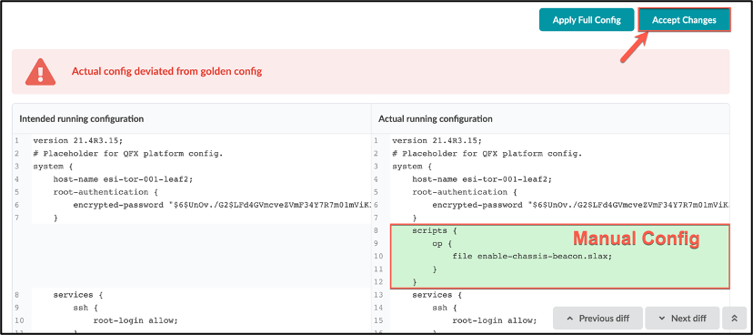

# Config Rendering in Juniper Apstra

**Adam Jarvis - 11/07/2023**

A description of the different configurations that can be rendered based on the state of the devices in Apstra.

*This article is derived from original work created by Josh Saul.*

## Introduction

Apstra creates configurations for devices that are under its control. This document follows the typical lifecycle of a network device within an Apstra-managed topology.

## Pre-Agent Install

### Factory Default Config

The Factory Default config is what is on the device when it boots for the first time after being removed from the original shipping container (before being connected to the network).  This config has all the default settings from the vendor for the installed OS version.

### User Required Config

Operators need to configure devices before they are available for configuration by Apstra.  This can be accomplished with the following methods:

- ZTP automated boot script
- Manual configuration via console port

Either method can be used, but an IP address must be added to the Ethernet management port  before the Apstra agent can be installed.  Admins typically set the following options before proceeding:

- Management IP Address
- Management Default Gateway
- Change default username/password (optional)
- Add trusted keys to the device for remote access (optional)
- Add trusted IPs or subnets for remote access (optional)
- Disable services according to security requirements (optional)

After this is completed, the admin initiates the Apstra Device Agent installation via the Apstra Server or the previous ZTP boot script.

## Post-Agent Install

### Pristine Config

Once the Apstra Device Agent is installed, the configuration is recorded as "Pristine" on the Apstra Server.  The device immediately enters the quarantined state.  No changes are made to the device while it is in this state.

If the enable_push_quarantine_config is enabled in the aos.conf file, the following changes are made to devices:

- All fabric ports are shutdown when a device is onboarded.

The Pristine configuration is not validated; it is accepted by Apstra without inspection.  Validation is implicit for this configuration because we assume the pristine configuration is correct and import it from the device.  Errors in the Pristine configuration can have a very bad effect on the device lifecycle.

Items that are usually set in the pristine configuration include:

- Banner
- Tacacs AAA settings
- TCAM settings
- Logging settings
- Other configurations to enable third-party monitoring

The Pristine configuration is also used for all Full configuration pushes from Apstra.

Before the Apstra AOS 4.2 release, adding a new configuration item to the Pristine config, after a device is in operation (Day2 operations) required the device to be removed from the Apstra System and re-imported. In the AOS 4.2 and subsequent releases, changes to the pristine configuration can be done while a switch is in the blueprint.

### Discovery-1

The administrator selects the device and Acknowledges (ACKs) it in the Apstra UI.  This causes Apstra to install a basic configuration (Discovery-1) on the device, which enables LLDP for neighbor discovery. However, all interfaces are placed into L3 routed mode, so there will be no impact on the rest of the network. This is a Full Config push to the device from Apstra, not an incremental configuration.

## Device Added to Blueprint

### Discovery-2

After the administrator adds the device to the blueprint and commits the change, Apstra begins validating LLDP status against the intended cabling to ensure the neighbors are correctly connected.  This is also known as the "ready" device mode.

This is the final deployed state config for a deployed device in a running blueprint.

| Discovery-1 config | Discovery-2 config | Service config |
|---|---|---|
| **Device state**: Ready to be put in service  **When is it pushed?** - Device connected to Apstra - Ready for service - Not allocated to blueprint  **What is in Discovery-1 config?** - All ports up in routed mode at default speeds - No BGP configuration - LLDP enabled  **Goal**: Enable auto-discovery without affecting switching | **Device state**: Allocated to blueprint but not deployed  **When is it pushed?** - Device connected to Apstra - Ready for service - Allocated to blueprint - Deploy mode = "ready"  **What is in Discovery-2 config?** - All ports up in routed mode with blueprint-defined speed/breakout - Interface descriptions - Hostname - No BGP configuration  **Goal**: Enable cabling validation before service deployment | **Device state**: Allocated to blueprint  **When is it pushed?** - Device connected to Apstra - Ready for service - Allocated to blueprint - Deploy mode = "deploy"  **What is in Service config?** - All ports up in routed mode with blueprint-defined speed/breakout - Hostname - BGP configuration  **Goal**: Put device into service |

### Golden Config

When the config has been modified by Apstra (config changes have been validated by Apstra and accepted for a device) the running config is stored as the Golden config.

The Rendered config is the generated configuration from the staged blueprint.  Note that the Rendered config is not the same thing as the Golden config because it may be different after the configuration push.

Golden config is the configuration on the device after the last successful config application. Also, under special cases, the user can modify a configuration directly on the device and ask Apstra to absorb this deviation as Golden.    This is not recommended for any part of the device that Apstra directly modifies. We suggest using Configlets to manage these customizations. It's important to note, that accepting config changes is not persistent. In the event a full config push is performed, these changes are lost.

The Golden configuration is the basis for Apstra to ensure that the device is in an acceptable state.  This is enforced via a monitor that runs once every 60 seconds on the device.

## Summary

Config rendering is the fundamental Day-2 function of Juniper Apstra automation. Using built-in reference designs and validators, Apstra ensures that the configurations across your fabric are consistent and correct.

## Useful links

- The Apstra User Guide provides more information of config rendering:
[https://www.juniper.net/documentation/us/en/software/apstra4.1/apstra-user-guide/topics/topic-map/device-config-lifecycle.html](https://www.juniper.net/documentation/us/en/software/apstra4.1/apstra-user-guide/topics/topic-map/device-config-lifecycle.html)

## Glossary

- AAA: Authentication, Authorization, and Accounting
- Configlet: A portion of a device configuration that is not automatically controlled by Apstra, but can be configured and deployed within Apstra
- LLDP: Link Layer Discovery Protocol
- TCAM: Tertiary Content-Addressable Memory
- ZTP: Zero-Touch Provisioning

## Acknowledgments

This article is derived from original work created by Josh Saul
