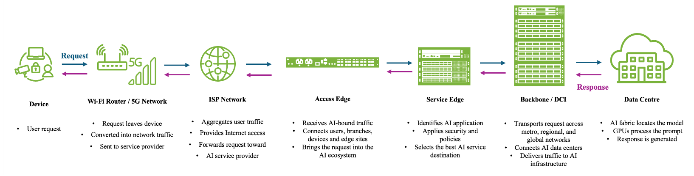
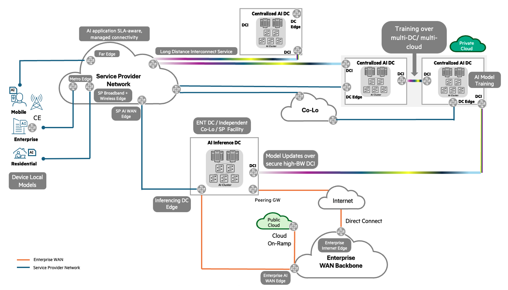

# Connecting AI: The Network Behind Every Inference

**Cherishma Potluri - 07/17/2026**

## Introduction

When people think about Artificial Intelligence (AI), they usually think about models, GPUs, and applications. They picture chatbots answering questions, copilots generating content, recommendation engines personalizing experiences, or image generators creating artwork.

**What often goes unnoticed is the network...**

Every AI interaction begins and ends with a network transaction. Before a model can generate an answer, a request must travel through access networks, service provider infrastructure, transport networks, data centers, storage systems, and compute platforms. Once the response is generated, it must make the journey back to the user.

As AI adoption accelerates, networking is evolving from a supporting function into a strategic component of AI infrastructure. AI experiences are no longer defined solely by the intelligence of the model, but also by the network's ability to connect users, data, and compute efficiently.

This shift is creating new demands across the entire infrastructure stack. Users expect AI responses in seconds. Enterprises want AI integrated into existing applications and workflows. Service providers are preparing for increased traffic generated by AI-enabled applications and devices. At the same time, AI clusters require unprecedented levels of connectivity between storage, compute, and distributed data centers.

The result is a simple but important realization: The value of AI depends significantly on how effectively the network delivers that intelligence.

This blog follows the journey of an AI request from the moment a user submits a prompt to the moment a response is returned. Along the way, we'll explore how networking enables AI services and why inference is increasingly moving closer to users and devices.

## Understanding Training and Inference

Before following the journey of an AI request, it helps to understand the two primary phases of AI operations: training and inference.

## Training: Teaching the Model

Training is the process of building an AI model. Large volumes of data are moved from storage to GPU clusters, where the model learns patterns, relationships, and behaviors. During training, thousands of GPUs may continuously exchange information while processing massive datasets. The objective of training is straightforward: **Teach the model**. Training typically occurs in large AI data centers where high-performance networking is required to connect GPUs and storage resources efficiently.

## Inference: Delivering the Experience

Inference begins after training is complete. Whenever a user asks a question, uploads an image, submits a document, or interacts with an AI application, the trained model generates an answer or makes a decision. The objective of inference is equally straightforward: Deliver the experience.

Unlike training, which primarily focuses on maximizing infrastructure efficiency, inference focuses on minimizing response time and delivering a consistent user experience. **For most users, AI is inference**.

## The AI Inference Journey

Let's follow a simple request: ***"How's the weather this weekend, and should I plan an outdoor hike?"***

The interaction appears simple. A user asks a question and receives an answer. Behind the scenes, however, the request travels through multiple networking domains before it ever reaches an AI model.

The journey begins when a request is generated from a mobile device, enterprise endpoint, residential broadband connection, or another connected device. At this point, the request is simply data entering the network. No AI processing has occurred yet.
The first responsibility of the network is to move that request from the user to available compute resources. Historically, this was relatively straightforward because applications typically resided in a specific data center or cloud region. AI changes this model.

Unlike traditional applications, an AI request may have multiple potential destinations. The request might be processed by a centralized AI cluster, a regional inference data center, a cloud-based AI service, or an edge AI platform located closer to the user.

This introduces a new question that the network must answer before inference even begins: ***Where should this AI request be processed?***

The answer depends on several factors, including latency requirements, available compute resources, network conditions, cost, resiliency requirements, and the nature of the application itself.

## Centralized AI Inference

Many AI workloads are well-suited for centralized inference. Consider our weather question. The user expects a response quickly, but the application is not making a mission-critical decision in real time. Whether the answer arrives in half a second or one second generally makes little difference to the user experience. In this scenario, forwarding the request to a centralized AI inference data center makes sense.

As illustrated in Figure 1, the request enters the network, traverses the service provider infrastructure, and is directed to an AI inference facility that hosts large-scale compute resources. These facilities provide significant advantages. They can host larger models, provide greater GPU density, simplify model management, and enable organizations to consolidate AI infrastructure into fewer locations. Many of today's generative AI platforms, copilots, virtual assistants, and enterprise AI services rely heavily on centralized inference architectures.

## What Happens Inside the AI Data Center?

Reaching the data center does not immediately mean reaching the model. Modern AI applications are significantly more complex than simply forwarding a prompt to a GPU.

Before inference occurs, the AI platform may retrieve additional context, access enterprise knowledge bases, search vector databases, validate permissions, retrieve previous conversation history, or connect with other application services. Only then does the prompt reach the AI model. The model processes the request, generates a response, and returns it over the network to the user.

From the user's perspective, the entire interaction may feel instantaneous. In reality, the response depends on multiple infrastructure layers working together. This is why networking remains such a critical part of AI architectures. Even the most advanced model cannot deliver an answer if the data cannot efficiently reach the computing resources required to process it.

## When Centralized AI Isn't Enough?

The flow shown in Figure 1 extends beyond centralized AI clusters in data centers. This is also the perfect juncture to highlight a growing trend: inference is increasingly moving closer to where data is created. This shift is being driven by physics, not just technology. Some AI workloads simply cannot tolerate the delay associated with transporting data across long distances to a centralized facility.

Consider an autonomous vehicle approaching a pedestrian crossing. The vehicle continuously processes camera feeds, sensor data, and environmental information. If a pedestrian unexpectedly enters the roadway, the vehicle must determine almost immediately whether to brake. Even though a centralized AI platform may have sufficient compute power to make the decision, the time required to transport data to a distant location and receive a response may be unacceptable.

In this situation, the challenge is not model accuracy. The challenge is time. The solution is to move inference closer to where data is generated. This concept is commonly referred to as Edge AI.

## The Rise of Edge AI

Rather than sending all data to a centralized AI platform, organizations deploy AI capabilities near users, devices, machines, and sensors. The result is a much shorter path between data creation and decision-making. A manufacturing facility can identify defects locally without sending video streams across a WAN. A transportation network can make traffic management decisions in real time. A healthcare system can process patient telemetry close to the source. A retail environment can analyze customer activity within the store rather than transmit large amounts of video to a remote data center.

In each case, the principle remains the same: Move the intelligence closer to the data. This approach reduces latency, lowers transport costs, minimizes bandwidth consumption, and improves resiliency when connectivity to centralized infrastructure is disrupted.

## Centralized AI and Edge AI Are Complementary

Edge AI does not replace centralized AI. In most cases, organizations require both.
Large foundation models may still live in centralized AI data centers, while specialized inference functions are deployed closer to users and devices.

A centralized environment might train and update a model. Those updates can then be distributed securely to regional inference locations where decisions need to be made rapidly. The architecture illustrated in Figure 2 reflects this emerging reality. Intelligence is no longer confined to a single massive data center. It is increasingly distributed across clouds, regional AI facilities, enterprise locations, and the network edge.

## Choosing the Right Network Architecture for AI

As AI deployments scale, networking becomes the mechanism that connects users, applications, inference platforms, training environments, and cloud services into a single ecosystem. At a high level, AI architectures can be viewed as five interconnected layers:

- Edge
- Service Edge
- Transport and Data Center Interconnect
- AI Data Center Fabric
- GPU Infrastructure

Each layer serves a different purpose, yet all of them contribute to the final user experience. A user's perception of AI quality is ultimately determined by how efficiently these layers work together. Networking requirements vary widely depending on where inference occurs, where data is generated, how applications are consumed, and how AI infrastructure is distributed.

Before selecting infrastructure, organizations must first determine where intelligence should reside and how data will move between users, applications, storage platforms, inference clusters, and training environments.

## Access and Aggregation

As AI expands beyond centralized data centers, the network edge is becoming an increasingly important part of the AI stack. Many AI workloads originate from users, sensors, cameras, industrial systems, IoT devices, mobile endpoints, and branch locations. These environments require a network capable of aggregating large numbers of distributed endpoints while providing reliable connectivity to nearby inference resources or centralized AI platforms.

From a networking perspective, this layer is typically responsible for:

- High-scale endpoint aggregation
- IP/MPLS and segment-routing services
- Mobile, broadband, and enterprise access
- Traffic prioritization and QoS.
- Local breakout and edge connectivity
- Edge AI and edge compute integration

Common deployment scenarios include transportation systems, manufacturing environments, smart cities, utility networks, campus environments, and AI-enabled branch locations. What makes this layer increasingly important is the growth of edge inference. As AI moves closer to where data is generated, access infrastructure evolves from simply connecting endpoints to becoming a key part of the inference pipeline itself.

## Service Edge

Once traffic enters the network, it must be associated with the correct application, service, or AI environment. The service edge acts as the convergence point between users, applications, cloud services, and AI infrastructure. It provides the intelligence required to steer traffic toward the appropriate destination while maintaining scale, security, and operational simplicity.

This layer commonly delivers:

- Subscriber and service termination
- Application-aware traffic steering
- Service chaining
- Network segmentation
- Policy enforcement
- Multi-tenant service delivery
- AI service onboarding and access control

As organizations deploy multiple AI assistants, enterprise copilots, inference clusters, and cloud-based AI services, the service edge becomes increasingly important in determining how users reach AI resources. In many environments, the service edge becomes the operational control point for AI consumption.

## Transport and Data Center Interconnect

AI is fundamentally a distributed workload. Training data may reside in one location, inference clusters in another, public cloud services in a third, and users somewhere else entirely. As a result, connecting AI environments often becomes as important as connecting users. The transport layer provides the high-capacity foundation that moves data, models, and inference traffic between locations. Core responsibilities include:

- Metro and long-haul transport
- Data center interconnect (DCI)
- Cloud connectivity
- Multi-region AI networking
- Model synchronization
- Storage replication
- Optical transport integration
- Large-scale IP backbone services

Unlike traditional application environments, AI deployments frequently generate significant east-west traffic between sites. Model checkpoints, training datasets, inference state information, and retrieval data may all traverse backbone networks. As AI scales, the transport network increasingly becomes a critical determinant of overall system performance.

## AI Fabric and GPU Connectivity

Inside the AI data center, networking takes on a different role. Rather than connecting users to applications, the network connects storage systems, AI servers, accelerators, and GPU clusters with extremely high bandwidth and low latency. Modern AI fabrics are optimized for:

- GPU-to-GPU communication
- Storage-to-GPU communication
- RDMA-based transport
- Congestion management
- Load balancing
- High-radix spine-leaf architectures
- Scale-out AI clusters

As models continue to increase in size, the data center fabric becomes a direct contributor to AI efficiency. Poor network performance can leave accelerators waiting for data, reducing utilization and increasing job completion times. In many large-scale AI environments, the fabric is just as important as the compute infrastructure it serves.

## Conclusion

In summary, the key takeaway is that AI networking is not a single architecture or deployment model. It spans edge locations, service delivery layers, transport networks, inter-data-center infrastructure, and AI fabrics. The most successful architectures are those that align networking capabilities with where data is created, where AI is consumed, and where intelligence ultimately needs to exist.

## References

- [The great infrastructure bottlenec](https://raphaelledornano.medium.com/the-great-infrastructure-bottleneck-why-genais-next-phase-is-about-atoms-not-bits-00fe59ab08c2)k
- [AI accelerator revenues soar 130 percent](http://www.delloro.com/news/ai-accelerator-revenues-soar-130-percent-in-3q-2024)
- [Access and Aggregation Series of Routers](https://www.juniper.net/us/en/products/routers/acx-series.html)
- [Multi-Service Edge Routers](https://www.juniper.net/us/en/products/routers/mx-series.html)
- [Packet Transport Routers](https://www.hpe.com/us/en/juniper-ptx-routers.html)

## Glossary

- AI Inference: The process of using a trained AI model to generate predictions, responses, or decisions.
- AI Training: The process of teaching an AI model using large datasets.
- Edge AI: AI inference performed close to where data is generated.
- Data Center Interconnect (DCI): Networking infrastructure that connects multiple data centers.
- Service Edge: The network layer where applications, users, and services converge.
- Inference Data Center: A facility hosting AI infrastructure used to serve real-time requests.
- East-west traffic: Data exchanged between systems within an infrastructure, such as between GPUs, servers, storage, or data centers.
- North-south traffic: Data exchanged between users and applications, such as a user sending a request to an AI service and receiving a response.
- SLA: Service level agreements
- SP: Service Provider
- Peering Gateway: A network interconnection points that exchanges traffic between different networks, cloud providers, or service providers.
- AI Cluster: A group of interconnected GPUs and servers that work together to train AI models or run AI inference workloads.
- High-Bandwidth DCI (Data Center Interconnect): High-capacity connectivity used to transport data, models, and applications between data centers.