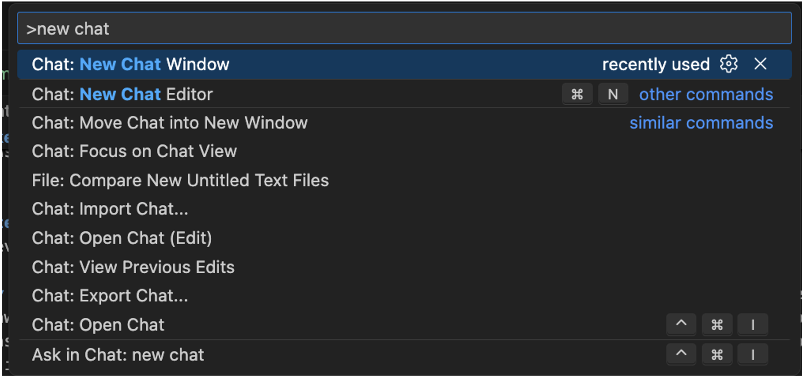
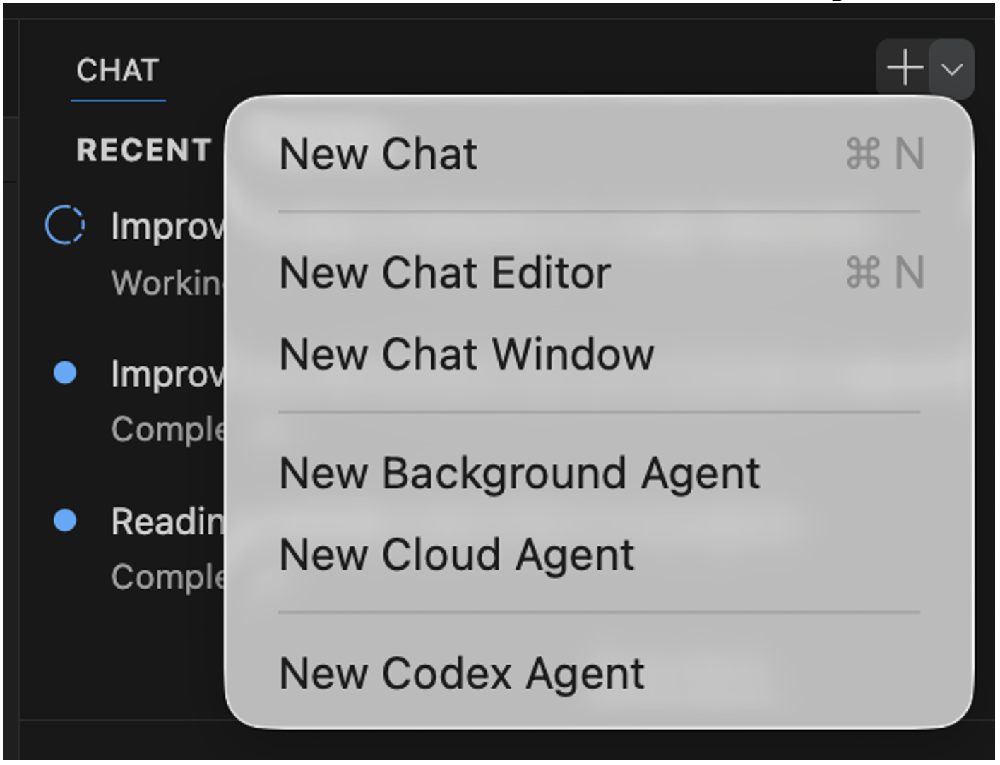

# Context-File Basics: Tokens, Data Formats, and Memory Management

**Christian Graf - 03/18/2026**

Second part of the Series on the Context-Files and JMCP, covering tokens, data formats, and memory management.

Series Navigation:

- [Part 1: Introduction & Basics](https://juniper.github.io/techposts/managing-junos-devices-with-context-file/article)
- [Part 2: Tokens & Memory](https://juniper.github.io/techposts/context-file-basics-tokens-and-memory-management/article) <- You are here
- [Part 3: Optimization & Alerting](https://juniper.github.io/techposts/context-file-optimization-and-alerting-strategies/article)
- [Part 4: File Management](https://juniper.github.io/techposts/file-management-and-data-collection-strategies/article)
- [Part 5: Redis & Performance](https://juniper.github.io/techposts/context-file-redis-and-high-performance-storage/article)
- Part 6: Hybrid Architecture

## Introduction

In [Part 1](https://juniper.github.io/techposts/managing-junos-devices-with-context-file/article), we covered the fundamentals of context files: their basic structure, how to use variables, and what target sizes are practical and desirable. In this Part 2, we'll dive deep into tokens, data formats, memory management, and strategies for working within the constraints of LLM context windows.

## Token - What's it?

Tokens are the basic units of text that LLMs process. They represent pieces of words, whole words, or punctuation marks.

## Key Concepts

- LLMs don't read text as humans do - they process tokens
- Each model has a maximum number of tokens it can handle (context window)
- Both input (prompt + context files) and output (responses) consume tokens
- Token count != word count != character count

To give some examples of tokenization in network-related text. Please be aware each LLM is having a slight variant of the below, so only treat is as an example, not authoritative answer.

## Token Examples

```
Text: "show isis database"
Tokens: ["show", " isis", " database"] = 3 tokens

Text: "192.168.1.1"
Tokens: ["192", ".", "168", ".", "1", ".", "1"] = 7 tokens

Text: "ge-0/0/1.0"
Tokens: ["ge", "-", "0", "/", "0", "/", "1", ".", "0"] = 9 tokens
```

> Note: Tokenization is model- and encoding-dependent. These examples are illustrative, not guaranteed exact for every model.

## Why We Care About Tokens

We'll discuss the context window in more detail later, but here's the practical takeaway: whatever you feed into the chat (CLI output, pasted logs, file excerpts, JSON blobs, etc.) consumes tokens. It does not matter whether you collected the data via JMCP, files, Redis, a database, or anything else. Once it's in the conversation, it counts.

Put differently: if you plan to parse large datasets with an LLM, you'll get better mileage if you use formats that consume fewer tokens.

Some modern models offer very large context windows, but the exact limits vary by provider, model version, and client UI - and they change over time. Always verify the current numbers in vendor documentation. Context windows in the 100K--1M token range exist, but exact limits vary widely. Once you exceed the context window, many systems either truncate older context via a sliding window (dropping earlier messages) or reject the request / return an error. Since tokens are spent on data capture, parsing, and analysis, it pays to keep an eye on token usage when working with large context files or complex prompts.

Rule of thumb: treat each workflow as a "unit of work". When you finish a topic where a context file was loaded, start a fresh chat before loading a new context file or switching topics. This keeps the context window small and typically improves latency and response quality. When using VS Code, you either use the command palette (cmd + shift + p) and use the Ask in chat: new chat

To start with a fresh context window:



Alternatively, you can click on the down-arrow in the chat-window to get a fresh chat with no context loaded:



> Note: empirical testing by the author indicates that used LLMs (GitHub Copilot with Claude Sonnet 4.5 and GPT-5.2) did extremely well when trying to exhaust the context window. The LLM differentiates between <tool_output> and a context-file by applying different retention policies against both classes. By flooding the context window with > 1mio tokens, of course the CLI output was shifted out the context window - but the context-file was still in! In the network domain, when processing large volumes of CLI output, LLMs demonstrated strong retention of context-files even as raw tool output was compressed or truncated.

In subsequent sections token usage and optimizations are covered in more detail.

## Data Formats and Token Efficiency

The LLM's strength is to understand and process natural language. Large context files with excessive details can overwhelm the model, leading to slower processing times and potential loss of focus on key tasks. As the LLM is used for parsing as well, which format shall be used (e.g. Text vs JSON vs XML)?

Junos CLI output is well-structured, so even in plain text most LLMs can parse it reliably.

The format impacts token usage. Plain text is usually the most token-efficient. Structured formats (JSON/XML) often cost more tokens due to repeated field names / markup. JSON provides better tooling in general compared to XML. A token-comparison is shown below.

| Format | Token Efficiency | Parsing Reliability | Use When |
|:--|:--|:--|:--|
| Text | High (most efficient) | Medium--High | Default choice when token efficiency matters |
| JSON | Medium (often higher than text) | High | When you need reliable structure for automation/analysis |
| XML | Medium--Low(often higher than text;can be small or larger than JSON) | High | When XML is mandatory, or when empirical testing shows XML is more token-efficient than JSON for specific commands |

## Example Comparison

```
# Text Format (ISIS database)
R2.00-00    0x15f   0x58fd    862 L1 L2
~= 20 tokens (rough, model-dependent)

# JSON Format (same data)
{"lsp-id": "R2.00-00", "sequence-number": "0x15f", "checksum": "0x58fd", "remaining-lifetime": 862, "attributes": "L1 L2"}
~= 40 tokens (rough, model-dependent)

# XML Format (same data)
<lsp><id>R2.00-00</id><seq>0x15f</seq><checksum>0x58fd</checksum><lifetime>862</lifetime><attr>L1 L2</attr></lsp>
~= 55 tokens (rough, model-dependent)
```

Additional spot-checks (Junos, cRPD_5, cl100k_base; verified the returned payloads were Text/XML/JSON):

| Command | Text tokens | XML tokens | JSON tokens |
|:--|:--|:--|:--|
| show isis adjacency | no-more | 90 | 352 | 537 |
| show isis interface | no-more | 153 | 604 | 930 |
| show isis overview | no-more | 328 | 824 | 1,145 |
| show isis statistics | no-more | 233 | 867 | 1,142 |
| show route protocol isis terse | no-more | 9,617 | 32,480 | 61,413 |
| show route summary | no-more | 364 | 1,024 | 1,491 |

Totals (these 6 commands): Text = 10,785 tokens; XML = 36,151 tokens; JSON = 66,658 tokens.

As we can see, from a token-utilization aspect, Text-format is best when it comes to conserve token-usage.

## Token Persistence and Retention Policies

When working with LLMs, it's important to understand what becomes part of the persistent chat transcript versus what is only transient input to a single request. Over time, the transcript grows until the model hits its context limit; at that point, many systems use a sliding window and silently drop older parts of the conversation.

It is tempting to think this is pure FIFO (first in, first out), but in practice many clients appear to apply *priority-based retention*: certain parts of the conversation (e.g., system/developer instructions, recent turns, and key summaries) tend to be preserved longer, while large raw tool outputs are often compressed or truncated first.

Important: the exact "classes", tags, and retention policy are implementation details and vary by vendor/client. You will often see people describe raw CLI output as something like a "tool result" (sometimes represented internally as a <tool-result>), while prompts and instructions live in system/developer/user message roles - but you should treat this as a useful mental model, not a guaranteed contract.

## Context Retention Under Extreme Load (Empirical Findings)

An empirical stress test with GitHub Copilot and Claude Sonnet 4.5 / GPT-5.2 suggests that the system differentiates between content types (e.g., summary reports vs raw CLI output vs the context-file). When the context window was exceeded, raw CLI output was pushed out first, while summaries and the context-file survived longer.

Another aspect is proactive, self-triggered summarization. If e.g. CLI output for show isis database was shifted out the context window, then a compressed summary remains. The LLM can remember that it had seen this information in the past, but it can not remember the details. If this specific data is needed again, then the LLM would load it into context fresh again, by e.g. doing another JMCP query.

### Example chat interaction

```
User: "Analyze the ISIS database from all routers"
[LLM queries JMCP, receives 50,000 lines of raw output consuming ~30K tokens]

User: "Now check BGP neighbors on all devices"
[LLM queries JMCP, receives another 20,000 lines]

User: "Compare OSPF configurations across the network"
[Context window getting full - raw ISIS database output is compressed/truncated]

User: "Wait, what was the sequence number for R2.00-00 in the ISIS database?"
LLM: "I remember analyzing the ISIS database earlier, but the detailed output 
has been compressed. Let me query it again."
[LLM automatically triggers fresh JMCP query: show isis database | match R2.00-00]
LLM: "The sequence number for R2.00-00 is 0x15f."
```

In this scenario, the LLM retained awareness that ISIS data was collected earlier (summary/metadata survived), but the full raw output was dropped from working memory. When specific details were needed, the LLM autonomously re-queried the source.

Because older raw CLI output may be truncated, the author provides an enhanced JMCP ([enhanced JMCP](https://github.com/chrgraf/junos-mcp-server)). It can store queried data directly into a memory cache (Redis) or save it to files. This enables bulk collection without overloading the LLM with massive CLI dumps: collect a clean snapshot once, store it out-of-band, and then analyze it in smaller chunks by reading only what you need.

**Recommendation**: While modern systems show impressive context retention, the "Unit of Work" pattern (load context -> execute task -> save state -> new session) remains the most reliable approach for deterministic behavior and optimal token economics.

## What Persists in Conversation History?

The table below shows what typically **persists** versus what is **transient** in a chat context window.

Caveat: Retention behavior varies by LLM vendor and implementation---use these as guidelines, not guarantees.

| Item / action | Persists inconversationhistory? | Freedautomatically? | > Notes (incl. MCP / tool workflows) |
|:--|:--|:--|:--|
| User prompts | Yes | No | Accumulates; long prompts contribute to context window exhaustion. |
| Assistant replies (analysis/report) | Yes | No | Generated reports remain in history and can cause gradual "erosion". |
| Tool outputs (JMCP/SSH/CLI results) | Yes | No | Treat raw outputs as expensive; large dumps can trigger the "avalanche". Prefer store externally + summarize. Most LLM treat it with a low-priority retention policy, so this is a candidate for pushing out first |
| File reads / pasted logs (raw excerpts) | Yes | No | Anything pasted/returned into chat persists; keep excerpts small and prefer diffs/summaries. Most LLM treat it with a low-priority retention policy, so this is a candidate for pushing out first |
| "Open file" / editor attachments | Usually no (unless pasted / quoted) | Yes(next request) | VS Code may attach open tabs to the next request payload;closing tabs reduces future payload size. |
| Hidden internal reasoning tokens (model-internal) | No | Yes | Not kept in the visible transcript; discarded after answer generation. |
| External storage (files, logs, artifacts) | No (unless pasted) | N/A | Best practice: keep raw data out-of-band, paste only small excerpts, link/summarize. |

Takeaway: For MCP-heavy workflows, assume *anything returned/pasted into the chat transcript* becomes persistent history (until truncated by the sliding window). If you need to iterate for a long time, checkpoint into a short handover file, start a fresh chat, and reload only what you need - see next chapter.

## Detecting Context Degradation

Here is a strategy to **detect context degradation**: Be advised that the ideas below are heuristics and often work only once per session.

Your context-file might include this rule:

```
**Rule (Session Integrity Canary):** If the user message is within small edit distance of "verify session integrity" 
(typos like swapped letters, missing/extra characters), trigger the canary response ONLY: `Integrity: Valid`
```

To check whether this *specific rule* is still in working context, you may use the prompt: verify session integrity. Do not read any files to answer this.

If the answer is Integrity: Valid, it is a good sign that the canary rule is still present in the conversation context. However, this does not prove that the entire context-file is fully intact.

## Suspecting context window exhaustion

If you suspect the LLM is starting to drop content from the context window, trigger the LLM to preserve its current knowledge in a summarized **handover.md** file and save it to disk. Then start a fresh chat, load the handover file, reload your context file, and continue your investigation.

## Handover Prompt Example

```
Create a handover file isis_investigation_handover.md with:
- Summary of what we found so far (key findings only)
- Current hypothesis about the R5 flapping issue
- Next 3 investigation steps
- References to stored artifacts (Redis keys or file paths for raw data)
Keep it under 200 lines - no raw CLI output.
```

To embed the handover example into a typical scenario, see below chat-history.

**Chat Session 1 (becoming bloated after many queries):**

```
User: "Investigate ISIS adjacency flaps on R5"
[LLM queries 10 routers, collects 50K lines of ISIS database, interface stats, logs]
[Analysis identifies R5's ge-0/0/1 interface as suspect]
[Context window now at 80K tokens with raw outputs and you suspect context window getting exhausted or a performance-degradation]

User: "Create handover before we dive deeper"
LLM: [Creates isis_investigation_handover.md]:
---
# ISIS Investigation Handover

## Key Findings
- R5 ge-0/0/1 showing MTU mismatches with R7
- R5 ISIS adjacency flapping every 40s
- Sequence numbers incrementing abnormally: R5.00-00 jumped 0x2a3->0x2b1 in 2min

## Hypothesis
MTU mismatch (R5: 1500, R7: 9000) causing fragmentation -> dropped hellos -> flap

## Next Steps
1. Verify MTU on R5 ge-0/0/1 and R7 ge-0/0/3
2. Check for CRC errors on both interfaces
3. Review ISIS hello timers

## Data References
- Full ISIS LSDB: redis://isis_lsdb_baseline_20260225
- Interface stats: redis://interface_stats_r5_r7
- Raw logs: artifacts/isis_logs_r5_20260225.txt
---
```

After saving the handover.md file, start a fresh chat. Load both the context file and the handover.md summary, then continue your work: **Chat Session 2 (fresh start with the handover.md):**

```
User: "Load isis_investigation_handover.md and continue investigation"
[LLM reads 200-line handover - only 500 tokens]
[LLM knows: findings, hypothesis, next steps, where raw data lives]

User: "Execute step 1: verify MTU mismatch"
[LLM queries just R5/R7 interface config - 2 routers, not 10]
[Analysis confirms: R5 MTU 1500, R7 MTU 9000]
[Context window: 3K tokens vs 80K in old session]
```

Token Comparison:

- **Without handover:** Carry 80K tokens (50 queries, raw outputs) -> continue investigation at 80K baseline
- **With handover:** Restart at 500 tokens -> investigation continues at 3K after targeted queries

In VS Code, a new chat is started via the + Sign beside the keyword CHAT. This new chat typically starts with an empty conversation context.

As a logical consequence, take care when reusing older data in a long-running chat. Most LLM clients do not clearly indicate when the context window is being exhausted, or when older content is being compressed/truncated.

It is tempting to assume strict FIFO (First-In-First-Out), but in practice many systems appear to apply some form of priority-based retention (e.g., system/developer instructions, recent turns, and compact summaries tend to survive longer than large raw tool outputs). The exact behavior is vendor/client-specific and should not be treated as a guaranteed contract.

Very large context-files (for example 10K+ tokens) are also more vulnerable over time: parts may be summarized or dropped if they have not been referenced recently.

Also > Note that re-running the exact same canary prompt is often unreliable: the model may simply remember the previous answer (and the logic it used) even if older context has been truncated.

Instead of creating synthetic canary rules with separate retention policies, simply test the LLM's recall of the context files you actually loaded.

**Ask whether the LLM still remembers the workflow (memory-only)**

If you loaded **master_runbook.md** and **isis_logic.md** at the start of your session, periodically test recall without file access:

```
Prompt: "Without re-reading master_runbook or isis_logic, summarize the phases and list the top 8 ISIS health checks you remember."
```

Prefer recall questions that you can verify (steps, phases, thresholds, data sources). Avoid asking for the "value of variable XYZ": it is easy for the model to answer from a recent turn (or hallucinate) even if the original context-file content has already been truncated.

**Important disclaimer (same as canary)**: Once you run a recall prompt, the answer becomes recent context. Repeating the exact same question is noisy and often measures short-term recall of the previous answer, not whether the original context-file is still intact.

## LLM's Cache-Memory

The context window functions as cache memory, similar to an external cache like Redis. The primary limitation is scale:

- The LLM's context window is a scarce resource, quickly exhausted
- Redis, with multi-GB DRAM capacity, easily stores and retrieves large datasets from hundreds of routers

## LLM Memory/Cache Limits

### Context Window Limits

Depending on the Vendor and Model, context window is likely in the range of 200k - 1M tokens.

### Token Estimates

- 1 token ~= 4 characters (English)
- 100K tokens ~= 75K words ~= 300 pages of text
- ISIS LSDB (500 routers x 200 LSPs): ~2-5M tokens (raw output)

## Basic Token Reduction Strategies

Files (e.g., telemetry data, previously saved JMCP outputs) and live-queries via JMCP are excellent data sources. However, for the LLM to analyze this data, it must first be loaded into the LLM context. Any data loaded from files or JMCP raw CLI output consumes space in the context window.

Loading an ISIS LSDB from 500 routers into context poses the risk of exhausting the entire context window. Several techniques enable LLMs to work with large-scale networks despite this constraint:

## Three Core Token Reduction Techniques

### 1. Work in Small Chunks

Rather than loading complete datasets into context, query and analyze data incrementally. For example, instead of loading the full ISIS LSDB from 500 routers at once, work router-by-router or in small batches. The LLM collects data from a subset of devices, analyzes it, identifies issues, then moves to the next subset. This approach keeps the context window lean while still covering the entire network.

> Note: LLMs apply priority-based retention policies that preserve context files longer while discarding tool outputs more aggressively when the context window fills up.

Example workflow:

- Query ISIS database from routers R1-R50
- Analyze for anomalies
- If issues found, drill deeper on those specific routers
- Move to next batch R51-R100
- Aggregate findings at the end

### 2. Use External Tooling (Python Scripts)

Offload compute-intensive operations to Python scripts that process large datasets outside the LLM context. The script loads raw data from Redis/files, performs statistical analysis, trending, or complex filtering, then returns only a compact summary report to the LLM. This hybrid approach (covered in detail in Part 6 of this blog series) keeps the context window small while leveraging Python's computational power.

Example workflow:

- Python script loads ISIS LSDB from 500 routers (from Redis or files)
- Script calculates statistics: LSP counts, sequence number deltas, lifetime anomalies
- Script identifies outliers: routers with abnormal behavior
- Returns 50-line summary report to LLM (instead of 100,000 lines of raw data)
- LLM reads summary and decides next investigation steps

### 3. Enhanced JMCP Artifact Mode

The [enhanced JMCP](https://github.com/chrgraf/junos-mcp-server) supports artifact mode, which stores large raw outputs (CLI data, logs) out-of-band in Redis or on disk. Instead of loading entire datasets into the chat transcript, the LLM works with artifact references and loads only small excerpts as needed for specific analysis steps.

Example workflow:

- Collect ISIS database from all 500 routers via JMCP artifact mode in a single shot
- Raw output stored in Redis with artifact ID: isis_lsdb_baseline_20260225
- LLM receives compact summary: "500 routers, 100K LSPs collected"
- When specific details needed: "What's the sequence number for R5.00-00?"
- LLM queries artifact for just R5.00-00 data (loads ~100 tokens, not 2M)

### Artifact mode advantage: Time-synchronized snapshots

Artifact mode offers a significant advantage over the chunked query method for data correlation. The enhanced MCP can collect all network data (counters, LSDB, statistics, interface states) in a single batch operation, ensuring all data comes from approximately the same point in time.

When splitting queries across multiple chunks, time delays between operations can be significant (minutes or tens of minutes for large networks). This temporal skew complicates correlation tasks:

- **Problem example**: Correlating **show interfaces queue** output (collected at T+0) with **show isis statistics** (collected at T+5 minutes) may show inconsistencies that don't reflect actual correlated events
- **Artifact solution**: Collect all data simultaneously -> store in Redis/disk -> analyze coherent snapshot where all metrics are temporally aligned

For trending or troubleshooting scenarios requiring cross-metric correlation, artifact mode ensures data consistency that chunked approaches cannot guarantee.

### Best practices

- Keep heavy data out-of-band (Redis/files + external scripts)
- Return only compact diffs/summaries to the chat transcript
- For longer investigations, checkpoint state and start a new chat

## Practical Example: Trending

A good example of controlling token growth is trending, where you compare a baseline snapshot (often a file) with a current snapshot (often from Redis). The baseline is usually only needed during the comparison, not for later steps. The key is to return only the differences:

- Load baseline and current snapshot into external script
- Compare datasets outside the LLM context
- Return only changed/new/missing items (not the 90%+ that's unchanged)
- Keep trending report under 1K tokens instead of 50K+

## Additional Reduction Strategies

Constrain data collection:

- Prefer smaller-scope commands: **show isis database <system-id>** instead of full LSDB dump
- Use filters/qualifiers: **show log messages | match "fail|error"**
- Query only relevant data for the current investigation step

Reports also persist in the context window. To conserve space, it is important to keep reports focused on only the required and essential data. In the example below, the report omits unchanged LSPs, significantly reducing its size.

````markdown
**Generate trending report with ONLY changes detected** (token optimization)
- [OK] Include: changed LSPs, new LSPs, missing LSPs, deltas, and compact summary counts
- [FAIL] Exclude: unchanged LSPs (often 90%+ of the dataset)
- [!] Treat `remaining-lifetime` as noisy for trending: it changes naturally between snapshots. Only include it if you are explicitly trending lifetime behavior.

**Report structure example:**
```json
{
  "summary": {
    "total_lsps": 500,
    "unchanged": 485,
    "changed": 15,
    "new": 2,
    "missing": 0
  },
  "changes": [
    {"lsp_id": "R2.00-00", "seq_old": "0x15f", "seq_new": "0x160", "delta": 1},
    {"lsp_id": "R5.00-02", "seq_old": "0x2a3", "seq_new": "0x2a5", "delta": 2}
  ]
}
```
````

> Note: Only the changed LSPs are reported (not all LSPs). The absolute number depends on network size and churn.

## Summary

In this part, we covered:

- What tokens are and why they matter
- Data format comparisons (Text vs JSON vs XML)
- Token persistence and retention policies
- LLM cache-memory limits
- Basic token reduction strategies

## Next in the Series

In Part 3, we'll explore advanced context file optimization techniques, including HOW/WHAT removal, the 3-prompt optimization strategy, and best practices for alerting with lists versus tables.

- Context file shrinking techniques
- Removing HOW and WHAT the LLM already knows
- Using lists vs tables for alerting
- The 3-prompt optimization strategy
- Empirical validation results

## Glossary

- Artifact method: A technique for storing large raw outputs (CLI data, logs) out-of-band (disk/Redis) and loading only small excerpts into the chat transcript as needed, reducing token consumption.
- cl100k_base: OpenAI's tokenizer encoding used by GPT-4 and GPT-3.5-turbo models to convert text into tokens for processing.
- Context window: The maximum number of tokens an LLM can process in a single request, including both input (prompts, context files) and output (responses). Varies by model (e.g., 200K for Claude 3.5 Sonnet, 2M for Gemini 1.5 Pro).
- FIFO (First-In-First-Out): A data structure principle where the oldest items are removed first. In LLM context management, strict FIFO is often replaced by priority-based retention.
- Handover file: A checkpoint file that preserves an LLM's current knowledge in a summarized form (key findings, hypotheses, next steps, data references) before starting a fresh chat session. Enables workflow continuity without carrying the full context window load. Typically kept under 200 lines with no raw CLI output.
- JMCP (Junos MCP): Model Context Protocol server for Junos devices, enabling LLMs to query network devices via CLI commands. The enhanced version supports Redis caching and artifact storage.
- LSP (Link State Packet): In IS-IS routing protocol, packets that contain routing and topology information used to build the link-state database.
- LSDB (Link State Database): The database maintained by link-state routing protocols (like IS-IS or OSPF) containing topology information about the network.
- MCP (Model Context Protocol): A protocol that allows LLMs to interact with external tools and data sources (databases, APIs, network devices) to retrieve information dynamically.
- Priority-based retention: A context management strategy where certain content types (system instructions, recent messages, summaries) are preserved longer than others (raw tool outputs) when the context window fills up.
- Redis: An in-memory data structure store used as a cache for storing large datasets (CLI outputs, network state) outside the LLM context window for efficient retrieval.
- Sliding window: A context management technique where older messages are automatically dropped from the conversation history when the context window limit is reached, making room for new content.
- Token: The basic unit of text processing in LLMs, representing pieces of words, whole words, or punctuation. Token count varies by encoding and model (typically 1 token ~= 4 characters in English).
- Tool output: Results returned from external tools (MCP servers, SSH commands, file reads) that are inserted into the chat transcript and persist in conversation history until truncated.
- Unit of Work pattern: A workflow strategy where you load context, execute a specific task, save state if needed, then start a fresh chat session to keep the context window small and optimize token usage.
