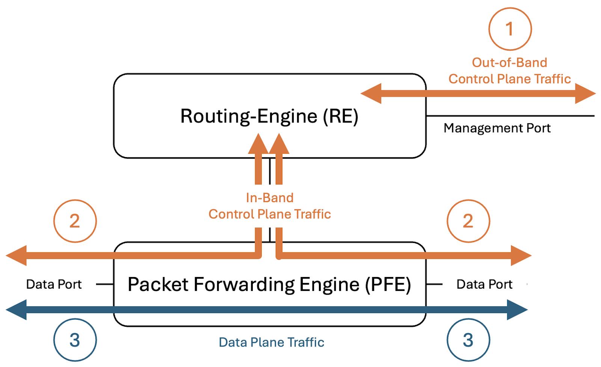
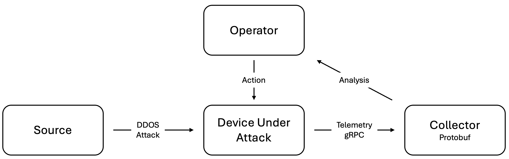
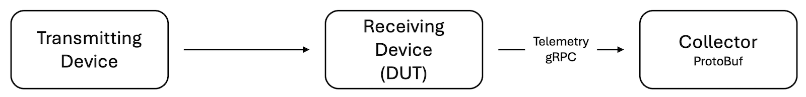
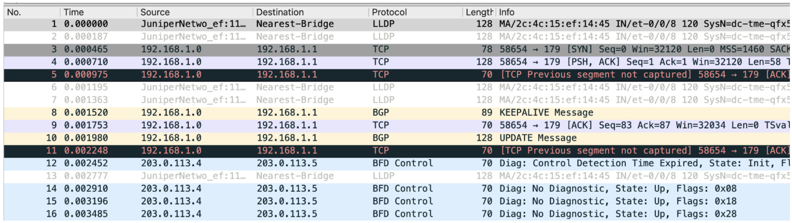
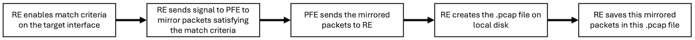

# Control and Data Plane Traffic Capture on QFX Switches

**Ridha Hamidi - 08/01/2026**

Packet capture on QFX switches enables visibility into control-plane and data-plane traffic for efficient troubleshooting, traffic analysis, and network diagnostics.

Flexible capture methods allow packets to be mirrored and analyzed, providing deeper insight into switch behavior and forwarding operations.

## Introduction

Network troubleshooting frequently presents the challenge of sorting out discrepancies between control-plane and data-plane reported status and error conditions. For example, the control plane may report a fully healthy state across all interfaces, while the data plane silently drops traffic, causing application failures. In such scenarios, direct visibility into the traffic on a particular device becomes essential to uncovering the root cause.

In a previous publication [1], we examined several off-box approaches for capturing control-plane and data-plane traffic, including packet mirroring and TAP aggregation. While effective, these solutions can be costly to deploy and are best justified when there is a sustained, ongoing requirement for packet capture.

This paper instead focuses on temporary, on-box packet capture mechanisms suited to short-lived, active troubleshooting scenarios, where a lightweight, on-demand approach is more appropriate than a permanent capture infrastructure.

## Traffic Type Definitions

Before diving into the on-box packet capturing solutions, it is necessary to lay out some common ground terms.

The diagram below briefly summarizes the different types of traffic that must be considered when troubleshooting a traffic-related issue on a network device.



Relative to the above diagram:

- 1: Out-Of-Band Control Plane Traffic
- 2 : In-Band Control Plane Traffic
- 3 : Transit/Data Plane Traffic

Control-plane traffic, whether out-of-band or in-band, is either sourced from or destined to the Routing Engine. It comprises packets belonging to switching, routing, and management protocols, such as LLDP, ARP, OSPF, BGP, SSH, or SNMP, where either the source or destination IP address is owned by the network device itself, such as a physical interface or loopback.

Data-plane traffic, on the other hand, traverses the network device from one physical interface to another. It is processed entirely by the Packet Forwarding Engine (PFE) and is typically not visible to the Routing Engine, except when the user explicitly configures features such as mirroring, sampling, or other similar flow-tracking capabilities.

In the following sections, we explain how to capture each of these traffic types under various conditions.

This article is organized into two main sections. The first section examines three common approaches to capturing control-plane traffic: steady-state capture, capture triggered by a detected DDoS attack, and capture triggered by an interface state transition. The second section addresses data-plane packet capture, with separate subsections covering QFX devices running Junos OS and QFX devices running Junos OS Evolved.

## Control Plane Packet Capture

### Steady State Conditions

Capturing control-plane traffic under steady-state conditions has been supported since initial deployment (Day 1) across all HPE Juniper platforms, regardless of whether the device runs the legacy BSD-based Junos OS or the newer Linux-based Junos OS Evolved. Both operating systems provide a Day-1 CLI command, implemented as a wrapper around the tcpdump utility, that enables users to capture host-bound Type-1 and Type-2 traffic.

The captured traffic can be analyzed directly on-box for straightforward troubleshooting scenarios, or saved to a .pcap file for subsequent analysis with an off-box tool such as Wireshark.

The available options for this command are listed in the output below.

```
{master:0}
root@qfx5120> monitor traffic interface em0 ?
Possible completions:
  <[Enter]>            Execute this command
  absolute-sequence    Display absolute TCP sequence numbers
  brief                Display brief output
  count                Number of packets to receive (0..1000000 packets)
  detail               Display detailed output
  extensive            Display extensive output
  layer2-headers       Display link-level header on each dump line
  matching             Expression for headers of receive packets to match
  no-domain-names      Don't display domain portion of hostnames
  no-promiscuous       Don't put interface into promiscuous mode
  no-resolve           Don't attempt to print addresses symbolically
  no-timestamp         Don't print timestamp on each dump line
  print-ascii          Display packets in ASCII when displaying in hexadecimal format
  print-hex            Display packets in hexadecimal format
  read-file            Read packets from a given file
  resolve-timeout      Period of time to wait for each name resolution (1..4294967295 seconds)
  size                 Amount of each packet to receive (bytes)
  write-file           Write packets to specified file
  |                    Pipe through a command
{master:0}
```

Below is a sample execution of this monitor command and writing the output into a .pcap file

```
{master:0}
root@qfx5120> monitor traffic interface em0 matching "not tcp port 22" write-file Mgmt_Intf_Traffic.pcap
Address resolution is ON. Use <no-resolve> to avoid any reverse lookup delay.
Address resolution timeout is 4s.
Listening on em0, capture size 96 bytes

^C
106 packets received by filter
0 packets dropped by kernel

{master:0}
root@qfx5120>

```

You can read the content of the .pcap file locally on the QFX by using options of the same "monitor traffic" command, as shown below

```
{master:0}
root@qfx5120> monitor traffic read-file Mgmt_Intf_Traffic.pcap
Reverse lookup for 10.92.71.52 failed (check DNS reachability).
Other reverse lookup failures will not be reported.
Use <no-resolve> to avoid reverse lookups on IP addresses.

12:25:19.195646  In arp who-has 10.92.71.52 tell sfo-vlan140.englab.juniper.net
12:25:19.241517  In IP sfo-vlan140.englab.juniper.net > vrrp.mcast.net: VRRPv2-advertisement 20: vrid=11 prio=110 authtype=none intvl=1
12:25:19.775473  In arp who-has sflab-vlan140-dhcp-9.englab.juniper.net tell sfo-vlan140.englab.juniper.net

<snip>

{master:0}
root@qfx5120>
```

If a more detailed traffic analysis is needed, the captured file can be analyzed using an off-box tool such as Wireshark.

Capturing control-plane traffic, as described in the previous section, is straightforward and hardware-independent, unlike data-plane traffic capture, which is described in the Transit Traffic Capture section later in this document.

### DDOS Attack Triggered Packet Capture

DDoS-related tickets are part of the daily routine for TAC engineers.

In most cases, the type of attack and its source can be identified offline by analyzing and correlating information from multiple network devices, such as firewalls and monitoring tools, along with their respective knobs and log files. However, attackers constantly find new ways to work around detection mechanisms, forcing network engineers to also find new ways to quickly and effectively detect ongoing attacks.

As an example, let's look at a case where a DDoS attack occurred intermittently, as if the attacker were deliberately operating within a time window too short to troubleshoot and confirm the attack while it was happening.

An on-box packet capture taken while the DDoS attack was in progress allowed us to identify the source of the attack and block it.

The procedure can be summarized in the following steps:

- Install a TAC-provided script on the relevant network devices.
- Wait for the incident to happen again. If so, the script will create a packet capture file (.pcap).
- The .pcap file is transferred to TAC for analysis, or to a separate machine to be analyzed by the customer using applications like Wireshark
- The source of the attack is identified, and appropriate action is taken to block it.

The procedure described above has many downsides:

- Manual: the steps involve manual file transfers
- Slow: the steps are time-consuming because they involve multiple parties. By nature, DDOS attacks must be quickly identified and blocked.
- Customer-dependent: not all customers are willing to install troubleshooting scripts on their production network during peak times. This is especially true with customers who are already irritated and stressed by the DDOS attack.

The alternate procedure we describe in this section is an attempt to address these concerns, in case of a DDOS attack that requires on-box packet captures. It proposes an automation framework to reduce response latency and establish a reusable model for future automated incidence response.



The framework described above requires network devices to be pre-configured to securely stream DDoS-protection statistics to collectors in a publisher-subscriber model.

The first important building block of this framework is the DDOS attack component. The algorithm uses the underlying Broadcom's pre-configured ASIC queue thresholds that define DDOS attacks. The software monitors these thresholds and reports the violating flows to upper layers that can act on them.

In our case, the action is to capture packets for a period of time (default is 5 seconds with a maximum of 5,000 packets) and send them to the collector via a pre-defined sensor under the HPE-Juniper native data model.

```
/junos/system/linecard/packet-capture
```

The output below shows the list of queues and their respective thresholds

```
{master:0}
root@qfx5120> request pfe execute target fpc0 command "show halp-pkt asic-queue"
SENT: Ukern command: show halp-pkt asic-queue
------ --------- -------- -------- ------------------------------
 CMICQ  Channel   bwidth    burst     Qlen           Proto(s)
------ ---------- -------- -------- --------- ------------------------------
     0        3      500       10      200             uncls
     4        1     4000      200      200          vchassis-unclassified
     5        3      500      200      200           overlay-arp
     6        3      500      200      200           overlay-ndpv6
     7        3      500      200      200             vxlan
     8        3     1500      200      200           localnh
     9        3     1000      200      200         vcipc-udp
    10        3     2000      200      200     sample-source
    11        3     2000      200      200       sample-dest
    12        3       50       10      200        l3mtu-fail,ttl,ip-opt
    14        3      100       10      200        garp-reply
    15        3      500       10      200           fw-host
    16        3      500      200      200             ndpv6
    17        3     1000      200      200          dhcpv4v6
    19        3     1500      200      200     ipmc-reserved
    20        3      300      200      200           resolve
    21        3      100       10      200       l3dest-miss
    22        3      100       10      200          redirect
    23        3      300      200      200            l3nhop
    24        3      100       10      200   l3mc-sgvhit-icl
    25        3       50       10      200   martian-address
    26        3     1000      200      200              l2pt
    27        3       50       10      200         urpf-fail
    28        3     1000      300      300      ipmcast-miss
    29        2      300       10      200   nonucast-switch
    30        2     3000      200      200              rsvp,ldp,bgp
    31        2     3000      200      200      unknown-l2mc,rip,ospf
    32        2     1000      200      200      fip-snooping,--non-exist--
    33        2     1000      200      200              igmp
    34        2      500      200      200               arp
    35        2     1500      200      200          pim-data
    36        2     1500      200      200        ospf-hello
    37        2     1500      200      200          pim-ctrl
    38        2     2000      200      200              isis
    39        1      250      200      200              lacp
    40        1     1200      200      200               bfd
    41        1      100       10      200               ntp
    42        1      500      200      200          vchassis-aggregate
    43        1     1000      200      200               stp,pvstp,lldp
{master:0}
root@qfx5120>
```

For demonstration purposes, we simulated a DDoS attack by sending an excessive number of valid ARP requests. Given that the predefined threshold is 500 frames per second, we triggered the ARP DDoS attack condition by sending valid ARP packets at 1 kpps from a traffic generator.

The second important building block of this framework is the telemetry component.

Establishing a secure SSL connection between the network device and the collector involves multiple steps and is out of the scope. For lab purposes, and to keep this paper focused on the topic of packet capture, we will use the following configuration with an insecure clear-text connection.

Do not use such an insecure connection in production environments.

```
set system services extension-service request-response grpc clear-text address 0.0.0.0
set system services extension-service request-response grpc clear-text port <Port_Number>
set system services extension-service request-response grpc max-connections 30
set system services extension-service request-response grpc skip-authentication
```

We also need to enter the following operational commands to trigger logging in the event of a DDoS attack. Note that these commands are ephemeral so they will not persist across reboots.

```
{master:0}
root@qfx5120> request pfe execute target fpc0 command "show ukern_trace handles" | grep BRCM_PKT
17     BRCM_PKT         none       Off    On     1048576      3     -

{master:0}
root@qfx5120>
```

```
{master:0}
root@qfx5120> request pfe execute target fpc0 command "set ukern_trace 17 file-logging enable"
SENT: Ukern command: set ukern_trace 17 logging enable
{master:0}
root@qfx5120>
```

```
{master:0}
root@qfx5120> request pfe execute target fpc0 command "set ukern_trace 17 logging enable"
SENT: Ukern command: set ukern_trace 17 logging enable
{master:0}
root@qfx5120>
```

The collector must subscribe as a client to the above-mentioned sensor to receive captured packets. In our example here, this is done with the below command over the unsecure connection

```
root@server:~# gnmic --insecure --address <DUT_IP> --port <Port_Number> --username <Username> --password <Password> subscribe --path '/junos/system/linecard/packet-capture' --mode stream --format json
{
  "sync-response": true
}
```

The highlighted lines show that the connection is established successfully from the collector perspective, but we can verify the same from the DUT side as well by using the following commands:

```
{master:0}
root@qfx5120> show agent sensors
<snip>
Sensor Information :
    Name                                    : sensor_1005
    Resource                                : /junos/system/linecard/packet-capture/
    Version                                 : 1.0
    Sensor-id                               : 539528118
    Subscription-ID                         : 1005
    Parent-Sensor-Name                      : Not applicable
    Component(s)                            : PFE
    Profile Information :
        Name                                : export_1005
        Reporting-interval                  : 30
        Payload-size                        : 5000
        Format                              : JSON
{master:0}
root@qfx5120>
```

```
{master:0}
root@qfx5120> show system connections | match 57400
tcp4       0      0  10.92.71.182.57400                            10.92.71.98.37792                             ESTABLISHED
tcp46      0      0  *.57400                                       *.*                                           LISTEN

{master:0}
root@qfx5120>
```

```
{master:0}
root@qfx5120> show extension-service request-response clients
Client ID              Socket Address                     Client Type   Client
Login Time (UTC)   Channel Count
mgd-api                unix::35                           gRPC          No Login Time                     0

unix::40               unix::40                           gRPC          No Login Time                     1

unix::41               unix::41                           gRPC          No Login Time                     1

ipv6:::ffff:10.92.71.98:59102 ipv6:::ffff:10.92.71.98:59102 gRPC        Mon Jun 29 01:42:55 2026          1

{master:0}
root@qfx5120>
```

```
{master:0}
root@qfx5120> show extension-service request-response clients detail
Channel information:
  Client ID: mgd-api
  Socket Address: unix::35
  Client Type: gRPC
  Channel Count: 0
  Client Login Time (UTC): No Login Time
  Client ID: unix::40
  Socket Address: unix::40
  Client Type: gRPC
  Channel Count: 1
  Client Login Time (UTC): No Login Time
    Channel target: unix:/var/run/japi_na-grpcd
    Channel status: GRPC_CHANNEL_READY
    User name: No User

Channel information:
  Client ID: unix::41
  Socket Address: unix::41
  Client Type: gRPC
  Channel Count: 1
  Client Login Time (UTC): No Login Time
    Channel target: unix:/var/run/japi_na-grpcd
    Channel status: GRPC_CHANNEL_READY
    User name: No User

Channel information:
  Client ID: ipv6:::ffff:10.92.71.98:59102
  Socket Address: ipv6:::ffff:10.92.71.98:59102
  Client Type: gRPC
  Channel Count: 1
  Client Login Time (UTC): Mon Jun 29 01:42:55 2026
    Channel target: unix:/var/run/japi_na-grpcd
    Channel status: GRPC_CHANNEL_READY
    User name: root
{master:0}
root@qfx5120>
```

```
{master:0}
root@qfx5120> show extension-service request-response servers
gRPC server information:
  Max connections: 8, Skip-authentication: Enabled

  Address: 0.0.0.0, Port: 57400
  Status: Up, Type: Clear-text

  Address: unix:/var/run/japi_jsd
  Status: Up, Type: Clear-text

{master:0}
root@qfx5120>
```

```
{master:0}
root@qfx5120> show ephemeral-configuration instance junos-analytics
## Last changed: 2026-06-29 01:42:57 UTC
services {
    analytics {
<snip>
        export-profile export_1011 {
            format json-gnmi; ## Warning: 'format' is deprecated
            transport grpc; ## Warning: 'transport' is deprecated
        }
<snip>
        sensor sensor_1011 {
            export-name export_1011;
            resource /junos/system/linecard/packet-capture/;
            subscription-id 1011;
            reporting-rate 30;
            end-of-sync-identifiers 8;
            target-defined;
            life-time long-lived;
        }
    }
}

{master:0}
root@qfx5120>
```

Now that we verified that the setup is configured properly and is operationally ready, we can start testing if it handles a DDOS attack properly by capturing the appropriate packets and sending them to the collector.

First, let's verify that no DDOS attack is present before starting the simulation:

```
{master:0}
root@qfx5120> show ddos-protection protocols violations
Packet types: 47, Currently violated: 0
 
{master:0}
root@qfx5120>

```

```
{master:0}
root@qfx5120> show ddos-protection protocols statistics terse
Packet types: 47, Received traffic: 4, Currently violated: 0

Protocol    Packet      Received        Dropped        Rate     Violation State
group       type        (packets)       (packets)      (pps)    counts
stp         aggregate   58              0              1        0         ok
lldp        aggregate   58              0              1        0         ok
arp         aggregate   1               0              0        0         ok
pvstp       aggregate   58              0              1        0         ok

{master:0}
root@qfx5120>
```

Given that we're using a lab environment as a POC, we do not have a real telemetry collector. Instead, we will capture specific packets on the server acting as collector and process them manually.
To that end, we can capture the relevant telemetry packets on the collector by using the following tcpdump command and writing the captured packets into a file.

```
root@server:~# tcpdump -i ens9f0 'port 57400' -w My_DDOS_Packet_Capture
tcpdump: listening on ens9f0, link-type EN10MB (Ethernet), snapshot length 262144 bytes
```

We now start the simulated ARP DDOS attack on the traffic generator and verify if it is detected properly.

```
{master:0}
root@qfx5120> show ddos-protection protocols violations
Packet types: 47, Currently violated: 1
Protocol    Packet      Bandwidth  Arrival   Peak      Policer bandwidth
group       type        (pps)      rate(pps) rate(pps) violation detected at
arp         aggregate   500        999       1000      2026-06-29 02:49:11 UTC
  Detected on: FPC-0
{master:0}
root@qfx5120>
```

```
{master:0}
root@qfx5120> show ddos-protection protocols statistics terse
Packet types: 47, Received traffic: 4, Currently violated: 1
Protocol    Packet      Received        Dropped        Rate     Violation State
group       type        (packets)       (packets)      (pps)    counts
stp         aggregate   1637            0              2        0         ok
lldp        aggregate   1637            0              2        0         ok
arp         aggregate   49035           19715          1001     1         viol
pvstp       aggregate   1637            0              2        0         ok
{master:0}
root@qfx5120>
```

We can see from the above outputs that the DDOS attack has been detected properly. We can now stop the tcpdump packet capture on the collector and start analyzing the file.

Given that the captured packets are in Protobuf format, we found that Wireshark cannot analyze the file without additional tweaks. We used an AI-generated Python script to convert the Protobuf file into a .pcap file, which we then analyzed with Wireshark or directly on-box using tcpdump <filename>.

The output below shows an AI-generated Python script that does the Protobuf to pcap conversion.

```
root@server:~# cat protobuf-to-pcap.py
#!/usr/bin/env python3

from scapy.all import rdpcap, wrpcap, Ether
import re
import sys

def extract_embedded_packets(input_pcap, output_pcap):
    """
    Read a PCAP file, search payloads for ASCII hex-encoded Ethernet frames,
    reconstruct packets, and write them into a new PCAP file.
    """
    # Match long sequences of hex bytes:
    # Example:
    # ff ff ff ff ff ff 64 c3 d6 60 76 00 08 00 ...
    hex_pattern = re.compile(
        rb'((?:[0-9a-fA-F]{2}[\s:.-]?){20,})'
    )

    packets = rdpcap(input_pcap)
    extracted_packets = []

    for pkt in packets:
        raw_data = bytes(pkt)
        matches = hex_pattern.findall(raw_data)
        for match in matches:
            try:
                # Decode ASCII bytes
                hex_string = match.decode("ascii", errors="ignore")

                # Remove separators/spaces
                cleaned = re.sub(r'[^0-9a-fA-F]', '', hex_string)

                # Must be even-length hex
                if len(cleaned) % 2 != 0:
                    continue

                packet_bytes = bytes.fromhex(cleaned)

                # Minimum Ethernet frame header
                if len(packet_bytes) < 14:
                    continue

                # Create Ethernet packet
                ether_pkt = Ether(packet_bytes)

                extracted_packets.append(ether_pkt)

            except Exception as e:
                print(f"Skipping invalid match: {e}")

    if not extracted_packets:
        print("No embedded packets found.")
        return

    wrpcap(output_pcap, extracted_packets)

    print(f"Extracted {len(extracted_packets)} packets")
    print(f"New PCAP written to: {output_pcap}")

def main():
    if len(sys.argv) != 3:
        print("Usage:")
        print(f"  {sys.argv[0]} <input.pcap> <output.pcap>")
        sys.exit(1)

    input_pcap = sys.argv[1]
    output_pcap = sys.argv[2]
    extract_embedded_packets(input_pcap, output_pcap)

if __name__ == "__main__":
    main()

root@server:~#
```

We used the above script to convert the captured file from ProtoBuf to pcap, as shown below:

```
root@server:~# python3 protobuf-to-pcap.py My_DDOS_Packet_Capture My_DDOS_Packet_Capture.pcap
Extracted 2549 packets
New PCAP written to: My_DDOS_Packet_Capture.pcap
root@server:~# 
```

Then we analyzed the pcap file with tcpdump

```
root@server:~# tcpdump -r My_DDOS_Packet_Capture.pcap -c 100
reading from file My_DDOS_Packet_Capture.pcap, link-type EN10MB (Ethernet), snapshot length 65535
03:10:21.660046 LLDP, length 357: dc-tme-qfx5120-03.englab.juniper.net
<snip>
03:10:21.664622 ARP, Request who-has 192.85.2.1 tell 192.85.2.2, length 110
03:10:21.664921 ARP, Request who-has 192.85.2.1 tell 192.85.2.2, length 110
03:10:21.665169 ARP, Request who-has 192.85.2.1 tell 192.85.2.2, length 110
<snip>
root@server:~#
```

The source of the DDoS attack is now clearly identified from the output as 192.85.2.2. This device is sending ARP requests approximately 3 times per second.

### Interface State Transition Triggered Packet Capture

Supported QFX Models: QFX5130-32CD, QFX5130E-32CD, QFX5130-48C, QFX5700, QFX5230-64CD, QFX5240-64OD, and QFX5240-64QD

Software Release: Junos: 23.4X100-D40-EVO onward

A recurring troubleshooting scenario involves statistical discrepancies on point-to-point links between directly connected routers or switches. Specifically, the transmitted packet counter reported on one device may not match the received packet counter reported on its peer --- for the same packet flow, across the same physical link. The counters on either side of the link appear to tell contradictory stories about the same traffic, which can obscure the true source of packet loss and complicate fault isolation. The packet capture feature described in this section records a configurable number of host-bound packets per physical interface and exports them to an external collector using the Junos Telemetry Interface (JTI). This capability provides engineers with direct visibility into ingress traffic at the interface level, enabling efficient root-cause analysis of network and performance issues without the need for external capture infrastructure.

Upon each interface transition from the DOWN state to the UP state, the device automatically captures the first 50 ingress packets received on that interface. Captured data is encoded in Google Protocol Buffer (GPB) format and streamed to the configured collector over gRPC with SSL encryption, ensuring both efficiency and transport-layer security.

To receive packet capture data, the collector needs to subscribe to the following JTI sensor path: /junos/system/linecard/packet-capture.

To illustrate how this feature works, we will use the following POC setup



As described in the previous section, which also uses a ProtoBuf Collector, it's it is important to make sure that this building block is configured and ready for secure or insecure collection of telemetry records.

Please follow the same instructions for configuration and verification as described in the previous section.

Also, the CLI command below must be added to the DUT

```
set system packet-forwarding-options packet-capture packet-capture-enable
```

After we verify that the setup is configured properly and is operationally ready, we can start testing.

We start by shutting down the ingress interface on the DUT, then start packet capture on the PtotoBuf Collector with tcpdump and saving into a file.

```
root@server:~# tcpdump -i ens9f0 host 10.92.74.57 -w rh-packet-capture
```

Then we bring the same interface back up and wait for a few seconds, until all protocols are stabilized, then stop the capture. At this point, we have a ProtoBuf packet file saved into the collector.

In a production environment, this packet capture would be analyzed in real time, but in our POC setup, we can process this file and convert it into a .pcap file by using the same Python script mentioned in a previous section.

By using this script, we can process the captured packets and write them into a .pcap file

```
root@server:~# python3 protobuf-to-pcap.py if-packet-capture if-packet-capture.pcap
Extracted 50 packets
New PCAP written to: if-packet-capture.pcap
root@server:~#
```

Then the .pcap file is analyzed with Wireshark



This Wireshark screenshot lists all control plane packets captured right after the interface transitioned from "DOWN" to "UP".

## Transit Traffic Capture

### QFX Running Junos OS Evolved

To capture transit traffic on a QFX running Junos OS Evolved, follow these steps:

Configure a firewall filter with action log or syslog

```
set firewall family inet filter MyFilter term 1 from protocol icmp
set firewall family inet filter MyFilter term 1 then log
```

Attach the filter on the input of the interface where traffic is to be captured. Note that transit traffic can be captured on ingress only, as the actions log and syslog are not supported on egress.

```
set interfaces et-0/0/0 unit 0 family inet filter input MyFilter
set interfaces et-0/0/0 unit 0 family inet address 192.168.3.1/31
```

While traffic is running, run the provided Python script from the shell to start the packet capture. The output below shows the available arguments of this script

```
[vrf:none] root@qfx5130:~# start_pcap.py -h
usage: start_pcap.py [-h] [-n NUM_PACKETS] [-m MAX_RUN_TIME]

Specifications.

optional arguments:
  -h, --help            show this help message and exit
  -n NUM_PACKETS, --num_packets NUM_PACKETS
                        Maximum packets to captured(1000)
  -m MAX_RUN_TIME, --max_run_time MAX_RUN_TIME
                        Maximum run time in seconds(2..60)
[vrf:none] root@qfx5130:~#
```

For example

```
[vrf:none] root@qfx5130:~# start_pcap.py -n 10
Starting packet capture
Script execution completed successfully.
[vrf:none] root@qfx5130:~#
```

You should find a .pcap file under /var/tmp/pcap. The file name is generated automatically as is a the combination of the interface name and a timestamp, as shown below

```
root@qfx5130> file list /var/tmp/pcap/ detail | grep pcap
/var/tmp/pcap/:
-rw-r--r--  1 root  root        1204 Jul 4  13:19 et_0_0_0_20260704_131935.pcap

root@qfx5130>
```

You can analyze the file locally or export it and analyze it with a tool like Wireshark.

```
root@qfx5130> monitor traffic read-file /var/tmp/pcap/et_0_0_0_20260704_131935.pcap
reading from file /var/tmp/pcap/et_0_0_0_20260704_131935.pcap, link-type EN10MB (Ethernet)

13:19:24.559092 IP 192.168.3.0 > 192.168.1.0: ICMP echo reply, id 7558, seq 15, length 64
13:19:25.606870 IP 192.168.3.0 > 192.168.1.0: ICMP echo reply, id 7558, seq 16, length 64
13:19:26.630809 IP 192.168.3.0 > 192.168.1.0: ICMP echo reply, id 7558, seq 17, length 64
13:19:27.655982 IP 192.168.3.0 > 192.168.1.0: ICMP echo reply, id 7558, seq 18, length 64
13:19:28.656884 IP 192.168.3.0 > 192.168.1.0: ICMP echo reply, id 7558, seq 19, length 64
13:19:29.657333 IP 192.168.3.0 > 192.168.1.0: ICMP echo reply, id 7558, seq 20, length 64
13:19:30.658392 IP 192.168.3.0 > 192.168.1.0: ICMP echo reply, id 7558, seq 21, length 64
13:19:31.658960 IP 192.168.3.0 > 192.168.1.0: ICMP echo reply, id 7558, seq 22, length 64
13:19:32.660023 IP 192.168.3.0 > 192.168.1.0: ICMP echo reply, id 7558, seq 23, length 64
13:19:33.661005 IP 192.168.3.0 > 192.168.1.0: ICMP echo reply, id 7558, seq 24, length 64

root@qfx5130>
```

### QFX Running Junos OS

The feature described in this section is supported on QFX5110 and QFX5120 models running Junos OS Release 24.4R1 onward.

This packet capture feature is based on the implementation described in the figure below



QFX platforms running Junos OS have the capability of on-box transit packet capturing from the operational mode, so there's no need to change the QFX configuration to use this capability.

This capability enables packet capturing on the ingress or egress ports of a QFX and supports filtering based on one or more packet header fields, depending on hardware capabilities. With this feature, operators can inspect live packet streams entering or leaving a device by executing a single CLI command, without relying on external capture infrastructure.

The following examples list the supported attributes per QFX model, alongside supported and unsupported combinations of attributes.

**QFX5110, based on Broadcom Trident 2+ chipset**

Single attribute: VLAN, DMAC, SMAC, DIPv4, and SIPv4

Double attribute: VLAN+DMAC and DIPv4+SIPv4

Triple attribute: VLAN+DMAC+SMAC

> **Note** : VLAN+SMAC and DMAC+SMAC are not supported

**QFX5120, based on Broadcom Trident 3 chipset**

Single attribute: inner-SMAC, inner-DMAC, inner-SIPv4, inner-DIPv4, outer-DMAC, outer-SIPv4, outer-DIPv4, VLAN-ID, and VNID.

Double attribute: VLAN+Outer-DMAC, Outer-DIPv4+Outer-SIPv4

Triple attribute: VLAN+Outer-DMAC+Outer-SMAC

> **Note** : outer-SMAC is not supported.

At least one of these attributes must be specified in the CLI command for the packet capture to be triggered. Also, the interface name and traffic direction ingress vs egress are mandatory in the CLI command.

Users have the option to save captured packets in PCAP format for offline analysis. With this feature, operators can inspect live packet streams entering or leaving a device by executing a single CLI command, without relying on external capture infrastructure.

The CLI supports packet capturing using either a single filter attribute or a combination of attributes. Certain attribute combinations are not supported on some platforms due to hardware constraints. Additionally, combinations of L2 and L3 attributes are not supported on any platform.

When the capture command is executed, a TCAM capture filter is installed in the PFE for a default duration of 5 minutes. This can be modified by the user with the CLI command below, between 5 and 60 minutes.

```
set services pfe traffic monitor-timer <time>
```

The filter will remain in place for the duration of the timer or until a new command is entered. However, if the user is executes the packet capture command before the timer expires, it might happen that the captured traffic matches the previously executed command. This is expected, and we recommend in this case running the same command a second time to clear the packets that are already in the kernel.

Below is an example of a valid CLI ingress packet capture command on a QFX5120

```
{master:0}
root@qfx5120> monitor pfe traffic interface et-0/0/48 outer-dmac 80:7f:f8:d2:02:95 ingress count 1
Action successful
verbose output suppressed, use <detail> or <extensive> for full protocol decode
Address resolution is ON. Use <no-resolve> to avoid any reverse lookup delay.
Address resolution timeout is 4s.
Listening on et-0/0/48, capture size 96 bytes

Reverse lookup for 192.168.100.1 failed (check DNS reachability).
Other reverse lookup failures will not be reported.
Use <no-resolve> to avoid reverse lookups on IP addresses.

15:53:12.648946  In IP truncated-ip - 28 bytes missing! 192.168.100.1 > 192.168.100.13: ICMP echo request, id 59105, seq 14005, length 64

{master:0}
root@qfx5120>
```

Egress packet monitoring requires an additional, otherwise-unused interface, due to a hardware limitation that prevents true egress mirroring. To work around this constraint, the unused interface is configured with a soft loopback. When egress mirroring is enabled on the interface of interest, egressing packets are mirrored to the soft-loopback-enabled interface, where a filter is then applied using the desired match conditions.

For example, consider et-0/0/48 as the interface of interest, on which egress traffic is to be monitored, and et-0/0/50 as an unused interface configured with a soft loopback. Packets egressing et-0/0/48 are mirrored to et-0/0/50, where the filter is installed to capture the traffic matching the specified conditions.

The example shown below represents the above description for egress traffic capture.

```
{master:0}[edit]
root@qfx5120# set interfaces et-0/0/50 ether-options loopback

{master:0}[edit]
root@qfx5120# commit and-quit
configuration check succeeds
commit complete
Exiting configuration mode

{master:0}
root@qfx5120> monitor pfe traffic interface et-0/0/48 egress-interface et-0/0/50 outer-src-ipv4 192.168.100.13 egress count 1 no-resolve
Action successful
verbose output suppressed, use <detail> or <extensive> for full protocol decode
Address resolution is OFF.
Listening on et-0/0/50, capture size 96 bytes

22:05:06.958404  In IP truncated-ip - 28 bytes missing! 192.168.100.13 > 192.168.100.1: ICMP echo reply, id 59105, seq 33779, length 64

{master:0}
root@qfx5120>
```

## Conclusion

This paper walked through the range of on-box, temporary packet capture tools available on HPE-Juniper QFX switches, offering a lightweight alternative to permanent TAP or mirroring infrastructure for short-term troubleshooting.

Control-plane capture remains the simplest case, supported since Day-1 via the tcpdump-based monitor traffic command on both BSD-based Junos and Junos OS Evolved.

For more demanding scenarios, such as intermittent DDoS attacks, an automated telemetry framework built on ASIC queue threshold violations and JTI streaming allows packet data to reach a collector without manual intervention or customer-installed scripts.

A related mechanism captures the first ingress packets whenever an interface transitions from DOWN to UP, helping isolate counter mismatches between directly connected peers.

Transit traffic capture differs by OS: Junos OS Evolved relies on a firewall filter combined with a Python capture script, while classic Junos OS offers a native operational-mode command with rich header-based filtering.

Across all these methods, captured data can be reviewed on-box or exported as a .pcap file for deeper analysis in Wireshark. Where captures arrive in Protocol Buffer format, a conversion step is needed before standard packet analysis tools can be used.

Collectively, these mechanisms give engineers direct, on-demand visibility into both control-plane and data-plane behavior. This reduces reliance on external capture infrastructure and speeds up root-cause analysis for elusive, hard-to-reproduce network issues.

## References

[1] TAP Aggregation for Network Observability https://juniper.github.io/techpost/articles/tap-aggregation-for-network-observability/article/)

## Glossary

- ASIC : Application-Specific Integrated Circuit
- BGP : Border Gateway Protocol
- BFD : Bidirectional Forwarding Detection
- CLI : Command-Line Interface
- DDoS : Distributed Denial of Service
- FPC : Flexible PIC Concentrator
- GPB : Google Protocol Buffer
- JTI : Junos Telemetry Interface
- LACP : Link Aggregation Control Protocol
- LLDP : Link Layer Discovery Protocol
- NDP : Neighbor Discovery Protocol
- NTP : Network Time Protocol
- OSPF : Open Shortest Path First
- PCAP : Packet Capture (file format)
- PFE : Packet Forwarding Engine
- PIM : Protocol Independent Multicast
- PVSTP : Per-VLAN Spanning Tree Protocol
- RSVP : Resource Reservation Protocol
- SSL : Secure Sockets Layer
- STP : Spanning Tree Protocol
- TAC : Technical Assistance Center
- TAP : Test Access Point
- TCP : Transmission Control Protocol
- VLAN : Virtual Local Area Network
- VNID : VXLAN Network Identifier
- VRRP : Virtual Router Redundancy Protocol
- VXLAN : Virtual Extensible LAN
