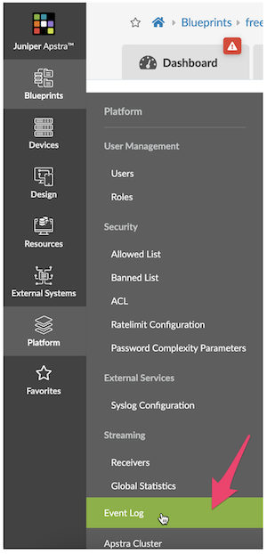
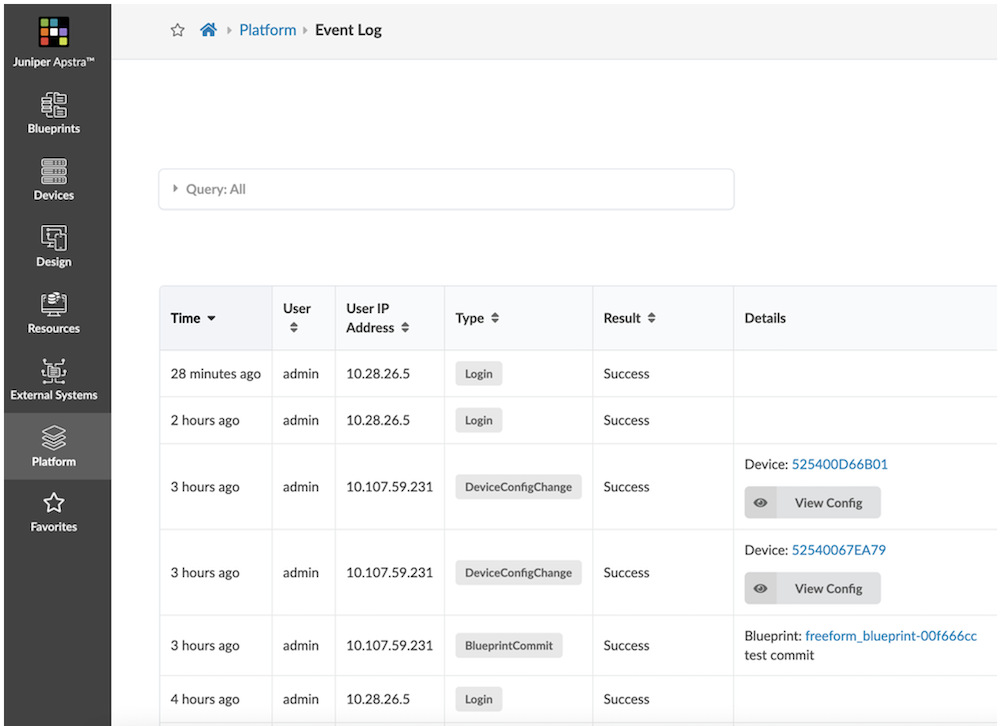
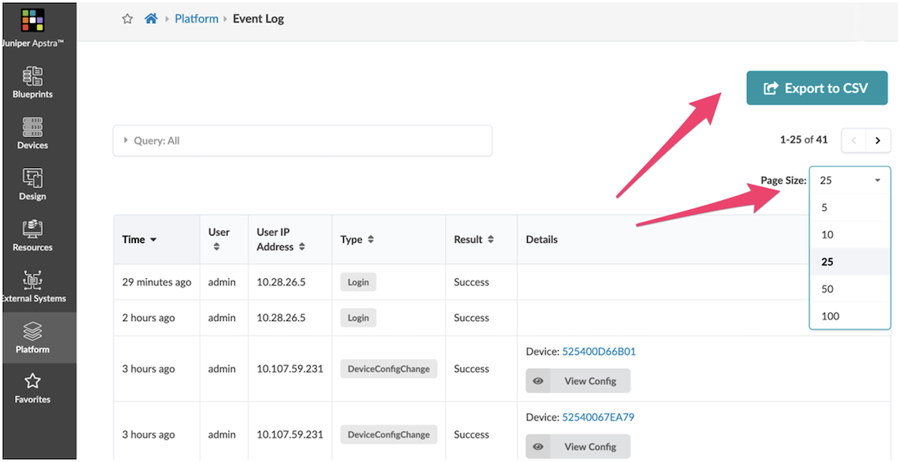
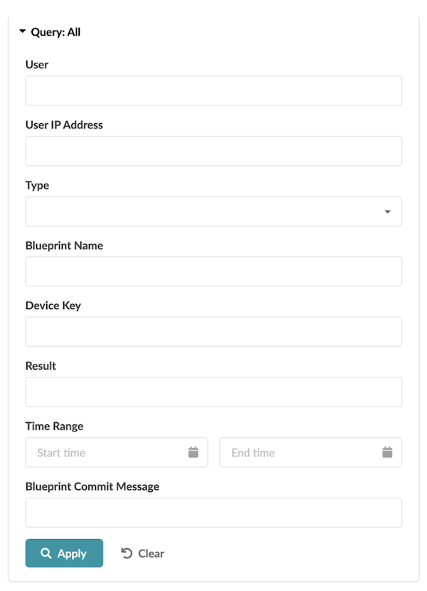
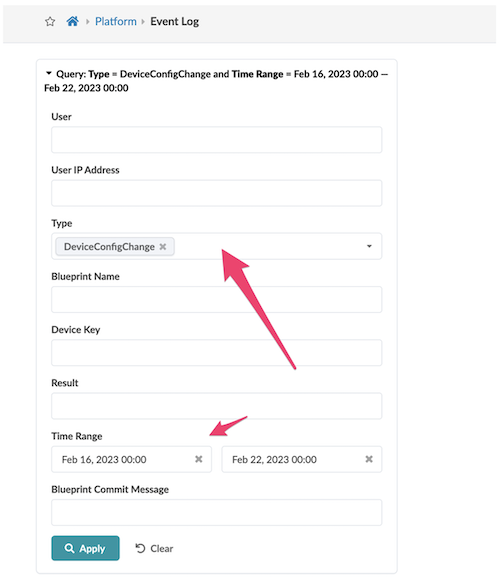
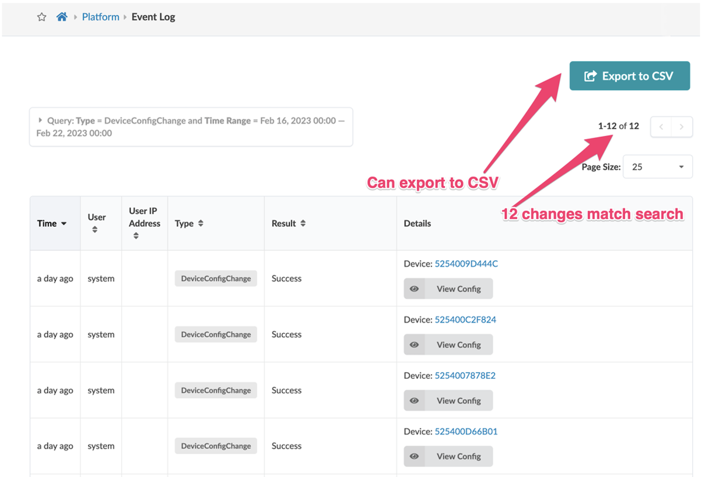
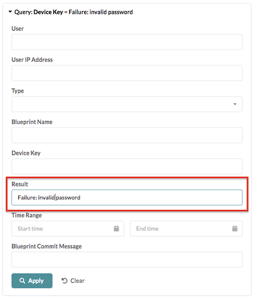
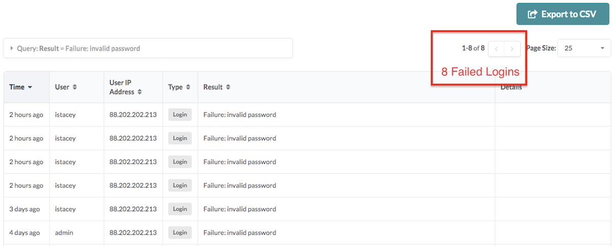
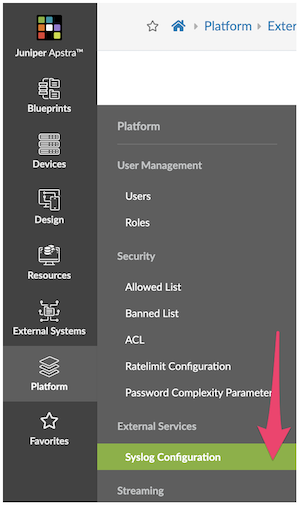
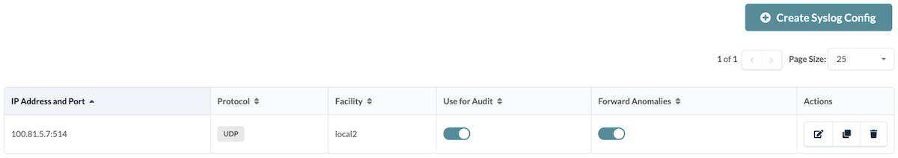

# Creating Audit Trails with the Apstra Event Log

**Bill Wester - 08/16/2023**

The Audit trail feature tracks a user's actions while using Apstra and can be very useful in investigating general usage, network outages, and possible suspicious activity.

## Introduction

Juniper Apstra automates the creation and management of data center fabrics and is designed to be the central point from which all network changes are made.

## What is Audited?

Each of the following is modeled as an audit event within Apstra.

- Login and Logout: including failed login attempts
- Blueprint Commits: changes committed from staged to active blueprint
- Blueprint Reverts: discards changes in the staged blueprint
- Blueprint Deletes: removing an entire blueprint
- Per device config change attributed to the user: This includes any config change that Apstra pushes to any managed device (including Time Voyager).  The audit event is attributed to the logged-in user making the change.

## View Audit Logs (Event Log)

1. The Event Logs can be accessed from the Apstra UI - Platform>Event Log, as seen in the screenshot below.



2. This view Displays the most recent 25 events in a table. You can change the page size of this table like any other table.



3. You can click on paging controls to see additional pages.



4. You can export the logs to a CSV file by clicking the "Export to CSV" button.

## Searching Audit Logs

Logs over time fill with many events, which can mask the one you want to see. Apstra provides a query function via the UI or the Rest API, allowing you to search for that important event previously masked or hidden within this log file.

1. Click on "Query: All," as shown below.

2. You can search on audit logs by following criteria (any combination is possible, choosing multiple fields returns audit events that match criteria for all fields).

- a. User
- b. User IP Address
- c. Source IP
- d. Type
- e. Blueprint Name
- f. Device Key
- g. Result
- h. Time Range
- i. Blueprint Commit Message



## Search Examples

View all config changes in the past five days





Failed user logins





## Audit Log Forwarding via Syslog

As well as viewing the log file via the UI, the log messages can also be sent to an external Syslog server.

### Enabling Syslog Server in Apstra UI

Navigate to Platform>Syslog Configuration:



Options:

1. Transport protocol (TCP or UDP)
2. Remote Syslog IP address
3. Remote syslog port
4. The facility which will be assigned to forwarded log messages
5. Enable Forwarding Audit Logs
6. Enable Forwarding Anomalies

### Forwarding Audit Logs: What is Audited?

- User login, logout
- Blueprint commits that push changes from staged to active blueprint
- Blueprint reverts that discard changes in the staged blueprint
- Blueprint deletes
- Per device config change attributed to the user. This includes any config change that Apstra pushes ever to any managed device. The audit event is attributed to the most appropriate user, and if not determinable, 'system' is specified as a user.



## How to Parse Apstra Logs

Apstra uses the Common Event Format (CEF), a standard for the interoperability of event or log-generating devices and applications. The standard defines a syntax for log records. It comprises a standard prefix and a variable extension formatted as key-value pairs.

### Apstra Log Format

**'{timestamp} {host} '**
**       'CEF:{version}|{device_vendor}|{device_product}|{device_version}|'**
**       '{device_event_class_id}|{name}|{severity}|{extension}**

Where:

- version is always "0"
- device_vendor is always "Apstra"
- device_product is always "Apstra"
- device_version is the current Apstra version
- device_event_class_id is "100" for audit logs and "101" for anomaly logs
- name is always "Audit even" for audit logs and "Alert" for anomaly logs
- severity is always "medium" for audit logs and "Very-High" for anomaly logs

And where:

- {extension} is either:


For anomaly logs: msg=<json payload>

For audit logs: cat=<activity> src=<src_IP> suser=<username> act=<activity result> cs1Label=<field1_type> cs1=<field1_value>
cs2Label=<field2_type> cs2=<field2_value> cs3Label=<field2_type> cs2=<field2_value>

### Audit Log Fields Table

| Field | Description | Applies to |
|:--|:--|:--|
| cat | Activity performed. Valid values: "Login", "Logout", "BlueprintCommit", "DeviceConfigChange", "BlueprintDelete". | All messages |
| src | Source IP of the client making HTTP requests | All messages |
| suser | Who performed the activity | All messages |
| act | Outcome of the activity - free-form string. "Success" means operation is accepted by system. In case of error, include error string. Ex: Unauthorized | All messages |
| cs1Label | The string "Blueprint Name" | Cat = "BlueprintCommit" or "BlueprintDelete" |
| cs1 | Name of the blueprint on which action was taken. | Cat = "BlueprintCommit" or "BlueprintDelete" |
| cs2Label | The string "Blueprint ID" | Cat = "BlueprintCommit" or "BlueprintDelete" |
| cs2 | Id of the blueprint on which action was taken. | Cat = "BlueprintCommit" or "BlueprintDelete" |
| cs3Label | The string "Commit Message". Only exists if user has added a commit message (optional) | Cat = "BlueprintCommit" or "BlueprintDelete" |
| cs3 | Commit Message. Only exists if user has added a commit message (optional) | Cat = "BlueprintCommit" |
| deviceExternalId | Id (typically serial number) of the managed device on which action was taken. | Cat = "DeviceConfigChange" |
| deviceConfig | Config that is pushed and applied on the device where "#012" is used to indicate a line break to log collectors and parsers. | Cat = "DeviceConfigChange" |

*Audit Logs Extension Format*

### Anomalies JSON Fields Table

| Field | Description | Applies to |
|:--|:--|:--|
| u'blueprint_label' | String. Name of the blueprint the anomaly was raised in. | All messages |
| u'timestamp' | String. Name of the blueprint the anomaly was raised in. | All messages |
| u'origin_name' | String. Name of the blueprint the anomaly was raised in. | All messages |
| u'alert' | The value is a JSON Payload with the actual anomaly (see next table) |  |
| u'origin_hostname' | String. Hostname of the device the anomaly affects. | All messages |
| u'device_hostname' | String. Hostname of the device the anomaly affects. | All messages |
| u'origin_role | String. Hostname of the device the anomaly affects. | All messages |

*Main Msg Format*

| Field | Description | Applies to |
|:--|:--|:--|
| u'first_seen' | String. Unix timestamp when the Anomaly was raised for the first time. | All messages |
| u'raised' | Always True | All messages |
| u'severity | The severity level of the anomaly. In Apstra today, all anomalies are raised with severity level 3. | All messages |

*Alert Format*

## Anomaly Log Examples

### IBA Anomaly "MLAG Anomaly"

The device_event_class_id = 101 for all anomalies

```
06 04 2020 08:42:50 10.23.59.188 <SLOG:INFO> 1 2020-06-04T13:26:54.195385Z aos-server - - - 2020-06-04T13:26:54.194168+0000 aos-server CEF:0|Apstra|Apstra|3.2.2-12|101|Alert|Very-High|msg={u'blueprint_label': u'LAB', u'timestamp': 1591277214194168, u'origin_name': u'FDO21260P7L', u'alert': {u'first_seen': 1591277214194141, u'raised': True, u'severity': 3, u'mlag_alert': {u'peer_link_status': u'down', u'actual_domain_state': 1, u'mlag_id': 0, u'expected_intf_state': 0, u'hostname': u'USDAL1-LAB93108-LF1', u'peer_link': u'port-channel3', u'expected_peer_link_status': u'up', u'actual_intf_state': 0, u'expected_domain_state': 4, u'ifname': u'', u'domain_id': u'1'}, u'id': u'6656a961-3139-4825-b89d-93f071271891'}, u'origin_hostname': u'LAB1_HOST1', 'device_hostname': 'LAB1_HOST1', u'origin_role': u'leaf'}
```

### IBA Anomaly "Unexpected Hostname"

```
Jun  8 21:35:25 aos-server - 2020-06-08T21:35:25.757009+0000 aos-server CEF:0|Apstra|Apstra|3.3.0-299|101|Alert|Very-High|msg={u'blueprint_label': u'test', u'timestamp': 1591652125757009, u'origin_name': u'505400C5CAAA', u'alert': {u'first_seen': 1591652125757001, u'raised': True, u'severity': 3, u'hostname_alert': {u'expected_hostname': u'spine1', u'actual_hostname': u'localhost'}, u'id': u'7f693f1d-2aeb-44a4-93f1-656400cfff7e'}, u'origin_hostname': u'localhost', 'device_hostname': 'localhost', u'origin_role': u''}
```

### User Logout and Logging

The device_event_class_id = 100 for all events

```
Jun  8 19:43:33 aos-server - 2020-06-08T19:43:33.392984+0000 aos-server CEF:0|Apstra|Apstra|3.3.0-299|100|Audit event|medium|cat=Logout src=10.1.253.6 suser=admin act=Success
Jun  8 19:43:39 aos-server - 2020-06-08T19:43:39.267262+0000 aos-server CEF:0|Apstra|Apstra|3.3.0-299|100|Audit event|medium|cat=Login src=10.1.253.6 suser=admin act=Success
```

### Blueprint Delete

```
Jun  8 21:23:41 aos-server - 2020-06-08T21:23:41.426107+0000 aos-server CEF:0|Apstra|Apstra|3.3.0-299|100|Audit event|medium|cat=BlueprintDelete src=10.1.253.6 suser=admin act=Success cs1Label=Blueprint Name cs1=test cs2Label=Blueprint ID cs2=2bd8f38f-9242-461c-855e-8146a4f68bb9
```

### Blueprint Commit

```
Jun  8 21:42:19 aos-server - 2020-06-08T21:42:19.550216+0000 aos-server CEF:0|Apstra|Apstra|3.3.0-299|100|Audit event|medium|cat=BlueprintCommit src=10.1.253.6 suser=admin act=Success cs1Label=Blueprint Name cs1=test cs2Label=Blueprint ID cs2=5ba55c14-6c01-4537-9dd7-d32c8c41616b cs3Label=Commit Message cs3=New_Virtual_Network
```

### Device Config Change

Revert a full day-0 BP deployment

```
Jun  8 21:35:27 aos-server - 2020-06-08T21:35:27.132831+0000 aos-server CEF:0|Apstra|Apstra|3.3.0-299|100|Audit event|medium|cat=DeviceConfigChange src=10.1.253.6 suser=admin act=Success deviceExternalId=505400C5CAAA deviceConfig=
...
<Device Config, see next table>
...
```

### Device Config

Note that "#012" is used to indicate a line break

```
service interface inactive expose#012!#012spanning-tree mode none#012!#012hostname spine1#012interface Ethernet1#012  description facing_l2-virtual-ext-001-leaf1:Ethernet1#012  no switchport#012  ip address 203.0.113.4/31#012  no shutdown#012  exit#012!#012
interface Ethernet2#012  description facing_l2-virtual-ext-002-leaf1:Ethernet1/1#012  no switchport#012  ip address 203.0.113.6/31#012  no shutdown#012  exit#012!#012interface Ethernet3#012  description facing_l2-virtual-ext-003-leaf1:Ethernet1/1#012  no switchport#012  
ip address 203.0.113.8/31#012  no shutdown#012  exit#012!#012interface Ethernet4#012  description facing_l2-virtual-ext-004-leaf1:Ethernet1#012  no switchport#012  ip address 203.0.113.10/31#012  no shutdown#012  exit#012!#012interface Ethernet5#012  no switchport#012  no shutdown#012  
exit#012!#012interface Ethernet6#012  no switchport#012  no shutdown#012  exit#012!#012interface Ethernet7#012  no switchport#012  no shutdown#012  exit#012!#012ip routing#012!#012service routing protocols model multi-agent#012interface loopback 0#012  ip address 203.0.113.20/32#012  
exit#012!#012ip prefix-list AllPodNetworks seq 5 permit 0.0.0.0/0 le 32#012ip as-path access-list MyASN permit ^$#012route-map AllPodNetworks permit 10#012  match ip address prefix-list AllPodNetworks#012  exit#012!#012route-map EVPN permit 10#012  set ip next-hop unchanged#012  
exit#012!#012router bgp 4200000000#012  router-id 203.0.113.20#012  no bgp default ipv4-unicast#012  bgp log-neighbor-changes#012  bgp bestpath as-path multipath-relax#012  redistribute connected route-map AllPodNetworks#012!#012  neighbor l3clos-s peer-group#012  neighbor l3clos-s timers 1 3#012  
neighbor l3clos-s soft-reconfiguration inbound#012  neighbor l3clos-s maximum-routes 0 warning-limit 90 percent#012  neighbor l3clos-s-evpn peer-group#012  neighbor l3clos-s-evpn ebgp-multihop 2#012  neighbor l3clos-s-evpn timers 1 3#012  neighbor l3clos-s-evpn send-community extended#012  
neighbor l3clos-s-evpn soft-reconfiguration inbound#012  neighbor l3clos-s-evpn update-source loopback0#012  neighbor l3clos-s-evpn maximum-routes 0 warning-limit 90 percent#012!#012!#012  neighbor 203.0.113.0 remote-as 64512#012  neighbor 203.0.113.0 peer-group l3clos-s-evpn#012  
neighbor 203.0.113.0 description facing_l2-virtual-ext-001-leaf1-evpn-overlay#012  neighbor 203.0.113.5 remote-as 64512#012  neighbor 203.0.113.5 peer-group l3clos-s#012  neighbor 203.0.113.5 description facing_l2-virtual-ext-001-leaf1#012  neighbor 203.0.113.1 remote-as 64513#012  
neighbor 203.0.113.1 peer-group l3clos-s-evpn#012  neighbor 203.0.113.1 description facing_l2-virtual-ext-002-leaf1-evpn-overlay#012  neighbor 203.0.113.7 remote-as 64513#012  neighbor 203.0.113.7 peer-group l3clos-s#012  neighbor 203.0.113.7 description facing_l2-virtual-ext-002-leaf1#012  
neighbor 203.0.113.2 remote-as 64514#012  neighbor 203.0.113.2 peer-group l3clos-s-evpn#012  neighbor 203.0.113.2 description facing_l2-virtual-ext-003-leaf1-evpn-overlay#012  neighbor 203.0.113.9 remote-as 64514#012  neighbor 203.0.113.9 peer-group l3clos-s#012  neighbor 203.0.113.9 description facing_l2-virtual-ext-003-leaf1#012  neighbor 203.0.113.3 remote-as 64515#012  neighbor 203.0.113.3 peer-group l3clos-s-evpn#012  neighbor 203.0.113.3 description facing_l2-virtual-ext-004-leaf1-evpn-overlay#012  
neighbor 203.0.113.11 remote-as 64515#012  neighbor 203.0.113.11 peer-group l3clos-s#012  neighbor 203.0.113.11 description facing_l2-virtual-ext-004-leaf1#012  address-family evpn#012    neighbor l3clos-s-evpn route-map EVPN out#012    neighbor 203.0.113.0 activate#012    neighbor 203.0.113.1 activate#012    
neighbor 203.0.113.2 activate#012    neighbor 203.0.113.3 activate#012    exit#012  address-family ipv4#012    neighbor 203.0.113.11 activate#012    neighbor 203.0.113.5 activate#012    neighbor 203.0.113.7 activate#012    neighbor 203.0.113.9 activate#012    exit#012  maximum-paths 32#012  exit#012
```

## Summary

As this paper demonstrates, Juniper Apstra Event Log facility is used for creating audit trails. Its extensive search and parsing capabilities allow you to zero in on the specific log entries you need.

## Useful links

- Apstra User Guide: [https://www.juniper.net/documentation/us/en/software/apstra4.1/apstra-user-guide/index.html](https://www.juniper.net/documentation/us/en/software/apstra4.1/apstra-user-guide/index.html)

## Glossary

- API: Application Programming Interface
- CEF: Common event Format, currently CEFv25
- CSV: Comma-Separated Values
- IP: Internet Protocol
- REST API: Representational State Transfer Application Programming Interface
- Syslog: A standardized system logging server
- TCP: Transmission Control Protocol
- UDP: User Datagram Protocol
- UI: User Interface
