# Apstra Day 2: Generic Systems

**Robert Lancaster - 02/08/2024**

It is often stated that most network outages occur as a result of changes having been made to the system. There have been many notable examples of this, and they have all affected us. Precise management of network changes is, in fact, one of the key benefits of network automation solutions. Data centers require frequent changes to meet the daily needs of customers.  All such activity exposes operators to potential mistakes that could lead to costly outages.

Apstra's Intent-driven workflows have been proven to reduce risk and increase efficiency when performing routine Day 2 tasks. Intent-based Networking manages the complex work of creating precise configurations and applying them with minimal disruption to network services.

## Introduction

Lots of different types of devices are attached to data center fabrics. But they all have a common set of parameters that must be configured on their fabric ports. Apstra refers to such devices as generic systems because of their commonalities.  The purpose of this document is to provide a view of how Apstra simplifies working with network attachments in DC Reference Designs. Specifically, we are focused on adding a new server into a rack and connecting it to an existing virtual network.

Other common Day 2 actions (covered in other postings):

- Adding additional links to an attached device
- Modifying link speed and other attributes
- Attaching external gateways and configuring routing characteristics.
- Creating new virtual networks and assigning to links

## Blueprint Editing Functions

Individual managed fabrics reside in their own Blueprint. Editing the topology in a Blueprint occurs in the Staged area. This area is like a design sandbox that allows us to modify network details, validate them, and then and only then, apply the changes to the operating switches. The Blueprint we are working with is the Three-stage Clos Reference Design. It consists of two spine switches and two Rack Types: one has a redundant leaf pair and a second has a single leaf switch. We will describe the process of attaching a generic system with link to leaf1, in the dual switch rack. Then we will assign the new link to an existing virtual network via the use of a Connectivity Template. Let's get started.

## Add a Generic System

To attach a new server to the fabric, we must know where in the network it will connect and what its settings will be. In this case, we must add a new 10G server to the dual switch rack. In the Apstra user interface, click the **Staged** tab, where editing occurs.

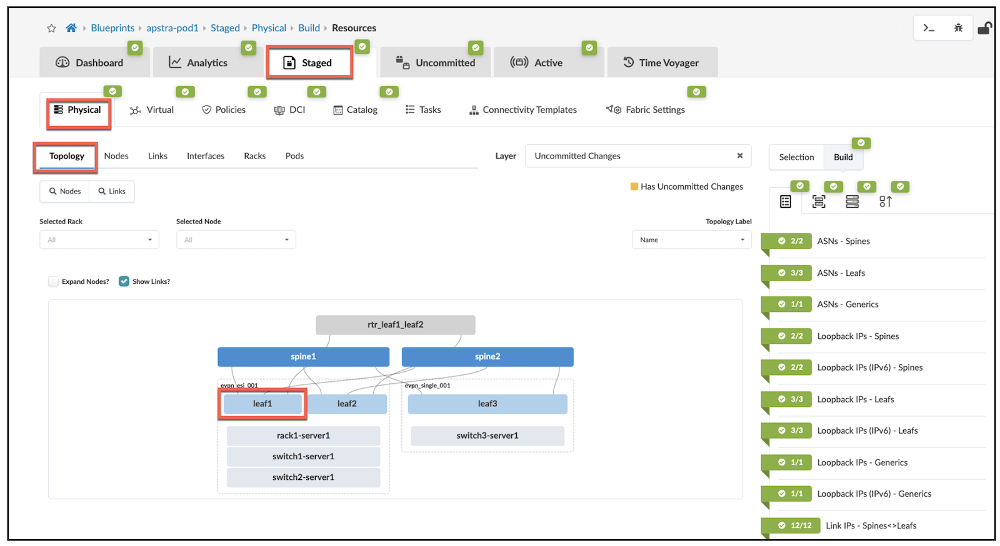

You are immediately placed in the **Staged > Physical >Topology** view. Here, we see our three-stage fabric devices and all the connections displayed. You can see there are already some servers attached in the racks. Click leaf1 because this is where we want the new generic system to connect.

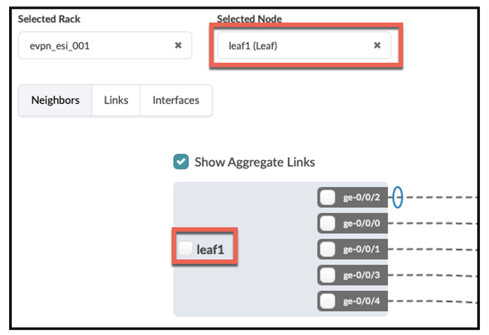

In this view, we see that there is a button on the device next to the device name.

Selecting this button reveals a menu of actions that can be performed to configure this switch. The Apstra Task-based Framework provides menu structures for editing in various parts of the User Interface. Select the item at the top of the list, Add internal/external generic system. This brings up the view where we begin specifying the details of the server we wish to add.

NOTE:

Select **internal** Generic System for this procedure. This type is displayed in the rack where it is attached, as a server would be. The **external** is used for devices that are gateways to other networks or connect to multiple racks. It is displayed outside of the topology.

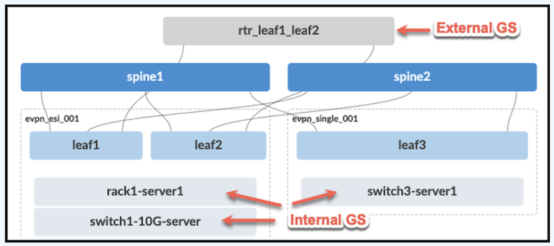

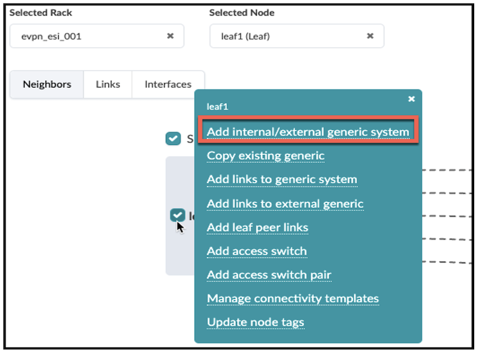

On the page that appears, we input the details of new generic system. Go with the default selection of **Internal** for Generic Type. Then add the Name and Hostname. And specify a **1X10G** Logical Device for the server.  Create a tag which you will find useful for many things when using this system, including locating objects. Once these entries are complete, clicking **Next** takes us to the port selection screen.

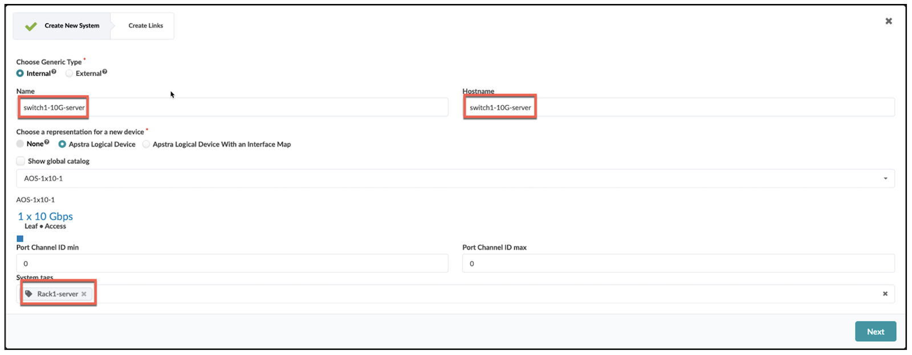

On this screen, we select the interface on leaf1 where the server attaches. It is port **ge-0/0/5** in this case. Then, we select 10G port-speed, which is one of the available transformations for this port. The transformations are specified in the **Interface Map** that was applied to this leaf switch in the **Design** phase. This operation creates a link object in addition to the server itself. Let's also give the link a tag of its own. Once you make a habit of using tags, you will be pleased with how useful they can be. The **Add Link** button in the center of this screen turns green, indicating that all the necessary details have been provided. Clicking **Add Link** stages our new generic system's link to leaf1, along with the details we have provided.

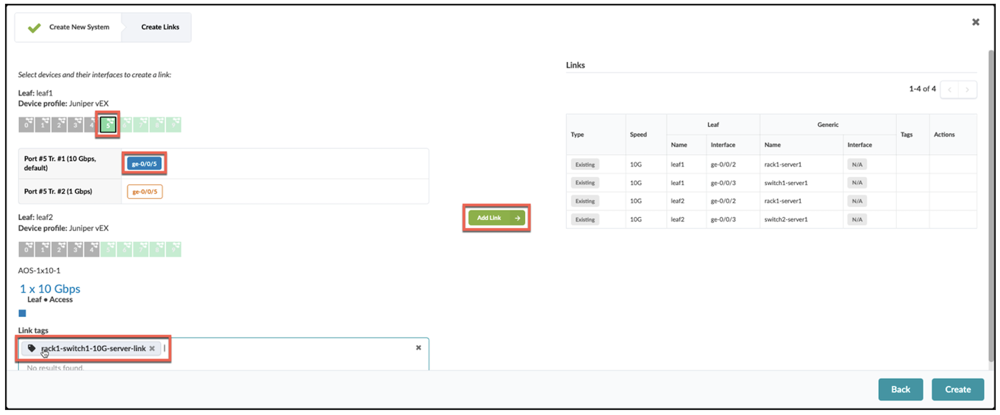

If all looks good, press the **Create** button to stage the additions and our view drops back to **Physical > Topology rack1_leaf1 **view.

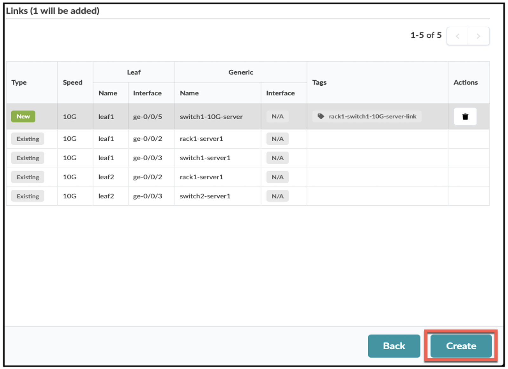

After returning to the rack_leaf view, you will notice that there is a new device linked to leaf1. This is the server we have defined. The state of our Blueprint currently shows the **Staged** tab having the generic system, while the **Active** tab doesn't yet.

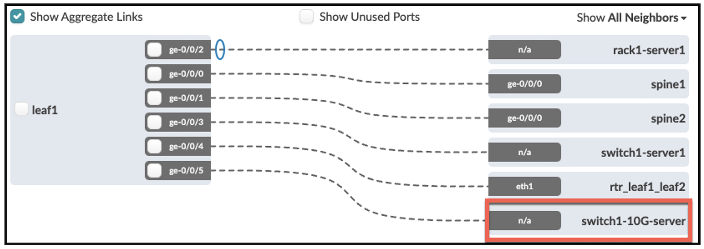

To the right of the current leaf view, we can locate the **Incremental Configuration** view. This takes us to the staged configuration view where we see the CLI settings that will be applied to ge-0/0/5. Apstra adds detailed descriptions to configurations that clearly identify the links. incremental configuration shows the results of the selections we have made in the Topology view, so far.

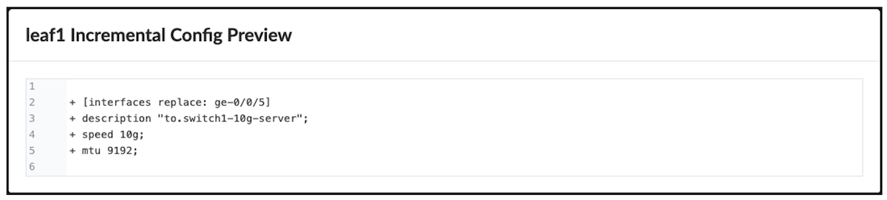

Click the **X** in the upper right to exit this view. Now choose the **Uncommitted** tab, it now has a yellow indicator:

All the changes we have staged thus far are shown. Explore this view to see more validations and details of what is staged, thus far.

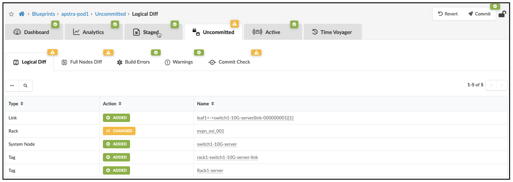

We have chosen the fundamental port settings, but we have not supplied everything necessary to bring our server online and communicating with the correct network. Let's move to the next step where we specify which virtual networks must traverse the server link.

### CT Assignment

The information needed to complete our link is defined in what is called a **Connectivity Template**. Although we will look closely at how CTs are created in another post, we are going to use an existing one to complete our server. Our goal is to assign the new link to the blue_300 overlay VXLAN.

To perform this step, we navigate to **Staged > Connectivity Templates > tab**. There, we find  catalog containing all existing CTs. Knowing that this CT contains our desired settings, choose **blue_300_vlan_tagged** and click the **Assign** icon.

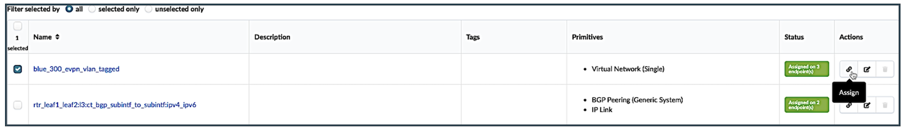

A table view opens showing all existing links where this CT could be applied. The table displayed only contains links that attach generic systems to leaf switches. The tags we created earlier stand-out and make the link we want easier to locate. Click the box to assign ge-0/0/5 to this CT.

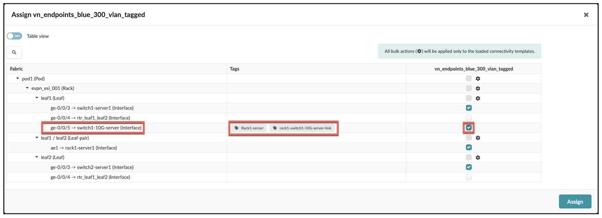

Apstra processes our selections as it places newly defined elements into the Staged graph model. The changes are validated, and the results are shown in the Uncommitted tab dashboard. Any problems found would be shown in the anomaly display. Green indicators for Build Errors and Warnings mean that there will be no problems with committing the changes.

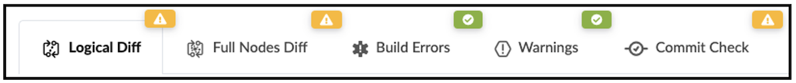

Apstra also instructed the device agents to calculate the appropriate NOS configurations needed by each affected device. We saw a glimpse of this work earlier when we able to view the incremental configuration staged for leaf1. We have queued some additional changes since then. So, let's look at the **Uncommitted** tab again and see anything new that has been added.

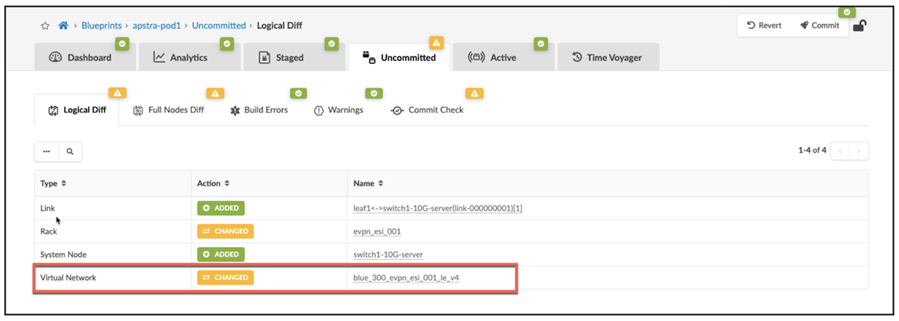

There is an additional entry representing the VN assignment that we made using the CT. Let's also check the Incremental config for leaf1.

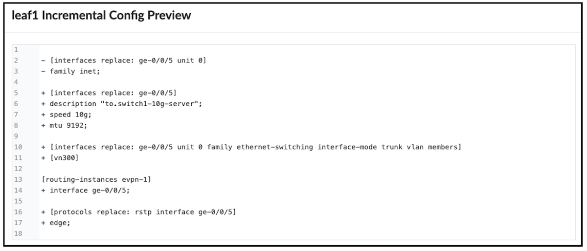

There is now additional configuration present that assigns the server port to the overlay/virtual network infrastructure. And since there are no errors present, we are free to complete the process of adding the server and all related parameters to the **Active** network. Press the **Commit** button in the upper right and enter descriptive notes related to this change. It is a good practice to add descriptions as changes are made to the Blueprint.

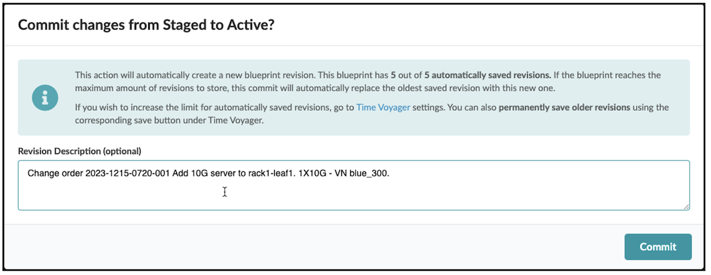

**Commit** instructs the device agents to send new configuration information to each device that is affected by the staged update. It is normal to see the Telemetry indications fluctuate, as devices adjust to their new state. After a moment, **Active** Topology view shows the new server operating in the fabric.  Click the new server and let's view some of the information about this device.

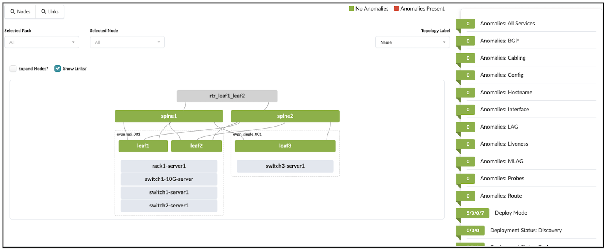

From the Topology view, click the server to review the available views. There is a lot of information regarding this endpoint that may aid in troubleshooting. The Neighbors tab illustrates the link details for each end. This is an example of our network documentation being kept automatically.

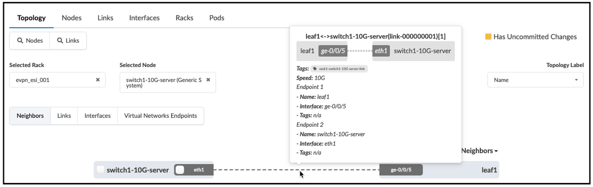

Selecting the **Virtual Network Endpoints** tab reveals the virtual network assignments for this link.  This is very useful when examining whether a needed VLAN is present for a particular device.

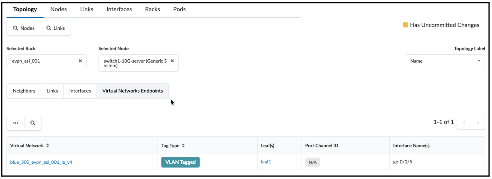

## Summary

The procedures illustrated in this post are among the most common Day 2 tasks. However, adding a server with a single link and only one virtual network assignment is simpler than most deployment scenarios. Devices that enable the numerous services found in data centers are typically attached with multiple links and complex protocol settings. Apstra manages this complexity by providing port and device level modeling. This makes managing Day 2 tasks astoundingly efficient and reliable.

## Glossary

- CT: Connectivity Template
- IM: Interface Map
- LD: Logical Device
- RT: Rack Type
- VN: virtual network
