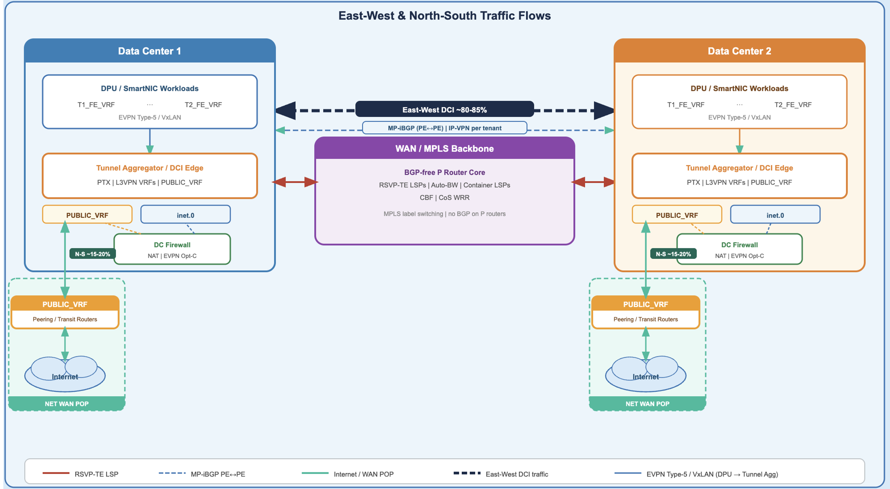
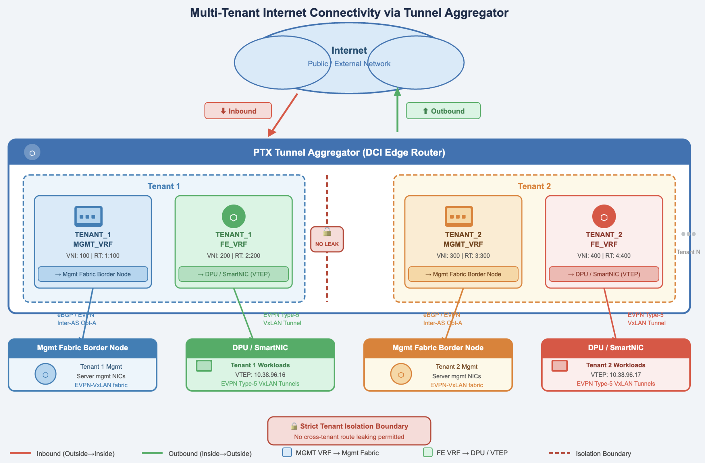
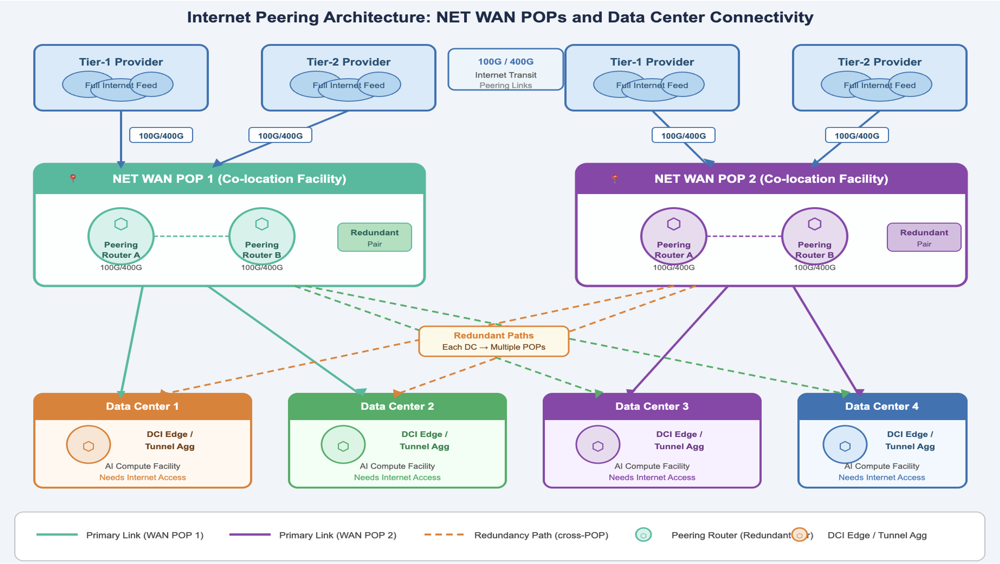
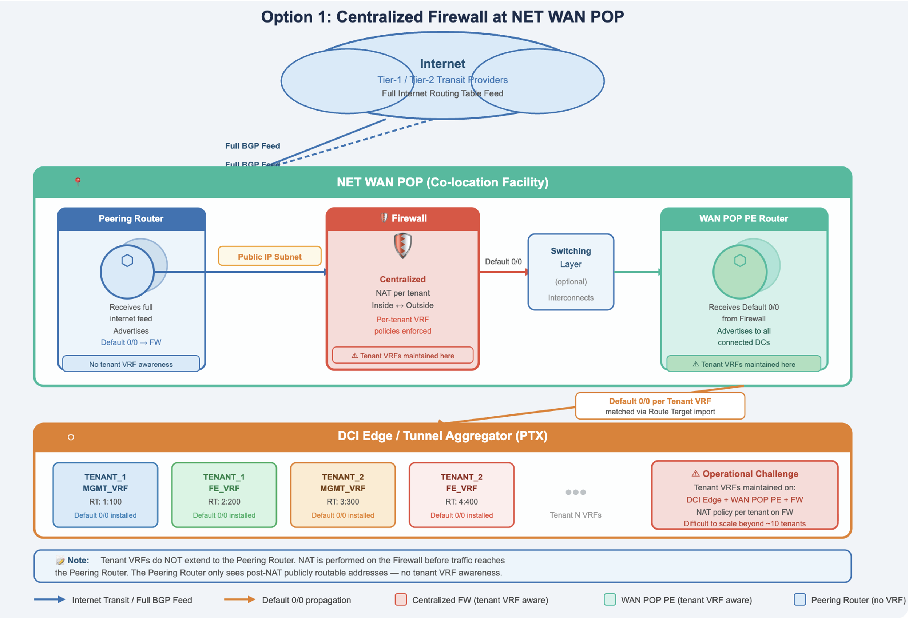
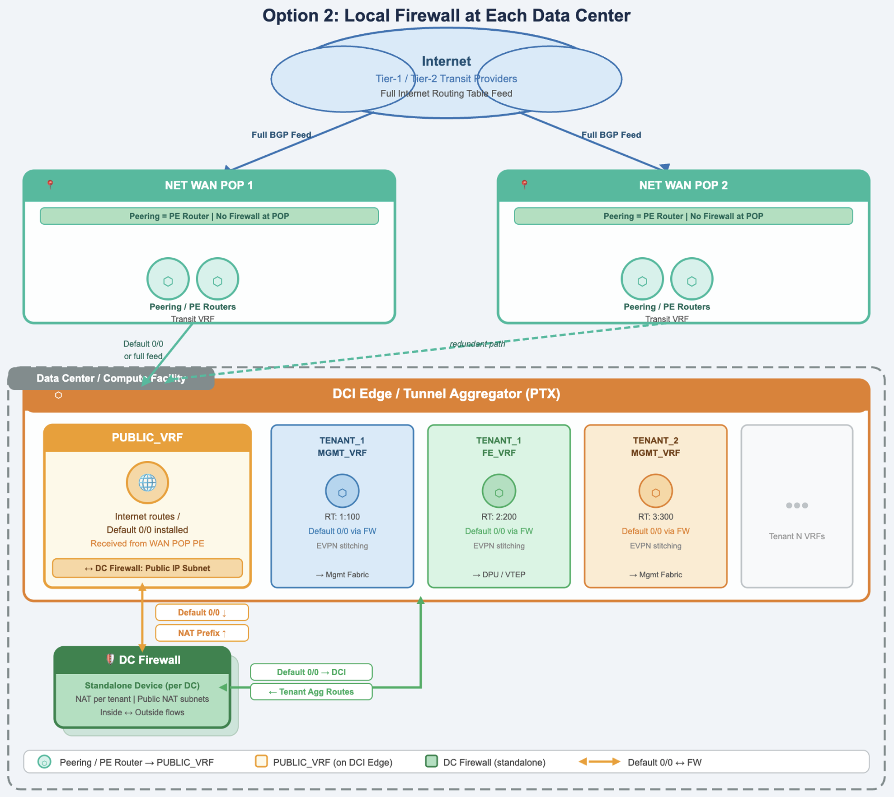
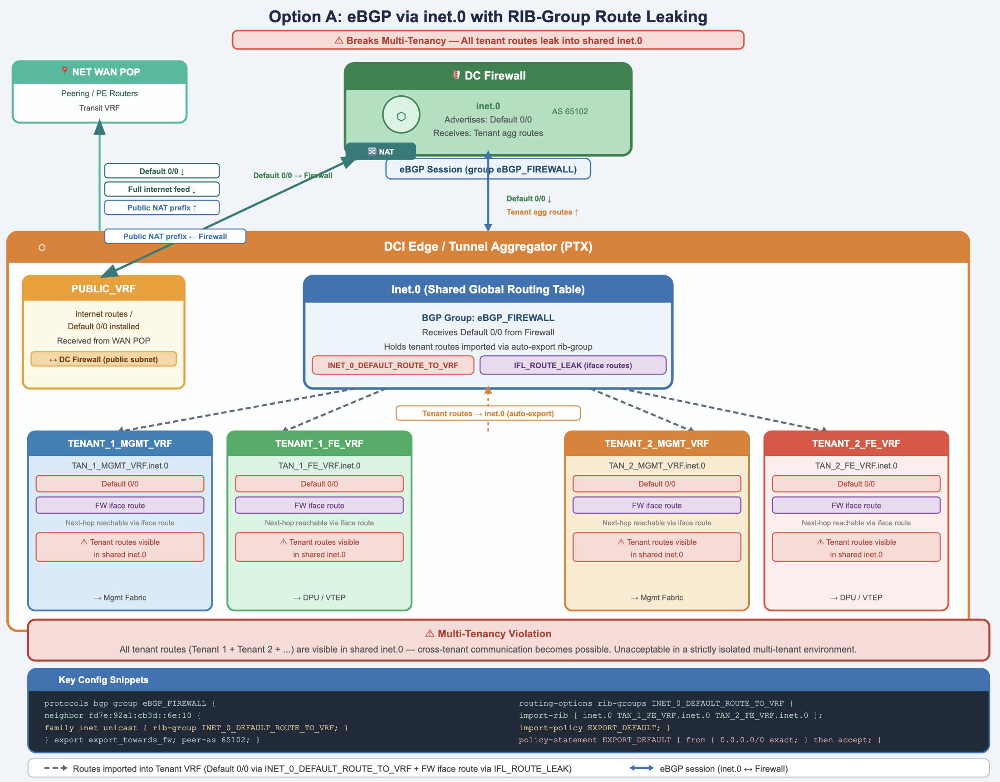
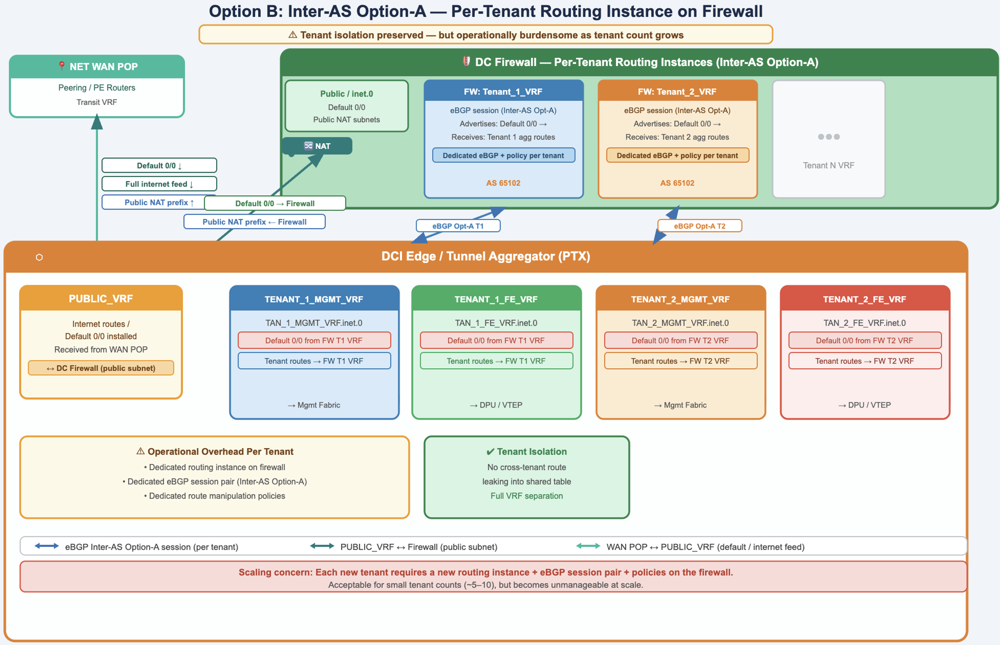
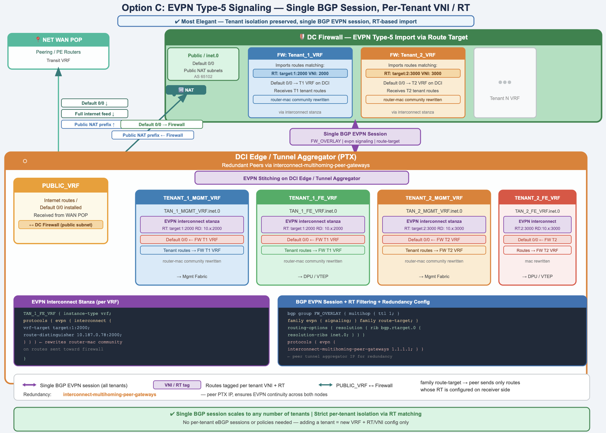
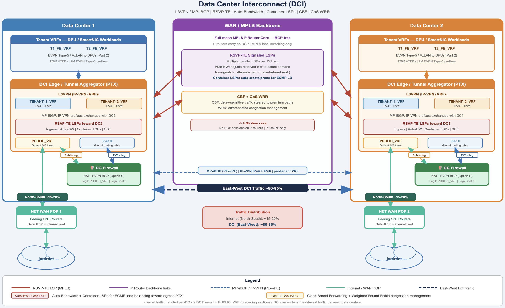

# DCI Edge for AI Front End Clusters with Juniper PTX

**Kashif Nawaz - 03/18/2026**

How Juniper PTX routers consolidate tunnel aggregation, DCI, and secure internet edge roles to simplify large-scale AI front-end networking. In this article, we will detail design choices and deployment considerations for using PTX at the DCI edge to provide scalable multi-tenant connectivity for thousands of DPU-based AI nodes.

## Introduction

In the [first part of this series](https://juniper.github.io/techposts/juniper-ptx-routers-in-front-end-network/article) was dedicated to architecture and implementation details to build large scale EVPN Type-5 tunnel aggregation solution using Juniper PTX Series Router. In last article of the series, we will detail the remaining parts of the solution, i.e.

- East-West Connectivity
- North Bound Connectivity

We will use different terms during the solution description, so let's agree at high-level what terms and definitions would be interchangeably used.

- **East-West Connectivity** will be used to describe cross data center flows which is also called Data Center Interconnect (DCI).
- **North Bound Connectivity** or North-South flows will be used to describe inbound/outbound internet and public access for tenant workloads.
- **Tunnel Aggregator** or DCI Edge Router are the same device i.e. Juniper PTX Routers.



As per our experience with different customers, majority (~ 80-85%) of overall traffic is East-West between data centers while ~15-20% traffic volumes belong to North-South flows. All these traffic flows, i.e. North-South and East-West, are routed/controlled via Juniper PTX based Tunnel Aggregator, reinforcing our notion of dual-role purpose that we explored in [Part 2.](https://juniper.github.io/techposts/juniper-ptx-routers-in-front-end-network/article)

## North-South Flows

In Tunnel Aggregator, multi-tenancy is implemented by provisioning 2 dedicated VRFs for each tenant: TENANT_X_MGMT_VRF and TENANT_X_FE_VRF where X denotes the tenant number/id. We have already discussed this dual VRF model in Part 2. Now in this blog, we are looking to provide public connectivity to tenant workloads (inbound and outbound) but we still need to maintain isolation between tenants in multi-tenancy environment.



TENANT workloads that have been assigned public IP addresses are much easier to get onto the Internet. Public IP addresses on tenant workloads are not the common case in enterprise environment. A Network Address Translation (NAT) functionality will be required:

- To translate public IP addresses into private IP addresses for inbound/ingress traffic flows
- To translate internal private IP addresses on the TENANT_X_FE_VRF and TENANT_X_MGMT_VRFs into public IP addresses for outbound/ egress traffic flows.

Regardless of whether the workloads are using public or private IP addresses on the tenant side, workloads VRF and management fabric VRF will always require a default route for North-South connectivity.

## Internet Peering Architecture

Enterprises relies on transit internet providers for a full internet feed. It is common practice to establish multiple transit peering connections for redundancy and throughput needs. With 100G and 400G link speeds now being the norm, these transit peering connections are terminated on dedicated enterprise internet peering routers.

Network WAN Points of Presence (NET WAN PoPs), typically housed in co-location facilities, are the ideal placement for internet peering routers where transit connections are terminated. Data centers and compute facilities that require internet access are then connected to the nearest NET WAN PoP. To ensure high availability and redundancy, each data center and compute facility maintains connectivity to multiple NET WAN PoPs: in case of failure, internet access is preserved without disruption.



## Security Considerations

The threats and attacks coming from the Internet have also to be walled out from the internal compute, storage and network infrastructure. It requires the deployment of network firewalls and other security paraphernalia like Distributed Denial of Service (DDoS) mitigation solutions. End-to-end security posture/solution against multi-faceted cyber threats is not in scope of this tech post.

However, we will thoroughly cover network firewall placement and selective traffic flows routing via network firewall as we need Network Address Translation (NAT) functionality for North-South flows.

Network firewall placement is a design choice where different scenarios have been considered:

- Firewall placement in NET WAN PoPs allows one firewall cluster to serve the entire geographical region, thus saving infrastructural cost.
- Firewall placement in each data center / compute facility provides better scalability and control.

Juniper SRX series is an industry leading firewall which offers carrier grade routing, with all required security features. To learn more about SRX security features, please visit our public [documentation](https://www.juniper.net/documentation/us/en/software/junos/security-policies/topics/topic-map/security-zone-configuration.html). It also supports [EVPN Type-5 signaling and VxLAN](https://juniper.github.io/techposts/srx-evpnvxlan-t5-oipsec/article) forwarding which is an important construct for firewall integration with DCI edge router (to be discussed in the upcoming section).

Besides securing network perimeter and compute facilities using network firewalls and DDoS mitigation, MACSec is an important feature for securing data transportation in both directions (East-West and North-South flows). To learn about MACSec implementation in Junos/EVO, we invite you to check the public [documentation](https://www.juniper.net/documentation/us/en/software/junos/security-services/topics/task/macsec.html).

## Option 1: Centralized Firewall Placement at NET WAN PoP

The firewall is deployed in the regional NET WAN PoP where Internet transit peering is terminated over a peering router directly connected to the firewall. The connection between the peering router and the firewall uses public IP space. The firewall connects to the Provider Edge routers in the WAN PoP, with the possibility of inserting the switching layer within the WAN PoP for between-tiers connectivity.

- The peering router gets the full internet routing table from the transit providers and advertises a default route to the firewall.
- The firewall propagates this default route to the WAN PoP PE routers which advertise it to all the data centers and compute facilities that it peers with.
- The default route is received on the DCI edge routers and each VRF, namely TENANT_X_FE_VRF, and TENANT_X_MGMT_VRF gets the route by matching the import, Route Target.



While this architecture provides advantage by reducing cost, maintaining strict multi-tenancy at scale in this model is problematic. Hence, NAT function is performed in regional NET WAN PoP firewall. Keeping all the tenant VRFs mapped and managed uniformly across DCI edge router, WAN PoP PE and WAN PoP firewall is an administratively burdensome task.

## Option 2: Local Firewall Placement at Each Data Center

The most practical option for large-scale multi-tenant environments is to position a dedicated firewall in each data center / compute facility. This greatly simplifies the NET WAN PoP architecture. Rather than having multiple network layers in the WAN PoP, internet peering routers can also act as the NET WAN PoP PE routers.

The WAN NET PoP PE and peering router terminate all Internet Transit Peering connections within a dedicated VRF (PUBLIC_VRF) and advertises either the full Internet routing table or just the default route to each Datacenter / Compute Facility.

We will use the term Data Center (DC) Firewall in subsequent paragraphs to refer to this design approach.



On the DCI edge router, it is generally recommended to have a PUBLIC_VRF where default route internet feed coming from the WAN POP PE will be received.

The PUBLIC_VRF has direct connectivity to the data center firewall. The link between the DCI edge PUBLIC_VRF and data center firewall will be on a public routable IP subnet. The firewall will have public routable subnets for the NAT, that can be used for the inside to outside traffic, as well as the outside to inside traffic for every tenant. Covering details of different types of NAT is not in scope of this post.

The data center firewall advertises the public routable (NAT) prefix to the PUBLIC_VRF in the DCI edge router, and the PUBLIC_VRF on the DCI edge router advertises the 0.0.0.0/0 default route back to the firewall.

## Connecting Tenant VRFs to the DC Firewall

Having established the PUBLIC_VRF design on the DCI edge router and the role of the DC Firewall, it is now important to discuss how individual tenant VRFs on the DCI edge router and tunnel aggregator are connected to the firewall. Several options are available for this connectivity.

- **Option-1**: Using a single eBGP Session between DC Firewall and DCI Edge router in inet.0 routing table and route leaking from and to tenant VRFs inside DCI Edge Router.
- **Option-2**: Multiple eBGP sessions between DC Firewall and DCI Edge router, one per tenant.
- **Option-3**: Using a single eBGP Session (EVPN signaling) to exchange EVPN Type-5 routes between DC Firewall and DCI Edge router.

### Option-1

This option requires an eBGP session from DC firewall and DCI edge in the inet.0 routing table and advertising a default route 0.0.0.0/0 from the DC firewall towards DCI edge router.



In the tunnel aggregator, each tenant prefixes are required to be leaked from tenant VRF to the inet.0 and then further redistribution towards DC Firewall over eBGP session. Furthermore, default route 0/0 received from DC Firewall is required to leak into each tenant along with interface route (connecting DCI Edge router and DC Firewall). Auto-Export RIB-Group (import-rib) along with the import-policy are very useful constructs for this route leaking.

However, this method breaks multi-tenancy as all tenant routes are leaked to inet.0 (default routing table) and then to firewall over same eBGP session, there is possibility that tenant can reach each other workloads. This is a major issue in a multi-tenant environment that requires complete isolation.

### Option-2

This option maintains multi-tenancy by having a separate routing instance on the DC firewall for each tenant, and then Inter-AS Option-A between each tenant routing instance on the DC firewall and each corresponding tenant VRF on the DCI edge router. This provides isolation for each tenant, but a tremendous amount of administration. Each tenant would get IP connectivity between DC firewall and the DCI edge router and then separate eBGP sessions for the Inter-AS Option-A handoff. This would be administratively quite complex as tenant numbers grow.



### Option-3

The third option is the most elegant, where routes between DC Firewall and DCI Edge router are exchanged over single eBGP session using EVPN signaling.



Tenant VRFs routes are advertised from tunnel aggregator towards firewall over single BGP sessions as EVPN Type-5 routes. These routes carry the necessary VNI and Route Target per tenant as BGP communities. Some additional config is needed on each router in the VRF via the protocol **evpn** interconnect stanza. This config will replace the router-mac community of routes received from DPUs with the tunnel aggregator router-mac while sending those routes towards firewall.

All config and outputs presented in this section are validated in PTX-10001-36MR running Junos 25.2R1-S2.3-EVO.

```
TAN_1_FE_VRF {
    instance-type vrf;
    protocols {
        evpn {
            interconnect {
                vrf-target target:1:2000;
                route-distinguisher 10.20.0.78:2000;
```

Firewall will import routes to the desired tenant routing instance by matching the Route Target and thus maintaining strict per-tenant isolation and without requiring separate BGP sessions per tenant.

We have also added family route-target in BGP config between Firewall and Tunnel Aggregator which ensures that opposite peer will send only those routes whose route-target is already configured on receiver side thus controlling un-necessary control plane route flooding.

```
bgp {
group FW_OVERLAY {
        multihop {
            ttl 1;
        }
        family evpn {
            signaling;
        }
        family route-target;

routing-options {
    resolution {
        rib bgp.rtarget.0 {
            resolution-ribs inet.0;
        }
    }
```

Hence, there will be more than one tunnel aggregator which requires the following config to be added in each tunnel aggregator.

```
protocols {
evpn {
        interconnect-multihoming-peer-gateways x.x.x.x;
    }
```

Let's verify some control plane exchanges. First, we will verify the EVPN Type-5 route sent by a DPU hosted (virtual router) is received and installed into a tenant VRF, on the tunnel aggregator. We can see that an EVPN Type-5 prefix is received and installed, and it has **router-mac:9c:5a:80:30:d6:66** community attached to it.

```
DUT>  show bgp summary group tan_overlay 

Peer                     AS      InPkt     OutPkt    OutQ   Flaps Last Up/Dwn State|#Active/Received/Accepted/Damped...
10.38.96.16           65101      27407      27038       0       0 1w1d 15:39:32 Establ
  bgp.evpn.0: 2/2/2/0
  TAN_1_FE_VRF.evpn.0: 2/2/2/0
  TAN_1_MGMT_VRF.evpn.0: 2/2/2/0
10.187.0.76           65103      13092      12906       0       0  4d 3:09:26 Establ
  bgp.evpn.0: 2/2/2/0
  TAN_2_FE_VRF.evpn.0: 2/2/2/0

DUT> show route receive-protocol bgp 10.38.96.16 table TAN_1_FE_VRF.evpn.0 

TAN_1_FE_VRF.evpn.0: 7 destinations, 7 routes (7 active, 0 holddown, 0 hidden)
  Prefix                  Nexthop              MED     Lclpref    AS path
  5:10.38.96.16:200::0::192.168.254.3::32/248                   
*                         10.38.96.16                             65101 65006 I
  5:10.38.96.16:200::0::2001::100::128/248                   
*                         10.38.96.16                             65101 65006 I

DUT> show route receive-protocol bgp 10.38.96.16 table TAN_1_FE_VRF.evpn.0 match-prefix 5:10.38.96.16:200::0::192.168.254.3::32/248 extensive

TAN_1_FE_VRF.evpn.0: 7 destinations, 7 routes (7 active, 0 holddown, 0 hidden)
* 5:10.38.96.16:200::0::192.168.254.3::32/248 (1 entry, 1 announced)
     Import Accepted
     Route Distinguisher: 10.38.96.16:200
     Route Label: 200
     Overlay gateway address: 0.0.0.0
     Nexthop: 10.38.96.16
     AS path: 65101 65006 I 
     Communities: target:2:200 encapsulation:vxlan(0x8) router-mac:9c:5a:80:30:d6:66
```

Now let's verify same route is sent to DC Firewall as the EVPN Type-5 route while the tunnel aggregator has replaced router-mac community **i.e router-mac:9c:5a:80:30:a9:66** which is different than router-mac community received from DPU hosted software router.

```
DUT> show bgp summary group FW_OVERLAY 

Peer                     AS      InPkt     OutPkt    OutQ   Flaps Last Up/Dwn State|#Active/Received/Accepted/Damped...
10.38.96.18           65102       2073       2027       0       1    15:35:07 Establ
  bgp.rtarget.0: 2/2/2/0
  bgp.evpn.0: 2/2/2/0
  TAN_1_FE_VRF.evpn.0: 2/2/2/0
  TAN_1_MGMT_VRF.evpn.0: 1/1/1/0

DUT> show route advertising-protocol bgp 10.38.96.18 table TAN_1_FE_VRF.evpn.0 match-prefix 5:10.187.0.78:2000::0::192.168.254.3::32/248 extensive 

TAN_1_FE_VRF.evpn.0: 7 destinations, 7 routes (7 active, 0 holddown, 0 hidden)
* 5:10.187.0.78:2000::0::192.168.254.3::32/248 (1 entry, 1 announced)
 BGP group FW_OVERLAY type External
     Route Distinguisher: 10.20.0.78:2000
     Route Label: 200
     Overlay gateway address: 0.0.0.0
     Nexthop: Self
     Flags: Nexthop Change
     AS path: [64980] 65101 65006 I 
     Communities: 65000:201 target:1:2000 encapsulation:vxlan(0x8) router-mac:9c:5a:80:30:a9:66
```

## East-West Flows (DCI)

So far, we have discussed North-South traffic and different options for DC firewall integration with DCI edge router. This section will focus on East-West traffic, i.e. Data Center Interconnect (DCI).

There are many choices for signaling and transport protocols for DCI. The choices range from L3VPN with RSVP-TE based traffic engineering and MPLS forwarding to EVPN stitching between data center sites with MPLS or VXLAN forwarding, and some customers have adopted SRv6 as well. Here, we will look at the L3VPN architecture which uses MP-iBGP for routing information exchange (IP-VPN IPv4 and IPv6 prefixes) while RSVP-TE is used for LSP signaling with MPLS label-based forwarding.



A key capability enabled in this design is **auto-bandwidth adjustment** which allows LSPs to dynamically adjust their reserved bandwidth based on actual traffic demand. When the required bandwidth is unavailable on the current path, the LSP is re-signaled to an alternate path where sufficient capacity exists, and traffic is shifted in a make-before-break fashion to ensure no packet loss during the transition.

Complementing auto-bandwidth, Container LSPs automate the creation and pruning of LSPs based on real-time traffic needs. This gives the ingress router enough parallel LSPs to perform equal-cost multipath (ECMP) load balancing toward an egress router, maximizing utilization of available capacity across all paths. In addition to bandwidth management and traffic engineering (TE), two additional features can be incorporated to further enhance TE posture.

- **Class-Based Forwarding** (CBF) to segregate delay-sensitive traffic and send it over premium-grade paths.
- **Class of Service** (CoS) with Weighted Round Robin (WRR) for congestion management during peak utilization of the links.

All these topics require a complete book to cover all the theoretical base and implementation details. Fortunately, I have written 5 detailed articles on each of these topics.

- [Large Enterprises WAN Landscape in AI Era](https://juniper.github.io/techposts/large-enterprises-wan-landscape-in-ai-era/article)
- [Adaptive Resource Control in TE Networks](https://juniper.github.io/techposts/adaptive-resource-control-in-te-networks/article)
- [Adaptive Resource Control with Container LSPs](https://juniper.github.io/techposts/adaptive-resource-control-with-container-lsps/article)
- [Wholistic Design Approach for MPLS Backbone CoS](https://juniper.github.io/techposts/wholistic-design-approach-for-mpls-backbone-cos/article)
- [Class-Based Forwarding over RSVP LSPs Design](https://juniper.github.io/techposts/class-based-forwarding-over-rsvp-lsps-design/article)

## Resiliency and Redundancy

Relying only on physical layer resiliency and redundancy is not enough to design carrier grade DCI / North Bound connectivity. Routing infrastructure resiliency and redundancy within single DCI / tunnel aggregator device is also crucial. Having resilient and redundant routing infrastructure inside each DCI / tunnel aggregator device will ensure that any catastrophic event should not disrupt ongoing traffic flows, or disruption should be minimal if at all unavoidable.

Before going into implementation details and verification, let's understand one important concept. Junos/ EVO assigns relative weight to each Next-hop (NH) while installing it in Forwarding Information Base (FIB) and any NH's assigned weight will decide if it is available for active traffic forwarding. Some of the NH used by Junos/EVO are described below:

- **Weight 0x1**: It depicts primary NH and will be used for active forwarding.
- **Weight 0x4000**: It depicts a backup path and will be used once primary NH fails.
- **Weight 0x8001**: It depicts bypass LSP NH and will be used for active forwarding if primary fails.

All config and outputs presented in this section are validated in PTX-10001-36MR running Junos 23.4R2-S5.4-EVO.

## East-West Flows

If multiple egress PEs are available then East-West flows should be sent towards all egress PE to optimize the inter-DC links utilization. On a standard DCI (MPLS backbone) setup, many remote PE routers may advertise the same prefix. In this case, BGP route resolution (Junos feature) uses the IGP metric to the protocol next hop (which is the remote PE loopback) as a tiebreaker to choose one PE over the others. What ends up happening is that only one PE is chosen as the active next hop with the lowest IGP cost, and all other next hops for the same prefix remain in the RIB and are not used or programmed into the FIB.

```
State: <Secondary NotBest Int Ext ProtectionCand>
                Inactive reason: Not Best in its group - IGP metric
```

Even if multipath is enabled at VRF level, if IGP metrics to the remote PE loopbacks are not equal, the stricter path selection rules will cause the higher metric PEs to be completely excluded from the forwarding table, leaving the real inter-DC bandwidth unused and failover dependent on BGP reconvergence. Adding **vpn-unequal-cost** to the tenant VRF routing options overrides this behavior.

```
  routing-instances
              abc  {
                   routing-options {
                            multipath {
                                 vpn-unequal-cost;
```

The above configuration enables protocol independent load balancing for L3 VPN and once enabled, ingress PE router can receive and install routes from multiple remote PEs into RIB and FIB regardless of the IGP metric associated with the remote PE's loopback address. A routing policy with a load-balance per-flow knob needs to be applied under a forwarding table as well.

```
policy-statement ecmp {
        then {
            load-balance per-flow;
        }
    }
routing-options {
    
    forwarding-table {
        export ecmp;
    }
}
```

Traffic flows from ingress PE to multiple egress PEs will be load balanced across all unequal cost multipaths (ECMPs) regardless of the differences in IGP metric to remote PE. This provides full utilization of all DCI bandwidth under normal conditions and enables much faster convergence in the event of a PE or LSP failure, since the pre-computed multiple NHs are already installed in the FIB.

In the below snippet, we can see that a prefix 172.172.0.0/16 is installed with multiple active next-hops.

- DC1-PE1-DC2-PE-1-CONTAINER-1, Protocol Next-Hop 10.10.28.85 (**metric 210**)
- DC1-PE1-DC2-PE-2-CONTAINER-1, Protocol Next-Hop 10.10.0.78 (**metric 2100**)

It is because, vpn-unequal-cost is configured under multipath inside VRF which ignores the IGP metrics of remote PEs loopback address (resolver address) and installs all unequal cost routes in RIB and FIB. Traffic will be load balanced over thiese next-hops.

```
DUT> show route 172.172.0.0/16  exact

mgmt_junos.inet.0: 3 destinations, 3 routes (3 active, 0 holddown, 0 hidden)
+ = Active Route, - = Last Active, * = Both

0.0.0.0/0          *[Static/5] 18w2d 13:10:49
                    >  to 10.8.207.254 via re0:mgmt-0.0

prod.inet.0: 11 destinations, 18 routes (11 active, 0 holddown, 0 hidden)
+ = Active Route, - = Last Active, * = Both

172.172.0.0/16 @[BGP/170] 00:15:21, localpref 100, from 10.10.28.85
                              AS path: I, validation-state: unverified
                              >  to 10.10.10.32 via et-0/0/9.0, label-switched-path DC1-PE1-DC2-PE-1-CONTAINER-1
                              to 10.10.10.108 via et-0/1/4.0, label-switched-path Bypass->10.10.10.32->10.10.10.35
                              [BGP/170] 00:43:01, localpref 100, from 10.10.0.78
                               AS path: I, validation-state: unverified
                               >  to 10.10.10.0 via et-0/0/0.0, Push 233, Push 11604(top)
                               to 10.10.10.32 via et-0/0/9.0, Push 233, Push 14035(top)
                               #[Multipath/255] 00:15:21, metric2 210
                               >  to 10.10.10.32 via et-0/0/9.0, label-switched-path DC1-PE1-DC2-PE2-CONTAINER-1
                               to 10.10.10.108 via et-0/1/4.0, label-switched-path Bypass->10.10.10.32->10.10.10.35
                               to 10.10.10.0 via et-0/0/0.0, label-switched-path DC1-WAN-POP2-CONTAINER-1
                               to 10.10.10.32 via et-0/0/9.0, label-switched-path Bypass->10.10.10.0->10.10.10.117

DUT> show route 172.172.0.0/16  table TAN_1_FE_VRF.inet.0 protocol multipath                                           
 
prod.inet.0: 11 destinations, 18 routes (11 active, 0 holddown, 0 hidden)
@ = Routing Use Only, # = Forwarding Use Only
+ = Active Route, - = Last Active, * = Both
 
172.172.0.0/16    #[Multipath/255] 1d 01:37:49, metric2 210
                            >  to 10.10.10.32 via et-0/0/9.0, label-switched-path DC1-PE1-DC2-PE2-CONTAINER-1
                            to 10.10.10.108 via et-0/1/4.0, label-switched-path Bypass->10.10.10.32->10.10.10.35
                            to 10.10.10.0 via et-0/0/0.0, label-switched-path s DC1-PE1-DC2-PE2-CONTAINER-2
                            to 10.10.10.32 via et-0/0/9.0, label-switched-path Bypass->10.10.10.0->10.10.10.117
DUT> show route 172.172.0.0/16  table TAN_1_FE_VRF.inet.0 protocol multipath extensive | match "Protocol next hop:"    
                    Protocol next hop: 10.10.28.85
                    Protocol next hop: 10.10.0.78

DUT>  show route 10.10.28.85 table inet.0                                                           
 
inet.0: 61 destinations, 61 routes (59 active, 0 holddown, 2 hidden)
+ = Active Route, - = Last Active, * = Both
 
10.10.28.85/32     *[IS-IS/18] 1d 19:02:11, metric 210
                             >  to 10.10.10.32 via et-0/0/9.0
 
DUT> show route 10.10.0.78 table inet.0    
 
inet.0: 61 destinations, 61 routes (59 active, 0 holddown, 2 hidden)
+ = Active Route, - = Last Active, * = Both
 
10.10.0.78/32     *[IS-IS/18] 2w2d 06:45:09, metric 2100
                       to 10.10.10.108 via et-0/1/4.0
                        >  to 10.10.10.0 via et-0/0/0.0
```

In forwarding plane, a unilist (**ulst**) next-hop (NH) with index 8586 is created which consists of 2 composite NHs, each pointing to one of the remote PE via an indirect (**indr**) NH. In Junos/EVO, unlist NH is used for traffic load balancing purposes. To read more about different next-hop types, please read [the blog here](https://juniper.github.io/techposts/mastering-bgp-pic-on-junos/article).

```
DUT>  show route forwarding-table destination 172.172.0.0/16  vpn TAN_1_FE_VRF    
Routing table: TAN_1_FE_VRF
Internet:
Destination        Type RtRef Next hop           Type Index    NhRef Netif
default            user     0           ulst     8586     1
                                                comp     8584     1
                                                indr     8582     1
                                                ulst     8602     1
                                                sftw Push 15709     8577     1 et-0/0/9.0
                    10.10.10.32         ucst     1003     1 et-0/0/9.0
                                                sftw Push 24344, Push 9702(top)     8601     1 et-0/1/4.0
                   10.10.10.108       ucst     1000     1 et-0/1/4.0
                                               comp     8585     1
                                                indr     8583     1
                                                ulst     8578     1
                                                sftw Push 11604     8544     1 et-0/0/0.0
                      10.10.10.0         ucst     1001     1 et-0/0/0.0
                                                sftw Push 14035     8576     1 et-0/0/9.0
                     10.10.10.32        ucst     1003     1 et-0/0/9.0
```

We can see "Weight: 0x1" is assigned to two NHs and those are LSPs (DC1-PE1-DC2-PE-1-CONTAINER-1 and DC1-PE1-DC2-PE-2-CONTAINER-1) where "Weight: 0x8001" corresponds to by-pass LSP for each primary LSP.

```
DUT> show route forwarding-table destination 172.172.0.0/16  vpn TAN_1_FE_VRF | match weight   
                                    Weight: 0x0   Balance: 0    
  Next-hop interface: et-0/0/9.0    Weight: 0x1   Balance: 0    
  Next-hop interface: et-0/1/4.0    Weight: 0x8001 Balance: 0    
                                    Weight: 0x0   Balance: 0    
  Next-hop interface: et-0/0/0.0    Weight: 0x1   Balance: 0    
  Next-hop interface: et-0/0/9.0    Weight: 0x8001 Balance: 0    
```

## North-South Flows

Hence, default route and internet feed would be received from multiple NET WAN PoPs, and it's quite possible that due to geographical placement, one WAN PoP offer lower latency as compared to other WAN PoPs. In such a scenario, **Unequal Cost Multipath load balancing should be avoided**, and internet bound traffic flows should only traverse via primary WAN PoP which offers lowest latency. However, for sake of redundancy, secondary WAN PoP internet feed / default route should be installed in RIB and FIB and should be readily available for traffic forwarding in case connectivity with primary WAN PoP goes down.

As discussed above, by default, routes with lowest IGP metrics will be installed in RIB and FIB as active routes and routes with the next higher IGP metric will be inactive in RIB with the following message.

```
State: <Secondary NotBest Int Ext ProtectionCand>
                Inactive reason: Not Best in its group - IGP metric
```

We can put more control on selecting which NET WAN PoP should be the most preferable exit point towards the internet. We can assign different local-preferences to each internet feed / default route that is received on DCI Edge router (PUBLIC_VRF) using a vrf-import policy and install different preference routes in the PUBLIC_VRF RIB. Only routes with the highest local preference will be installed in FIB and thus will be used for traffic forwarding. Other routes will be inactive state (inside RIB) with the following message.

```
State: <Secondary Int Ext ProtectionCand>
                Inactive reason: Local Preference
```

## BGP Prefix-Independent Convergence (PIC)

As discussed above, for North-Bound connectivity we don't require unequal cost multipath load balancing but for sake of resiliency and redundancy backup paths should be available in RIB and FIB so that if primary path fails then backup path automatically take over traffic with minimal convergence time.

BGP Prefix-Independent Convergence (PIC) feature allows the computation and installation of backup paths in RIB and FIB with higher weight. These higher weight NHs (**Weight: 0x4000**) will not be used for active forwarding until lower weight, or primary NHs (**Weight: 0x1**) are available for traffic forwarding. But as soon as primary NHs go down due to any reason, the higher weight NHs will become new primary NH.

To learn more about BGP PIC, [please read this blog](https://juniper.github.io/techposts/mastering-bgp-pic-on-junos/article).

```
routing-instances { 
PUBLIC_VRF
instance-type vrf;
        { 
      routing-options { 
             protect core;
```

Let's verify the above-described behavior with some outputs.

We can see that default route 0/0 is received and installed in PUBLIC_VRF and multipath is enabled. And it is achieved without adding "multipath vpn-unequal-cost" config.

```
DUT> show route 0/0 exact table PUBLIC_VRF 

prod.inet.0: 11 destinations, 22 routes (11 active, 0 holddown, 0 hidden)
+ = Active Route, - = Last Active, * = Both

0.0.0.0/0     @[BGP/170] 00:32:05, localpref 100, from 10.10.28.85
                         AS path: I, validation-state: unverified
                         >  to 10.10.10.32 via et-0/0/9.0, label-switched-path DC1-WAN-POP1-CONTAINER-1
                          to 10.10.10.108 via et-0/1/4.0, label-switched-path Bypass->10.10.10.32->10.10.10.35
                         [BGP/170] 00:32:05, localpref 100, from 10.10.0.78
                         AS path: I, validation-state: unverified
                         >  to 10.10.10.0 via et-0/0/0.0, Push 233, Push 11604(top)
                         to 10.10.10.32 via et-0/0/9.0, Push 233, Push 14035(top)
                         #[Multipath/255] 00:32:05, metric2 210
                         >  to 10.10.10.32 via et-0/0/9.0, label-switched-path DC1-WAN-POP1-CONTAINER-1
                         to 10.10.10.108 via et-0/1/4.0, label-switched-path Bypass->10.10.10.32->10.10.10.35
                         to 10.10.10.0 via et-0/0/0.0, label-switched-path DC1-WAN-POP2-CONTAINER-1
                         to 10.10.10.32 via et-0/0/9.0, label-switched-path Bypass->10.10.10.0->10.10.10.117
```

In the FIB, we can see that a **ulst NH** with index 8605 is created but it further explores weight of each NHs. We can see that one NH hop has **0x4000** weight. As described above NH with weight 0x4000 is backup NH installed in FIB and will be used actively for traffic flows only if primary NH (Weight: **0x1**) fails due to any reason.

```
DUT> show route forwarding-table destination 0/0 vpn PUBLIC_VRF
Routing table: prod.inet
Internet:
Destination        Type RtRef Next hop           Type Index    NhRef Netif
default            user     0          ulst     8605     1
                                               comp     8590     1
                                               indr     8587     1
                                               ulst     8602     1
                                               sftw Push 15709     8577     1 et-0/0/9.0
                     10.10.10.32       ucst     1003     1 et-0/0/9.0
                                               sftw Push 24344, Push 9702(top)     8601     1 et-0/1/4.0
                    10.10.10.108      ucst     1000     1 et-0/1/4.0
                                               comp     8604     1
                                               indr     8594     1
                                               ulst     8578     1
                                               sftw Push 11604     8544     1 et-0/0/0.0
                      10.10.10.0        ucst     1001     1 et-0/0/0.0
                                                sftw Push 14035     8576     1 et-0/0/9.0
                    10.10.10.32        ucst     1003     1 et-0/0/9.0

DUT> show route forwarding-table destination 0/0 vpn PUBLIC_VRF extensive | grep Weight:       
                                    Weight: 0x1   Balance: 0    
  Next-hop interface: et-0/0/9.0    Weight: 0x1   Balance: 0    
  Next-hop interface: et-0/1/4.0    Weight: 0x8001 Balance: 0    
                                    Weight: 0x4000 Balance: 0    
  Next-hop interface: et-0/0/0.0    Weight: 0x1   Balance: 0    
  Next-hop interface: et-0/0/9.0    Weight: 0x8001 Balance: 0
```

In case LSP to primary NET WAN PoP does down since the pre-computed backup path is already present in the FIB and so no update from RPD is required to route traffic over previously backup path which is a newer active path. This enables faster convergence during failover scenarios.

## Recommendation

Using unequal cost multipath load balancing vs BGP PIC will be a design choice for a particular network, and it's driven by specific needs. In case same prefix is being received from multiple egress PEs over unequal cost (IGP metric) but for better utilization of backbone capacity, egress traffic load balancing is required over unequal cost multipaths then "**vpn-unequal-cost**" must be configured.

If **vpn-unequal-cost** config is not applied due to design choice but multiple exit paths from ingress PE to Egress PEs exist, then "protect core" must be applied.

## Conclusion

In this tech post we have elaborated different design choices for North-South and East-West connectivity. We have also described the need for resiliency and redundancy for routing infrastructure within a DCI Edge router and how to achieve optimal convergence during catastrophic events. In my next blog, I will explore SRv6 for overlay tunneling between DPU hosted software routers and tunnel Aggregator.

## Useful Links

- Intro - Overlay Networking in AI Era: [https://juniper.github.io/techposts/overlay-networking-in-ai-era/article](https://juniper.github.io/techposts/overlay-networking-in-ai-era/article)
- Part2 - Juniper PTX Routers in Front-End Network: [https://juniper.github.io/techposts/juniper-ptx-routers-in-front-end-network/article](https://juniper.github.io/techposts/juniper-ptx-routers-in-front-end-network/article)
- Part3 - DCI Edge for AI Front End Clusters with Juniper PTX: [https://juniper.github.io/techposts/dci-edge-for-ai-front-end-clusters-part3/article](https://juniper.github.io/techposts/dci-edge-for-ai-front-end-clusters-part3/article)

## Glossary

- Auto-Bandwidth: An RSVP-TE feature that monitors actual LSP traffic utilization and periodically adjusts the bandwidth reservation to match observed demand, re-signaling along an optimal path using make-before-break when thresholds are crossed.
- LSP (Label Switched Path): A unidirectional forwarding path through an MPLS network where packets are forwarded using labels rather than IP lookups, established and maintained via RSVP-TE signaling.
- CBF (Class-Based Forwarding): A traffic engineering technique that maps traffic classes to specific LSPs based on DSCP or EXP markings, ensuring each traffic type is forwarded along a path that meets its performance objectives.
- Container LSPs: A Juniper RSVP-TE feature that automatically provisions and removes member LSPs between PE routers for ECMP load balancing, dynamically scaling aggregate bandwidth based on measured demand.
- CoS (Class of Service): A set of mechanisms for classifying, marking, queuing, and scheduling traffic to provide differentiated forwarding treatment and ensure critical traffic receives preferential handling during congestion
- FIB (Forwarding Information Base): The hardware-programmed forwarding table derived from the RIB, used by the router to make packet forwarding decisions at line rate.
- Inter-AS Option-A: A BGP L3VPN interconnect method where adjacent PE routers exchange per-VRF eBGP sessions across an AS boundary, providing strict per-tenant isolation at the cost of additional per-tenant session and configuration overhead.
- IP-VPN (L3VPN): A BGP/MPLS-based Layer 3 VPN service carrying tenant routes as MP-BGP VPN prefixes with Route Distinguishers and Route Targets, providing per-tenant routing isolation across a shared MPLS backbone.
- Make-Before-Break: An RSVP-TE re-optimization procedure that establishes a new LSP along an alternate path before tearing down the existing one, ensuring continuous traffic forwarding during path changes.
- NAT (Network Address Translation): A firewall function that translates tenant private IP addresses into publicly routable addresses before traffic exits to the internet.
- NET WAN POP (Network WAN Point of Presence): A co-location or carrier facility where the data center connects to internet transit and peering providers through dedicated peering and transit routers.
- P Router (Provider Router): A core transit router within the MPLS backbone that forwards packets solely on MPLS labels, maintaining no BGP state and no awareness of customer VPN routes.
- PE Router (Provider Edge Router): A border router at the edge of an MPLS backbone that maintains per-tenant VRFs and exchanges VPN routes with remote PE routers via MP-iBGP. In this architecture, the PTX DCI Edge serves this role.
- RIB-Group: A Junos OS construct that imports routes from one routing table into one or more additional tables, used here to distribute default routes from inet.0 into per-tenant VRFs.
- RIB (Routing Information Base): The control plane routing table contains all routes learned from configured protocols, from which best paths are selected and programmed into the FIB.
- Route Distinguisher (RD): A unique 8-byte value prepended to VPN prefixes to make them globally unique within the BGP table, allowing identical prefixes to coexist across multiple tenant VRFs.
- Route Target (RT): A BGP extended community attached to VPN prefixes governing which VRFs import and export specific routes, serving as the primary mechanism for per-tenant isolation in this architecture.
- RSVP-TE (Resource Reservation Protocol with Traffic Engineering): A signaling protocol that establishes LSPs with explicit path constraints and bandwidth reservations across the MPLS backbone, enabling deterministic traffic engineering between DCI PE routers.
- SRv6 (Segment Routing over IPv6): A network programming architecture encoding forwarding instructions as an ordered list of IPv6 segments within the packet header, enabling end-to-end source routing without per-flow state in the network core.
- VNI (VXLAN Network Identifier): A 24-bit identifier embedded in the VXLAN header that identifies the tenant network segment, supporting up to 16 million unique segment identifiers.
- VRF (Virtual Routing and Forwarding): A technology creating multiple independent routing instances on a single router, ensuring complete per-tenant route isolation by maintaining and forwarding each tenant's prefixes separately.
- VTEP (VXLAN Tunnel Endpoint): A device performing VXLAN encapsulation on egress and decapsulation on ingress at the overlay network boundary. In this architecture, VTEPs exist only at DPUs and the Tunnel Aggregator.
- VXLAN (Virtual Extensible LAN): An overlay encapsulation protocol tunneling Layer 2 or Layer 3 tenant traffic inside UDP/IP packets using a 24-bit VNI for segment identification, used here with EVPN Type-5 signaling between DPUs and the Tunnel Aggregator.
- WRR (Weighted Round Robin): A queue scheduling algorithm that services multiple traffic queues in proportion to assigned weights, ensuring higher-priority traffic receives a larger share of bandwidth during congestion.
