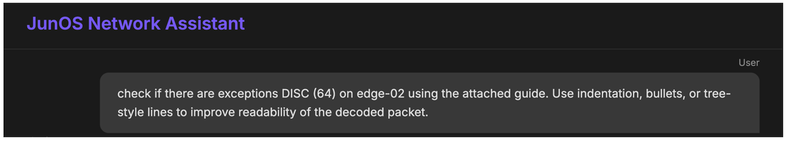
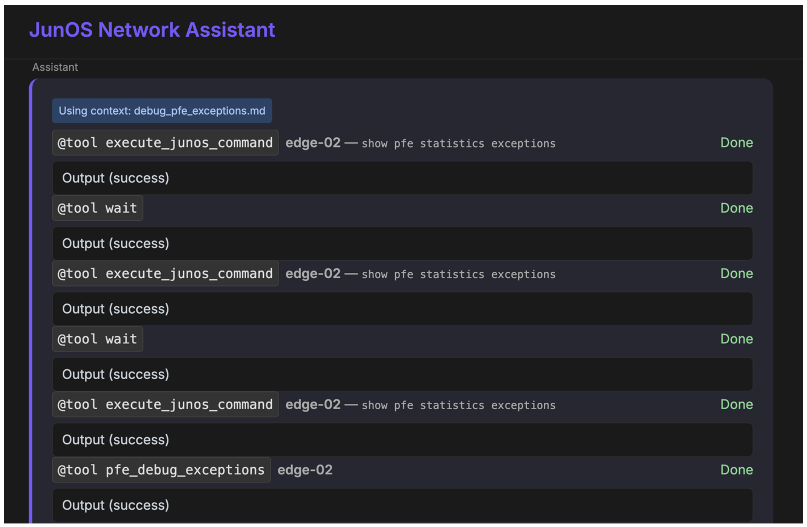
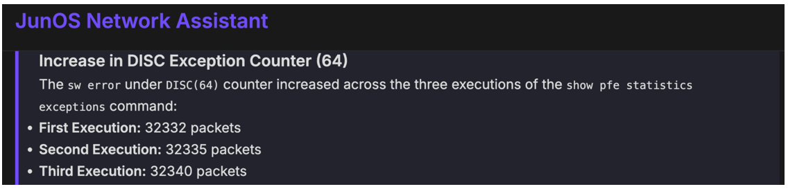
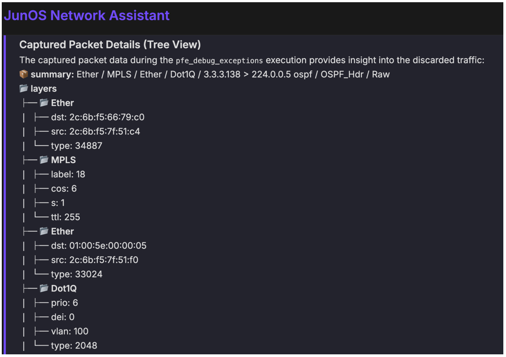

# Debugging PFE exceptions with MCP

**Pablo Sagrera Garcia - 10/08/2025**

***The New Role of the Network Engineer in the Age of AI: Context Is King.***

The arrival of AI in networking is transforming the way we think about operations, automation, and troubleshooting. For years, the skill set of a network engineer has been defined by the ability to configure devices, interpret logs, and script repetitive tasks. But with AI-powered systems entering the workflow, a new layer of responsibility is emerging---one that shifts the focus from just writing commands to providing contextual guidance.

In this new landscape, the network engineer is no longer just an operator or a troubleshooter. Instead, we are becoming context providers: professionals who know how to guide AI systems so they can interpret requests, interact with devices, and deliver meaningful insights.

This article has been prepared and co-written by Pablo Sagrera Garcia and Jose Miguel Izquierdo.

## Why Context Matters More Than Ever

AI models are powerful, but they are not magicians. They don't inherently know the topology of your network, the business-critical services that must be prioritized, or the quirks of your operational workflows. Without the right context, even the most advanced model will struggle to produce results that are useful in a production environment.

This is where the engineer's role becomes essential:

- Defining boundaries. What devices are in scope? Which parameters are critical?
- Clarifying intent. Are we asking for a health check, a configuration validation, or a proactive forecast of resource usage?
- Clarifying request. Turning broad or ambiguous goals like "Check the status of the edge routers" into clear, well-scoped tasks that an AI system can process - for example, specifying which devices, what metrics, and what timeframe.
- Understanding the capabilities and limitations of the agent
- Feeding the agent with the latest documentation, best practices and/or contextual knowledge that might not be part of the training data.

The skill is not in writing the low-level commands anymore, but in crafting the right context so that AI can decide which commands to use, execute them, interpret the results, and if required, report them. Let's take a practical and advanced example: debugging PFE exceptions on microkernel FPCs in Junos devices.

Traditionally, this task requires several manual steps:

- 1- Identify which FPCs are online and discarding packets
- 2- Enter the pfe shell
- 3- Enable and execute ***debug*** commands
- 4- Capture and interpret the output
- 5- Disable debug before closing the session

For an engineer, these steps are straightforward but tedious, and the output can be hard to parse in real time.

## Natural Language + MCP = Simplicity

To explore this idea, I built a simple MCP (Model Context Protocol) client for networking tasks. The client sits between the AI model and the junos-mcp-server, acting as a bridge between natural language requests and the structured operations that the devices expect. We can turn this workflow into a single natural-language request:

```
Check if there are exceptions DISC (64) on edge-02 using the attached guide. 
Use indentation, bullets, or tree-style lines to improve readability of the decoded packet.
```

Behind the scenes, the MCP client takes care of translating this intent into structured requests.

## Adding a new tool to junos-mcp-server

To enable this, I extended the junos-mcp-server with a new tool (pfe_debug_exceptions):

```
{
  "name": "pfe_debug_exceptions",
  "description": "Debugs PFE exceptions on a given FPC",
  "parameters": {
    "type": "object",
    "properties": {
      "device": { "type": "string" },
      "fpc": { "type": "string" },
      "duration": { "type": "integer", "description": "Duration in seconds to run debug" }
    }
}
    "required": ["device", "fpc"]
  }
}
```

*Source*: [add new tool](https://github.com/Juniper/junos-mcp-server?tab=readme-ov-file#adding-a-new-tool)

This tool performs all the required steps:

- 1- SSH into the router
- 2- Enter the PFE shell
- 3- Enable debug:


a. debug jnh exceptions {debug_val} discard

b. debug jnh exceptions-trace

c. test jnh exceptions-trace throttle none

d. show jnh exceptions-trace
- 4- Disable debug


a. undebug jnh exceptions {debug_val} discard

b. undebug jnh exceptions-trace
- 5- Return the captured output

## Providing the Right Context

The key to success here is not just having the tool---it's how we provide context to the model, so it uses the tool correctly. For this use case, I defined the following guide for the MCP client in markdown format, making it more suitable for the model:

```
## PFE EXCEPTION DEBUG

### Scenario

0. Check exception counters

- Run `show pfe statistics exceptions` three times with a 10-second delay between each execution.
- Highlight only the DISC (discard) counters that increased across runs.

1. Capture dropped packets

- If any DISC exception counter increased, capture the dropped packet(s) using the tool `pfe_debug_exceptions`:

  `VMX-0(hl3mmt1-302 vty)# debug jnh exceptions <debug_val> discard`

- Focus on the hex dump section of the output (lines with byte offsets like 0x00 0x10 0x20 ...).

- Retry at least once if no output is returned.

### JSON Decoding Instructions

- The tool will return a JSON with all decoded packet fields.
- Render the JSON in a **human-friendly, indented tree format**.
- Expand nested objects and arrays to show the hierarchy clearly.
```

### Results

Under a minute, the engineer is equipped with clear, actionable insights---without the need to manually issue a series of CLI commands or parse raw traces.

## Showing the final resultThe user submits a question:



The client leverages the MCP server through the LLM, invoking the appropriate tools to execute the required commands



Finally, the client receives the output containing the type of discarded packet along with a brief decoding of the content.





## Final Thoughts

This example shows how AI and MCP can elevate the role of the network engineer. By providing the right tools and the right context, we can transform complex multi-step procedures into simple, natural-language requests.

The engineer's value does not come from manually running show commands, but from designing contextual frameworks that allow AI to execute them safely, ask the right questions, interpret the results accurately, and present the information in a practical and actionable format.

This is the future of networking: less time typing commands, more time interpreting insights and delivering value.

## Useful links

- Junos-mcp-server: [junos-mcp-server](https://github.com/Juniper/junos-mcp-server)
- Day One: [Inside the MX 5G : Day One](https://www.juniper.net/documentation/en_US/day-one-books/DO_MX5G.pdf)
- PFE exceptions monitoring : [open source monitoring of forwarding exceptions](https://juniper.github.io/techposts/open-source-monitoring-of-forwarding-exceptions/article)

## Glossary

- MCP: Model Context Protocol
- LLM: Large Language Model
- FPC: Flexible Port Concentrator
- PFE: Packet Forwarding Engine
- AI: Artificial Intelligence

## Acknowledgements

This article has been prepared and co-written by Pablo Sagrera Garcia and Jose Miguel Izquierdo.
