# Deploying and Using vJunos in a Bare Metal EVE-NG server

**Shalini Mukherjee - 05/11/2023**

vJunos-switch and vJunosEvolved deployed on EVE-NG and integrated with Juniper Apstra to build a complete Data Center fabric.
Article co-written with Aninda Chatterjee and  Shalini Mukherjee, TME in  Juniper Networks Cloud-Ready Data Center team.

## Introduction

In this article, we will look at how vJunos-switch and vJunosEvolved is deployed on a bare metal install of EVE-NG. This deployment will then be used to integrate with Juniper Apstra and build a complete Data Center fabric.

We'll start with instructions on how to deploy EVE-NG as a bare metal install on an Ubuntu server and run through the EVE-NG installation itself as an example of how this can be done.  Once EVE-NG is setup, we'll show how vJunos-switch and vJunosEvolved can be added to EVE-NG as a deployable node and the EVE-NG template that is needed for this to work.

Finally, we'll wrap this up by onboarding vJunos-switch and vJunosEvolved devices in Juniper Apstra and building a simple Data Center fabric to show that these devices work seamlessly with Apstra as well.

> Note that another post on [vJunos installation on KVM](https://juniper.github.io/techposts/vjunos-deployment-on-kvm/article) has been published too.

### What is EVE-NG and vJunos-switch/vJunosEvolved?

EVE-NG is a popular network emulation software that offers multivendor support. It allows a user to build network topologies on a blank canvas, providing means to test and simulate various network technologies and features across different network operating systems and products.

EVE-NG has various deployment options:

- as a VM on top of a hypervisor like ESXi
- over a bare metal server
- cloud deployment options (like GCP)

vJunos-switch and vJunosEvolved are two new virtual software offerings from Juniper Networks. vJunos-switch emulates the software functionality of Junos OS while vJunosEvolved emulates the software functionality of Junos EVO.

Since vJunos-switch is only supported on a bare metal install of EVE-NG, that is the deployment option we'll be going through in this blog post.

## Installing EVE-NG on a Bare Metal Ubuntu Server

EVE-NG comes in two flavors: a community (free) edition, and a professional (paid) edition. We'll take a look at how to do a bare metal EVE-NG community edition install in this post, since that is more complicated. The .iso file for the community edition can be downloaded from the EVE-NG website - [https://www.eve-ng.net/index.php/download/](https://www.eve-ng.net/index.php/download/)

Once this file is downloaded, mount the .iso file on your local machine. For example, on a MAC, you can simply double click the file to mount it. This should create a new drive, whose contents can be accessed now:

```
anindac@ubuntu EVE-NG Community % ls -l
total 216
dr-xr-xr-x  3 aninchat  staff   2048 Feb 23  2022 EFI
dr-xr-xr-x  3 aninchat  staff   2048 Feb 23  2022 boot
dr-xr-xr-x  3 aninchat  staff   2048 Feb 23  2022 casper
dr-xr-xr-x  3 aninchat  staff   2048 Feb 23  2022 dists
dr-xr-xr-x  2 aninchat  staff   2048 Feb 23  2022 install
dr-xr-xr-x  2 aninchat  staff  36864 Feb 23  2022 isolinux
-r--r--r--  1 aninchat  staff  27257 May 21  2022 md5sum.txt
-r--r--r--  1 aninchat  staff  27389 Feb 23  2022 md5sum.txt.orig
dr-xr-xr-x  3 aninchat  staff   2048 Feb 23  2022 pool
dr-xr-xr-x  2 aninchat  staff   2048 Feb 23  2022 preseed
dr-xr-xr-x  2 aninchat  staff   2048 May 20  2022 server
```

Here, should see a folder titled 'server'. This has a shell script that installs EVE-NG as a bare metal install. The script is as follows:

```
anindac@ubuntu EVE-NG Community % cd server
anindac@ubuntu server % ls -l
total 8
-r-xr-xr-x  1 aninchat  staff  802 May 20  2022 eve-setup.sh
-r--r--r--  1 aninchat  staff    0 May 14  2022 meta-data
-r--r--r--  1 aninchat  staff  956 May 20  2022 user-data

anindac@ubuntu server % cat eve-setup.sh
#!/bin/sh
#Modify /etc/ssh/sshd_config with: PermitRootLogin yes
sed -i -e "s/.*PermitRootLogin .*/PermitRootLogin yes/" /etc/ssh/sshd_config
sed -i -e 's/.*DefaultTimeoutStopSec=.*/DefaultTimeoutStopSec=5s/' /etc/systemd/system.conf
systemctl restart ssh
apt-get update
apt-get -y install software-properties-common
wget -O - http://www.eve-ng.net/focal/eczema@ecze.com.gpg.key | sudo apt-key add -
sudo add-apt-repository "deb [arch=amd64]  http://www.eve-ng.net/focal focal main"
apt-get update
DEBIAN_FRONTEND=noninteractive apt-get -y install eve-ng
/etc/init.d/mysql restart
DEBIAN_FRONTEND=noninteractive apt-get -y install eve-ng
echo root:eve | chpasswd
ROOTLV=$(mount | grep ' / ' | awk '{print $1}')
echo $ROOTLV
lvextend -l +100%FREE $ROOTLV
echo Resizing ROOT FS
resize2fs $ROOTLV
reboot
```

On your Ubuntu 20.04 server, simply run through these steps one by one. Once you reboot (the final step of the script), and the server comes back online, you should be able to SSH into the device with the default credentials of root/eve.

Once you've logged in, the actual EVE-NG installation is kicked off -- this includes providing a hostname, IP address and gateway, primary and secondary DNS servers, NTP servers and so on. When this finishes, EVE-NG should be up and running, and accessible via both the CLI and UI (default credentials for UI login is admin/eve).

To deploy the professional version of EVE-NG, similar steps can be followed. Alternatively, the .iso file can be mounted directly as a virtual drive and you can boot from it to start both the Ubuntu and the EVE-NG installation together.

### Deploying vJunos-switch and vJunosEvolved in EVE-NG

EVE-NG uses templates to boot various operating systems it supports -- these templates are pre-built and come packaged within the installation of EVE-NG. They contain instructions on how to boot the devices, including how many interfaces to assign to the device, the kind of CPU/memory the device needs and so on.

The templates are stored in the path '*/opt/unetlab/html/templates/intel/*' and are written in YAML format, as seen below:

```
root@eve-ng:/opt/unetlab/html/templates/intel# ls -l
total 588
-rw-r--r-- 1 root root   10 Jan 31 07:15 '*.yml'
-rw-r--r-- 1 root root 1944 May 14  2022  128T.yml
-rw-r--r-- 1 root root 1853 May 14  2022  a10.yml
-rw-r--r-- 1 root root 1897 May 14  2022  acs.yml
-rw-r--r-- 1 root root 1913 May 14  2022  alienvault.yml
-rw-r--r-- 1 root root 1911 May 14  2022  alteon.yml
-rw-r--r-- 1 root root 1848 May 14  2022  ampcloud.yml
-rw-r--r-- 1 root root 1885 May 14  2022  android.yml
-rw-r--r-- 1 root root 1921 Jan 31 07:15  aos.yml
-rw-r--r-- 1 root root 1890 May 14  2022  apicem.yml
-rw-r--r-- 1 root root 1952 May 14  2022  apstra-aos.yml
-rw-r--r-- 1 root root 1951 May 14  2022  apstra-ztp.yml
-rw-r--r-- 1 root root 1950 May 14  2022  aruba.yml
-rw-r--r-- 1 root root 1919 May 14  2022  arubaamp.yml
-rw-r--r-- 1 root root 2002 May 14  2022  arubacx.yml
-rw-r--r-- 1 root root 1930 May 14  2022  arubanet.yml
-rw-r--r-- 1 root root 1971 May 14  2022  asa.yml
-rw-r--r-- 1 root root 1950 May 14  2022  asav.yml
-rw-r--r-- 1 root root 1899 May 14  2022  barracuda.yml
-rw-r--r-- 1 root root 1930 May 14  2022  bigip.yml
-rw-r--r-- 1 root root 1915 May 14  2022  brocadevadx.yml
-rw-r--r-- 1 root root 1829 May 14  2022  c1710.yml
-rw-r--r-- 1 root root 1931 May 14  2022  c3725.yml
-rw-r--r-- 1 root root 1993 May 14  2022  c7200.yml
-rw-r--r-- 1 root root 2017 May 14  2022  c8000v.yml
-rw-r--r-- 1 root root 1944 May 14  2022  c9800cl.yml
-rw-r--r-- 1 root root 1839 May 14  2022  cda.yml
-rw-r--r-- 1 root root 1981 May 14  2022  cexpresw.yml
-rw-r--r-- 1 root root 1973 May 14  2022  cips.yml
-rw-r--r-- 1 root root 1974 Jul  8  2022  clavisterc.yml
-rw-r--r-- 1 root root 1925 May 14  2022  clearpass.yml
-rw-r--r-- 1 root root 1917 May 14  2022  cms.yml
-rw-r--r-- 1 root root 1862 May 14  2022  coeus.yml
-rw-r--r-- 1 root root 1935 May 14  2022  cpsg.yml
-rw-r--r-- 1 root root 1938 May 14  2022  csr1000v.yml
-rw-r--r-- 1 root root 1967 May 14  2022  csr1000vng.yml
-rw-r--r-- 1 root root 1997 May 14  2022  ctxsdw.yml
-rw-r--r-- 1 root root 1966 May 14  2022  cuc.yml
-rw-r--r-- 1 root root 1931 May 14  2022  cucm.yml
-rw-r--r-- 1 root root 1909 May 14  2022  cue.yml
-rw-r--r-- 1 root root 1870 May 14  2022  cumulus.yml
-rw-r--r-- 1 root root 1998 May 14  2022  cup.yml
-rw-r--r-- 1 root root 1955 May 14  2022  cvp.yml
-rw-r--r-- 1 root root 1878 May 14  2022  cyberoam.yml
-rw-r--r-- 1 root root 1957 May 14  2022  dcnm.yml
-rw-r--r-- 1 root root 1969 May 14  2022  dellos10.yml
-rw-r--r-- 1 root root 1769 May 14  2022  docker.yml
-rw-r--r-- 1 root root 1920 May 14  2022  esxi.yml
-rw-r--r-- 1 root root 1862 May 14  2022  extremexos.yml
-rw-r--r-- 1 root root 1898 May 14  2022  firepower.yml

*snip*
```

Since vJunos-switch and vJunosEvolved are entirely new offerings, there is no pre-built template for this. The template must be created manually. The following templates can be used for vJunos-switch and vJunosEvolved:

vJunosEvolved:

```
root@eve-ng:/opt/unetlab/html/templates/intel# cat vJunosEVO.yml 
---
type: qemu
description: vJunosEvolved
name: vJunosEvolved
cpulimit: 4
icon: JunipervQFXre.png
cpu: 4
ram: 8192
shutdown: 1
eth_name:
        - re0:mgmt-0
        - et-0/0/0
        - et-0/0/1
        - et-0/0/2
        - et-0/0/3
        - et-0/0/4
        - et-0/0/5
        - et-0/0/6
        - et-0/0/7
        - et-0/0/8
        - et-0/0/9
        - et-0/0/10
        - et-0/0/11
ethernet: 13
console: telnet
qemu_arch: x86_64
qemu_version: 4.1.0
qemu_nic: virtio-net-pci
qemu_options: -machine type=pc,accel=kvm -serial mon:stdio -nographic -smbios type=0,vendor=Bochs,version=Bochs -smbios type=3,manufacturer=Bochs -smbios type=1,product=Bochs,manufacturer=Bochs,serial=chassis_no=0:slot=0:type=1:assembly_id=0x0D20:platform=251:master=0:channelized=no -cpu IvyBridge,ibpb=on,md-clear=on,spec-ctrl=on,ssbd=on
```

vJunos-switch:

```
root@eve-ng:/opt/unetlab/html/templates/intel# cat vJunosswitch.yml 
---
type: qemu
description: vJunos-switch
name: vJunos-switch
cpulimit: 4
icon: JunipervQFXre.png
cpu: 4
ram: 5120
eth_name:
- fxp0
- ge-0/0/0
- ge-0/0/1
- ge-0/0/2
- ge-0/0/3
- ge-0/0/4
- ge-0/0/5
- ge-0/0/6
- ge-0/0/7
- ge-0/0/8
- ge-0/0/9
ethernet: 11
console: telnet
qemu_arch: x86_64
qemu_version: 4.1.0
qemu_nic: virtio-net-pci
qemu_options: -machine type=pc,accel=kvm -serial mon:stdio -nographic -smbios type=1,product=VM-VEX -cpu IvyBridge,ibpb=on,md-clear=on,spec-ctrl=on,ssbd=on,vmx=on
```

The next step is to create a new directory for this device and copy the image to this directory. We'll create a directory with the prefix 'vJunosEVO' and 'vJunos-switch' followed by a suffix which specifies the version of the software image. The prefix naming convention is important -- it must match the name of the template that exists for the device. EVE-NG uses this name to determine which template must be used to boot the device (hence, the need for them to match).

The images (and their directories) are stored under '*/opt/unetlab/addons/qemu/*'.

```
root@eve-ng:/opt/unetlab/addons/qemu# pwd
/opt/unetlab/addons/qemu
root@eve-ng:/opt/unetlab/addons/qemu# mkdir vJunosEVO-23.2R1

root@eve-ng:/opt/unetlab/addons/qemu# cd vJunosEVO-23.2R1/
root@eve-ng:/opt/unetlab/addons/qemu/vJunosEVO-23.2R1# ls -l
total 1714308
-rw-r--r-- 1 root root 1755447296 Mar 14 00:14 virtioa.qcow2
```

and

```
root@eve-ng:/opt/unetlab/addons/qemu# pwd
/opt/unetlab/addons/qemu
root@eve-ng:/opt/unetlab/addons/qemu# mkdir vJunosswitch-23.2R1

root@eve-ng:/opt/unetlab/addons/qemu# cd vJunosswitch-23.2R1/
root@eve-ng:/opt/unetlab/addons/qemu/vJunosswitch-23.2R1# ls -l
total 3850436
-rw-r--r-- 1 root root 3942842368 Feb 25 11:15 vjunos-switch-23.2R1.qcow2
```

Once the image is copied into the folder, it must be renamed to 'virtioa.qcow2' as per EVE-NGs naming convention. Finally, EVE-NG requires you to fix some permissions to use the image - they have a pre-built script for this which can be invoked using '*/opt/unetlab/wrappers/unl_wrapper -a fixpermissions*' as seen below:

```
root@eve-ng:/opt/unetlab/addons/qemu/vJunosEVO-23.2R1# mv vjunosEVO-23.2R1.qcow2 virtioa.qcow2
root@eve-ng:/opt/unetlab/addons/qemu/vJunosEVO-23.2R1# /opt/unetlab/wrappers/unl_wrapper -a fixpermissions
```

and

```
root@eve-ng:/opt/unetlab/addons/qemu/vJunosswitch-23.2R1# mv vjunos-switch-23.2R1.qcow2 virtioa.qcow2
root@eve-ng:/opt/unetlab/addons/qemu/vJunosswitch-23.2R1# /opt/unetlab/wrappers/unl_wrapper -a fixpermissions
```

On the EVE-NG UI, you should see 'vJunosEvolved' and 'vJunos-switch' as a device available to use and deploy:

vJunosEvolved:


vJunos-switch:

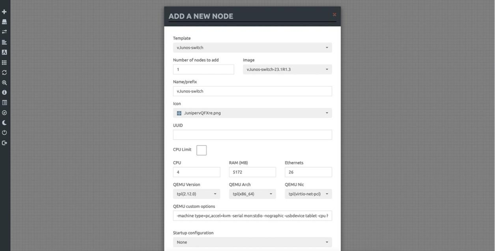

These devices can now be deployed and interconnected. To interconnect two devices, simply click on the orange icon seen when you hover over a node, as seen below:


Once clicked, you can drag it to the destination node and let the connector go, which then gives you a pop-up to choose which interface is being connected on each side, like below:

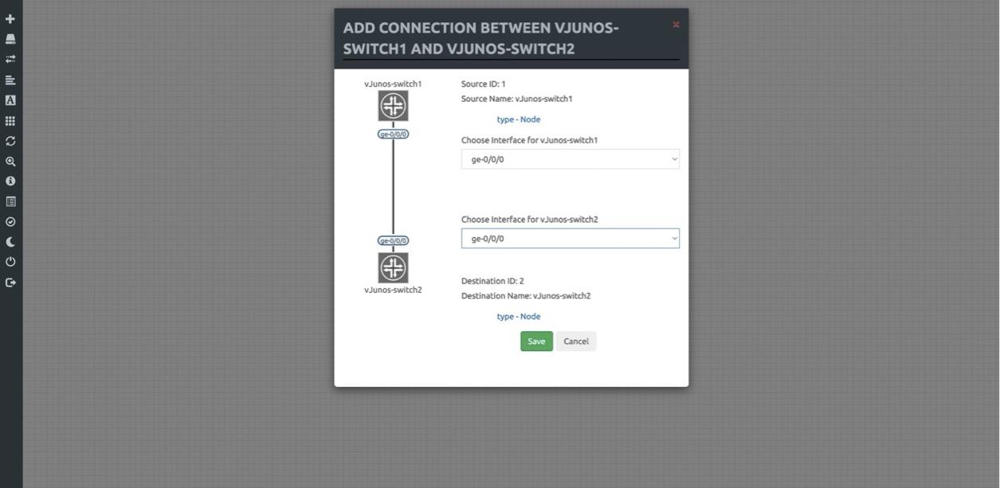

To demonstrate the use of vJunos-switch and vJunosEvolved, we've built the following topology on EVE-NG, respectively:

For vJunosEvolved:

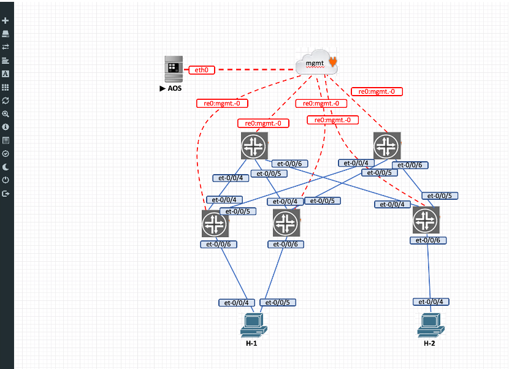

The topology is a typical 3-stage Clos fabric, with two spines and three leafs. Two leafs (leaf1 and leaf2) are ESI peers and connect down to the same host, h1. The end goal is to manage these devices via Juniper Apstra and use Apstra to deploy all the necessary configuration to build a fabric and provide reachability between hosts h1 and h2, which are in the same subnet.

vJunos-switch:

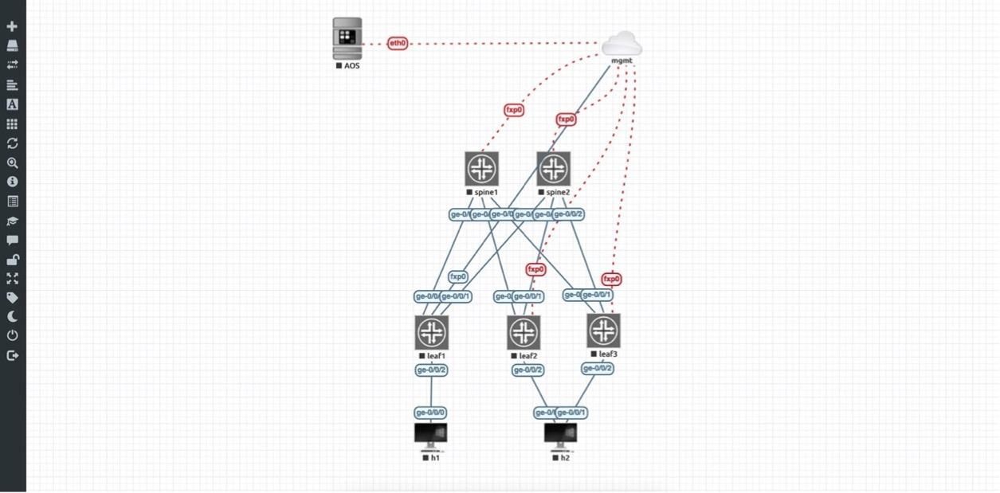

This topology also is with two spines and 3 leafs. Two leafs (leaf2 and leaf3) are ESI peers and connect down to the same host, h2.

### Deploying Juniper Apstra in EVE-NG

As seen in the topology above, we also have Juniper Apstra deployed within EVE-NG itself. For the sake of completeness, we'll also document how this is done.

The Juniper Apstra KVM image can be downloaded from the Juniper software downloads page - [https://support.juniper.net/support/downloads/](https://support.juniper.net/support/downloads/)

The image is zipped with an extension of gz. Once unzipped, move the file to a folder created with the EVE-NG naming convention for Apstra -- the directory must start with the prefix 'aos' and you can include the Apstra version as a suffix for easy identification of the image version. For example, we have created a folder named 'aos-4.1.2-269' and the image is under that. The image is finally renamed to 'hda.qcow2':

```
root@eve-ng:/opt/unetlab/addons/qemu# cd aos-4.1.2-269/
root@eve-ng:/opt/unetlab/addons/qemu/aos-4.1.2-269# ls -l
total 2762612
-rw-r--r-- 1 root root 2828908544 Feb 25 12:14 hda.qcow2
```

The following template can be used for Apstra:

```
root@eve-ng:/opt/unetlab/html/templates/intel# cat aos.yml 
---
type: qemu
name: AOS
description: Apstra AOS Server
cpulimit: 1
icon: apstra.png
cpu: 8
ram: 16384
ethernet: 1
eth_format: eth{0}
console: telnet
shutdown: 1
qemu_arch: x86_64
qemu_version: 2.12.0
qemu_nic: virtio-net-pci
qemu_options: -machine type=pc,accel=kvm -vga std -usbdevice tablet -boot order=cd
...
```

The Apstra server can now be started, and some basic bootstrapping is needed -- the Apstra service needs to be started, along with setting a password for the CLI and UI. Apstra allows you to pull an IP address via DHCP or set one up manually as well.

### Deploying a vJunosEvolved and vJunos-switch based fabric in Juniper Apstra

Now that we have all our pieces in EVE-NG, we can start to build the fabric. Nodes can be started from the EVE-NG UI by right-clicking on them and simply choosing 'Start'. Once the spines and the leafs are assigned IP addresses via DHCP, we can onboard them into Apstra.

Since the current version of Apstra has not been updated with the vJunos-switch or vJunosEvolved versions, we need to make some adjustments. We will create a new 'Device Profile' for vJunosEvolved by simply cloning the Juniper PTX10001-36MR device profile and for vJunos-switch, we'll clone the Juniper vEX device profile.

For vJunosEvolved:

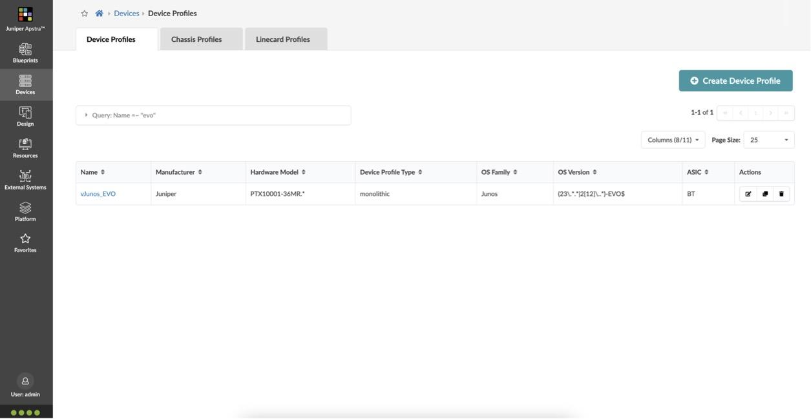

For vJunos-switch:

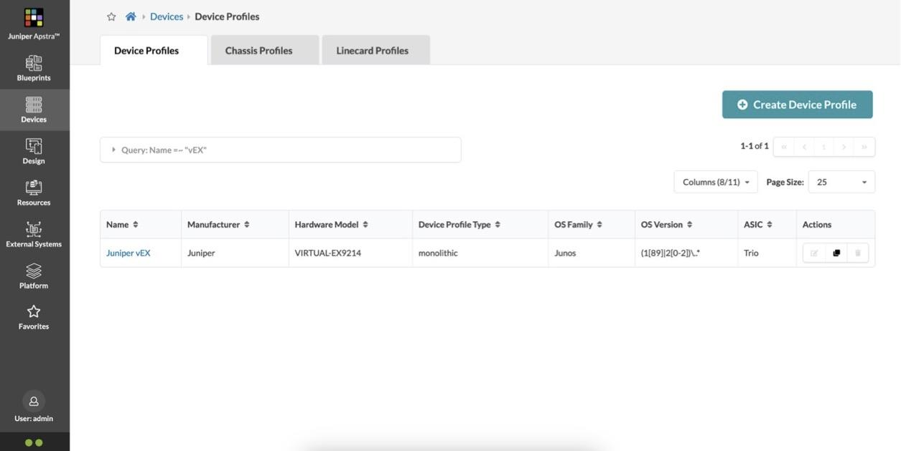

The important change in these device profiles is to extend selector to include version '23' like below:

For vJunos-switch:

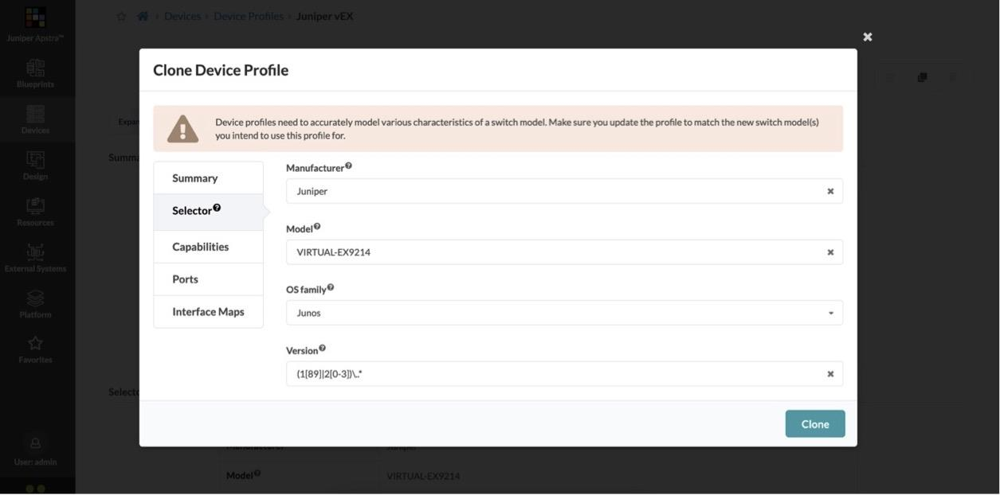

For vJunosEvolved:

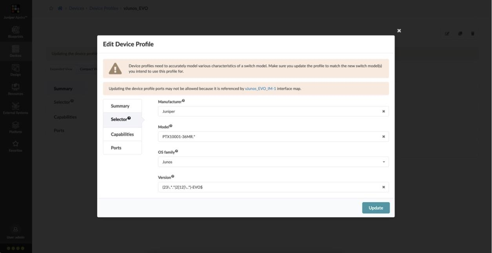

The next step is to create a 'Logical Device' and 'Interface Map' in Apstra for these devices. The Logical Device simply creates the port grouping as below:

For vJunos-switch:

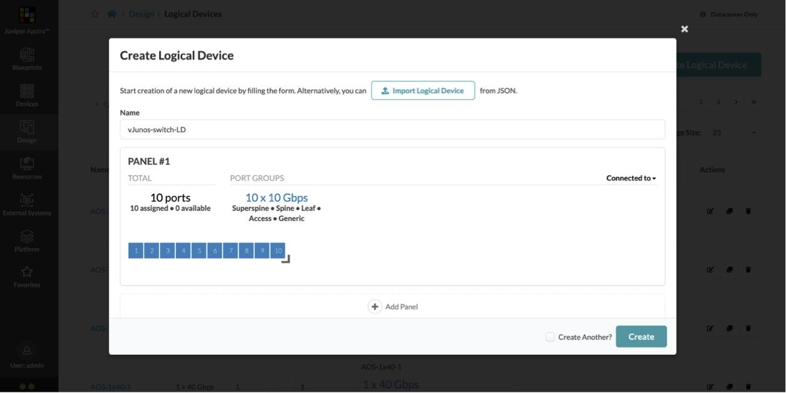

For vJunosEvolved:

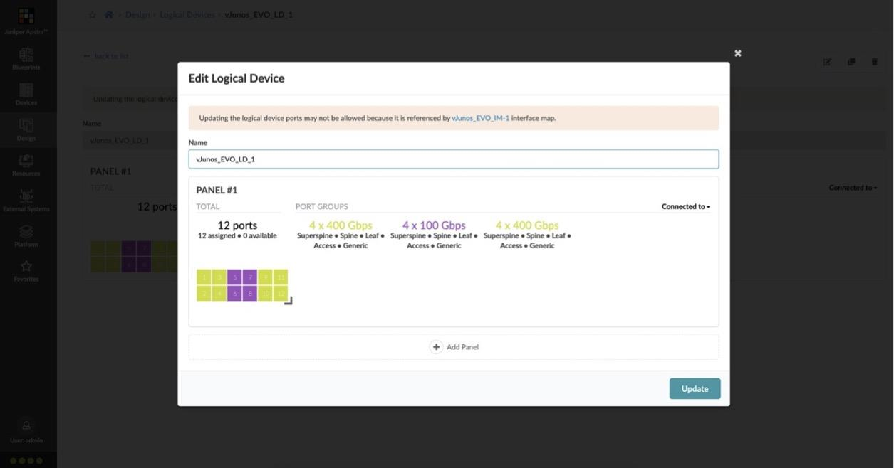

The Interface Map creates the appropriate transformation (naming convention for interfaces, speed, port breakouts and so on) and glues together a logical device and a device profile:

For vJunos-switch:

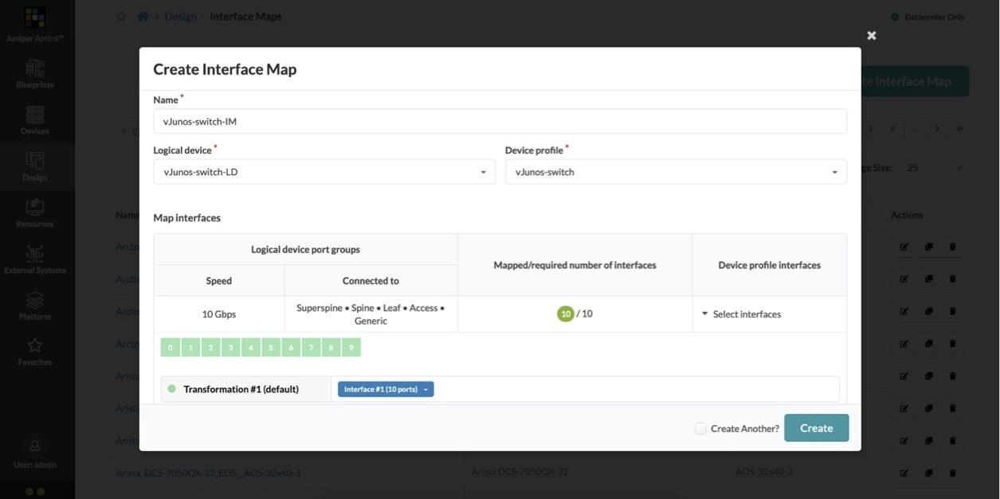

For vJunosEvolved:

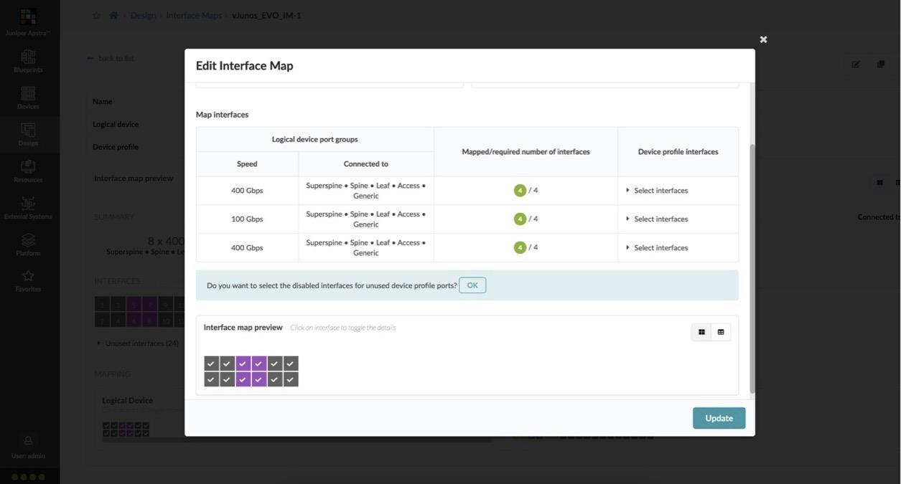

Once all of this is configured, we can start building our racks and templates. The template is finally fed into a blueprint, an example of which we've deployed below:

For vJunos-switch:

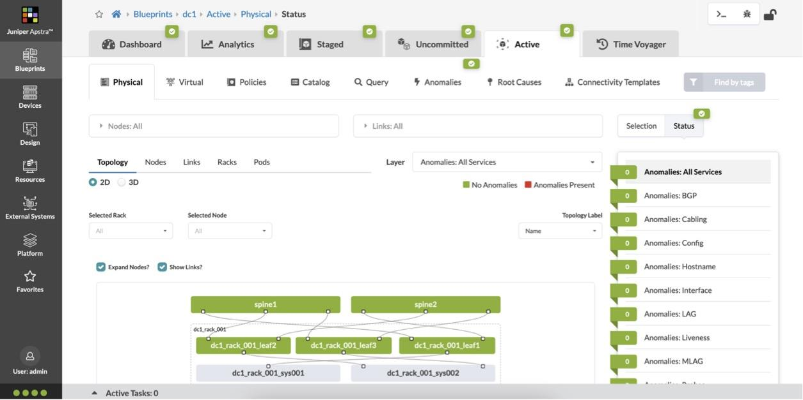

This blueprint includes host h1 which is single attached to leaf1 and host h2 which is dual homed to leaf2 and leaf3.

For vJunosEvolved:

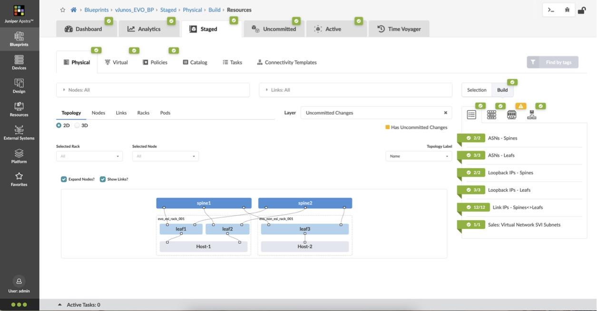

This blueprint includes host h1 which is dual-homed to leaf1 and leaf2 and host h2 which is attached to leaf3, configuration for which is fully automated and deployed by Apstra (ESI LAG on the leafs).

For vJunosEvolved, we need a specific knob for tunnel termination ('set forwarding-options tunnel-termination') for EVPN VXLAN from release 23.1 onwards. In Apstra, this is created via a configlet and imported into to the leafs.

The configlet can be created as follows:

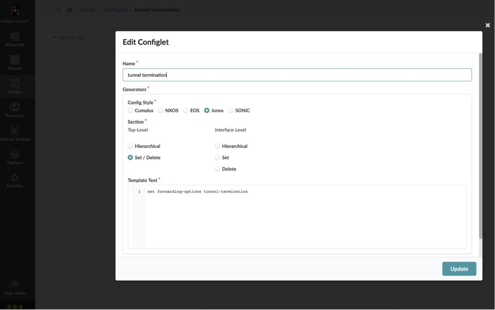

To import the configlet into the blueprint and apply it to the leafs, the following is done:

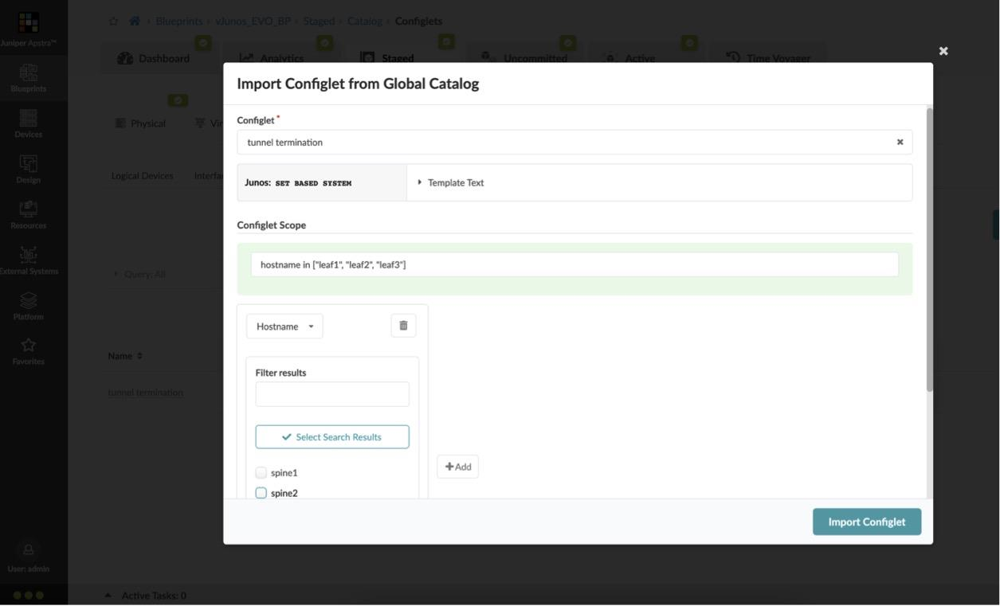

At the end of this, we have our inet (IPv4) as well as the BGP EVPN peering up between the leafs and spines. For the sake of brevity, outputs are shown from the vJunosEvolved deployment only:

```
root@spine1> show bgp summary 

Warning: License key missing; requires 'bgp' license

Threading mode: BGP I/O
Default eBGP mode: advertise - accept, receive - accept
Groups: 2 Peers: 6 Down peers: 0
Table          Tot Paths  Act Paths Suppressed    History Damp State    Pending
inet.0               
                      12          9          0          0          0          0
bgp.evpn.0           
                      19         19          0          0          0          0
Peer                     AS      InPkt     OutPkt    OutQ   Flaps Last Up/Dwn State|#Active/Received/Accepted/Damped...
10.1.1.1              64514        147        147       0       0     1:05:18 Establ
  inet.0: 3/4/4/0
10.1.1.3              64515        148        148       0       0     1:05:27 Establ
  inet.0: 3/4/4/0
10.1.1.5              64516        148        148       0       0     1:05:34 Establ
  inet.0: 3/4/4/0
172.16.1.2            64514        155        153       0       0     1:05:11 Establ
  bgp.evpn.0: 8/8/8/0
172.16.1.3            64515        154        155       0       0     1:05:19 Establ
  bgp.evpn.0: 8/8/8/0
172.16.1.4            64516        148        161       0       0     1:05:15 Establ
  bgp.evpn.0: 3/3/3/0

root@spine2> show bgp summary 

Warning: License key missing; requires 'bgp' license

Threading mode: BGP I/O
Default eBGP mode: advertise - accept, receive - accept
Groups: 2 Peers: 6 Down peers: 0
Table          Tot Paths  Act Paths Suppressed    History Damp State    Pending
inet.0               
                      12          6          0          0          0          0
bgp.evpn.0           
                      19         19          0          0          0          0
Peer                     AS      InPkt     OutPkt    OutQ   Flaps Last Up/Dwn State|#Active/Received/Accepted/Damped...
10.1.1.7              64514        149        149       0       0     1:05:45 Establ
  inet.0: 2/4/4/0
10.1.1.9              64515        149        149       0       0     1:06:04 Establ
  inet.0: 2/4/4/0
10.1.1.11             64516        149        149       0       0     1:06:12 Establ
  inet.0: 2/4/4/0
172.16.1.2            64514        155        154       0       0     1:05:39 Establ
  bgp.evpn.0: 8/8/8/0
172.16.1.3            64515        155        156       0       0     1:05:50 Establ
  bgp.evpn.0: 8/8/8/0
172.16.1.4            64516        150        161       0       0     1:06:10 Establ
  bgp.evpn.0: 3/3/3/0
```

LACP is up between leaf2/leaf3 and host h2:

```
root@leaf1> show lacp interfaces ae1 extensive 
Aggregated interface: ae1
    LACP state:       Role   Exp   Def  Dist  Col  Syn  Aggr  Timeout  Activity
      et-0/0/6       Actor    No    No   Yes  Yes  Yes   Yes     Fast    Active
      et-0/0/6     Partner    No    No   Yes  Yes  Yes   Yes     Fast    Active
    LACP protocol:        Receive State  Transmit State          Mux State 
      et-0/0/6                  Current   Fast periodic Collecting distributing
    LACP info:        Role     System             System       Port     Port    Port 
                             priority         identifier   priority   number     key 
      et-0/0/6       Actor        127  02:00:00:00:00:01        127        1       2
      et-0/0/6     Partner        127  02:7b:fd:62:05:d5        127        1       2


root@leaf2> show lacp interfaces ae1 extensive 
Aggregated interface: ae1
    LACP state:       Role   Exp   Def  Dist  Col  Syn  Aggr  Timeout  Activity
      et-0/0/6       Actor    No    No   Yes  Yes  Yes   Yes     Fast    Active
      et-0/0/6     Partner    No    No   Yes  Yes  Yes   Yes     Fast    Active
    LACP protocol:        Receive State  Transmit State          Mux State 
      et-0/0/6                  Current   Fast periodic Collecting distributing
    LACP info:        Role     System             System       Port     Port    Port 
                             priority         identifier   priority   number     key 
      et-0/0/6       Actor        127  02:00:00:00:00:01        127        1       2
      et-0/0/6     Partner        127  02:7b:fd:62:05:d5        127        2       2
```

The hosts can ping each other as well:

```
h2> ping 192.168.101.11  
PING 192.168.101.11 (192.168.101.11) 56(84) bytes of data.
64 bytes from 192.168.101.11: icmp_seq=1 ttl=64 time=2.89 ms
64 bytes from 192.168.101.11: icmp_seq=2 ttl=64 time=1.21 ms
64 bytes from 192.168.101.11: icmp_seq=3 ttl=64 time=0.474 ms
64 bytes from 192.168.101.11: icmp_seq=4 ttl=64 time=0.519 ms
64 bytes from 192.168.101.11: icmp_seq=5 ttl=64 time=0.535 ms
64 bytes from 192.168.101.11: icmp_seq=6 ttl=64 time=0.752 ms
^C
--- 192.168.101.11 ping statistics ---
6 packets transmitted, 6 received, 0% packet loss, time 5008ms
rtt min/avg/max/mdev = 0.474/1.064/2.892/0.854 ms
```

### Shutting down vJunos-switch in EVE-NG

EVE-NG offers multiple ways to shut down a node -- this includes a graceful shutdown, a poweroff (not graceful) and a hibernate option. These options can be seen below when right-clicking on a node and clicking on 'Stop' (EVE-NG Professional shown below):

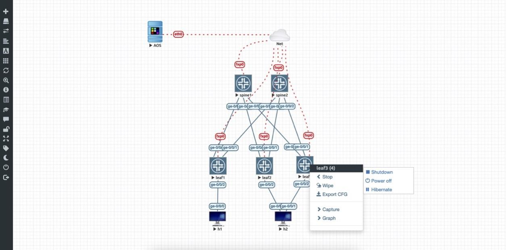

It is important to shut down the device gracefully (using the 'Shutdown' option). A power off (which is not graceful) has the potential of corruption the disk, rendering the device unusable. In EVE-NG community edition, issue a 'request system poweroff' prior to shutting down the node via the UI, since these options are not available in the UI itself in this edition.

## Summary

Through this post, we were able to demonstrate a working deployment of Juniper's new virtual offering, vJunos-switch and vJunosEvolved, in EVE-NG and integrate it with Juniper Apstra to deploy a Data Center fabric.

## Useful links

- vJunos-switch: [https://support.juniper.net/support/downloads/?p=vjunos](https://support.juniper.net/support/downloads/?p=vjunos)
- vJunosEvolved: [https://support.juniper.net/support/downloads/?p=vjunos-evolved](https://support.juniper.net/support/downloads/?p=vjunos-evolved)
- EVE-NG home page: [https://www.eve-ng.net/](https://www.eve-ng.net/)
- Juniper Apstra documentation - [https://www.juniper.net/documentation/product/us/en/apstra/](https://www.juniper.net/documentation/product/us/en/apstra/)
- vJunos Installation on KVM: [https://juniper.github.io/techposts/vjunos-deployment-on-kvm/article](https://juniper.github.io/techposts/vjunos-deployment-on-kvm/article)

## Acknowledgments

We would like to thank TME Manager Ridha Hamidi, Product Manager Yogesh Kumar, and the entire Juniper engineering staff, led by Art Stine and Kaveh Moezzi, behind this product for their guidance and help. Thanks to Christian Scholz for additional feedback provided after the publication.
